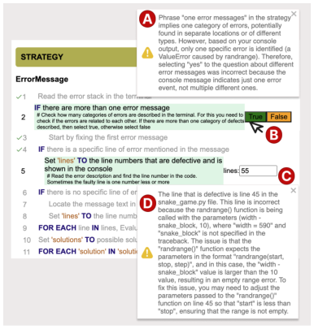
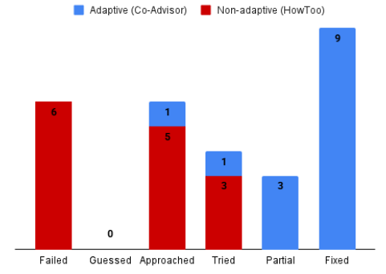
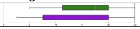
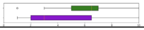

<!-- Source PDF SHA-256: a6cbe0f145bd8deeb0d96265456b98d5dc3810f7325bf49eebf7d140deedcdcb -->

# Co-Advisor: Learning Programming Strategies in Context

[Source PDF](https://from.so/assets/pdfs/arab-co-advisor-vlhcc2025.pdf) · [Publisher page](https://doi.org/10.1109/vl-hcc65237.2025.00045)

Maryam Arab School of Information University of Michigan Ann Arbor, MI USA maryarab@umich.edu

Hanning Li Computer Science &amp; Engineering University of Michigan Ann Arbor, MI USA lhanning@umich.edu

Rushal Butala School of Information University of Michigan Ann Arbor, MI USA rbutala@umich.edu

Steve Oney School of Information University of Michigan Ann Arbor, USA soney@umich.edu

Abstract—Programming instruction often focuses on syntax and algorithms. However, mastering programming also requires building strategic knowledge of skills such as debugging, problem solving, and program design. These critical skills are difficult to teach explicitly because they often involve tacit knowledge, context-specific understanding, and adaptive decision-making. Large Language Models (LLMs) can be effective in helping with syntactic and algorithmic questions but can fail to provide strategic knowledge. This is partly because strategic knowledge involves nuanced contexts that span code and runtime states, requires subjective judgments, and dynamically evolves based on the outcomes of users’ actions. We introduce Co-Advisor, a context-aware strategy recommendation tool that leverages LLM to evaluate problem context and monitor the programmer’s actions to provide personalized constructive feedback. Unlike prior work, Co-Advisor can dynamically align expert strategies with real-time programmer actions and code context, offering actionable, personalized strategic knowledge. In a formative evaluation with 14 programmers involved in two debugging tasks, we found that those using Co-Advisor to receive context-related feedback alongside expert strategies were significantly more successful than those without context-related feedback. They demonstrated greater engagement and had an improved learning experience, gaining insight into the reasons behind their mistakes, correcting them, and understanding the rationale behind their actions. Thus, Co-Advisor enhances conceptual understanding and strategic problem-solving.

Index Terms—Debugging strategies, learning programming, cognitive skills, programming education.

## I. INTRODUCTION

Programming learners must grasp programming semantics \[1\], recognize computational patterns \[2\], and adapt to evolving APIs and tools \[3\]. Mastering programming involves acquiring a range of skills, including debugging, program design, self-regulation, and learning strategies for problem solving. All of these are essential for effectively managing learning processes and tackling real-world problems \[4\]. The complexity of these tasks demands innovative teaching methodologies to support the comprehensive acquisition of these skills \[4\], \[5\].

Despite the importance of solid technical instruction, traditional methods often fail to impart the strategic knowledge necessary for effective problem-solving. Strategic knowledge— context-sensitive tactics for how to approach problems—is challenging to teach explicitly and is often gained through trial and error. Developers need different strategies for similar problems, as one size does not fit all. Their unique skills and contexts require customized guidance \[6\].

Fig. 1. A sample explicit debugging strategy that helps developers to diagnose an error in the code.

One way to represent strategic knowledge in previous work is as a semiformal process that describes a series of actions in which the developer is responsible for reasoning and decision making and the computer helps structure processes and persist information \[6\]. Figure 1 shows an example of a strategy for debugging to diagnose an error in the code that gives the steps to follow to solve the error. Previous work showed that following these structured explicit strategies makes developers more successful and structured in their work \[7\]. Other prior work implemented HowToo, a platform that collects general strategies from experts to solve problems. However, no work has been done on learning how developers can apply and learn these strategies in the context of their problem, and how learning these strategies in context affects their problem-solving behavior and outcomes.

Although Large Language Models (LLMs) offer context-specific advice, using them to teach strategic knowledge poses significant challenges. First, LLM suggestions may not match instructors’ educational goals and may even provide answers that bypass the intended learning process. Second, determining the optimal next step requires analyzing more than just code; factors such as runtime states and interaction histories may be important to consider but can be difficult for users to capture and communicate to LLMs. Finally, ideal strategies must adapt dynamically based on the results of users’ actions, whereas LLM responses are typically static and offer single-turn responses without dynamic updates.

To bridge this gap, we present Co-Advisor, a context-aware strategy recommendation system. Co-Advisor integrates with Visual Studio Code to access developers’ code and runtime state. Co-Advisor first leverages LLMs to evaluate users’ problem context, working environments, and execution logs to generate a list of problem context attributes. Then a mapping algorithm is designed to map the context attributes to a pool of expert debugging strategies to offer the relevant strategy to developers. As the developer works through a selected strategy, Co-Advisor tracks their actions and progress through each step, dynamically adapting the strategy content and providing targeted feedback to support learning.

To evaluate Co-Advisor, we conducted a formative evaluation with programmers who have less than three years of experience to investigate how Co-Advisor helps or hinders them in their learning strategies, problem solving skills, and progress. The participants completed two debugging tasks using expert debugging strategies with and without the support of Co-Advisor. Our evaluation of Co-Advisor was formative in nature. Our aim was to understand how real-time feedback affects strategic learning outcomes and thereby help or hinder programmers’ learning outcome and progress, and to identify ways to refine the tool for more effective personalized learning strategies. Specifically, we sought to investigate:

- RQ1: How do context-related strategies help and hinder developers’ problem solving compared to general (non-context-related) strategies? RQ2: To what extent do context-related strategies improve success on debugging?

The results revealed that compared to the baseline, all participants were completely involved using Co-Advisor to complete their task when they were allowed to use other resources such as Google and AI in their assigned tasks. They were significantly more successful in locating and fixing the defect when using the debugging strategy in Co-Advisor, and demonstrated more engaged and focused in their debugging when receiving feedback from Co-Advisor delivered to the baseline where they were not guided. The participants found Co-Advisor very supportive in providing relevant feedback to improve their confidence and paying attention to the details that they might have otherwise overlooked.

## II. BACKGROUND AND RELATED WORK

### A. Strategic Knowledge and Expertise

Strategic knowledge is vital for problem-solving, allowing professionals to make informed decisions and apply effective strategies. Across various fields, methods have been developed to codify and share this knowledge. For example, the Civil Engineering Handbook \[8\] guides the application of engineering skills to complex problems, while standard operating procedures in military and healthcare improve efficiency and standardization \[9\]. Gawande’s Checklist Manifesto \[10\] demonstrates how checklists can simplify complex tasks and enhance performance. These examples illustrate how structured strategic knowledge empowers professionals to address challenges effectively.

In software engineering, one way to articulate and share strategic knowledge is through Explicit programming strategies defined in previous works as structured plans to accomplish programming tasks \[6\]. Figure 1 shows an example of a debugging strategy to diagnose an error in the code by offering systematic step-by-step approaches. Although explicit strategies have a significant effect on task progress, there is no research exploring how to teach strategic knowledge.

Teaching explicit step-by-step programming strategies equips programmers with detailed guides. For instance, a debugging strategy might involve systematically gathering evidence of a failure’s cause before implementing fixes. Structured approaches like this mitigate common pitfalls and make complex tasks manageable. Research underscores the benefits of explicit strategies in programming. Clear guidelines for program design and execution enhance learners’ ability to create organized functional code \[11\], \[12\]. Similarly, step-by-step methods for program tracing improve error identification and comprehension of programming concepts \[7\]. These findings align with educational theories that emphasize structured guidance to develop expertise and independence over time.

However, effective teaching and learning of this knowledge, particularly among novices, remains a challenge \[13\]. Specifically, general programming strategies often fail to be beneficial for learners with a variety of skills, knowledge, and problem context. Studies showed that expert developers consider problem context factors when choosing a strategy for a problem \[14\]. Tailoring strategies to fit specific problem contexts and individual skill sets can help programmers better learn programming skills.

Building on this foundation, our work seeks to improve teaching methodologies by supporting programmers in learning and building strategic knowledge. Co-Advisor integrates explicit strategies to offer context-aware strategies while tackling a programming problem. Tailoring strategies to specific problem context ensures relevance and applicability, fostering critical thinking and problem-solving skills.

### B. Programming Teaching and Learning

Learning programming is hard \[4\] and comes with mastery in learning semantics \[1\], computational patterns \[2\], APIs, tools. Proficiency in skills such as testing, debugging, and program design adds more complexity \[3\], \[15\]. Effective self-regulation skills are also needed to regulate the learning and programming process \[16\] that involves setting goals, monitoring progress, adjusting strategies, and maintaining motivation despite obstacles \[17\], \[18\]. The variety of skills that must be learned for programming makes it more difficult to learn.

![Fig. 2. Co-Advisor supports learners when they are working on a programming problem (A) and faced a runtime error (B) to request expert strategic advice (C) tailored for their personal problem. The LLM evaluates the problem context and detects the issues (D) description (E) and the potential resources links (F). The system then uses a matching protocol to match the best fit strategy (G) for their problem context (A, B). The user then can use the strategy (G2) and proceed step-by-step (G1) and perform actions and get feedback on the actions they perform on each step (G3).](../figures/arab-co-advisor-vlhcc2025/figure-002-p003.png)

Fig. 2. Co-Advisor supports learners when they are working on a programming problem (A) and faced a runtime error (B) to request expert strategic advice (C) tailored for their personal problem. The LLM evaluates the problem context and detects the issues (D) description (E) and the potential resources links (F). The system then uses a matching protocol to match the best fit strategy (G) for their problem context (A, B). The user then can use the strategy (G2) and proceed step-by-step (G1) and perform actions and get feedback on the actions they perform on each step (G3).

Research also showed that teaching strategic skills and knowledge can improve learning outcomes \[19\]. Research highlights the importance of explicit teaching of self-regulation strategies, which helps learners reflect and refine their approaches when faced with challenges \[19\], \[20\] Explicitly assessing task difficulty and reflecting on strategy efficacy have also been shown to improve learners’ independence, productivity, and growth mindset \[16\], \[21\].

When learners interact and engage with the teaching material, they cognitively have more learning and attitudinal outcomes in the science, technology, engineering and mathematics (STEM) courses \[22\]. Hull and du Boulay found that motivational and metacognitive feedback can enhance focus and learning outcomes \[23\].

Co-Advisor relies on the importance of learning strategies and the benefit of receiving motivational feedback on learning and improving metacognitive skills and are designed to fill the gap for supporting programming learners. However, learners with different skills and knowledge may not benefit from one general approach. Existing methodologies lack a personalized learning environment and material. This work aims to provide learners with personalized strategic advice based on the problem context, their history of learning, and the available knowledge and skills.

## III. STRATEGIC PROBLEM-SOLVING WITH CO-ADVISOR

The promise of explicit programming strategies for improving productivity \[7\], combined with the lack of sufficient support to benefit from general strategies \[24\], highlights a critical gap in programming learning and education: How do context-related strategic guidance help or hinder programming problem solving and improve success, specifically in debugging? To address this question, we designed Co-Advisor based on two main principles, which are discussed below.

### A. Contextual Factors for Choosing Effective Strategies

Selecting the right strategy to tackle a debugging problem can be challenging and is influenced by various factors \[14\]. These include the knowledge and familiarity of the programmer with the code, the quality of the code, and the documentation. In addition, situational elements such as time constraints and resource availability play a critical role. Collectively referred to as contextual factors, these elements are essential to choose effective strategies for problem solving.

Previous work has partially supported developers by compiling a repository of programming strategies \[24\] and introducing a tagging system to help choose relevant strategies for their problem. However, general strategies can become irrelevant or ineffective due to changes in the context and state of the problem. Therefore, providing assistance in identifying the problem context in state changes could support developer problem-solving significantly by allowing for more focused problem-solving efforts.

In designing Co-Advisor, our goal is that the tool acts as an assistant in evaluating the problem context, communicating it to the user, and identifying and tailoring the most relevant strategy based on the information collected through the problem-solving process. To this end, we used cutting-edge technologies such as large language models (LLM), adaptive learning frameworks \[24\], and a database of strategic knowledge compiled by experienced developers.

### B. Diverse Learners Needs

Although a context-specific strategy can help developers focus on problem-solving, the actions they take in problem solving may vary significantly. This variation is due to the developers’ diverse skills, knowledge, and individual needs.

Motivated by the importance of inclusive and effective learning environments, we recognize that personalized guidance is essential. Tailored feedback not only fosters a deeper understanding of programming concepts but also improves academic performance and better prepares learners for real-world professional challenges.

By delivering individual recommendations, Co-Advisor directly addresses the unique obstacles that each developer encounters. This targeted support helps build technical proficiency, improves the ability to navigate complex problems, and encourages the development of critical thinking by urging learners to reflect on their choices and reasoning.

To meet these diverse needs, we implemented a mapping algorithm that dynamically suggests debugging strategies based on the specific problem context. This approach ensures developers receive relevant and evolving guidance, enabling them to succeed in a variety of development scenarios.

## IV. MOTIVATING EXAMPLE

To illustrate how Co-Advisor supports developers in problem-solving, consider a fictional scenario depicted in butFigure 2. Alice is implementing a Python snake game she encounters errors when trying to implement the snake’s movement She attempts to fix the problem but cannot locate the fault in the code. Alice requests a debugging strategy from Co-Advisor in her VS Code IDE. Co-Advisor runs the program, evaluates error logs, and identifies the source of the defect, including the defective file, defective lines, and other contextual factors in the background. Then it describes the detected defect(s) to Alice. She reads the description and finds a supportive link related to the defect. Based on the defect type, Co-Advisor chooses and maps a debugging strategy from a repository of expert debugging strategies. She starts executing the strategy step by step using the next/previous buttons Co-Advisor reflects on Alice’s actions on each step by confirming its correctness and marking the step with a check mark or by providing feedback on how she made a mistake and how she can correct her action. If a step requires Alice to check a condition in her code and decide or set values such as identifying the defective line numbers in the code she must make the correct decisions or insert the correct values to proceed. Otherwise, she receives feedback from Co-Advisor on her incorrect decisions or actions (Figure 3).

## V. CO-ADVISOR COMPONENTS AND IMPLEMENTATION

In designing Co-Advisor, our goal is to address the challenge for developers to find and choose an appropriate problem-solving strategy and apply it effectively \[13\]. Co- Advisor is designed through two main components: Intelligent Problem Context Evaluation to identify the problem context, including defect specifics and problem-solving state (Section V-A); and strategy mapping protocol to assign relevant expert strategies to particular problems (Section V-B).

Co-Advisor operates as an extension to the Microsoft Visual Studio Code (VS Code), ensuring accessibility and ease of use. Figure 2 shows the components of Co-Advisor, including the code environment in which a learner works in the left panel , and the Co-Advisor with its components - in the right panel. Each component is explained in the subsequent sections with reference to Figure 2.

### A. Problem Context Evaluation

The Co-Advisor’s context evaluation component is powered by a GPT-4 agent. Traditional chatbots are based on hardcoded conversation rules and responses \[42\], \[43\]. In contrast, LLM-based chatbots, like those used in Co-Advisor, rely on natural language prompts \[44\]. For this, we have designed two distinct prompts: one for analyzing the code and errors, and one for evaluating the strategy using state.

First: This prompt is used to identify the characteristics of the problem, referred to as context-attributes in this paper, and to map the most relevant debugging strategy. Unlike GitHub Copilot \[45\], which offers contextually relevant code suggestions based on currently open files and developer input, Co-Advisor evaluates all components of the program and error logs to provide more comprehensive guidance.

After a programmer requests a strategy the Co-Advisor executes the code and collects the entire code content and a buffer of all error logs. These will be sent to GPT with the following prompt.

Prompt 1: Analyze the code and errors and generate contextAttribute JSON object with the following attributes:

- description: general description of the problem, supportiveLinks: reference link related to the defect, category: type of programming problems defectiveLines: \[line1, line2,...\], defectiveFile: \[root file of defect\] expectedActions: \[actions required for debugging\], expectedChanges: \[changes required in the code\], defectsCount: count of error messages in the error buffer

The description of the problem and possible supporting links are shown to the user - The category is used in the mapping protocol to match the relevant strategy (Section V-B), and the rest is used in the second prompt.

TABLE I

THIS TABLE IS ADAPTED AND SHOWN FROM PREVIOUS STUDY ON HOW DEVELOPERS CHOOSE DEBUGGING STRATEGIES \[14\] AND INCLUDES SIX DEBUGGING STRATEGIES IDENTIFIED IN PREVIOUS RESEARCH. EACH STRATEGY OUTLINES A SEQUENTIAL APPROACH FOR TROUBLESHOOTING AND RESOLVING DEFECTS. THE COMPLETE DEFINITION OF THE STRATEGIES CAN BE FOUND IN THE SUPPLEMENTAL MATERIALS.

<table>
  <thead>
    <tr>
      <th id="pdf-table-404:0-0b7d376e-table-5-2-0-0-9fc0039f" scope="col" data-pdf-scope="Both">Strategy</th>
      <th id="pdf-table-404:0-0b7d376e-table-5-2-0-1-55be727a" scope="col" headers="pdf-table-404:0-0b7d376e-table-5-2-0-0-9fc0039f">Description</th>
      <th id="pdf-table-404:0-0b7d376e-table-5-2-0-2-cf2a0190" scope="col" headers="pdf-table-404:0-0b7d376e-table-5-2-0-0-9fc0039f">Ref</th>
    </tr>
  </thead>
  <tbody>
    <tr>
      <th id="pdf-table-404:0-0b7d376e-table-5-2-1-0-ac83ba16" scope="row" headers="pdf-table-404:0-0b7d376e-table-5-2-0-0-9fc0039f">1. Hypothesis-test</th>
      <td headers="pdf-table-404:0-0b7d376e-table-5-2-0-1-55be727a pdf-table-404:0-0b7d376e-table-5-2-1-0-ac83ba16">Developing hypotheses about the cause of the defect and testing these hypotheses by gathering evidence in the code or runtime behavior.</td>
      <td headers="pdf-table-404:0-0b7d376e-table-5-2-0-2-cf2a0190 pdf-table-404:0-0b7d376e-table-5-2-1-0-ac83ba16">[25]–[27]</td>
    </tr>
    <tr>
      <th id="pdf-table-404:0-0b7d376e-table-5-2-2-0-9b135bb8" scope="row" headers="pdf-table-404:0-0b7d376e-table-5-2-0-0-9fc0039f">2. Backward-reasoning</th>
      <td headers="pdf-table-404:0-0b7d376e-table-5-2-0-1-55be727a pdf-table-404:0-0b7d376e-table-5-2-2-0-9b135bb8">Identify solutions or diagnoses by tracing the error’s manifestations back through the code execution path to uncover the underlying possible causes.</td>
      <td headers="pdf-table-404:0-0b7d376e-table-5-2-0-2-cf2a0190 pdf-table-404:0-0b7d376e-table-5-2-2-0-9b135bb8">[25]–[36]</td>
    </tr>
    <tr>
      <th id="pdf-table-404:0-0b7d376e-table-5-2-3-0-26ed5b6b" scope="row" headers="pdf-table-404:0-0b7d376e-table-5-2-0-0-9fc0039f">3. Forward-reasoning</th>
      <td headers="pdf-table-404:0-0b7d376e-table-5-2-0-1-55be727a pdf-table-404:0-0b7d376e-table-5-2-3-0-26ed5b6b">Starting with an initial known state - Move forward logically from the initial state, applying rules, operations, or statements to generate new facts or states to examine</td>
      <td headers="pdf-table-404:0-0b7d376e-table-5-2-0-2-cf2a0190 pdf-table-404:0-0b7d376e-table-5-2-3-0-26ed5b6b">[25], [27], [37], [38]</td>
    </tr>
    <tr>
      <th id="pdf-table-404:0-0b7d376e-table-5-2-4-0-b8323d25" scope="row" headers="pdf-table-404:0-0b7d376e-table-5-2-0-0-9fc0039f">4. Simplification</th>
      <td headers="pdf-table-404:0-0b7d376e-table-5-2-0-1-55be727a pdf-table-404:0-0b7d376e-table-5-2-4-0-b8323d25">Breaking down the problem into smaller, more manageable parts, removing unnecessary details, and focusing on the core aspects that are crucial for finding a solution.</td>
      <td headers="pdf-table-404:0-0b7d376e-table-5-2-0-2-cf2a0190 pdf-table-404:0-0b7d376e-table-5-2-4-0-b8323d25">[36], [39], [40]</td>
    </tr>
    <tr>
      <th id="pdf-table-404:0-0b7d376e-table-5-2-5-0-a6ed5ce2" scope="row" headers="pdf-table-404:0-0b7d376e-table-5-2-0-0-9fc0039f">5. Error-messaging</th>
      <td headers="pdf-table-404:0-0b7d376e-table-5-2-0-1-55be727a pdf-table-404:0-0b7d376e-table-5-2-5-0-a6ed5ce2">Understanding the error messages, which often include error codes, descriptions, and context about where and why the error occurred, followed by reading documentation, online resources, forums, and knowledge bases to look up error.</td>
      <td headers="pdf-table-404:0-0b7d376e-table-5-2-0-2-cf2a0190 pdf-table-404:0-0b7d376e-table-5-2-5-0-a6ed5ce2">[36], [41]</td>
    </tr>
    <tr>
      <th id="pdf-table-404:0-0b7d376e-table-5-2-6-0-8e741993" scope="row" headers="pdf-table-404:0-0b7d376e-table-5-2-0-0-9fc0039f">6. Binary-search</th>
      <td headers="pdf-table-404:0-0b7d376e-table-5-2-0-1-55be727a pdf-table-404:0-0b7d376e-table-5-2-6-0-8e741993">Repeatedly dividing the codebase or input space into smaller sections and testing each section to isolate the problematic area.</td>
      <td headers="pdf-table-404:0-0b7d376e-table-5-2-0-2-cf2a0190 pdf-table-404:0-0b7d376e-table-5-2-6-0-8e741993">[36], [40]</td>
    </tr>
  </tbody>
</table>

Second: The second prompt was designed to identify the user’s state within the execution of the strategy. While Copilot \[45\] aims to generate code snippets, Co-Advisor focuses on monitoring and evaluating the programmer’s interactions with the strategy and the programming code to provide actionable feedback and foster learning from mistakes.

Prompt 2: Based on the $user-action and related $context-attributes describe why the user is wrong. Include enough details and rationale and imagine that you are teaching a novice programmer.

As the user progresses through the steps in the strategy Co-Advisor checks whether the user completes the required steps as outlined by the strategy within the development environment or directly through the strategy steps in the tool. If the user performs an action that matches the expected solution for their current step (e.g., code edit or response to a question within the strategy,) a checkmark is shown. Otherwise, the system offers feedback to clarify discrepancies and guide the learner in the correct direction. For instance, in Figure 3, a user receives feedback if they make an incorrect decision on a conditional statement Similarly, if user enters an incorrect value after collecting information from the code and logs Co-Advisor provides a description of the correct value and explains why the user’s entry was incorrect

### B. Strategy Mapping Protocol

Our strategy mapping protocol draws on six categories of debugging strategies (see Table I) and a set of contextual factors adapted from prior research on how developers select debugging strategies \[14\].

To operationalize these findings, we developed a mapping to align each strategy with a set of keywords representing specific contextual factors. This enables the system to recommend the most appropriate debugging strategy based on the developer’s current problem scenario.

Fig. 3. Co-Advisor provides feedback (A, D) if the user performs the wrong action by making the wrong decision (B) or inserting the wrong value (C)

For example, when developers encounter a runtime or syntax error, the system recommends starting with the error-messaging strategy, which emphasizes interpreting and acting on error messages to resolve such issues efficiently. In contrast, when dealing with deprecated code—a unique contextual factor—the system suggests the simplification strategy, which involves streamlining the codebase to address outdated functions or practices \[36\], \[39\], \[40\]. As new contextual information emerges during problem solving, the recommended strategy may adapt accordingly. Co-Advisor leverages context attributes extracted from an initial prompt to support dynamic strategy selection, as follows:

- 1) Default to the Hypothesis-Test debugging strategy.

- 2) For each strategy, check if its associated keywords are present within the contextual attributes.

- 3) Select the strategy with the highest number of keyword matches.

- 4) If no strategy matches, revert to the default (Hypothesis- Test) strategy.

Once a strategy is identified, the system could tailors it to the specific context of the problem. This involves creating an ‘EXPECTED’ attribute for each actionable step—such as inserting a value or making a decision—within the selected strategy. The process for contextual tailoring includes:

- 1) Generating an ‘EXPECTED’ attribute for each relevant step in the strategy.

- 2) Defining the correct user action required for each step (e.g., setting EXPECTED to “True” for a conditional decision in Step 4 ).

- 3) Regenerating the strategy so it is customized for immediate execution in the current context.

Co-Advisor currently does not fully automate the tailoring process described above. Instead, for this study, we manually tailored strategies for each task to ensure that the recommended guidance closely matched the specific problem context. We hypothesize that this context-sensitive approach will improve learners’ ability to understand and apply the relevant strategies.

## VI. STUDY DESIGN

Our evaluation of Co-Advisor was formative in nature: our goal was not to test whether Co-Advisor is ‘effective’ but to understand how expert strategic knowledge that is tailored to the specific problem context and tailored to provide constructive feedback to users, change programming learners behavior and consequently help or hinder their progress.

### A. Participants

Our study involved a group of students at an introductory programming level who completed two debugging tasks. To be eligible for participation, the participants needed to have basic knowledge of Python programming, APIs, and tools. To select participants, we asked them to fill out a Google form survey with their demographic data about their current job title, years of programming experience, number of prior Python projects, and the context of the projects they contributed to. We interviewed 14 students with 0–3 years of programming experience, who had a median of 3 Python projects contributed to through course-based projects. None of the participants had professional work experience.

### B. Tasks

We selected two Python-based games as study tasks, recognizing that game-centric problems are inherently engaging and provide participants with a clear understanding of intended behaviors. To ensure the tasks were both challenging and manageable within the scope of a user study, we identified samples between 100 and 120 lines of code—complex enough to require thoughtful debugging, yet concise enough for focused analysis.

The first task utilized ’Snake’, with code sourced from a third-party GitHub repository. For the second task, we developed a ’Maze’ game, designing it to match the complexity and challenge level of ’Snake’. To further increase the relevance of both tasks, the authors intentionally introduced a variety of runtime and syntax errors into the code samples.

For each code sample, we constructed two versions: a non-adaptive task using the ’HowToo’ platform, and an adaptive task using ’Co-Advisor’, resulting in four unique combinations of task and condition. To control for order effects, the assignment of conditions and their sequence was randomized using a Latin square design.

### C. Procedure and Data Collection

We conducted 60-minute interviews via online conference calls to record the session. We also had an in-person coordinator to support the participants in setting up and running the tasks, as well as tracking the behavior that would not be visible in recordings (e.g., taking notes on paper). The interviews were recorded and transcribed and destroyed after transcription. The participants were compensated with a $20 Amazon gift card.

At the start of the interview, participants completed a pre-test designed to ensure they met the study inclusion criteria by verifying their familiarity with Python. They were presented with a short Python code snippet in a shared Google document and given five minutes to write the expected output without executing the code or using external resources. Participants who did not meet the necessary criteria were excluded from further participation.

After obtaining informed consent, we introduced programming strategies using a Google Slides presentation, which included an example debugging strategy. To enhance understanding of strategy application, we demonstrated a real-time programming scenario involving the merging of two GitHub branches and the resolution of conflicts. We used the git-merge strategy to familiarize participants with how strategies will be presented, while avoiding learning effects by using content that was unrelated to the tasks in the study. During this demonstration, we explicitly applied a step-by-step strategy for merging and conflict resolution while showcasing the features of HowToo to guide participants through each step of the strategy and the corresponding actions within the programming environment.

The participants were then assigned two debugging tasks under two different conditions: adaptive and non-adaptive. In the non-adaptive condition, participants use a debugging strategy on the HowToo platform \[24\]. We chose HowToo because it is the latest in presentation of strategic knowledge. In the adaptive condition, participants used a debugging strategy tailored to their problem context with Co-Advisor.

Both conditions used identical strategy descriptions, written in Roboto \[6\], and provided access to the same features to execute and follow the strategy steps. This design allowed us to isolate the effect of tailored, context-specific strategies on developers’ behavior and progress. In both conditions, participants were allowed to use resources such as Google and

GPT but were restricted from copying large code segments into ChatGPT for solutions. They had 15 minutes per task to identify the root cause of the defect and resolve it to ensure that the code could run properly.

During the study, experimenters observed participants’ screens, recording high-level actions including interaction with the Integrated Development Environment (IDE), strategy environments, and any external resources such as Google or GPT. In addition, the verbalization of the participants was recorded to capture their thought processes.

To explore the impact of using context-aware strategies in Co-Advisor on participant progress, we recorded the total time spent interacting with strategies and the time taken for each task. The progress of the participants was evaluated using a five-level ordinal scale, further detailed in Section VIII-B.

After each task, we asked the participants ’How did the strategies help you make progress?’ and ’How did the strategies impede your progress?’ The participants also completed the NASA-TLX survey \[46\] to assess cognitive workload.

Upon completing both tasks, participants provided feedback through a brief survey on how Co-Advisor influenced their confidence, progress, and learning experience, comparing it with traditional methods. The study was approved by the Institutional Review Boards of our institutions.

## VII. ANALYSIS

We analyze participants’ perceptions of the strategies used in both adaptive and non-adaptive conditions to understand their influence on the problem-solving process. This analysis was based on the participants’ responses to post-task interview questions about what helped and what hindered their progress on both tasks and what the influence of working with Co- Advisor on their confidence, understanding of new concepts, learning new skills and progress in general.

To analyze the results to answer the first research question, instead of quantifying qualitative data through counting and measuring inter-rater reliability, as is common in qualitative software engineering research, we adopted an approach advocated by Hammer and Berland \[47\]. This method emphasizes insights gained from coder disagreements rather than conventional validity measures. The authors aim for 100% agreement on classification using coder disagreements to identify flaws in their coding scheme.

Following these guidelines, three authors independently coded 126 transcribed responses (from 14 participants completing two tasks each, with two questions for non-adaptive and additional 7 questions for adaptive tasks) assigning attributes related to the first research question. The goal was to uncover detailed information through a thorough examination of the discrepancies.

For qualitative analysis, we organized the participants’ responses into separate Google Sheets. The first three authors inductively generated a list of attributes across the answers, resulting in distinct code-books of positive and negative attributes for each setting, with brief descriptions for each code. They independently labeled each response with zero or more codes and then aggregated the code-books through discussion, merging codes with similar definitions, and assigning a unique label to each code.

The authors then resolved the coding disagreements through discussion and adjusted the final code-book accordingly. In a second round, using the final code-book, they recoded the responses. Finally, pattern coding \[48\] was applied to group codes into broader categories. The results of this process are presented in Tables II and III and we describe how context-related strategies help and hinder problem solving.

To answer the second research question about the impact of Co-Advisor on the success of participants in debugging tasks, we focus on assessing task results using a defined scale of task progress, which allows us to categorize and compare participants’ performance in a structured manner.

To assess the success rate of the participants, we used a separate definition of task progress. For each debugging task, we defined five ordinal levels of progress: fixed&amp;run if they identified the cause of the defect and proposed a correct fix, partial fix if they partially fix the problem and the number of errors is reduced, tried if they tried to fix the problem but were unable to reduce the errors, approached if they approached the location of the defect but did not know the exact cause, and failed otherwise.

We also measured the time participants spent completing each task with their ordinal values for progress rate.

## VIII. RESULTS

Our formative evaluation sought to answer two research questions which are answered in the following sections.

A. How do context-related strategies help and hinder developers’ problem solving compared to general (non-context-related) strategies? (RQ1)

The results showed that Co-Advisor helped users focus and direct their attention to the most relevant issues. By offering clear directions to the source of problems and eliminating distractions, users can quickly and efficiently address errors with minimal back-and-forth.

The users’s active involvement with the interactive elements and decision-making paths, such as true/false choices and step-by-step guidance, helps them understand the rationale behind each action they take and promotes deeper engagement with the debugging process. By breaking down complex processes into manageable chunks and providing feedback, Co-Advisor facilitate deep engagement and help users learn thoughtfully and effectively. For example, a representative participant said:

“The interactive one (buttons) previous/next was also helpful than before (baseline), because when there is a list of if statements in the strategy, I could not go how to move to the next, but, like here, it explicitly asked me, read and true first, I have to make decision every sentence and then go next. I think this helped me better think about this error messages that I was not necessarily realized or was trained actually to do this.” \[P3\]

TABLE II

SUMMARY OF THE EXPERIENCES OF THE USERS ABOUT HOW CO-ADVISOR AND ITS FEATURES HELP DEVELOPERS’ PROBLEM SOLVING (RQ1)

<table>
  <thead>
    <tr>
      <th id="pdf-table-522:0-2286a887-table-8-2-0-0-aecbe731" scope="col" data-pdf-scope="Both">Theme</th>
      <th id="pdf-table-522:0-2286a887-table-8-2-0-1-cc89d57d" scope="col" headers="pdf-table-522:0-2286a887-table-8-2-0-0-aecbe731">Description</th>
      <th id="pdf-table-522:0-2286a887-table-8-2-0-2-f05be297" scope="col" headers="pdf-table-522:0-2286a887-table-8-2-0-0-aecbe731">Participant Quote</th>
    </tr>
  </thead>
  <tbody>
    <tr>
      <th id="pdf-table-522:0-2286a887-table-8-2-1-0-2e9913e5" scope="row" headers="pdf-table-522:0-2286a887-table-8-2-0-0-aecbe731">Focus</th>
      <td headers="pdf-table-522:0-2286a887-table-8-2-0-1-cc89d57d pdf-table-522:0-2286a887-table-8-2-1-0-2e9913e5">Offers clear, specific directions that help users quickly identify relevant issues, minimize distractions, and resolve errors efficiently.</td>
      <td headers="pdf-table-522:0-2286a887-table-8-2-0-2-f05be297 pdf-table-522:0-2286a887-table-8-2-1-0-2e9913e5">“I know which stage I’m wrong, but I just cannot find solution. So those guided steps give me better idea focus of which problem I need to solve at the moment.” [P4]</td>
    </tr>
    <tr>
      <th id="pdf-table-522:0-2286a887-table-8-2-2-0-c504d114" scope="row" headers="pdf-table-522:0-2286a887-table-8-2-0-0-aecbe731">Engagement</th>
      <td headers="pdf-table-522:0-2286a887-table-8-2-0-1-cc89d57d pdf-table-522:0-2286a887-table-8-2-2-0-c504d114">Provides interactive and step-by-step support, including decision paths and task decomposition, to foster active participation and deeper engagement in debugging.</td>
      <td headers="pdf-table-522:0-2286a887-table-8-2-0-2-f05be297 pdf-table-522:0-2286a887-table-8-2-2-0-c504d114">“It explicitly asked me, read and true first, I have to make decision every sentences and then go next next. I think this helped me better think about this error messages which I wasn’t necessarily realized.” [P3]</td>
    </tr>
    <tr>
      <th id="pdf-table-522:0-2286a887-table-8-2-3-0-8e0fe619" scope="row" headers="pdf-table-522:0-2286a887-table-8-2-0-0-aecbe731">Instruction</th>
      <td headers="pdf-table-522:0-2286a887-table-8-2-0-1-cc89d57d pdf-table-522:0-2286a887-table-8-2-3-0-8e0fe619">Supplies inline explanations, references, and corrective feedback to build conceptual understanding, encourage correct actions, and support learning.</td>
      <td headers="pdf-table-522:0-2286a887-table-8-2-0-2-f05be297 pdf-table-522:0-2286a887-table-8-2-3-0-8e0fe619">“It (Co-Advisor) gave me a little more understanding or explanation, whereas in the 1st activity (HowToo), I didn’t even know what the function meant.” [P10]</td>
    </tr>
    <tr>
      <th id="pdf-table-522:0-2286a887-table-8-2-4-0-e82704cc" scope="row" headers="pdf-table-522:0-2286a887-table-8-2-0-0-aecbe731">Efficacy</th>
      <td headers="pdf-table-522:0-2286a887-table-8-2-0-1-cc89d57d pdf-table-522:0-2286a887-table-8-2-4-0-e82704cc">Increases problem-solving efficiency by reducing unnecessary trial and error, making error resolution faster—especially within time constraints.</td>
      <td headers="pdf-table-522:0-2286a887-table-8-2-0-2-f05be297 pdf-table-522:0-2286a887-table-8-2-4-0-e82704cc">“I will say with more time with Co-Advisor, I think that I could develop my proficiency.” [P9]</td>
    </tr>
    <tr>
      <th id="pdf-table-522:0-2286a887-table-8-2-5-0-147f0e68" scope="row" headers="pdf-table-522:0-2286a887-table-8-2-0-0-aecbe731">Learning</th>
      <td headers="pdf-table-522:0-2286a887-table-8-2-0-1-cc89d57d pdf-table-522:0-2286a887-table-8-2-5-0-147f0e68">Broadens understanding of debugging concepts and introduces new strategies, supporting users in acquiring novel problem-solving approaches.</td>
      <td headers="pdf-table-522:0-2286a887-table-8-2-0-2-f05be297 pdf-table-522:0-2286a887-table-8-2-5-0-147f0e68">“As far as skill-level, I guess finding more innovative and new ways to debug a code (in the Co-Advisor).” [P11]</td>
    </tr>
    <tr>
      <th id="pdf-table-522:0-2286a887-table-8-2-6-0-b3cd6aef" scope="row" headers="pdf-table-522:0-2286a887-table-8-2-0-0-aecbe731">Confidence&amp; Progress</th>
      <td headers="pdf-table-522:0-2286a887-table-8-2-0-1-cc89d57d pdf-table-522:0-2286a887-table-8-2-6-0-b3cd6aef">Builds user confidence by confirming correct actions, helping users overcome obstacles, and tracking their skill development and progress.</td>
      <td headers="pdf-table-522:0-2286a887-table-8-2-0-2-f05be297 pdf-table-522:0-2286a887-table-8-2-6-0-b3cd6aef">“[support] to think what I’m doing, right or wrong, even if I don’t know every little detail.”[P5]</td>
    </tr>
  </tbody>
</table>

TABLE III

SUMMARY OF THE EXPERIENCES OF THE USERS ABOUT HOW CO-ADVISOR AND ITS FEATURES HINDER DEVELOPERS’ PROBLEM SOLVING (RQ1)

<table>
  <thead>
    <tr>
      <th id="pdf-table-553:0-50a8d6ff-table-8-5-0-0-3182d790" scope="col" data-pdf-scope="Both">Theme</th>
      <th id="pdf-table-553:0-50a8d6ff-table-8-5-0-1-8c1313b5" scope="col" headers="pdf-table-553:0-50a8d6ff-table-8-5-0-0-3182d790">Description</th>
      <th id="pdf-table-553:0-50a8d6ff-table-8-5-0-2-d30c81cb" scope="col" headers="pdf-table-553:0-50a8d6ff-table-8-5-0-0-3182d790">Participant Quote</th>
    </tr>
  </thead>
  <tbody>
    <tr>
      <th id="pdf-table-553:0-50a8d6ff-table-8-5-1-0-45d7441e" scope="row" headers="pdf-table-553:0-50a8d6ff-table-8-5-0-0-3182d790">Steep Learning Curve</th>
      <td headers="pdf-table-553:0-50a8d6ff-table-8-5-0-1-8c1313b5 pdf-table-553:0-50a8d6ff-table-8-5-1-0-45d7441e">Users needed to invest time to understand new tools and features, that slowed progress and reduced efficiency.</td>
      <td headers="pdf-table-553:0-50a8d6ff-table-8-5-0-2-d30c81cb pdf-table-553:0-50a8d6ff-table-8-5-1-0-45d7441e">“It was asking to find the error line. I found (it), but there was no index. There was no number correlating with the error line. I didn’t know where to go from there.” [P4]</td>
    </tr>
    <tr>
      <th id="pdf-table-553:0-50a8d6ff-table-8-5-2-0-de02c16f" scope="row" headers="pdf-table-553:0-50a8d6ff-table-8-5-0-0-3182d790">Confusing Instructions</th>
      <td headers="pdf-table-553:0-50a8d6ff-table-8-5-0-1-8c1313b5 pdf-table-553:0-50a8d6ff-table-8-5-2-0-de02c16f">Ambiguous or overly detailed instructions and unrelated content caused uncertainty, loss of focus, and hindered effective problem solving.</td>
      <td headers="pdf-table-553:0-50a8d6ff-table-8-5-0-2-d30c81cb pdf-table-553:0-50a8d6ff-table-8-5-2-0-de02c16f">“I felt not alone, but frustrated (and) needed more guideline and description on how to perform the action right.” [P7]</td>
    </tr>
    <tr>
      <th id="pdf-table-553:0-50a8d6ff-table-8-5-3-0-beba9fcf" scope="row" headers="pdf-table-553:0-50a8d6ff-table-8-5-0-0-3182d790">Distracting User Interface</th>
      <td headers="pdf-table-553:0-50a8d6ff-table-8-5-0-1-8c1313b5 pdf-table-553:0-50a8d6ff-table-8-5-3-0-beba9fcf">Cluttered layout, disruptive navigation, overlooked critical information impeded concentration and effective tool use.</td>
      <td headers="pdf-table-553:0-50a8d6ff-table-8-5-0-2-d30c81cb pdf-table-553:0-50a8d6ff-table-8-5-3-0-beba9fcf">“I even didn’t notice the description and the link at the beginning of the strategy.” [P1]</td>
    </tr>
  </tbody>
</table>

Inline explanations directly related to defects improve the user’s understanding of the problem. In addition, Co-Advisor helps users understand terminal errors by combining the source of the defect with the context of the problem and filtering out irrelevant parts. By offering training and insight on decision making and error analysis, these features ensure that users are equipped with the knowledge needed for effective and correct actions. Participant P9 mentioned:

“I think it (Co-Advisor) gave me a little more understanding or explanation. Whereas if I think about HowToo, I didn’t even know what the function meant.”\[P9\]

By reducing trial and error, providing structured steps, and limiting the user’s focus on the source of the defect, Co-Advisor helped users solve problems faster and more efficiently. They mentioned that this is very helpful, especially when time is limited:

“I think it is a quicker way, more innovative way... to help you understand new concepts... or like, at least know where the bug stuff was, or the errors... (compared) to no knowledge.” \[P5\]

Some users found using the strategy in Co-Advisor easier to learn. The interactive feature supports this ease by helping them gain new insights into strategies, innovative ways of thinking about problems or debugging approaches.

In general, users found themselves more confident by getting feedback and confirmation on their correct actions, and getting assistance through feedback when they stuck. This allows users to recognize progress over time in their skill generation and cognitive improvements.

“If somebody can use Co-Advisor just a little more and get used to it ... can build proficiency” \[P12\]

Users reported challenges not only with using the strategies provided but also with the incomplete features of Co-Advisor. Table III summarizes these challenges.

The results indicated that the users required additional time to learn how to use the tool and the strategies efficiently. Insufficient onboarding and inadequate initial instructions left users unprepared to fully leverage the tool’s capabilities, limiting their engagement and effectiveness during tasks.

Some users encountered confusion as a result of lack of clear, detailed instructions or guidance. When the system did not effectively communicate its requirements, users often became disoriented and struggled to make progress. This sense of confusion intensified when important information, resources, or references were not clearly highlighted or explained adequately.

The user interface further contributed to user experience challenges, often causing information overload. Explanations were sometimes overly verbose or included irrelevant details, which added to the confusion of users. Furthermore, crucial guidance, such as summaries of detected issues, was easily missed due to suboptimal interface design and layout.

### B. To what extent do context-related strategies improve success on debugging? (RQ2)

1) Progress on Fault Localization: To assess how the participants made progress and approached the solution, we used a separate definition of task progress, defining an ordinal scale for success rates ranging from high to low: fixed (5), partial (4), tried (3), approached (2), guessed (1), and failed (0). We scored each participant based on the progress they made in finishing the task.

TABLE IV

EFFECTS OF STRATEGY USING ON PROGRESS AND TASK TIME. WILCOXON RANK SUM TEST \*=P&lt;.05.

<table>
  <thead>
    <tr>
      <th id="pdf-table-588:0-4e3669dc-table-9-6-0-0-cd325e36" scope="col" data-pdf-scope="Both">Factor</th>
      <th id="pdf-table-588:0-4e3669dc-table-9-6-0-1-0ef5d738" scope="col" data-pdf-scope="Both" headers="pdf-table-588:0-4e3669dc-table-9-6-0-0-cd325e36">Param</th>
      <th id="pdf-table-588:0-4e3669dc-table-9-6-0-2-47354f10" scope="col" headers="pdf-table-588:0-4e3669dc-table-9-6-0-0-cd325e36 pdf-table-588:0-4e3669dc-table-9-6-0-1-0ef5d738">P-value</th>
    </tr>
  </thead>
  <tbody>
    <tr>
      <th id="pdf-table-588:0-4e3669dc-table-9-6-1-0-f7817ead" scope="row" rowspan="2" headers="pdf-table-588:0-4e3669dc-table-9-6-0-0-cd325e36">Progress</th>
      <th id="pdf-table-588:0-4e3669dc-table-9-6-1-1-132d9d27" scope="row" headers="pdf-table-588:0-4e3669dc-table-9-6-0-1-0ef5d738 pdf-table-588:0-4e3669dc-table-9-6-1-0-f7817ead">Adaptive(Co-Advisor)</th>
      <td headers="pdf-table-588:0-4e3669dc-table-9-6-0-2-47354f10 pdf-table-588:0-4e3669dc-table-9-6-1-0-f7817ead pdf-table-588:0-4e3669dc-table-9-6-1-1-132d9d27">0.000015*</td>
    </tr>
    <tr>
      <th id="pdf-table-588:0-4e3669dc-table-9-6-2-1-d4ebdfd4" scope="row" headers="pdf-table-588:0-4e3669dc-table-9-6-0-1-0ef5d738 pdf-table-588:0-4e3669dc-table-9-6-1-0-f7817ead">Non-adaptive (baseline)</th>
      <td headers="pdf-table-588:0-4e3669dc-table-9-6-0-2-47354f10 pdf-table-588:0-4e3669dc-table-9-6-1-0-f7817ead pdf-table-588:0-4e3669dc-table-9-6-2-1-d4ebdfd4">0.99</td>
    </tr>
    <tr>
      <th id="pdf-table-588:0-4e3669dc-table-9-6-3-0-ef48e751" scope="row" rowspan="2" headers="pdf-table-588:0-4e3669dc-table-9-6-0-0-cd325e36">Time</th>
      <th id="pdf-table-588:0-4e3669dc-table-9-6-3-1-9387568d" scope="row" headers="pdf-table-588:0-4e3669dc-table-9-6-0-1-0ef5d738 pdf-table-588:0-4e3669dc-table-9-6-3-0-ef48e751">Adaptive(Co-Advisor)</th>
      <td headers="pdf-table-588:0-4e3669dc-table-9-6-0-2-47354f10 pdf-table-588:0-4e3669dc-table-9-6-3-0-ef48e751 pdf-table-588:0-4e3669dc-table-9-6-3-1-9387568d">0.000034*</td>
    </tr>
    <tr>
      <th id="pdf-table-588:0-4e3669dc-table-9-6-4-1-a96beab2" scope="row" headers="pdf-table-588:0-4e3669dc-table-9-6-0-1-0ef5d738 pdf-table-588:0-4e3669dc-table-9-6-3-0-ef48e751">Non-adaptive (baseline)</th>
      <td headers="pdf-table-588:0-4e3669dc-table-9-6-0-2-47354f10 pdf-table-588:0-4e3669dc-table-9-6-3-0-ef48e751 pdf-table-588:0-4e3669dc-table-9-6-4-1-a96beab2">0.099</td>
    </tr>
  </tbody>
</table>

Fig. 4. Progress on the debugging tasks using HowToo and Co-Advisor by number of participant and success rates (0 to 5 from left to right)

The results shown in Figure 4 illustrate that in the adaptive task, 9 participants completely fixed the defect and 3 participants partially resolved the defect and ran the code successfully using Co-Advisor. In contrast, no participants in the non-adaptive group managed to fix the defect, either completely or partially. Moreover, six participants failed entirely in nonadaptive, and only five participants were able to approach the defect’s location to some extent.

Fig. 5. The total time each participant spend in adaptive and non-adaptive tasks. Different shapes represents the success rate for each participants: (failed), (approached), (tried), (partially fixed), (fixed).

Fig. 6. Time Spent on Strategy Learning and Utilization as a Portion of Total Task Time for Each Participant and Condition

2) Time on Task: We analyze the impact of context-related strategies on task completion time by measuring how long participants spent on each task, independent of their success rate. Using Co-Advisor, the participants spent an average of 10 minutes on the debugging task (SD = 3.6). Most were able to either completely fix the problem or at least make progress by approaching and attempting to fix it.

In contrast, during the non-adaptive tasks, the participants used the total allotted 15 minutes to try to resolve the issue, but none succeeded in fixing the defect. The results, shown in Figure 5, indicate that 3 out of 14 participants used all 15 minutes when using Co-Advisor; one managed to fix the defect completely, while the other two partially fixed the issue. In contrast, all participants in the non-adaptive task exhausted the allotted time and none succeeded in resolving the defect.

3) Strategy Involvement: We also tracked participant engagement with the debugging strategies in both conditions. Figure 6 shows the time each participant follow the strategies in each condition. Although we cannot draw causal conclusions, our observations suggest that spending more

TABLE V

RESULTS OF NASA-TLX SURVEY ABOUT USING DEBUGGING STRATEGIES IN HOWTOO AND CO-ADVISOR. WILCOXON RANK SUM TEST \*=P&lt;.05.

<table>
  <thead>
    <tr>
      <th id="pdf-table-48:0-4ee99198-table-10-2-0-0-1b63831f" scope="col" data-pdf-scope="Both">Statement</th>
      <th id="pdf-table-48:0-4ee99198-table-10-2-0-1-5195f222" scope="col" data-pdf-scope="Both" headers="pdf-table-48:0-4ee99198-table-10-2-0-0-1b63831f">Condition</th>
      <th id="pdf-table-48:0-4ee99198-table-10-2-0-2-5978032f" scope="col" headers="pdf-table-48:0-4ee99198-table-10-2-0-0-1b63831f pdf-table-48:0-4ee99198-table-10-2-0-1-5195f222">M</th>
      <th id="pdf-table-48:0-4ee99198-table-10-2-0-3-968070ac" scope="col" headers="pdf-table-48:0-4ee99198-table-10-2-0-0-1b63831f pdf-table-48:0-4ee99198-table-10-2-0-1-5195f222">SD</th>
      <th id="pdf-table-48:0-4ee99198-table-10-2-0-4-9656ef38" scope="col" headers="pdf-table-48:0-4ee99198-table-10-2-0-0-1b63831f pdf-table-48:0-4ee99198-table-10-2-0-1-5195f222">P-value</th>
      <th id="pdf-table-48:0-4ee99198-table-10-2-0-5-4aa19f42" scope="col" headers="pdf-table-48:0-4ee99198-table-10-2-0-0-1b63831f pdf-table-48:0-4ee99198-table-10-2-0-1-5195f222">Rating: 1 to 10</th>
    </tr>
  </thead>
  <tbody>
    <tr>
      <th id="pdf-table-48:0-4ee99198-table-10-2-1-0-5cca81f3" scope="row" rowspan="2" headers="pdf-table-48:0-4ee99198-table-10-2-0-0-1b63831f">How mentally demanding was using the strategy?</th>
      <th id="pdf-table-48:0-4ee99198-table-10-2-1-1-975168c3" scope="row" headers="pdf-table-48:0-4ee99198-table-10-2-0-1-5195f222 pdf-table-48:0-4ee99198-table-10-2-1-0-5cca81f3">HowToo</th>
      <td headers="pdf-table-48:0-4ee99198-table-10-2-0-2-5978032f pdf-table-48:0-4ee99198-table-10-2-1-0-5cca81f3 pdf-table-48:0-4ee99198-table-10-2-1-1-975168c3">7</td>
      <td headers="pdf-table-48:0-4ee99198-table-10-2-0-3-968070ac pdf-table-48:0-4ee99198-table-10-2-1-0-5cca81f3 pdf-table-48:0-4ee99198-table-10-2-1-1-975168c3">2.4</td>
      <td rowspan="2" headers="pdf-table-48:0-4ee99198-table-10-2-0-4-9656ef38 pdf-table-48:0-4ee99198-table-10-2-1-0-5cca81f3 pdf-table-48:0-4ee99198-table-10-2-1-1-975168c3 pdf-table-48:0-4ee99198-table-10-2-2-1-b2fdc9ce">0.18</td>
      <td rowspan="2" headers="pdf-table-48:0-4ee99198-table-10-2-0-5-4aa19f42 pdf-table-48:0-4ee99198-table-10-2-1-0-5cca81f3 pdf-table-48:0-4ee99198-table-10-2-1-1-975168c3 pdf-table-48:0-4ee99198-table-10-2-2-1-b2fdc9ce"></td>
    </tr>
    <tr>
      <th id="pdf-table-48:0-4ee99198-table-10-2-2-1-b2fdc9ce" scope="row" headers="pdf-table-48:0-4ee99198-table-10-2-0-1-5195f222 pdf-table-48:0-4ee99198-table-10-2-1-0-5cca81f3">Co-Advisor</th>
      <td headers="pdf-table-48:0-4ee99198-table-10-2-0-2-5978032f pdf-table-48:0-4ee99198-table-10-2-1-0-5cca81f3 pdf-table-48:0-4ee99198-table-10-2-2-1-b2fdc9ce">6</td>
      <td headers="pdf-table-48:0-4ee99198-table-10-2-0-3-968070ac pdf-table-48:0-4ee99198-table-10-2-1-0-5cca81f3 pdf-table-48:0-4ee99198-table-10-2-2-1-b2fdc9ce">3.1</td>
    </tr>
    <tr>
      <th id="pdf-table-48:0-4ee99198-table-10-2-3-0-51b518d3" scope="row" rowspan="2" headers="pdf-table-48:0-4ee99198-table-10-2-0-0-1b63831f">How physically demanding was using the strategy on the task?</th>
      <th id="pdf-table-48:0-4ee99198-table-10-2-3-1-5c6f7eff" scope="row" headers="pdf-table-48:0-4ee99198-table-10-2-0-1-5195f222 pdf-table-48:0-4ee99198-table-10-2-3-0-51b518d3">HowToo</th>
      <td headers="pdf-table-48:0-4ee99198-table-10-2-0-2-5978032f pdf-table-48:0-4ee99198-table-10-2-3-0-51b518d3 pdf-table-48:0-4ee99198-table-10-2-3-1-5c6f7eff">3</td>
      <td headers="pdf-table-48:0-4ee99198-table-10-2-0-3-968070ac pdf-table-48:0-4ee99198-table-10-2-3-0-51b518d3 pdf-table-48:0-4ee99198-table-10-2-3-1-5c6f7eff">1.6</td>
      <td rowspan="2" headers="pdf-table-48:0-4ee99198-table-10-2-0-4-9656ef38 pdf-table-48:0-4ee99198-table-10-2-3-0-51b518d3 pdf-table-48:0-4ee99198-table-10-2-3-1-5c6f7eff pdf-table-48:0-4ee99198-table-10-2-4-1-9054f1b7">0.017</td>
      <td rowspan="2" headers="pdf-table-48:0-4ee99198-table-10-2-0-5-4aa19f42 pdf-table-48:0-4ee99198-table-10-2-3-0-51b518d3 pdf-table-48:0-4ee99198-table-10-2-3-1-5c6f7eff pdf-table-48:0-4ee99198-table-10-2-4-1-9054f1b7"></td>
    </tr>
    <tr>
      <th id="pdf-table-48:0-4ee99198-table-10-2-4-1-9054f1b7" scope="row" headers="pdf-table-48:0-4ee99198-table-10-2-0-1-5195f222 pdf-table-48:0-4ee99198-table-10-2-3-0-51b518d3">Co-Advisor</th>
      <td headers="pdf-table-48:0-4ee99198-table-10-2-0-2-5978032f pdf-table-48:0-4ee99198-table-10-2-3-0-51b518d3 pdf-table-48:0-4ee99198-table-10-2-4-1-9054f1b7">1.5</td>
      <td headers="pdf-table-48:0-4ee99198-table-10-2-0-3-968070ac pdf-table-48:0-4ee99198-table-10-2-3-0-51b518d3 pdf-table-48:0-4ee99198-table-10-2-4-1-9054f1b7">1.7</td>
    </tr>
    <tr>
      <th id="pdf-table-48:0-4ee99198-table-10-2-5-0-d8f92827" scope="row" rowspan="2" headers="pdf-table-48:0-4ee99198-table-10-2-0-0-1b63831f">How hurried or rushed was the pace of the using strategy?</th>
      <th id="pdf-table-48:0-4ee99198-table-10-2-5-1-0127cbbc" scope="row" headers="pdf-table-48:0-4ee99198-table-10-2-0-1-5195f222 pdf-table-48:0-4ee99198-table-10-2-5-0-d8f92827">HowToo</th>
      <td headers="pdf-table-48:0-4ee99198-table-10-2-0-2-5978032f pdf-table-48:0-4ee99198-table-10-2-5-0-d8f92827 pdf-table-48:0-4ee99198-table-10-2-5-1-0127cbbc">4</td>
      <td headers="pdf-table-48:0-4ee99198-table-10-2-0-3-968070ac pdf-table-48:0-4ee99198-table-10-2-5-0-d8f92827 pdf-table-48:0-4ee99198-table-10-2-5-1-0127cbbc">1.6</td>
      <td rowspan="2" headers="pdf-table-48:0-4ee99198-table-10-2-0-4-9656ef38 pdf-table-48:0-4ee99198-table-10-2-5-0-d8f92827 pdf-table-48:0-4ee99198-table-10-2-5-1-0127cbbc pdf-table-48:0-4ee99198-table-10-2-6-1-c01e987f">0.18</td>
      <td rowspan="2" headers="pdf-table-48:0-4ee99198-table-10-2-0-5-4aa19f42 pdf-table-48:0-4ee99198-table-10-2-5-0-d8f92827 pdf-table-48:0-4ee99198-table-10-2-5-1-0127cbbc pdf-table-48:0-4ee99198-table-10-2-6-1-c01e987f"></td>
    </tr>
    <tr>
      <th id="pdf-table-48:0-4ee99198-table-10-2-6-1-c01e987f" scope="row" headers="pdf-table-48:0-4ee99198-table-10-2-0-1-5195f222 pdf-table-48:0-4ee99198-table-10-2-5-0-d8f92827">Co-Advisor</th>
      <td headers="pdf-table-48:0-4ee99198-table-10-2-0-2-5978032f pdf-table-48:0-4ee99198-table-10-2-5-0-d8f92827 pdf-table-48:0-4ee99198-table-10-2-6-1-c01e987f">3</td>
      <td headers="pdf-table-48:0-4ee99198-table-10-2-0-3-968070ac pdf-table-48:0-4ee99198-table-10-2-5-0-d8f92827 pdf-table-48:0-4ee99198-table-10-2-6-1-c01e987f">1.5</td>
    </tr>
    <tr>
      <th id="pdf-table-48:0-4ee99198-table-10-2-7-0-52dd537b" scope="row" rowspan="2" headers="pdf-table-48:0-4ee99198-table-10-2-0-0-1b63831f">How successful were you in accomplishing the goal?</th>
      <th id="pdf-table-48:0-4ee99198-table-10-2-7-1-7d2db791" scope="row" headers="pdf-table-48:0-4ee99198-table-10-2-0-1-5195f222 pdf-table-48:0-4ee99198-table-10-2-7-0-52dd537b">HowToo</th>
      <td headers="pdf-table-48:0-4ee99198-table-10-2-0-2-5978032f pdf-table-48:0-4ee99198-table-10-2-7-0-52dd537b pdf-table-48:0-4ee99198-table-10-2-7-1-7d2db791">2.5</td>
      <td headers="pdf-table-48:0-4ee99198-table-10-2-0-3-968070ac pdf-table-48:0-4ee99198-table-10-2-7-0-52dd537b pdf-table-48:0-4ee99198-table-10-2-7-1-7d2db791">2.0</td>
      <td rowspan="2" headers="pdf-table-48:0-4ee99198-table-10-2-0-4-9656ef38 pdf-table-48:0-4ee99198-table-10-2-7-0-52dd537b pdf-table-48:0-4ee99198-table-10-2-7-1-7d2db791 pdf-table-48:0-4ee99198-table-10-2-8-1-027c6752">0.0001*</td>
      <td rowspan="2" headers="pdf-table-48:0-4ee99198-table-10-2-0-5-4aa19f42 pdf-table-48:0-4ee99198-table-10-2-7-0-52dd537b pdf-table-48:0-4ee99198-table-10-2-7-1-7d2db791 pdf-table-48:0-4ee99198-table-10-2-8-1-027c6752"></td>
    </tr>
    <tr>
      <th id="pdf-table-48:0-4ee99198-table-10-2-8-1-027c6752" scope="row" headers="pdf-table-48:0-4ee99198-table-10-2-0-1-5195f222 pdf-table-48:0-4ee99198-table-10-2-7-0-52dd537b">Co-Advisor</th>
      <td headers="pdf-table-48:0-4ee99198-table-10-2-0-2-5978032f pdf-table-48:0-4ee99198-table-10-2-7-0-52dd537b pdf-table-48:0-4ee99198-table-10-2-8-1-027c6752">8.5</td>
      <td headers="pdf-table-48:0-4ee99198-table-10-2-0-3-968070ac pdf-table-48:0-4ee99198-table-10-2-7-0-52dd537b pdf-table-48:0-4ee99198-table-10-2-8-1-027c6752">2.6</td>
    </tr>
    <tr>
      <th id="pdf-table-48:0-4ee99198-table-10-2-9-0-0ee64724" scope="row" rowspan="2" headers="pdf-table-48:0-4ee99198-table-10-2-0-0-1b63831f">How hard did work to accomplish your level of performance?</th>
      <th id="pdf-table-48:0-4ee99198-table-10-2-9-1-c6d306dc" scope="row" headers="pdf-table-48:0-4ee99198-table-10-2-0-1-5195f222 pdf-table-48:0-4ee99198-table-10-2-9-0-0ee64724">HowToo</th>
      <td headers="pdf-table-48:0-4ee99198-table-10-2-0-2-5978032f pdf-table-48:0-4ee99198-table-10-2-9-0-0ee64724 pdf-table-48:0-4ee99198-table-10-2-9-1-c6d306dc">7.5</td>
      <td headers="pdf-table-48:0-4ee99198-table-10-2-0-3-968070ac pdf-table-48:0-4ee99198-table-10-2-9-0-0ee64724 pdf-table-48:0-4ee99198-table-10-2-9-1-c6d306dc">1.4</td>
      <td rowspan="2" headers="pdf-table-48:0-4ee99198-table-10-2-0-4-9656ef38 pdf-table-48:0-4ee99198-table-10-2-9-0-0ee64724 pdf-table-48:0-4ee99198-table-10-2-9-1-c6d306dc pdf-table-48:0-4ee99198-table-10-2-10-1-38d966a4">0.0024*</td>
      <td rowspan="2" headers="pdf-table-48:0-4ee99198-table-10-2-0-5-4aa19f42 pdf-table-48:0-4ee99198-table-10-2-9-0-0ee64724 pdf-table-48:0-4ee99198-table-10-2-9-1-c6d306dc pdf-table-48:0-4ee99198-table-10-2-10-1-38d966a4"></td>
    </tr>
    <tr>
      <th id="pdf-table-48:0-4ee99198-table-10-2-10-1-38d966a4" scope="row" headers="pdf-table-48:0-4ee99198-table-10-2-0-1-5195f222 pdf-table-48:0-4ee99198-table-10-2-9-0-0ee64724">Co-Advisor</th>
      <td headers="pdf-table-48:0-4ee99198-table-10-2-0-2-5978032f pdf-table-48:0-4ee99198-table-10-2-9-0-0ee64724 pdf-table-48:0-4ee99198-table-10-2-10-1-38d966a4">5</td>
      <td headers="pdf-table-48:0-4ee99198-table-10-2-0-3-968070ac pdf-table-48:0-4ee99198-table-10-2-9-0-0ee64724 pdf-table-48:0-4ee99198-table-10-2-10-1-38d966a4">2.5</td>
    </tr>
    <tr>
      <th id="pdf-table-48:0-4ee99198-table-10-2-11-0-388e0c84" scope="row" rowspan="2" headers="pdf-table-48:0-4ee99198-table-10-2-0-0-1b63831f">How insecure and discouraged were you in using the strategy?</th>
      <th id="pdf-table-48:0-4ee99198-table-10-2-11-1-3d220753" scope="row" headers="pdf-table-48:0-4ee99198-table-10-2-0-1-5195f222 pdf-table-48:0-4ee99198-table-10-2-11-0-388e0c84">HowToo</th>
      <td headers="pdf-table-48:0-4ee99198-table-10-2-0-2-5978032f pdf-table-48:0-4ee99198-table-10-2-11-0-388e0c84 pdf-table-48:0-4ee99198-table-10-2-11-1-3d220753">6.5</td>
      <td headers="pdf-table-48:0-4ee99198-table-10-2-0-3-968070ac pdf-table-48:0-4ee99198-table-10-2-11-0-388e0c84 pdf-table-48:0-4ee99198-table-10-2-11-1-3d220753">2.6</td>
      <td rowspan="2" headers="pdf-table-48:0-4ee99198-table-10-2-0-4-9656ef38 pdf-table-48:0-4ee99198-table-10-2-11-0-388e0c84 pdf-table-48:0-4ee99198-table-10-2-11-1-3d220753 pdf-table-48:0-4ee99198-table-10-2-12-1-d0c0f580">0.0042*</td>
      <td rowspan="2" headers="pdf-table-48:0-4ee99198-table-10-2-0-5-4aa19f42 pdf-table-48:0-4ee99198-table-10-2-11-0-388e0c84 pdf-table-48:0-4ee99198-table-10-2-11-1-3d220753 pdf-table-48:0-4ee99198-table-10-2-12-1-d0c0f580"></td>
    </tr>
    <tr>
      <th id="pdf-table-48:0-4ee99198-table-10-2-12-1-d0c0f580" scope="row" headers="pdf-table-48:0-4ee99198-table-10-2-0-1-5195f222 pdf-table-48:0-4ee99198-table-10-2-11-0-388e0c84">Co-Advisor</th>
      <td headers="pdf-table-48:0-4ee99198-table-10-2-0-2-5978032f pdf-table-48:0-4ee99198-table-10-2-11-0-388e0c84 pdf-table-48:0-4ee99198-table-10-2-12-1-d0c0f580">3</td>
      <td headers="pdf-table-48:0-4ee99198-table-10-2-0-3-968070ac pdf-table-48:0-4ee99198-table-10-2-11-0-388e0c84 pdf-table-48:0-4ee99198-table-10-2-12-1-d0c0f580">2.8</td>
    </tr>
  </tbody>
</table>

time engaging with the strategy—especially in the adaptive condition—may have contributed to better performance. For example, with Co-Advisor, participants not only spent more time actively referring to strategy descriptions but also seemed to benefit from more context-appropriate feedback, which prompted earlier corrective actions.

4) Statistics: We tested the effect of using context-related strategy on task time and ordinal progress rates with a Wilcoxon Sum Rank Test. As the results in Table IV show, the effect of the context-related strategy on task time (p=0.000034) and progress (p=0.000015) was statistically significant.

5) Subjective User Feedback: After each task, we asked the participants to complete the NASA-TLX survey. The results of the surveys for the using non-adaptive strategies and tailored adaptive strategies are shown in Table V. Participants were significantly more successful when using Co-Advisor (M=8.5, SD=2.6) compared to HowToo (M=2.5, SD=2). They felt that the mental and physical load of both tasks was the same using strategies in Co-Advisor (M = 6, SD = 3.1) and HowToo (M = 7, SD = 2.4). However, they found it more difficult and insecure to use the strategy in HowToo (M = 7.5, SD = 1.4, M = 6.5, SD = 2.6) compared to Co-Advisor (M = 5, SD = 2.5, M = 3, SD = 2.8).

## IX. DISCUSSION AND FUTURE WORK

This paper introduced Co-Advisor, a Visual Studio Code extension that promotes strategic problem-solving in programming education by tailoring expert debugging strategies and providing personalized guidance through a GPT-based agent.

We did not directly measure long-term learning outcomes, as assessing these would require a longitudinal study. Instead, our focus was on participants’ immediate ability to understand and apply debugging strategies during the study. Although mastery of these strategies is likely to contribute to learning, it is an early-stage indicator rather than a definitive measure of educational impact.

Our formative evaluation found that Co-Advisor was effective in helping participants identify and understand their mistakes, encouraging reflection, and improving both strategy and confidence in problem-solving tasks. These results underscore the value of context-aware adaptive learning tools for both practitioners and researchers.

For educators, curriculum designers, and software developers, Co-Advisor offers valuable insights for implementing technology-enhanced learning environments. The tool demonstrates that effective debugging instruction should move beyond traditional usage guidelines, providing personalized feedback that functions like an experienced co-programmer. This tailored support can significantly improve learning outcomes.

By emphasizing strategic thinking and problem-solving alongside technical expertise, Co-Advisor empowers practitioners to create educational experiences that are both adaptive and interactive. This approach not only makes technical education more engaging and meaningful, but also better prepares students for real-world challenges.

Finally, the principles that underlie Co-Advisor have broad applicability beyond programming. Practitioners should consider the scalability of AI-driven tools to ensure that diverse learners in all disciplines have access to advanced resources that foster the development of critical skills.

For researchers, Co-Advisor serves as a platform to explore adaptive learning models and their impact on education, advancing human-AI interaction studies and the development of ethical AI learning environments. The focus on strategic learning offers opportunities to investigate how well-integrated AI systems can enrich educational experiences without reducing learner autonomy.

While AI presents advanced capabilities, there remains a risk of dependency that could impact decision-making skills. Co-Advisor aims to enhance learning and critical engagement, supporting cognitive functions rather than supplanting them. The feedback and insights provided by the tool encourage a broader perspective, fostering critical assessment and refinement of methodologies to improve problem-solving skills.

By considering these implications, both researchers and practitioners can advance educational technologies, making learning more effective, engaging, and personalized.

## ACKNOWLEDGMENTS

We are grateful to our participants for generously sharing their time and insights. We thank Ashley Zhang and Xiangyu Zhou for their feedback, and Shweta Kumar for her assistance with the implementation. Finally, we appreciate the thoughtful comments from our reviewers, which significantly helped us to improve the clarity and quality of this paper.

## REFERENCES

- \[1\] G. L. Nelson, B. Xie, and A. J. Ko, “Comprehension first: evaluating a novel pedagogy and tutoring system for program tracing in cs1,” in Proceedings of the 2017 ACM conference on international computing education research, pp. 2–11, 2017.

- \[2\] R. Lister, E. S. Adams, S. Fitzgerald, W. Fone, J. Hamer, M. Lindholm, R. McCartney, J. E. Mostrom,¨ K. Sanders, O. Seppal¨ a,¨ B. Simon, and L. Thomas, “A multi-national study of reading and tracing skills in novice programmers,” ACM SIGCSE Bulletin, vol. 36, no. 4, pp. 119– 150, 2004.

- \[3\] A. J. Ko, B. A. Myers, and H. H. Aung, “Six learning barriers in end-user programming systems,” in 2004 IEEE Symposium on Visual Languages- Human Centric Computing, pp. 199–206, IEEE, 2004.

- \[4\] Y. Qian and J. Lehman, “Students’ misconceptions and other difficulties in introductory programming: A literature review,” ACM Transactions on Computing Education (TOCE), vol. 18, no. 1, pp. 1–24, 2017.

- \[5\] A. S. Kim and A. J. Ko, “A pedagogical analysis of online coding tutorials,” in Proceedings of the 2017 ACM SIGCSE Technical Symposium on Computer Science Education, pp. 321–326, 2017.

- \[6\] T. D. LaToza, M. Arab, D. Loksa, and A. J. Ko, “Explicit programming strategies,” Empirical Software Engineering, vol. 25, no. 4, pp. 2416– 2449, 2020.

- \[7\] B. Xie, G. L. Nelson, and A. J. Ko, “An explicit strategy to scaffold novice program tracing,” in Proceedings of the 49th ACM technical symposium on computer science education, pp. 344–349, 2018.

- \[8\] W.-F. Chen and J. R. Liew, The civil engineering handbook. Crc Press, 2002.

- \[9\] D. Wieringa, C. Moore, and V. Barnes, Procedure writing: Principles and practices. IEEE, 1998.

- \[10\] A. Gawande and J. B. Lloyd, The checklist manifesto: How to get things right, vol. 200. Metropolitan Books New York, 2010.

- \[11\] E. Schanzer, K. Fisler, and S. Krishnamurthi, “Assessing bootstrap: Algebra students on scaffolded and unscaffolded word problems,” in Proceedings of the 49th ACM Technical Symposium on Computer Science Education, pp. 8–13, 2018.

- \[12\] M. Felleisen, R. B. Findler, M. Flatt, and S. Krishnamurthi, How to design programs: an introduction to programming and computing. MIT Press, 2018.

- \[13\] M. Arab, T. D. LaToza, J. Liang, and A. J. Ko, “An exploratory study of sharing strategic programming knowledge,” in Proceedings of the 2022 CHI Conference on Human Factors in Computing Systems, pp. 1–15, 2022.

- \[14\] M. Arab, J. T. Liang, V. Hong, and T. D. LaToza, “How developers choose debugging strategies for challenging web application defects,” 2025.

- \[15\] A. J. Ko, R. Abraham, L. Beckwith, A. Blackwell, M. Burnett, M. Erwig, C. Scaffidi, J. Lawrance, H. Lieberman, B. Myers, M. B. Rosson, G. Rothermel, M. Shaw, and S. Wiedenbeck, “The state of the art in end-user software engineering,” ACM Computing Surveys (CSUR), vol. 43, no. 3, pp. 1–44, 2011. \[16\] K. Falkner, R. Vivian, and N. J. Falkner, “Identifying computer science self-regulated learning strategies,” in Proceedings of the 2014 conference on Innovation &amp; technology in computer science education, pp. 291– 296, 2014.

- \[17\] D. Loksa and A. J. Ko, “The role of self-regulation in programming problem solving process and success,” in Proceedings of the 2016 ACM conference on international computing education research, pp. 83–91, 2016.

- \[18\] D. Loksa, A. J. Ko, W. Jernigan, A. Oleson, C. J. Mendez, and M. M. Burnett, “Programming, problem solving, and self-awareness: Effects of explicit guidance,” in Proceedings of the 2016 CHI conference on human factors in computing systems, pp. 1449–1461, 2016.

- \[19\] D. H. O’Dell, “The debugging mindset: Understanding the psychology of learning strategies leads to effective problem-solving skills.,” Queue, vol. 15, no. 1, pp. 71–90, 2017.

- \[20\] J. Prather, R. Pettit, K. McMurry, A. Peters, J. Homer, and M. Cohen, “Metacognitive difficulties faced by novice programmers in automated assessment tools,” in Proceedings of the 2018 ACM Conference on International Computing Education Research, pp. 41–50, 2018.

- \[21\] R. Azevedo and J. G. Cromley, “Does training on self-regulated learning facilitate students’ learning with hypermedia?,” Journal of educational psychology, vol. 96, no. 3, p. 523, 2004.

- \[22\] H. A. Schweingruber, N. R. Nielsen, and S. R. Singer, Discipline-based education research: Understanding and improving learning in undergraduate science and engineering. National Academies Press, 2012.

- \[23\] A. Hull and B. du Boulay, “Motivational and metacognitive feedback in sql-tutor,” Computer Science Education, vol. 25, no. 2, pp. 238–256, 2015.

- \[24\] M. Arab, J. Liang, Y. Yoo, A. J. Ko, and T. D. LaToza, “Howtoo: A platform for sharing, finding, and using programming strategies,” in 2021 IEEE Symposium on Visual Languages and Human-Centric Computing (VL/HCC), pp. 1–9, IEEE, 2021.

- \[25\] M. Bohme,¨ E. O. Soremekun, S. Chattopadhyay, E. Ugherughe, and A. Zeller, “Where is the bug and how is it fixed? an experiment with practitioners,” in Proceedings of the 2017 11th joint meeting on foundations of software engineering, pp. 117–128, 2017.

- \[26\] M. P. Robillard, W. Coelho, and G. C. Murphy, “How effective developers investigate source code: An exploratory study,” IEEE Transactions on software engineering, vol. 30, no. 12, pp. 889–903, 2004.

- \[27\] D. Spinellis, Effective Debugging: 66 Specific Ways to Debug Software and Systems. Boston, MA: Addison-Wesley Professional, 2016.

- \[28\] H. Agrawal, R. A. DeMillo, and E. H. Spafford, “Debugging with dynamic slicing and backtracking,” Software: Practice and Experience, vol. 23, no. 6, pp. 589–616, 1993.

- \[29\] M. Weiser, “Program slicing,” IEEE Transactions on software engineering, no. 4, pp. 352–357, 1984.

- \[30\] A. J. Ko and B. A. Myers, “Designing the whyline: a debugging interface for asking questions about program behavior,” in Proceedings of the SIGCHI conference on Human factors in computing systems, pp. 151– 158, 2004.

- \[31\] B. Lewis, “Debugging backwards in time,” arXiv preprint cs/0310016, 2003.

- \[32\] F. Lukey, “Understanding and debugging programs,” International Journal of Man-Machine Studies, vol. 12, no. 2, pp. 189–202, 1980.

- \[33\] S. Jiang, C. McMillan, and R. Santelices, “Do programmers do change impact analysis in debugging?,” Empirical Software Engineering, vol. 22, pp. 631–669, 2017.

- \[34\] J. D. Gould, “Some psychological evidence on how people debug computer programs,” International Journal of Man-Machine Studies, vol. 7, no. 2, pp. 151–182, 1975.

- \[35\] J. Engblom, “A review of reverse debugging,” in Proceedings of the 2012 System, Software, SoC and Silicon Debug Conference, pp. 1–6, IEEE, 2012.

- \[36\] D. Spinellis, “Modern debugging: the art of finding a needle in a haystack,” Commun. ACM, vol. 61, p. 124–134, oct 2018.

- \[37\] I. R. Katz and J. R. Anderson, “Debugging: An analysis of bug-location strategies,” Human-Computer Interaction, vol. 3, no. 4, pp. 351–399, 1987.

- \[38\] P. Romero, B. Du Boulay, R. Cox, R. Lutz, and S. Bryant, “Debugging strategies and tactics in a multi-representation software environment,” International Journal of Human-Computer Studies, vol. 65, no. 12, pp. 992–1009, 2007.

- \[39\] A. Zeller and R. Hildebrandt, “Simplifying and isolating failure-inducing input,” IEEE Transactions on software engineering, vol. 28, no. 2, pp. 183–200, 2002.

- \[40\] J. Evans, The Pocket Guide to Debugging: Stellar Strategies for Sticky Situtations. .: Wizard Zines, 2022.

- \[41\] D. Spinellis, “Debuggers and logging frameworks,” IEEE software, vol. 23, no. 3, pp. 98–99, 2006.

- \[42\] Y. Choi, T.-J. K. P. Monserrat, J. Park, H. Shin, N. Lee, and J. Kim, “Protochat: Supporting the conversation design process with crowd feedback,” Proceedings of the ACM on Human-Computer Interaction, vol. 4, no. CSCW3, pp. 1–27, 2021.

- \[43\] J. Cranshaw, E. Elwany, T. Newman, R. Kocielnik, B. Yu, S. Soni, J. Teevan, and A. Monroy-Hernandez,´ “Calendar. help: Designing a workflow-

based scheduling agent with humans in the loop,” in Proceedings of the 2017 CHI Conference on Human Factors in Computing Systems, pp. 2382–2393, 2017.

- \[44\] S. K. Dam, C. S. Hong, Y. Qiao, and C. Zhang, “A complete survey on llm-based ai chatbots,” arXiv preprint arXiv:2406.16937, 2024.

- \[45\] M. Chen, J. Tworek, H. Jun, Q. Yuan, H. P. D. O. Pinto, J. Kaplan, H. Edwards, Y. Burda, N. Joseph, G. Brockman, et al., “Evaluating large language models trained on code,” arXiv preprint arXiv:2107.03374, 2021.

- \[46\] S. G. Hart and L. E. Staveland, “Development of nasa-tlx (task load index): Results of empirical and theoretical research,” in Advances in psychology, vol. 52, pp. 139–183, Elsevier, 1988.

- \[47\] D. Hammer and L. K. Berland, “Confusing claims for data: A critique of common practices for presenting qualitative research on learning,” Journal of the Learning Sciences, pp. 37–46, 2013.

- \[48\] M. B. Miles and A. Huberman, Qualitative data analysis: An expanded sourcebook. SAGE Publishing, 1994.
