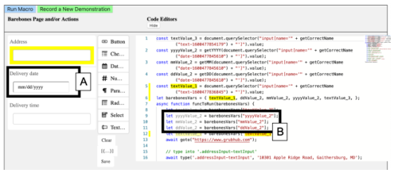

<!-- Source PDF SHA-256: 0ef3db860fc33f3ffb09b68405468f6408fb882c3d8dc66c7ec57143c76caff9 -->

# Toward Providing Live Feedback in Web Automation IDEs

[Source PDF](https://from.so/assets/pdfs/krosnick-providing-live-feedback-live2020.pdf)

Rebecca Krosnick

Computer Science and Engineering University of Michigan Ann Arbor, MI, USA rkros@umich.edu

Steve Oney

School of Information University of Michigan Ann Arbor, MI, USA soney@umich.edu

## INTRODUCTION

For professional and personal purposes, people repetitively perform tedious tasks on the web, e.g., paying a monthly bill, ordering household supplies, scraping data for a research project, uploading files for a class. One approach to reducing the burden of these repetitive tasks is using web automation macros. Web automation macros allow a user to perform a web task at the click of a button, optionally providing user input. The macro then automatically navigates to the appropriate website page and performs actions such as clicking buttons and entering text input, saving the user time and energy.

Macros are commonly created by hand-writing them in code (e.g., Selenium \[[7](<#page-6>)\], CasperJS \[[1](<#page-6>)\]), combining Internet of Things trigger-action building blocks (e.g., iOS Shortcuts \[[9](<#page-6>)\], IFTTT \[[3](<#page-6>)\]), or recording a user’s demonstration of actions on a web page (e.g., CoScripter \[[13](<#page-6>), [12](<#page-6>)\], Selenium IDE \[[8](<#page-6>)\], iMacros \[[4](<#page-6>)\]). In all cases the resulting macro representation presented to users is a script of some sort - program code \[[1](<#page-6>)\], a list of commands \[[8](<#page-6>)\], sloppy programming \[[13](<#page-6>), [12](<#page-6>)\], or block-based programming \[[11](<#page-6>), [9](<#page-6>), [3](<#page-6>)\]. A script representation, in particular code, enables expert users to arbitrarily customize their macro. However, macro scripts can be difficult for users to understand and edit, whether they are a colleague viewing the macro for the first time, or the macro creator trying to edit their macro months after it was first created. A major barrier to understanding macro scripts is that they lack user interface (UI) context. Users cannot look at a macro script and understand exactly what UI elements are being interacted with and what effect commands have on the UI.

To explore how we might expand macro representations to include visual context, we built VizMac, a tool that lets users record their actions on a web page to generate a macro script and see their recording as an animation. Users can inspect the animation to see the expected UI before and after states corresponding to a given line of code, and can see the UI elements corresponding to UI selectors in the code visually highlighted. These features help provide an understanding of the code that has been generated.

We conducted a user study where we asked 8 participants to create macros using VizMac, and an environment that does not provide visual context (Selenium IDE) as a comparison condition, by recording their actions and then making appropriate edits. Participants saw the value of having UI context alongside the original recorded code, but only a few heavily used the feature. Instead, a couple participants wished to see the UI animations leveraged as previews of the actions their in-progress code would perform. This could help users understand immediately whether their edited code works as desired.

Based on results from the user study, we propose design goals and discuss design challenges for providing users live feedback while they create web macros:

- 1. Provide live animation previews as code is updated

- 2. Provide live animation previews for multiple user inputs

- 3. Identify functional errors and provide hints to the user

- 4. Help the user identify semantic errors

## VIZMAC TOOL

We built VizMac, a tool that helps programmers understand and edit web macros by linking macro starter code to UI animations of web actions. To create a macro, the user first records their web actions and then VizMac automatically generates a corresponding macro script and an animation visualizing the actions taken on the web page. The UI animations are linked to the generated code in two ways: 1) for a given line of code, the user can see the UI’s state before and after the corresponding web action, and 2) for a given CSS selector in the code, the user can see the corresponding UI element highlighted. The user can then edit the script as desired, using the animation to help understand how the original generated code works. Below, we illustrate VizMac’s features and how it can be used through a sample scenario. Then, we describe VizMac’s implementation.

### Sample Scenario

Sasha is a programmer who would like to create web macros to automate frequent and tedious web tasks for her and her family. One frequent task is placing weekday meal orders on GrubHub for her busy family while they work and learn from home during the COVID-19 pandemic. This task is a good candidate for automation because Sasha’s family has a few favorite restaurants they order from, and each family member has their own favorite food item. A macro could enable her family to complete this task by simply selecting a delivery date and time and the restaurant they would like to order from and then clicking “Go”. For the purpose of illustrating VizMac’s visual context features, we show how Sasha builds an initial macro to order her family’s favorite meal at one particular restaurant (i.e., Shake Shack), but Sasha could do additional work to generalize the macro to order from different restaurants.

![Figure 1. The VizMac user interface. VizMac enables users to record their actions on a website (A) and generate a corresponding macro script (C, D). An animation of the recording is also presented (E). To understand what code does, the user can click on a line in either code editor to see the CSS selector (H) and its corresponding UI element in the animation (K) highlighted in orange. Clicking on a line in the static code editor (D) will specifically highlight and loop through the UI snapshots in the animation corresponding to this action. To make any edits to the generated script, the user can make changes in the editable code editor (C).](../figures/krosnick-providing-live-feedback-live2020/figure-001-p002.png)

Figure 1. The VizMac user interface. VizMac enables users to record their actions on a website (A) and generate a corresponding macro script (C, D). An animation of the recording is also presented (E). To understand what code does, the user can click on a line in either code editor to see the CSS selector (H) and its corresponding UI element in the animation (K) highlighted in orange. Clicking on a line in the static code editor (D) will specifically highlight and loop through the UI snapshots in the animation corresponding to this action. To make any edits to the generated script, the user can make changes in the editable code editor (C).

#### Recording actions

Sasha starts creating her macro by opening VizMac and navigating to the GrubHub website (Figure 1A). Next, she starts recording her actions for placing an order by clicking the ‘Record A Demonstration’ button (Figure 1B). On the Grub- Hub website she then enters their home address, selects the delivery date and time, navigates to the Shake Shack page and adds her family’s favorite items to the cart, and finally clicks the ‘Checkout’ button to reach the final confirmation page. (Note that she does not actually record placing the order. The macro user will manually click the ’Place Order’ button themselves.)

#### Macro script is generated

She clicks the ‘Stop Recording’ button and VizMac generates macro code and an animation. An editable and runnable version of the generated macro script appears in Figure 1C. This is the script Sasha will edit to create her generalized macro. Also, a static, non-editable version of the script appears in Figure 1D. This version serves as a reminder of the original code, and offers per-line links to the animation.

#### Animation is generated

An animation (Figure 1E) of Sasha’s recorded web actions is also rendered at this time. The animation contains a sequence of snapshots corresponding to the website’s intermediate UI states over the course of the recording. The animation automatically plays, advancing through the set of snapshots and looping back around. The progress bar (Figure 1F) above the animation indicates with a bright blue segment which snapshot is currently shown. Sasha can inspect an individual snapshot of the animation by hovering over segments of the progress bar.

#### Running the macro script

Now that the script is generated, Sasha wants to try it out and make sure it works, so she presses the ‘Run Macro’ button (Figure 1G). VizMac then runs the code in the embedded browser at a human-observable speed. Sasha watches and confirms that the actions she recorded are indeed correctly replayed.

#### Understanding what each line of code does

Currently the script will simply replay the actions Sasha recorded, using the same delivery date and time each time it is run. Sasha plans to edit the script to let the user input different dates and times, but first she wants to understand exactly how the current script works. She does this by clicking on different lines of code in the static code editor (Figure 1D). When she clicks on a given line, the animation will highlight the corresponding snapshots by looping only through the snapshots corresponding to that line of code, i.e., the web page snapshot immediately before the action is performed, snapshots while the action is being performed (e.g., typing multiple characters into a textfield), and a snapshot immediately after the action was performed. Seeing the snapshots corresponding to each line helps her understand which lines of code she should edit in order to generalize date and time entry. For example, she sees that she should edit the code corresponding to line 14 (Figure 1H) in order to support setting a different delivery date, because the corresponding snapshots show date selection on the GrubHub website.

#### Understanding which UI element each CSS selector refers to

Now that she knows which line of code to edit in order to generalize date entry, Sasha needs to determine what changes to make to that line of code. She looks at the line and suspects that she needs to edit the CSS selector ‘#date-picker- 21-9-2020’ (Figure 1J) because this selector contains the date she recorded, and instead she wants the script to click the selector corresponding to a user-provided input. She confirms that ‘#date-picker-21-9-2020’ indeed corresponds to the calendar date element she selected by clicking on ‘#date-picker-21-9-2020’ in the code. ‘#date-picker-21-9-2020’ is now highlighted in orange in the code, and the corresponding UI element, the date ‘21’ (Figure 1K), highlighted in the animation. This selector highlighting feature is available both for the editable macro script and the non-editable generated script.

#### Allowing and integrating user input

Now that Sasha knows which part of code to edit in order to generalize date entry, she now needs to enable user input. She does this by going to the form area and selecting a date field from the menu (Figure 1L) for the user to input their desired delivery date into. Once she adds the date field (Figure 2A), VizMac automatically inserts new variables yyyy- Field2, mmField2, and ddField2 (Figure 2B) into the macro script, representing year, month, and day substrings of the date the user inputted. Sasha then updates the ‘#date-picker-21-9-2020’ selector string to replace ‘21-9- 2020’ with the above variables, making the new selector string ‘#date-picker-’ + ddField2 + ‘-’ + mmField2 + ‘-’ + yyyyField2 (Figure 3A). Sasha also adds a textfield whose variable she inserts in line 34 (Figure 3B) for the delivery time.

#### Running the script, encountering an error, and correcting it

To test out her script, Sasha enters test date and time values into the form and then clicks ‘Run Macro’. Unfortunately when running, an error occurs and Sasha is shown the error message ‘waiting for selector “#date-picker-23-09-2020 &gt; .text-muted” failed’. She realizes that the date elements in the DOM actually do not include a leading zero for single-digit days and months (e.g., ‘9’ and not ‘09’ for September), but that the selector who wrote does include leading zeros. She fixes this mistake by writing some JavaScript to trim the leading zeros from the ddField2 and mmField2 variables. Then she runs the macro again and sees that it runs as expected, successfully setting the user-specified date and time and adding the Shake Shack items to the cart.

Figure 2. The user can create input fields for their macro parameters, e.g., a date (A). VizMac then automatically adds corresponding variables to the script providing access to the input field values (B).

Figure 3. An error is shown when a particular CSS selector does not exist on the page.

### Implementation

VizMac is an Electron \[[2](<#page-6>)\] application. The embedded web page is contained with an instrumented Electron webview. When the user records their web actions on the web page, the webview listens for DOM events such as keydown, mousedown, mouseup, click, select, input, and more. When an event is captured, event metadata are saved as well as a snapshot of the DOM at this point, taken using rrweb-snapshot \[[6](<#page-6>)\]. A contiguous set of semantically-related events are grouped together into an action, for example adjacent keydown events typing a string into a textfield.

Once the user stops recording, VizMac converts each recorded action into JavaScript code that leverages the Puppeteer automation library \[[5](<#page-6>)\]. VizMac has high-level wrapper functions for several common UI actions, e.g., type, click, select, hitEnter. When the user runs their macro, this code is run on a Puppeteer instance attached to the Electron webview. VizMac renders each rrweb snapshot within its own iframe, visually advancing through iframes by hiding and showing them appropriately.

The cross-referencing between code and snapshots that occurs by clicking lines in the non-editable script version is entirely deterministic. Because the code cannot be edited by the user and is simply the original generated code, VizMac knows which action a given line of code corresponds to and therefore knows which snapshots correspond to that line of code.

Finally, we use formBuilder \[[10](<#page-6>)\] to render and control and user input form area (Figure 1L).

Currently VizMac provides partial support for most websites, enabling the user to record their actions and generating a corresponding script and animation, but there are limitations. For some websites rrweb-snapshot is not able to fetch all page resources (e.g., images) to display in the UI snapshots. Additionally, the script VizMac generates does not always work, for example it might not capture all interaction events (e.g., interactions within an iframe). Additional engineering work is needed to address these current limitations.

## USER STUDY

We conducted a small user study to seek initial feedback on VizMac, see what benefits it may offer over a baseline tool that does not provide visual context, and learn what challenges users experience when creating web automation scripts. We chose Selenium IDE \[[8](<#page-6>)\] as our baseline because it supports generating a script from recorded user actions, like VizMac, but does not provide visual context.

### Study Design

There were 8 participants, all experienced with programming in JavaScript and using CSS selectors. Each participant used each of the two tools (VizMac, Selenium IDE) for one task each, with order, task, and tool counterbalanced. Task A was to create a macro that sets the delivery location, date, and time for a GrubHub order (similar to the Sample Scenario), and task B was to create a macro that performs a flight search query on the Southwest website (i.e., queries for given cities and flight dates). Participants were given a 5 minute tutorial of each tool, and 30 minutes to work on each study task.

### Results

#### Usage Patterns and Benefits

Many participants completed tasks with VizMac and Selenium IDE using similar strategies: running their macro numerous times as they made edits, and creating new recordings to try interacting with the page differently if their current script was not working.

4 of 8 participants did incorporate the animation, code/snapshot cross-referencing, and selector highlighting features into their workflow, using them to gain understanding of the code and debug. Code/snapshot cross-referencing seemed helpful for determining which lines of code to edit, as well as in identifying unnecessary lines of code that could be deleted (i.e., extra, unnecessary actions the user performed on the page).

In both VizMac and Selenium IDE participants had a tendency to delete lines of generated code that they thought were not necessary but in reality were (e.g., both a ‘click’ and ‘type’ command are generated for entering a date on the Southwest website, but many participants thought they only needed to keep one). With Selenium IDE, participants had to create a new recording to recover lines of code that they had deleted, but with VizMac, participants could reference the animation and linked editor to identify and recover the deleted code.

Participants also appreciated the highlighting of selectors’ DOM elements in the UI - “The fact that I could click on a line and then at the bottom see that element being highlighted, and then when I go to the code that you can’t modify and click that line again, you can see sort of where that element is being involved, in the rest of the demonstration. It was really really really helpful because I didn’t have to use the Chrome browser tools to figure out what element should I be looking at” (P8).

Although not all participants used the animation and selector highlighting features, most expressed that they could be useful, especially for more complex tasks than those given in the study.

#### Challenges

There were a few challenges that participants experienced with both VizMac and Selenium IDE:

- 1. Generated code is not always correct. It seems that some UI events do not get captured correctly by VizMac and Selenium IDE (e.g., clicking on an item in the Grubhub location suggestions list), so users were surprised and frustrated when they immediately played the unedited code and saw that certain actions were not performed. Participants were also confused that the animation was not semantically aligned with the code in this case, because the animation does contain snapshots for all of the expected actions (some of which may not be represented in code).

- 2. CSS selectors users wrote were sometimes incorrect. When participants tried integrating user input into their script, they usually found the right line of code to edit, but sometimes edited that line incorrectly when it involved modifying a CSS selector. For example, generalizing the GrubHub script required plugging day, month, and year strings into the correct CSS selector format, but some participants accidentally swapped day and month in the ‘#date-picker-\[day\]-\[month\]-\[year\]’ format.

- 3. Unexpected page state changes cause script to break. One participant saw the GrubHub page state change during the course of their task, which resulted in their script unexpectedly failing after originally working. During their recording, a default delivery date existed, which meant the user had to click the default date in order to see the calendar widget. However, later in the task this default date somehow was cleared from the page state, resulting in the calendar widget appearing automatically and the ‘click’ operation failing (because the default date element no longer existed).

- 4. Script works for some user input but not others. During the early stages of generalizing their script, participants usually tested with just one set of user input until it worked. However, when they later tested with different input, the script sometimes broke, e.g., selecting a date in the current or next month on the Southwest website works fine, but selecting a date more than a month in the future did not work; for some participant implementations the date element they wanted to click was not visible on the page because the month had not been advanced. To make these scripts work, participants had to add or replace automation commands. If these participants had known early on that their script would not work for all valid dates, they could have more efficiently and strategically generalized their script.

In the first three cases, the user must first identify the source of the error before making any attempt to fix it. However, due to the lack of an immediate feedback loop, it can be challenging for users to identify the source of an error. Participants often make multiple code edits between macro runs, making it non-trivial to identify which of these edits caused the error once they do run the macro. Additionally, for the fourth case, the user must manually and incrementally test their macro with different inputs, which might impact their efficiency of creating a generalized script. We believe that incorporating live feedback into web automation tools would be helpful so users can efficiently and effectively identify when and where their script has broken. In fact, one participant identified on their own that a live feedback loop would be helpful, suggesting that the animation continuously update to reflect the real-time edits they make to the script.

## LIVE FEEDBACK DESIGN GOALS AND CHALLENGES

Based on the challenges study participants faced, we propose design goals and discuss design challenges in providing live feedback in web automation tools.

### Live previews as code is updated.

As the user edits their script, an animation or other visual should continuously provide a live preview of the actions the current script would perform on the web page. Additionally, a preview should be shown for the value of variables and expressions in the code (e.g., CSS selectors that embed input variables). The current orange highlighting feature cross-referencing CSS selectors and UI elements should also be extended to dynamic CSS selectors and the code’s live preview animation. If there is a functional runtime error (e.g., an element selector not present), the preview should show the final web page snapshot before the error occurred and indicate which line of code the error occurred on. Live previews will help users identify errors immediately after they occur.

### Live previews for multiple sets of user input.

As the user edits their script, they should be shown live previews not just for one set of input, but for multiple sets, in order to help them develop robust code earlier in the creation process. For example, for a script that helps book a flight on the Southwest website, live previews should be generated for multiple flight dates, not just one. This could have helped participants realize earlier on that their Southwest script works for dates in the current and next months, but not yet for dates two months in the future. With this knowledge, they could have modified their script logic and commands earlier on.

An important question is what inputs should be considered. To start with, the tool could create previews for all inputs the user has tried already. However, it is possible the user has changed their input specifications and that earlier inputs are no longer valid (e.g., the program used to expect times on the 24 hour clock, but now expects them on the 12 hour clock with a.m. and p.m.). Additionally, the tool could devise its own new inputs using heuristics (e.g., for a date field choose random dates, only dates in the future, or only dates that it can find on the web page). However, some machine-generated inputs are bound to be invalid (e.g., on the Southwest website one can only book flights seven months in advance). For both stale user-provided input and invalid machine-generated input, the user should have the ability to exclude these from future live previews. Potentially the user could also provide a specification of valid input values per field.

### Identify functional errors and provide hints.

In addition to sharing error messages, ideally the tool should also provide the user explanations or hints as to why the error occurred. For example, imagine the user has just generalized a date picker CSS selector using variables but made a mistake, resulting in an invalid CSS selector. Potentially the tool could show the user the invalid concrete CSS selector their script just tried using (e.g., ‘#date-picker-1-Sep-2020’) alongside previously used valid CSS selectors (e.g., ‘#date-picker- 1-9-2020’).

### Help user identify semantic errors.

Sometimes the script will run to completion but will not perform the actions as the user intended. Because this does not cause a runtime error, even if we show the user live previews illustrating the semantic error, they might not look closely enough to detect it. One possible approach to identifying semantic errors is helping scaffold a test suite for the user. Perhaps for several representative user inputs the user could record the desired actions, and then the tool could use the final snapshot as the ground truth for that input. This could be challenging though, because likely two DOM snapshots that visually look the same are not entirely identical. The user might need to provide annotations for which particular DOM elements should be identical. Additionally, a test suite that compares DOM snapshots might not be effective for macros whose final outcome changes over time (e.g., querying for stock data).

## OTHER FUTURE WORK

Beyond live feedback, there is other work to do to improve the usability of web automation tools. Macros that book a flight or place a food order inherently perform a stateful operation. However, when the user is still creating and generalizing their macro, they do not want to book a flight or place a food order each time they test the macro. Approaches should be explored for enabling users to safely build and test macros that perform stateful operations.

Generalizing a macro script is non-trivial, especially when the generalized script involves control flow logic or complex element selector rules. Future work should explore how to help users more easily generalize, e.g., via programming by demonstration or specifying generalization rules through end-user style widgets.

Finally, it would be exciting to explore whether web automation creation tools can be designed for non-programmers, given the animation representation of macros we have in Viz- Mac.

## CONCLUSION

As a first step to making web macro representations more visual, we built VizMac, a tool that provides an animation of a recorded macro and provides cross-referencing features to identify what a given line of code does, and what UI element a given CSS selector corresponds to. We conducted a user study of VizMac where we found that although the animation features were helpful, participants still had trouble understanding the source of errors. As a result, we believe that incorporating live feedback into web automation tools will be helpful in more effectively and efficiently identifying the source of errors. We propose design goals and discuss design challenges in making this possible.

## REFERENCES

- \[1\] CasperJS. [https://www.casperjs.org/](<https://www.casperjs.org/>). Accessed: 2020-06-08.

- \[2\] Electron. [https://www.electronjs.org/](<https://www.electronjs.org/>). Accessed: 2020-09-18.

- \[3\] IFTTT. [https://ifttt.com/](<https://ifttt.com/>). Accessed: 2020-06-08.

- \[4\] iMacros. [https://imacros.net/](<https://imacros.net/>). Accessed: 2020-06-08.

- \[5\] Puppeteer. [https://pptr.dev/](<https://pptr.dev/>). Accessed: 2020-09-18.

- \[6\] rrweb-snapshot. [https://github.com/rrweb-io/rrweb-snapshot](<https://github.com/rrweb-io/rrweb-snapshot>). Accessed: 2020-09-18.

- \[7\] Selenium. [https://www.selenium.dev/](<https://www.selenium.dev/>). Accessed: 2020-09-11.

- \[8\] Selenium IDE. [https://www.selenium.dev/selenium-ide/](<https://www.selenium.dev/selenium-ide/>). Accessed: 2020-06-08.

- \[9\] Shortcuts. [https://apps.apple.com/us/app/shortcuts/id915249334](<https://apps.apple.com/us/app/shortcuts/id915249334>). Accessed: 2020-06-08.

- \[10\] 2020. formBuilder. [https://formbuilder.online/](<https://formbuilder.online/>) Accessed: 2020-09-18.

- \[11\] Sarah E Chasins, Maria Mueller, and Rastislav Bodik. 2018. Rousillon: Scraping Distributed Hierarchical Web Data. In Proceedings of the 31st Annual ACM Symposium on User Interface Software and Technology. 963–975.

- \[12\] Gilly Leshed, Eben M Haber, Tara Matthews, and Tessa Lau. 2008. CoScripter: automating &amp; sharing how-to knowledge in the enterprise. In Proceedings of the SIGCHI Conference on Human Factors in Computing Systems. 1719–1728.

- \[13\] Greg Little, Tessa A Lau, Allen Cypher, James Lin, Eben M Haber, and Eser Kandogan. 2007. Koala: capture, share, automate, personalize business processes on the web. In Proceedings of the SIGCHI conference on Human factors in computing systems. 943–946.
