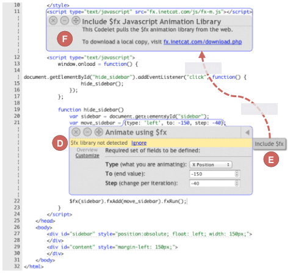

<!-- Source PDF SHA-256: d5e42aca50103365ff5742f7bff7609cc53cc78f098b9e32acb89d0281c2ae21 -->

<a id="page-1"></a>

# Codelets: Linking Interactive Documentation and Example Code in the Editor

[Source PDF](https://from.so/assets/pdfs/oney-codelets-chi2012.pdf) · [Publisher page](https://doi.org/10.1145/2207676.2208664)

Stephen Oney

Carnegie Mellon University Pittsburgh, PA 15213 USA soney@cs.cmu.edu

Joel Brandt

Adobe Systems

San Francisco, CA 94103 USA joel.brandt@adobe.com

> CHI’12, May 5–10, 2012, Austin, Texas, USA. Copyright 2012 ACM 978-1-4503-1015-4/12/05...$10.00.

> Permission to make digital or hard copies of all or part of this work for personal or classroom use is granted without fee provided that copies are not made or distributed for profit or commercial advantage and that copies bear this notice and the full citation on the first page. To copy otherwise, or republish, to post on servers or to redistribute to lists, requires prior specific permission and/or a fee.

## ABSTRACT

Programmers frequently use instructive code examples found on the Web to overcome cognitive barriers while programming. These examples couple the concrete functionality of code with rich contextual information about how the code works. However, using these examples necessitates understanding, configuring, and integrating the code, all of which typically take place after the example enters the user’s code and has been removed from its original instructive context. In short, a user’s interaction with an example continues well after the code is pasted. This paper investigates whether treating examples as “first-class” objects in the code editor — rather than simply as strings of text — will allow programmers to use examples more effectively. We explore this through the creation and evaluation of Codelets. A Codelet is presented inline with the user’s code, and consists of a block of example code and an interactive helper widget that assists the user in understanding and integrating the example. The Codelet persists throughout the example’s lifecycle, remaining accessible even after configuration and integration is done. A comparative laboratory study with 20 participants found that programmers were able to complete tasks involving examples an average of 43% faster when using Codelets than when using a standard Web browser.

Author Keywords: programming, example, documentation, structured editing

### ACM Classification Keywords

H.5.2. \[Information interfaces and presentation\]: User Interfaces - Training, help, and documentation;

General Terms: Design, Human Factors.

## INTRODUCTION

Instructive code examples play a central role in programmers’ work practice \[3,15,30\]. Blocks of example code found in library documentation \[15\] and Web resources — such as blogs, forums, and code search engines \[34\] — help meet both learning and productivity needs \[25\]. These examples couple a concrete piece of functionality, usually implemented in 5–20 lines of code, with contextual information such as a written description of how the code works \[2\]. One data point suggests that when programmers are learning new libraries, as much as one-third of their code is directly taken from examples in documentation \[33\]. Even when a concept is well understood, programmers often choose to copy and paste examples rather than write code from scratch to save time and avoid errors \[3\].


Figure 1. Codelets attach helpers to regions of code. Helpers are displayed inline with the rest of the code without obscuring it. This Codelet creates a jQuery Mobile button. Its helper is interactive and allows its user to customize the button by interacting with a form, drawing a line to illustrate which region of code each form element is changing. The user may also edit the code and the form will automatically update itself.

Blocks of example code on the Web are typically situated within a rich context. For example, jQuery Mobile’s documentation<sup>1</sup> provides thorough descriptions of how each example functions, and often presents multiple alternative examples for a given high-level goal. Example code can even be interactive. For instance, CSSPortal’s Rounded Corner Generator<sup>2</sup> provides a GUI for configuring parameters within an example. However, once a programmer pastes an example into her code, the rich context, alternatives, and interactions are lost. In a typical code editor, there is no notion of code provenance — example code is indistinguishable from code written by hand.

> <sup>1</sup> jQuery Mobile is a library for developing Web pages intended for use on a mobile device. Documentation can be found at http://jquerymobile.com/demos/

> <sup>2</sup> http://www.cssportal.com/css3-rounded-corner/

<a id="page-2"></a>

This paper begins with the insight that a user’s interaction with an example continues well after the code is pasted in her editor. Typically, she must understand, configure, integrate, and test the example before it is useful \[9\]. In fact, for many programmers, interaction with an example begins when it is pasted. In a recent study of example use, one participant described why he copied code before understanding it by saying “I think it’s less expensive for me to just take the first \[code I find\] and see how helpful it is at ... a very high level ... as opposed to just reading all these descriptions and text.” \[3\]

### Codelets: First-Class Examples

This paper investigates whether treating examples as “first-class” objects in the code editor — rather than simply as strings of text — will allow programmers to use examples more effectively. Prior studies suggest that examples may be difficult to use for three reasons: First, users may face difficulty in understanding how to configure or adapt an example to their specific needs \[20\]. Second, integrating an example into the user’s code can introduce bugs (e.g., if variables are not renamed properly, or a related library file is not included) \[3,20\]. Finally, these tasks are often interleaved with other coding tasks, which increases the likelihood that users will forget important contextual information \[3,9\]. Based on these reasons, we hypothesize that an editor can help programmers use examples more effectively if it:

- Emphasizes separate functional units in the user’s code by demarcating examples.

- Maintains code provenance by linking documentation to the example code.

- Supports adaptation by allowing example authors to build structured editors or configurators that are presented inside the user’s code.

- Facilitates integration by allowing an interactive example to automatically adapt to the use context.

- Makes supporting materials persistent so that users can interleave example use with other tasks.

We explore these ideas in a prototype code editor that supports the insertion of Codelets (see Figure 1). A Codelet is a region in the user’s code that contains a block of example code and an associated interactive helper. The helper can make changes to the example code, and thus can present the user with structured editors or configurators. Additionally, the helper can inspect the user’s entire code base, and so can tailor the example based on features in the rest of the code. Codelet interactions are evaluated through a comparative laboratory study with 20 participants. On average, programmers using Codelets were able to complete a programming task 43% faster (µ<sub>Codelet</sub> = 12.7 minutes, µ<sub>control</sub> = 22.2 minutes, p &lt; 0.01).

Pragmatically, for Codelets to be effective programming tools, there must be a large collection of them available. Who will build them? Traditionally, providing rich editor interactions, such as structured editors, has been solely in the hands of the editor authors. However, the creation of examples is typically rests in the hands of library and documentation authors or other third parties. To bridge this gap, we propose an API for the code editor that allows documentation authors to create Codelets in a manner similar to how they currently author documentation. “Static” Codelets (those with helper widget that only offer static documentation) are created with a single HTML-like file. To add interactivity, the Codelet author makes calls against a JavaScript API to access the user’s code and make changes to portions of the example. This means that authoring a basic Codelet is approximately the same amount of work as posting a static example on the Web. Authoring an interactive Codelet is similar in difficulty to building a Web page that is an example “configurator” (like CSSPortal’s Rounded Corner Generator mentioned above).

### Key Contributions

This paper makes three key contributions: First, it offers a set of code editing interactions that support example understanding and use. Second, it contributes to a theory of example usage by providing further data on what makes example use challenging — if a particular interaction is effective, it suggests that the problem it was designed to address is real. Finally, it offers an implementation technique for allowing documentation authors (or other third-parties) to create specialized code editing interactions.

## SCENARIO: PROGRAMMING WITH CODELETS

Codelets help programmers by attaching “helpers” to fragments of code. We illustrate how Codelets work through a scenario. Jane is a programmer creating a Web site template for a small publishing company’s online books. She decides to try a two-column layout: a sidebar column where readers can navigate to different chapters and a text column with the content of the book. Like many programmers, Jane “offloads” her memory to example code \[3,5\] and has stored some of her favorite site templates as Codelets. Even though she could re-create these templates from scratch if necessary, she never bothers, as it is often faster to copy example code.

Rapidly accessing examples and documentation — In her editor, Jane presses CTRL-/ to pull up her in-editor Codelet search interface (Figure 2a), searches for “column layout,” and selects the first result. As soon as she does, a Codelet (Figure 2b) appears. This Codelet has two parts: a block of example code — which is inserted in the editor as usual — and a helper. Here, the helper is a piece of interactive documentation that is “linked” to the code it describes. When the helper is inserted, it “pushes” the surrounding code out of the way so that Jane can always see her entire codebase. To reduce their visual salience in the editor, helpers are indented at the same level as their surrounding code. In this case, Jane is familiar with the example she has just inserted and does not need to read the description attached in the helper. She immediately hides it by pressing ESC, knowing that she can re-display the helper later if necessary.

<a id="page-3"></a>


Figure 2. Our augmented editor allows Codelets to be searched for and inserted in the editor, searching for stored Codelets based on their keywords and descriptions. The search box (A) is invoked using a keyboard shortcut. If a result is selected, a Codelet (B) is inserted following the caret.

Helpers as learning tools — Jane now has a basic template. Next, she wants to add some style to her sidebar. She decides that she would like to have a border around it, preferably with rounded edges. She is not sure how to do this, and so she turns to Web search. She finds a Codelet for tuning border parameters that seems useful. After she pastes the URL into her Codelet search bar, the Codelet shown in Figure 3c appears. It contains a “builder” interface that allows her to quickly tune parameters by interacting with a standard Web form. As she experiments with different border radius values, the Codelet draws lines to indicate how changing a slider’s value modifies the code. This helps her build mappings between her conceptual understanding of what she wants and the low-level CSS primitives for doing so, a major cognitive barrier faced by programmers with unfamiliar code \[11,22\].

Warnings and related Codelets — After Jane finds a border radius and color she likes, she realizes that readers might not always want to see the sidebar. Ideally, they should be able to hide it when it’s getting in the way. She adds a “close” button to the sidebar and decides that she wants the sidebar to animate when the user closes it by sliding off-screen to the left. She decides to do this using the “$fx” JavaScript animation library. She has never used $fx before and isn’t familiar with the syntax for animations, so she decides to search for a Codelet to help her get started. When Jane adds this Codelet to her editor, it quickly pops up a yellow warning (Figure 4d), indicating that she has forgotten to include the $fx library. Jane opens the “related Codelets” list shown in Figure 4e and sees a Codelet for including $fx. She drags it into the header and a Codelet (Figure 4f) inserts the code to properly include the $fx library, suppressing the warning. Deciding she’ll never need to re-invoke this helper, she destroys it by clicking the “x” in its top left corner.

<a id="page-4"></a>

Tweaking parameters — Jane then goes back to the $fx animation Codelet and tunes the parameters of her animation, again using the helper interface to modify code. As with the Codelet for generating rounded CSS corners, she finds that experimenting is an effective way to learn how the code works \[29\]. After she tunes her animation, she realizes that although she animates the sidebar, the reading pane isn’t re-claiming its space. In fact, she needs to animate both the sidebar and the reading pane. To animate the reading pane, she copies the code that animated the sidebar and pastes it immediately below. The attached Codelet is copied and pasted as well but Jane now feels comfortable with the $fx library, so she decides to edit her code manually rather than through the helper’s interface. As she edits her code, the helper’s interface updates itself automatically to reflect the parameters she has entered.


Figure 3. A Codelet inspired by CSSPortal’s Rounded Corner Generator. As the developer moves the slider, it modifies the code and illustrates which parts of code are changing.



Figure 4. This Codelet displays a warning (D) after it detects the absence of a required library. On its right side (E) is a link to a Codelet for including the library. The link can be dragged into place and its Codelet (F) is inserted.

Re-invoking Codelets — After Jane finishes tuning her animations, she has a template that she’s happy with. She starts filling in some content to see how it will look to a reader. When testing it, she decides to tune the borders on the sidebar once again, so that the left side isn’t rounded. She re-invokes the border Codelet she had used before by holding CTRL and clicking the region of code it was tied to. She again modifies the border values until she is satisfied. Jane has quickly produced a working template using an unfamiliar library and CSS feature. In addition, her code contains interactive helpers attached to regions of code where she inserted examples. If Jane or anyone else looking at her code later wants to better understand and modify that region of code, they can re-invoke these helpers in addition to being able to modify it manually.

To understand the benefits and tradeoffs of interacting with Codelets, we built a prototype and evaluated it in a comparative lab study. We first present the results of that study, and then describe how Codelets are implemented. The implementation consists of two parts: the Codelet API with which Codelets are written and the implementation of Codelet displays in the editor.

## EVALUATION

To evaluate the utility and effectiveness of programming with Codelets, we prototyped a set of Codelets for jQuery Mobile (jQM), a framework used to build websites for mobile devices. We recruited 20 participants — seven female and thirteen male. Our participants were engineers, web designers, and graduate students ages 22–45. Two participants (not included in the 20) were excluded because of a lack of programming knowledge. Eighteen of the 20 studies were conducted remotely using screen and audio sharing.

### Method

Participants were first randomly split into two groups — Codelet or control. Both groups were given a code editor with a sidebar containing an output preview that they could refresh as desired. Codelet participants were first trained in how to use Codelets with a guided tutorial while control participants given a short tutorial on how to use the code editor. Each session consisted of two parts: A and B, part B being optional.

For part A, participants in both groups were asked to follow four steps to create a website using jQM. The steps were the same for both groups, but Codelets participants used jQM Codelets while control participants used the official jQM documentation, which is example-oriented. To control for search times, control participants were given links directly to relevant examples in the jQM documentation and Codelet participants were given relevant search terms. Additionally, whenever Codelet participants performed an in-editor search, the last result was always a link that initiated a Web search over jQM’s documentation.

Participants that finished part A with spare time were given part B, which was oriented towards gathering qualitative results. This part asked both groups to use a Codelet-enabled editor to create a more complex website using jQM (control participants were first given a Codelets tutorial.) Part B was more freeform than part A; participants were given a goal website and the sources of three sample jQM websites that contained parts of their goal. Fourteen participants started part B and two completed it (both in the Codelet group).

Finally, all participants were asked to complete a short survey. Participants in the control group completed this survey before being exposed to Codelets. The study took approximately one hour to complete; a small gratuity was given in return for participation.

### Results

#### Part A (Stepwise)

Part A consisted of four steps. For each step, we measured the time taken and the number of preview refreshes. Figure 5 gives an overview of the quantitative results. Participants using Codelets required significantly fewer refreshes (two-tailed heteroscedastic Student’s t-test, p &lt; 0.05) and took significantly less time (p &lt; 0.01) than participants in the control condition. By breaking the data down into individual steps in Table 1 and below, we can gain more insight into these results.

<a id="page-5"></a>

Step 1 asked participants to create a basic jQM page. The example used by the Codelet group contained static explanatory documentation. Participants in the Codelet group performed this step significantly faster (p &lt; 0.01) than the control group. Part of this effect may be the result of the Codelet group being more familiar with their code editor, having gone through a longer tutorial. The rest of this effect can be attributed to differences in how the two groups read documentation, as described in step 2 below.


Figure 5. The overall time spent and number of refreshes in part A. Participants with Codelets completed tasks significantly faster and with significantly fewer refreshes than participants using Web examples.

<table>
  <caption>Table 1. Task completion time and number of refreshes used for testing during part A. Time is given in minutes, Refreshes is given as a count. Standard deviation is shown in parentheses. Columns are highlighted in green** if the difference in means is significant at p &lt; 0.01, in blue* at p &lt; 0.05.</caption>
  <thead>
    <tr>
      <th id="pdf-table-219:0-64aff34a-461:0-02e100ad" scope="col" rowspan="2"></th>
      <th id="pdf-table-219:0-64aff34a-codelets-table1-step1-50f415fe" scope="col" colspan="2">Step 1</th>
      <th id="pdf-table-219:0-64aff34a-codelets-table1-step2-78d46641" scope="col" colspan="2">Step 2</th>
      <th id="pdf-table-219:0-64aff34a-codelets-table1-step3-6e2bf038" scope="col" colspan="2">Step 3</th>
      <th id="pdf-table-219:0-64aff34a-codelets-table1-step4-2e3ea564" scope="col" colspan="2">Step 4</th>
    </tr>
    <tr>
      <th id="pdf-table-219:0-64aff34a-codelets-table1-step1-time-21f5768d" scope="col" headers="pdf-table-219:0-64aff34a-codelets-table1-step1-50f415fe">Time</th>
      <th id="pdf-table-219:0-64aff34a-codelets-table1-step1-refreshes-0692ea2b" scope="col" headers="pdf-table-219:0-64aff34a-codelets-table1-step1-50f415fe"># Refreshes</th>
      <th id="pdf-table-219:0-64aff34a-codelets-table1-step2-time-421b55c2" scope="col" headers="pdf-table-219:0-64aff34a-codelets-table1-step2-78d46641">Time</th>
      <th id="pdf-table-219:0-64aff34a-codelets-table1-step2-refreshes-46a39f4a" scope="col" headers="pdf-table-219:0-64aff34a-codelets-table1-step2-78d46641"># Refreshes</th>
      <th id="pdf-table-219:0-64aff34a-codelets-table1-step3-time-a5b90178" scope="col" headers="pdf-table-219:0-64aff34a-codelets-table1-step3-6e2bf038">Time</th>
      <th id="pdf-table-219:0-64aff34a-codelets-table1-step3-refreshes-36bfea13" scope="col" headers="pdf-table-219:0-64aff34a-codelets-table1-step3-6e2bf038"># Refreshes</th>
      <th id="pdf-table-219:0-64aff34a-codelets-table1-step4-time-01614dd5" scope="col" headers="pdf-table-219:0-64aff34a-codelets-table1-step4-2e3ea564">Time</th>
      <th id="pdf-table-219:0-64aff34a-codelets-table1-step4-refreshes-8bad3e76" scope="col" headers="pdf-table-219:0-64aff34a-codelets-table1-step4-2e3ea564"># Refreshes</th>
    </tr>
  </thead>
  <tbody>
    <tr>
      <th id="pdf-table-219:0-64aff34a-codelets-table1-codelets-46dce0dc" scope="row" headers="pdf-table-219:0-64aff34a-461:0-02e100ad">Codelets</th>
      <td headers="pdf-table-219:0-64aff34a-codelets-table1-codelets-46dce0dc pdf-table-219:0-64aff34a-codelets-table1-step1-50f415fe pdf-table-219:0-64aff34a-codelets-table1-step1-time-21f5768d">2.09 (0.78)**</td>
      <td headers="pdf-table-219:0-64aff34a-codelets-table1-codelets-46dce0dc pdf-table-219:0-64aff34a-codelets-table1-step1-50f415fe pdf-table-219:0-64aff34a-codelets-table1-step1-refreshes-0692ea2b">1.70 (0.67)</td>
      <td headers="pdf-table-219:0-64aff34a-codelets-table1-codelets-46dce0dc pdf-table-219:0-64aff34a-codelets-table1-step2-78d46641 pdf-table-219:0-64aff34a-codelets-table1-step2-time-421b55c2">1.75 (1.22)</td>
      <td headers="pdf-table-219:0-64aff34a-codelets-table1-codelets-46dce0dc pdf-table-219:0-64aff34a-codelets-table1-step2-78d46641 pdf-table-219:0-64aff34a-codelets-table1-step2-refreshes-46a39f4a">1.0 (0.00)**</td>
      <td headers="pdf-table-219:0-64aff34a-codelets-table1-codelets-46dce0dc pdf-table-219:0-64aff34a-codelets-table1-step3-6e2bf038 pdf-table-219:0-64aff34a-codelets-table1-step3-time-a5b90178">5.57 (2.72)**</td>
      <td headers="pdf-table-219:0-64aff34a-codelets-table1-codelets-46dce0dc pdf-table-219:0-64aff34a-codelets-table1-step3-6e2bf038 pdf-table-219:0-64aff34a-codelets-table1-step3-refreshes-36bfea13">4.30 (3.59)*</td>
      <td headers="pdf-table-219:0-64aff34a-codelets-table1-codelets-46dce0dc pdf-table-219:0-64aff34a-codelets-table1-step4-2e3ea564 pdf-table-219:0-64aff34a-codelets-table1-step4-time-01614dd5">3.26 (1.73)</td>
      <td headers="pdf-table-219:0-64aff34a-codelets-table1-codelets-46dce0dc pdf-table-219:0-64aff34a-codelets-table1-step4-2e3ea564 pdf-table-219:0-64aff34a-codelets-table1-step4-refreshes-8bad3e76">2.3 (2.11)</td>
    </tr>
    <tr>
      <th id="pdf-table-219:0-64aff34a-codelets-table1-control-5c92e360" scope="row" headers="pdf-table-219:0-64aff34a-461:0-02e100ad">Control</th>
      <td headers="pdf-table-219:0-64aff34a-codelets-table1-control-5c92e360 pdf-table-219:0-64aff34a-codelets-table1-step1-50f415fe pdf-table-219:0-64aff34a-codelets-table1-step1-time-21f5768d">4.04 (1.84)**</td>
      <td headers="pdf-table-219:0-64aff34a-codelets-table1-control-5c92e360 pdf-table-219:0-64aff34a-codelets-table1-step1-50f415fe pdf-table-219:0-64aff34a-codelets-table1-step1-refreshes-0692ea2b">2.90 (1.66)</td>
      <td headers="pdf-table-219:0-64aff34a-codelets-table1-control-5c92e360 pdf-table-219:0-64aff34a-codelets-table1-step2-78d46641 pdf-table-219:0-64aff34a-codelets-table1-step2-time-421b55c2">2.54 (1.04)</td>
      <td headers="pdf-table-219:0-64aff34a-codelets-table1-control-5c92e360 pdf-table-219:0-64aff34a-codelets-table1-step2-78d46641 pdf-table-219:0-64aff34a-codelets-table1-step2-refreshes-46a39f4a">2.44 (0.88)**</td>
      <td headers="pdf-table-219:0-64aff34a-codelets-table1-control-5c92e360 pdf-table-219:0-64aff34a-codelets-table1-step3-6e2bf038 pdf-table-219:0-64aff34a-codelets-table1-step3-time-a5b90178">10.40 (3.91)**</td>
      <td headers="pdf-table-219:0-64aff34a-codelets-table1-control-5c92e360 pdf-table-219:0-64aff34a-codelets-table1-step3-6e2bf038 pdf-table-219:0-64aff34a-codelets-table1-step3-refreshes-36bfea13">8.78 (4.55)*</td>
      <td headers="pdf-table-219:0-64aff34a-codelets-table1-control-5c92e360 pdf-table-219:0-64aff34a-codelets-table1-step4-2e3ea564 pdf-table-219:0-64aff34a-codelets-table1-step4-time-01614dd5">5.26 (3.46)</td>
      <td headers="pdf-table-219:0-64aff34a-codelets-table1-control-5c92e360 pdf-table-219:0-64aff34a-codelets-table1-step4-2e3ea564 pdf-table-219:0-64aff34a-codelets-table1-step4-refreshes-8bad3e76">4.78 (3.63)</td>
    </tr>
  </tbody>
</table>

In step 2, the Codelet used by the Codelet group was static and contained the same example code as the official documentation used by the control group. One might expect the times for both groups to be nearly identical. However, users in the Codelet group finished this task an average of 47s faster, with fewer page refreshes.

During steps 1 and 2, participants in the Codelet group were less likely to read static documentation after example code was inserted into their document, unless they were stuck. One participant later said, “I just thought \[the helper\] was kind of there for newbies who want to know more about a specific feature.” By contrast, in step 2, although the control group was pointed to the same example code in the documentation, they spent an average of 22s between identifying the correct example code and pasting it into the editor. The majority of this time was spent reading the documentation to be sure they were copying the correct code and double checking that they were pasting it in the appropriate place. After pasting their code, participants in the control condition spent more time “habituating” the new code — fixing indentation issues and reformatting it according to their personal preferences. The increase in the number of page refreshes in the control condition was due to the prevalence of a pattern of copying the code from the documentation, pasting it, and immediately refreshing the page to see the output. Codelet participants, by contrast, customized the example code before refreshing.

Step 3 asked participants to create jQM buttons. The Codelet group was given the interactive helper shown in Figure 1. This helper could write most of the code for them, but required them to manually set the href attribute in code. Participants in the Codelet group rarely expressed hesitation after realizing they had to set the href attribute outside of the helper and switched from interacting with the Codelet to manually editing code with little difficulty. The Codelet group finished this step nearly twice as fast as the control group, using fewer than half as many preview refreshes.

For step 4, participants created a new jQM page with a button, all widgets they had used before. This means that they could complete this task by copying and modifying their code from steps 1–3. The control group had the highest variance relative to task time because participants that felt comfortable with jQM copied their code from previous steps without spending time referring to documentation. In this step, only 4/10 control participants chose to refer to documentation, with 9/10 choosing to copy their own code. By contrast, only 1/10 Codelet participants copied their own code, the majority choosing to insert new Codelets. Put another way, the majority of participants preferred to insert code via Codelets rather than copying and pasting, despite having learned in the tutorial that Codelets would be been copied along with their previous code.

#### Part B (Freeform)

As mentioned in the “method” section, in part B, participants started with an empty document and were given three sample jQM websites. Fourteen participants spent time on the optional second part — four from the control group and ten from the Codelet group. Of these fourteen participants, thirteen chose to start developing from scratch rather than copying and pasting an example template into their code. The one participant that did not use Codelets for this task chose to start this part by copying and pasting from one of the three sample jQM websites.

#### Survey

When asked what was most useful about the jQM documentation 10/10 control participants cited the example code that they could copy. This indicates that examples played a crucial role in their ability to complete the task. Most Codelet participants cited the Codelets with builders and the ability to quickly insert code as the editor’s most useful features.

On a nine-point Likert Scale, participants in the Codelet group rated their confidence that they could rewrite their code without any documentation higher than those in the control condition (4.63 vs. 3.80). Additionally, they rated their understanding of the code they wrote as marginally higher (7.88 vs. 7.80).

### Discussion

<a id="page-6"></a>

The results from our study suggest that Codelets changed the way participants wrote code and read explanations. Whereas participants in the control group tended to read textual explanations before copying code from the jQM documentation, Codelet participants spent more time focusing on the example code. This may be because control participants are aware that by copying the example from the documentation, they will lose the surrounding explanation whereas Codelet participants always have these explanations attached to their code and can easily recall it if necessary. Alternatively, Codelet participants might have been less likely to read documentation because the documentation in Codelets is less prominent than it is in the official jQM documentation. Another possible explanation is that participants might always be less prone to read static documentation if the code it describes is already in their project.

In our evaluation, we found two classes of Codelet users: those that tended to leave every helper open and those that never kept more than two helpers open simultaneously. Five out of the ten Codelet participants tended to leave helpers open and the usage pattern seemed to have no significant correlation with completion speed or reported programming expertise. Participants tended retain usage styles for the duration of the study. Those who preferred closing helpers said they did so to “save space” and “focus on the code.” One possible design implication is that helpers could have a third state between expanded and collapsed that takes up less space than the fully expanded helper.

We also found that Codelets helped some programmers by implicitly delineating a topic or element in their code. One common mistake in the control group was to incorrectly insert code within the region of an example they had already copied. One control participant even decided to manually demarcate the range of copied examples with comments to avoid this mistake. Having Codelets attached to these regions also encapsulates them in a section that is semantically meaningful to whatever framework the programmer is using.

An interesting area for future work is to investigate learning outcomes. One participant in the control group initially started typing out their program line by line instead of copying and pasting. When asked why, they reasoned that by typing out their programs when using a new framework, it made them “learn better.” This finding is consistent with prior work on example use (e.g., \[3\]). Although the Codelet group had a slightly higher self-reported confidence in their knowledge and understanding of their code, further inquiry would be necessary to see if this is actually the case.

## CODELET API

The ability to create rich editor interactions is traditionally placed solely in the hands of editor authors. However, it is unreasonable to expect editor authors or any single group to create specialized documentation for the abundance of libraries and frameworks programmers use. Codelets open the space of who can create interactive, in-editor documentation by providing an API for third parties.

This section describes the Codelet API, which is used to author individual Codelets. In the next section, we discuss the implementation of Codelet displays in the editor. To put it another way: this section explains what a documentation author would need to know to author new Codelets; the following section explains what an editor author would need to know to add Codelet support to his editor.

The Codelet API enables meaningful communication between Codelets and editors; it allows Codelets to read, interpret, and modify code; react when the programmer modifies code; and display custom interfaces and annotations in the editor. It is designed to provide a low floor — a static

Codelet’s implementation is approximately as complex as a static webpage — while providing a high ceiling. The Codelet API is described below, with an example Codelet implementation in Figure 6.

### Overview

At a high level, Codelets are written in XML, with a top-level tag of codelet. Beneath this, the Codelet contains two elements: a head and a body.

A Codelet’s header (lines 2–7 in Figure 6) contains meta-information about the Codelet. Its title property is displayed at the top of the Codelet and in search results. Codelets may optionally also have keywords or a short description (omitted in Figure 6) that are used by the editor’s built-in search tool. The Codelet’s type determines how the code snippet will be inserted and formatted in the editor. If the type is block, the snippet is meant to span one or more lines; if the type is inline, the snippet is meant to be a portion of a single line of code. Finally, the Codelet’s lang parameter determines which parser the Codelet will use by default. In the future, the lang parameter may also aid in filtering search results.

The majority of a Codelet’s content is in its body (lines 8– 22 in Figure 6.) The body contains examples, pages, and links to related Codelets. An example, in the context of the Codelet API, is a snippet of code. A Codelet may have any number of examples, but only one example at a time will be shown in the editor. The Codelet in Figure 6 has one example, in lines 9–11.

<a id="page-7"></a>

An example may also contain any number of mark elements. Marks are sections of examples that are intended to be changeable (the entire example can be edited manually by the user; in addition mark regions are easy to change and track programmatically). Marks may be nested and can specify what values they expect. For example, a mark for a variable may specify that it will only accept characters and digits. If two marks have the same id, those marks will have the same value as long as the example code is in sync with its helper. The Codelet in Figure 6 has two marks: name and value. If name is x and value is 1, the example code is ‘var x = 1;’

```
01   <codelet>
02   <head>
03     <title>    Creating a var </title>
04     <keywords> create var     </keywords>
05     <type>     block          </type>
06     <lang>     javascript     </lang>
07   </head>
08   <body>
09     <example>
10       var <mark id="name" /> = <mark id="value" />;
11     </example>
12     <page>
13       Name : <input type="text" id="name_inp"/><br/>
14       Value: <input type="text" id="val_inp" />
15     </page>
16     <script src="jquery.js" />
17     <script src="widgets.js"/>
18     <script>
19       attach_input_to_mark($("#name_inp"), "name" );
20       attach_input_to_mark($("#val_inp" ), "value");
21     </script>
22   </body>
23   </codelet>
```

Figure 6. An implementation of a short Codelet. Implementation-wise, Codelets are similar to webpages, but also have a special API for interacting with the editor.

In addition to example elements, a Codelet may contain any number of page elements. Pages make up the content of the Codelet’s helper. They are written in standard HTML and may be stylized and made interactive with CSS and JavaScript. Only one page is shown at a time but the name of every page is shown in the leftmost column of the Codelet. By splitting content into separate pages, Codelets may reduce the space taken up by their helpers. The Codelet in Figure 6 has one page, on lines 12–15. It also imports two external JavaScript files (lines 16 &amp; 17) and includes JavaScript on lines 18–21 to make the Codelet interactive.

One feature not shown in Figure 4 is the ability to link to other relevant Codelets by adding a link element to the body of the Codelet with a URL (or local file path) and title for the linked Codelet. The list of related Codelets is shown in a collapsible panel on the right hand side of the Codelet, as seen in Figure 4e.

### Communicating with the Editor

The above techniques can be used to create static Codelets. Authors can add interactivity to their Codelets by communicating with the editor through a JavaScript API.

#### Reading &amp; Writing Code

Codelets read the user’s code by calling the get\_code function, which returns a String. This function takes a parameter to specify a scope: the entire file, the example code (which may have been modified from its original form by the user), or the code before or after the example code.

Codelets may then use provided parsers to gain semantic information about the code. The Codelet API is designed to be language-agnostic while allowing Codelets to extract semantic information about code. To balance these two needs, the Codelet API provides access to parsers and contains a set of widgets for these parsers. The default HTML parser, for example, includes functions for extracting tag names, attribute names, and attribute values from the user’s code. Currently parsers exist for HTML and JavaScript, but could be included for any number of languages.

Codelets may also add event listeners – functions that are called when code is edited. Event listeners may be called when user’s code has changed, when a mark value has changed, or when the user’s code has moved to a new place. These event listeners allow Codelet helpers to update as the user modifies example code. For example, the attach\_input\_to\_mark function used in Figure 6 (lines 19 &amp; 20) automatically adds event listeners to update HTML input elements’ values (lines 13 &amp; 14) if the programmer edits code manually.


Figure 7. If the user edits the region of code attached to a Codelet so that the helper becomes out of sync with the attached code, the Codelet asks the user before the helper makes any code changes.

To write code back to editors, Codelets may change the value of marks. For instance, if the Codelet implemented in Figure 6 set name to z and value to 2, its example code becomes ‘var z = 2;’ Because marks may be nested, modifying marks in a given example can change code on larger or smaller scales.

#### Round-Tripping &amp; Synchronization

When the user modifies a piece of code, the attached Codelet determines if any marks have changed. It does this in a “ground-up” fashion, so that if any marks are nested, it finds the lowest level on which marks may have changed. If the Codelet finds a valid change to the example’s marks, then it notifies the example. If not, then the example becomes out of sync.

To illustrate, again, consider the example in Figure 6. If the user edits the code so that it reads ‘var y = 2;’, an event is emitted showing that the mark ‘name’ has the value y and the mark ‘value’ has the value 2. If the user edits the example to read ‘z = 3;’ (removing the var keyword), then the example becomes out of sync. If the helper later tries to set the ‘name’ or ‘value’ marks, while it is out of sync, the user is presented a warning asking for permission to overwrite their code, as shown in Figure 7. Helpers may not further write code until the example comes back in sync or the programmer gives permission for that piece of documentation to overwrite their code. Note that in the above example, the keyword var could have been made optional by enclosing it in a mark. This allows Codelet authors to specify precisely which code is necessary and which code can change.

#### Annotations

<a id="page-8"></a>

Annotations are augmentations of the coding environment. Codelets provide annotations for highlighting code fragments and for drawing arrows between helpers and code fragments. To specify what should be highlighted or pointed at, annotations use mark IDs. The attach\_input\_to\_mark function used in Figure 6 (lines 19 &amp; 20) automatically adds annotations to draw lines between HTML input elements and the regions of code they manipulate, as illustrated in Figures 1 and 3.


Figure 8. For consistency, Codelets have a standard mechanism for displaying warnings with text and any number of buttons. Helpers can take advantage of their semantic understanding of what their attached example code is supposed to do to display warnings even if the code is syntactically correct. This Codelet, for reading a file in Java, displays an error because the programmer has not specified a filename.

#### Warnings

For the sake of consistency, Codelets have a standard mechanism for displaying warnings as yellow text in the margin of the Codelet (Figure 8). These warnings are displayed and cleared using JavaScript. Codelets do not, however, provide any standard mechanism for detecting warnings, which is left as a job for individual Codelets. This is because Codelet warnings are usually specific to the example, rather than the programming language. There are many cases where a Codelet’s example may be semantically incorrect while being syntactically valid.

## IMPLEMENTATION

We designed Codelets with the goal that any editor could be augmented with the ability to display Codelets. Put another way, multiple editors may be modified to be “Codelet-enabled,” rather than having to create new editors from scratch. In our implementation, we augmented ACE (Ajax.org Cloud9 Editor), a code editor written for web browsers in JavaScript, HTML, and CSS.

In order for an editor to become Codelet-enabled, it must support a minimal API for communicating with the Codelets backend system. First, it must support the ability to embed custom web views that can communicate with the editor. In our implementation each Codelet is an iframe, or an embedded page that communicates with the editor using the API described in the previous section. Second, the editor must provide at least a minimal API for reading and modifying code. Ideally it would expose the ability to override standard copy and paste and text dragging operations so that Codelets can be copied to the clipboard as well, as they are in our implementation. Finally, the editor must provide a mechanism for choosing how its code is formatted, to allow the Codelet web views to “push” surrounding code out of the way. In our implementation, we did this by disguising the space used by any Codelet as a set of wrapped lines, preserving line numbers.

### Storing Codelets in Source Files

Another implementation consideration is deciding how Codelets should be stored in source files across editing sessions. In our implementation, the editor maps Codelet locations to files, meaning that if files were shared (e.g. with a version control system) its Codelets would be lost. One could imagine other storage alternatives, such as tracking Codelets in a separate hidden file or with comments in the source code.

## INTERACTIONS THAT INFORM CODELETS

This research is informed by prior work in a number of domains, outlined in the sections below.

### Structured Editors

At their core, structured editors are editors that let programmers write code by directly manipulating the abstract syntax tree, with the goal of allowing programmers to focus on semantics rather than syntax \[32\]. Many structured editors also include interesting interaction techniques for inserting code blocks and augmenting documentation. Barista \[19\], for example, demonstrates the possibility of having media-rich annotations in a structured editor. Codelets and Codelet-enabled editors provide developers with some of the useful interactions possible in structured editors without the obligation to change how they edit code. Additionally, while structured editors require editor authors to build these interactions, Codelets allow third parties to build them.

### Quickly Inserting Code

Autocomplete, a feature of many IDEs for typed languages, is optimal for highly localized reminder tasks, where the user is searching for a particular function and does not need documentation. Many editors — e.g., Dreamweaver, Textmate, and Vim — have placeholder or snippet features that allow custom templates for often-typed code to be quickly inserted with a keyboard shortcut. Keyword Programming \[23\] augments this by allowing template code to be quickly inserted and customized with keywords. While quick template insertion is one feature of Codelets, our focus is on maintaining a meaningful link between the inserted code and its documentation.

### Integrating Documentation into Editors

JavaDoc \[21\] is one of the most commonly-used editor-documentation integration mechanisms. Whereas JavaDoc is intended for documenting methods and classes statically, Codelets are oriented towards documenting examples dynamically while being tightly integrated with the code they document in the editor.

Additionally, several research projects have aimed to better integrate web resources with code editors. CodeTrail \[10\] and HyperSource \[12\] help programmers link source code and web documentation resources. While we have a similar goal, we take the approach of providing documentation tools so that framework creators can write documentation specifically for integration into the IDE. Whereas CodeTrail \[10\], HyperSource \[12\], and Blueprint \[2\] take advantage of the abundance of examples on the Web, Codelets focus on enabling interactive specialized documentation written especially for inclusion in code editors.

### Searching for Examples

Although search was not our focus in designing Codelets, we recognize that the ability to search for useful examples is fundamental to using any example system. Example mining systems try to find example code that is useful to programmers. Prospector \[24\], for example, automatically mines “Jungloids,” or commonly used code fragments and uses context to find relevant Jungloids.

<a id="page-9"></a>

Other projects have focused on improving API documentation design. Apatite \[8\] helps users learn and understand APIs by providing a new navigation interface. Jadeite \[31\] uses information on API usage to make its documentation easier to navigate. Additionally, it allows users of the API to add method templates that were not part of the original API. Some development recommendation systems have applied machine-learning techniques to help programmers automatically complete method bodies or find example code that is relevant to their projects \[28\].

### Preventing Usage Errors

Codelets have an API for showing warnings when programmers might be using an API in the wrong way. This feature was inspired by the idea of code contracts. Code Contracts \[16\] allow API designers to programmatically enumerate assumptions they make about code that uses their API. Code contracts help prevent programmer errors by warning them about improper usage of an API, sometimes before compilation.

Unlike code contracts, the specification and warnings are given by the example documentation, meaning that the languages or libraries that Codelets use need not be augmented with code contracts.

### Tools to Increase Program Readability

One main cognitive barrier to customizing examples is the difficulty of building of mappings between what the programmer wants to create and the low-level primitives of programming languages and libraries \[11,22\]. Knuth introduced the idea of literate programming \[18\], which seeks to allow programmers to write programs in an expository fashion, looking at higher-level ideas and concepts instead of always reading the low-level code.

Other research has addressed this problem by adding visualization layers over existing languages \[6,7\], by providing dedicated “builder” interfaces that are displayed separately from code \[26\], and even by designing new programming languages using HCI principles \[27\]. However, these techniques require either interacting with the high-level language or a low-level language (but not both), rather than building up mappings from concepts to working code. Codelets can help alleviate these problems by including custom-tailored interactions that build mappings from high-level concepts to low-level implementation details. The Codelet in Figure 1, for instance, allows programmers to customize the example code by directly editing the code or by using an interactive widget. Changes made in either representation are reflected in the other, providing users with direct feedback that has been shown to be crucial in learning to program \[14\].

### Lowering the Cost of Writing Documentation

One of the design goals of Codelets was to allow third parties to write useful and interactive examples. While we aimed to lower the cost of writing documentation by allowing it to be written in API, we hope future tools might further lower these barriers. DocWizards \[1\], for instance, allows users to write documentation (in the form of wizards) by demonstration.

## CONCLUSION AND FUTURE WORK

We have presented a set of techniques for better integrating examples into code editors with Codelets. The design of Codelets was guided by the insight that anyone should be able to write example code for code editors. While Codelets explore some of the possibility for this, we believe our insight opens up many avenues for interesting future research.

To start, we plan on exploring ways to better adapt examples to fit individual programmers’ styles — even something as trivial as matching their naming and spacing conventions. More nuanced individual programming conventions might also be supported. We are also thinking about ways Codelets might be extended to work with examples that have code distributed in chunks across different lines or different files. For instance, a single Web snippet may require bits of HTML, JavaScript, and CSS that are not placed in a contiguous block.

Another promising area for future work is in improving in-editor search. One might, for instance, be able to point out a piece of code and perform a search for any documentation related to it. We are also exploring ways to make it easier to create Codelets by, for example, creating a tool to convert Web examples into interactive Codelets. Because Codelets also have a semantic understanding about what particular examples are for and how they have been customized, they may also help in refactoring tasks like updating code for new framework versions.

Finally, there are many interesting implications for learning. Although in our user study, Codelet participants’ self-reported confidence in their knowledge of jQM was higher, it would be interesting to see what types of examples help programmers learn new libraries best. For example, comparisons may be made between static Codelets, interactive Codelets, and “tutorial” Codelets that teach programmers by build example code step-by-step.

While code examples are a valuable resource for programmers, the rich context surrounding examples is often crucial for adaptation and integration. Codelets were designed with the insight that a programmer’s interaction with an example often begins when its code is pasted into the editor. Our evaluation of Codelets suggests that it is valuable to maintain a connection between example code and related documentation throughout the example’s lifecycle.

## ACKNOWLEDGEMENTS

We thank Mira Dontcheva, Brad Myers, our participants, and the many researchers at Adobe and at Carnegie Mellon who helped shape this work.

## REFERENCES

- 1. Bergman, L., Castelli, V., Lau, T., and Oblinger, D. DocWizards: A System for Authoring Follow-me Documentation Wizards. In Proc. UIST, (2005), 191–200.

- 2. Brandt, J., Dontcheva, M., Weskamp, M., Klemmer, S.R., and Francisco, S. Example-Centric Programming: Integrat-

<a id="page-10"></a>

ing Web Search into the Development Environment. In Proc. CHI, (2010), 513–522.

- 3. Brandt, J., Guo, P.J., Lewenstein, J., Dontcheva, M., Klemmer, S.R., and Francisco, S. Two Studies of Opportunistic Programming: Interleaving Web Foraging, Learning, and Writing Code. In Proc. CHI, (2009), 1589–1598.

- 4. Brandt, J., Guo, P.J., Lewenstein, J., and Klemmer, S.R. Opportunistic Programming: Writing Code to Prototype, Ideate, and Discover. In IEEE Software 26, 5 (2009), 18– 24.

- 5. Davies, S.P. Externalising information during coding activities: Effects of expertise, environment and task. In Empi Empirical Studies of Programmers (1993), 42–61.

- 6. Davis, S. and Kiczales, G. Registration-Based Language Abstractions. In Proc. OOPSLA Onward!, (2010), 754– 773.

- 7. Eisenberg, A.D. and Kiczales, G. Expressive Programs Through Presentation Extension. In Proc. AOSD, (2007), 73–84.

- 8. Eisenberg, D.S., Stylos, J., and Myers, B.A. Apatite: A New Interface for Exploring APIs. In Proc. CHI, (2010), 1331–1334.

- 9. Fischer, G., Henninger, S., and Redmiles, D. Cognitive tools for locating and comprehending software objects for reuse. In Proc. ICSE, (1991), 318–328.

- 10. Goldman, M. and Miller, R.C. Codetrail: Connecting Source Code and Web Resources. In Proc. VL/HCC, (2009), 223–235.

- 11. Green, T. and Petre, M. Usability Analysis of Visual Programming Environments: A ‘Cognitive Dimensions’ Framework. Journal of Visual Languages and Computing 7, 2 (1996), 131–174.

- 12. Hartmann, B., Dhillon, M., and Chan, M.K. HyperSource: Bridging the Gap Between Source and Code-Related Web Sites. In Proc. CHI, (2011), 2207–2210.

- 13. Hartmann, B., Doorley, S., and Klemmer, S.R. Hacking, Mashing, Gluing: Understanding Opportunistic Design. Pervasive Computing 7, 3 (2008), 46–54.

- 14. Hoc, J.M. and Nguyen-Xuan, A. Language Semantics, Mental Models and Analogy. Psychology of Programming (1990), 139–156.

- 15. Hoffmann, R., Fogarty, J., and Weld, D.S. Assieme: Finding and Leveraging Implicit References in a Web Search Interface for Programmers. In Proc. UIST, (2007), 13–22.

- 16. Holland, I.M. and Thomas, B.M. Contracts: Specifying Behavioral Compositions in Object-Oriented Systems. In Proc. OOPSLA, (1990), 169–180.

- 17. Holmes, R., Cottrell, R., Walker, R.J., and Denzinger, J. The end-to-end use of source code examples: An exploratory study. In Proc. ICSE, (2009), 555–558.

- 18. Knuth, D.E. Literate Programming. CSLI Center for the Study of Language and Information, 1992.

- 19. Ko, A.J. and Myers, B.A. Barista: An Implementation Framework for Enabling New Tools, Interaction Techniques and Views in Code Editors. In Proc. CHI, (2006), 387–396.

- 20. Ko, A.J., Myers, B.A., and Aung, H.H. Six Learning Barriers in End-User Programming Systems. In Proc. VL/HCC, (2004), 199–206.

- 21. Kramer, D. API Documentation from Source Code Comments: A Case Study of Javadoc. In Proc. SIGDOC, (1999), 147–153.

- 22. Lewis, C. and Olson, G. Can principles of cognition lower the barriers to programming? Empirical Studies of Programmers, (1987), 248–263.

- 23. Little, G. and Miller, R.C. Keyword Programming in Java. Automated Software Engineering 16, 1 (2009), 37–71.

- 24. Mandelin, D., Xu, L., Bodik, R., and Kimelman, D. Jungloid Mining: Helping to Navigate the API Jungle. In Proc. PLDI, (2005), 48–61.

- 25. Nykaza, J., Messinger, R., Boehme, F., et al. What Programmers Really Want: Results of a Needs Assessment for SDK Documentation. In Proc. SIGDOC, (2002), 133–141.

- 26. Omar, C., Yoon, Y., Latoza, T., and Myers, B. Active Code Completion. Ext. Abstracts VL/HCC, (2011), 261–262.

- 27. Pane, J.F., Myers, B.A., and Miller, L.B. Using HCI Techniques to Design a More Usable Programming System. In Proc. HCC (2002), 198.

- 28. Robillard, M.P., Walker, R.J., and Zimmerman, T. Recommendation Systems for Software Engineering. IEEE Software 27, 4 (2010), 80–86.

- 29. Rosson, M.B. and Carroll, J.M. The Reuse of Uses in Smalltalk Programming. ACM Transactions on Computer- Human Interaction 3, 3 (1996), 219–253.

- 30. Stylos, J. and Myers, B.A. Mica: A Web-Search Tool for Finding API Components and Examples. In Proc. VL/HCC, (2006), 195–202.

- 31. Stylos, J., Faulring, A., Yang, Z., and Myers, B. Improving API Documentation Using API Usage Information. In Proc. VL/HCC, (2009), 119–126.

- 32. Teitelbaum, T. and Reps, T. The Cornell program synthesizer: a syntax-directed programming environment. Communications of the ACM 24, 9 (1981), 563–573.

- 33. Yeh, R.B. Designing Interactions that Combine Pen, Paper, and Computer. Ph.D. thesis, Stanford University, Computer Science Department. 2008.

- 34. Google Code Search. http://www.google.com/codesearch
