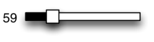
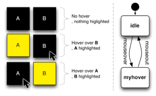

<!-- Source PDF SHA-256: 0610523abebe3aa77dbaa868e8f0ef4a2f54b51970a78bce0e3d8253ba395a25 -->

<a id="page-1"></a>

# ConstraintJS: Programming Interactive Behaviors for the Web by Integrating Constraints and States

[Source PDF](https://from.so/assets/pdfs/oney-constraintjs-uist2012.pdf) · [Publisher page](https://doi.org/10.1145/2380116.2380146)

Stephen Oney, Brad Myers Carnegie Mellon University Pittsburgh, PA 15213 USA {soney, bam}@cs.cmu.edu

![Figure 1: The code on the right produces the interface on the left. Here, asynchronous calls are made to the Facebook API using the fb\_request function to fetch a list of friends (line 1) and a profile picture for each friend (lines 2—5). These values are placed into the friends and pics constraint variables respectively. Lines 9—21 declare a template that depends on these variables. As the list of friends is loading, friends.state will be pending, so the message “Loading friends…” is displayed (line 10). After the list of friends has loaded (lines 12—20) the picture for each friend is displayed alongside their name. While the application is waiting for the Facebook API to return a picture URL for a friend, a loading image (loading.gif) is displayed (line 15). The code also correctly notifies the user of any errors (lines 11, 17).](../figures/oney-constraintjs-uist2012/figure-001-p001.png)

Joel Brandt

Advanced Technology Labs, Adobe San Francisco, CA 94103 USA joel.brandt@adobe.com

```
 1 friends = cjs.async(fb_request("/me/friends"));
 2 pics    = friends.map(function(friend) {
 3               return cjs.async(fb_request( "/" + friend.id
 4                                                + "/picture"));
 5           });
 6
 7 //...
 8
 9 {{#diagram friends.state}}
10    {{#state pending }} Loading friends...
11    {{#state rejected}} Error
12    {{#state resolved}}
13       {{#each friends friend i}}
14          {{#diagram pics[i].state}}
15             {{#state pending }} 
16             {{#state resolved}} 
17             {{#state rejected}} 
18          {{/diagram}}
19          {{friend.name}}
20       {{/each}}
21 {{/diagram}}
```

Figure 1: The code on the right produces the interface on the left. Here, asynchronous calls are made to the Facebook API using the fb\_request function to fetch a list of friends (line 1) and a profile picture for each friend (lines 2—5). These values are placed into the friends and pics constraint variables respectively. Lines 9—21 declare a template that depends on these variables. As the list of friends is loading, friends.state will be pending, so the message “Loading friends…” is displayed (line 10). After the list of friends has loaded (lines 12—20) the picture for each friend is displayed alongside their name. While the application is waiting for the Facebook API to return a picture URL for a friend, a loading image (loading.gif) is displayed (line 15). The code also correctly notifies the user of any errors (lines 11, 17).

UIST ’12, October 7–10, 2012, Cambridge, Massachusetts, USA. Copyright 2012 ACM 978-1-4503-1580-7/12/10...$15.00.

> Permission to make digital or hard copies of all or part of this work for personal or classroom use is granted without fee provided that copies are not made or distributed for profit or commercial advantage and that copies bear this notice and the full citation on the first page. To copy otherwise, or republish, to post on servers or to redistribute to lists, requires prior specific permission and/or a fee.

## ABSTRACT

Interactive behaviors in GUIs are often described in terms of states, transitions, and constraints, where the constraints only hold in certain states. These constraints maintain relationships among objects, control the graphical layout, and link the user interface to an underlying data model. However, no existing Web implementation technology provides direct support for all of these, so the code for maintaining constraints and tracking state may end up spread across multiple languages and libraries. In this paper we describe ConstraintJS, a system that integrates constraints and finite-state machines (FSMs) with Web languages. A key role for the FSMs is to enable and disable constraints based on the interface’s current mode, making it possible to write constraints that sometimes hold. We illustrate that constraints combined with FSMs can be a clearer way of defining many interactive behaviors with a series of examples.

Author Keywords Constraints; Finite-state Machines; Bindings; Web Development; User Interface Technology

### ACM Classification Keywords

H.5.2 \[Information Interfaces and Presentation\]: User Interfaces – Interaction styles.

## INTRODUCTION

The World Wide Web is perhaps today’s most widely used GUI platform. On the Web, HTML, CSS, and JavaScript define a page’s content, style, and interactivity respectively. These three languages interact with each other through a shared representation of the page called the Document Object Model (DOM). JavaScript code defines interactive behaviors with callbacks that modify the DOM using side effects — a paradigm used by most GUI frameworks. However, this paradigm of using callbacks and side effects often results in developers writing interdependent, opaque, and error-prone “spaghetti-code,” a problem that was identified over 20 years ago \[13\].

### Constraints

Researchers have shown that constraints — relationships that are declared once and automatically maintained — can help developers avoid writing spaghetti code \[10,13\]. However, constraints have only caught on in GUI programming in two special-purpose ways: 1) data bindings for frameworks that use the Model-View-Controller (MVC) or related design patterns to keep the GUI view in sync with its model (e.g., \[20,21,22\]) and 2) special-purpose graphical constraints that control the layout of graphical elements (e.g., \[4\]). Android’s Java SDK, for instance, contains both a constraint-based approach for specifying UI layout and a completely separate set of Java classes for several pre-defined types of data bindings.

<a id="page-2"></a>

Similarly, for Web programming, CSS offers a limited constraint language for specifying graphical layout, and separately, there are several JavaScript-based data-binding libraries \[20,21,22\]. While both of these types of constraints are useful to programmers, they are often limited in expressiveness, and further are almost entirely distinct and unaware of each other, despite their conceptual similarities. For instance, while current JavaScript data binding libraries allow developers to create constraints to set the content of DOM nodes, they do not allow them to create constraints that control CSS or DOM attributes.

### States in GUIs

One of the main differentiators of interactive behaviors from general programming is that GUIs are often stateful \[9\] – the application state determines its appearance and behavior. Indeed, when thinking about graphical layouts and data bindings, interaction designers often think in terms of states, along with constraints \[12\]. As an example, consider the requirement: “when the toolbar is docked, it is displayed above the workspace; when it is dragging, it follows the mouse.” Here, each constraint (“the toolbar is above the workspace” or “the toolbar follows the mouse”) applies in different application states (“when the toolbar is docked” or “when the toolbar is being dragged”). Transitions describe when and how the application changes state – e.g., when the user presses the toolbar header in docked mode, it enters dragging mode.

### ConstraintJS

In this paper, we describe the design and implementation of ConstraintJS<sup>1</sup> (CJS), a system that provides constraints that can be used both to control content and control display, and integrates these constraints with the three Web languages – HTML, CSS, and JavaScript. CJS is designed to take advantage of the declarative syntaxes of HTML and CSS: It allows the majority of an interactive behavior to be expressed concisely in HTML and CSS (see Figure 1), rather than requiring the programmer to write large amounts of JavaScript.

In addition, we go beyond the existing constraint literature by integrating the notion of state into our constraint system, allowing developers to write constraints that sometimes hold. We show that the development of interactive behaviors in GUIs can be simplified by integrating finite-state machines (FSMs) with constraints in ConstraintJS. Not only can we create more expressive constraints; we can also create many interactive behaviors using only FSMs and constraints, without extra JavaScript. The example in Figure 1, for instance, requires almost no imperative code. Furthermore, we find that state-oriented constraints integrate well with existing event architectures, including JavaScript’s.

### Contributions

- We provide a new constraint model by integrating FSMs with constraints, allowing programmers to easily enable and disable constraints depending on the application state. This model further enables 1) support for the asyn-

> <sup>1</sup> We invite our readers to read the full documentation and download ConstraintJS at www.constraintjs.com.

chronous behaviors which are inherent in Web programming, and 2) the full control provided by one-way constraints that programmers desire \[11\], but with much of the expressiveness provided by multi-way dataflow(constraint solvers \[16\].

- We show in our ConstraintJS system that constraints and FSMs can be effectively integrated with three Web languages – JavaScript, CSS, and HTML.

- We illustrate the effectiveness of the design and implementation of ConstraintJS with example applications.

## CONSTRAINTJS OVERVIEW

ConstraintJS uses one-way$constraints \[18\]. A constraint is a relationship that is declared once and maintained by the system automatically. For instance, if a is constrained to b+1 (expressed as a &lt;- b+1), then changes to b affect a. One-way constraints compute the value of a variable based on others, but not vice-versa, and are therefore like spreadsheet formulas (a &lt;- b+1 solves for a). This is in contrast with multi-way constraints, where relationships can be calculated in any direction \[16\] (a &lt;-&gt; b+1 solves for a or b).

CJS combines one-way constraints with FSMs in order to make constraints more expressive. An FSM describes a behavior in terms of the states or modes that the behavior can be in, and the triggers (or events) that cause transitions among the states. Surveys have shown that FSMs are commonly used by designers and programmers when they are specifying how an interface should look and behave \[12\].

Multiple independent FSMs are often required to describe the look and feel of a single interactive element. Consider the everyday example of radio buttons that may be selected with the mouse or keyboard. Each radio button is controlled by a combination of many states: if the radio button has keyboard focus, it should have an outline around it, and there are various events that change which button has keyboard focus. Separately, if the radio button is currently checked, it should have a dot in the center. Finally, the radio button changes its look while it is being interacted with using the mouse, based on whether it is idle, being hovered over, if the mouse is pressed down, or if it is pressed down and moved outside while pressed. Combining all of these independent states into a single diagram would require 2×2×4 = 16 states, many of which will be semantically un-intuitive (e.g., mouse pressed and outside with keyboard focus and checked). CJS allows the programmer to instead create multiple independent FSMs to control GUI behavior and appearance by enabling or disabling constraints while allowing for a much more understandable and maintainable set of states.

## MOTIVATING EXAMPLE

<a id="page-3"></a>

To help concretely illustrate our contribution, consider the example shown in Figure 1, which uses the Facebook API to pull in a list of Facebook friends and display their names alongside their pictures. The Facebook API makes this a three-step process: First, the code must retrieve a list of friend IDs. This is done using one Facebook API call, which returns a list of friend IDs and names. After the list of friends has been retrieved, the second step is to take this list of friend names and retrieve a URL pointing to a picture for each friend. This means that the code must make another Facebook API call for each friend the user has. Finally, once these data are retrieved, they must all be correctly displayed.

To further complicate matters, every Facebook API call is asynchronous. This means that when a call is made to the Facebook API, Facebook does not provide a return value immediately. Instead, a callback function is executed at a later point when the data are ready. This introduces three types of complications. First, the system must wait for the initial API call (which fetches the list of friends) to finish before attempting to make API calls for each friend the user has. Second, when fetching the friends’ pictures, the code cannot rely on the API to send return values back in the same order in which they are requested. For example, if the code asks for pictures for Alice and then Bob, the Facebook API might return Bob’s picture before Alice’s. The developer must take measures to ensure that the right friend is mapped to the right picture. Finally, the code must gracefully handle the failure of any of these asynchronous calls.

The fact that the API calls are asynchronous means that in a naïve implementation, the user will have to wait for all three steps to be completed in series: first, for the list of friends to load, then for the URL for each friend's photo, and finally for the image located at that URL to load. To provide a good user experience, however, the system should indicate progress by displaying whatever information is available: The application should start with a “loading” screen, then add in the name and a picture-loading graphic when it has a friend’s name but not a picture, and finally replace the loading icon with the photo when it has a photo URL.

Implementing this in JavaScript without ConstraintJS requires writing a large amount of error-prone code: It would require multiple nested callbacks and scope checking to ensure that the pictures are loaded and displayed in the right places, that the friends’ pictures do not attempt to load before they are ready, and that images and text indicating loading delays and errors are properly displayed for every profile. It would also require significant code to ensure that the view stays in sync with the model – that the place-holder symbols show up and then disappear when a picture is available, that the list of friends and pictures is in the right order, and that each picture is linked properly to each friend. Standard JavaScript requires around 20 lines of code to replicate the functionality of lines 1–5 in Figure 1, including four nested callbacks and is generally unclean, spaghetti-like interdependent code that would be difficult to adapt to UI specification changes. The root of this problem isn't JavaScript's syntax (addressed by CoffeeScript and others) or its lack of built-in functions (addressed by libraries like jQuery). It's the fundamental callback/side-effect mechanism that JavaScript requires. ConstraintJS represents a better alternative.

With ConstraintJS, things are much easier. The code is shown in Figure 1. At a high level, this code sets up a constraint variable (friends) whose value is the list of friends (line 1). This variable will have no value until the list of friends has been fetched. It then declares a constraint variable (pics) with a picture URL for each of these friends. pics will not have a value until friends returns a value. When friends returns a list of friends, pics takes that list and returns a list of picture URLs for each friend (lines 2–5). Before any of these constraint variables have values, we create an HTML/Handlebars template \[23\] whose value depends on friends and pics (lines 9–21). This template looks at every friend and their state. If friends has not loaded, it displays the text “Loading friends…” (line 10) When friends has loaded, it displays the name of each friend (lines 12–20). For each friend, if the picture URL has not been loaded yet, then the code displays a loading image (line 15). If it has been loaded, then it displays the friend's photo (line 16).

Overall implementing this example with constraints produces relatively clear and straightforward code. Another benefit of using constraints is that if our list of friends were a changing entity (i.e. the code intermittently updates the list of friends) the code in Figure 1 would automatically update (and not completely replace) the list of friends to reflect any changes over time. We will go over the components this example in more detail in the “API” section below.

## RELATED WORK

Because ConstraintJS integrates multiple models, its design is informed by work in several domains, including constraints, finite-state machines, and event architectures.

### Constraints in Imperative Languages

Several systems have enabled constraint programming in imperative languages. Kaleidoscope \[5\] mixes imperative and constraint programming by treating variables as streams that are programmatically advanced and allowing programmers to specify time intervals when constraints hold. ConstraintJS uses a model more suited for interactive applications. Rather than allowing constraints to be switched on and off by treating them as streams, CJS switches constraints on and off based on application state.

Several data-binding libraries are also available for JavaScript. Knockout \[22\], Ember \[20\], and Backbone \[21\] are JavaScript libraries that enable declarative bindings between JavaScript objects and DOM objects. They contain templating features that allow DOM nodes created by these templates to be automatically updated when a property’s value changes. However, none of them includes states or FSMs in their templating or binding syntaxes. In addition, they do not allow programmers to attach bindings to control attributes or CSS values of arbitrary DOM nodes. Data binding libraries are also available for the related ActionScript language \[24\]. Tangle \[25\] also allows for limited types of bindings to be used to affect DOM properties. However, the types of constraints that can be set are limited and once constraints are installed, they are permanent.

<a id="page-4"></a>

Finally, CCSS extends CSS by enabling hierarchical arithmetic constraints to be set on CSS properties \[2\]. While these types of constraints increase the flexibility of CSS, they do not provide any way to add constraints from JavaScript variables to specify behavior. Standard CSS also has limited support for some device-dependent constraints. For example, media queries allow CSS rules to depend on the user’s display size.

### States in Imperative Languages

The use of FSMs in user interface toolkits has a very long history (e.g., see \[14\]). More recently, Chasm \[19\] has used a tiered representation to describe 3D user interfaces while allowing developers to specify finite state machines as part of the paradigm. However, Chasm does not include any mechanism for specifying constraints or permanent relationships among objects.

IntuiKit \[25\] allows interface designers to specify how an image should appear in different states but does not enable interaction, constraints, or any other primitives necessary for interaction. Similarly HsmTk \[3\] allows state diagrams to be used to define interactivity in the context of an imperative language (C++) but has no notion of constraints or relationships between the underlying data and the view. SwingStates \[1\] also integrates state diagrams into the Java Swing toolkit. It features parallel state diagrams (the ability to have multiple diagrams affect one object) and fits well with the standard Java syntax. SwingStates does not have any notion of constraints or dependencies among objects.

Adobe Flex \[24\] includes mechanisms for customizing views based on states using its MXML language and also includes the ability to bind data to attributes. However, the notion of states in Flex is specific to components, which makes it difficult for a widget’s behavior to depend on other states such as the application or parent widget’s state. Also, in Flex, data bindings are restricted to MXML attributes and require extra syntax for dealing with collections of objects.

### Dealing with Events

ConstraintJS utilizes events to trigger the transitions between states of an FSM. Event-action mechanisms have a long history in GUI programming \[14\]. Recently, FlapJax \[10\], a language implemented as a JavaScript library, introduced an architecture that allows events and constraints to share similar models and syntaxes. Proton \[8\] also introduced a declarative syntax for describing sequences of events for touch-based devices. The focus of both of these systems is on building more intuitive and understandable event architectures. The focus of ConstraintJS is related, but different: to focus on ways that constraints can help build highly state-oriented interactive behaviors. For this reason, CJS integrates FSMs into its constraint model. Although we opted to build on JavaScript’s standard event architecture, CJS and both of these event architectures could be complimentary.

### Visualization Tools

Several libraries for producing HTML-based visualizations \[4,7\] include a limited form of constraints for specifying dependencies between underlying data and graphical visualizations of those data. For example, D<sup>3</sup> \[4\] is a library for creating visualizations in JavaScript, manipulating DOM

properties based on data. D<sup>3</sup> allows designers to create visualizations of data by creating data bindings from the data to DOM properties. ConstraintJS borrows some of the ideas from the ways these systems deal with collections of data. The focus of these libraries is on producing visualizations, whereas CJS is focused on using constraint to help write interactive behaviors.

## THE API OF CONSTRAINTJS

The following sections describe the ConstraintJS application programming interface (API). All of ConstraintJS’s functionality is accessed via a global cjs() JavaScript function<sup>2</sup> to avoid potential conflicts with other libraries.

### Basics: Creating Constrainable Variables

Any JavaScript object or widget may be turned into a constrainable variable using the cjs function with the JavaScript variable as a parameter. For instance, this code snippet creates x as a constrainable variable whose value is 1:

```
var x = cjs(1); // x <- 1
```

The .get() function fetches the value of a constrainable variable and .set(value) sets its value:

```
x.get();  // = 1
x.set(2); // x <- 2
x.get();  // = 2
```

Dynamically computed variables can be created by passing a function as the parameter:

```
var y = cjs(function() {
   return x.get() + 1;   // y <- x + 1
});
x.get();  // = 2
y.get();  // = 3
x.set(9); // x <- 9
y.get();  // = 10
```

Constrainable variables also have several utility methods to create new dependent variables. For instance, the declaration of y above may seem cumbersome but the same thing can be achieved with:

```
y = x.add(1);  // y <- x + 1
```

In this case, .add() is a built-in function that creates a new constrainable variable. Custom constraint functions may also be created, as we describe in “Convenience Methods” below.

Constraints may be “conditional” if an object with a “condition” property is passed in:

```
var z = cjs({ condition: x.gt(0)  // if x > 0
               , value: x }          // z <- x
               { condition: "else"   // else
               , value: x.mul(-1)}); // z <- x*-1
```

### Constraints from UI Widgets

Developers can also create constrainable variables tied to user widgets. For example, suppose a developer wants to create a constrainable variable whose value is always the value of the jQuery UI slider widget shown in Figure 2,

- <sup>2</sup> In JavaScript, function objects may have properties, so although cjs is a callable function, it also has subfields (e.g., cjs.mouse).

<a id="page-5"></a>



Figure 2: An illustration of a jQuery UI slider widget. Constraint variables can be attached to track the value of this widget.

called jq\_ui. The constrainable variable s will have a getter function that returns the slider’s value using the jQuery UI syntax:

```
var s = cjs(function() {
     return jq_ui.slider.option("value");
});
```

The variable s now knows how to compute its value but it does not know when to compute its value. One possible answer is to get its value whenever it is requested. However, for many constrainable variables, recomputing the value is expensive and it is best to avoid recomputing values more than necessary. For this reason, when a constrainable variable’s value is requested, its value is cached and not recomputed until the cached value has been invalidated using the .invalidate() function. Invalidation and evaluation are covered further in the “implementation” section, but the takeaway is that ConstraintJS must be told when the slider should invalidate its cached value, again using the jQuery UI syntax:

jq\_ui.on("slide change", s.invalidate);

Thus, it only takes four lines to create a variable whose value always represents the slider’s value. This can now be treated just like any other constrainable variable and have any number of other variables, including DOM elements (as shown below) depend on it.

ConstraintJS includes several built in variables:

- cjs.mouse.x – current mouse x position

- cjs.mouse.y – current mouse y position

- cjs.keyboard.pressed – an array of the keys that are currently pressed

- cjs.keyboard.modifiers – alt, ctrl, and shift are true if pressed, false otherwise

- cjs.touches – an array of finger presses on touchscreens

- cjs.time – milliseconds since midnight 1/1/1970

### Constraining DOM objects to variables

We have shown how to create constrainable variables from regular JavaScript variables. However, to affect any user-visible behaviors, these constraint variables must be linked to the Document Object Model (DOM), the underlying representation for every element on a webpage.

Suppose a developer wants to create the color selection interface shown in Figure 3. As the user selects a color with the sliders, the background color of the .container<sup>3</sup> element and the text value in .hexval automatically update. Three of the sliders shown in Figure 2 and implemented in the previous section are used, named r, g, and b. A constrainable variable named hex will hold the hexadecimal color value:

> <sup>3</sup> A web page’s DOM objects have an optional “class” attribute, which can have any number of user-set values. In the standard HTML selector syntax, we can refer to an element with class name “x” as .x so here the class is the “container”.


Figure 3: A color selector that uses constraint variables to automatically update the preview color and hex value text. A constraint variable tracks the values for each of the red, green, and blue sliders (r, g, and b respectively.) A fourth constraint variable (hex) computes a hex color value. Finally, constraints update the background color and text of the color selector to reflect the slider values.

// decimalToHex converts an integer to hex var hex = cjs(function() { return "#" + decimalToHex(r.get()) + decimalToHex(g.get()) + decimalToHex(b.get()); });

Now, a constraint is created from hex to .container (background color) and .hexval (text). The code must first search for the appropriate DOM objects, using cjs.$. This function takes in a query string as a parameter and outputs a constrainable variable with an array of DOM elements that match that query<sup>4</sup>. As the DOM changes, the value of the array changes automatically<sup>5</sup>. Any of several built-in functions will modify these DOM objects:

- .class(value) – set the class name of a DOM object

- .attr(attr\_name,value) – set any attribute of the DOM obj.

- .css(attr\_name,value) – set a CSS attribute of the DOM obj.

- .text(value) – set the text value of a DOM obj.

- .val(text) – set the value of a text input obj.

- .children(value) – set the child nodes of a DOM obj. value may be an array.

In this example,.css() sets the background color of .container and the .text() value of .hexval:

cjs.$(".container") .css("background-color", hex); cjs.$(".hexval").text(hex);

> <sup>4</sup> In JavaScript, “$” is a legal variable name. The JavaScript library jQuery (jquery.com) popularized the convention of having a function named “$” to search for DOM objects with a query string.

> <sup>5</sup> .snapshot() can be used to return a non-updating array

<a id="page-6"></a>

Then, as the user moves the slider, the background color and text of the surrounding box also change. Now suppose that if the variable changes values too quickly, the developer does not actually want to update our DOM element every time the constraint changes, but limit it to a certain number of changes per second. All of the six methods mentioned take an optional argument specifying the maximum update interval:

cjs.$(".hexval").text(hex, 500);

This will ensure that there is at least a 500 millisecond delay between consecutive updates to .hexval but that .hexval always has the latest constraint value.

### Finite State Machines

Because many pages have properties and graphics that depend on the current state, ConstraintJS integrates its FSMs with constraints and the page’s HTML and CSS. To illustrate, suppose a developer wanted to implement the behavior shown in Figure 4. Here, there are two DOM elements and hovering over one has the effect of highlighting the other element. The code to create the FSM shown in the right side of Figure 4 is shown below<sup>6</sup>:

```
var block_a_fsm =
cjs  .fsm()
     .add_state("idle")
       .add_transition(cjs.on("mouseover", block_a)
                      , "myhover")
     .add_state("myhover")
       .add_transition(cjs.on("mouseout", block_a)
                      , "idle")
     .starts_at("idle");
```

This snippet uses “chaining,” a convention in JavaScript where an object property performs an operation on that object and returns the object back. Here, cjs.fsm() creates an FSM and .add\_state("idle") adds a new state named “idle” to that FSM and returns the FSM back. The .add\_transition() method then creates a transition from the last state added to any other state. Its first argument specifies when the transition should occur. ConstraintJS has several built in event types, including cjs.on(&lt;event&gt;, &lt;element&gt;), which listens for &lt;event&gt; to occur on &lt;element&gt;. Custom events may also be created. The second argument to .add\_transition() is the state to which the FSM will transition when the event occurs. Finally, .starts\_at specifies the initial state of the FSM.

#### Binding Constraint Values to FSM states

The developer would then create variables and constraints that depend on this FSM. The two blocks shown in Figure 4 would require two FSMs: block\_a\_fsm and block\_b\_fsm. The behavior for block\_a would be as follows (the code for block\_b is analogous):

```
block_a.css("background-color",
                block_b_fsm, {
                   "idle":    "black",
                   "myhover": "yellow"
            });
```

> <sup>6</sup> The state name myhover is used in this example instead of hover to emphasize that this is not the standard CSS built-in hover.



Figure 4: (Left) An illustration of an interactive behavior where hovering over one block highlights the other block. (Right) the FSM used by both blocks to track their state.

The second parameter passed into block\_a.css is an FSM. The third parameter is an object where the keys ("idle" and "myhover") represent states in the FSM passed in<sup>7</sup>. The values ("black" and "yellow" respectively) represent the value for the constraint in the different states. Alternatively, we could create a constraint for the hover color to be whatever color is shown in the hex variable in Figure 3:

```
block_a.css("background-color",
            block_b_fsm, {
               "idle" : "black",
               "myhover": hex
            });
```

Every FSM also has a variable called .state whose value is the name of its current state. For instance, block\_b\_fsm.state.get() returns either "idle" or "myhover" depending on the current state of block\_b\_fsm. This allows an alternate implementation approach: the class attribute of block\_a and block\_b could be constrained to the value of state. Then, custom CSS for the classes idle and myhover could be used to specify how the block is displayed visually:

```
// JavaScript
block_a.class(block_b_fsm.state);
block_b.class(block_a_fsm.state);
// CSS
.idle    { background-color: black;  }
.myhover { background-color: yellow; }
```

### Asynchronous Constraints

<a id="page-7"></a>

In JavaScript, developers often have to deal with asynchronous calls: requests that do not provide a return value right away, but instead use a callback to provide the return value at some later time. The Facebook API described earlier in the paper uses asynchronous callbacks. For example, the fb\_request function takes a query (e.g., "/me" to fetch the information of whomever is logged in) and a callback function that will be called whenever the return value is ready. Sometimes, the asynchronous callback will receive an error, (e.g. if we passed in an incorrectly formatted query in the initial call) or might not return at all (e.g., if there was a network problem). To handle these cases in conventional JavaScript code, a developer would need to both create custom error handling code inside the callback and also manage a timeout after which time a query is considered failed.

> <sup>7</sup> Multiple states may be selected by joining them with a comma: "idle, myhover" or with wildcards: "\*". Transitions may also be used to instantaneously set constraint values: "idle -&gt; myhover".


Figure 5: The FSM of asynchronous constraints in ConstraintJS. Asynchronous constraints are constraints that don’t have a value until after some delay period, e.g. data returned from network or file system queries. While the constraint is waiting for a value, the FSM is in the “Pending” state. When it successfully receives a value, it enters the “Resolved” state. If there is an error or the request times out, it enters the “Rejected” state.

Constraints are particularly well-suited to handling asynchronous values because they automatically propagate values when values become available. ConstraintJS handles asynchronous values with a combination of a built-in FSM and a constrainable variable that depends on that FSM. The FSM for asynchronous constraints has three states:

- "pending" – waiting for a result

```
•   "resolved" – a result was successfully returned
```

- "rejected" – an error occurred

Asynchronous constraints are created with the cjs.async() method, which automatically creates the FSM in Figure 5 to track the state of the constraint. cjs.async() returns a constraint whose .state property is the FSM in Figure 5. This constraint can be treated just the same as normal constraints; we can depend on them, set up dependencies in them, etc. However, the variable will not have a value until the asynchronous callback has returned. If we want to update the variable’s value, we can call its .refresh() method.

### Templates

ConstraintJS also allows HTML templates to be declared in the syntax similar to Handlebars.JS \[23\] or Ember \[20\] with values that update with the constraint variables. We extend the syntax of Handlebars by allowing states to be included in the template declaration. These templates accept snippets of HTML code with constraints that automatically update the values of parameters. Templates are created with the cjs.template function and variables are specified using double curly braces ({{x}}). For instance, this template creates a &lt;div&gt; element whose text is constrained to the variables firstname and lastname:

&lt;script id="greeting" type="cjs/template"&gt; &lt;div&gt;Hello {{firstname}} {{lastname}}&lt;/div&gt; &lt;/script&gt; //...

var fn = cjs("Mary") , ln = cjs("Parker"); cjs.template("#greeting" , {firstname: fn, lastname: ln});

These templates may also include conditionals (omitting the &lt;script/&gt; tag in subsequent examples):

```
{{#if logged_in}}
     <div>Hello {{firstname}}
                {{lastname }}</div>
{{#else}}
     <a href="login">Log in</a>
{{/if}}
```

and iterations through collections:

```
         {{#each people person}}
            <div>Hello {{person.firstname}}
                       {{person.lastname }}</div>
         {{/each}}
and state diagrams:
```

```
{{#diagram selected_lang}}
     {{#state english}}
        <div>Hello {{firstname}}
                   {{lastname }}</div>
     {{#state french}}
        <div>Bonjour {{firstname}}
                     {{lastname }}</div>
{{/diagram}}
```

### Arrays

ConstraintJS has several functions for dealing with constraints involving arrays. The .map() function creates an array whose values depend on the values of a constraint based on another array. For instance:

```
var x = cjs([1,2,3]);
var y = x.map(function(val) {
                 return val + 1;
             });
y.get(); // = [2,3,4]
```

When the source array (x) changes, .map() computes the difference from the previous value in terms of items removed, items added, and items moved. If the value of x changes to \[3,4\], then y should get the value \[4, 5\]. .map() will detect that 3 was already in the source array and so it only computes the mapped value for 4. The same difference mechanism is used in the .children() method (described above in “Constraining DOM objects to variables”) to avoid removing and re-adding DOM child nodes unnecessarily.

### Animations

ConstraintJS also includes support for JavaScript animations. Animations are “attached” to any variable using .anim(). The resulting variable has the same value as the original variable, but changes are now animated. Animations are currently supported for colors and numbers (which includes objects’ positions). For instance, this snippet creates a variable that animates from red to blue over one second:

var mycolor = cjs("#FF0000"); var animated\_color = mycolor.anim({ duration: 1000 }); var third\_color = cjs(animated\_color) ; mycolor.set("#0000FF");

// mycolor is immediately set to blue // animated\_color and third\_color // animate from red to blue over one second

### Convenience Methods

We previously showed that CJS provides a convenience method for add, as in: x = y.add(z). Suppose a developer wanted to be able to express power functions in the same way, as in:

<a id="page-8"></a>

var x = cjs(2); // x &lt;- 2 var y = x.pow(3); // y &lt;- x^3 y.get(); // = 8 x.set(3); // x &lt;- 3 y.get(); // = 27

The developer can define this method as follows: cjs.constraint.mixin("pow", function(value, to\_the) { return Math.pow(value, to\_the); });

Here, the first parameter to cjs.constraint.mixin is the name of the method for all constrainable variables and the second is a function whose first argument is the incoming value from the referenced variable (x in the snippet above), and the other arguments are whatever are passed into the method.

### Working with Third Party Libraries

So far, we have described how to attach constraints to regular DOM objects but JavaScript has a number of libraries that do not use standard DOM objects. We have already extended ConstraintJS to work with the jQuery UI library, as explained above, but we could never provide support for every possible future library ourselves. Therefore, we provide an extension mechanism so that developers can easily get ConstraintJS’s constraints, FSMs and other features to work with new libraries. For instance, suppose a developer wants to attach constraints to elements in the RaphaelJS drawing library (found at raphaeljs.com), which uses its own graphics primitives. RaphaelJS objects use the .attr(prop, val) method to change display properties, as in:

circle.attr("fill", "red");

A natural way of expressing a constraint on a RaphaelJS graphics primitive might be:

cjs(circle).raphael\_attr("fill", constraint\_var);

ConstraintJS supports this through the function:

cjs.binding.bind(context, attr\_val, setter, max\_updates) which accepts an object (context), a value or constrainable value to set that object to (attr\_val), a function to call to set the object value (setter), and an optional maximum update interval (max\_updates). This provides an easy way to augment the types of constraints that can be made with the cjs.binding.mixin function, where the first parameter is the name of the property we are creating and the second is a function that creates a constraint:

cjs.binding.mixin("raphael\_attr", function(obj, attr\_name, val, max\_updates) { var setter = function(obj, val) { obj.attr(attr\_name, val.get()); };

return cjs.binding.bind(context, val , setter, max\_updates); });

These ten lines of code are all that is necessary to extend ConstraintJS to work with RaphaelJS graphics primitives. ConstraintJS can be extended to work with any number of third party libraries in a similar fashion.

## EXAMPLE APPLICATIONS

We further illustrate ConstraintJS through a series of examples, which we briefly describe below. For the sake of space, we do not include the full example code, but only the relevant snippets. In full, these examples are relatively small, with each example being roughly 200 lines of code.

![Figure 6: An illustration of Bubble Cursors \[6\]. Clickable “targets” are light grey-filled circles. When the cursor is too far from any of the targets, a grey dotted halo appears around the cursor (A). When a target is in range (B), the halo becomes red and shrinks enough that it intersects the target, which turns dark grey. The ConstraintJS implementation of this application allows all of this behavior to be expressed declaratively.](../figures/oney-constraintjs-uist2012/figure-006-p008.png)

Figure 6: An illustration of Bubble Cursors \[6\]. Clickable “targets” are light grey-filled circles. When the cursor is too far from any of the targets, a grey dotted halo appears around the cursor (A). When a target is in range (B), the halo becomes red and shrinks enough that it intersects the target, which turns dark grey. The ConstraintJS implementation of this application allows all of this behavior to be expressed declaratively.

### Bubble Cursor (Custom Graphics)

Although the most of examples explained in the API section have been standard interaction techniques, constraints and FSMs can also be used to more easily define novel interactions. In this example, we implement a bubble cursor \[6\] – a cursor that searches for the nearest target (represented as grey-filled circles) to the mouse within a maximum radius (the dotted grey circle outline in Figure 6-A). The targets are animated to move continuously, and when there is a single target sufficiently near to the mouse, the dotted outline around the mouse is red and the selected target is a darker grey (shown in Figure 6-B). All of the interaction, including the display colors, position, and movement of the targets and cursor, are defined using constraints. Additionally, this example uses the extensions for the RaphaelJS drawing library, explained in the previous section. In contrast with the equivalent imperative version, the constraint version of the code for the bubble cursor is shorter and uses less interdependent components. For instance, the code to set the radius and color of the cursor is relatively self-contained:

// max\_bubble\_select\_distance is a constraint in case // we want it to vary based on mouse speed // select\_cursor\_radius is a constraint that // depends on closest\_target cjs(cursor\_halo) .raphael\_attr("stroke", cjs({ // stroke color condition: closest\_target.isNull() , value: "grey" }, { condition: "else" , value: "red" })) .raphael\_attr("r", cjs({ // radius condition: closest\_target.isNull() , value: max\_bubble\_select\_distance }, { condition: "else" , value: select\_cursor\_radius

}));

<a id="page-9"></a>

In contrast, in a conventional implementation, this functionality would necessarily be spread across callbacks that listened for changes to the closest target and maximum selection distance.

![Figure 7: A scatterplot application implemented with ConstraintJS. By default, constraints set the position of every data point to reflect the values of an underlying data model (A). When a point is dragged (B), a constraint in the opposite direction updates the underlying data model based on the position of the point, which in turn, is constrained to the mouse’s position. The axes may also be dragged (C) and constraints automatically update the axis labels to reflect its position. Finally, axes’ scales may be changed (D) by dragging a point while holding SHIFT. This example illustrates how one-way constraints in ConstraintJS may be combined with FSMs to enable functionality that was previously only possible with multi-way constraints.](../figures/oney-constraintjs-uist2012/figure-007-p009.png)

Figure 7: A scatterplot application implemented with ConstraintJS. By default, constraints set the position of every data point to reflect the values of an underlying data model (A). When a point is dragged (B), a constraint in the opposite direction updates the underlying data model based on the position of the point, which in turn, is constrained to the mouse’s position. The axes may also be dragged (C) and constraints automatically update the axis labels to reflect its position. Finally, axes’ scales may be changed (D) by dragging a point while holding SHIFT. This example illustrates how one-way constraints in ConstraintJS may be combined with FSMs to enable functionality that was previously only possible with multi-way constraints.

### Scatter Plots (Multi-Way Constraints)

As explained earlier, ConstraintJS uses a one-way constraint solver, as opposed to a multi-way constraint solver. Multi-way constraint solvers have been touted as a way to represent some useful constraints that could not be represented as one-way constraints \[15\]. In particular, multi-way constraints have been claimed to make it easier to create variables with dependencies that go both ways. Take the scatterplot application in Figure 7. When a data point is being dragged, a constraint sets the model’s value for that data point depending on its current display position, which in turn is constrained to follow the mouse. When the user releases the point, a constraint in the opposite direction maintains the x and y display positions based on the underlying model, so if the underlying model’s data changes, the point will be updated.

This example was originally used to demonstrate the advantages of multi-way constraints over conventional one-way constraints \[15,16\]. However, by combining one-way constraints with FSMs, ConstraintJS makes this example easy to implement without the overhead of a multi-way solver. In the default state for every point, a constraint sets the display position based on an underlying data model, where the data model consists of constrainable variables (A). When the user starts to drag a point (B), its state changes, so a different set of constraints are enforced that compute the model’s values based on the graphics. When the dragging stops, the state reverts to the default. This is expressed with the following constraint (div and sub are convenience methods for division and subtraction respectively):

```
cjs(dot_fsm, {
       "init, idle": x.div(scale_x),
       "dragging"  : (cjs.mouse.x).sub(offset.x) });
```


Figure 8: An illustration of a touchscreen-based application written with ConstraintJS. Constraints control the position, scale, and angle of photos, which users can manipulate with one or two fingers. When two fingers touch a photo, a red slider appears that controls the photo’s opacity and can be changed using a third finger. Constraints set the position and text of the slider.

A similar pattern is used for the axes and changing the scale. Note that dataflow multi-way solvers required developers to write the constraints in both directions \[15,16\], just as ConstraintJS does – those solvers just select which set of constraints to use. However, developers often found that they needed to extra features, such as constraint hierarchies \[16\] to control the direction. In ConstraintJS, FSMs (which are likely to be more understandable and controllable for developers \[11,12\]) keep track of the dragging state for each point and axis and manages enabling and disabling constraints.

### Multi-touch Moveable/Resizable Image (Tablets)

Although all of the examples we have discussed so far are based on mouse and keyboard input, ConstraintJS is not limited to desktop applications. ConstraintJS works with any kind of user input that can be translated into JavaScript events. Figure 8 illustrates a simple multi-touch photo manipulation interface for tablet devices we built with ConstraintJS. In this application, users can move and manipulate photos in a virtual workspace. Touching a photo with one finger drags the photo within the workspace. Manipulating a photo with two fingers changes the rotation, scale, and position of the photo. When a photo is touched with two fingers, a red slider widget that controls the photo’s opacity appears and may be manipulated with a third finger. The slider indicates the current value by its position and text.

The layout of every component in this application is controlled by constraints – photo position, scale, rotation, &amp; opacity and the position, visibility &amp; text of the opacity slider. Compared to an implementation of this example that does not use constraints, the ConstraintJS implementation requires fewer lines of code and fewer callbacks.

## IMPLEMENTATION

The constraints in ConstraintJS are “pull” constraints, meaning that a constraint’s value is never computed until it is asked for. We based our algorithm on the pointer-constraints algorithm outlined by Vander Zanden et. al \[17\], modifying it to enable more control over when constraints are evaluated

<a id="page-10"></a>

(e.g., immediately after FSM state changes). Using this algorithm, dependencies between variables are automatically computed and values are cached until they are invalidated.

Most data-binding libraries have opted for the “push” model, where whenever a constraint’s value changes, updates are “pushed” to any constraint that depends upon it. However, in ConstraintJS, constraints may be turned on and off depending on application state, meaning that the “push” implementation for constraints might do unnecessary work if values are pushed to constraint variables that are turned off and do not currently affect the DOM. With the pull model for constraints, we can create any number of constraints, but if they do not affect any DOM objects on screen and are not specifically requested, they will not be updated and therefore will not hinder the performance of the application.

Another potential problem with push-based constraints is that cycles may cause an infinite loop if not handled carefully. With pull-based constraints, we do not have this problem. Cycles are automatically computed using a “once around” algorithm (which evaluates each constraint in the cycle only once per invalidation), which has been shown in previous systems to be understandable and useful for developers \[18\].

### Size &amp; Performance

The current version of ConstraintJS is a 25 KB file when compressed using UglifyJS and Gzip. It can be included in any JavaScript application, including phone/tablet web browsers and server-side JavaScript applications that use the Node platform. In testing the current version of ConstraintJS inside the Safari web browser on a 2.6 GHz Core 2 Duo processor, our system was able to handle without any noticeable delay on the order of 1,000 simultaneously evaluated constraints all affecting DOM objects and simultaneously smoothly animate around 200 DOM properties. This is clearly more than any real interactive behavior is likely to need.

## CONCLUSIONS AND FUTURE WORK

We have presented ConstraintJS, a system that integrates constraints and finite-state-machines (FSMs) with Web languages. ConstraintJS can be included in any JavaScript application without browser modifications and it can interoperate with other JavaScript libraries. By integrating constraints and FSMs, ConstraintJS can help simplify the development of interactive behaviors. In fact, many interactive behaviors can be built entirely as a combination of FSMs and constraints, which can both be specified declaratively. For future work, we plan on building an interactive tool to enable non-programmer designers to develop custom behaviors as combinations of FSMs and constraints. However, we feel that in its current form, developers will find that the ConstraintJS language and toolkit is a clearer way to program interactive behaviors for the Web.

## ACKNOWLEDGEMENTS

Funding for this research comes from a Microsoft SEIF award, a grant from Adobe, a Ford Foundation Fellowship, and from NSF grant IIS-1116724. Any opinions, findings and conclusions or recommendations are those of the authors and do not necessarily reflect those of any of the sponsors.

## REFERENCES

- 1. Appert, C. and Beaudouin-Lafon, M. SwingStates: Adding state machines to Java and the Swing toolkit. Software: Practice and Experience 38, 11 (2008), 1149-1182.

- 2. Badros, G.J., Marriott, K., Borning, A., &amp; Stuckey, P. Constraint Cascading Style Sheets for the Web. UIST,(1999), 73-82.

- 3. Blanch, R., Beaudouin-lafon, M., and Futurs, I. Programming Rich Interactions using the Hierarchical State Machine Toolkit. AVI, (2006), 51-58.

- 4. Bostock, M., Ogievetsky, V., and Heer, J. D<sup>3</sup>: Data-Driven Documents. Visualization and Computer Graphics 17, 12 (2011), 2301-9.

- 5. Freeman-Benson, B. Kaleidoscope: Mixing Objects, Constraints, and Imperative Programming. OOPSLA, (1990), 77-88.

- 6. Grossman, T. and Balakrishnan, R. The Bubble Cursor: Enhancing Target Acquisition by Dynamic Resizing of the Cursor’s Activation Area. CHI, (2005), 281-290.

- 7. Heer, J. and Bostock, M. Declarative language design for interactive visualization. Visualization and Computer Graphics 16, 6 (2010), 1149-56.

- 8. Kin, K., Hartmann, B., DeRose, T., and Agrawala, M. Proton: Multitouch Gestures as Regular Expressions. CHI, (2012).

- 9. Letondal, C., Chatty, S., Phillips, W.G., and André, F. Usability requirements for interaction-oriented development tools. PPIG, (2010), 12-26.

- 10. Meyerovich, L., Guha, A., and Baskin, J. Flapjax: A Programming Language for Ajax Applications. OOPSLA, (2009), 1-20.

- 11. Myers, B., Hudson, S.E., and Pausch, R. Past, Present, and Future of User Interface Software Tools. TOCHI 7, 1 (2000), 3-28.

- 12. Myers, B., Park, S.Y., Nakano, Y., Mueller, G., and Ko, A. How Designers Design and Program Interactive Behaviors. VL/HCC, (2008), 177-184.

- 13. Myers, B.A. Separating Application Code from Toolkits: Eliminating the Spaghetti of Callbacks. UIST, (1991), 211-220.

- 14. Olsen, D.R. User Interface Management Systems: Models and Algorithms. Morgan Kaufmann, San Mateo, CA, 1992.

- 15. Sannella, M. and Borning, A. Multi-Garnet: Integrating Multi- Way Constraints with Garnet. UW Technical Report, (1992).

- 16. Sannella, M. SkyBlue: A Multi-Way Local Propagation Constraint Solver for User Interface Construction. UIST, (1994), 137-146.

- 17. Vander Zanden, B.T., Myers, B.A., Giuse, D.A., and Szekely, P. Integrating Pointer Variables into One-Way Constraint Models. TOCHI l, 2 (1994), 161-213.

- 18. Vander Zanden, B.T., Richard, H., Myers, B.A., et al. Lessons Learned About One-Way, Dataflow Constraints in the Garnet and Amulet Graphical Toolkits. TOPLAS 23, 6 (2001), 776-796.

- 19. Wingrave, C.A., Laviola Jr, J.J., and Bowman, D.A. A natural, tiered and executable UIDL for 3D user interfaces based on Concept-Oriented Design. TOCHI 16, 4 (2009), 21.

- 20. Ember. http://emberjs.com/.

- 21. Backbone. http://documentcloud.github.com/backbone/.

- 22. KnockoutJS. http://knockoutjs.com/.

- 23. Handlebars.JS. http://handlebarsjs.com/.

- 24. Adobe Flex. http://www.adobe.com/products/flex.html.

- 25. Tangle. http://worrydream.com/Tangle/.
