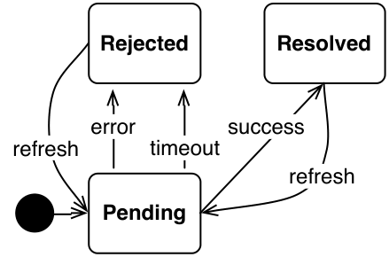
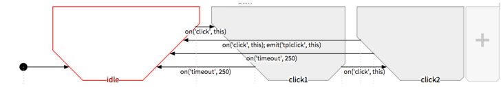
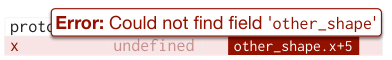
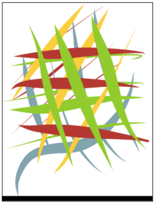
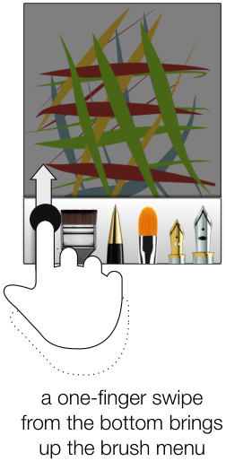
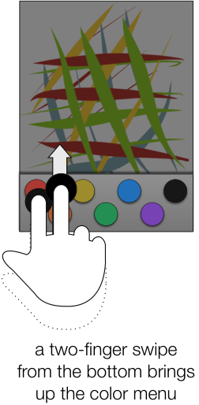
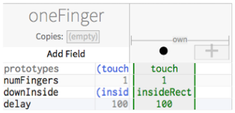
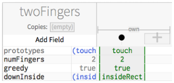
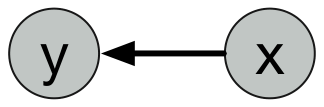
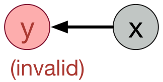

<!-- Source PDF SHA-256: 47da5d2bea7741f63c63db30ced99a6bc4e2dde8b8c2410554b9fe7b81b67376 -->

<a id="page-1"></a>

# Expressing Interactivity with States and Constraints

[Source PDF](https://from.so/assets/pdfs/oney-expressing-interactivity-states-cmu2015.pdf)

by Stephen William-Lucas Oney

Submitted in partial fulfillment of the requirements for the degree of Doctor of Philosophy

April 2015 CMU-HCII-150-100

Committee: Brad Myers (Chair) Joel Brandt (Adobe Research) Scott Hudson John Zimmerman

Human-Computer Interaction Institute School of Computer Science Carnegie Mellon University 5000 Forbes Avenue Pittsburgh, PA 15213 USA

Funding for this research comes from a Microsoft SEIF award, multiple gifts from Adobe, an ARCS Scholarship, a Ford Foundation Fellowship, and from NSF grants IIS-1116724 and IIS-1314356. Any opinions, findings, conclusions, or recommendations are those of the authors and do not necessarily reflect those of any of the sponsors.

<a id="page-2"></a>

Keywords: constraints, state machines, user interface development, development frameworks, multi-touch development, event systems, spreadsheets

<a id="page-3"></a>

## Abstract

A Graphical User Interface (GUI) is defined by its appearance and its behavior. A GUI’s behavior determines how it reacts to user and system events such as mouse, keyboard, or touchscreen presses, or changes to an underlying data model. Although many tools are effective in enabling designers to specify a GUI’s appearance, defining a custom behavior is difficult and error-prone. Many of the difficulties developers face in defining GUI behaviors are the result of their reactive nature. The order in which GUI code is executed depends upon the order in which it receives external inputs.

Most widely used user interface programming frameworks use an event-callback model, where developers define GUI behavior by defining callbacks—sequences of low-level actions—to take in reaction to events. However, the event-callback model for user-interface development has several problems, many of which have been identified long before I started work on this dissertation. First, it is disorganized: the location and order of event-callback code often has little correspondence with the order in which it will be executed. Second, it divides GUI code in a way that requires writing interdependent code to keep the interface in a consistent state. This is because maintaining a consistent state requires referencing and modifying the same state variables across multiple different callbacks, which are often distributed throughout the code.

In this dissertation, I will introduce a new framework for defining GUI behavior, called the state-constraint framework. This framework combines constraints—which allow developers to define relationships among interface elements that are automatically maintained by the system—and state machines—which track the status of an interface. In the state-constraint framework, developers write GUI behavior by defining constraints that are enforced when the interface is in specific states. This framework allows developers to specify more nuanced constraints and allows the GUI’s appearance and behavior to vary by state. I created two tools using the state-constraint framework: a library for Web developers (ConstraintJS) and an interactive graphical language (InterState).

ConstraintJS provides constraints that can be used both to control content and control display, and integrates these constraints with the three Web languages—HTML, CSS, and JavaScript. ConstraintJS is designed to take advantage of the declarative syntaxes of HTML and CSS: It allows the majority of an interactive behavior to be expressed concisely in HTML and CSS, rather than requiring the programmer to write large amounts of JavaScript.

InterState introduces a visual notation and live editor to clearly represent how states and constraints combine to define GUI behavior. An evaluation of InterState showed that its computational model, visual notation, and editor were effective in allowing developers to define GUI behavior compared to conventional event-callback code. InterState also introduces extensions to the state-constraint framework to allow developers to easily re-use behaviors and primitives for authoring multi-touch gestures.

<a id="page-4"></a>

## Acknowledgements

I am grateful for the advice and feedback of my co-advisors, Brad Myers and Joel Brandt. Both of them have helped guide my research trajectory in a beneficial way, from small details to the bigger picture. I also thank my committee for their guidance and feedback since my dissertation proposal. In particular, thanks to my Friendship Ave. roommates (and co-authors): Chris Harrison, Jason Wiese, Amy Ogan, and Eliane Wiese. I will have many fond memories of our time in Pittsburgh.

I would also like to thank a number of other members of the Human-Computer Interaction Institute who brightened my days throughout the PhD, including Eiji Hayashi, Iris Howley, Queenie Kravitz, Ian Li, Jennifer Marlow, Julia Schwarz, Yla Tausczik. I’d also like to thank my other co-authors and collaborators, including John Barton, Su Baykal, Miso Kim, Sukhada Kulkarni, Tessa Lau, Jeff Nichols, Kursat Ozenc, Tao Xie, and John Zimmerman. Most of all, I’d like to thank my most enthusiastic supporters: my parents, Stephenie and Logan II; my sisters Theresa and Christina; and my brother Logan III.

<a id="page-5"></a>

## Table of Contents

- Abstract ..........................................................................................................................iii

- Acknowledgements .........................................................................................................iv

- Table of Contents ...........................................................................................................v

- List of Figures .................................................................................................................viii

- List of Tables ..................................................................................................................xv

- 1 Introduction.............................................................................................................16

- 1.1 Interactive Behaviors ................................................................................................... 16

- 1.2 Problem Statement ...................................................................................................... 18

- 1.3 A Paradigm for Expressing Interactivity...................................................................... 18

- 1.4 Reusing and Combining Behaviors ............................................................................ 21

- 1.5 Multi-Touch Development.......................................................................................... 22

- 1.6 Contributions .............................................................................................................. 22

- 1.7 Outline......................................................................................................................... 23

- 2 Related Work ...........................................................................................................24

- 2.1 Motivating Research.................................................................................................... 24

- 2.2 Constraints .................................................................................................................. 25

- 2.3 Declarative Models for UI Development.................................................................... 28

- 2.4 State Machines in User Interface Tools...................................................................... 30

- 2.5 UI Management Systems and Frameworks................................................................. 32

- 2.6 Behavior Re-Use .......................................................................................................... 33

- 2.7 Visual Programming.................................................................................................... 34

- 2.8 Live Development........................................................................................................ 34

- 2.9 Multi-touch Gestures................................................................................................... 35

- 2.10 Conclusion ................................................................................................................ 36

- 3 ConstraintJS .............................................................................................................38

- 3.1 Web Development Technologies ................................................................................ 38

- 3.2 Contributions .............................................................................................................. 40

- 3.3 Terminology................................................................................................................. 41

- 3.4 Motivating Example .................................................................................................... 42

- 3.5 ConstraintJS Overview ................................................................................................ 45

- 3.6 Implementation........................................................................................................... 56

- 3.7 Example Applications.................................................................................................. 58

- 3.8 Conclusion .................................................................................................................. 62

- 4 InterState..................................................................................................................63

- 4.1 JavaScript Library Limitations..................................................................................... 63

- 4.2 Contributions .............................................................................................................. 64

- 4.3 Motivating Example .................................................................................................... 66

- 4.4 Computational Model................................................................................................. 69

<a id="page-6"></a>

- 4.5 Visual Notation ........................................................................................................... 77

- 4.6 Behavior Reuse ............................................................................................................ 82

- 4.7 InterState Editor.......................................................................................................... 87

- 4.8 Laboratory User Evaluations....................................................................................... 89

- 4.9 Scalability and Evaluation ........................................................................................... 92

- 4.10 Implementation......................................................................................................... 94

- 4.11 Conclusion ................................................................................................................ 102

- 5 Defining Custom Event Types...................................................................................103

- 5.1 Managing Event Conflicts........................................................................................... 103

- 5.2 Improving Custom Events .......................................................................................... 104

- 5.3 Event Infrastructure .................................................................................................... 105

- 5.4 Conclusion .................................................................................................................. 108

- 6 Multi-Touch Primitives.............................................................................................109

- 6.1 Multi-Touch Challenges.............................................................................................. 109

- 6.2 Motivating Example .................................................................................................... 111

- 6.3 Integrating Multi-Touch with InterState..................................................................... 113

- 6.4 Touch Gesture Examples ............................................................................................ 118

- 6.5 Conclusion .................................................................................................................. 122

- 7 Limitations and Future Work ...................................................................................124

- 7.1 Scope............................................................................................................................ 124

- 7.2 Tools for Non-Developers ........................................................................................... 126

- 7.3 Pre-Supplied Widgets .................................................................................................. 127

- 7.4 Debugging Tools.......................................................................................................... 128

- 7.5 Animations .................................................................................................................. 129

- 7.6 Annotations................................................................................................................. 129

- 7.7 InterState Editor Feature Extensions.......................................................................... 129

- 7.8 Direct Manipulation.................................................................................................... 131

- 7.9 Better Support for Exploration ................................................................................... 132

- 7.10 Referencing Web Services in InterState.................................................................... 132

- 7.11 Conclusion ................................................................................................................ 132

- 8 Conclusion ...............................................................................................................133

- 9 References ................................................................................................................135

- Appendix A ConstraintJS Tutorial ..................................................................................148

- A.1 Introduction................................................................................................................ 148

- A.2 Using ConstraintJS..................................................................................................... 149

- A.3 Constraint Variables................................................................................................... 149

- A.4 ConstraintJS Internals ................................................................................................ 151

- A.5 DOM Bindings ........................................................................................................... 152

- A.6 Detecting Variable Changes ....................................................................................... 153

- A.7 Array and Map Constraints........................................................................................ 154

- A.8 States and FSMs.......................................................................................................... 155

- A.9 Templates.................................................................................................................... 157

<a id="page-7"></a>

- A.10 Template Syntax ....................................................................................................... 157

- Appendix B ConstraintJS API.........................................................................................161

<a id="page-8"></a>

## List of Figures

- Figure 1.1 An example ConstraintJS application that uses the Facebook API to retrieve

- a list of a user’s friends and subsequently a picture for every friend. While

- the list of friends is loading, the message “Loading friends…” is shown. After

- the list of friends has loaded, this interface displays the name of every friend

- next to their picture. While any user’s picture is loading, a spinning loading

- icon is displayed next to their name. ................................................................. 19

- Figure 1.2 ConstraintJS code to create the interface shown in Figure 1.1. Here, the

- Facebook API is called (asynchronously using fb\_request) to fetch a list

- of friends and a profile picture for each friend. The rest of the code displays

- the data fetched in the first five lines by specifying which graphics should

- appear by state. Chapter 3 further describes this example in detail.................. 20

- Figure 1.3 An illustration of a basic InterState object, named draggable. Properties,

- which control draggable’s display, are represented as rows (e.g. x, y, and

- fill). States and transitions are represented as columns (e.g. no\_drag,

- drag, and drag\_lock). An entry in a property’s row for a particular state

- specifies a constraint that controls that property’s value in that state. Chapter

- 4 further describes this example. ....................................................................... 21

- Figure 3.1 The target application for the motivating example. An asynchronous

- Facebook API call returns a list of friends. While the list of friends is loading,

- “Loading Friends…” appears on screen. After the list of friends has loaded,

- the profile picture of each friend is then independently requested. While the

- application is waiting for the Facebook API to return a picture URL for a

- friend, a loading image is displayed................................................................... 42

- Figure 3.2 The JavaScript code for the example shown in Figure 3.1. This code, which

- uses the jQuery library to increase clarity, first creates an element to display

- the “Loading friends…” loading indicator (line 1). It then makes an

- asynchronous call to load the user’s friends (line 2, handler lines 3-26). Then,

- for every friend, it creates a loading indicator (lines 6-23) and updates their

- picture when it has loaded (lines 15-22). This code requires three levels of

- nested callbacks: one for the initial friends list request, another to create a

- scope closure for every friend (a JavaScript convention), and another to load

- the picture for every friend. ............................................................................... 43

- Figure 3.3 The ConstraintJS code for the example in Figure 3.1. Here, the Facebook

- API is called (asynchronously using fb\_request) to fetch a list of friends

- (line 1) and a profile picture for each friend (lines 2—5). These values are

- placed into the friends and pics constraint variables respectively. Lines

- 8—20 declare a template that depends on these variables. As the list of

- friends is loading, friends.state will be pending, so the message

- “Loading friends…” is displayed (line 9). After the list of friends has loaded

<a id="page-9"></a>

- (lines 11—21) the pictures for all friends are displayed alongside their names.

- While the application is waiting for the Facebook API to return a picture

- URL for a friend, a loading image (loading.gif) is displayed (line 15).

- The code also correctly notifies the user of any errors (lines 10, 17). ................ 44

- Figure 3.4 (Left) An illustration of an interactive behavior where hovering over one

- block highlights the other block. (Right) the FSM used by both blocks to track

- their state. .......................................................................................................... 48

- Figure 3.5 The FSM of asynchronous constraints in ConstraintJS. Asynchronous

- constraints are constraints that don’t have a value until after some delay

- period, e.g. data returned from network or file system queries. While the

- constraint is waiting for a value, the FSM is in the “Pending” state. When it

- successfully receives a value, it enters the “Resolved” state. If there is an

- error or the request times out, it enters the “Rejected” state. ........................... 50

- Figure 3.6 An illustration of a jQuery UI slider widget. Constraint variables can be

- attached to track its value. ................................................................................. 53

- Figure 3.7 A color selector that uses constraint variables to automatically update the

- preview color and hex value text. A constraint variable tracks the values for

- each of the red, green, and blue sliders (r, g, and b respectively). A fourth

- constraint variable (hex) computes a hex color value. Finally, constraints

- update the background color and text of the color selector to reflect the

- slider values........................................................................................................ 54

- Figure 3.8 An illustration of Bubble Cursors \[6\]. Clickable “targets” are light grey-filled

- circles. When the cursor is too far from any of the targets, a grey dotted halo

- appears around the cursor (A). When a target is in range (B), the halo

- becomes red and shrinks enough that it intersects the target, which turns

- dark grey. The ConstraintJS implementation of this application allows all of

- this behavior to be expressed declaratively........................................................ 59

- Figure 3.9 A scatterplot application implemented with ConstraintJS. By default,

- constraints set the position of every data point to reflect the values of an

- underlying data model (A). When a point is dragged (B), a constraint in the

- opposite direction updates the underlying data model based on the position

- of the point, which in turn, is constrained to the mouse’s position. The axes

- may also be dragged (C) and constraints automatically update the axis labels

- to reflect its position. Finally, axes’ scales may be changed (D) by dragging a

- point while holding SHIFT. This example illustrates how one-way

- constraints in ConstraintJS may be combined with FSMs to enable

- functionality that was previously only possible with multi-way constraints. ..... 60

- Figure 3.10 An illustration of a touchscreen-based application written with ConstraintJS.

- Constraints control the position, scale, and angle of photos, which users can

- manipulate with one or two fingers. When two fingers touch a photo, a red

<a id="page-10"></a>

- slider appears that controls the photo’s opacity and can be changed using a

- third finger. Constraints set the position and text of the slider.......................... 61

- Figure 4.1 A representative JavaScript snippet that implements the drag lock behavior

- for an object named draggable. ................................................................... 66

- Figure 4.2 An illustration of a basic InterState object, named draggable. Properties,

- which control draggable’s display, are represented as rows (e.g. x, y, and

- fill). States and transitions are represented as columns (e.g. no\_drag,

- drag, and drag\_lock). An entry in a property’s row for a particular state

- specifies a constraint that controls that property’s value in that state; while

- draggable is in the drag state, x and y will be constrained to mouse.x

- and mouse.y respectively, meaning draggable will follow the mouse

- while dragging. Note that in this example, when the user performs a double

- click to initiate drag lock, the drag\_lock object does enter and then leave

- the drag state intermittently as a result of the mouse.down and

- mouse.up events that are fired during a double click. Section 5.1 will

- introduce a mechanism that would allow a developer to avoid having

- drag\_lock enter the drag state during a double click by adding a delay

- before registering the mouse.down event used in the no\_drag to drag

- transition. This delay would allow a double click (mouse.dblclick) event

- to register resulting in entering the drag\_lock state without any

- mouse.down events registering....................................................................... 67

- Figure 4.3 The JavaScript code for drag lock (introduced in Figure 4.1) augmented to

- allow the user to press ESC to exit from drag lock (lines 42—49), use click

- rather than double click to exit from drag lock (lines 36—41 and several

- lines removed from Figure 4.1), and change the fill color by state (lines 4, 16,

- 26, and 32). As the line numbers for these changes indicate, augmenting the

- example in Figure 4.1 requires significantly modifying the previous

- JavaScript code.................................................................................................. 68

- Figure 4.4 The InterState code for drag lock (introduced in Figure 4.2) augmented to

- allow the user to press ESC to exit from drag lock (the topmost transition),

- use click rather than double click to exit from drag lock (the next topmost

- transition), and change the fill color by state (the bottom field). In this

- example, draggable indicates its current state with its fill color so that it is

- black by default, blue while it is dragging, and navy in the drag\_lock

- state.................................................................................................................... 69

- Figure 4.5 Two objects (obj1 and obj2) have state machines with transitions that fire

- when the mouse clicks. InterState executes the constraints that are set on

- these transitions as if they are executed simultaneously. ................................... 72

- Figure 4.6 An example of a standard radio button widget on the left. The table on the

- right shows the various states that a radio button item may be in with respect

<a id="page-11"></a>

- to whether it is selected, keyboard focused, and pressed. The FSMs for each

- category are independent, meaning that every item has one selection state,

- one keyboard focus state, and one mouse state. These states combine to

- form 2x2x4=16 possible states for any radio button item. ................................ 75

- Figure 4.7 A preliminary version of InterState (then called Euclase). This version

- contains the basic object layout (states as columns and properties as rows).

- However, this version of Euclase does not differentiate between states and

- events. The state of an object is the last event that occurred on that object.

- Every object also has a draw field that specifies, in JavaScript canvas code,

- how it should be drawn (typically referencing other fields), as described in

- section 4.4.5. This example also utilizes the defunct KEEPVALUE primitive,

- described in section 4.4.1. Empty cell values are KEEP by default (greyed out

- in the figure); an idea that was maintained through the current version of

- InterState by replacing the “KEEP” keyword with a circle............................... 78

- Figure 4.8 The trapezoidal state machine design. This version of InterState also used a

- slightly different event type, with each transition using the parameterizable

- on() function to define events. ........................................................................ 79

- Figure 4.9 The final state machine design for InterState state machines. This design

- reduces the amount of horizontal space taken by the state machines. .............. 79

- Figure 4.10 An InterState state machine for an “event-oriented” behavior with few states

- and many events. This state machine represents the behavior of a ball in the

- game of breakout. Here, the ball might bounce off of the paddles, blocks,

- walls, or might go out of bounds (the bottom wall). .......................................... 80

- Figure 4.11 The InterState editor shows one object at a time (in this case, myShape)

- and the fields and current values of every parent object in the containment

- hierarchy (in this case, sketch and paper). The editor also allows

- developers to pin objects to the screen by dragging them to the bottom of the

- window. ............................................................................................................. 81

- Figure 4.12 InterState (then Euclase) with a tree layout. However, the tree notation

- resulted in too many objects being visible at one time and visual clutter.......... 82

- Figure 4.13 InterState uses a prototype-instance inheritance model with multiple

- inheritance. Prototypes are simply specified in the prototypes property.

- Here, my\_square inherits from square. Because my\_square does not

- define a value for height, it inherits the definition of square.height,

- as indicated by the greyed out text in the columns on the right. Note that

- my\_square inherits the definition of height, not the value. Thus, the

- width property of my\_square evaluates to a different value (20) than the

- width of square (15)................................................................................... 83

<a id="page-12"></a>

- Figure 4.14 An object that inherits from both draggable and selectable

- behaviors. Note that the definitions for the color property are inherited

- from draggable ('red') and selectable ('blue'). ............................ 84

- Figure 4.15 An object with multiple copies; copies is set to \['Jane', 'Sue'\].

- Every copy has two properties: my\_copy, which is set to that copy's item

- (here, either 'Jane' or 'Sue') and copy\_num, which is set to that copy's

- index. Here, we are looking at the first copy (index 0). ..................................... 85

- Figure 4.16 Two InterState objects (favs\_panel and color\_disp) that create a

- dynamically changing display for a dynamic list of favorite colors.

- Annotations are in gold boxes. This code stores a list of favorites under

- favs\_panel.favorites. When a user clicks on any color (represented

- favs\_panel’s transition diagram as mouse.click(color), that color

- is added to the list of favorites (by setting favorites to

- favorites.push(color) in the color click transition). Because

- color\_disp’s copies field is set to favorites, new copies of

- color\_disp are added and removed as favorites changes, automatically

- adding and removing visual elements from the screen...................................... 86

- Figure 4.17 Syntax and runtime errors are highlighted in the editor but do not prevent

- the program from running. Fields with errors and other fields that depend

- on them are given the value undefined. ....................................................... 89

- Figure 4.18 The relative times (in minutes) across 20 participants to complete tasks in

- JavaScript (JS) and InterState (IST). Every participant performed one task in

- InterState and one task in JavaScript, meaning that for every one of the four

- bars in this chart, N=10 (overall N=20). The error bars represent the

- standard deviation from the mean. Smaller values are better........................... 91

- Figure 4.19 Benchmark results. In the first test, N is the length of the prototypes chain.

- In the second, N is the number of children. In the third, N is the number of

- prototypes. ......................................................................................................... 93

- Figure 4.20 A representation of the basic object structure for the objects shown in Figure

- 4.13. The basic object tree is a mutable tree that gets modified when the

- developer performs an edit on their program. This model contains three

- objects (sketch, square, and my\_square) and five cells (sq\_protos,

- sq\_width, sq\_height, mysq\_protos, and mysq\_width). Note there

- is no field for my\_square.height, the inherited field that only exists in

- the contextual object tree shown in Figure 4.21. There is also no slot for

- values, which are computed in the contextual object tree because the value of

- a given variable depends on its computation context. This model makes two

- simplifying assumptions. First, it omits the state machines of square and

- my\_square (which would each have one start state). Second, it gives

- human-readable names to objects (sq\_protos, sq\_width, etc.) whereas

<a id="page-13"></a>

- in the InterState runtime, objects’ names only exist in their container

- object’s field name. ............................................................................................ 98

- Figure 4.21 The contextual object tree for the basic object tree shown in Figure 4.20.

- Unlike the basic object tree, the contextual object tree is computed by the

- InterState runtime from the basic object tree. As the basic object tree is

- updated, the InterState runtime automatically updates its contextual object

- tree. This tree bears some resemblance to the tree in Figure 4.20, but with a

- few notable differences. First, every contextual cell contains a computed

- value, which is not present in the basic object tree. Second, every contextual

- dict and contextual cell contains a context that defines how values are

- evaluated. For example, although both c\_sq\_height and

- c\_mysq\_height are cells whose expression is width, their computed

- values (15 and 20 respectively) are different because they are evaluated in

- different contexts. .............................................................................................. 98

- Figure 5.1 A state machine showing the various states of an event with priority p. Every

- event can be in three states: idle, pending fire, and pending block. By default,

- every event is in the idle state. When the event requests to fire (a), through

- the fire method, it enters the pending fire state. After enough time

- (specified by the timeout parameter) or if the event has no timeout

- parameter, then the event’s firing is confirmed (b). If the event firing is

- cancelled (through the cancel method) before the timeout interval passes,

- then the event is cancelled (c). If another event in the same group with

- higher priority is requested before the timeout interval passes, then the event

- moves to the pending block stage (g). If all of the events with a higher

- priority are cancelled, then the event will return to the pending fire state (f).

- If any other event with a higher priority fires, then the event is blocked (d). If

- another event is still pending fire when the event’s timeout interval passes,

- then the event is also blocked (e)...................................................................... 107

- Figure 6.1 The default, “non-greedy” behavior for touch clusters is that every touch

- cluster can claim the same fingers. For instance, suppose a developer defines

- one three-finger touch cluster and three one-finger touch clusters across

- different elements in an interface. With non-greedy behavior, when the user

- presses three fingers down, all four touch cluster activation events would fire.115

- Figure 6.2 Like in Figure 6.1, here the developer has defined one three-finger touch

- cluster and three one-finger touch clusters. However, the developer has

- specified that the three-finger touch cluster should be “greedy”, so that other

- touch clusters should not fire with any of the touches used. In this case, when

- the user presses three fingers down, only the three-finger touch cluster will

- fire.................................................................................................................... 115

- Figure 6.3 In most multi-touch devices, when a user taps a numeric input field, a

- numeric keypad is invoked. In this example, I augment that interaction to

- allow a user’s finger to also “nudge” the numeric slider left or right to select

<a id="page-14"></a>

- a number slightly lower or higher than the current value. Implemented with

- InterState’s touch extensions, this example uses path crossing events to

- determine if the user’s finger is moving horizontally or tapping the widget. .. 119

- Figure 6.4 In this example, the user can swipe one finger up from the bottom of a

- touchscreen to invoke a brushes menu or they can swipe two fingers from

- the bottom of the screen to invoke a colors menu. If the user swipes up, the

- menu is docked (stays in place after the user releases). If the user swipes

- down, the menu hides. While the user is swiping, the menu follows the

- finger. InterState uses the event conflict management system described in

- the previous chapter to differentiate between one-finger and two-finger

- swipes............................................................................................................... 121

- Figure 6.5 This example represents an undo/redo (or more generally, back/forward)

- mechanism for tablet applications. The user first presses down two fingers (in

- the diagram shown, the index and ring fingers) and presses a third to the left

- to undo or a third finger to the right to redo. To prevent conflicts with

- panning and scrolling gestures, this undo/redo gesture also cancels if the two

- finger centroid moves or scales past a low threshold....................................... 122

- Figure A.1 y depends on x (think of x's value as flowing to y) ......................................... 151

- Figure A.2 y is invalidated after x changes ....................................................................... 151

<a id="page-15"></a>

## List of Tables

- Table 4.1 The relative sizes of the user study’s two behaviors and the minimum size of

- modifications required for the tasks. (Note that these numbers represent the

- minimum number of changes, rather than the number of changes made by

- participants.) ...................................................................................................... 90

- Table 4.2 A comparison of the features of basic objects and contextual objects. Basic

- objects are responsible for tracking the definitions that are declared by

- developers. Contextual objects are responsible for tracking the values that are

- used in the runtime. The contextual object hierarchy is automatically

- generated based on the basic object hierarchy.................................................. 96

- Table 4.3 A non-exhaustive list comparing the fields of basic and contextual objects.

- The fields of basic objects are oriented towards tracking definitions, whereas

- the fields of contextual objects are oriented towards tracking values................ 97

- Table 4.4 The inputs and outputs of several attachment types in InterState.

- Attachments create JavaScript objects that can be inherited within the

- context of InterState’s standard inheritance mechanism. ............................... 101

<a id="page-16"></a>

## 1 Introduction

Creating a good Graphical User Interface (GUI) requires more than carefully arranging the graphical elements that define its appearance; it also requires defining the interface’s behavior. A GUI’s behavior consists of the dynamic parts of an interface: how it changes in response to user inputs and other stimuli. It can be described as the feel of a GUI, as opposed to its look. Although there are many effective tools that allow designers to specify a custom GUI’s appearance, defining its behavior is costly, error-prone, and typically limited to expert developers \[85,101\].

### 1.1 Interactive Behaviors

A GUI’s behavior is made up of smaller interactive behaviors, which describe the behavior of specific interface components. An interactive behavior might determine how a button reacts when a user’s mouse cursor hovers over and presses on it or how a sliding menu appears on a touchscreen when a user swipes their finger from the left edge. Taken in aggregate, these interactive behaviors define a GUI’s behavior.

Throughout this dissertation, the terms behavior and interactive behavior are interchangeable. Additionally, the granularity of interactive behaviors is subjective, as very few behaviors are entirely independent. For example, in a shape drawing application, we might consider the behavior of a color selector to be a singular behavior. Still, whether the color selector is enabled or disabled might depend on factors outside of the scope of the behavior, such as whether a shape in the drawing panel is currently selected.

<a id="page-17"></a>

#### 1.1.1 Implementing Interactive Behaviors

Most user interfaces are developed using general purpose programming languages— programming languages whose features are designed to support a wide variety of programming goals. Nearly all widely deployed user interface frameworks built for these languages—e.g., Cocoa, QT, Java Swing, .NET Windows Forms, and JavaScript/Web development—rely on an event-callback programming model \[38,50\]. In this model, developers specify interactive behaviors by writing imperative code that determines how the user interface should react to every relevant stimulus.

The problem with defining interactive behaviors in this model is that a typical interactive behavior involves many events, which has several detrimental effects for developers. First, it splits the implementation of a single behavior across many callbacks in a GUI’s source \[110,132\], making it more difficult to reason about the control flow of a given interactive behavior. Second, a typical GUI component’s behavior and appearance often depend upon its state \[4\] but general-purpose programming languages currently do not support a notion of state. Thus, developers need to properly track and maintain an implicit notion of state across these callbacks. Third, the interactions between distinct GUI behaviors further complicate their implementation, making it more difficult to implement independent, re-usable behaviors. The net result of all these challenges is that event-callback code tends to produce error-prone, interdependent “spaghetti” code \[110\].

Of course, one way to address the challenges developers face writing interactive behaviors is by providing reusable widgets—pre-built, customizable interactive behaviors. A number of GUI toolkits and GUI builders allow developers to drop common widgets into their applications, including scroll bars, buttons, and menus. These widgets can help experienced and novice GUI developers by providing basic scaffolding upon which they can build their application.

However, reusable widgets and GUI builders do not represent a complete solution for the problems UI developers face. Although these widgets allow developers to work at higher abstraction levels—button presses instead of mouse clicks or menu item selections rather than touchscreen presses—the interactions between these components can still be challenging to implement correctly. For instance, a developer might be able to re-use a color selection widget in the context of a drawing application, but they still must program what the effect of the user picking a color should be (to change the color of the currently selected shape) and when it is activated (when a shape is selected).

<a id="page-18"></a>

Also, widget creators cannot anticipate all of the widgets that developers will want or all of the ways they will want to customize a widget. When a designer or developer has an idea for a new interaction technique to help users accomplish a task in their interface, to implement or explore their idea, developer must write it from scratch. Thus it is important that the underlying frameworks and tools they use address the difficulties of creating interactive behaviors. Because designing, implementing, and evaluating new interactive behaviors are common in the Human-Computer Interaction (HCI) community, making interactive behaviors easier to implement is a fundamental problem in HCI \[98\].

### 1.2 Problem Statement

Many of the factors that make interactive behaviors difficult to implement in general-purpose programming languages can be attributed to the reactive nature of interactive behaviors \[85,133\]. Unlike sequential systems, which execute code in the same order it is written, reactive systems execute code in an order that depends upon external inputs, such as mouse, keyboard, touchscreen, timer, or network events that may occur at any time.

Further, many features that make a GUI more usable also make its interactive behaviors more difficult to design and implement \[112\]. Giving users visibility of system status \[118\] requires developers to write code to provide end-users with immediate feedback for any number of ways they might interact with a GUI. Presenting context-relevant information and controls, which helps prevent user errors and contributes to an aesthetically pleasing and minimalist interface \[118\], requires tracking the GUI’s status and modifying its appearance and behavior based on that status. For example, widgets that are not available in a particular state (like the aforementioned color selector when no shape is selected) should be visibly disabled or not shown in that state.

To address this issue, researchers and practitioners have created libraries that augment existing languages and GUI frameworks with new programming models, including constraints (relationships that are maintained automatically) \[94,110,126\] and state machines \[4,137\]. However, when producing a user interface is the programmer’s primary goal, many aspects of the underlying language are often not ideal for expressing interactive behaviors \[85\].

### 1.3 A Paradigm for Expressing Interactivity

This dissertation begins with the insight that programming tools can better support user interface development by supporting language primitives designed to address the challenges of expressing interactive behaviors. I will first present a set of new language primitives and illustrate how they fit together to express interactive behaviors. I then describe a visual notation and live editor to represent these primitives, and a series of evaluations of these primitives. I then will present extensions to these languages primitives to further support developers in creating and re-using custom gestures.

<a id="page-19"></a>

The Application Program Interface (API) primitives outlined in this dissertation combine constraints—relationships that are declared by the developer and automatically maintained by a constraint solver—with state machines—which control an interface's behavior by tracking its state and include a set of rules that control when it changes state. Its use of constraints was motivated by previous research showing how constraints can help developers avoid writing spaghetti code \[94,110\]. In contrast with the event-callback model, which requires writing a snippet of code that considers every possible user event or model change, the relationships specified by constraints are maintained regardless of user events or model changes. Its use of state machines was motivated by the stateful nature of GUIs—the state of an interface or component often dictates its appearance and behavior. However, tracking and maintaining a consistent state can be challenging in event-callback code \[137\].

In this dissertation, I will describe two programming tools that I created based on this paradigm: ConstraintJS and InterState.

#### 1.3.1 ConstraintJS: A Library for Web Developers

ConstraintJS is a JavaScript library that enables constraints to control content and control display features in interactive Web applications. ConstraintJS is designed to take advantage of the declarative syntaxes of HTML and CSS: it allows the majority of an interactive behavior to be expressed concisely in HTML and CSS, rather than requiring the programmer to write large amounts of JavaScript. The example in Figure 1.1 (whose code is shown in Figure 1.2), for instance, requires almost no imperative code.


Figure 1.1 An example ConstraintJS application that uses the Facebook API to retrieve a list of a user’s friends and subsequently a picture for every friend. While the list of friends is loading, the message “Loading friends…” is shown. After the list of friends has loaded, this interface displays the name of every friend next to their picture. While any user’s picture is loading, a spinning loading icon is displayed next to their name.

<a id="page-20"></a>

- 1 friends = cjs.async(fb\_request("/me/friends")); 2 pics = friends.map(function(friend) { 3 return cjs.async(fb\_request("/" + friend.id 4 + "/picture")); 5 }); 6 7 //display code: 8 {{#fsm friends.state}} 9 {{#state pending }} Loading friends... 10 {{#state rejected}} Error 11 {{#state resolved}} 12 {{#each friends friend i}}{{#fsm pics\[i\].state}} 13 {{#state pending }} &lt;img src = "loading.gif"/&gt; 14 {{#state resolved}} &lt;img src = "{{pics\[i\]}}"/&gt; 15 {{#state rejected}} &lt;img src = "error.gif" /&gt; 16 {{/ fsm }} 17 {{friend.name}} 18 {{/each}} 19 {{/fsm }}

Figure 1.2 ConstraintJS code to create the interface shown in Figure 1.1. Here, the Facebook API is called (asynchronously using fb\_request) to fetch a list of friends and a profile picture for each friend. The rest of the code displays the data fetched in the first five lines by specifying which graphics should appear by state. Chapter 3 further describes this example in detail.

Chapter 3 describes ConstraintJS in detail and shows how it can simplify the development of interactive behaviors by integrating Finite-State Machines (FSMs) with constraints. Further, it explains how state-oriented constraints integrate well with existing event architectures when necessary, including JavaScript’s event-callback architecture.

#### 1.3.2 InterState: An Interactive Editor

InterState explores whether the programming primitives introduced by ConstraintJS can also simplify other aspects of programming interactive behaviors, including understanding how interactive behaviors operate and re-using custom interactive behaviors. To do this, InterState extends the ideas behind ConstraintJS in four primary ways. First, it removes much of the boilerplate required to express constraints by allowing users to express constraints with simple equations—like those in spreadsheets—rather than requiring inline JavaScript functions \[94,126\]. Second, it enables behavior reuse with a new set of language primitives for inheritance and templating. Third, it introduces a visual notation that groups together the states and properties relevant to an interactive behavior. Finally, it provides a live editor that enables quicker exploration by removing the edit-compile-run evaluation cycle.

<a id="page-21"></a>


Figure 1.3 An illustration of a basic InterState object, named draggable. Properties, which control draggable’s display, are represented as rows (e.g. x, y, and fill). States and transitions are represented as columns (e.g. no\_drag, drag, and drag\_lock). An entry in a property’s row for a particular state specifies a constraint that controls that property’s value in that state. Chapter 4 further describes this example.

An illustration of a basic InterState object is shown in Figure 1.3. InterState displays properties as rows and states as columns. Just as a spreadsheet allows users to scan categories of information quickly by looking across rows and columns, this layout allows developers to see which events affect a property by scanning across the property’s row and which properties an event affects by scanning the event’s column.

### 1.4 Reusing and Combining Behaviors

Beyond defining custom interactive behaviors, developers often need to re-use and combine interactive behaviors. This dissertation presents a framework for behavior re-use that extends traditional prototype-instance inheritance. This framework for behavior re-use is implemented in the context of the InterState interactive development environment, but is generalizable beyond InterState and declarative development environments. It leverages the state-constraint framework that ConstraintJS and InterState introduce.

#### 1.4.1 Behavior Inheritance

Interactive behaviors are often inherited and combined to produce new, compound behaviors. However, the traditional notion of inheritance in languages like Java or JavaScript only allows properties and methods to be inherited. InterState introduces a style of inheritance that extends traditional prototype-instance inheritance mechanisms to allow full behaviors to be inherited. For example, a developer might create a custom slider behavior once and use it throughout their applications.

#### 1.4.2 Event and Gesture Abstraction

<a id="page-22"></a>

A separate, but related concept is the idea of behavior re-use through abstraction. Event abstraction allows developers to create customizable events types that can be used in the context of the state machines for another behavior. For example, a developer might define a custom n-click gesture (double click, triple click, etc.) where developers can customize the number of clicks (n). They can then abstract away this gesture and use it like any other built-in event in other behaviors’ state machines.

### 1.5 Multi-Touch Development

Another important consideration in the design of a development model combining states and constraints was scalability and generalizability beyond mouse-keyboard platforms. To explore how states and constraints can help define behavior outside of the mouse-keyboard paradigm, I also created several primitives to enable expressive multi-touch development in InterState.

Multi-touch development is often more challenging than mouse-keyboard development for several reasons. First, multi-touch behaviors often have a larger state-space than mouse-keyboard as a result of tracking multiple pointers rather than one. This often means that in addition to tracking the state of their interface, developers often need to track the state of the gesture itself. Second, multi-touch gestures often contain ambiguities where the target of a gesture cannot be determined until after some delay. This makes it more difficult for developers to provide intermediate feedback in their behaviors. Finally, multi-touch gestures often are feature-rich relative to mouse-keyboard gestures. Unlike mouse-keyboard gestures, the direction and speed of finger movement often determine which gesture a user is performing.

To explore how InterState’s touch primitives could better scale to the challenges of multi-touch programming, I extended InterState’s primitives to enable developers to describe higher-level multi-touch events including multi-finger touch events and “path crossing” events that fire when a set of fingers cross a given path. I also extended InterState’s event model to add mechanisms to resolve many of the types of conflicts that developers face when defining multi-touch gestures. Chapter 6 will describe these primitives in further detail.

### 1.6 Contributions

This dissertation contributes new frameworks, techniques, and tools aimed at reducing the barriers to implementing interactive behaviors. Specifically, it contributes:

- A framework to make constraints more expressive by integrating a notion of state, allowing developers to write constraints that only are enforced under certain conditions.

- Evidence that such constraints can help developers implement interactive behaviors in the context of imperative code.

- A JavaScript library (ConstraintJS) that enables developers to make use of these frameworks using a familiar syntax.

<a id="page-23"></a>

- A visual notation to help developers visualize and understand how these constraints and state machines are combined.

- A new model for inheritance and behavior re-use by augmenting the prototype-instance behavior inheritance model.

- A live editor (InterState) for this visual notation.

- Evidence from a comparative laboratory study that this live editor is effective in helping developers implement interactive behaviors compared to the standard event-callback model.

- Extensions to this interactive editor for creating custom gestures and touchscreen behaviors.

#### Thesis statement:

An interactive editor combining constraints with state can express nuanced interactive behaviors more clearly and concisely than event-callback code.

To explore this statement, my dissertation will evaluate three hypotheses:

- The programming primitives presented in this document lower the barrier to creating custom interactive applications by addressing the difficulties developers face creating interactive software, including dealing with state and maintaining constraints \[85\],

- the visual notation and live editor described in this document helps developers to write and understand interactive behaviors better than the event-callback paradigm \[132\], and

- these primitives can scale to effectively support the kinds of nuanced and complex interactive behaviors that developers are often tasked with creating \[129\].

To evaluate the first two hypotheses, I conducted a laboratory study comparing developers using the InterState development environment with event-callback code. Developers were able to complete tasks in nearly half the time. Section 4.8 will describe this study in detail. To evaluate the third hypothesis, I created several fully featured example applications with ConstraintJS and InterState. Sections 3.7 and 4.9.1 will focus on these example applications.

### 1.7 Outline

The following section describes related work. Chapter 3 will cover the design and contributions of ConstraintJS in further detail. Chapter 4 will describe InterState’s basic mechanics and how they build on the work of ConstraintJS. Chapter 5 will cover InterState’s event model. This event model was built to allow developers to build reusable custom gestures and help developers resolve conflicts between gestures and events. Chapter 6 will cover InterState’s primitives for helping developers define touchscreen gestures. This dissertation concludes with a summary of its scope, limitations and a description of promising areas for future work.

<a id="page-24"></a>

## 2 Related Work

The work in this dissertation, which combines ideas from multiple programming models, is informed by previous work in several domains, including constraints, finite-state machines, event architectures, visual programming, and spreadsheet programming. This chapter will relate previous research systems in these domains to InterState and ConstraintJS. Because many of the systems described here fit into multiple categories, different aspects of the same system might be described in different subsections.

### 2.1 Motivating Research

This work is motivated by previous research showing that developing complex custom interactive behaviors is particularly challenging \[112\]. Previous research has pointed out the drawbacks of relying on the event-callback paradigm: producing code that is often error-prone and difficult to debug \[94,110,137\]. Researchers have also proposed creating new frameworks for interaction-oriented programming \[85\]. Although most of these frameworks are intended for developers, tools to help users specify interactive behaviors could be more broadly useful. In particular, interaction designers—who are often responsible for specifying an interface’s behavior before developers implement it—are not satisfied with existing tools for sketching and evaluating custom behaviors \[40,101\].

<a id="page-25"></a>

The API primitives described in this dissertation were designed around two aspects that are particularly challenging in creating custom interactive applications: expressing constraints \[110\] and dealing with state \[137\]. Two motivating studies found that designers think about relationships between graphical objects with state, constraint, and event-based concepts \[132\]. Additionally, tools for designers must allow them to evaluate an interface as they are creating it (also known as reflection-in-action \[129,143\]). To support reflection-in-action, InterState is implemented as a live editor, where changes to the program source are immediately reflected in the running program.

### 2.2 Constraints

ConstraintJS and InterState both integrate constraints into their programming model. Constraints are relationships that are declared once and automatically maintained by an underlying constraint solver. Constraints have a long history in user interface development tools, starting with Sketchpad \[150\], one of the first graphical user interfaces. Sketchpad allowed users to specify geometric constraints that determine relationships between the shapes they draw. For example, users could specify that a pair of lines should be of equal lengths or that two lines should always be perpendicular. These constraints would hold as other lines are moved. Many of the early constraint systems, including Sketchpad \[150\], used constraints to control graphical element layouts. Researchers soon built more intricate constraint solvers for various purposes, including Borning’s ThingLab \[16\] to emulate dynamic physical systems and Sussman’s Hierarchical Constraint Networks (CONSTRAINTS) \[149\] to simulate electrical circuits and physical systems.

The discussion of the parts of the constraint literature that are most relevant to this dissertation are divided into subsections below. The first subsection discusses systems that integrate constraints into user interface development toolkits. The second subsection discusses JavaScript data-binding libraries. The next subsection discusses systems that allow designers to specify relationships among graphical drawing elements.

Although most spreadsheets are also constraint-enabled, related work in the domain of spreadsheets is discussed separately in section 2.3.1 below. Note that this section will focus on systems where a constraint solver is responsible for computing variables’ values, as opposed to assertion systems \[53\] (sometimes known as restriction systems) where developers declare relationships between variables as an error prevention mechanism. This section also will not go into detail regarding related work on constraint solver efficiency; discussions of ConstraintJS’s and InterState’s performance can be found in their corresponding chapters.

#### 2.2.1 Constraints in User Interface Toolkits

Researchers have shown the potential for constraints to aid developers in defining user interface behavior. Constraints help developers by automatically keeping interface components consistent \[110\]\[31\].

<a id="page-26"></a>

Most of the early constraint systems, such as GROW \[8\], HIGGENS \[55\], and Garnet \[106\]\[105\], used one-way constraints, as ConstraintJS uses. One-way constraints compute the value of a variable based on others, but not vice-versa. For instance, if a is constrained to b+1 (expressed a &lt;= b+1) then a &lt;= b+1 solves for a, but does not express what happens to b if a changes. The kinds of constraints that user interface developers often want to express require nuanced control over how values are propagated \[139\]. To allow developers to maintain better control over value propagation, Vander Zanden introduced constraint grammars \[171\]. Constraint grammars use multi-way constraints, where relationships can be calculated in any direction \[141\] (a &lt;=&gt; b+1 solves for a or b). In order to give developers more control over how constraints are computed, constraint grammars allow developers to specify priorities or hierarchies \[15\].

Although constraint grammars are powerful and can be implemented efficiently \[140,141\], they can be difficult for developers to predict and control \[98\]. When developers want fine control over the order or direction of constraint maintenance, more sophisticated constraint solvers may be a hindrance, requiring developers to understand the mechanics of the constraint solver \[98\]. In order to keep the simplicity and understandability of one-way constraints with the expressiveness of multi-way constraints, ConstraintJS combines constraints with finite state machines.

Despite a wave of constraint systems in the research space that were created during the 1980s, imperative code and the event-callback model became the predominant way to specify interactive behaviors \[98\]. Still, a number of constraint systems implemented constraints in the context of procedural code, including Garnet \[106\] in LISP, subArctic \[59\] in Java, Kaleidoscope \[34\] in C++, Amulet \[99\] in C++, and Ubit in C++ \[84\]. Because constraints are declarative in nature, integrating constraints with imperative code can be challenging and the underlying language features can influence design decisions. For example, Amulet used C++’s overloading and type-conversion features to make its syntax more consistent with standard C++. As the ConstraintJS chapter will discuss, features of JavaScript and the Web guided many API design decisions for ConstraintJS. Additionally, part of the motivation for creating InterState as a full development environment was the limitations on the ideas that ConstraintJS could explore as a JavaScript library.

Of previous constraint systems, this dissertation was most influenced by Amulet \[99\]. ConstraintJS uses a constraint solver similar to Amulet’s \[168\], with features added to work in conjunction with finite-state machines and to help Web developers deal with asynchronous values. Like Amulet, InterState also builds its inheritance model on prototype-instance inheritance. However, my systems (ConstraintJS and InterState) differ from Amulet in several key ways, three of which I will describe here: first, both of my systems allow developers to integrate finite-state machines to control constraint execution. Second InterState extends prototype-instance inheritance to allow interactive behaviors to be inherited, rather than relying on interactor primitives \[56,99\]. Third, InterState is implemented as a complete development environment. Although GILT \[103\] and other interactive tools \[57,71,102,169\] allow constraints to be declared visually, InterState allows custom behaviors to be created visually (although not in a direct manipulation environment like GILT; see Future Work).

<a id="page-27"></a>

#### 2.2.2 Data Bindings

Despite their advantages, general constraints still largely have not been integrated into mainstream programming languages. However, many user interface frameworks include a limited version of constraints called data bindings. Data bindings are constraints that connect GUI elements with the underlying application variables. Relative to constraint libraries, however, data binding libraries are limited in the types of relationships that programmers can declare.

Data bindings are particularly popular in frameworks that use the Model-View Controller (MVC) pattern \[2,10,11,82\]. MVC is an architecture pattern to help separate the logic of a user interface’s underlying model from the specification of its user interface. MVC separates the implementation of the user interface into three parts: a model, a view, and a controller. The model represents the underlying data, independent of the user interface. The view presents information in the model to a user. The controller handles user input in the view to update the model. Data-bindings are common in MVC frameworks to help developers keep the view in sync with the model.

Several data-binding libraries are available for JavaScript. Many of these libraries enable declarative bindings between JavaScript objects and Document-Object Model (DOM) objects, which specify a web page’s content \[5,17,37,73,138,157\]. Some of these libraries also contain templating features that allow DOM nodes created by these templates to be automatically updated when a property’s value changes. Data binding libraries are also available for the related ActionScript language \[3\]. While all of these libraries can be effective in allowing skilled developers to write clearer code for interactive applications, none of them include primitives for dealing with state or a visual notation for the data bindings.

AngularJS \[37\] enables multi-way data bindings where developers can update an underlying model based on UI components. ConstraintJS uses a more general constraint solving method than other JavaScript libraries that enable data-bindings to allow constraints to be declared between variables. It also uses finite-state machines to allow developers to control the direction of the constraints. These finite-state machines can define the same interactions as multi-way data bindings. Other systems also do not allow programmers to attach bindings to control attributes or Cascading StyleSheet (CSS) values of arbitrary DOM nodes, which control how those nodes are displayed.

#### 2.2.3 Constraints for Visual Layouts

Sketchpad influenced a number of other constraint systems in the 1980s as researchers saw the potential for constraints to help users in a number of domains.

<a id="page-28"></a>

In addition to data-bindings, another domain in which constraints have been adopted is in the specification visual layouts. Early research in geometric constraints, including The Constraint Window System (CWS) \[31\], IDEAL \[166\], Juno \[116\], Animus \[29\], and GITS \[123\], and OPUS \[57\] focused on maintaining relationships in drawings or animations. Peridot \[97\] inferred geometric constraints and interactive behaviors from designers’ interactions with a direct-manipulation interface.

Many current interface builders also use a form of constraints to determine application layout. Typically, such constraint systems use special-purpose constraint solvers to determine visual layout. For example, iOS development libraries enable “springs and struts” and “auto-layout” to help developers write applications that can work across multiple screen sizes and resolutions.

Cascading Style Sheets (CSS), one of the three Web languages, has limited support for constraints built in. For example, media queries allow CSS rules to depend on the user’s display size. Constraint Cascading Style Sheets (CCSS) \[6\] extends CSS by enabling more general hierarchical constraints to control CSS properties. While these types of constraints increase the flexibility of CSS, they do not provide any way to add constraints that use values from JavaScript variables to control the behavior.

#### 2.2.4 Maintaining Constraints across Clients

As section 4.7 will discuss, InterState’s runtime and editor use constraints to communicate and stay in sync. This is particularly important when the runtime and editor are running on separate clients, such as when the runtime is on a tablet and the editor is on a desktop. MEL \[51\], Unidraw \[158\], Doppler \[13\], and Rendezvous \[49\] use constraints to help developers create multi-user applications across devices that also stay in sync. Rendezvous \[49\] introduced the Abstracting-Link-View (ALV) paradigm, which used constraints to help keep clients in multiuser applications in sync. Conceptually, these systems use constraints across devices in a way that is similar to the InterState runtime and editor. However, implementation-wise, InterState’s communication mechanism does not resemble ALV.

### 2.3 Declarative Models for UI Development

Declarative programming systems allow developers to specify the logic of a program without defining the specific steps it should take. In effect, declarative paradigms allow programmers to specify what should happen without specifying how the computer should do it. Constraints, for example, are declarative in nature. Although neither InterState nor ConstraintJS are fully declarative systems, both systems have significant declarative components as a result of their reliance on constraints. The following sections discuss the related declarative work.

#### 2.3.1 Spreadsheet Programming

<a id="page-29"></a>

InterState borrows many of its interactions from the spreadsheet paradigm. Spreadsheets are considered by many researchers to be the most popular form of “programming” \[98\]. Part of their appeal lies in their beginner friendliness: the user always has a working program and errors can be localized. Constraints are also a fundamental part of the spreadsheet paradigm: users can write equations that establish relationships between cells. By automatically propagating values, spreadsheets allow users to express relatively advanced concepts without learning the syntax or control structures of imperative code. Spreadsheets also help guide design decisions for how to make constraints learnable and understandable in InterState.

There is a long and rich history of researchers adopting the spreadsheet model. NoPumpG \[86\] extends the traditional spreadsheet model to allow users to control graphical objects’ properties with spreadsheet cells. This relatively simple extension greatly reduces the burden of syntactic knowledge for non-developers to use constraints. C32 \[111\], Penguims \[61\], and Forms/3 \[20\] also extend the spreadsheet model to enable GUI programming. Penguims \[61\] extends the spreadsheet model further by enabling more complex constraint expressions, adding primitives for re-use, and integrating imperative code. Penguims, like InterState, is a full development environment, allowing developers to write a dynamic interface. Penguims and InterState also extend the prototype-instance model to enable behavior re-use. InterState extends the ideas beyond these systems by including state as a primitive, which allows users to have more nuanced control over how interface objects react to user events.

Spreadsheets have also been extended to allow them to use Web data and APIs. FAR \[22\], Quilt \[12\], and Gneiss \[24,25,26\] all allow spreadsheets to be integrated with standard Web sites and Web services. However, whereas these applications aim primarily to make it easier for developers to handle data flows, the goal of InterState is to improve the development of interactive behaviors. As I will discuss in the Error! Reference source not found. chapter, a future version of InterState could use the ideas behind these other systems to enable better integration with Web services.

#### 2.3.2 Functional Reactive Programming

Functional Reactive Programming (FRP) \[30\] is an approach for GUI programming that allows developers to declaratively define reactive systems. The original formulation of FRP \[30\] introduced behaviors (sometimes called signals) and events (sometimes called event streams). Behaviors represent values that change over time, such as an animated object’s position or a mouse’s coordinates. Events represent a series of discrete events to which the system might react, such as button presses or animation timer events.

A number of variants of FRP have been proposed since its initial creation (see \[28\] for an overview). Although intended for declarative environments, the increased code clarity, conciseness, and error-resistance of FRP over traditional event-callback code \[94\] has led to it being incorporated into many imperative languages, including several JavaScript frameworks \[28,94,95,130,155\]. FRP represents another promising approach to help developers define interactive behaviors.

<a id="page-30"></a>

Functional Reactive Programming has a similar goal to ConstraintJS and InterState but the mechanisms are not related. Although FRP uses constraint-like primitives (in its behaviors), it does not include mechanisms for defining state. Instead, most FRP systems focus on enabling developers to define events that are more descriptive than would be possible in other paradigms, including event-callback and ConstraintJS’s transition events. Still, by including a notion of state, ConstraintJS and InterState make it easy to declare relationships that depend on the application status.

### 2.4 State Machines in User Interface Tools

ConstraintJS and InterState extend the constraint model by integrating finite state machines (FSMs) or state machines for short. FSMs are formalisms in which the state machine has one<sup>1</sup> active state, or status. Researchers have used state machines across many domains, including text parsing, input handling, and modeling embedded systems. However, this section will focus on previous research that uses state machines in the context of user interface development tools.

> <sup>1</sup> InterState’s state machines, like Harel’s Statecharts \[44\], allow multiple states to be active simultaneously to reduce the verbosity of expressing certain state machines \[45\]. However, state machines that enable multiple simultaneous states are functionally equivalent to state machines in which only one state may be active at a time \[62,148\].

Newman \[117\] and Parnas \[133\] first proposed using state machines to describe user interface behavior in 1968 and 1969 respectively. State machines are a natural way to describe a GUI’s interactive behaviors because they allow developers to handle user and system events in a way that depends on the current state of the GUI. State machines are also beneficial in GUI programming because a GUI’s appearance and behavior often depend on its state. However, no mainstream programming language currently supports a notion of state. Thus, researchers have built toolkits and libraries that enable GUI developers to use FSMs.

Most of the early work on integrating state machines with user interface toolkits used state machines to model users’ paths through various states \[117,133\] rather than implementing behaviors with the state machine. Subsequently, a number of User Interface Management Systems (UIMS) used state machines (or related formalisms, such as petri nets \[7,135\] and context-free grammars \[120\]) as part of their development model \[7,32,38,48,63,121,122,159,160\]. Garnet \[106\] and Amulet \[99\] rather than including a general state machine mechanism, used the same three-state machine (with “start”, “running”, and “outside” states) for all of their interactors \[109\]. Developers could control their interactive behavior by specifying how to react to the pre-built transitions among those three states.

<a id="page-31"></a>

InterState’s state machines contain several features introduced by Statecharts \[44\], including concurrent and nested states. Concurrent states allow multiple state machines to operate independently, meaning that multiple states may be active simultaneously. Nested states allow any state to contain substates. Both features aim to avoid the “state explosion problem”, where the number of states to describe a behavior grows exponentially. Propositional Production Systems (PPS) \[122\], an alternative notation for describing high-level GUI behavior with state machines, also enabled a similar notion of parallel states.

Some recent examples include SwingStates \[4\], Chasm \[163\], IntuiKit, and HsmTk \[4,14,83,163\]. SwingStates \[4\] integrates state diagrams into the Java Swing toolkit. It features parallel state diagrams (the ability to have multiple diagrams affect one object) and fits well with the standard Java syntax. Chasm \[163\] used a tiered representation to describe 3D user interfaces while allowing developers to specify finite state machines as part of the paradigm. However, neither framework includes mechanisms for specifying constraints or permanent relationships among objects.

Adobe Flex \[3\] includes mechanisms for customizing views based on states using its MXML language, and also includes the ability to bind data to attributes. However, the notion of states in Flex is specific to components, which makes it difficult for a widget’s behavior to depend on other states such as the application or parent widget’s state. Also, in Flex, data bindings are restricted to MXML attributes and require extra syntax for dealing with collections of objects.

Although developers can use state machine libraries in combination with constraint libraries, the constraint library would need to deal with a number of potential complications to properly integrate with state machines. Not only would the constraint library need to allow constraints to be switched on and off; they would also have to correctly deal with potential timing issues related to the order in which constraints are evaluated. Additionally, the syntactic differences of a separate constraint and state library could raise the learning curve for developers. ConstraintJS shows how integrating constraints with state can be more expressive than combining separate libraries for expressing state and constraints. InterState shows how fully featured interfaces can be created with these primitives alone, without imperative code.

#### 2.4.1 Promises and Futures

Asynchronous variables are variables that have an indeterminate wait time before returning a value. They are common in Web programming when fetching information from third-party Web services. As section 3.5.3 below discusses, handling asynchronous values can be particularly challenging because developers have to manage the state of the asynchronous call, correctly propagate values, and handle any possible errors that might occur during the call.

<a id="page-32"></a>

Although not explicitly state machines, promises (also known as futures) are one approach to helping developers deal with the states of asynchronous values. Friedman first proposed promises as a way to handle values that are unknown (as an asynchronous call is until it has a value) by representing them as proxy objects \[35\]. jQuery \[65\] and other libraries support promises through a standardized API. In this API, promise objects have three states: pending (the asynchronous value does not have a value yet), fulfilled (the asynchronous value has a value), and rejected (there was an error of some sort). As section 3.5.3 below discusses, ConstraintJS uses these three states in its state machine for asynchronous values.

Promises help developers correctly handle the state of asynchronous calls, and the timing of changed asynchronous values—when the developer cannot make one asynchronous call until another has finished. However, by combining the notion of state used in promises with constraints, ConstraintJS also helps developers manage the propagation of asynchronous values—ensuring that objects that depend on their result stay in sync when the value is fulfilled.

#### 2.4.2 Event Languages and Models

ConstraintJS and InterState utilize events to trigger the transitions between states of an FSM. Event-callback mechanisms have a long history in GUI programming \[121\]. Many commercial and research systems have used and augmented the event-callback framework. Early event models, like Sassafras \[50\] and the University of Alberta User Interface Management System \[39\] inspired the features of future commercial systems, most notably their event-based model \[98\]. One interesting extension of the standard event model is the elements, events, &amp; transitions (EET) model, which allowed programmers to more concisely express how user interfaces should respond to user events \[33\]. ConstraintJS and InterState built on some of the ideas introduced in these systems, such as dynamic event targets in transitions, to increase the expressiveness of the state machines.

#### 2.4.3 Probabilistic State

As I will discuss in section 6.1.2 below, many multi-touch gestures cannot be sure of their current state until after some delay. For example, in an interface that reacts to a tap event and a press-and-hold event, when a user’s finger presses down, the interface cannot determine if the user is performing a tap or a press-and-hold until after some delay. Further, an interface should still ideally provide some visual feedback while it is uncertain which input it is receiving Hudson, Schwarz, et al. proposed using probabilistic states \[58\] to help developers track the possible application states for uncertain inputs (also applicable in domains beyond multi-touch, like speech input) \[144\]. Like Schwarz et al.’s approach, InterState differentiates between confirmed and possible events (see section 5.3 below). However, Schwarz et al.’s approach automatically manages the various probabilities and could be more useful when developers work in probabilistic terms.

### 2.5 UI Management Systems and Frameworks

<a id="page-33"></a>

Many of the related work systems described in the previous sections were implemented in the context of User Interface Management Systems (UIMSs) \[9,23,121,153\]. “UIMS” is an umbrella term to describe many systems that helped developers build UIs. Most UIMS also help developers separate the underlying program logic (the model) from the user interface logic (the view). Although the term “UIMS” was coined by Kasik in 1982 \[72\], the separation of user interface logic and view logic is a longstanding idea \[9\]. Although the distinction between UIMS and non-UIMS systems is not cut and dried, I do not consider ConstraintJS or InterState to be a UIMS. Although ConstraintJS and InterState contain features to communicate with JavaScript objects, the goal of my systems is to simplify the specification of interface behavior, rather than separating the logic of interface behavior from an underlying data model. However, both systems and the ideas behind them can be incorporated into a UIMS.

### 2.6 Behavior Re-Use

One of InterState’s contributions is to provide a mechanism for re-using interactive behaviors. InterState includes two mechanisms for code re-use. The first is behavior inheritance, which extends standard prototype-instance inheritance \[88\] to allow interactive behaviors to be inherited as well as fields. The second is InterState’s copies (or templating) mechanism, which allows developers to easily create any number of copies of a behavior.

Many of the early User Interface Management Systems (UIMSs) also included mechanisms for behavior abstraction and re-use. Although the mechanism varied across UIMS, they are sometimes called interactors and they typically encapsulate a graphical object’s behavior. Interactors are typically parameterizable. In some UIMSs, interactors are tied to graphics \[57\] and in others, interactors can be attached to graphical objects. When interactors are coupled with graphical objects, they are typically called widgets \[57,93\].

Peridot \[104,107\] and Lapidary \[106\] allow developers to attach interactors to graphical objects in direct manipulation environments. Unidraw \[134\], Garnet \[109\], subArctic \[56\], and Amulet \[99\] also allow multiple interactors to be attached to a group of graphical objects. Like these systems, InterState aims to make interactive behaviors easier to re-use and parameterize across multiple widgets. However, unlike these systems, InterState folds its behavior inheritance in with its standard inheritance mechanism. InterState’s inheritance mechanism also allows behaviors to be combined by inheriting from multiple behaviors. Thus, InterState’s inheritance mechanism reduces the need for specialized interactors.

InterState’s templating mechanism allows developers to create multiple copies of a single widget for every item in an array. Unlike InterState’s inheritance model, the templating mechanism can be used when multiple items are similar enough that they can be created from the same prototype object. For example, in a list of similar items (such as songs in a playlist or items in a to-do list), a developer can define the display of one of these items and specify how many copies of that item they want. The number of copies can also be a dynamic constraint to create a dynamic list whose items depend on some underlying model.

<a id="page-34"></a>

Amulet’s \[99\] “maps” (see section 4.9 in \[96\]) helped guide several design decisions in InterState’s templating mechanism. Like Amulet’s maps, when developers create multiple copies of a prototype, each copy has two special fields to indicate the item and index of that copy. Both mechanisms also allow developers to enter a number or an array into the copies field. This value can also be a constraint, to allow for dynamically updating lists. However, InterState’s templating mechanism is more general than Amulet’s maps. InterState’s copies mechanism can be used for graphical objects, behavior objects, events, groups, or any other kind of InterState object.

### 2.7 Visual Programming

InterState can be considered a visual programming environment, since part of the programming involves non-textual elements. InterState’s visual notation primarily draws inspiration from spreadsheets (see section 2.3.1 above) and previous visual representations of state transition diagrams. Many programming environments provide non-textual elements. Outside of spreadsheets, perhaps the most widely used visual programming environments are interface builders, which allow users to create GUIs through direct manipulation techniques rather than programming.

Trillium \[47\] and Menulay \[23\] were two of the earliest interface builders and were influential in the design of modern interface builders \[98\]. LiveWorld \[154\], OPUS \[57\], and several GUI builders allow users to set object properties using “property sheets.” These property sheets list settable properties and allow users to change them, sometimes updating the interface to reflect their current values. Property sheets can specify the look (colors, fonts, positions, etc.) of an application but InterState incorporates states and constraints to allow developers to also specify how an application behaves.

InterState’s visual notation also includes a graphical representation for objects’ state machines, an idea explored by a number of visual programming systems—see \[52,108,172\] for surveys. State machines and Statecharts are typically represented as 2-D diagrams \[44\]. Previous tools that allowed developers to visually manipulate state machines have also used 2-D representations \[63,64,87\]. As I will describe later, InterState’s visual notation introduces a way to “flatten” the visual representation of state machines, so that each state and transition can be allocated a column. This notation can also represent nested and concurrent states. This flattened representation is crucial to InterState’s representation of behaviors because it allows every state and transition to be represented as a column and every field to be represented as a row.

### 2.8 Live Development

<a id="page-35"></a>

Live development environments are ones that provide some form of immediate feedback when developers edit their programs. Liveness is a relatively common feature in visual programming languages \[21,151\], particularly in spreadsheets \[20,161\]. Live development environments can help developers by allowing them to switch between editing and debugging quickly \[81\] and informing them of the current status of an application \[20,146\].

Tanimoto, who coined the term “liveness” to describe such development systems, described four levels of liveness \[21,151,152\]. Level 1 provides no semantic information to the developer. In level 2 liveness, developers must manually request semantic information about their program and it is provided at a later time. Level 3 live environments automatically provide developers with feedback when they perform an edit. Level 4 live systems provide developers with immediate feedback when they perform edits and when the state of their program changes (in response to user events, etc.). Tanimoto later proposed two further levels of liveness for development systems that predict future programmer actions (level 5 liveness) and automatically synthesize working programs (level 6 liveness) \[152\].

InterState is a level 4 live development environment; changes in the editor are immediately reflected in the running application and the editor always displays the application’s current state and field values. One of the criticisms of level 4 live environments is that they are too computationally expensive \[152\]. Burnett et al. recommended several implementation methods for level 4 live systems \[21\]. Although performance was a secondary consideration in the implementation of the InterState runtime, behind design considerations for the environment itself, these recommendations might improve the implementation of future versions of InterState.

### 2.9 Multi-touch Gestures

InterState also contains features to help developers define behaviors that involve multi-touch touchscreen events. These multi-touch gestures can be particularly challenging to write in event-callback code because multi-touch gestures are often distinguished by nuanced differences in touch timing and trajectory. Further, custom multi-touch gestures are common \[41,68\], as developers invent new multi-touch gestures \[113\] or mix and match previous gestures \[69\]. Researchers have proposed a number of systems to help developers define multi-touch gestures. The following sections will review a few of the previous approaches researchers have taken.

#### 2.9.1 Declarative Multi-Touch Event Models

<a id="page-36"></a>

One way to address the difficulties of writing multi-touch gestures in event-callback frameworks is by introducing declarative event models, where developers specify the features of the gestures in which they are interested rather than how to classify them \[54\]. CoGest \[36\], GeForMT \[70\], Coder \[90\], GDL \[75\], Midas \[142\], Proton \[77\], and Proton++ \[78\] all introduce various declarative syntaxes for defining multi-touch gestures based on regular expressions. These regular expressions (which are functionally equivalent to state machines), abstract away many of the difficulties of implementing these behaviors in event-callback code. The focus of all of these systems is on building more intuitive and understandable event architectures. The goals of ConstraintJS and InterState are related, but different: to focus on ways that constraints can help build highly state-oriented interactive behaviors.

#### 2.9.2 Recognition Techniques

An alternate way to help developers define multi-touch gestures is by allowing them to train and use a gesture recognizer. GRANDMA \[136\] was one of the first automatic gesture recognition systems. The $1 gesture recognizer \[164\] focuses on making it easier to include custom gestures into applications. Gesture Coder builds on previous work by allowing developers to create state machines for classifying multi-touch gestures by demonstrating gesture examples to its learning system \[90\]. InterState does not currently support machine learning for multi-touch gestures, but future versions of InterState could allow developers to write a multi-touch gesture by demonstration and automatically generate a state machine.

#### 2.9.3 Crossing Gestures and Picking Views

InterState’s multi-touch development primitives also include a notion of “crossing events”, which fire when a user’s finger crosses a path that is specified by the developer. Crossing gestures have been proposed as an interaction technique in mouse and keyboard environments \[1\], but InterState’s use of crossing gestures is to help developers define the state of a multi-touch gesture. Crossing events have also been used in EventHurdle \[76\] to help designers prototype mobile applications. However, InterState’s crossing gestures are more expressive by allowing developers to define crossing gestures on custom, dynamic paths and enabling crossing events to be combined in the context of a larger multi-touch gesture.

InterState’s multi-touch primitives also include a way for developers to “draw” custom shapes on the screen and bind events to them. This idea is analogous to “picking views” in MDPC (an extension of MVC) \[27\]. For instance, in both systems, developers can specify that they want a menu to slide out if the user presses in the bottom left corner by drawing a rectangle in the bottom left corner of the screen and binding event handlers to touch events on this rectangle. This rectangle would not be visible to users of the applications but would be visible for developers to help them debug. InterState extends picking views by allowing such shapes to be dynamic through constraints.

### 2.10 Conclusion

<a id="page-37"></a>

As this chapter overviews, ConstraintJS and InterState have been influenced by a number of previous systems. The computational model for both systems also extends two previous paradigms that have been the subject of much previous work: states and constraints. Many of the contributions described in this dissertation stem from the ways that ConstraintJS and InterState combine and augment these features in cohesive development tools.

<a id="page-38"></a>

## 3 ConstraintJS 2

ConstraintJS is a JavaScript library to help Web developers create custom interactive behaviors. ConstraintJS enables constraints that can be used both to control content and control display across interface states, and integrates these constraints with the three Web languages— HTML, CSS, and JavaScript. ConstraintJS is designed to take advantage of the declarative syntaxes of HTML and CSS: it allows the majority of an interactive behavior to be expressed concisely in HTML and CSS (see Figure 1), rather than requiring the programmer to write large amounts of JavaScript.

> <sup>2</sup> Portions of this chapter were adapted from \[126\]

This chapter begins with an overview of Web development tools and particular challenges of Web development. It then will give an overview of how ConstraintJS and its features address some of these challenges—first through a motivating example and then with a more specific breakdown of ConstraintJS’s contributions. Finally, it will detail how ConstraintJS is implemented and describe example applications built with ConstraintJS.

### 3.1 Web Development Technologies

The World Wide Web is perhaps today’s most widely used GUI platform. The three standard publishing languages used today on the Web are HTML, CSS, and JavaScript. These languages interact through a shared representation of the web pages called the Document Object Model (DOM).

#### 3.1.1 The Three Web Languages

<a id="page-39"></a>

In theory, the Web’s three languages have complimentary, pre-defined roles. HTML, a declarative markup language, defines a page’s content. CSS defines the appearance of that content with a declarative language that allows developers to specify stylistic properties of particular DOM nodes. CSS uses a “selector” language to allow developers to specify the DOM nodes they are controlling. JavaScript defines a page’s interactivity by modifying the DOM tree.

In practice, these roles are not set in stone. Dynamic Web pages, which load data from a third-party server without requiring users to reload their browser, define significant portions of the page’s content using JavaScript. CSS can also define a limited range of interactive behaviors using “dynamic pseudo-classes”. Dynamic pseudo-classes—most notably the “hover” pseudo-class, which is activated when the user hovers their mouse over an element, can be used in combination with style definitions to show and hide elements.

Like most general-purpose languages, JavaScript uses the event-callback mechanism to define interactive behaviors. Specifically, developers write callbacks for user events that change the content of the page by adding, removing, and modifying the content of the DOM. The browser’s rendering engine then immediately propagates any changes to the DOM.

#### 3.1.2 Web Frameworks and UI Toolkits

A number of frameworks and libraries have been created to help Web developers script interactive behaviors. Because the landscape of JavaScript libraries is prone to rapid change, this section will give an overview of some of the most relevant and widely used libraries as of the writing of this dissertation. Whereas the related work section of Chapter 2 focused on the most relevant and state of the art research systems, this section will focus on JavaScript libraries that are currently widely used by Web developers.

Currently, one of the most widely used libraries is jQuery \[65\], a JavaScript library that provides a wide array of useful functions. Of the functions most relevant to implementing interactive behaviors, jQuery simplifies the process of modifying the DOM with JavaScript by providing a mechanism by which developers can query the DOM. jQuery also provides several functions to help developers write correct, succinct event specifications for event-callback code and pre-defined UI widgets \[66\]. jQuery also includes a “promise” API (sometimes called “futures”) that helps developers track the status of asynchronous calls (described in section 3.4 below). jQuery’s functions help JavaScript developers write interactive behaviors in a more succinct and readable fashion, but it does not address many of the control flow issues that make event-callback code difficult to write and debug.

<a id="page-40"></a>

Other JavaScript libraries use variations of the Model-View-Controller (MVC) framework to improve Web development. At the time of writing, the most popular of these frameworks is AngularJS \[37\]. Like ConstraintJS, Angular supports data bindings that help connect the visual appearance of a Web page with some underlying data model, reducing the need for writing callbacks. It also introduces mechanisms for creating templates and to help developers structure their code in a readable and maintainable way. However, whereas the goal of ConstraintJS is to introduce primitives for defining interactive behaviors, Angular is intended to help developers structure large Web applications. Although MVC Web frameworks like Angular reduce the need for event-callback code through data-bindings, templates, and other built in primitives, they still rely on the event-callback paradigm for developers to define new interactive behaviors.

##### Differentiating Libraries and Frameworks

Another consideration in the design of ConstraintJS was the need for interoperability with other JavaScript libraries and frameworks. In order to be more practical for JavaScript developers, many of ConstraintJS’s features were designed to avoid fixing developers into one particular code structure. In other words, whereas most UI toolkits are frameworks, I wanted to implement ConstraintJS as a library. A library is a set of methods or utilities that can be called or referenced anywhere within a developer’s code. A framework inverts that control structure and decides when to call the developer’s code. Although there are tradeoffs for libraries and frameworks, frameworks generally require a larger buy-in on the part of developers because they put more requirements on how a developer structures the code.

### 3.2 Contributions

ConstraintJS shows how constraints and FSMs can be effectively integrated with three Web languages—JavaScript, CSS, and HTML Although both constraints and state machines have been subject to a large body of prior research, ConstraintJS is the first library to show how combining constraints with states augments the expressive power of constraints and allows developers to write interactive behaviors more succinctly and clearly.

#### 3.2.1 Constraints

As section 2.2 describes, constraints can help developers avoid writing spaghetti code \[94,110\]. However, constraints have only caught on in GUI programming in two special-purpose ways: 1) data bindings for frameworks that use the Model-View- Controller (MVC) or related design patterns to keep the GUI view in sync with its model (e.g., \[5,73,138\]) and 2) special-purpose graphical constraints that control the layout of graphical elements (e.g., \[17\]). Similarly, for Web programming, CSS offers a limited constraint language for specifying graphical layout, and separately, there are several JavaScript-based data-binding libraries \[5,73,138\].

While both of these types of constraints are useful to programmers, they are often limited in expressiveness, and further are almost entirely distinct and unaware of each other, despite their conceptual similarities. For instance, while current JavaScript data binding libraries allow developers to create constraints to set the content of DOM nodes, they do not allow them to create constraints that control CSS or DOM attributes.

<a id="page-41"></a>

#### 3.2.2 States in GUIs

One of the main differentiators of interactive behaviors from general programming is that GUIs are often stateful \[85\]—the application state determines the appearance and behavior. When thinking about graphical layouts and data bindings, interaction designers often think in terms of states, along with constraints \[101\]. As an example, consider the requirement: “when the toolbar is docked, it is displayed above the workspace; when it is dragging, it follows the mouse.” Here, each constraint (“the toolbar is above the workspace” or “the toolbar follows the mouse”) applies in different application states (“when the toolbar is docked” or “when the toolbar is being dragged”). Transitions describe when and how the application changes state— for example, when the user presses the toolbar header in docked mode, it enters dragging mode.

#### 3.2.3 Integrating Constraints and States

As the introduction describes, ConstraintJS goes beyond the existing constraint literature by integrating the notion of state into its constraint system, allowing developers to write constraints that sometimes hold. This chapter will describe how the development of interactive behaviors in GUIs can be simplified by integrating finite-state machines (FSMs) with constraints in ConstraintJS.

Not only does ConstraintJS allow developers to create more expressive constraints; developers can also create many interactive behaviors using only FSMs and constraints, without extra JavaScript. The example in Figure 3.3, for instance, requires almost no imperative code. Furthermore, I found that ConstraintJS’s state-oriented constraints integrate well with existing imperative languages, including JavaScript (see sections 3.5.7 and 3.5.9 below for examples of how ConstraintJS can work with third-party JavaScript libraries). Further, this model enables 1) support for the asynchronous behaviors which are inherent in Web programming, and 2) the full control provided by one-way constraints that programmers desire \[98\], but with much of the expressiveness provided by multi-way dataflow constraint solvers \[141\].

### 3.3 Terminology

Throughout this chapter, I will use the term constraint to mean a one-way constraint \[170\]. As described in section 2.2.1, one-way constraints compute the value of a variable based on others, but not vice-versa, and are therefore like spreadsheet formulas. For instance, if a is constrained to b+1 (expressed a &lt;= b+1) this constraint solves for a. A constraint’s definition is the equation that specifies its value. For example a’s definition is b+1. This is in contrast to its value, which is the computed value of that equation. If the value of b is 1, the value of a is 2; if the value of b is 100, the value of a is 101.

<a id="page-42"></a>

### 3.4 Motivating Example

To help concretely illustrate ConstraintJS’s features, consider the example shown in Figure 3.1, which uses the Facebook API<sup>3</sup> to pull in a list of Facebook friends and display their names alongside their pictures. The Facebook API makes this a three-step process (not counting the required initial authentication): first, the code must retrieve a list of friend IDs. This is done using one Facebook API call, which returns a list of friend IDs and names. After the list of friends has been retrieved, the second step is to take this list of friend IDs and retrieve a URL pointing to a picture for each friend. This means that the code must make another Facebook API call for each friend the user has. Finally, once these data are retrieved, they must all be correctly displayed.

> <sup>3</sup> This example code is based on version 1 of the Facebook API


Figure 3.1 The target application for the motivating example. An asynchronous Facebook API call returns a list of friends. While the list of friends is loading, “Loading Friends…” appears on screen. After the list of friends has loaded, the profile picture of each friend is then independently requested. While the application is waiting for the Facebook API to return a picture URL for a friend, a loading image is displayed.

To further complicate matters, every JavaScript Facebook API call is asynchronous. This means that when a call is made to the Facebook API, Facebook does not provide a return value immediately. Instead, a callback function is executed at a later point when the data are ready. This introduces three types of complications. First, the system must wait for the initial API call (which fetches the list of friends) to finish before attempting to make API calls for each friend the user has. Second, when fetching the friends’ pictures, the code cannot rely on the API to send return values back in the same order in which they are requested. For example, if the code asks for pictures for Alice and then Bob, the Facebook API might return Bob’s picture before Alice’s. The developer must take measures to ensure that the right friend is mapped to the right picture. Finally, the code must gracefully handle the failure of any of these asynchronous calls.

```
1  var people = $(selector).text("Loading friends...");
2  FB.api("/me/friends", function(answer) {
```

```
3      var friends = answer.data;
```

<a id="page-43"></a>

```
4      if(friends) {
5          people.text("");
6          friends.forEach(function(friend) {
7              var img = $("");
8              people.append($("<div>" +
9                                friend.name +
10                               "</div>"))
11                     .prepend(img);
12
13             img.attr("src", "loading.gif");
14             FB.api("/" + friend.id + "/picture",
15                    function(picanswer){
16                         var picture = picanswer.data;
17                         if(picture) {
18                            img.attr("src", picture);
19                         } else {
20                            img.attr("src", "error.gif");
21                         }
22             });
23         });
24     } else {
25         people.text("Error");
26     }
27 });
```

Figure 3.2 The JavaScript code for the example shown in Figure 3.1. This code, which uses the jQuery library to increase clarity, first creates an element to display the “Loading friends…” loading indicator (line 1). It then makes an asynchronous call to load the user’s friends (line 2, handler lines 3-26). Then, for every friend, it creates a loading indicator (lines 6-23) and updates their picture when it has loaded (lines 15-22). This code requires three levels of nested callbacks: one for the initial friends list request, another to create a scope closure for every friend (a JavaScript convention), and another to load the picture for every friend.

The fact that the API calls are asynchronous means that the developer will need to write code to wait for all three steps to be completed: first, for the list of friends to load, then for the URL for each friend's photo, and finally for the image located at that URL to load. To provide a good user experience, however, the system should indicate progress by displaying whatever information is available: the application should start with a “Loading friends…” screen, then add in the name and a picture-loading graphic when it has a friend’s name but not a picture, and finally replace the loading icon with the photo when it has a photo URL.

Implementing this in JavaScript without ConstraintJS requires writing opaque and error-prone code, as the code block in Figure 3.2 shows. It requires three levels of nested callbacks and scope checking to ensure that the pictures are loaded and displayed in the right places, that the friends’ pictures do not attempt to load before they are ready, and that images and text indicating loading delays and errors are properly displayed for every profile. It also requires code to ensure that the view stays in sync with the model—that the place-holder symbols show up and then disappear when a picture is available, that the list of friends and pictures is in the right order, and that each picture is linked properly to each friend.

<a id="page-44"></a>

In fact, when I submitted the ConstraintJS paper for publication, it included the code in Figure 3.3. One reviewer countered that they could create the same behavior in almost the same amount of lines of code with CoffeeScript and sent a code snippet in response. However, their implementation contained two errors. Figure 3.2 is that reviewer’s code, but with these errors corrected. The first error is that as a result of an error in how it handles the state of the asynchronous call, their code never removed the “Loading Friends…” message after the list of friends had been loaded (line 5 in Figure 3.2 was not in the original snippet). Second, as a result of not correctly handling value propagation correctly, it did not properly set the picture for every friend as it was fetched (line 6 in Figure 3.2 did not evaluate in the correct context in the original snippet).

I include this anecdote not to complain about the reviewer, particularly because he or she was willing to illustrate the claims with solid evidence. Instead, I believe it illustrates how difficult it is to reason about asynchronous values. This reviewer was clearly a skilled programmer, but even so produced buggy code as a result of making an error in reason about the code state and how values are propagated. The root of this problem is not JavaScript's syntax (addressed by CoffeeScript and others) or its lack of built-in functions (addressed by libraries like jQuery). Instead, it is the fundamental callback/side-effect mechanism that JavaScript requires.

```
1  friends = cjs.async(fb_request("/me/friends"));
2  pics    = friends.map(function(friend) {
3                return cjs.async(fb_request("/"+friend.id
4                                               +"/picture"));
5            });
6
7  // display code:
8  {{#fsm friends.state}}
9     {{#state pending }} Loading friends...
10    {{#state rejected}} Error
11    {{#state resolved}}
12        {{#each friends friend i}}
13          <div>
14             {{#fsm pics[i].state}}
15                {{#state pending }} 
16                {{#state resolved}} 
17                {{#state rejected}} 
18             {{/fsm}}
19             {{friend.name}}
20          </div>
21       {{/each}}
22 {{/fsm}}
```

Figure 3.3 The ConstraintJS code for the example in Figure 3.1. Here, the Facebook API is called (asynchronously using fb\_request) to fetch a list of friends (line 1) and a profile picture for each friend (lines 2—5). These values are placed into the friends and pics constraint variables respectively. Lines 8—20 declare a template that depends on these variables. As the list of friends is loading, friends.state will be pending, so the message “Loading friends…” is displayed (line 9). After the list of friends has loaded (lines 11—21) the pictures for all friends are displayed alongside their names. While the application is waiting for the Facebook API to return a picture URL for a friend, a loading image (loading.gif) is displayed (line 15). The code also correctly notifies the user of any errors (lines 10, 17).

<a id="page-45"></a>

With ConstraintJS, things are much easier. The code is shown in Figure 3.3. At a high level, this code sets up a constraint variable (friends) whose value is the list of friends (line 1). This variable will have no value until the list of friends has been fetched. It then declares a constraint variable (pics) with a picture URL for each of these friends. pics will not have a value until friends returns a list of friends. When friends returns, pics takes that list and returns a list of picture URLs for each friend (lines 2–5). Before any of these constraint variables have values, we create an HTML/Handlebars template \[74\] whose value depends on friends and pics (lines 9–22). This template looks at every friend and its state. If friends has not loaded, it displays the text “Loading friends…” (line 10). When friends has loaded, it displays the name of each friend (line 19). For each friend, if the picture URL has not been loaded yet, then the code displays a loading image (line 15). If it has been loaded, then it displays the friend's photo (line 16).

Overall implementing this example with constraints produces relatively clear and straightforward code. Another benefit of using constraints is that if our list of friends were a changing entity (i.e. the code intermittently updates the list of friends) the code in Figure 3.3 would automatically update (and not completely replace) the list of friends to reflect any changes over time. Further, this example shows how ConstraintJS can work well with existing event architectures, such as the event-callback model used for third-party APIs.

### 3.5 ConstraintJS Overview

The following sections describe the ConstraintJS application programming interface (API). All of ConstraintJS’s functionality is accessed via a global cjs() JavaScript function<sup>4</sup> to avoid potential conflicts with other libraries.

> <sup>4</sup> In JavaScript, function objects may have properties, so although cjs is a callable function, it also has subfields (for example, cjs.mouse).

#### 3.5.1 Basics: Creating Constrainable Variables

Any JavaScript object or widget may be turned into a constrainable variable using the cjs function with the JavaScript variable as a parameter. For instance, this code snippet creates x as a constrainable variable whose value is 1:

```
var x = cjs(1); // x <= 1
```

The .get() function fetches the value of a constrainable variable and .set(value) sets its value:

```
x.get();  // = 1
x.set(2); // x <= 2
x.get();  // = 2
```

<a id="page-46"></a>

Dynamically computed variables can be created by passing a function as the parameter:

```
var y = cjs(function() {
   return x.get() + 1;   // y <= x + 1
});
x.get();  // = 2
y.get();  // = 3
x.set(9); // x <= 9
y.get();  // = 10
```

Constrainable variables also have several utility methods to create new dependent variables. For instance, the declaration of y above may seem cumbersome but the same thing can be achieved with:

```
y = x.add(1);  // y <= x + 1
```

In this case, .add() is a built-in function that creates a new constrainable variable. Custom constraint functions may also be created, as we describe in “Convenience Methods” below.

Constraints may be “conditional” if an object with a “condition” property is passed in:

```
var z = cjs({ condition: x.gt(0), // if x > 0
            value: x },           // z <= x
             { condition: "else", // else
            value: x.mul(-1)});   // z <= x*-1
```

##### A Note on Non-Constraint Variables

ConstraintJS requires a thin wrapper for its constraint variables (the get() and set() methods described above) because JavaScript currently does not have any widely adopted standard for overriding variable setters and getters. Unfortunately, this can be a source of confusion when developers mix constraint and non-constraint (standard JavaScript) variables. For instance, consider the following code snippet:

```
var should_compute = false,
    x = cjs(1),
    my_constraint = cjs(function() {
        if(should_compute) {
            return x.get() + 1;
        } else {
            return 0;
        }
    });
console.log(my_constraint.get()); // 0
should_compute = true;
console.log(my_constraint.get()); // 0
```

<a id="page-47"></a>

Many developers would expect the last call to my\_constraint.get() to return the value 2, because x is 1 and x+1 is 2. However, because should\_compute is not a constraint variable, my\_constraint is not recomputed when it changes. This is because when constraints are computed, the constraint solver caches their value (imagine if the getter function for my\_constraint contained an expensive computation; the constraint solver should avoid calling the getter if its value does not change). Thus, the first call to my\_constraint.get() calls the getter and caches the result. The second call to my\_constraint.get() then returns the cached value because my\_constraint was never invalidated. my\_constraint was never invalidated because it is impossible to automatically determine that it should be invalidated when should\_compute is set to true. Instead, this block should be expressed as (changes are underlined):

```
var should_compute = cjs(false),
    x = cjs(1),
    my_constraint = cjs(function() {
        if(should_compute.get()) {
            return x.get() + 1;
        } else {
            return 0;
        }
    });
```

```
console.log(my_constraint.get()); // 0
should_compute.set(true);
console.log(my_constraint.get()); // 1
```

The difference is that in the second snippet, should\_compute is a constraint variable, so the constraint solver knows to invalidate my\_constraint when it changes.

#### 3.5.2 Finite State Machines

Because many pages have properties and graphics that depend on the current state, ConstraintJS integrates its FSMs with constraints and the page’s HTML and CSS. To illustrate, suppose a developer wants to implement the behavior shown in Figure 3.4. Here, there are two DOM elements and hovering over one has the effect of highlighting the other element. The code to create the FSM shown in the right side of Figure 3.4 is shown below<sup>5</sup>:

```
var block_a_fsm = cjs.fsm()
          .add_state("idle")
            .add_transition(cjs.on("mouseover", block_a),
                             "myhover")
          .add_state("myhover")
            .add_transition(cjs.on("mouseout", block_a),
                             "idle")
          .starts_at("idle");
```

> <sup>5</sup> The state name myhover is used in this example instead of hover to emphasize that this is not the standard CSS built-in hover.

<a id="page-48"></a>

This snippet uses “chaining,” a convention in JavaScript where an object property performs an operation on that object and returns the object back. Here, cjs.fsm() creates an FSM and .add\_state("idle") adds a new state named “idle” to that FSM and returns the FSM back. The .add\_transition() method then creates a transition from the last state added to any other state. Its first argument specifies when the transition should occur. ConstraintJS has several built in event types, including cjs.on(&lt;event&gt;, &lt;element&gt;), which listens for &lt;event&gt; to occur on &lt;element&gt;. Custom events may also be created. The second argument to .add\_transition() is the state to which the FSM will transition when the event occurs. Finally, .starts\_at specifies the initial state of the FSM.


Figure 3.4 (Left) An illustration of an interactive behavior where hovering over one block highlights the other block. (Right) the FSM used by both blocks to track their state.

##### Binding Constraint Values to FSM states

The developer would then create variables and constraints that depend on this FSM. The two blocks shown in Figure 3.4 would require two FSMs: block\_a\_fsm and block\_b\_fsm. The behavior for block\_a would be as follows (the code for block\_b is analogous):

```
block_a.css("background-color",
                block_b_fsm, {
                   "idle":    "black",
                   "myhover": "yellow"
                });
```

The second parameter passed into block\_a.css is an FSM. The third parameter is an object where the keys ("idle" and "myhover") represent states in the FSM passed in<sup>6</sup>. The values ("black" and "yellow" respectively) represent the value for the constraint in the different states. Alternatively, we could create a constraint for the hover color to be whatever color is shown in the hex variable in Figure 3.4:

> <sup>6</sup> Multiple states may be selected by joining them with a comma: "idle, myhover" or with wildcards: "\*". Transitions may also be used to instantaneously set constraint values: "idle -&gt; myhover".

<a id="page-49"></a>

```
block_a.css("background-color",
                block_b_fsm, {
                   "idle":    "black",
                   "myhover": hex
                });
```

Every FSM also has a variable called .state whose value is the name of its current state. For instance, block\_b\_fsm.state.get() returns either "idle" or "myhover" depending on the current state of block\_b\_fsm. This allows an alternate implementation approach: the class attribute of block\_a and block\_b could be constrained to the value of state. Then, custom CSS for the classes idle and myhover could be used to specify how the block is displayed visually:

```
// JavaScript
```

```
block_a.class(block_b_fsm.state);
block_b.class(block_a_fsm.state);
```

```
// CSS
.idle    { background-color: black;  }
.myhover { background-color: yellow; }
```

#### 3.5.3 Asynchronous Values

In JavaScript, developers often have to deal with asynchronous calls: requests that do not provide a return value right away, but instead use a callback to provide the return value at some later time. The Facebook API described earlier in the paper uses asynchronous callbacks. For example, the fb\_request function takes a query (e.g., "/me" to fetch the information of whomever is logged in) and a callback function that will be called whenever the return value is ready.

Sometimes, the asynchronous callback will receive an error, (e.g. if we passed in an incorrectly formatted query in the initial call) or might not return at all (e.g., if there was a network problem). To handle these cases in conventional JavaScript code, a developer would need to both create custom error handling code inside the callback and also manage a timeout after which a query is considered failed.

Constraints are particularly well-suited to handling asynchronous values because they automatically propagate values when values become available. ConstraintJS includes two mechanisms for handling asynchronous values: using a state machine or by pausing and resuming constraint getter functions. The state machine method is intended to handle most types of asynchronous calls using a built-in FSM. The pause/resume method is intended to handle asynchronous calls where a developer wants to define their own set of states rather than use the built-in FSM.

##### Dealing with Asynchronous Values using State Machines

<a id="page-50"></a>

The first method for defining asynchronous constraints is through state machines. ConstraintJS allows developers to handle asynchronous values with a combination of a built-in FSM and a constrainable variable that depends on that FSM \[126\]. The FSM for asynchronous constraints has three states:



Figure 3.5 The FSM of asynchronous constraints in ConstraintJS. Asynchronous constraints are constraints that don’t have a value until after some delay period, e.g. data returned from network or file system queries. While the constraint is waiting for a value, the FSM is in the “Pending” state. When it successfully receives a value, it enters the “Resolved” state. If there is an error or the request times out, it enters the “Rejected” state.

- "pending" – waiting for a result

- "resolved" – a result was successfully returned

- "rejected" – an error occurred

Asynchronous constraints are created with the cjs.async() method, which automatically creates the FSM in Figure 3.5 to track the state of the constraint. cjs.async() returns a constraint whose .state property is the FSM in Figure 3.5. This constraint can be treated just the same as normal constraints; we can depend on them, set up dependencies in them, etc. However, the variable will not have a value until the asynchronous callback has returned. If we want to update the variable’s value, we can call its .refresh() method, which puts the state machine back in the pending states and redoes the asynchronous request. The .refresh() method cannot be called automatically because there is currently no standard way for third-party services to indicate that there was a data update.

##### Handling Asynchronous Values by Pausing and Resuming Getters

To give developers more flexibility when making an asynchronous calls, ConstraintJS also allows a constraint’s getter function to pause and then resume when the asynchronous value is ready. Thus, constraints contain the functions pauseGetter and resumeGetter, which are illustrated in the snippet below. This snippet defines async\_result as the result of do\_async\_call (which accepts a function to handle its asynchronous result, as is standard in JavaScript) but only if needs\_result is true:

<a id="page-51"></a>

```
var needs_result = cjs(true),
    async_result = cjs(function(self) {
        if(needs_result.get()) {
            self.pauseGetter("waiting for value...");
            do_async_call(function(result) {
                self.resumeGetter(result);
            });
        }
});
```

It may seem that the pause/resume functionality of the constraint solver could be implemented by simply setting the value of a constraint after an asynchronous call. To see why setting the value of a constraint after an asynchronous call is not sufficient, consider the following code snippet:

```
var needs_result = cjs(true),
    async_result = cjs("waiting for value...");
if(needs_result.get()) {
    do_async_call(function(result) {
        async_result.resumeGetter(result);
    });
}
```

In the first snippet, async\_result’s definition was do\_async\_call and its value was the result of do\_async\_call. In the second snippet, async\_result’s definition and value are set to the result of do\_async\_call. The difference is that in the first snippet if needs\_result or some other constraint that async\_result depends on changes, the constraint solver will know to call do\_async\_call again.

#### 3.5.4 Templates

ConstraintJS also allows HTML templates to be declared using the syntax similar to Handlebars.JS \[74\] or Ember \[73\] with values that update based on the constraint variables. We extend the syntax of Handlebars by allowing states to be included in the template declaration. These templates accept snippets of HTML code with constraints that automatically update the values of parameters. Templates are created with the cjs.template function and variables are specified using double curly braces ({{x}}). For instance, this template creates a &lt;div /&gt; element whose text is constrained to the variables firstname and lastname:

```
<script id="greeting" type="cjs/template">
    <div>Hello {{firstname}} {{lastname}}</div>
</script>
var fn = cjs("Mary"),
    ln = cjs("Parker");
cjs.template("#greeting", {firstname: fn, lastname: ln});
```

These templates may also include conditionals (omitting the &lt;script/&gt; tag in subsequent examples):

<a id="page-52"></a>

{{#if logged\_in}} &lt;div&gt;Hello {{firstname}} {{lastname }}&lt;/div&gt; {{#else}} &lt;a href="login"&gt;Log in&lt;/a&gt; {{/if}} and iterations through collections: {{#each people person}} &lt;div&gt; Hello {{person.firstname}} {{person.lastname}} &lt;/div&gt; {{/each}} and state diagrams: {{#fsm selected\_lang}} {{#state english}} &lt;div&gt;Hello {{firstname}} {{lastname}}&lt;/div&gt; {{#state french}} &lt;div&gt;Bonjour {{firstname}} {{lastname}}&lt;/div&gt; {{/fsm}}

#### 3.5.5 Arrays

ConstraintJS also allows developers to create constraint arrays (which work like normal arrays but are incorporated into the constraint network). The .map() function creates an array whose values depend on the values of a constraint based on another array. For instance:

```
var x = cjs([1,2,3]),
    y = x.map(function(val) {
                 return val + 1;
             });
y.get(); // = [2,3,4]
```

When the source array (x) changes, .map() computes the difference from the previous value in terms of items removed, items added, and items moved. If the value of x changes to \[3,4\], then y should get the value \[4, 5\]. The .map() function will detect that 3 was already in the source array and so it only computes the mapped value for 4. The same difference mechanism is used in the .children() method (described in section 3.5.8 below) to avoid removing and re-adding DOM child nodes unnecessarily.

#### 3.5.6 Convenience Methods

We previously showed that CJS provides a convenience method for add, as in: x = y.add(z). Suppose a developer wanted to be able to express power functions in the same way, as in:

<a id="page-53"></a>

```
var x = cjs(2);   // x <= 2
var y = x.pow(3); // y <= x^3
y.get();          // = 8
x.set(3);         // x <= 3
y.get();          // = 27
```

The developer can define this method as follows:

```
cjs.Constraint.prototype.pow = function(to_the) {
        return Math.pow(this.get(), to_the);
    });
```

#### 3.5.7 Constraints from UI Widgets

Developers can also create constrainable variables tied to user widgets. For example, suppose a developer wants to create a constrainable variable whose value is always the value of the jQuery UI slider widget shown in Figure 3.6, called jq\_ui.


Figure 3.6 An illustration of a jQuery UI slider widget. Constraint variables can be attached to track its value.

The constrainable variable s will have a getter function that returns the slider’s value using the jQuery UI syntax:

```
var s = cjs(function() {
            return jq_ui.slider.option("value");
        });
```

The variable s now knows how to compute its value but it does not know when to compute its value. One possible answer is to get its value whenever it is requested. However, as the “A Note on Non-Constraint Variables” above discusses, recomputing the value may be expensive and it is best to avoid recomputing values more than necessary. For this reason, when a constrainable variable’s value is requested, its value is cached and not recomputed until the cached value has been invalidated using the .invalidate() function. Invalidation marks a pulled constraint (see section 3.6) to re-evaluate its value the next time it is requested, rather than using its cached value. Normally, when a constraint’s value depends on other constraints, invalidation occurs automatically. However, when depending upon pure JavaScript widgets, the invalidation stage needs to be called explicitly. For example, in the jQuery slider described above, the invalidation call must occur whenever the slider’s value changes, which can be done using the jQuery UI syntax:

```
jq_ui.on("slide change", s.invalidate);
```

<a id="page-54"></a>

Thus, it only takes four lines to create a variable whose value always represents the slider’s value. This can now be treated just like any other constrainable variable and have any number of other variables, including DOM elements (as shown below) depend on it.

#### 3.5.8 Constraining DOM objects to variables

We have shown how to create constrainable variables from regular JavaScript variables. However, to affect any user-visible behaviors, these constraint variables must be linked to the Document Object Model (DOM), the underlying representation for every element on a webpage.


Figure 3.7 A color selector that uses constraint variables to automatically update the preview color and hex value text. A constraint variable tracks the values for each of the red, green, and blue sliders (r, g, and b respectively). A fourth constraint variable (hex) computes a hex color value. Finally, constraints update the background color and text of the color selector to reflect the slider values.

Suppose a developer wants to create the color selection interface shown in Figure 3.7. As the user selects a color with the sliders, the background color of the container element and the text value in hexval automatically update. Three of the sliders shown in Figure 3.7 and implemented in the previous section are used, named r, g, and b. A constrainable variable named hex will hold the hexadecimal color value:

```
// decimalToHex converts an integer to hex
var hex = cjs(function() {
              return "#" + decimalToHex(r.get())
```

```
               + decimalToHex(g.get())
               + decimalToHex(b.get());
});
```

<a id="page-55"></a>

Next, the developer binds the hex constraint variable to the background color of the container (called container) and the text value of the color display (called hexval). To enable this, ConstraintJS includes several built-in functions to constraint DOM element properties to dynamic constraint values:

- domElem.class(cjsVar)—constrains the class name of domElem (a DOM element) to the current value of cjsVar.

- domElem.attr(attrName, cjsVar) — constrains the attribute named attrName of domElem (a DOM element) to the current value of cjsVar.

- domElem.css(styleName, cjsVar) — constrains a CSS attribute named styleName of domElem (a DOM element) to the current value of cjsVar.

- domElem.text(cjsStr) — set the text content of domElem (a DOM element) to the current value of cjsStr.

- txtElem.val(cjsStr) — constrains the value of txtElem (a text input element) to the current value of cjsStr.

- domElem.children(cjsArr)— constrains the child nodes of domElem (a DOM element) to the elements in cjsArr.

In Figure 3.7, to constrain the background color of container and the text value of hexval, we would respectively use .css() and .text() methods:

```
container.css("background-color", hex);
hexval.text(hex);
```

As the user moves the slider, the background color and text of the surrounding box also change. Now suppose that if the variable changes values too quickly, the developer does not actually want to update our DOM element every time the constraint changes, but limit it to a certain number of changes per second. All of the six methods mentioned above take an optional argument specifying the maximum update interval:

```
hexval.text(hex, 500);
```

This will ensure that there is at least a 500 millisecond delay between consecutive updates to hexval but that hexval will always have the latest constraint value.

#### 3.5.9 Working with Third Party Libraries

So far, we have described how to attach constraints to regular DOM objects but JavaScript has a number of libraries that do not use standard DOM objects. We have already extended ConstraintJS to work with the jQuery UI library, as explained above, but we could never provide support for every possible future library ourselves. Therefore, I provide an extension mechanism so that developers can easily get ConstraintJS’s constraints, FSMs and other features to work with new libraries. This mechanism is also used internally to allow constraint variables to control DOM properties.

<a id="page-56"></a>

For instance, suppose a developer wants to attach constraints to elements in the RaphaelJS drawing library (found at raphaeljs.com), which uses its own graphics primitives. RaphaelJS objects use the .attr(prop, val) method to change display properties, as in:

```
circle.attr("fill", "red");
```

A natural way of expressing a constraint on a RaphaelJS graphics primitive might be:

```
cjs(circle).raphael_attr("fill", constraint_var);
```

ConstraintJS supports this through the function:

```
cjs.binding.bind(ctx, attr_val, setter, max_update_interval);
```

which accepts an object (ctx), a value or constrainable value to set that object to (attr\_val), a function to call to set the object value (setter), and an optional maximum update interval (max\_update\_interval). This provides a convenient way to add new output types by extending the cjs.Binding prototype that defines functions to bind visible elements’ display properties to the value of constraint variables:

```
1  cjs.Binding.prototype.raphael_attr =
```

```
2  function(attr_name, val, max_updates) {
```

```
3   var setter = function(raphael_obj, val) {
```

```
4     raphael_obj.attr(attr_name, val.get());
5   };
```

```
6   return cjs.bind(val, setter, max_updates);
7  };
```

In this code, the first line extends the cjs.Binding.prototype object to add a new function called raphael\_attr (which accepts arguments attr\_name, val, and max\_updates). This function defines a setter that defines how to set an attribute named attr\_name to the value val in a raphael object (raphael\_obj). The last call to cjs.bind then automatically calls setter at the appropriate times after the value of the val constraint variable changes.

### 3.6 Implementation

Most data-binding libraries have opted for the eager evaluation constraint model (also known as the “push” model), where whenever a constraint’s value changes, updates are “pushed” to any constraint that depends upon it. However, in ConstraintJS, constraints may be turned on and off depending on application state, meaning that the eager evaluation implementation for constraints might do unnecessary work if values are pushed to constraint variables that are turned off and do not currently affect the DOM (see \[60\] for an deeper efficiency analysis of a similar constraint algorithm).

<a id="page-57"></a>

By default, the constraints in ConstraintJS are demand driven constraints (also called “pull” constraints), meaning that a constraint’s value is not computed until it is asked for. As section 3.6.2 below discusses, ConstraintJS also allows developers to emulate eager evaluation (also called “push” constraints) in situations where developers want constraint variables to be re-evaluated as soon as they are invalidated.

ConstraintJS’s basic constraint solving algorithm is based on the pointer-constraints algorithm outlined by Vander Zanden et. al \[168\]. Using this algorithm, dependencies between variables are automatically computed and values are cached until they are invalidated. ConstraintJS modifies this constraint solver by allowing constraint evaluation to be paused and resumed (for asynchronous values) and by enabling eager evaluation for constraint variables whose values affect DOM properties (similar to the algorithm described by Hudson \[60\]).

To parse the equations used in ConstraintJS’s templates, I also wrote a JavaScript string parser available at http://jsep.from.so/. This parser is capable of parsing simple expressions, such as function calls, field names and mathematical equations.

#### 3.6.1 Pausing and Resuming Constraint Evaluation

As section 3.5.3 discusses, ConstraintJS allow developers to handle asynchronous values using pauseGetter and resumeGetter. ConstraintJS’s implementation of pausing and resuming constraint evaluation works by assigning paused constraints a temporary, internal value when the developer calls pauseGetter. This temporary value becomes the node’s computed value until the developer calls resumeGetter (typically after an asynchronous call has returned). This temporary value behaves like a normal constraint value: it can be passed on to other constraint variables or used in computation. When resumeGetter is called, the node is assigned a value (the result of the asynchronous call). If the new value is different form the temporary value assigned by the pauseGetter call, the node is then invalidated. This invalidation then proceeds like a standard invalidation call.

#### 3.6.2 Eager Evaluation for DOM Nodes

As section 3.5.8 describes, ConstraintJS allows developers to bind constraint values to DOM objects’ attributes and children. Doing this requires emulating the eager evaluation model to update DOM nodes whenever the constraint’s value changes. Thus, ConstraintJS’s constraint solver allows constraints to specify callbacks (as an optional parameter) to be called when the constraint’s value is invalidated. These callbacks are called after the invalidation stage has run (during invalidation, a list of change callbacks is stored). In order to emulate eager values, developers can simply call the constraint’s getter to fetch its new value whenever it is invalidated (this is why callbacks are called after the invalidation state, so that all of the dependencies are marked as needing to be recomputed).

<a id="page-58"></a>

#### 3.6.3 Constraint Cycles

Another potential problem with push-based constraints is in handling cycles, such as:

```
a <= b+1
b <= a+1
```

If not handled carefully, cycles may cause an infinite evaluation loop as each variable involved in the cycle is updated and invalidates the next. Pull-based constraints can be resistant to cycles by computing constraints with a “once around” algorithm, which evaluates each constraint in the cycle only once per invalidation \[106,168\]. In ConstraintJS, the constraint solver tries to satisfy the constraints for a and b once but stops once it encounters a cycle, as shown in the code block below:

```
var a = cjs(1),
    b = a.add(1); // b <= a+1
b.get(); // 2
```

```
a.set(b.add(1)); // a <= b+1
b.get(); // 2
a.get(); // 3
```

Ideally, a library would also check for cycles in constraint networks and throw an error when it encounters a cycle (which the developer could choose to ignore). However, I did not implement automatic cycle detection in ConstraintJS because of potential performance concerns of checking for cycles whenever the constraint network changes.

#### 3.6.4 Size &amp; Performance

The version of ConstraintJS described in this thesis is a 25 KB file when compressed using UglifyJS and Gzip. It can be included in any JavaScript application, including phone/tablet web browsers and server-side JavaScript applications that use the Node platform. In testing the current version of ConstraintJS inside the Safari web browser on a Macintosh with a 2.6 GHz Core 2 Duo processor, our system was able to handle without any noticeable delay up to around 1,000 simultaneously evaluated constraints all affecting DOM objects and simultaneously smoothly animating around 200 DOM properties.

### 3.7 Example Applications

We further illustrate ConstraintJS through a series of examples, which we briefly describe below. For the sake of space, we do not include the full example code, but only the relevant snippets. In full, these examples are relatively small, with each example being roughly 200 lines of code.

<a id="page-59"></a>

#### 3.7.1 Bubble Cursor (Custom Graphics)

Although the most of examples explained in the API section have been standard interaction techniques, constraints and FSMs can also be used to more easily define novel interactions. In this example, we implement a bubble cursor \[42\] – a cursor that searches for the nearest target (represented as grey-filled circles) to the mouse within a maximum radius (the dotted grey circle outline in Figure 3.8-A). The targets are animated to move continuously, and when there is a single target sufficiently near to the mouse, the dotted outline around the mouse is red and the selected target is a darker grey (shown in Figure 3.8-B).


Figure 3.8

An illustration of Bubble Cursors \[6\]. Clickable “targets” are light grey-filled circles. When the cursor is too far from any of the targets, a grey dotted halo appears around the cursor (A). When a target is in range (B), the halo becomes red and shrinks enough that it intersects the target, which turns dark grey. The ConstraintJS implementation of this application allows all of this behavior to be expressed declaratively.

All of the interaction, including the display colors, position, and movement of the targets and cursor, are defined using constraints. Additionally, this example uses the extensions for the RaphaelJS drawing library, explained in the previous section. In contrast with the equivalent imperative version, the constraint version of the code for the bubble cursor is shorter and uses less interdependent components. For instance, the code to set the radius and color of the cursor is relatively self-contained:

```
// max_bubble_select_distance is a constraint in case
//      we want it to vary based on mouse speed
// select_cursor_radius is a constraint that
//      depends on closest_target
cjs(cursor_halo)
.raphael_attr("stroke", cjs({ // stroke color
         condition: closest_target.isNull(),
         value: "grey"
    }, {
       condition: "else",
       value: "red"
    }))
.raphael_attr("r", cjs({      // radius
       condition: closest_target.isNull(),
       value: max_bubble_select_distance
    }, {
       condition: "else",
```

<a id="page-60"></a>

```
value: select_cursor_radius
```

```
}));
```

In contrast, in a conventional implementation, this functionality would necessarily be spread across callbacks that listened for changes to the closest target and maximum selection distance.

#### 3.7.2 Scatter Plots (Multi-Way Constraints)

As explained earlier, ConstraintJS uses a one-way constraint solver, as opposed to a multi-way constraint solver. Multi-way constraint solvers have been touted as a way to represent some useful constraints that could not be represented as one-way constraints \[139\]. In particular, multi-way constraints have been claimed to make it easier to create variables with dependencies that go both ways. Take as an example the scatterplot application in Figure 3.9. When a data point is being dragged, a constraint sets the model’s value for that data point depending on its current display position, which in turn is constrained to follow the mouse. When the user releases the point, a constraint in the opposite direction maintains the x and y display positions based on the underlying model, so if the underlying model’s data changes, the point will be updated.

![Figure 3.9 A scatterplot application implemented with ConstraintJS. By default, constraints set the position of every data point to reflect the values of an underlying data model (A). When a point is dragged (B), a constraint in the opposite direction updates the underlying data model based on the position of the point, which in turn, is constrained to the mouse’s position. The axes may also be dragged (C) and constraints automatically update the axis labels to reflect its position. Finally, axes’ scales may be changed (D) by dragging a point while holding SHIFT. This example illustrates how one-way constraints in ConstraintJS may be combined with FSMs to enable functionality that was previously only possible with multi-way constraints.](../figures/oney-expressing-interactivity-states-cmu2015/figure-009-p060.png)

Figure 3.9 A scatterplot application implemented with ConstraintJS. By default, constraints set the position of every data point to reflect the values of an underlying data model (A). When a point is dragged (B), a constraint in the opposite direction updates the underlying data model based on the position of the point, which in turn, is constrained to the mouse’s position. The axes may also be dragged (C) and constraints automatically update the axis labels to reflect its position. Finally, axes’ scales may be changed (D) by dragging a point while holding SHIFT. This example illustrates how one-way constraints in ConstraintJS may be combined with FSMs to enable functionality that was previously only possible with multi-way constraints.

This example was originally used to demonstrate the advantages of multi-way constraints over conventional one-way constraints \[139,141\]. However, by combining one-way constraints with FSMs, ConstraintJS makes this example easy to implement without the overhead of a multi-way solver. In the default state for every point, a constraint sets the display position based on an underlying data model, where the data model consists of constrainable variables (A). When the user starts to drag a point (B), its state changes, so a different set of constraints are enforced that compute the model’s values based on the graphics. When the dragging stops, the state reverts to the default. This is expressed with the following constraint (div and sub are convenience methods for division and subtraction respectively):

<a id="page-61"></a>

```
cjs(dot_fsm, {
       "init, idle": x.div(scale_x),
       "dragging"  : (cjs.mouse.x).sub(offset.x)
});
```

A similar pattern is used for the axes and changing the scale. Note that dataflow multi-way solvers required developers to write the constraints in both directions \[139,141\], just as ConstraintJS does – those solvers just select which set of constraints to use. However, developers often found that they needed to extra features, such as constraint hierarchies \[141\] to control the direction. In ConstraintJS, FSMs (which are likely to be more understandable and controllable for developers \[98,101\]) keep track of the dragging state for each point and axis and manage enabling and disabling constraints.

#### 3.7.3 Multi-touch Moveable/Resizable Image (Tablets)

Although all of the examples we have discussed so far are based on mouse and keyboard input, ConstraintJS is not limited to desktop applications. ConstraintJS works with any kind of user input that can be translated into JavaScript events. Figure 8 illustrates a simple multi-touch photo manipulation interface for tablet devices we built with ConstraintJS. In this application, users can move and manipulate photos in a virtual workspace. Touching a photo with one finger drags the photo within the workspace. Manipulating a photo with two fingers changes the rotation, scale, and position of the photo. When a photo is touched with two fingers, a red slider widget that controls the photo’s opacity appears and may be manipulated with a third finger. The slider indicates the current value by its position and text.


Figure 3.10 An illustration of a touchscreen-based application written with ConstraintJS. Constraints control the position, scale, and angle of photos, which users can manipulate with one or two fingers. When two fingers touch a photo, a red slider appears that controls the photo’s opacity and can be changed using a third finger. Constraints set the position and text of the slider.

<a id="page-62"></a>

The layout of every component in this application is controlled by constraints – photo position, scale, rotation, &amp; opacity and the position, visibility &amp; text of the opacity slider. Compared to an implementation of this example that does not use constraints, the ConstraintJS implementation requires fewer lines of code and fewer callbacks.

#### 3.7.4 ConstraintJS in Other Projects

ConstraintJS is currently used in two research projects: InterState (Chapter 4) and Gneiss \[25\]. InterState’s use of ConstraintJS as its underlying constraint solver will be described in more detail in section 4.10. Gneiss augments spreadsheets to allow developers to interact with Web services and simplify programming dynamic data bindings. Gneiss uses ConstraintJS to define its front end and to manage relationships between spreadsheet cells and between cells and external Web APIs. One change that I made to the ConstraintJS API as a result of Gneiss was to expose the (previously hidden) ConstraintJS parser. In Gneiss, this parser helps convert cell strings to constraints.

### 3.8 Conclusion

ConstraintJS integrates constraints and finite-state-machines (FSMs) with Web languages. ConstraintJS can be included in any JavaScript application without browser modifications and it can interoperate with other JavaScript libraries. By integrating constraints and FSMs, ConstraintJS can help simplify the development of interactive behaviors. In fact, many interactive behaviors can be built entirely as a combination of FSMs and constraints, which can both be specified declaratively. InterState (described in the next chapter) leverages this ability to create interactive behaviors using FSMs and constraints by introducing a visual representation of both primitives and an interactive editor. However, I feel that in its current form, developers will find that the ConstraintJS language and toolkit is a clearer way to program interactive behaviors for the Web.

<a id="page-63"></a>

## 4 InterState 7

InterState further develops the idea of integrating constraints and states by introducing a spreadsheet-like syntax, new language primitives, a visual notation, and a live interactive editor. InterState builds on ConstraintJS both conceptually and functionally. Conceptually, InterState builds on ConstraintJS’s paradigm of defining interactive behaviors by adding a visual notation and primitives for behavior re-use. Functionally, InterState builds on ConstraintJS by using ConstraintJS as its underlying constraint solver. This chapter discusses InterState’s contributions and design in detail and evaluates its effectiveness in allowing developers to create custom interactive behaviors.

> <sup>7</sup> Portions of this chapter were adapted from \[127,128\]

### 4.1 JavaScript Library Limitations

There were a number of concepts that could not be explored in ConstraintJS. Some of these concepts are outside of the range of possibilities for any JavaScript library to implement. For example, one design goal in ConstraintJS was to reduce the boilerplate needed to express constraints as much as possible. In ConstraintJS, defining x &lt;= y+1 is declared as:

```
var x = cjs(function() { return y.get() + 1; });
```

I also introduced a syntax that simplified this somewhat:

```
var x = y.add(1);
```

<a id="page-64"></a>

However, developers should ideally be able to write “y+1”, which requires parsing constraint values at runtime or compiling ConstraintJS code before deployment, as JavaScript does not have an operator overloading mechanism. Other ideas, such as providing a visual notation to help developers understand ConstraintJS variables, also require a custom IDE.

There were also a number of practical decisions that influenced the scope of ConstraintJS’s features. Most immediately, JavaScript libraries are limited in size because they are designed to minimize the bandwidth servers need to use when communicating with Web clients. A 30 kilobyte library, for example, would be considered large by current Web standards. Thus, ConstraintJS’s feature set was limited, in part, to minimize its size when deployed.

Another consideration that limited the scope of ConstraintJS was the need for interoperability with other JavaScript libraries and frameworks (see the “Differentiating Libraries and Frameworks” section above). One particular example of how the need for interoperability influenced the design of ConstraintJS is the design decision to exclude behavior inheritance from the ConstraintJS feature-set. Behavior inheritance would allow UI elements to inherit the interactive behaviors of other UI elements. It is useful because behavior re-use is common in GUIs but not supported by JavaScript or many Web libraries. However, because JavaScript does not allow developers to override its default inheritance mechanism, implementing behavior inheritance in ConstraintJS would necessarily dictate the structure in which inheritable behaviors must be defined.

Because of these limitations, I decide to implement InterState as a custom interactive development environment (IDE), rather than a library. Implementing InterState as a full IDE allowed me to explore designs for a visual notation, inheritance mechanism, and live editor.

### 4.2 Contributions

InterState improves user interface development by redesigning the language and runtime features in concert. InterState contributes to the state of the art for user interface development tools by introducing a number of innovations: in its computational model, visual notation, inheritance mechanism, and live editor for its visual notation. Further, InterState demonstrates how designing these features to work well together improves both the individual components and the usability of the system as an integrated whole.

<a id="page-65"></a>

Computational Model — The state of a user interface often controls its appearance and behavior, which in turn are defined by relationships among objects. In event-callback code, it is difficult to manage, maintain, debug, and understand these states and relationships (see chapters 3.4 and 4.3). InterState introduces a computational model that addresses these challenges by including state machines and constraints as fundamental language constructs. This model expresses interactive behaviors as constraints that are enforced only in particular states. It also removes much of the boilerplate that is required to express constraints in other systems (see \[94,99,106,126\] for examples of boilerplate code required in other constraint libraries), allowing programmers to express constraints with simple equations—like those in spreadsheets—rather than with a complex syntax.

Visual Notation — In most languages, understanding what user events affect a particular property or, conversely, what properties are affected by a particular user event, can be difficult because event-callback code is usually spread throughout multiple locations \[110\]. InterState introduces a visual notation that concisely represents interactive behaviors as a table whose rows are properties and columns are states. Combined with its computational model, the visual notation allows programmers to see which events affect a property by scanning the property’s row and which properties an event affects by looking at that event’s column.

Behavior Reuse — Programmers often want to reuse, combine, and inherit interactive behaviors in user interfaces, but nearly every widely-used programming language only allows properties and methods to be inherited. InterState introduces a style of inheritance that extends traditional prototype-instance inheritance mechanisms to allow behaviors to be inherited. This is possible in InterState because its computational model defines behaviors using state machines whose structure can be inherited. Because interactive behaviors are often combined, InterState supports multiple inheritance by combining property values across states. The table-based representation of property values offers an intuitive way to resolve the ambiguities inherent in multiple inheritance in other systems: potential conflicts use left-most precedence, which is readily visible due to the clear visual notation. InterState also introduces a mechanism for templates that allows items in a list of interactive components to be dynamically created and updated to reflect changes in an underlying data model.

Live Development — Quick experimentation and parameter tuning are crucial parts of the design process that are not well supported by today’s programming environments \[18,19\]. InterState introduces a live editor for its visual notation, where edits are immediately reflected in the running application (runtime) and changes in runtime state and property values are highlighted in the editor \[152\]. This helps bridge the “gulf of evaluation” in determining the effects of a change \[119\], which has been shown to be a significant barrier for experienced and new programmers \[79\] alike.

Complimentary Features — In addition to innovations in the aforementioned areas, a significant contribution of InterState is in designing these features and concepts to complement each other in a cohesive programming environment. This chapter will detail the ways in which InterState’s primitive combine, such as how the visual notation provides an intuitive way for developers to understand inheritance conflicts and how InterState’s inheritance mechanism combines with its computational model to allow developers to define dynamic prototypes.

<a id="page-66"></a>

### 4.3 Motivating Example

Drag-lock is an example of a common interactive behavior. Drag-lock is a standard accessibility feature that augments “drag and drop” to avoid the need to hold the mouse down during the entire drag operation. Instead, with drag-lock, users double click an object to initiate the dragging state. The object is then tied to the user’s cursor until they double click again. Suppose I want to implement drag-lock on an object named draggable. I will later re-use the draggable behavior (through inheritance in InterState) in multiple components of a user interface. I asked an expert programmer to implement this behavior in JavaScript and refactored their code for clarity by adding more descriptive variable names and removing unnecessary lines. The resulting code is shown in Figure 4.1.

At 20 lines, it is compact but difficult to follow and even more difficult to write correctly. When a user double clicks on draggable to initiate a drag lock, five different snippets of code are executed in an order that is difficult to predict (mousedown, mu\_listener, mousedown, mu\_listener, then dblclick). Some of these listeners also activate and deactivate other listeners, making it even more difficult to understand the snippet’s state at a given time.

```
1  var isDragLocked = false,
2      mm_listener  = function(mm_event) {
3          draggable.attr({ x: mm_ev.x, y: mm_ev.y });
4      },
5      mu_listener  = function(mu_event) {
6          removeEventListener("mousemove", mm_listener);
7          removeEventListener("mouseup",   mu_listener);
8      };
9  draggable.mousedown(function(md_ev) {
10     draggable.attr({ x: md_ev.x, y: md_ev.y });
11     addEventListener("mousemove", mm_listener);
12     addEventListener("mouseup",   mu_listener);
13 }).dblclick(function(md_event) {
14     if(isDragLocked) {
15         removeEventListener("mousemove", mm_listener);
16     } else {
17         addEventListener("mousemove", mm_listener);
18     }
19     isDragLocked = !isDragLocked;
20 });
```

Figure 4.1 A representative JavaScript snippet that implements the drag lock behavior for an object named draggable.

<a id="page-67"></a>

Compare this with InterState’s implementation of the same behavior, shown in Figure 4.2. With InterState, the execution flow is clearly illustrated, as are the different possible values for x and y. Further, InterState makes it easy to follow which state the draggable object is in by highlighting the active state and relevant values, and by animating transitions as they fire. In the evaluation described later in this paper, these features were found to be effective in helping programmers implement this behavior in about half the time with InterState compared to JavaScript.


...

Figure 4.2 An illustration of a basic InterState object, named draggable. Properties, which control draggable’s display, are represented as rows (e.g. x, y, and fill). States and transitions are represented as columns (e.g. no\_drag, drag, and drag\_lock). An entry in a property’s row for a particular state specifies a constraint that controls that property’s value in that state; while draggable is in the drag state, x and y will be constrained to mouse.x and mouse.y respectively, meaning draggable will follow the mouse while dragging. Note that in this example, when the user performs a double click to initiate drag lock, the drag\_lock object does enter and then leave the drag state intermittently as a result of the mouse.down and mouse.up events that are fired during a double click. Section 5.1 will introduce a mechanism that would allow a developer to avoid having drag\_lock enter the drag state during a double click by adding a delay before registering the mouse.down event used in the no\_drag to drag transition. This delay would allow a double click (mouse.dblclick) event to register resulting in entering the drag\_lock state without any mouse.down events registering.

Further, suppose I want to extend this example to add some common usability features that users expect: keyboard accessibility and a visual indication of the current state. Specifically, in our example, pressing ESC should terminate drag lock and the color of draggable should change when it is “locked”. In JavaScript, adding keyboard accessibility requires at least eight more lines of code that are interwoven and interdependent with the previous code. In InterState, it simply requires the addition of two new transitions (from the drag and drag\_lock states) and no modifications of the existing states or transitions.

In JavaScript, adding a visual state indication to draggable (e.g. so it is black by default, blue while dragging, and navy when drag-locked) requires five more carefully placed lines that, again, would modify the original code. In InterState, this simply requires specifying the color in three existing states (the addition of ESC and state indication changes are both included in the code of Figure 4.4). Finally, modifying the behavior to use a single click to escape drag-lock rather than a double click, which is seemingly trivial, requires nearly a complete rewrite of the JavaScript code (to work with the original mouseup and dblclick listeners) but only requires modifying the event for one transition in InterState (from mouse.click to mouse.dblclick).

<a id="page-68"></a>

Figure 4.3 shows the resulting JavaScript code after these modifications have been incorporated. It is nearly twice as long and requires modifying significant portions of the initial code shown in Figure 4.1.

```
1   var paper = new Raphael(0, 0, 500, 500),
2       rect = paper.rect(0, 0, 150, 100);
3
4   rect.attr("fill", "black");
5
6   var isDragLocked = false,
7       mm_listener = function(mm_event) {
8          rect.attr({
9            x: mm_event.x - rect.attr("width")/2,
10           y: mm_event.y - rect.attr("height")/2
11         });
12      },
13      mu_listener = function(mu_event) {
14        window.removeEventListener("mousemove", mm_listener);
15        window.removeEventListener("mouseup", mu_listener);
16        rect.attr("fill", "black");
17      };
18
19  rect.mousedown(function(md_event) {
20          rect.attr({
21            x: md_event.x - rect.attr("width")/2,
22            y: md_event.y - rect.attr("height")/2
23          });
24          window.addEventListener("mousemove", mm_listener);
25          window.addEventListener("mouseup", mu_listener);
26          rect.attr("fill", "blue");
27      }).dblclick(function(dc_event) {
28          if(isDragLocked) {
29            removeEventListener("mousemove", mm_listener);
30          } else {
31            addEventListener ("mousemove", mm_listener);
32            rect.attr("fill", "navy");
33          }
34
35          isDragLocked = !isDragLocked;
36      }).click(function() {
37          if(isDragLocked) {
38            isDragLocked = false;
39            removeEventListener("mousemove", mm_listener);
40          }
41      });
42  window.addEventListener('keypress', function(event) {
43      if(event.keyCode === 27) { // esc
44          if(isDragLocked) {
45              isDragLocked = false;
46              mu_listener();
47          }
48      }
49  });
```

Figure 4.3 The JavaScript code for drag lock (introduced in Figure 4.1) augmented to allow the user to press ESC to exit from drag lock (lines 42—49), use click rather than double click to exit from

<a id="page-69"></a>

drag lock (lines 36—41 and several lines removed from Figure 4.1), and change the fill color by state (lines 4, 16, 26, and 32). As the line numbers for these changes indicate, augmenting the example in Figure 4.1 requires significantly modifying the previous JavaScript code.

Figure 4.4 shows the InterState code after all of these modifications have been made. It adds one more transition to enable ESC to take the user out of drag lock, one more row to specify the fill field by state, and modifies the mouse.dblclick (double click) event to end drag lock to be mouse.click (single click).


Figure 4.4

The InterState code for drag lock (introduced in Figure 4.2) augmented to allow the user to press ESC to exit from drag lock (the topmost transition), use click rather than double click to exit from drag lock (the next topmost transition), and change the fill color by state (the bottom field). In this example, draggable indicates its current state with its fill color so that it is black by default, blue while it is dragging, and navy in the drag\_lock state.

Now, suppose I want to reuse our drag-lock behavior in other contexts (e.g. a drag-lock slider). In JavaScript, I would need to carefully abstract and package this behavior to be reusable in a way that does not interfere with other behaviors. In InterState, this is supported by default since other objects can simply inherit from draggable.

Frameworks that include a notion of state \[4,14,126,162\] would allow drag-lock to be declared in a more natural way than plain JavaScript. However, they lack InterState’s visual notation, which makes it relatively easy to understand and debug this behavior in InterState. Further, none of these other frameworks address the challenge of behavior reuse.

### 4.4 Computational Model

InterState starts with a computational model that builds on the idea of defining interactive behaviors using constraints that apply in specific states, as used in ConstraintJS and described in the previous chapter. However, whereas ConstraintJS enabled this paradigm in the context of JavaScript (an imperative language), InterState’s programming model is fundamentally declarative because its combination of states and constraints is the underlying language. The declarative nature of InterState also presented several language design challenges that required additions beyond the model used by ConstraintJS.

<a id="page-70"></a>

#### 4.4.1 Storing Static Values

First, InterState’s computational model needed to be modified to allow developers to store static values. In the context of imperative code, this is simply a matter of declaring a normal variable and setting its value at the proper time. However InterState’s development model is built on constraints, meaning that every field’s definition is interpreted as a dynamic value. Suppose I have a widget named myWidget whose position is determined by fields myWidget.x and myWidget.y. If myWidget is draggable, it might have dragging and not\_dragging states and I might declare its position in a dragging state to be (as in previous chapters, &lt;= signifies defining a constraint):

```
myWidget.x <= mouse.x
myWidget.y <= mouse.y
```

However, when the mouse stops dragging, I want to express that its position keeps the values (mouse.x, mouse.y) from the specific instant when the mouse was released. In the context of an imperative language, a developer can create two regular (non-constraint) fields to store the mouse’s position when the mouse stops dragging and use them to set the position of myWidget. However, in InterState’s development model, every field is a constraint, so there needs to be a way to distinguish setting a field to the one-time value of an expression and dynamically constraining its value whenever the expression changes.

To address this need, in InterState, field values can be set either on states (as usual) but also on transitions, in which case they are evaluated once when the transition is executed, so the value stays fixed afterwards even if dependencies change. In contrast, constraints on states are continuously updated whenever dependencies change while in that state. By setting values on transitions, InterState allows developers to store the value of an expression at specific points in time, as transitions control exactly when an expression’s value should be stored. For instance, this could be used in the example illustrated in Figure 4.2 to store the offset (the position where the mouse was pressed relative to the location of draggable) to drag from the mouse’s offset rather than the top left corner.

##### Deprecated Special Values: KEEPVALUE, and ONCE

Perhaps a more immediately obvious solution to address the problem of storing values was to include a method to allow developers to distinguish values that should be constraints versus static values. Previous versions of InterState (then called Euclase, short for End User Centered Language, APIs, System, and Environment) experimented with this, using special primitives to allow developers to store static values: KEEPVALUE and ONCE. However, these primitives were problematic for a number of reasons, explained below.

<a id="page-71"></a>

KEEPVALUE was a special expression that specified that a field should retain its current value and stop updating. In other words, a field would retain its value as soon as the InterState runtime evaluated its constraint expression as KEEPVALUE. ONCE() had a similar purpose, but allowed developers to enter an expression as a parameter. This expression would evaluate its value only one time; when the event was activated. For instance, a cell with the expression ONCE(mouse.x + this.foo) in the value column for some event E accesses the values of mouse.x and this.foo immediately when E is activated and creates a static value from their sum.

However, there were several problems with KEEPVALUE and ONCE, notwithstanding the fact that they were two “magic” keywords for InterState developers to memorize. First, both expressions were incongruous with the rest of InterState’s constraint expression conventions. ONCE and KEEPVALUE both behave more like directives than constraint definitions. This particularly made it unclear how KEEPVALUE should work when it was used as part of a larger expression.

The most salient problem with both expressions, however, was that they required precise control of when they were evaluated. In example applications, the timing requirements were nuanced (such as “after the user releases the mouse but before another field’s constraint is evaluated”). Thus, both KEEPVALUE and ONCE were almost always used on transitions, which are capable of specifying when something should happen. Further, it became apparent that in most example applications, nearly every value set on a transition contained a KEEPVALUE or ONCE, which led to the design decision to remove the two directives and allow expressions on any transition and treat these as instantaneous values.

#### 4.4.2 Maintaining Event Order Consistency

The second problem that InterState’s computational model had to address in translating ConstraintJS’s model to a declarative environment was to ensure predictability and controllability for when transitions were executed. Suppose two transitions use a mouse click event to decide if their state should change. The order in which these two events are executed might be important; expressions that calculate the value to use in one transition could depend on values for the other transition, and since expressions on transitions are evaluated only once (Section 4.4.1), the order would matter. Thus, it is important for developers to be able to understand and control the order in which transitions are executed and their expressions evaluated. In the context of most imperative languages, including JavaScript and Java, this is relatively easy to understand and control: the transitions will execute in the order in which they were declared in the source file.

<a id="page-72"></a>

However, in a live declarative environment, this convention does not work as well. This is because in live environments, the order in which code is executed might depend upon the order in which the developer edited the source. The order in which developers perform editor operations should have no effect on the way in which their program executes because a developer cannot go back and inspect or change the order in which they declared two transitions in order to modify their program’s behavior. The left-to-right ordering convention used to resolve conflicts in constraint expressions is one viable solution. The problem with using object ordering to control transition order is that when transitions with identical events are declared in multiple objects, the order of these objects would affect both the transition order and the display order, which also relies on object ordering. Instead, InterState modifies ConstraintJS’s development model to evaluate constraints in an order that makes it seem like they execute simultaneously.

To illustrate, consider the two objects shown in Figure 4.5, which has two objects (obj1 and obj2) that simultaneously transition from the state noclick to the state clicked when the user clicks their mouse anywhere, which is expressed as mouse.click(). After the user clicks their mouse, obj1.x will be 3 (its value from the clicked state). The value of obj2.x will be 2 because its value was evaluated “during” the click event, where obj1.x was still 2. Because this value is on a transition rather than on a state, it does not re-evaluate its constraint expression during the clicked state. This example illustrates how the InterState runtime executes these two transitions “simultaneously”.


Figure 4.5 Two objects (obj1 and obj2) have state machines with transitions that fire when the mouse clicks. InterState executes the constraints that are set on these transitions as if they are executed simultaneously.

Internally, the simultaneous event mechanism is implemented by passing every event through an internal event-queue that evaluates the properties that are invalidated by a fired transitions twice: once “during” the transition, and then again after the transition has fired. Although to my knowledge, this mechanism is not fundamentally more expressive than any other execution order, its primary advantage is that is more predictable and understandable.

#### 4.4.3 Constraint Expressions

<a id="page-73"></a>

Constraints are a built-in primitive in InterState, which allows many other InterState features to benefit from their expressiveness; state machine transitions can use constraints to express mutable targets and events (e.g., a transition could trigger on obj1.ev1, with both obj1 and ev1 being calculated by constraints at run-time), objects can dynamically vary their prototypes using constraints, and constraints can express a dynamic list of items to be displayed with a given template. InterState allows programmers to express constraints with simple equations—like those in spreadsheets—rather than with a complex syntax, as required in previous work \[94,99,106,126\]. These equations are still capable of concisely expressing many complex constraints. For instance, constraints may contain indirection (the target object can itself be calculated by a constraint) \[99,106,168\] such as:

```
this.currentlyPlayingSong.title
```

It is also often useful to express operations on groups of objects \[131\]. InterState includes a function called find for making such queries with a chaining syntax inspired by other query languages, including EET \[33\] and HANDS \[131\]. For example, in a Breakout game, players reach the next level by destroying all of the blocks in the current level. This can be expressed as a transition:

```
find(blocks).in_state('alive').is_empty()
```

##### Naming and Containment Hierarchy

Every InterState object exists in a containment hierarchy whose root is called sketch. References and scoping across a large containment hierarchy can be challenging, sometimes requiring specialized query languages—e.g. XQuery \[165\] or Sizzle \[67\]. In other frameworks, referencing objects elsewhere in the containment hierarchy requires long chains of “parent” expressions that are brittle with respect to changes to the program’s structure \[99\]. InterState makes referencing fields in constraints easier by naming every field, unlike the DOM and other XML-based containment hierarchies. This allows references to jump up the containment hierarchy by using unique field names in a manner analogous to scoping rules in textual languages. Field names can be reused locally (for example, my\_obj.x.x.prop uses a field named x in my\_obj and in my\_obj.x). When field names are reused, the cells referencing that field name return the object closest in the containment hierarchy (for example, if my\_obj.x.x.prop’s cell definition is “x”, its value would be my\_obj.x.x). Although it requires an effort on the part of the programmer to name every field and provide unique names for important fields, it makes the resulting code more readable and robust to structural changes.

##### Custom Methods

InterState also treats functions as first-class objects. A constraint’s value may be a function that can then be called and referred to in other constraints. For instance:

```
myObj.plusOne <= function(x) {
  return x+1;
}
myObj.x <= 1
myObj.xPlusOne <= plusOne(x)
```

<a id="page-74"></a>

#### 4.4.4 State Machines

Including state machines as a built-in primitive allows InterState to handle the stateful nature of user interface behaviors \[137\]. While some previous systems have included state as a separate primitive \[4,14,83,121\], including state as a fundamental part of objects is crucial to InterState’s support of behavior inheritance and reuse. This is because an object’s state machines and fields define its behavior; so allowing both to be inherited makes it possible for other objects to reuse its behaviors.

InterState objects contain one or more state machines and any number of named properties, which provide a definition across each state and transition of its state machine. This value can be empty (represented as a grey circle in the editor) in which case the property’s last value remains in use. Otherwise, the value can be a constant or a constraint. Thus, a property’s value in a state might depend upon which transition was fired to arrive at that state.

##### Starting State

As the “scalability” section below will discuss, scalability is a multifaceted issue in programming tools. Most of this chapter focuses on ways that InterState can scale up to express complex behaviors. However, it is also important to consider how programming frameworks scale down to concisely express simple behaviors.

In InterState, creating static interfaces (no interactivity) is straightforward. InterState objects start with one state (the “start state,” represented as a filled in dot in Figure 1.3) to match the simplicity of property sheets \[154\], which allow programmers to easily see and modify an object’s settable properties. However, whereas property sheets can only specify the look of an application, InterState’s state machines scale to allow programmers to specify its behavior.

This is in contrast to previous systems that have integrated state machines as a layer \[115,162\] where interface behavior code goes inside of states. Consequently, these systems scale down to static interfaces only as well as their underlying imperative languages. Further, by relying on side-effects to define behavior, these systems can still be subject to the “spaghetti” code problem that makes it difficult to determine how an interactive behavior works \[110\].

##### Combining State Machines

<a id="page-75"></a>

Multiple independent FSMs are often useful to describe the look and feel of a single interactive element. Consider the everyday example of radio buttons that may be selected with the mouse or keyboard, as illustrated in Figure 4.6. Each radio button is controlled by a combination of many states: if the radio button has keyboard focus, it should have an outline around it, and there are various events that change which button has keyboard focus. Separately, if the radio button is currently checked, it should have a dot in the center. Finally, the radio button changes its look while it is being interacted with using the mouse, based on whether it is idle, being hovered over, if the mouse is pressed down, or if it is pressed down and moved outside while pressed. Combining all of these independent states into a single diagram would require 2×2×4 = 16 states, many of which will be semantically un-intuitive (e.g., mouse pressed and outside with keyboard focus and checked).


Figure 4.6 An example of a standard radio button widget on the left. The table on the right shows the various states that a radio button item may be in with respect to whether it is selected, keyboard focused, and pressed. The FSMs for each category are independent, meaning that every item has one selection state, one keyboard focus state, and one mouse state. These states combine to form 2x2x4=16 possible states for any radio button item.

As more categories and states are added, the total number of states that the radio button widget might be in grows exponentially, a problem known as the state explosion problem \[121\]. Addressing the state explosion problem is important in any tool for defining interactive behaviors because behaviors often combine multiple state machines; an object might, for instance, be draggable and selectable. In order to avoid requiring that programmers create combinatorial numbers of states (e.g. draggingAndSelected, idleAndSelected, etc.), InterState borrows two ideas from StateCharts \[44\]: concurrent and nested states. Objects can contain multiple state machines that operate independently. When multiple states are active, InterState uses left-to-right precedence (where only the left-most constraint is activated) to choose which value the properties should use in the event of conflicts, a convention that is easy to understand in InterState’s visual notation. Although this design decision has the limitation that it is not possible to give one state machine precedence for one property, and another precedence for a different property (for example, it would not be possible if both draggable and selectable diagrams set both x and y to use draggable’s x and selectable’s y), I have never seen this issue come up in practice. Figure 4.14 and Figure 4.9 show how parallel and nested state machines are represented in InterState’s visual notation.

<a id="page-76"></a>

##### Transition Events

InterState’s event model is input agnostic. Any event exposed by the runtime environment (usually the browser) can be used. For instance, when the runtime is running on a mobile touchscreen device, InterState transitions can be triggered by touch and accelerometer events. Chapter 5 discusses advanced events in more detail.

To allow programmers to concisely and declaratively express complex events, event targets can be computed by dynamic constraints, e.g. mouse.click(currently- PlayingSong). Such dynamic targets have been tried in previous systems \[33\] but were hampered by performance and implementation challenges. In InterState’s runtime, I optimized performance for dynamic event targets by using JavaScript’s native event listener mechanism, rather than distributing events in the runtime. This required using ConstraintJS’s features for emulating pushed constraints (described in section 3.6.2 above), to update the native JavaScript event listeners whenever an event’s target is changed.

##### Constraint Events

Another innovative way that InterState allows events to be dynamically calculated is to support events that refer to changes in constraint values. For instance, in the Breakout example, the player should lose a life when the ball goes past the paddle. In imperative languages, this usually requires passing property changes through a setter method, which then triggers the corresponding state change. InterState simplifies this by introducing constraint events—Boolean expressions like (ball.cy &gt; paddle.y)—that fire any time the value of the expression switches from false to true. While constraint events have technically been possible in other constraint systems \[94\], InterState reduces the syntactic burden of expressing them by allowing constraint events to be expressed using the same syntax as constraints. Further, the efficient eager evaluation mechanism discussed in section 3.6.2 makes these constraint events practical.

#### 4.4.5 Manipulating Visual Objects

InterState is output-agnostic and can be made to work with any output supporting a structured graphics model (sometimes called a “retained object model”). I have fully implemented output mechanisms for HTML DOM objects and Scalable Vector Graphics (SVG) objects. I have also created a prototype to confirm the feasibility of using WebGL as an output mechanism for creating 3D interfaces.

<a id="page-77"></a>

InterState allows developers to create SVG objects by setting any object’s prototypes field to include one of seven types of SVG objects: circle, ellipse, image, rectangle, text, group, and path. (Creating HTML DOM nodes and working with other output models works similarly.) All of these prototypes provide default values for their display properties (for example, rectangle has a width attribute with a default value of 150 and image has a src attribute with a default URI that points to the InterState logo). InterState SVG objects also include attributes that allow developers to specify how display properties should animate between values, using CSS transitions. Finally, to enable a dynamic DOM hierarchy despite the static containment hierarchy of InterState objects (discussed in section 4.4.3 above), InterState DOM objects include a property that allows programmers to express a node’s DOM children as a dynamic constraint.

New outputs can be added by writing a JavaScript wrapper that maps changes in InterState objects’ fields and containment hierarchy to operations in the output mechanism. Depending on the specific output mechanism, additional code might also be needed to detect input events. In total, our wrapper for the SVG output mechanism only requires about 300 lines of JavaScript.

##### Deprecated: The draw field

In previous versions of InterState, every object contained a field named draw, which contained a method specifying how to draw that object. Objects with no graphical representation simply left the body of the draw field blank. One benefit of the draw field was that it added a level of transparency to the low-level primitives of how objects appeared on screen. Every built-in shape would have a draw field that referenced its relative fields; a circle prototype’s draw function would reference the cx, cy, and r fields and a square prototype’s draw function would reference its x, y, width, and height fields. When the InterState runtime determines that any field referenced by the draw field changes, it would schedule the object to be redrawn.

However, there were two problems with built-in draw fields. First, it was unclear when the draw field would be called. When any of the fields upon which the draw method references change, the InterState runtime calls draw. However, when drawing objects with transparency (or when the draw method contains inadvertent side effects), calling draw multiple times can result in unexpected results. Another problem with the draw method was that it limited InterState to custom-drawn applications rather than being able to use and modify DOM objects. For these reasons, I decided to move InterState to the retained object model it currently uses, where the draw method is hidden and called at appropriate times internally \[80\].

### 4.5 Visual Notation

InterState’s visual notation makes interactive behaviors easier to understand by grouping their relevant properties and states. In the event-callback paradigm, the code responsible for an interactive behavior is often distributed in multiple locations \[94,110,126\]. This makes it difficult for developers to understand what user events affect a particular property or conversely, what properties user events affect. InterState displays object properties as rows and states as columns, as illustrated in Figure 1.3. For example, to specify that rect’s color should be red when it is in the dragging state, the user only needs to enter 'red' into the color row and the dragging column.

<a id="page-78"></a>

In event-callback code, property values can be modified in any callback \[94,110\]. InterState’s computational model, by contrast, allows property values to change in two ways: either a constraint in that property is recomputed (e.g. mouse.x changes when the mouse moves) or the property’s specified value changes (e.g. a state change or the programmer edits the property’s value). This design trades some flexibility— losing the ability to set properties anywhere—for readability by ensuring all of a property’s possible values are visible in its row.

#### 4.5.1 State Machine Layout and Design

An important design requirement of the InterState editor is that it should lay state machines out in a 2D fashion. This section will overview the evolution of InterState’s state machine layout through three versions.

##### Deprecated: Transition-Centric State Machine View

Initial implementations of InterState displayed the program by giving transition events columns, without a notion of state. Although this design was very space efficient, because it lacked a notion of state, it set a low ceiling on the expressiveness of its objects. A screenshot of this version of InterState is shown in Figure 4.7.

![Figure 4.7 A preliminary version of InterState (then called Euclase). This version contains the basic object layout (states as columns and properties as rows). However, this version of Euclase does not differentiate between states and events. The state of an object is the last event that occurred on that object. Every object also has a draw field that specifies, in JavaScript canvas code, how it should be drawn (typically referencing other fields), as described in section 4.4.5. This example also utilizes the defunct KEEPVALUE primitive, described in section 4.4.1. Empty cell values are KEEP by default (greyed out in the figure); an idea that was maintained through the current version of InterState by replacing the “KEEP” keyword with a circle.](../figures/oney-expressing-interactivity-states-cmu2015/figure-015-p078.png)

Figure 4.7 A preliminary version of InterState (then called Euclase). This version contains the basic object layout (states as columns and properties as rows). However, this version of Euclase does not differentiate between states and events. The state of an object is the last event that occurred on that object. Every object also has a draw field that specifies, in JavaScript canvas code, how it should be drawn (typically referencing other fields), as described in section 4.4.5. This example also utilizes the defunct KEEPVALUE primitive, described in section 4.4.1. Empty cell values are KEEP by default (greyed out in the figure); an idea that was maintained through the current version of InterState by replacing the “KEEP” keyword with a circle.

<a id="page-79"></a>

##### Deprecated: Trapezoidal State Machines

To increase the expressiveness of InterState’s state machines, I then experimented with a visual notation in which states were represented as trapezoids. To achieve a tabular layout with every state and transition represented in a column, InterState’s visual notation flattened its state machines to allocate horizontal space for all local and inherited states. The trapezoidal shape of states was designed to allocate a column for every transition, horizontally centered where the transition’s arrow begins. A screenshot of this version of InterState state machines is shown in Figure 4.8.



Figure 4.8 The trapezoidal state machine design. This version of InterState also used a slightly different event type, with each transition using the parameterizable on() function to define events.

However, the problem with this trapezoidal representation of state machines was that they took up too much horizontal space. As state machines got more complex, the horizontal scrolling space that they required made them less readable.

##### Optimized State Machine View

In the current design for state machines, the design goal was to reduce the horizontal space as much as possible while still allowing each transition to have an allocated column. The state machines also had to be capable of displaying nested and concurrent states. The final design optimizes for space by only allocating horizontal space for the transition start points (unlike the trapezoidal shape, which allocated space for transition start and end points) and by reducing the horizontal space taken for states that do not have any values set on them. For example, in Figure 4.9, active.out is narrower than active.hover because there is a property set on active.hover (x) but nothing set on active.out.


Figure 4.9 The final state machine design for InterState state machines. This design reduces the amount of horizontal space taken by the state machines.

<a id="page-80"></a>

Note that this design also enables nested states to be displayed and allocated their own column; active.out and active.hover are both substates of active and are displayed like any other states. InterState’s state layout allows for arbitrary levels of nesting this way. Incorporating a way to represent nested states in the representation of state machines is important because, as section 3.2.2 above describes, nested states are an effective way to reduce the verbosity of state machines.

##### Challenges and Areas for Improvement

Although the current design is effective in reducing the amount of space required to show state machines, there is room for design improvement. First, for extremely large state machines (over 30 states), InterState’s representation of state machines could dynamically resize the display size to emphasize states that the developer is interested in. For example, the editor might allow developers to expand and collapse sub-states for state machines that do not fit on a single page.

InterState’s state machine representation could also be better optimized for states that have large numbers of self-transitions. These types of states are useful for event-oriented behaviors, such as those used in games (see section 7.1.1 on Application Areas). Figure 4.10 illustrates one such behavior from the Breakout example described in section 4.9.1 below.


Figure 4.10 An InterState state machine for an “event-oriented” behavior with few states and many events. This state machine represents the behavior of a ball in the game of breakout. Here, the ball might bounce off of the paddles, blocks, walls, or might go out of bounds (the bottom wall).

As Figure 4.10 shows, state machines grow larger both vertically and horizontally as more transitions are added. However, when a behavior involves large numbers of transitions, it can be difficult to understand which transition affects which property. One way to rectify this would be to include an alternate “transition-centric” view that allocates more space to transitions than the current state machine view.

#### 4.5.2 Navigating Between InterState Objects

Navigability is an important consideration in any code editor \[19\]. Programmers should be able to navigate between objects in the editor and their representations in the runtime. InterState’s editor was built to enable quick exploration and navigation. The runtime allows users to inspect objects in the runtime display pane to open those objects in the editor window by pressing a built-in keyboard shortcut (CTRL+I) to enter inspection mode and clicking the object they want to navigate to.

<a id="page-81"></a>

Conversely, objects in the runtime display pane are highlighted whenever the mouse is hovered over the corresponding representation in the editor. When properties reference other objects in the containment hierarchy, programmers can click the name of the object to navigate to it and cause it to be displayed. For example, in Figure 4.11 below, if the developer clicks on the blue “(circle)” link, which is the current value of myShape.prototypes, the editor would navigate to the svg.circle object.


Figure 4.11 The InterState editor shows one object at a time (in this case, myShape) and the fields and current values of every parent object in the containment hierarchy (in this case, sketch and paper). The editor also allows developers to pin objects to the screen by dragging them to the bottom of the window.

By default, the InterState editor displays a single object at a time and the names and fields of every parent of the currently selected object in the containment hierarchy, as Figure 4.11 illustrates. This design balances the competing needs of space efficiency and for displaying relevant information. The editor also allows programmers to “pin” objects so their display stays on the screen so they can be referenced while editing another object. InterState’s editor includes an inline text editor useful for quickly editing of short constraint values and a full multi-line text editor useful for editing longer values, like expressions for constraints.

##### Deprecated: InterState Tree View

Early versions of InterState used a tree layout in which the containment hierarchy was shown in a collapsible tree structure (Figure 4.12). However, I found that the visual clutter of having so many objects on the screen at once would be detrimental to programmers, since it required too much scrolling to find the desired objects.

<a id="page-82"></a>


Figure 4.12 InterState (then Euclase) with a tree layout. However, the tree notation resulted in too many objects being visible at one time and visual clutter.

### 4.6 Behavior Reuse

User interfaces often re-use and combine behaviors. InterState supports this by introducing an inheritance mechanism that allows behaviors to be re-used as easily as fields and methods are in traditional inheritance. It does this by allowing objects to inherit not only properties and their constraints but also an instance 8 of the prototypes’ state machines, as section 4.6.2 below details. InterState’s visual notation also lets developers understand which properties and behaviors are inherited by showing them with a grayed background in the editor (for example, the my\_square.height field in Figure 4.13).

> <sup>8</sup> In this context, an “instance” of the state machine means a new state machine that has the same structure but may have a different active state.

In addition to inheritance, InterState also supports dynamic templating—another form of behavior reuse. Dynamic templating allows developers to create a copy of an element or behavior for each item in some underlying dynamically changing data model. For example, a developer might want every item in a list view to have different text content but the same selectable behavior. InterState allows any object to serve as a dynamic template by setting an optional “copies” field, as explained below.

#### 4.6.1 Inheritance

Other toolkits have achieved behavior inheritance by requiring that programmers create separate interactor objects that describe specific built-in behaviors and can be attached to graphical objects \[99,106\]. Rather than requiring such specialized mechanisms, InterState’s inheritance model extends traditional prototype-instance inheritance \[99\] by adding several features to support behavior inheritance.

<a id="page-83"></a>

![InterState uses a prototype-instance inheritance model with multiple inheritance. Prototypes are simply specified in the prototypes property. Here, my\_square inherits from square. Because my\_square does not define a value for height, it inherits the definition of square.height, as indicated by the greyed out text in the columns on the right. Note that my\_square inherits the definition of height, not the value. Thus, the width property of my\_square evaluates to a different value (20) than the width of square (15).](../figures/oney-expressing-interactivity-states-cmu2015/figure-021-p083.png)

Figure 4.13

InterState uses a prototype-instance inheritance model with multiple inheritance. Prototypes are simply specified in the prototypes property. Here, my\_square inherits from square. Because my\_square does not define a value for height, it inherits the definition of square.height, as indicated by the greyed out text in the columns on the right. Note that my\_square inherits the definition of height, not the value. Thus, the width property of my\_square evaluates to a different value (20) than the width of square (15).

First, when one InterState object inherits from another, it also inherits an instance of that object’s state machine. For example, in Figure 4.14, my\_selectable\_draggable gets an instance of the state machines for both selectable and draggable. The fact that an instance of the state machine is inherited, rather than the state machine itself, is important; we usually do not want all of the objects that inherit from a particular object to be in the same state. For example, we do not want every object that inherits from draggable to enter the dragging state when any one of them does. When the structure (not current state) of a prototype’s state machine is changed, that change is instantly reflected in the structure of all objects that inherit from it. This allows programmers to quickly modify the behavior of objects in their interface to explore behavior variations. For example, in an interface with a number of draggable elements, drag-lock could be implemented for every element by modifying the definition of the “draggable” prototype.

Second, rather than inheriting a property’s value, InterState inherits the property’s constraint. Further, the values of the references in the constraint expression are computed based on the context of the instance, not the prototype. By inheriting the constraint’s definition and redetermining referents, InterState allows prototypes to define behaviors that reference the state and property values of the objects that inherit from them. This is illustrated in Figure 4.13, where my\_square inherits the definition of height, rather than its value, and the value computed for my\_square.height depends on my\_square.width, not square.width. Amulet and Garnet included a similar mechanism \[99,106\], but using a more verbose syntax.

<a id="page-84"></a>

Third, unlike most prototype-instance inheritance models, InterState allows multiple inheritance. A handful of other prototype-instance frameworks have included multiple inheritance, but only for fields \[106,156\]. In InterState, multiple inheritance is crucial because interface components often combine multiple inherited behaviors. InterState objects may inherit from any number of other objects. InterState then combines inherited values across states. If an object’s property is not defined for a state but it is in one of the object’s prototypes, then that prototype’s definition is used for the state. This allows multiple behaviors to control the same property simultaneously. For example, in Figure 4.14, selectable and draggable define color. my\_selectable\_draggable combines the definitions of both of these prototypes. In the selected state, it will be 'blue'; otherwise, it will be 'black' or 'red', depending on the dragging state. For conflicting values, the left-most value is used; a convention that is easy to control and understand in concert with the visual notation, as discussed above in section 4.2. When a developer instead wants to combine conflicting values, they can instead write a constraint that references the object’s state (either directly or indirectly through another field).

Previous multiple inheritance frameworks have been hampered by the “diamond problem”, which occurs when objects B and C both inherit from A and then object D inherits from both B and C, leading previous systems to inherit A twice \[91\]. InterState addresses the diamond problem by detecting duplicate prototypes and only inheriting them once. If there are conflicts among prototypes (i.e. two prototypes set the same field for the same state), InterState gives precedence to the first (leftmost) prototype.


Figure 4.14

An object that inherits from both draggable and selectable behaviors. Note that the definitions for the color property are inherited from draggable ('red') and selectable ('blue').

Finally, prototypes, like every other property, can have different values in different states, and can even be computed by constraints, allowing the prototypes of any given object to depend on its current state. This dynamic inheritance provides a declarative way for interface elements to modify their behavior based on the interface state \[156\]. For instance, programmers can declaratively change an SVG object from a rectangle to a circle by changing its prototype, rather than imperatively removing and creating objects. Section 4.10.5 below contains a deeper discussion of how InterState prevents inheritance conflicts for dynamic prototypes.

#### 4.6.2 Copies &amp; Templating

<a id="page-85"></a>

Often, developers need a list of similar items to display and do not want to declare a display for every object in that list, either because it is too tedious or because that list of items will be computed at runtime. InterState handles this by adding an optional copies field to ordinary objects. When copies is set to either an array or a number, its parent object then creates a set of items rather than a single item. When the value of copies changes (either dynamically or through user edits), the list is updated with respect to added, moved, and removed items instead of recreating the entire list. For every item, InterState sets two variables: my\_copy, which carries the value for a particular item (e.g. 'Jane', 'Sue') and copy\_num, which carries the index for a particular item (e.g. 0, 1).

![Figure 4.15 An object with multiple copies; copies is set to \['Jane', 'Sue'\]. Every copy has two properties: my\_copy, which is set to that copy's item (here, either 'Jane' or 'Sue') and copy\_num, which is set to that copy's index. Here, we are looking at the first copy (index 0).](../figures/oney-expressing-interactivity-states-cmu2015/figure-023-p085.png)

Figure 4.15 An object with multiple copies; copies is set to \['Jane', 'Sue'\]. Every copy has two properties: my\_copy, which is set to that copy's item (here, either 'Jane' or 'Sue') and copy\_num, which is set to that copy's index. Here, we are looking at the first copy (index 0).

This mechanism can also be used to create dynamically updating lists of views. For example, suppose there is a color palette that shows a tiny swatch for a set of colors that a user has set as favorites. The list of favorite colors is stored in the favorites variable as hex values (e.g. \['0x900', '0x333'\]). When users click “add favorite”, a new element is pushed onto that list and when they click “remove favorite”, an element is removed. The developer wants to specify only once how to display every swatch, by using the color\_disp prototype, and by expressing that a copy of it should be created for every element in the favorites list.

<a id="page-86"></a>

![Figure 4.16 Two InterState objects (favs\_panel and color\_disp) that create a dynamically changing display for a dynamic list of favorite colors. Annotations are in gold boxes. This code stores a list of favorites under favs\_panel.favorites. When a user clicks on any color (represented favs\_panel’s transition diagram as mouse.click(color), that color is added to the list of favorites (by setting favorites to favorites.push(color) in the color click transition). Because color\_disp’s copies field is set to favorites, new copies of color\_disp are added and removed as favorites changes, automatically adding and removing visual elements from the screen.](../figures/oney-expressing-interactivity-states-cmu2015/figure-024-p086.png)

Figure 4.16 Two InterState objects (favs\_panel and color\_disp) that create a dynamically changing display for a dynamic list of favorite colors. Annotations are in gold boxes. This code stores a list of favorites under favs\_panel.favorites. When a user clicks on any color (represented favs\_panel’s transition diagram as mouse.click(color), that color is added to the list of favorites (by setting favorites to favorites.push(color) in the color click transition). Because color\_disp’s copies field is set to favorites, new copies of color\_disp are added and removed as favorites changes, automatically adding and removing visual elements from the screen.

They can set copies (displayed under color\_disp\[0\] in Figure 4.16) as a constraint to favorites and the InterState runtime environment creates an instance of color\_disp for every element in the favorites array (updated automatically). color\_disp can then constrain its fill property to be my\_copy, so that every instance has the appropriate color. This functionality is analogous to list views<sup>9</sup> in data-binding libraries and maps in Amulet \[99\] that allow programmers to specify a template display and to specify the number of instances they want. This example is illustrated in Figure 4.16.

> <sup>9</sup> http://msdn.microsoft.com/en-us/library/system.web.ui.webcontrols.listview.aspx

Note that the copies’ prototypes fields can be computed by a constraint that can depend on each one’s my\_copy field. For instance, in a directory viewer application, copies could be set to the contents of the directory. Then, every item could have a constraint that computes the prototype field to inherit from folder\_view if my\_copy is a folder and from file\_view if my\_copy is a file.

<a id="page-87"></a>

### 4.7 InterState Editor

Because the primary goal of most user interfaces is to be usable, it is also important that developers can immediately use and evaluate their application as they create it, which has been called reflection in action \[143\]. To enable reflection-in-action, I implemented a live visual editor. This means that changes in the editor are immediately reflected in the running application and that user events in the running application are shown in the editor \[152\]. To better help developers understand the current state of their running application, InterState’s live editor also shows the current state and field values.

#### 4.7.1 Live Development

Previous research has shown how live programming can improve the experience of both novice and professional programmers \[43,92\]. I decided that it was important to have a live development environment for three reasons, described below.

First, by making the result of changes immediately visible, live development environments help bridge the gulf of evaluation \[119\]—a significant barrier for new developers \[79\]. Another important aspect of most live development environments is that the developer always has a running program<sup>10</sup>. One great aspect of spreadsheet programming, for instance, is that when the user makes a mistake in a particular cell’s formula, the entire spreadsheet does not stop working \[20,98\]. Similarly, InterState allows errors to be “localized”: cells with errors only prevent the parts of the program from running that depend on those cells.

> <sup>10</sup> This is not necessarily inherent to live development environments but because of the implementation requirements of live development environments, it is common.

Second, liveness can enable the user to quickly evaluate the design. Although syntactic errors can sometimes be made immediately visible in edit-compile-run environments, live programming allows both syntactic and semantic errors to become immediately apparent by enabling developers to immediately test their code. This is particularly important because reflection-in-action – stepping back and evaluating their design as developers are in the process of creating it – is a crucial part of the design process \[143\]. Previous research \[101\] has shown that designers are more satisfied with their tools for designing an application’s look than with those for designing an application’s behavior. While sketches and drawing applications allow designers to quickly evaluate the look of their application during the design process, InterState is designed to be one of the first tools to allow them to quickly evaluate the feel of their application as well.

<a id="page-88"></a>

Finally, liveness makes quick experimentation possible. Experimentation is a crucial part of the design process and one that is not well supported by today’s development environments \[40\]. Again, it is relatively easy to experiment with different application looks with sketches, drawing programs, etc. However, it is more difficult to change or experiment with the feel of the application. For example, imagine that the designer wants to tweak the scrolling “friction” to find a suitable value. With InterState’s live development, this parameter can be iteratively modified to see the result, versus in a conventional environment where the user would have to re-run the entire program and re-enter the program state where this parameter is relevant.

#### 4.7.2 Design Challenges of a Live Environment

There are many human-centric questions about what developers would want the system to do in certain situations. For example, what if the program enters a state and the entire source specifying how the program should behave in that state is then deleted? For instance, suppose I create an icon with a “selected” state that highlights the icon after it has been clicked. What if I then delete our specification of what should happen in that “selected” state? How should our running application respond? Some viable possibilities are:

- To put the icon back in the last valid state it had before the selected state.

- To keep the icon “as-is” until the developer resets the state machine (which can be done by right-clicking the state machine and selecting the appropriate context menu item) or refreshes the page.

- To detect that an in-use state has been deleted and automatically reset either the whole application or reset the state of that particular icon.

All of these possibilities can be considered “valid” in some sense. InterState uses the second option because it is conceptually the simplest and most predictable for users.

I also want to insure that there is no difference between a program executing live and a program that executes later. There are some questions about timing and when certain cells should be executed. For instance, suppose a cell has the value random(), which returns a random number. When should that random number be generated? Only when the user first enters the cell’s value? Only when that value is used? Current spreadsheets reevaluate the random() formula unpredictably whenever the sheet is reevaluated. My implementation evaluates the call to random() only when the user first enters the cell’s value, so a program executing live in the development environment behaves the same way as it would if it went through compile-edit-run loop, where the cell would be evaluated exactly once when the cell’s value is first evaluated.

<a id="page-89"></a>

Finally, the fact that the finite state machines used by InterState are imperative presents another design challenge. Sometimes, it is important to be able to keep track of how an object got into a certain state. This is so that the live environment evaluates constraint values as if the developer re-compiled and re-ran their program. For example, if a developer edits a property’s value for a given transition after that transition has executed, the property’s value would ideally backtrack to evaluate as if that value were set before the transition was executed. To balance this need with performance and memory concerns (tracking past states can be computationally expensive), InterState only backtracks property values when that property’s value is undefined and the user defines a value on its start transition, as I anecdotally found that this covers most of the issues of this type. All other edits on transitions require the user to reset or otherwise arrange for the transition to fire again.

#### 4.7.3 Error Reporting &amp; Debugging

One of the barriers to the adoption of constraint systems has been the difficulty of understanding and fixing bugs in constraint specifications \[98\]. When there is a bug in a constraint method, many constraint systems will halt program execution and present a cryptic error message \[99,106\]. InterState’s runtime was designed to enable programmers to always have a running application, like in spreadsheet programming, where constraint errors do not halt updates of other constraints \[20,98\]. InterState achieves this by “localizing” errors: constraints with errors only prevent the parts of the program from running that depend on those constraints. A constraint that fails has the value undefined and any constraint that depends on that field will also have the value undefined. In the editor, errors are displayed next to the problematic constraint expression (see Figure 4.17).



Figure 4.17 Syntax and runtime errors are highlighted in the editor but do not prevent the program from running. Fields with errors and other fields that depend on them are given the value undefined.

Constraints are also challenging to debug in imperative languages because of their declarative nature \[98\]. Breakpoints in imperative languages are of limited use because they can freeze the program while the constraint solver is in an inconsistent state (i.e. in the middle of code maintaining a dependency). InterState’s editor makes constraint debugging easier by allowing programmers to always see the current values calculated by constraints, and to set breakpoints that halt its constraint solver in a consistent state just before a constraint is reevaluated. Breakpoints can also be set on transitions or states so programmers can see what relationships are being maintained at any point in their program in the InterState editor. Developers can add or remove breakpoints by right-clicking a transition or state and selecting the appropriate action in the context menu.

### 4.8 Laboratory User Evaluations

Given the design goals of InterState, I hypothesized that programmers could more easily understand and modify user interface code with InterState compared to event-callback code.

<a id="page-90"></a>

#### 4.8.1 Method

To evaluate this hypothesis, I conducted a comparative laboratory study with 20 programmers (ages 19-41) with at least one semester of programming experience (in any language). None of the participants had prior exposure to InterState. Participants were sequentially given two interactive behaviors; one implemented in JavaScript using the RaphaelJS drawing and event-handler library (called JS) and another implemented with InterState (called IST).

For one behavior (called B1), participants were given code for a standard drag and drop behavior and were asked to implement the drag-lock behavior described in section 4.3. For the other behavior (called B2), participants were given code for an image carousel that displayed a large “featured” image and a series of thumbnails. The featured image changes when a thumbnail is clicked or auto-advanced after a timeout. I asked participants to change display features of the thumbnails, the auto-advance interval, and to add a progress bar below the featured thumbnail to indicate the auto-advance interval. To control for learning effects and differences in task difficulty, every task was counterbalanced, creating a total of four participant groups (B1 /B2 ; B1 /B2 ; B2 /B1 ; and B2 /B1 ). Participants were given the JS IST IST JS JS IST IST JS same task description regardless of implementation language.

<table>
  <tbody>
    <tr>
      <td></td>
      <td></td>
      <th id="pdf-table-2540:0-41fdd379-table-90-5-0-2-60331624" scope="col">B1: Drag Lock</th>
      <th id="pdf-table-2540:0-41fdd379-table-90-5-0-3-627609f7" scope="col">B2: Img. Carousel</th>
    </tr>
    <tr>
      <th id="pdf-table-2540:0-41fdd379-table-90-5-1-0-3f3f1ef4" scope="row" rowspan="2">JS</th>
      <th id="pdf-table-2540:0-41fdd379-table-90-5-1-1-fd89ad75" scope="row" headers="pdf-table-2540:0-41fdd379-table-90-5-1-0-3f3f1ef4">Lines of Code</th>
      <td headers="pdf-table-2540:0-41fdd379-table-90-5-0-2-60331624 pdf-table-2540:0-41fdd379-table-90-5-1-0-3f3f1ef4 pdf-table-2540:0-41fdd379-table-90-5-1-1-fd89ad75">35 (+ 12)</td>
      <td headers="pdf-table-2540:0-41fdd379-table-90-5-0-3-627609f7 pdf-table-2540:0-41fdd379-table-90-5-1-0-3f3f1ef4 pdf-table-2540:0-41fdd379-table-90-5-1-1-fd89ad75">60 (+ 17)</td>
    </tr>
    <tr>
      <th id="pdf-table-2540:0-41fdd379-table-90-5-2-1-cf59ef59" scope="row" headers="pdf-table-2540:0-41fdd379-table-90-5-1-0-3f3f1ef4"># Callbacks</th>
      <td headers="pdf-table-2540:0-41fdd379-table-90-5-0-2-60331624 pdf-table-2540:0-41fdd379-table-90-5-1-0-3f3f1ef4 pdf-table-2540:0-41fdd379-table-90-5-2-1-cf59ef59">3 (+ 1)</td>
      <td headers="pdf-table-2540:0-41fdd379-table-90-5-0-3-627609f7 pdf-table-2540:0-41fdd379-table-90-5-1-0-3f3f1ef4 pdf-table-2540:0-41fdd379-table-90-5-2-1-cf59ef59">2 (+ 0)</td>
    </tr>
    <tr>
      <th id="pdf-table-2540:0-41fdd379-table-90-5-3-0-06646aa2" scope="row" rowspan="5">IST</th>
      <th id="pdf-table-2540:0-41fdd379-table-90-5-3-1-9bb7a7ca" scope="row" headers="pdf-table-2540:0-41fdd379-table-90-5-3-0-06646aa2"># Cells</th>
      <td headers="pdf-table-2540:0-41fdd379-table-90-5-0-2-60331624 pdf-table-2540:0-41fdd379-table-90-5-3-0-06646aa2 pdf-table-2540:0-41fdd379-table-90-5-3-1-9bb7a7ca">11 (+ 2)</td>
      <td headers="pdf-table-2540:0-41fdd379-table-90-5-0-3-627609f7 pdf-table-2540:0-41fdd379-table-90-5-3-0-06646aa2 pdf-table-2540:0-41fdd379-table-90-5-3-1-9bb7a7ca">33 (+ 4)</td>
    </tr>
    <tr>
      <th id="pdf-table-2540:0-41fdd379-table-90-5-4-1-77c64d08" scope="row" headers="pdf-table-2540:0-41fdd379-table-90-5-3-0-06646aa2"># Objects</th>
      <td headers="pdf-table-2540:0-41fdd379-table-90-5-0-2-60331624 pdf-table-2540:0-41fdd379-table-90-5-3-0-06646aa2 pdf-table-2540:0-41fdd379-table-90-5-4-1-77c64d08">1 (+ 0)</td>
      <td headers="pdf-table-2540:0-41fdd379-table-90-5-0-3-627609f7 pdf-table-2540:0-41fdd379-table-90-5-3-0-06646aa2 pdf-table-2540:0-41fdd379-table-90-5-4-1-77c64d08">2 (+ 1)</td>
    </tr>
    <tr>
      <th id="pdf-table-2540:0-41fdd379-table-90-5-5-1-66707f70" scope="row" headers="pdf-table-2540:0-41fdd379-table-90-5-3-0-06646aa2"># Properties</th>
      <td headers="pdf-table-2540:0-41fdd379-table-90-5-0-2-60331624 pdf-table-2540:0-41fdd379-table-90-5-3-0-06646aa2 pdf-table-2540:0-41fdd379-table-90-5-5-1-66707f70">7 (+ 0)</td>
      <td headers="pdf-table-2540:0-41fdd379-table-90-5-0-3-627609f7 pdf-table-2540:0-41fdd379-table-90-5-3-0-06646aa2 pdf-table-2540:0-41fdd379-table-90-5-5-1-66707f70">22 (+ 4)</td>
    </tr>
    <tr>
      <th id="pdf-table-2540:0-41fdd379-table-90-5-6-1-91568b10" scope="row" headers="pdf-table-2540:0-41fdd379-table-90-5-3-0-06646aa2"># States</th>
      <td headers="pdf-table-2540:0-41fdd379-table-90-5-0-2-60331624 pdf-table-2540:0-41fdd379-table-90-5-3-0-06646aa2 pdf-table-2540:0-41fdd379-table-90-5-6-1-91568b10">2 (+ 1)</td>
      <td headers="pdf-table-2540:0-41fdd379-table-90-5-0-3-627609f7 pdf-table-2540:0-41fdd379-table-90-5-3-0-06646aa2 pdf-table-2540:0-41fdd379-table-90-5-6-1-91568b10">3 (+ 0)</td>
    </tr>
    <tr>
      <th id="pdf-table-2540:0-41fdd379-table-90-5-7-1-a02619f1" scope="row" headers="pdf-table-2540:0-41fdd379-table-90-5-3-0-06646aa2"># Transitions</th>
      <td headers="pdf-table-2540:0-41fdd379-table-90-5-0-2-60331624 pdf-table-2540:0-41fdd379-table-90-5-3-0-06646aa2 pdf-table-2540:0-41fdd379-table-90-5-7-1-a02619f1">2 (+ 2)</td>
      <td headers="pdf-table-2540:0-41fdd379-table-90-5-0-3-627609f7 pdf-table-2540:0-41fdd379-table-90-5-3-0-06646aa2 pdf-table-2540:0-41fdd379-table-90-5-7-1-a02619f1">6 (+ 0)</td>
    </tr>
  </tbody>
</table>

Table 4.1

The relative sizes of the user study’s two behaviors and the minimum size of modifications required for the tasks. (Note that these numbers represent the minimum number of changes, rather than the number of changes made by participants.)

To make our comparison as fair as possible, I started with third-party code for the JavaScript implementations and simplified them by reducing boilerplate and adding descriptive variable names that were consistent with those used in the InterState implementations. I also used a “live” JavaScript editor (JSBin) that immediately re-evaluates JavaScript snippets when the source changes. Finally, participants were given tutorials and reference sheets for JavaScript and InterState.

#### 4.8.2 Results

<a id="page-91"></a>

Participants were able to implement the drag lock task significantly faster with InterState—taking less than half the time (JavaScript: 19.5±13.6 min, InterState: 8.0±6.8 min, two-tailed heteroscedastic Student’s t-test p &lt; 0.05). Although relatively few lines of code were required, reasoning about callbacks’ timing in the JavaScript task proved challenging for many users, and many participants used console logs to help them understand their interface’s state.


Figure 4.18

The relative times (in minutes) across 20 participants to complete tasks in JavaScript (JS) and InterState (IST). Every participant performed one task in InterState and one task in JavaScript, meaning that for every one of the four bars in this chart, N=10 (overall N=20). The error bars represent the standard deviation from the mean. Smaller values are better.

Participants also completed the image carousel task significantly faster with InterState, again in about half the time (JavaScript: 28.3±7.6 min, InterState: 14.7±5.5 min, p &lt; 0.01). For this task, participants added an indicator for the timer. Participants in both implementations used one of two strategies for this: either creating an indicator for each thumbnail or creating one indicator that follows the featured thumbnail. Both implementations already had a property that tracked the number of milliseconds before the featured image auto-advanced, which the programmers could utilize. Most JavaScript participants missed this variable while most InterState participants found it, apparently by observing how its value changed over time using the visual editor.

#### 4.8.3 Discussion

Most participants felt comfortable with InterState’s visual notation, calling it “intuitive” and “clean”. Nearly every user cited InterState’s ability to display the current application state and live property values as one of the most useful aspects of the editor. This helped many users quickly debug and deduce the meaning and roles of properties.

Our evaluation also pointed to several ways to improve InterState, some of which are already reflected in the current design as described above. For example, I added the ability to jump from an on-screen object in the runtime to its representation in the editor as a result of observing the difficulty several participants had finding objects. Additionally, the ability to “pin” objects in the editor was suggested by a participant. Both of these features were added after this study.

<a id="page-92"></a>

The most common conceptual errors participants made in InterState were due to InterState’s representation of copies. For example, some participants were not sure whether edits to an object with multiple copies changed every copy or just one, a distinction that the editor could make clearer. Some participants also had difficulty reasoning about the interaction between state machines in different copies. In the image carousel example, when a user clicks a thumbnail, that thumbnail should become selected and the previously selected thumbnail should become deselected. The problems participants faced when working with multiple copies may indicate a potential breakdown of the visibility principle—by only showing one copy at a time, InterState’s representation of state machines does not make it clear how user events can affect multiple state machines.

### 4.9 Scalability and Evaluation

I designed InterState to be “scalable” in three senses of the word. Application scalability refers to InterState’s ability to scale to implement even complex GUIS. Performance scalability refers to InterState’s ability to deal with large numbers of components. Editor scalability concerns the ability of the InterState editor to keep source code readable, understandable, and navigable even as applications become more complex.

#### 4.9.1 Application Complexity

To scale in terms of application complexity, InterState starts by incorporating the inheritance and templating mechanisms described in section 4.6 above. These mechanisms make writing complex applications more practical, by enabling code re-use. Many applications also require complexity in back-end code. For instance, a mailbox application might need to communicate with a server over IMAP to retrieve e-mail messages. Thus, InterState includes mechanisms for communicating with back-end code written in other languages, allowing programmers to connect a front-end written in InterState with a back-end written in another language. The mechanisms for communicating with back-end code are discussed in section 4.10.4 below.

To illustrate InterState’s ability to scale to complex applications, I also implemented a number of example applications, including:

- A music player and playlist manager that allows users to create and edit playlists. This example takes advantage of InterState’s ability to call JavaScript functions to play music with the HTML5 audio API. This example is representative of behaviors that include many interconnected components; for example, the state of the playlist view depends on which playlist is selected, whether the user is currently playing a song, the current selected song, and the current playing song.

- A version of the classic game “breakout” includes bonuses and power-ups. This example also interfaces with Box2D, a third-party physics engine, for collision detection and reactions. This example is representative of behaviors that have many events but few states; for example, the ball in the breakout game only has two states but different events for when it hits any of the three

<a id="page-93"></a>

walls, the paddle, a block, or goes out of bounds. Figure 4.10 shows the state machine for the behavior of the ball.

- A touchscreen map that allows users to pan and zoom a map image using touch and accelerometer events on touchscreen devices. This example illustrates InterState’s ability to express behaviors using multiple input modalities.

These examples are representative of behaviors with large numbers of interconnected components (music player), large event spaces (breakout), and large state spaces (touchscreen map).

#### 4.9.2 Performance

We conducted a series of performance tests to evaluate InterState’s ability to scale for behaviors involving large numbers of objects. These tests were performed in Safari 7.0 on a 2.3 GHz Intel i7 Macintosh with 16 GB of RAM. I ran three tests and measured the delay between changing an attribute value in InterState’s runtime model and when that change was reflected in the runtime output.


Figure 4.19 Benchmark results. In the first test, N is the length of the prototypes chain. In the second, N is the number of children. In the third, N is the number of prototypes.

In the first test, I created an object named obj whose prototype chain is N objects long, as in:

```
obj.prototypes = proto
                      1
proto .prototypes = proto
     1                   2
…
proto   .prototypes = proto
     (N-1)                   N
```

We then measured the latency between changing proto<sub>N</sub> and the runtime updating its DOM output for obj. In the second test, I measured the same latency for an object with N prototypes, as in: obj.prototypes = \[proto<sub>1</sub>, …, proto<sub>N</sub>\]. In the third test, I created an object with N copies and measured the time it took for a change to affect the runtime’s DOM output for every copy.

<a id="page-94"></a>

For each test, I measured the highest value of N for which a change was perceived to be instantaneous (100 milliseconds). I found that performance scaled linearly in all tests. The first test indicated that a prototype chain of 58 objects could be handled instantaneously. By contrast, the longest prototype chain I have ever found useful is four classes long, and in the implementation of the Eclipse IDE in Java the longest inheritance chain is only nine classes long. The second test indicated that an object could have about 2,400 prototypes before changes have any visible delay. This is far more than necessary in real-world interfaces, since the longest I have found useful is five. The third test indicated that 1,200 simultaneous changes to DOM attributes would appear instantaneous. By contrast, InterState’s constraint solver, ConstraintJS \[126\], could handle about 2,000 simultaneous changes in the same testing environment, which indicates that the InterState runtime only adds a 40% overhead. Much of this overhead comes from parsing and interpreting constraints, which is done in the runtime (rather than natively) to enable InterState’s dynamic scoping. As our results indicate, InterState can scale up to real-world interfaces with respect to performance. It is also important to note that a developer can implement any performance-critical operations natively and reference them in InterState.

#### 4.9.3 Editor Scalability

InterState’s editor includes a number of features to allow programmers to navigate and understand complex behaviors. I described some of these techniques—such as pinning, and links to navigate between InterState objects—in section 4.5 above.

Additionally, InterState’s visual notation for state machines is able to convey behaviors using less space than textual code. For instance, the image carousel from the user study required about 60 lines of JavaScript. In InterState, the same behavior required two objects (with three states and six transitions total) and 33 constraints across 22 properties. With the same font size, the InterState implementation required 30% less display space despite conveying more information (e.g. inherited properties and current property values). This is primarily because InterState’s visual notation reduces the verbosity needed to express states and establish constraints.

### 4.10 Implementation

InterState is built using HTML and JavaScript along with the ConstraintJS constraint solver (see chapter 3). InterState also uses the esprima.org ECMAScript parser to generate constraints from expressions written in cells.

#### 4.10.1 A Fully Dynamic System

One challenge in implementing InterState was to create a fully dynamic prototype system. In InterState objects, any number of things might affect a particular object’s property value, errors, etc. For instance, suppose I create a cell whose value is A.x. Among the things that might change the value of this cell would be:

<a id="page-95"></a>

- The developer edits the cell’s expression

- An A closer in scope appears

- A is a dynamic property (whose value is constrained to some other object) and the value of that property changes

- - o A changed state and x’s value changed o A.x was inherited but it changes to now be a normal (non-inherited) field o A.x was a normal (non-inherited) field but is now inherited o The definition for A.x changes

  Object A changes its value for x, because either

o The value of A.x changes (with no change in definition)

Very early prototypes of InterState (before I built ConstraintJS) used event-listeners to try to propagate updates. However, I found that in an event-based implementation, it was prohibitively difficult to correctly update field values and remain efficient, in part due to the myriad ways that field values could change.

#### 4.10.2 Pulled and Pushed Constraints

The fact that ConstraintJS uses pulled constraints (which evaluate only when the constraint’s value is requested) instead of pushed constraints (which evaluate as soon as a constraint’s value may have changed) has important performance implications<sup>11</sup>. For instance, when a cell that is not currently being used changes its value, no resources are dedicated to re-evaluating the constraint (also known as lazy evaluation). This can be helpful in situations where large or computationally expensive portions are disabled.

> <sup>11</sup> Previous literature often refers to pushed constraints as eager constraints and pulled constraints as demand constraints.

However, there are some instances where InterState needs constraint variables to behave like push constraints. Event listeners, for instance, must be updated as soon as variable references and values change. Suppose one finite state machine has a transition whose event is mouse.dblclick(selected\_item), meaning the transition will fire when selected\_item is double clicked. The event listener needs to be updated as soon as selected\_item changes (listening to every item and determining later on if it was selected\_item would be prohibitively inefficient). To enable this, I added an extension to ConstraintJS that allows some constraints to behave like pushed constraints, as described in section 3.6.2.

#### 4.10.3 Contextual and Basic Objects

##### Definitions and Values

InterState’s inheritance mechanism focuses on inheriting definitions, rather than values. For example, in Figure 4.13, the definition of square.width is inherited (width &lt;= height) by my\_square. Conceptually, this is because any square should have equal width and height, regardless of its dimensions.

<a id="page-96"></a>

When the definition of square.width changes, the definition for the width field of any object that inherits from square should also automatically change. One way of conceptualizing InterState’s inheritance mechanism is that definitions might appear in multiple contexts. In InterState, this is implemented by creating one definition for height and a context-specific constraint for every place in the containment hierarchy in which the definition is used. In Figure 4.13, the definition of square.width appears in two contexts: in square and in my\_square. Definitions might also involve multiple levels of containers. For instance, a scroll bar widget might include separate containers for its handle, trough, and arrows; each of which might contain several layers of graphics.

The definition/value split is reflected in InterState’s implementation. Internally (not visible to users), InterState maintains two separate hierarchies: “basic” objects, which correspond to definitions, and “contextual” objects, which correspond to values. Basic objects are the internal representations that define content and structure. Contextual objects are the editor-visible representations in which the values for every field are computed based on the content of a basic object and a context in which it exists. Whereas the basic object hierarchy can be modified by developer edits, the contextual object hierarchy is automatically generated by the InterState runtime, based on the basic object hierarchy. Table 4.2 provides an overview of the differences between contextual and basic objects.

<table>
  <tbody>
    <tr>
      <td></td>
      <th id="pdf-table-2658:0-5d13684d-table-96-4-0-1-15ccbb28" scope="col">Basic Object</th>
      <th id="pdf-table-2658:0-5d13684d-table-96-4-0-2-81986809" scope="col">Contextual Object</th>
    </tr>
    <tr>
      <th id="pdf-table-2658:0-5d13684d-table-96-4-1-0-44d5b6a9" scope="row">Tracks</th>
      <td headers="pdf-table-2658:0-5d13684d-table-96-4-0-1-15ccbb28 pdf-table-2658:0-5d13684d-table-96-4-1-0-44d5b6a9">Fields’ definitions</td>
      <td headers="pdf-table-2658:0-5d13684d-table-96-4-0-2-81986809 pdf-table-2658:0-5d13684d-table-96-4-1-0-44d5b6a9">Fields’ values</td>
    </tr>
    <tr>
      <th id="pdf-table-2658:0-5d13684d-table-96-4-2-0-ba3b1df0" scope="row">Modified by</th>
      <td headers="pdf-table-2658:0-5d13684d-table-96-4-0-1-15ccbb28 pdf-table-2658:0-5d13684d-table-96-4-2-0-ba3b1df0">Developer edits</td>
      <td headers="pdf-table-2658:0-5d13684d-table-96-4-0-2-81986809 pdf-table-2658:0-5d13684d-table-96-4-2-0-ba3b1df0">Automatically generated by the InterState runtime</td>
    </tr>
    <tr>
      <th id="pdf-table-2658:0-5d13684d-table-96-4-3-0-53583a71" scope="row">Referenced by</th>
      <td headers="pdf-table-2658:0-5d13684d-table-96-4-0-1-15ccbb28 pdf-table-2658:0-5d13684d-table-96-4-3-0-53583a71">The runtime, when generating the contextual object tree</td>
      <td headers="pdf-table-2658:0-5d13684d-table-96-4-0-2-81986809 pdf-table-2658:0-5d13684d-table-96-4-3-0-53583a71">The runtime, when generating the DOM tree and the editor when displaying current values</td>
    </tr>
  </tbody>
</table>

Table 4.2

A comparison of the features of basic objects and contextual objects. Basic objects are responsible for tracking the definitions that are declared by developers. Contextual objects are responsible for tracking the values that are used in the runtime. The contextual object hierarchy is automatically generated based on the basic object hierarchy.

Table 4.3 provides more concrete detail on how contextual and basic objects store the definitions and values for various object types. Note that all of the fields for basic objects are oriented towards tracking the definitions of various fields while the fields for contextual objects are oriented towards tracking the current values of fields.

<a id="page-97"></a>

<table>
  <tbody>
    <tr>
      <td></td>
      <th id="pdf-table-2679:0-65b90967-table-97-2-0-1-7f008e33" scope="col">Basic Object Fields</th>
      <th id="pdf-table-2679:0-65b90967-table-97-2-0-2-9de15504" scope="col">Contextual Object Fields</th>
    </tr>
    <tr>
      <th id="pdf-table-2679:0-65b90967-table-97-2-1-0-9f456770" scope="row">Cell</th>
      <td headers="pdf-table-2679:0-65b90967-table-97-2-0-1-7f008e33 pdf-table-2679:0-65b90967-table-97-2-1-0-9f456770">• String • Syntax errors</td>
      <td headers="pdf-table-2679:0-65b90967-table-97-2-0-2-9de15504 pdf-table-2679:0-65b90967-table-97-2-1-0-9f456770">• Current Value • Runtime errors</td>
    </tr>
    <tr>
      <th id="pdf-table-2679:0-65b90967-table-97-2-2-0-de0e65f6" scope="row">Object</th>
      <td headers="pdf-table-2679:0-65b90967-table-97-2-0-1-7f008e33 pdf-table-2679:0-65b90967-table-97-2-2-0-de0e65f6">• Sub-fields (non-inherited only) • Prototypes (definition) • Copies (definition) • Attachment types (see 4.10.4) • State machine (basic)</td>
      <td headers="pdf-table-2679:0-65b90967-table-97-2-0-2-9de15504 pdf-table-2679:0-65b90967-table-97-2-2-0-de0e65f6">• Sub-fields (direct and inherited) • Prototypes (computed value) • Copies (computed) • Attachment instances (see 4.10.4) • State machine (contextual)</td>
    </tr>
    <tr>
      <th id="pdf-table-2679:0-65b90967-table-97-2-3-0-2a179db9" scope="row">State</th>
      <td headers="pdf-table-2679:0-65b90967-table-97-2-0-1-7f008e33 pdf-table-2679:0-65b90967-table-97-2-3-0-2a179db9">• Sub-states (basic) • Outgoing transitions (basic)</td>
      <td headers="pdf-table-2679:0-65b90967-table-97-2-0-2-9de15504 pdf-table-2679:0-65b90967-table-97-2-3-0-2a179db9">• Active sub-states (contextual) • Outgoing transitions (contextual)</td>
    </tr>
    <tr>
      <th id="pdf-table-2679:0-65b90967-table-97-2-4-0-65c0e5d7" scope="row">Transition</th>
      <td headers="pdf-table-2679:0-65b90967-table-97-2-0-1-7f008e33 pdf-table-2679:0-65b90967-table-97-2-4-0-65c0e5d7">• Event (definition) • From state (basic) • To state (basic)</td>
      <td headers="pdf-table-2679:0-65b90967-table-97-2-0-2-9de15504 pdf-table-2679:0-65b90967-table-97-2-4-0-65c0e5d7">• Event (computed) • From state (computed) • To state (computed)</td>
    </tr>
  </tbody>
</table>

Table 4.3 A non-exhaustive list comparing the fields of basic and contextual objects. The fields of basic objects are oriented towards tracking definitions, whereas the fields of contextual objects are oriented towards tracking values.

##### Context Pointers

Every contextual object contains a list of every parent in its containment hierarchy, starting with the root (sketch). When an object field is referenced, the InterState runtime will iterate through that list (up the contextual object’s lineage) until it finds a match for a field name. In the example shown in Figure 4.13, square’s definition for height (equal to width) appears in two separate contexts: square and my\_square (because it inherits from square). As a result of the different contexts for square.height and my\_square.height, each field’s lookup for the value of width returns a different object (square.width in square and my\_square.width in my\_square), resulting different values for both fields (15 for square.height and 20 for my\_square.height).

Contextual pointers are also used to implement the “copies” mechanism. When working with a specific copy of an object, that copy is specified within the contextual object pointer. However, the example below will omit copies for simplicity.

##### Example Basic and Contextual Hierarchies

To illustrate how basic and contextual objects work, consider the example shown in Figure 4.13. In this example, the definition of the meaning of width, (a cell whose definition is height) should vary by context. A representation of the basic object structure is shown in Figure 4.20. Note that there is no field for my\_square.height, a field that will be created in the contextual object tree after the InterState runtime determines that my\_square inherits from square, which includes a field for height.

<a id="page-98"></a>

![Figure 4.20 A representation of the basic object structure for the objects shown in Figure 4.13. The basic object tree is a mutable tree that gets modified when the developer performs an edit on their program. This model contains three objects (sketch, square, and my\_square) and five cells (sq\_protos, sq\_width, sq\_height, mysq\_protos, and mysq\_width). Note there is no field for my\_square.height, the inherited field that only exists in the contextual object tree shown in Figure 4.21. There is also no slot for values, which are computed in the contextual object tree because the value of a given variable depends on its computation context. This model makes two simplifying assumptions. First, it omits the state machines of square and my\_square (which would each have one start state). Second, it gives human-readable names to objects (sq\_protos, sq\_width, etc.) whereas in the InterState runtime, objects’ names only exist in their container object’s field name.](../figures/oney-expressing-interactivity-states-cmu2015/figure-028-p098.png)

Figure 4.20 A representation of the basic object structure for the objects shown in Figure 4.13. The basic object tree is a mutable tree that gets modified when the developer performs an edit on their program. This model contains three objects (sketch, square, and my\_square) and five cells (sq\_protos, sq\_width, sq\_height, mysq\_protos, and mysq\_width). Note there is no field for my\_square.height, the inherited field that only exists in the contextual object tree shown in Figure 4.21. There is also no slot for values, which are computed in the contextual object tree because the value of a given variable depends on its computation context. This model makes two simplifying assumptions. First, it omits the state machines of square and my\_square (which would each have one start state). Second, it gives human-readable names to objects (sq\_protos, sq\_width, etc.) whereas in the InterState runtime, objects’ names only exist in their container object’s field name.

The contextual object tree that the InterState runtime creates from this basic object tree is shown in Figure 4.21.


Figure 4.21 The contextual object tree for the basic object tree shown in Figure 4.20. Unlike the basic object tree, the contextual object tree is computed by the InterState runtime from the basic object tree. As the basic object tree is updated, the InterState runtime automatically updates its contextual object tree. This tree bears some resemblance to the tree in Figure 4.20, but with a few notable differences. First, every contextual cell contains a computed value, which is not present in the basic object tree. Second, every contextual dict and contextual cell

<a id="page-99"></a>

contains a context that defines how values are evaluated. For example, although both c\_sq\_height and c\_mysq\_height are cells whose expression is width, their computed values (15 and 20 respectively) are different because they are evaluated in different contexts.

For simplicity, Figure 4.20 and Figure 4.21 omit the basic and contextual objects for the state machines of square and my\_square. In reality, both objects would have basic and contextual states. The basic state machines for square and my\_square would contain one (start) state. The contextual state machine for c\_my\_square would contain two state machines (its own state machine and one from square), each with one state. The contextual and basic object hierarchies would include one more object between every dict and cell to define the cell for every state in the dict’s state machine (as defined in Figure 4.13, this state machine would only have a start state).

##### Lazy vs. Active Creation of the Contextual Object Hierarchy

Early versions of InterState created the contextual object hierarchy in an opportunistic (“lazy”) fashion. When the runtime requested a field, it would first determine if that field should exist in the hierarchy (if there is any field with the specified name in the appropriate scope). If it should exist in the hierarchy, the InterState runtime would create the correct contextual object and cache it for future references. For example, in Figure 4.14, the contextual object for my\_square.width would not be created until it was referenced.

However, the lazy evaluation model breaks down for state machine transition events. This is because transition events need to add the proper event listeners in advance of user events. If contextual transition events were created lazily, user events that might determine the current state of a state machine would not be fired (the same problem as described in 4.10.2 above). Thus, InterState contextual objects automatically generate and update their full contextual object tree. Internally, InterState uses ConstraintJS’s eager evaluation features (introduced in 3.6.2 above) to perform these updates (as opposed to the pulled constraints used in most of InterState’s implementation).

The specification of when contextual objects are added and removed from the contextual object hierarchy can have practical implications for developers. For example, consider an object that has two copies where the second copy is in state X, which is not the start state. If the copies constraint changes so that the object has one copy and at a later time switches back to specify that there are two copies, it is unclear if the second copy should then be in the start state (as if it were just created) or state X (as if it were the copy that was temporarily removed when there was one copy). Currently, InterState uses the former convention, initiating new copies of an object in the starting state (and analogously for inherited state machines throughout prototype changes). However, this is primarily due to concerns about memory usage when storing information about arbitrary numbers of removed copies.

<a id="page-100"></a>

#### 4.10.4 Object Attachments

Although InterState objects can refer to JavaScript variables, enabling developers to create new input and output mechanisms for InterState requires allowing JavaScript objects to work with the contextual object hierarchy. For example, adding output mechanisms to create DOM and SVG objects for every object in the contextual object hierarchy which inherits from dom.node or a shape in the svg parent object required creating an internal “attachment” system for InterState.

InterState attachments are JavaScript objects that work with InterState’s inheritance mechanism, so that a new attachment instance is created for every object that inherits from an object with an attachment. Attachments can reference InterState objects’ fields as inputs (for example, to allow InterState fields to control the display properties of an SVG node) and outputs as fields in the InterState object (for example, to allow a physics engine to communicate its output back to InterState elements). For example, the DOM attachment, which is used by dom.node and any objects that inherit from the dom.node object (every DOM element in an InterState application), references inputs like the tag name or style attributes to create and update a DOM element. Table 4.4 provides a more detailed overview of all of the built-in attachment types in InterState.

<a id="page-101"></a>

<table>
  <thead>
    <tr>
      <th id="pdf-table-2724:0-2c5bf813-table-100-5-0-0-f36f0f8c" scope="col">Attachment Type:</th>
      <th id="pdf-table-2724:0-2c5bf813-table-100-5-0-1-0e564b87" scope="col">Outputs</th>
      <th id="pdf-table-2724:0-2c5bf813-table-100-5-0-2-7be675e1" scope="col">Inputs</th>
    </tr>
  </thead>
  <tbody>
    <tr>
      <th id="pdf-table-2724:0-2c5bf813-table-100-5-1-0-7eaba248" scope="row" headers="pdf-table-2724:0-2c5bf813-table-100-5-0-0-f36f0f8c">DOM</th>
      <td headers="pdf-table-2724:0-2c5bf813-table-100-5-0-1-0e564b87 pdf-table-2724:0-2c5bf813-table-100-5-1-0-7eaba248">DOM element (automatically added to DOM tree in the runtime)</td>
      <td headers="pdf-table-2724:0-2c5bf813-table-100-5-0-2-7be675e1 pdf-table-2724:0-2c5bf813-table-100-5-1-0-7eaba248">• Tag name • Style attributes • DOM attributes • Children</td>
    </tr>
    <tr>
      <th id="pdf-table-2724:0-2c5bf813-table-100-5-2-0-12c1e78f" scope="row" headers="pdf-table-2724:0-2c5bf813-table-100-5-0-0-f36f0f8c">SVG</th>
      <td headers="pdf-table-2724:0-2c5bf813-table-100-5-0-1-0e564b87 pdf-table-2724:0-2c5bf813-table-100-5-2-0-12c1e78f">SVG element (automatically added to DOM tree in the runtime)</td>
      <td headers="pdf-table-2724:0-2c5bf813-table-100-5-0-2-7be675e1 pdf-table-2724:0-2c5bf813-table-100-5-2-0-12c1e78f">• Tag name • Style attributes (fill, stroke, etc.)</td>
    </tr>
    <tr>
      <th id="pdf-table-2724:0-2c5bf813-table-100-5-3-0-a3094ee3" scope="row" headers="pdf-table-2724:0-2c5bf813-table-100-5-0-0-f36f0f8c">DOM Event</th>
      <td headers="pdf-table-2724:0-2c5bf813-table-100-5-0-1-0e564b87 pdf-table-2724:0-2c5bf813-table-100-5-3-0-a3094ee3">(none; referenced by transition)</td>
      <td headers="pdf-table-2724:0-2c5bf813-table-100-5-0-2-7be675e1 pdf-table-2724:0-2c5bf813-table-100-5-3-0-a3094ee3">• Event type (mousedown, mouseup, keydown, etc.) • Event targets (references DOM and SVG attachments) • preventDefault (whether to call event.preventDefault when the transition runs)</td>
    </tr>
    <tr>
      <th id="pdf-table-2724:0-2c5bf813-table-100-5-4-0-86aaf944" scope="row" headers="pdf-table-2724:0-2c5bf813-table-100-5-0-0-f36f0f8c">Timer Event</th>
      <td headers="pdf-table-2724:0-2c5bf813-table-100-5-0-1-0e564b87 pdf-table-2724:0-2c5bf813-table-100-5-4-0-86aaf944">(none; referenced by transition)</td>
      <td headers="pdf-table-2724:0-2c5bf813-table-100-5-0-2-7be675e1 pdf-table-2724:0-2c5bf813-table-100-5-4-0-86aaf944">• delay (milliseconds)</td>
    </tr>
    <tr>
      <th id="pdf-table-2724:0-2c5bf813-table-100-5-5-0-cdcf7518" scope="row" headers="pdf-table-2724:0-2c5bf813-table-100-5-0-0-f36f0f8c">Touch (see Chapter 6)</th>
      <td headers="pdf-table-2724:0-2c5bf813-table-100-5-0-1-0e564b87 pdf-table-2724:0-2c5bf813-table-100-5-5-0-cdcf7518">• (x, y) • (startX, startY), • (endx, endY) • radius • startRadius • endRadius • rotation • endRotation<p>• scale • endScale</p></td>
      <td headers="pdf-table-2724:0-2c5bf813-table-100-5-0-2-7be675e1 pdf-table-2724:0-2c5bf813-table-100-5-5-0-cdcf7518">• downInside • downOutside • numFingers • maxRadius • maxTouchInterval • greedy</td>
    </tr>
  </tbody>
</table>

Table 4.4 The inputs and outputs of several attachment types in InterState. Attachments create JavaScript objects that can be inherited within the context of InterState’s standard inheritance mechanism.

Many new output and input mechanisms can be added to InterState by implementing them in InterState’s attachment mechanism.

#### 4.10.5 Avoiding Inheritance Conflicts

An InterState object’s prototypes can vary by state. Although this enables greater expressiveness for InterState developers by allowing them to specify dynamic prototypes, it has the potential to introduce ambiguities. Preventing conflicts required several changes to how the InterState runtime evaluates the prototypes field, relative to any other field. First, prototype values cannot be set on inherited states (note how in Figure 4.13, mySquare.prototypes does not have a value for its inherited state). This is because enabling this would lead to circular evaluations where the inherited state machines that are created would depend on the prototypes but the prototype’s value would depend on which inherited state machines were created.

Another way in which the prototypes field is different from other fields is that prototypes are multi-level, meaning that if C.prototypes &lt;= B and B.prototypes &lt;= A then C will inherit from both B and A (B is given precedence in case of conflicts in inherited fields). Prototypes, however, are additive: an object should inherit from not only its immediate prototypes, but also the objects that its prototype inherits from, etc. This is in contrast to the “horizontal” way that InterState combines other property values, like the object in Figure 4.14. This difference in evaluation is to match the way that inheritance normally works (if mySquare inherits from square and square inherits from rectangle, most programmers would likely expect mySquare to also inherit from rectangle).

Third, when evaluating multi-level prototypes (for example, C.prototypes &lt;= B and B.prototypes &lt;= A), all prototype cells are evaluated in the context of the inheritee (C’s prototypes field evaluates B and then A using C’s contextual pointer). To see why this is advantageous, suppose I had a treeView object that determines that it should inherit from fileView if this.object is a file and folderView if this.object is a folder. Thus, in treeView.prototypes is a constraint that depends on this.object. When an object, which we’ll call myObjectView, inherits from treeView, it would want its display to depend on its own object field, rather than the object field of its prototype (treeView). Thus, when prototype values are evaluated, they are evaluated in the context of the inheriting object (myObjectView in this case).

<a id="page-102"></a>

#### 4.10.6 InterState Editor

The InterState editor uses ConstraintJS templates to implement its display and interactions internally. Communication between the InterState editor and runtime windows is done through a wrapper layer using the HTML channel messaging API. The InterState editor uses asynchronous constraints to track the variable states and values in the runtime window. The editor sends edit commands to the runtime window through the same wrapper layer. InterState objects can also be serialized and use the HTML local storage API to save and load InterState programs across sessions.

### 4.11 Conclusion

InterState shows how innovations in the execution model, combined with a visual notation and live editor, can work together to enable programmers to express interactive behaviors concisely and naturally. InterState also addresses many of the previously identified issues of programming with state machines and constraints and shows the value of putting these ideas together into a single cohesive programming framework. A laboratory evaluation of the InterState editor and primitives also showed that it is effective in helping developers understand and write user interface behaviors.

<a id="page-103"></a>

## 5 Defining Custom Event Types

When writing custom user interface behaviors, developers often need to create, abstract, and re-use custom event types. Re-usable widgets often expose higher-level events than the built-in mouse and keyboard events—a scrollbar widget will produce scroll events rather than mouse press events. Developers might also define custom event types independent of widgets—Chapter 6 will describe examples of custom multi-touch gestures that developers might want to define and re-use. Unlike the previous two chapters, which have focused on fully featured development tools, this chapter will focus on a particular aspect of InterState: its event system, which allows developers to define, abstract, re-use, and manage conflicts amongst custom event types. InterState’s event system helps manage event conflicts by including a state machine for events that differentiates between event requests and confirmations, as section 5.1 will discuss. Further, it allows developers to define and abstract custom event types in a way that leverages InterState’s inheritance mechanism described in section 4.6.

### 5.1 Managing Event Conflicts

In large applications with multiple event types, a single user input might cause multiple events to fire. Event conflicts occur when these events should be mutually exclusive, meaning that one or more events must override the others. Many of the challenges of managing conflicts between event types arrive in touchscreen development, where conflicts between gestures are more common. Although many of the challenges of handling touchscreen gestures will be described in further detail in the next chapter, this chapter will focus on some of the challenges of dealing with conflicting events.

<a id="page-104"></a>

InterState’s event architecture manages event conflicts by generalizing a common mechanism that is used for touchscreen development: introducing optional delays and groupings for events \[77,89\]. For example, if a menu item performs one action if it is single clicked and a different action if it is double clicked, developers would need to introduce a timer delay before verifying the single click (on touchscreens, this behavior is often seen to differentiate between presses and press-hold gestures). Typically, when a user performs a double click, the event recognizer will fire two single click events before firing a double click event. If a developer needs to differentiate between single and double click events, they must manually add a timer to wait to see if there will be a double click event, before recognizing either single click event.

A number of gesture recognizers use similar delays for a limited set of pre-built gestures. For example, most touchscreen gesture recognizers will delay before firing a single tap event if the application is also interested in a multi-tap event. However, as this chapter will describe, including a general mechanism for allowing events to be overridden and delayed (to check for conflicts) can help developers write custom gestures. Particularly, providing a general mechanism can be helpful when an interactive behavior needs to provide a user with immediate visual feedback before an event is confirmed.

InterState’s event mechanism’s contribution is to allow developers to handle many types of conflicts by differentiating between event firing requests and confirmations and by allowing developers to define event groupings and delays. This event mechanism requires no extra work on the part of developers in the simple case (where there are no conflicts) but ramps up to handle conflicts by including the notions of event requests, confirmations, blocking, and cancellation. In this chapter, I will show how these features allow developers to better manage potential conflicts between gestures.

### 5.2 Improving Custom Events

In most event-callback frameworks, developers can create custom events through an emit method. For example, JavaScript allows developers to create new Event objects, set arbitrary fields, and fire these custom events so that any event listeners that are interested in that event (as determined by the Event.type field) will fire. However, this mechanism requires developers to carefully modularize their event type in order to enable re-use. Early versions of InterState used a similar mechanism, allowing objects to emit custom events through an emit method, but it was subject to the same problems as JavaScript’s custom event emission methods: it was difficult to properly abstract away and re-use common events. In this chapter, I will introduce an event mechanism that allows developers to create custom events. When combined with InterState’s mechanisms for behavior inheritance, this event model allows developers to easily create customizable and re-usable custom events.

<a id="page-105"></a>

One thing to note, however, is that developers can only create InterState event types that are combinations of built-in event types, as opposed to event types that use custom sensors or other input devices that the InterState runtime does not currently support. As section 4.10.4 (Object Attachments) describes, developers can write JavaScript to enable any input event type that is exposed by the browser to be used in InterState.

### 5.3 Event Infrastructure

One of the design goals of InterState’s event infrastructure was to allow developers to define custom events that can be used in the same way as built-in events. I started by defining an event InterState object that every built-in event in InterState inherits from. Developers can then create new event types by inheriting from the event object (using InterState’s inheritance mechanism described in section 4.6.1 above). This event InterState object has a built-in state machine (illustrated in Figure 5.1) that helps developers manage conflicts between event types by differentiating between requested and fired events. Developers can then re-use and parameterize their custom event types by inheriting from the objects defining those events, using InterState’s standard inheritance mechanism.

#### 5.3.1 Managing Event Conflicts

One of the most common ways to resolve ambiguities in two potentially conflicting events is by adding a short delay before firing an event. If this delay is long enough to be noticeable, the interface should also give intermediate feedback for a single tap during the delay period. Implementing this method of conflict resolution, particularly while giving users intermediate feedback, is a challenging implementation task because of all the interactions between timeouts, event listeners, and any intermediate feedback mechanisms.

InterState builds a mechanism for conflict resolution into its core event model, which allows developers to use these conflict resolution tools for built-in and custom events. This mechanism abstracts away many of the challenges of dealing with conflicting behaviors. InterState’s event conflict mechanism works by generalizing a common mechanism for resolving gesture conflicts: introducing optional firing delays and priorities.

<a id="page-106"></a>

InterState’s event conflict resolution mechanism works by differentiating between requested and confirmed event firings. Every object that inherits from the InterState event prototype (using InterState’s normal inheritance mechanism) has four atomic sub-events: requested, confirmed, cancelled, and blocked. These sub-events start by differentiating between event firing requests and confirmations (the first two sub-events). When event fire requests are not confirmed, it is because they were either cancelled (for example, if the interface changes state mid-gesture) or blocked by an event with a higher priority. The four atomic sub-events thus cover every outcome a user event might have. As soon as an event requests to be fired (by calling the event prototype’s built-in fire() method), a requested sub-event fires. Thus, developers can specify intermediate feedback after the event is requested but before it is confirmed by depending upon the requested sub-event. The confirmed sub-event fires when InterState determines there were no event conflicts, as determined by event priorities. By default, if a transition does not specify a sub-event (like all of the transition events in Chapter 4), the transition fires when the confirmed sub-event fires.

In order to ensure that developers do not have to do extra work when there are no event conflicts, by default every event has no firing delay and a default priority level, so that they behave normally; meaning that the event is confirmed immediately after the event requests to fire (so there is no distinction between event fire requests and confirmations). Event priorities represent a simple way to deal with many types of conflicts between InterState events: if an event with a higher priority fires, then any lower-priority requested events are blocked. When event priorities are not sufficient— for example, if a gesture should be cancelled if the interface changes state—developers can also use their own conflict resolution mechanisms. In InterState’s event system, developers can specify that an event should be cancelled any time after it has been requested (but before it has been confirmed). In a larger interface, event priorities might alsof be grouped by event type or target widget. Thus, InterState events can also specify that they belong to a given event group where priorities only apply within that group.

The full state diagram for requested events in InterState is shown in Figure 5.1. Every InterState event (objects that inherit from the event prototype) have the sub-states in Figure 5.1. All of the states (idle, pending fire, and pending block) and transitions for InterState events are visible, so that developers can reference sub-events (such as when an event is cancelled or blocked) in transitions.

<a id="page-107"></a>

![Figure 5.1 A state machine showing the various states of an event with priority p. Every event can be in three states: idle, pending fire, and pending block. By default, every event is in the idle state. When the event requests to fire (a), through the fire method, it enters the pending fire state. After enough time (specified by the timeout parameter) or if the event has no timeout parameter, then the event’s firing is confirmed (b). If the event firing is cancelled (through the cancel method) before the timeout interval passes, then the event is cancelled (c). If another event in the same group with higher priority is requested before the timeout interval passes, then the event moves to the pending block stage (g). If all of the events with a higher priority are cancelled, then the event will return to the pending fire state (f). If any other event with a higher priority fires, then the event is blocked (d). If another event is still pending fire when the event’s timeout interval passes, then the event is also blocked (e).](../figures/oney-expressing-interactivity-states-cmu2015/figure-030-p107.png)

Figure 5.1 A state machine showing the various states of an event with priority p. Every event can be in three states: idle, pending fire, and pending block. By default, every event is in the idle state. When the event requests to fire (a), through the fire method, it enters the pending fire state. After enough time (specified by the timeout parameter) or if the event has no timeout parameter, then the event’s firing is confirmed (b). If the event firing is cancelled (through the cancel method) before the timeout interval passes, then the event is cancelled (c). If another event in the same group with higher priority is requested before the timeout interval passes, then the event moves to the pending block stage (g). If all of the events with a higher priority are cancelled, then the event will return to the pending fire state (f). If any other event with a higher priority fires, then the event is blocked (d). If another event is still pending fire when the event’s timeout interval passes, then the event is also blocked (e).

#### 5.3.2 Event Parameterization

InterState’s event model also works well with its re-use mechanism to allow developers to create re-usable events in a consistent way. To illustrate how this works, consider a mousedown event (mouse.down in InterState). The mouse down event contains customizable arguments, such as the mousedown target and all of the event parameters described above (delay, priority, etc.). When a developer creates a mouse.down(domObj) transition, they are simply creating an instance of the mouse.down event that overrides the target field (to domObj).

<a id="page-108"></a>

One of the benefits of this mechanism is that developers can define parameterizable events in the same fashion as the built-in events. For example, a developer might define an InterState object myGesture that inherits from event and is parameterizable by numFingers. If myGesture’s state machine or any other field depends on the numFingers property, then inherited instances of myGesture can override its behavior by overriding the numFingers property, just as in the mouse.down example. Further, the developer can use instances of myGesture as transition events, just as they can for built-in events.

### 5.4 Conclusion

InterState’s event system aims to allow developers to define custom event types, manage conflicts between events, and use these events in a manner that is consistent with InterState’s built-in event types. InterState’s event architecture was also intended to fit in with the rest of the InterState primitives defined in Chapter 4 by using a state-based representation of every event and by allowing developers to parameterize events in a way that is consistent with InterState’s inheritance mechanism. Taken as a whole, the goal of InterState’s event architecture is to make it easier for developers to abstract and re-use custom events.

<a id="page-109"></a>

## 6 Multi-Touch Primitives

This chapter focuses on a particular GUI application area: multi-touch and touch gesture interfaces. Multi-touch-enabled touchscreens are quickly overtaking mouse and keyboard interfaces to become the most common type of GUI application. A number of applications that were originally intended for the “desktop” (mouse and keyboard) are being re-designed and re-architected to work better in a touchscreen environment. The primary contributions of this chapter are “touch clusters” and “crossing events”: two primitives that abstract away several challenging aspects of writing multi-touch behaviors. These two primitives will be introduced in section 6.3 below. Throughout this chapter, I will refer to mouse-keyboard behaviors as desktop behaviors. Although the primitives described in this chapter were implemented in the context of the InterState development environment, they are generalizable beyond InterState.

### 6.1 Multi-Touch Challenges

As the previous chapters described, ConstraintJS and InterState can both build multi-touch applications. Both tools expose the event types that are provided by the browser runtime and most browsers expose low-level touch events. More specifically, a typical browser runtime will expose three different touch events: touchStart, touchMove, and touchEnd. These events are analogous to mouseDown, mouseMove, and mouseUp in mouse-based interfaces. However, multi-touch behaviors are often significantly more difficult to program compared to mouse-keyboard interactive behaviors for a number of reasons, described next.

<a id="page-110"></a>

#### 6.1.1 Larger State Space

One of the primary reasons that programming multi-touch interactions is difficult is because the state-space for typical multi-touch interactions is larger than for mouse-keyboard interactions. Multi-touch gestures, by definition, typically involve multiple fingers. Although most multi-touch gestures involve two fingers, a number of widely adopted multi-touch gestures use up to four fingers. As a result, multi-touch code often needs to track the state of GUI widgets and the state of the gestures.

Although mouse-keyboard (desktop) interactive behaviors sometimes need to track gesture state to some extent \[48\], no widely used desktop gesture involves multiple mouse buttons. This means that developers typically only have to account for a few mouse states and a limited number of possible states for their interactive behavior. In fact, Amulet and Garnet’s interactor model defined a three-state state machine for every interactor, which was sufficient for most interactive behaviors on the desktop \[106\].

Further, because many touchscreen devices are smaller than the fully featured displays and keyboards that some desktop environments are designed for, space is more often at a premium. Multi-touch applications designed for mobile phone screens often need to invent ways to deal with the lack of screen real estate and the problem of potential occlusion by fingers over the application interface. This often means hiding and showing interface components depending on the interface’s state.

#### 6.1.2 Determining Touch Targets

Another factor that increases the number of states that a particular multi-touch gesture needs is that event targets in multi-touch applications are typically harder to determine than in desktop applications. Typically baked into the event-callback development style is that events have a single intended target element, which can be determined immediately.

However, in touchscreen applications this is not true for two reasons. The first is known as the “fat finger” problem. Unlike desktop applications, where the mouse pointer has specific x and y coordinates, on a touchscreen, the finger typically covers an area. When the user presses their finger, that area might cover multiple possible targets. Still, most touchscreen frameworks will reduce finger presses to a single x, y coordinate at the center of a finger’s area. Currently, the most common way of dealing with the fat finger problem seems to be to increase the size of typical touchscreen target elements.

<a id="page-111"></a>

Developers face another difficulty in determining a finger’s target: multi-touch gestures often must wait for other events or a timeout before determining the intended target of a touch gesture, as the previous chapter discusses. This difficulty is more subtle, but potentially more difficult to deal with than the fat finger problem. In a typical desktop application, when the user presses their mouse curser on a particular element, their subsequent interactions (until they release the mouse button) typically only involve that element. If the mouse leaves that element before the user releases the mouse (or the user presses ESC), then that operation can be cancelled. Thus, this interaction can be handled entirely within the context of that widget’s code, which, after the mouse presses down inside of its borders, will typically switch states when the mouse enters and leaves its borders.

Imagine the same widget in a touchscreen application, however. Suppose a button exists in the context of a larger pane. If a user begins to perform a pinch-and-zoom gesture (whose target is the larger pane), they might begin by putting one finger down on the button. After some small delay (most applications will handle the case where all of the fingers involved in a pinch-and-zoom gesture do not necessarily touch exactly simultaneously), a second finger is pressed. In other words, the first button cannot determine that it was the desired target of the first finger until either that finger is released while over the button (which should result in a button press) or a second finger press occurs (which would result in a pinch-to-zoom). Analogous difficulties occur with swipe gestures and multi-finger gestures.

#### 6.1.3 Richer Gesture Features

Although not necessarily inherent to touchscreen gestures, multi-touch gestures typically involve a richer set of features for than most mouse-keyboard gestures. Whereas the trajectory and velocity of a pointer rarely matters in desktop environments, the trajectory and velocity of the finger on a touchscreen often determines which gesture is being performed. Currently, most 2D scrollable interfaces determine which direction the user is scrolling (horizontally, vertically, or both) by the initial path that the finger takes after being pressed.

Another dimension that seems to matter more in multi-touch applications than in desktop applications is timing. Desktop applications rarely perform different actions based on how long the user is holding down a particular mouse button (with the exceptions of multi-click and tooltips that appear when the mouse is idle after a timeout). However, this is common in multi-touch applications. Press-and-hold, for example, is a common gesture for bringing up context menus in touchscreen applications. For swipe gestures, the speed of the swipe is important for determining how fast the contents start scrolling.

### 6.2 Motivating Example

Currently, most touchscreen development frameworks require developers to define custom multi-touch gestures event listeners for low-level events: when a touch starts, moves, or ends. However, in a rich multi-finger gesture, it can be difficult for developers to translate these low-level events into higher-level features. To illustrate, suppose a developer is defining a simple two-finger press event. They start out with code to listen for two or more fingers down and call a function onTwoFingersDown, which will then be referenced in a larger gesture:

<a id="page-112"></a>

```
var numFingersDown = 0;
window.addEventListener("touchstart",  onTouchStart);
window.addEventListener("touchend",    onTouchEnd);
window.addEventListener("touchcancel", onTouchEnd);
```

```
function onTouchStart(event) {
    var changedTouches = event.changedTouches,
        oldNumFingersDown = numFingersDown;
    numFingersDown += changedTouches.length;
```

```
    if(numFingersDown >= 2 && oldNumFingersDown < 2) {
        onTwoFingersDown();
    }
}
function onTouchEnd(event) {
    var changedTouches = event.changedTouches;
    numFingersDown -= changedTouches.length;
}
```

However, the developer quickly realizes that although this function does call onTwoFingersDown, it also fires when the user places two fingers down in slow succession. The developer decides that both fingers should be placed down within one second of each other in order to count as a two-finger press. From here, the code to classify a two finger press gets significantly more complex, requiring that the developer tracks the time that every finger goes down to determine whether their event should fire:

```
var numFingersDown = 0,
    fingerDownTimes = {},
    maxTouchInterval = 1000;
window.addEventListener("touchstart",  onTouchStart);
window.addEventListener("touchend",    onTouchEnd);
window.addEventListener("touchcancel", onTouchEnd);
```

```
function onTouchStart(event) {
    var changedTouches = event.changedTouches,
        oldNumFingersDown = numFingersDown;
    numFingersDown += changedTouches.length;
    for(var i = 0; i<changedTouches.length; i++) {
        var touch = changedTouches[i];
        fingerDownTimes[touch.identifier] = getCurrentTime();
    }
    if(numFingersDown >= 2 && oldNumFingersDown < 2) {
        var everyTouchWasInTime = true;
        for(var touch_id in fingerDownTimes) {
            var time_down = fingerDownTimes[touch_id];
            if(getCurrentTime() - time_down >
maxTouchInterval){
                everyTouchWasInTime = false;
```

<a id="page-113"></a>

```
                break;
            }
        }
        if(everyTouchWasInTime) {
            onTwoFingersDown();
        }
    }
}
function onTouchEnd(event) {
    var changedTouches = event.changedTouches;
    numFingersDown -= changedTouches.length;
    for(var i = 0; i<changedTouches.length; i++) {
        var touch = changedTouches[i];
        delete fingerDownTimes[touch.identifier];
    }
}
```

Further code would be needed to allow users to perform multiple two-finger gestures (right now, if the user presses four fingers, only one two-finger press registers), to specify any distance constraints between the two fingers (right now, the two fingers could be on opposite edges of the screen). Further, if the two finger push is part of a larger gesture, then the developer might also need to write code to track the movement of the two fingers, which involves writing code to aggregate touchMove events while ensuring that neither of the fingers is released.

### 6.3 Integrating Multi-Touch with InterState

<a id="page-114"></a>

The primary design goal of InterState’s multi-touch extensions was to allow developers to quickly specify feature-rich touch events and abstract away as many of the low-level details as practical. I started with pilot studies where I asked four developers to define (on paper) the state machines for various multi-touch gestures and define any high-level events they found helpful in order to do so. Through these pilot studies, I found two areas where multi-touch development tools can help developers by exposing higher-level touch-events. First, when a multi-touch gesture involves multiple fingers moving in synchrony (such as in a two-finger tap where both fingers will be pressed and released around the same time and in the same area), participants in my pilot studies naturally grouped these two fingers into a single touch event that summarized the information of both fingers. This is not possible in current multi-touch development frameworks, so to explore ways to allow developers to declare multi-finger touch events in InterState, I designed and implemented touch clusters. Touch clusters are InterState objects that summarize information about a given set of fingers. Section 6.3.1 will detail touch clusters. Second, as I will further describe in section 6.3.2, multi-touch gestures often reference the path or direction that a finger (or set of fingers) take. However, it can be difficult to extract a higher-level path from the series of “touch move” events that nearly every multi-touch framework uses. Thus, InterState introduces crossing events as a way to help developers define multi-touch gestures that reference the path or direction that fingers move.

#### 6.3.1 Touch Clusters

InterState’s touch clusters allow developers to abstract away many of the implementation details that are challenging to handle in other systems when programming touchscreen gestures. Touch clusters are richer summaries of multi-finger gestures than the standard touchstart, touchmove, and touchend events currently enable. Touch clusters let developers work with touch events that involve any number of fingers (including one) moving in synchrony.

The two-finger touch example in the previous section showed how difficult even simple multi-finger touch classification can be. Touch clusters allow developers to specify that they want events to fire when a given number of fingers are pressed in a given area. The developer can then treat this set of touches as a single cluster, which has a position (at the center of all the touches), rotation (if the touch cluster involves more than one touch), and scale (again, if the touch cluster involves more than one touch). Touch clusters aim to abstract away the most common parameters of multi-touch gestures, including the number of fingers, how close (in position and in time) the fingers must be, and where they can be.

Although the details that touch clusters abstract away are intended to be features that developers rarely care about, there are still situations in which these minutiae can be important. For example, a developer might be interested in the position of one specific finger involved in a multi-finger touch event. Developers can do this by specifying a separate non-greedy one-finger cluster for the particular touch they are interested in.

##### Greedy and Non-Greedy Touch Clusters

Although touch clusters can be effective in summarizing touch events that involve multiple fingers moving in synchrony, they also introduce potential ambiguities. For example, suppose a developer defines one three-finger touch cluster (anywhere on the screen), and three one-finger touch clusters (for different places on the screen). By default, when the user presses three fingers down in the target areas for the three one-finger clusters, all four event clusters will fire, as shown in Figure 6.1.

<a id="page-115"></a>


Figure 6.1 The default, “non-greedy” behavior for touch clusters is that every touch cluster can claim the same fingers. For instance, suppose a developer defines one three-finger touch cluster and three one-finger touch clusters across different elements in an interface. With non-greedy behavior, when the user presses three fingers down, all four touch cluster activation events would fire.

In Figure 6.1, all four touch clusters would fire. However, this is not always the desired interaction between touch clusters. Thus, another design consideration for touch clusters was how they should interact with each other. Touch clusters allow developers to customize this behavior with a “greedy” field that specifies whether a given touch cluster should allow other touch clusters to use the same fingers it uses. An example of this greedy behavior is illustrated in Figure 6.2.


Figure 6.2 Like in Figure 6.1, here the developer has defined one three-finger touch cluster and three one-finger touch clusters. However, the developer has specified that the three-finger touch cluster should be “greedy”, so that other touch clusters should not fire with any of the touches used. In this case, when the user presses three fingers down, only the three-finger touch cluster will fire.

The “greedy” property can be used in conjunction with the event delay feature to resolve many of the common conflicts between multi-finger gestures. The delay feature allows touch clusters to delay before confirming the event and wait for another touch cluster to register. In InterState’s current implementation, these touch clusters are greedy relative to all other touch clusters (without respect to the groups described in the previous chapter).

<a id="page-116"></a>

##### Settable Parameters

The full set of parameters that a developer can use to customize a touch cluster is listed below:

- downInside: elements or arbitrary drawn shapes that every finger of the touch cluster must be down inside of, which can be thought of as the event target (even if it is not a visible interface element). The default value for this is false, meaning the touch event will fire regardless of where on the screen the user presses.

- downOutside: elements or arbitrary drawn shapes that every finger of the touch cluster must be down outside of. The default value for this is false, meaning the touch event will fire regardless of where on the screen the user presses.

- numFingers: the number of fingers that must be pressed in order to activate this touch cluster. This field allows developers to define one-finger and multi-finger touch clusters. The default value for this is 1.

- maxRadius: the maximum distance between individual fingers (note that this is independent of downInside). This field allows developers to declare that touch events that are far apart distance-wise should be considered distinct. The default value for this is false, meaning that if numFingers is greater than 1, those fingers can be any distance apart and the event will fire.

- maxTouchInterval: The maximum time between the first and last element of this touch cluster. This field allows developers to declare that touch events that are far apart time-wise should be considered distinct. The default value for this is false, meaning that if numFingers is greater than 1, there is no limit to how spread out (time-wise) the user’s touches can be.

- greedy: whether or not to “claim” a touch, as described above.

- cross: a path crossing event (explained in the next section of this chapter).

The numFingers parameter for touch events define the minimum number of simultaneous touches a user must press for that touch event to register. When the user presses more than that specified number, the touch cluster only uses the first N=numFingers touches. Touch clusters can also be combined with the priorities and delays described in Chapter 5 to allow a developer to define a touch cluster that only fires when the user has exactly N fingers down, for example so that a 4-finger tap does not trigger a 3-finger cluster. The brushes panel example described in section 6.4.2 below illustrates how to resolve potential conflicts like this.

##### Outputs

<a id="page-117"></a>

Touch clusters summarize multiple fingers in the context of one object, allowing developers to write simple constraints and events that depend on many of the most relevant properties of the group of fingers. A touch cluster’s position is defined as the average of every finger involved in the touch cluster. Every touch cluster also includes other outputs, listed below:

- startX, startY: where the touch cluster started on the screen (the location of the first finger to go down).

- x, y: when a touch cluster is active, the location of the cluster’s centroid (average location of all of the fingers in that touch cluster).

- endX, endY: after the user releases any of the fingers involved in a touch cluster, these parameters are set.

- scale, endScale: the scale is measured as the average distance (in percentage) from every finger to the cluster centroid, relative to where they started.

- rotation, endRotation: the rotation (in radians) is measured as the change in the average angular offset (around the centroid) of every touch.

#### 6.3.2 Path Crossing Events

As discussed earlier in this chapter, many multi-touch gestures depend upon the path that touches take (see \[69,77,147\] and the examples described in section 6.4 below). For example, many touchscreen scrolling interfaces determine if a user’s finger is moving vertically, horizontally, or diagonally to determine which direction to scroll in. Implementing these behaviors using only touch move events can be difficult, particularly if the behavior involves multiple fingers. In fact, many multi-touch classifiers use machine learning to abstract away these details \[89,90,164\].

InterState instead allows developers to define crossing events that fire when a touch cluster (describe above) moves across a path that the developer specifies. Similar ideas have been explored in the context of end-user interfaces \[1\] and a less general version for prototyping interactions \[76\]. However, InterState’s crossing gestures are more expressive.

First, InterState’s crossing events allow developers to use custom, dynamic paths. Enabling these paths to be dynamic allows developers to define events relative to other interface elements or touch event locations. For example, in determining if a user is swiping left or right with two fingers, the developer can define a two-finger touch cluster and define (hidden) lines immediately to the left and right of where that finger starts. If the touch cluster crosses either of those lines, a state machine can change state depending on the swipe direction. A developer can also specify that a press and hold gesture should be aborted if the user moves their finger too far. They can define “too far” by drawing a circle around where a touch cluster starts and transitioning the gesture back to the default state if the user’s finger crosses that circle.

<a id="page-118"></a>

InterState’s path crossing events also allow developers to specify the minimum and maximum speeds that a user’s finger must have for that crossing event to fire. For example, a crossing event defining swipe gesture might require that a user’s finger is travelling with sufficient velocity to register. By default, both the minimum and maximum speed parameters are false, meaning that the crossing event will register at any speed.

Finally, by integrating these crossing events into InterState’s state machines, InterState allows them to be used in the context of a larger multi-touch gesture. This leverages state machines’ ability to track an interface’s state to allow crossing gestures to be enabled and disabled by state.

### 6.4 Touch Gesture Examples

In order to better illustrate how the touch primitives presented by InterState can be used to create custom touch gestures, this section describes the implementation of three example gestures. For each of these gestures, I will begin with a diagram of the gesture’s behavior and describe its implementation graphically and with InterState objects.

#### 6.4.1 Nudgeable Numerical Selectors

“Nudgable” numerical selectors augment standard numerical text entry on touchscreen phones and tablets by allowing a user to nudge a numerical input to the left or right to increment or decrement the value. As usual, users can still tap the numerical input to invoke the numerical keyboard. An illustration of the mechanics of this widget is shown in Figure 6.3.

<a id="page-119"></a>


Figure 6.3 In most multi-touch devices, when a user taps a numeric input field, a numeric keypad is invoked. In this example, I augment that interaction to allow a user’s finger to also “nudge” the numeric slider left or right to select a number slightly lower or higher than the current value. Implemented with InterState’s touch extensions, this example uses path crossing events to determine if the user’s finger is moving horizontally or tapping the widget.

Using InterState’s touch primitives, a developer can implement this example by defining two lines immediately to the left and right of a touch cluster inside of the numerical input (and optionally defining them as hidden so they are not visible in the user interface). If the user’s finger crosses either of these lines, the widget enters “nudging” mode and sets a constraint so that the incrementing value depends on how far the finger has moved from its original location. My implementation of this widget uses three states, as shown below:

<a id="page-120"></a>


Here, the touchEvent object represents a touch cluster inside of the numerical selector. The crossEvent fires when the touchEvent moves horizontally (and enters sliding mode). When the numerical selector enters sliding mode, every 100 milliseconds (the timeout(100) self-transition), the value increments based on how far the touch is from the slider’s original x position.

#### 6.4.2 Determining Panel Behavior by the Number of Fingers

I also implemented the multi-touch gesture illustrated in Figure 6.4. This example, based on a drawing application, allows users to drag multiple panels from the bottom of the screen. Users can use different numbers of fingers to select which panel they invoke. For example, a one finger swipe from the bottom might invoke panel of different brush sizes whereas a two finger swipe from the bottom might invoke a color selection panel.







a one-finger swipe from the bottom brings up the brush menu a two-finger swipe from the bottom brings up the color menu

<a id="page-121"></a>

Figure 6.4 In this example, the user can swipe one finger up from the bottom of a touchscreen to invoke a brushes menu or they can swipe two fingers from the bottom of the screen to invoke a colors menu. If the user swipes up, the menu is docked (stays in place after the user releases). If the user swipes down, the menu hides. While the user is swiping, the menu follows the finger. InterState uses the event conflict management system described in the previous chapter to differentiate between one-finger and two-finger swipes.

One challenge of implementing this example in most touch toolkits is differentiating between one and two finger swipes. If the developer does not account for conflicts when the user performs a two-finger swipe from the bottom of the screen, both panels would appear. When implemented with InterState’s touch primitives, however, this conflict is easily resolved. The one-finger touch event has a delay of 100 milliseconds to wait to see if a second finger goes down before firing, and the two-finger touch event is greedy to prevent both events from firing at once:





After either of these touch events fires, the selected panel enters “dragging” mode where it follows the activated touch cluster. A crossing event determines whether the panel will be docked or visible after the user lifts their finger. The state machine for the brushes panel is shown below (the colors panel’s state machine is analogous):


#### 6.4.3 A Multi-Finger Gesture for Undo and Redo

This example implements a three-finger gesture to allow users to easily undo or redo on a tablet (or more generally, navigate backwards or forwards through some dimension). Currently, the most common interaction technique for undo/redo in multi-touch devices is through standard buttons or by shaking the whole device. Some applications also allow a user to shake the device or swipe from the left edge to undo an edit.

As a useful global shortcut to undo or redo changes, I implemented the gesture illustrated in Figure 6.5 using InterState’s touch primitives. In this gesture, the user presses two fingers down (assumed to be the middle and ring finger) and can then press to the left of those two fingers to undo. Pressing on the right side of those fingers will instead redo the last change.

<a id="page-122"></a>


Figure 6.5 This example represents an undo/redo (or more generally, back/forward) mechanism for tablet applications. The user first presses down two fingers (in the diagram shown, the index and ring fingers) and presses a third to the left to undo or a third finger to the right to redo. To prevent conflicts with panning and scrolling gestures, this undo/redo gesture also cancels if the two finger centroid moves or scales past a low threshold.

This example can be implemented by first creating a greedy two-finger touch cluster to detect the first touch event. The undo and redo pressable areas can then constrain their position to the left and right of that two-finger touch cluster:


I then define an undo event that fires when the user presses a third finger inside the left rectangle and an analogous redo event for the right rectangle.

### 6.5 Conclusion

<a id="page-123"></a>

Although these multi-touch primitives are implemented in InterState, they could also be implemented in the context of imperative multi-touch development frameworks. Touch clusters and path crossing events can be represented as parameterizable objects in any general-purpose language. Although many of the features of touch clusters and path crossing events benefitted from being implemented in the context of a constraint-enabled language, they could be translated into event-callback systems by firing events when computed attributes of the touch cluster change or when the path crossing event fires.

Taken as a whole, InterState’s multi-touch development primitives abstract away many of the details that developers rarely care about when writing multi-touch gestures to enable higher-level events than most multi-touch development frameworks. For example, when a gesture involves two fingers moving in synchrony, the developer does not need to specify the minutia of determining which finger came down first or every location they moved before determining which direction they are swiping. InterState’s touch primitives also aim to help developers manage many of the common types of conflicts that occur in multi-touch development.

<a id="page-124"></a>

## 7 Limitations and Future Work

ConstraintJS and InterState both focus on a specific domains and specific intended audiences. This chapter discusses a number of related research areas and feature improvements we have considered for ConstraintJS, InterState, and related tools.

### 7.1 Scope

This section further describes the scope of both tools and considerations for how the ideas behind both tools might apply in other domains and across audiences.

#### 7.1.1 Application Areas

The combination of states and constraints that ConstraintJS and InterState use as their computational model was designed for defining user interface code, rather than general-purpose code. I believe that standard imperative languages are often more understandable for computational-oriented code (code where the primary goal is to compute a value). For example, a developer might not want to implement a sorting algorithm in InterState’s state-constraint primitives, but they might want to reference it to sort a list in the context of a sorted UI list. It is important to be able to connect this computational-oriented code with user interface code correctly, which is why both ConstraintJS and InterState include mechanisms for communicating with code written in computational-oriented languages.

<a id="page-125"></a>

Similarly, ConstraintJS and InterState work best with stateful applications, where an application’s appearance and behavior depends upon its state. I believe the event-callback paradigm can be more effective when 1) an interface is not stateful and 2) the effect of most user actions is to update property values rather than change state. In effect most of the problems with event-callback code described in this dissertation apply when callbacks have to track and maintain a consistent state. Although this is the case in most graphical user interfaces, there is one particular class of non-state oriented interfaces that I have encountered: video games. In video games, the effect of user input (such as button presses or joystick movement) is often to increment the position of a sprite or perform some other action rather than changing the state of the game. As the InterState implementation of Breakout (described in section 4.9.1 above) shows, InterState can implement such behaviors. However, Breakout involved a number of self-transitions that updated variable states (for example, when the user presses the left arrow, move the paddle to the left). Although InterState’s visual notation is capable of handling large numbers of self-transitions like this (as Figure 4.10 shows), it is not yet optimized for doing so.

#### 7.1.2 Touchscreen Drawing Gestures

Chapter 6 describes InterState features to help developers create custom multi-touch gestures. However, most of the aspects those features are intended to help developers deal with the timings of multi-touch gestures. They do not, however, deal with “drawing” gestures where users draw a letter or shape in order to perform an action. Such gestures are usually created and classified using machine learning algorithms from examples rather than requiring that developers program gesture classifiers by hand \[90,164\]. Although drawing gestures have become less prevalent in touchscreen applications, they are becoming increasingly popular in 3D motion sensing devices. Future versions of InterState could investigate ways to support such drawing gestures. One way to incorporate these types of gestures would be to create an attachment (see section 4.10.4 above) that allows developers to create these gestures by demonstration and incorporate a gesture recognizer.

#### 7.1.3 Input and Output Mechanisms

ConstraintJS works with any of the event types that are exposed by the browser runtime in which it is executing. If that runtime exposes stylus events, for instance, developers can write transitions that reference stylus events. However, event conventions or library APIs that are designed for imperative contexts do not always translate well to declarative environments. For example, Chapter 6 described primitives for expressing touchscreen gestures in InterState. Without these primitives, developers could express touchscreen gestures with touchStart, touchMove, and touchEnd events but the state machines for expressing multi-touch gesture would quickly grow unwieldy and difficult to understand. Avoiding this required creating primitives to concisely express higher-level touchscreen events using fewer transitions and states. Another benefit of building such primitives was that the editor and runtime environment could also display information to help developers debug their multi-touch gestures. The same principles might apply in many other input and event domains, including body or around-device gestures.

<a id="page-126"></a>

Conversely, InterState’s features can also be adapted for different output mediums. Although we have only fully implemented mechanisms for creating SVG and DOM objects with InterState primitives, I have conducted preliminary experiments to explore creating 3D renderings (using a WebGL-enabled canvas) and HTML canvas drawings. As is the case with alternate event types, designing for different output mediums requires carefully exploiting API mechanisms that were intended for imperative environments into a declarative APIs.

### 7.2 Tools for Non-Developers

The laboratory studies I have conducted with InterState have focused on users with some development experience. Specifically, I recruited participants who had taken at least one collegiate-level programming course. Although this bar is low relative to other tools for writing custom GUI behaviors, it still excludes many end-users who might benefit from GUI development tools, including many interaction designers and graphic designers. However, some of the ideas behind InterState might eventually allow users with no programming experience, or with some spreadsheet familiarity to create custom interactive behaviors. In order to further lower the bar and allow more non-developers to write GUI code with InterState, there are several immediate difficulties to address.

#### 7.2.1 Constraint Syntax

One of the first areas to address is the syntax for expressing constraints, which InterState uses for cells, transition events, and objects’ copies field. First, I found that in pilot studies, participants often omitted quotation marks when expressing a string literal constraint. This was common when specifying colors (mistakenly entering yellow instead of "yellow"; the former expression represents a constraint to the value of a field named “yellow.” It was also common when specifying the values for text fields (for example, the text content of a DOM node). For the studies described in section 4.8 above, the InterState learning materials included this distinction and participants were able to quickly correct their constraint expressions due to instantaneous error reporting (see 4.7.3 above).

Still, it would be best to address this error in the editor’s paradigm itself rather than in documentation materials. One potential way to address it would be to add features to the editor that would infer a developer’s intent (either based on constraint values or on the semantics of the field). Another would be to treat constraints that reference non-existent fields (yellow in the previous example) as string literals. Alternatively, this issue could be mitigated by incorporating direct manipulation features (see section 7.8 below) to allow users to express these constraints by directly modifying objects’ colors and text in the runtime window.

<a id="page-127"></a>

Second, although the current syntax for expressing constraints in InterState is natural for mathematical expressions, such as width\*2 or mouse.x - offset\_x, it could be improved for many kinds of complex expressions. In particular, constraint expressions that reference other fields can be unintuitive for non-developers. For example, consider the constraint expression: other\_obj\[this. prop\_name\], which evaluates to the value of the field in other\_obj whose name is the value of this.prop\_name. Writing this expression requires understanding the idea of dynamically specified fields (how other\_obj\[this.prop\_name\] is entirely different than other\_obj.this.prop\_name) and a careful consideration of scoping rules. It also requires knowing the correct syntactic conventions (periods and square brackets) and knowing when to properly close square brackets (how other\_obj\[this.prop\_name\] is also entirely different than other\_obj.this\[ prop\_name\]). Analogous issues exist with function call expressions. It is possible that the commonalities in how non-programmers describe such expressions could help guide the design of a more beginner-friendly syntax \[132\]. The InterState editor could also help developers write and understand constraint expressions through auto-complete features (see section 7.7.1 below), by highlighting referenced fields as developers enter constraint values, and by allowing developers to point to the fields they want to reference.

#### 7.2.2 Expressing States and Transitions

In pilot studies, participants who were not familiar with state machines also faced a significant learning barrier: first in understanding the nature of states, transitions, and events; then in correctly specifying objects’ state machines. Again, there is potential for the InterState editor to help non-developers specify state machines and understand the flow of events through an application. In particular, one way InterState’s editor might help non-developers author and understand state machines is by allowing them to author state machines by demonstrating the events and transitions to which their interactive applications should react. Such an approach might help non-developers correctly structure their state machines and correctly author transition event constraints, which are subject to the challenges described in the previous sub-section.

### 7.3 Pre-Supplied Widgets

As Chapter 1 describes, one way to address the problem of simplifying the development of interactive behaviors is to simply provide pre-built widgets. However, InterState and ConstraintJS are intended to explore ways to simplify the behaviors when such pre-built widgets are not available. For this reason, the focus of this dissertation work has been to provide primitives for writing interactive behaviors from scratch, rather than exploring the space of pre-built widgets.

In practice, providing such a widget library would be a crucial factor in how quickly new developers can write InterState code. Ideally, developers would be able to easily incorporate pre-built widgets, such as scroll bars and buttons, into their code and modify the implementation of these widgets to customize their behavior. Such widgets could be called clear box widgets. In contrast with the black box widgets provided by most interface builders, which can be re-used but not easily modified. As a starting point, I have implemented re-usable widgets for buttons, radio buttons, checkboxes, lists, and text inputs.

<a id="page-128"></a>

### 7.4 Debugging Tools

Although this dissertation places more emphasis on the development primitives than the tools for debugging these primitives, this emphasis does not reflect the relative importance of the two. Debugging is a crucial part of any development process and the debugging tools available to a developer can greatly influence the quality of their resulting code. The designs for debugging tools for ConstraintJS and InterState would likely look quite different, to reflect the particular challenges of debugging interpreted imperative code and live declarative code.

#### 7.4.1 Debugging ConstraintJS Code

Perhaps the most difficult aspect of ConstraintJS to debug is the dependency graph. ConstraintJS relies upon the dependency graph, which indicates dependencies between constraints, to determine the minimal set of constraints whose values must be invalidated. This, in turn, determines whether values need to be recomputed, if change listeners should be called, and when to update a template’s output. However, because it is automatically generated and maintained, it can be difficult for developers to understand the dependency graph, how it changes over time, and how it affects their running program. For example, in the code segment described “A Note on Non-Constraint Variables” section above, a developer might need to debug and understand why changing should\_compute does not update my\_constraint. A snapshot of the constraint network might help them understand why (in this case, because should\_compute was not a constrainable variable).

As the ConstraintJS chapter discusses, however, library size is an important consideration for JavaScript libraries. Thus, tools to help developers understand and debug the dependency graph would ideally be created outside of the core ConstraintJS library. In writing applications on top of ConstraintJS, the most common types of difficulties I encountered dealt with determining why paths between constraint nodes in the dependency graph existed or did not exist. Thus, it might not be necessary for debugging tools to give users a complete overview of the complete dependency graph, but only the most relevant parts.

#### 7.4.2 Debugging InterState Code

The InterState editor includes some features for debugging: displaying field values, highlighting state changes, and breakpoints on transitions. However, there are still several aspects of InterState that have proven difficult for users to understand or debug. First, field references can be difficult to understand and debug; understanding the way field expressions in constraint expressions can navigate up the constraint hierarchy. Also, future versions of InterState could also help developers better understand its internal event mechanism (described in Chapter 5 above), for example, by providing an overview of events that are fired, overridden, and blocked.

<a id="page-129"></a>

### 7.5 Animations

Animation is an important part of many user interfaces. Many of the designers who participated in the workshops and studies that motivated ConstraintJS and Interstate expressed a desire for highly nuanced, carefully timed animations \[129\]. Although ConstraintJS and InterState both include mechanisms for animating visual changes in objects, they still do not provide mechanisms that make it easy to carefully control animation paths and timings. Previous work has shown that constraints provide an easy and natural way to express animations \[29,100\].

Additionally, the visual layout of InterState might eventually provide a natural way to express animations. Because InterState represents visual properties as rows, future versions could enable a “timeline view”, as found in Adobe Flash Builder and related tools. Such a timeline view would represent animations as horizontal bars that can be delayed, shortened or extended by manipulating those bars.

### 7.6 Annotations

Annotations are important for developers and designers alike. Designers often annotate prototypes to communicate design rationales or important aspects of their designs \[40\]. Developers also annotate (or comment) their code in order to facilitate understanding and re-use. InterState, however, does not currently include a mechanism for annotating objects in its visual notation. In fact, few visual development environments have considered how annotations or comments could be integrated into visual languages. Among those that do are LabView \[114\], which displays comments as 2D boxes in their visual editor and a number of spreadsheet tools, which allow comments to be placed on individual cells. However, adding support for annotation could facilitate learning and help developers re-use and customize other developers’ widgets and interactive behaviors.

One interesting possibility for visual editors is the possibility for interactive annotations. I have explored interactive annotations in previous work \[125\]. The idea is that in addition to simply providing a widget, an example creator might be able to provide interactive documentation to help other developers customize their example widget. For example, interactive documentation for a touchscreen gesture widget might visually illustrate specific features of that widget and allow developers to customize the touchscreen widget in the context of that interactive documentation.

### 7.7 InterState Editor Feature Extensions

I have also considered a number of features that might improve the InterState editor. Some of these features (such as auto-complete) are relatively straightforward engineering challenges while others propose more fundamental changes to the way that the editor displays InterState code.

<a id="page-130"></a>

#### 7.7.1 Auto-complete

One of the features participants in the InterState laboratory study requested in post-study surveys was autocomplete. Autocomplete may help reduce some of the syntactic challenges non-developers face when using InterState, as described in section 7.2 above. It also helps developers quickly determine which field names are valid without needing to fully navigate to other InterState objects.

#### 7.7.2 Integration with Imperative and Textual Code

InterState allows developers to write imperative code by writing custom functions as cell values (as discussed in section 4.4.3 above). These methods are primarily intended to enable constraint expressions that involve more computation than can be expressed in a single expression. Still, there might be better ways to incorporate standard imperative JavaScript with InterState’s execution model. When the timing of the method call matters (such as when the method includes side-effects), future versions of InterState could make it easier for developers to specify and understand when these methods are called by the InterState runtime.

The InterState editor could also make it easier to incorporate InterState objects in the context of a larger imperative codebases when an interface involves significant amounts of imperative code. This might also be useful in helping developers create applications that involve input and output devices that InterState does not yet support. As mentioned in section 4.10.4, when creating new input and output models, a developer would need to use “attachments” as part of the InterState runtime. Future versions of InterState might allow developers to add new output and input types in the context of the InterState editor.

#### 7.7.3 Supporting the “Push” Model

In InterState’s programming model, the only way for developers to set a field’s value is by entering a constraint for that field for a particular state or transition (so values are always “pulled” to the current cell). In contrast, event-callback code allows developers to set any field’s value in any callback (which contributes to the spaghetti-code problem). For instance, suppose clicking on a button called button should set the field my\_obj.is\_pressed to true. Doing this in InterState would require that either my\_obj’s state machine includes a transition for when button is pushed or that the field my\_obj.is\_pressed references another object whose value changes to true when button is pressed. Event-callback code would allow developers to set my\_obj.is\_pressed in an event listener for button.

<a id="page-131"></a>

In InterState’s initial pilot studies, some participants had trouble understanding how to use InterState’s convention. One way to rectify this without losing the benefits of InterState’s model (that every possible value for a field is visible in a row) is by adding editor features that allow developers to set fields in other objects. This could be done by enabling the editor to show the rows for objects under the transition diagram of a different object. In the previous paragraph’s example, this would mean allowing a developer to edit the row that defines the value of my\_obj.is\_pressed while looking at the state machine for the button object in the editor. Although this convention would not increase the expressiveness of InterState’s state constraint paradigm (because state machine transitions can refer to other objects, which is functionally equivalent) it might make it easier to express events that affect different objects. This convention can be implemented as a “convenience view” in the editor that does not change InterState’s internal program model while still allowing developers to work in a style where they can set values anywhere.

#### 7.7.4 State Machine Sharing

Another feature that I have found in writing applications using InterState that might be useful would be the ability to more easily reference other objects’ state machines. For example, for behaviors that involve multiple parts in a hierarchy, child objects might be able to share state machines with their parent objects (the actual state machine rather than a copy, as is used in inherited state machines). Although sharing state machines amongst InterState objects is currently supported by the InterState runtime, the editor currently does not have any technique for allowing developers to make use of it. This is because sharing state machines between objects might be a source of confusion. Just like the techniques described in the previous sub-section for supporting the “push” model for setting field values, this feature might be made visible in the editor while preserving InterState’s current runtime model.

### 7.8 Direct Manipulation

InterState is situated somewhere between traditional development tools (IDEs) and design tools (sketching applications). One reason that design tools are considered more learnable and accessible for non-developers is that they enable direct manipulation. Designers can create elements by drawing them, move elements by dragging them, change their dimensions by resizing them visually, etc. By contrast, in InterState, as in most coding tools, developers move objects by changing the expressions in the fields that control their positions, resize them by changing the expressions in their dimension fields, etc. Development tools like Self \[145\] have touted directness as a way to lower the barriers to allow non-developers to write code.

I have conducted preliminary investigations into better supporting direct manipulation in InterState. CMU undergraduate student Sukhada Kulkarni helped write an experimental version of the InterState editor that allows developers to enter a “design mode” in the runtime and edit the constraints that control graphical objects’ displays directly. Future versions of InterState could also allow designers to write constraints through demonstration \[107\] by inferring constraints.

<a id="page-132"></a>

Another way to better enable non-programmers to create interfaces with InterState would be to integrate InterState with creative tools like Photoshop. This way, designers could specify an interface’s appearance with Photoshop and its behavior with InterState. I have conducted preliminary investigations into this idea, with an early-stage mockup tool that integrates with Photoshop \[124\].

### 7.9 Better Support for Exploration

Exploration is a crucial part of the design process. Generally speaking, one way to better support exploration is by making changes easier to undo than the standard undo/redo mechanism that InterState’s editor currently uses. This way, developers can try an experimental feature and revert their changes if the experimental feature does not work. It is even possible that knowing that they will have a way to recover from errors will make developers more likely to try experimental features and perhaps even increase their creativity. Previous research has explored how to better support exploration in the context of textual code \[46,167\].

### 7.10 Referencing Web Services in InterState

Although ConstraintJS contains several mechanisms that make it easy to communicate with Web services, such features are mostly missing in InterState. Currently, the only way to communicate with a third-party Web service in InterState is to create a ConstraintJS object in JavaScript and then reference it in an InterState field. However, other research \[25\] has shown how spreadsheet models can reference Web services. These ideas could be incorporated into a future version of InterState to allow developers to easily read Web streams in the graphical applications.

### 7.11 Conclusion

There are many promising areas for future work in ConstraintJS and InterState. Both tools are promising initial explorations for how development tools can incorporate states and constraints to improve user interface programming. There is still potential future work to make these primitives more understandable, to better integrate with existing paradigms, and to extend it for new application areas.

<a id="page-133"></a>

## 8 Conclusion

In all, this dissertation contributes a framework for defining interactive behaviors by combining constraints and states; evidence that this framework can help developers define interactive behaviors in imperative code; a JavaScript library (ConstraintJS), visual notation, and live editor (InterState) for this framework; evidence that the live editor’s representation of interactive behaviors is more understandable than event-callback code; and extensions to the state constraint framework for defining multi touch gestures and custom events.

This dissertation illustrated how combining states and constraints can lower the barriers to creating custom interactive applications by addressing many of the difficulties developers have while creating interactive software. In particular, the state constraint framework can help developers maintain nuanced and complex relationships in user interface code by increasing the expressiveness of the types of constraints developers can declare.

ConstraintJS, the first tool to enable this state constraint framework, can be included in any JavaScript application without browser modifications and it can interoperate with other JavaScript libraries. By integrating constraints and FSMs, ConstraintJS can help simplify the development of interactive behaviors. In fact, many interactive behaviors can be built entirely as a combination of FSMs and constraints, which can both be specified declaratively, without extra JavaScript code. ConstraintJS information is available at http://cjs.from.so/.

InterState builds on the state constraint framework by introducing a visual notation, live editor, and mechanisms for behavior reuse: behavior inheritance and templating. The comparative laboratory study described in section 4.8 also showed that InterState and its visual notation are effective in helping developers write and understand interactive behaviors relative to traditional event-callback code.

<a id="page-134"></a>

InterState shows how innovations in the execution model, combined with a visual notation and live editor, can work together to express many custom interactive behaviors without writing imperative code. InterState also introduces an event architecture that allows developers to create and re-use events and define custom multi-touch gestures. InterState also shows the value of putting these ideas together into a single cohesive programming framework. InterState information is available at http://interstate.from.so/. Finally, the example applications and scalability analysis described in section 4.9 and the example applications built with InterState’s multi-touch gesture extensions (describe in section 6.4) show how InterState and its implementation of the state constraint framework can scale to implement nuanced and complex interactive behaviors.

Taken as a whole, this dissertation represents an effort to improve the fundamental development primitives for writing custom interactive behaviors. As I discussed in the Introduction, many tools have addressed the challenge of making interactive behaviors easier to create by providing widgets—pre-built customizable behaviors. Pre-built widgets are an important part of the solution to making developing interactive behaviors more accessible. However, pre-built widgets do not represent the whole solution because inevitably, widget creators will never be able to anticipate all of the behaviors or dimensions of customization that developers might want. Thus, it is important to also make their underlying representations understandable and customizable. I hope that the state constraint framework introduced in this dissertation represents a step towards a more understandable representation. Although I incorporated the state constraint framework into two tools (ConstraintJS and InterState), the development framework is more general than the specific tools that use it. Ultimately, I hope that ConstraintJS, InterState, and other tools that use the state constraint framework represent a step towards enabling more users to create and customize user interfaces.

<a id="page-135"></a>

## 9 References

- 1. Accot, J. and Zhai, S. More than dotting the i’s — Foundations for crossing-based interfaces. CHI, 1 (2002), 73.

- 2. Adams, S. MetaMethods: The MVC Paradigm. HOOPLA, (1988).

- 3. Adobe. Adobe Flex. http://www.adobe.com/products/flex.html.

- 4. Appert, C. and Beaudouin-Lafon, M. SwingStates: Adding state machines to Java and the Swing toolkit. Software: Practice and Experience 38, 11 (2008), 1149–1182.

- 5. Ashkenas, J. Backbone. http://documentcloud.github.com/backbone/.

- 6. Badros, G.J., Marriott, K., Borning, A., and Stuckey, P. Constraint Cascading Style Sheets for the Web. UIST, (1999), 73–82.

- 7. Barboni, E., Bastide, R., Lacaze, X., et al. Petri Net Centered versus User Centered Petri Nets Tools. (1996), 1–9.

- 8. Barth, P.S. An object-oriented approach to graphical interfaces. ACM Transactions on Graphics 5, 2 (1986), 142–172.

- 9. Beaudouin-Lafon, M. User Interface Management Systems: Present and Future. (1999), 42–58.

- 10. Beaudoux, O., Clavreul, M., Blouin, A., et al. Specifying and Running Rich Graphical Components with Loa. EICS, (2012), 169–178.

<a id="page-136"></a>

- 11. Beaudoux, O., Clavreul, M., and Blouin, A. Binding orthogonal views for user interface design. Proceedings of the 1st Workshop on View-Based, Aspect-Oriented and Orthographic Software Modelling - VAO ’13, (2013), 1–5.

- 12. Benson, E., Zhang, A., and Karger, D. Spreadsheet-Driven Web Applications. UIST, (2014), 97–106.

- 13. Bharat, K. and Hudson, S. Supporting Distributed, Concurrent, One-Way Constraints in User Interface Applications. UIST, (1995), 121–132.

- 14. Blanch, R., Beaudouin-lafon, M., and Futurs, I. Programming Rich Interactions using the Hierarchical State Machine Toolkit. AVI, (2006), 51–58.

- 15. Borning, A., Freeman-Benson, B., and Wilson, M. Constraint hierarchies. Lisp and Symbolic Computation 5, (1992), 223–270.

- 16. Borning, A. The Programming Language Aspects of ThingLab, a Constraint- Oriented Simulation Laboratory. ACM Transactions on Programming Languages and Systems 3, 4 (1981), 353–387.

- 17. Bostock, M., Ogievetsky, V., and Heer, J. D<sup>3</sup>: Data-Driven Documents. TVCG 17, 12 (2011), 2301–2309.

- 18. Brandt, J., Guo, P., Lewenstein, J., Dontcheva, M., and Klemmer, S. Two Studies of Opportunistic Programming: Interleaving Web Foraging, Learning, and Writing Code. ACM Conference on Human Factors in Computing Systems, (2009), 1589–1598.

- 19. Burckhardt, S., Fahndrich, M., de Halleux, P., et al. It’s Alive! Continuous Feedback in UI Programming. SIGPLAN 48, 6 (2013), 95–104.

- 20. Burnett, M., Atwood, J., Djang, R.W., Gottfried, H., Reichwein, J., and Yang, S. Forms/3: A First-Order Visual Language to Explore the Boundaries of the Spreadsheet Paradigm. Functional Programming 11, 2 (2001), 155–206.

- 21. Burnett, M., Atwood, J., and Welch, Z. Implementing level 4 liveness in declarative visual programming languages. VL/HCC, (1998), 1–9.

- 22. Burnett, M., Chekka, S., and Pandey, R. FAR: An End-User Language to Support Cottage E-Services. HCC, (2001), 195–202.

- 23. Buxton, W., Lamb, M.R., Sherman, D., and Smith, K.C. Towards a comprehensive User Interface Management System. Computer Graphics 17, (1983), 35–42.

- 24. Chang, K.S. and Myers, B. A Spreadsheet Model for Handling Streaming Data. CHI, (2015).

<a id="page-137"></a>

- 25. Chang, K.S.-P. and Myers, B. Creating Interactive Web Data Applications with Spreadsheets. UIST, (2014), 87–96.

- 26. Chang, K.S.-P. and Myers, B. A Spreadsheet Model For Using Web Service Data. VL/HCC, (2014), 169–176.

- 27. Conversy, S., Barboni, E., Navarre, D., and Palanque, P. Improving modularity of interactive software with the MDPC architecture. In Engineering Interactive Systems. 2008, 321–338.

- 28. Czaplicki, E. Elm: Concurrent FRP for Functional GUIs. 2012.

- 29. Duisberg, R.A. Animation Using Temporal Constraints: An Overview of the Animus System. Human-Computer Interaction 3, 3 (1987), 275–307.

- 30. Elliott, C. and Hudak, P. Functional reactive animation. SIGPLAN 32, 8 (1997), 263– 273.

- 31. Epstein, D. and LaLonde, W.R. A smalltalk window system based on constraints. ACM SIGPLAN Notices 23, (1988), 83–94.

- 32. Feyock, S. Transition diagram-based CAI / HELP systems. (1977), 399–413.

- 33. Frank, M.R. Model-Based User Interface Design By Demonstration and By Interview. 1995.

- 34. Freeman-Benson, B. Kaleidoscope: Mixing Objects, Constraints, and Imperative Programming. OOPSLA, (1990), 77–88.

- 35. Friedman, D. and Wise, D. The Impact of Applicative Programming on Multiprocessing. 1976.

- 36. Gibbon, D., Gut, U., Hell, B., and Looks, K. A computational model of arm gestures in conversation. Interspeech, (2003).

- 37. Google. AngularJS. http://angularjs.org.

- 38. Green, M. The University of Alberta user interface management system. SIGGRAPH Comput. Graph. 19, 3 (1985), 205–213.

- 39. Green, M. A Survey of Three Dialogue Models. ACM Transactions on Graphics 5, 3 (1987), 244–275.

- 40. Grigoreanu, V., Fernandez, R., Inkpen, K., and Robertson, G. What designers want: Needs of interactive application designers. VL/HCC, (2009), 139–146.

<a id="page-138"></a>

- 41. Grijincu, D. and Nacenta, M. User-defined Interface Gestures : Dataset and Analysis. ITS, (2014), 25–34.

- 42. Grossman, T. and Balakrishnan, R. The Bubble Cursor: Enhancing Target Acquisition by Dynamic Resizing of the Cursor’s Activation Area. CHI, (2005), 281– 290.

- 43. Hancock, C.M. Real-Time Programming and the Big Ideas of Computational Literacy. 2003.

- 44. Harel, D. Statecharts: A Visual Formalism for Complex Systems. Science of Computer Programming 8, 3 (1987), 231–274.

- 45. Harel, D. Statecharts in the Making: A Personal Account. 2007.

- 46. Hartmann, B., Yu, L., Allison, A., Yang, Y., and Klemmer, S. Design as Exploration: Creating Interface Alternatives through Parallel Authoring and Runtime Tuning. Proceedings of the 21st annual ACM symposium on User interface software and technology - UIST ’08, (2008), 91.

- 47. Henderson, A. The Trillium user interface design environment. ACM SIGCHI Bulletin 17, 1986, 221–227.

- 48. Henry, T., Hudson, S., and Newell, G. Integrating gesture and snapping into a user interface toolkit. UIST, (1990), 112–122.

- 49. Hill, R., Brinck, T., Rohall, S., Patterson, J., and Wilner, W. The Rendezvous architecture and language for constructing multiuser applications. ACM Transactions on Computer-Human Interaction 1, 2 (1994), 81–125.

- 50. Hill, R. Supporting Concurrency, Communication, and Synchronization in Human- Computer Sassafras UIMS. Graphics 5, 3 (1987), 179–210.

- 51. Hill, R. A 2-D Graphics System for Multi-User Interactive Graphics Based on Objects and Constraints. (2011), 317–321.

- 52. Hils, D.D. Visual languages and computing survey: Data flow visual programming languages. Journal of Visual Languages &amp; Computing 3, 1 (1992), 69–101.

- 53. Hoare, C. a. R. An axiomatic basis for computer programming. Communications of the ACM 12, 10 (1969), 576–580.

- 54. Hoste, L. and Signer, B. Criteria, Challenges and Opportunities for Gesture Programming Languages. International Workshop on Engineering Gestures for Multimodal Interfaces (EGMI), (2014), 22–29.

<a id="page-139"></a>

- 55. Hudson, S. and King, R. A generator of direct manipulation office systems. ACM Transactions on Information Systems 4, 2 (1986), 132–163.

- 56. Hudson, S. and Mankoff, J. Extensible Input Handling in the subArctic Toolkit. CHI, (2005), 381–390.

- 57. Hudson, S. and Mohamed, S. Interactive specification of flexible user interface displays. ACM Transactions on Information Systems 8, 3 (1990), 269–288.

- 58. Hudson, S. and Newell, G. Probabilistic State Machines: Dialog Management for Inputs with Uncertainty. UIST, (1992), 199–208.

- 59. Hudson, S. and Smith, I. Supporting dynamic downloadable appearances in an extensible user interface toolkit. UIST, (1997), 159–168.

- 60. Hudson, S. Incremental attribute evaluation: a flexible algorithm for lazy update. ACM Transactions on Programming Languages and Systems 13, 3 (1991), 315–341.

- 61. Hudson, S. User Interface Specification Using an Enhanced Spreadsheet Model. ACM Transactions on Graphics 13, 3 (1994), 209–239.

- 62. Huizing, C., Gerth, R., and de Roever, W.P. Modelling Statecharts Behavior in a Fully Abstract Way. CAAP ’88: 13th Colloquium on Trees in Algebra and Programming 299, April (1988), 271–294.

- 63. Jacob, R.J.K. A State Transition Diagram Language for Visual Programming. Computer 18, 8 (1985), 51–59.

- 64. Jacob, R.J.K. A visual language for non-WIMP user interfaces. Proceedings 1996 IEEE Symposium on Visual Languages, (1996).

- 65. jQuery Foundation. jQuery. http://jquery.com.

- 66. jQuery Foundation. jQuery UI. http://jqueryui.com.

- 67. jQuery Foundation. Sizzle. http://sizzlejs.com.

- 68. Kammer, D., Franke, I., Steinhauf, J., and Kirchner, M. The Eleventh Finger: Levels of Manipulation in Multi-touch Interaction. August (2011), 24–26.

- 69. Kammer, D., Keck, M., and Groh, R. Towards a Periodic Table of Gestural Interaction. EGMI, (2014).

- 70. Kammer, D., Wojdziak, J., Keck, M., Groh, R., and Taranko, S. Towards a Formalization of Multi-touch Gestures. ITS, ACM Press (2010), 49–58.

<a id="page-140"></a>

- 71. Karsenty, S., Weikart, C., and Landay, J. Inferring Graphical Constraints with Rockit. 89791.

- 72. Kasik, D. A User Interface Management System. SIGGRAPH, (1982), 99–106.

- 73. Katz, Y. and Dale, T. Ember. http://emberjs.com/.

- 74. Katz, Y. Handlebars.JS. http://handlebarsjs.com/.

- 75. Khandkar, S.H. and Maurer, F. A domain specific language to define gestures for multi-touch applications. Proceedings of the 10th Workshop on Domain-Specific Modeling - DSM ’10, (2010), 1.

- 76. Kim, J. and Nam, T. EventHurdle: Supporting Designers’ Exploratory Interaction Prototyping with Gesture- Based Sensors. CHI, (2013), 267–276.

- 77. Kin, K., Hartmann, B., DeRose, T., and Agrawala, M. Proton: Multitouch Gestures as Regular Expressions. CHI, (2012), 2885–2894.

- 78. Kin, K., Hartmann, B., DeRose, T., and Agrawala, M. Proton++: A Customizable Declarative Multitouch Framework. UIST, (2012), 477–486.

- 79. Ko, A., Myers, B., and Aung, H.H. Six Learning Barriers in End-User Programming. VL/HCC, (2004), 199–206.

- 80. Kosbie, D., Zanden, V., Myers, B., and Giuse, D. Automatic Graphical Output Management. 1990.

- 81. Kr, J., Kurz, J., Karrer, T., and Borchers, J. How Live Coding Affects Developers’ Coding Behavior. 1.

- 82. Krasner, G.E. and Pope, S.T. A Cookbook for Using the Model- View-Controller User Interface Paradigm in Smalltalk-80. Joop Journal Of Object Oriented Programming 1, (1988), 26–49.

- 83. Lecoanet, P., Lemort, A., Mertz, C., et al. Revisiting Visual Interface Programming: Creating GUI Tools for Designers and Programmers. UIST, (2004), 267–276.

- 84. Lecolinet, E. A molecular architecture for creating advanced GUIs. UIST, ACM Press (2003), 135–144.

- 85. Letondal, C., Chatty, S., Phillips, W.G., and André, F. Usability requirements for interaction-oriented development tools. PPIG, (2010), 12–26.

- 86. Lewis, C. NoPumpG : Creating Interactive Graphics With Spreadsheet Machinery. Boulder, CO, 1987.

<a id="page-141"></a>

- 87. Li, Y., Hong, J., and Landay, J. Topiar: A Tool for Prototyping Location-Enhanced Applications. Proceedings of the 17th annual ACM symposium on User interface software and technology 6, (2004), 217–226.

- 88. Lieberman, H. Using Prototynical Obiects to Implement Shared Behavior in Obiect Oriented Systems. OOPSLA, (1986), 214–223.

- 89. Lü, H., Fogarty, J., and Li, Y. Gesture Script: Recognizing Gestures and their Structure using Rendering Scripts and Interactively Trained Parts. CHI, (2014), 1685–1694.

- 90. Lü, H. and Li, Y. Gesture Coder: A Tool for Programming Multi-Touch Gestures by Demonstration. CHI, (2012), 2875–2884.

- 91. Malayeri, D. and Aldrich, J. CZ : Multiple Inheritance Without Diamonds. OOPSLA, (2009), 21–40.

- 92. Maloney, J.H., Loop, I., and Smith, R.B. Directness and Liveness in the Morphic User Interface Construction Environment. UIST, 1995, 21–28.

- 93. McCormack, J. and Asente, P. An overview of the X toolkit. Proceedings of the 1st annual ACM SIGGRAPH symposium on User Interface Software - UIST ’88, (1988), 46–55.

- 94. Meyerovich, L., Guha, A., and Baskin, J. Flapjax: A Programming Language for Ajax Applications. OOPSLA, (2009), 1–20.

- 95. Microsoft Open Technologies. Rx. http://rx.codeplex.com/.

- 96. Myers, B., Borison, E., Ferrency, A., et al. The Amulet v3.0 Reference Manual. 1, (1997).

- 97. Myers, B. and Buxton, W. Creating highly-interactive and graphical user interfaces by demonstration. SIGGRAPH, (1986), 249–258.

- 98. Myers, B., Hudson, S., and Pausch, R. Past, Present, and Future of User Interface Software Tools. TOCHI 7, 1 (2000), 3–28.

- 99. Myers, B., Mcdaniel, R., Miller, R., et al. The Amulet Environment: New Models for Effective User Interface Software Development. IEEE TSE 23, 6 (1997), 347– 365.

- 100. Myers, B., Miller, R., McDaniel, R., and Ferrency, A. Easily Adding Animations to Interfaces Using Constraints. UIST, (1996), 119–128.

- 101. Myers, B., Park, S.Y., Nakano, Y., Mueller, G., and Ko, A. How Designers Design and Program Interactive Behaviors. VL/HCC, (2008), 177–184.

<a id="page-142"></a>

- 102. Myers, B., Zanden, B. Vander, and Dannenberg, R. Creating graphical interactive application objects by demonstration. UIST, (1989), 95–104.

- 103. Myers, B. Defining and Editing Constraints Graphically by Treating Constraints as Objects. 1–8.

- 104. Myers, B. Creating dynamic interaction techniques by demonstration. ACM SIGCHI Bulletin 17, (1986), 271–278.

- 105. Myers, B. The Garnet user interface development environment : a proposal. (1988).

- 106. Myers, B. Garnet: Comprehensive Support for Graphical, Highly Interactive User Interfaces. Computer 23, 11 (1990), 71 – 85.

- 107. Myers, B. Creating user interfaces using programming by example, visual programming, and constraints. ACM Transactions on Programming Languages and Systems 12, 2 (1990), 143–177.

- 108. Myers, B. Taxonomies of Visual Programming and P rogram Visualization. Visual Languages and Computing 1, 1 (1990), 97–123.

- 109. Myers, B. A new model for handling input. ACM Transactions on Information Systems 8, 3 (1990), 289–320.

- 110. Myers, B. Separating Application Code from Toolkits: Eliminating the Spaghetti of Callbacks. UIST, (1991), 211–220.

- 111. Myers, B. Graphical Techniques In a Spreadsheet for Specifying User Interfaces. CHI, (1991), 243–249.

- 112. Myers, B. Challenges of HCI Design and Implementation. Interactions 1, 1 (1994), 73–83.

- 113. Nacenta, M., Kamber, Y., Qiang, Y., and Kristensson, P.O. Memorability of Pre-designed and User-defined Gesture Sets. CHI, ACM Press (2013), 1099–1108.

- 114. National Instruments. LabView. http://www.ni.com/labview/.

- 115. Navarre, D., Palanque, P., Ladry, J.-F., and Barboni, E. ICOs: A Model-Based User Interface Description Technique dedicated to Interactive Systems Addressing Usability, Reliability and Scalability. TOCHI 16, 4 (2009), 1–56.

- 116. Nelson, G. Juno, a constraint-based graphics system. ACM SIGGRAPH Computer Graphics 19, 3 (1985), 235–243.

<a id="page-143"></a>

- 117. Newman, W.M. A System for Interactive Graphical Programming. IEEE Transactions on Computers C-17, (1968).

- 118. Nielsen, J. Usability Engineering. Morgan Kaufmann Publishers Inc., San Francisco, CA, USA, 1993.

- 119. Norman, D. The Design of Everyday Things. Doubleday, New York, New York, USA, 1988.

- 120. Olsen, D.R. and Dempsey, E.P. SYNGRAPH: A Graphical User Interface Generator. Computer Graphics 17, 3 (1983), 43–50.

- 121. Olsen, D.R. User Interface Management Systems: Models and Algorithms. Morgan Kaufmann, San Mateo, CA, 1992.

- 122. Olsen Jr., D. Propositional Production Systems for Dialog Description. CHI, (1990), 57–63.

- 123. Olsen, Jr., D. and Allan, K. Creating interactive techniques by symbolically solving geometric constraints. UIST, (1990), 102–107.

- 124. Oney, S., Barton, J., Myers, B., Lau, T., and Nichols, J. Playbook: revision control and comparison for interactive mockups. In End-User Development. Springer, 2011, 295–300.

- 125. Oney, S. and Brandt, J. Codelets: linking interactive documentation and example code in the editor. CHI, (2012), 2697–2706.

- 126. Oney, S., Myers, B., and Brandt, J. ConstraintJS: Programming Interactive Behaviors for the Web by Integrating Constraints and States. UIST, (2012), 229– 238.

- 127. Oney, S., Myers, B., and Brandt, J. Euclase: A Live Development Environment with Constraints and FSMs. ICSE LIVE Workshop, (2013).

- 128. Oney, S., Myers, B., and Brandt, J. InterState: A Language and Environment for Expressing Interface Behavior. UIST, (2014), 263–272.

- 129. Ozenc, F.K., Kim, M., Zimmerman, J., Oney, S., and Myers, B. How to support designers in getting hold of the immaterial material of software. CHI, (2010), 2513– 2522.

- 130. Paananen, J. Bacon.js. http://baconjs.github.io.

- 131. Pane, J., Myers, B., and Miller, L. Using HCI Techniques to Design a More Usable Programming System. HCC, (2002), 198–206.

<a id="page-144"></a>

- 132. Park, S.Y., Myers, B., and Ko, A. Designers’ Natural Descriptions of Interactive Behaviors. VL/HCC, (2008), 185–188.

- 133. Parnas, D.L. On the Use of Transition Diagrams in the Design of a User Interface for an Interactive Computer System. Proceedings of the ACM Conference, (1969), 379– 385.

- 134. Paterno, F. An object-oriented approach to the design of graphical user interface systems. (1992).

- 135. Resig, W. Petri Nets: An Introduction. Springer, Berlin, 1985.

- 136. Rubine, D.H. The Automatic Recognition of Gestures. 1991.

- 137. Samek, M. Who Moved My State? Dr. Dobb’s Journal, 2003.

- 138. Sanderson, S. KnockoutJS. http://knockoutjs.com/.

- 139. Sannella, M. and Borning, A. Multi-Garnet: Integrating Multi-Way Constraints with Garnet. UW Technical Report, (1992).

- 140. Sannella, M., Maloney, J., and Freeman-Benson, B. Multi‐way versus one‐way constraints in user interfaces: Experience with the deltablue algorithm. Software-- Practice and Experience 23, 5 (1993), 529–566.

- 141. Sannella, M. SkyBlue: A Multi-Way Local Propagation Constraint Solver for User Interface Construction. UIST, (1994), 137–146.

- 142. Scholliers, C., Hoste, L., Signer, B., and Meuter, W. De. Midas : A Declarative Multi-Touch Interaction Framework. TEI, (2011), 49–56.

- 143. Schön. The Reflective Practitioner. Temple Smith, London, England, 1983.

- 144. Schwarz, J., Mankoff, J., and Hudson, S. Monte Carlo Methods for Managing Interactive State , Action and Feedback Under Uncertainty. UIST, (2011), 235–244.

- 145. Smith, R.B. and Ungar, D. Programming as an Experience : The Inspiration for Self. Atlantic 112, (1995), 303–330.

- 146. Snell, J.L. Ahead-of-time debugging, or programming not in the dark. Proceedings Eighth IEEE International Workshop on Software Technology and Engineering Practice incorporating Computer Aided Software Engineering, (1997), 288–293.

- 147. Spano, L.D., Cisternino, A., Paternò, F., and Fenu, G. GestIT: A Declarative and Compositional Framework for Multiplatform Gesture Definition. EICS, (2013), 187– 196.

<a id="page-145"></a>

- 148. Stoughton, a. Fully Abstract Models of Programming Languages. (1988).

- 149. Sussman, G.J. and Steele, G.L. Constraints - a Language for Expressing Almost- Hierarchical Descriptions. Artificial Intelligence 14, 1980, 1–39.

- 150. Sutherland, I.E. Sketchpad: A Man-Machine Graphical Communication System. Afips Conference Proceedings, 1963.

- 151. Tanimoto, S.L. VIVA: A visual language for image processing. Journal of Visual Languages &amp; Computing 1, (1990), 127–139.

- 152. Tanimoto, S.L. A perspective on the evolution of live programming. 2013 1st International Workshop on Live Programming, LIVE 2013 - Proceedings, (2013), 31–34.

- 153. Thoma, J. and Green, M. Graphical Input Interaction Technique (GIIT). January (1983).

- 154. Travers, M. Recursive Interfaces for Reactive Objects. CHI, (1986), 379–385.

- 155. Tzvetinov, N. ProAct.js. http://proactjs.github.io/.

- 156. Ungar, D., Chambers, C., Chang, B.-W., and Hölzle, U. Organizing programs without classes. Lisp and Symbolic Computation 4, 3 (1991), 223–242.

- 157. Victor, B. Tangle. http://worrydream.com/Tangle/.

- 158. Vlissides, J.M. and Linton, M. a. Unidraw: a framework for building domain-specific graphical editors. ACM Transactions on Information Systems 8, (1990), 237–268.

- 159. Wasserman, A.I. Extending State Transition Diagrams for the Specification of Human-Computer Interaction. IEEE Transactions on Software Engineering SE-11, 8 (1985).

- 160. Wellner, P.D. Statemaster: A UIMS based on statechart for prototyping and target implementation. ACM SIGCHI Bulletin 20, May (1989), 177–182.

- 161. Wilcox, E., Atwood, J., Burnett, M., Cadiz, J., and Cook, C. Does Continuous Visual Feedback Aid Debugging in Direct-Manipulation Programming Systems? Proceedings of the SIGCHI conference on Human factors in computing systems CHI 97 8, (1997), 258–265.

- 162. Wingrave, C. and Bowman, D. Tiered developer-centric representations for 3D interfaces: Concept-Oriented design in Chasm. VR, IEEE (2008), 193–200.

<a id="page-146"></a>

- 163. Wingrave, C., Laviola Jr, J., and Bowman, D. A natural, tiered and executable UIDL for 3D user interfaces based on Concept-Oriented Design. TOCHI 16, 4 (2009), 21.

- 164. Wobbrock, J., Hall, M.G., and Wilson, A. Gestures without Libraries, Toolkits or Training: A $1 Recognizer for User Interface Prototypes. UIST, (2007), 159–168.

- 165. World Wide Web Consortium. XQuery. http://www.w3.org/TR/xquery-30/.

- 166. Van Wyk, C.J. A High-Level Language for Specifying Pictures. ACM Transactions on Graphics 1, 2 (1982), 163–182.

- 167. Yoon, Y. and Myers, B. Supporting Selective Undo in a Code Editor. ICSE, (2015).

- 168. Zanden, B. Vander, Myers, B., Giuse, D., and Szekely, P. Integrating Pointer Variables into One-Way Constraint Models. TOCHI 1, 2 (1994), 161–213.

- 169. Zanden, B. Vander and Myers, B. Demonstrational and Constraint-Based Techniques for Pictorially Specifying Application Objects and Behaviors. 2, 4 (1995), 308–356.

- 170. Zanden, B. Vander, Richard, H., Myers, B., et al. Lessons Learned About One- Way, Dataflow Constraints in the Garnet and Amulet Graphical Toolkits. TOPLAS 23, 6 (2001), 776–796.

- 171. Zanden, B. Vander. Constraint Grammars - A New Model for Specifying Graphical Applications. .

- 172. Zhang, K. Visual Languages and Applications. Springer, 2007.

<a id="page-148"></a>

## Appendix A ConstraintJS Tutorial

This appendix contains the current official ConstraintJS Tutorial (as of Spring 2015).

### A.1 Introduction

ConstraintJS is a JavaScript library for creating constraints — relationships between variables that are declared once and automatically maintained. An example of a simple constraint is: y is always x + 1. Setting var y = x + 1 in standard JavaScript won't work because as soon as x changes, y would be invalid:

```
var x = 2,
    y = x + 1;
// ...
x = 20;
// y is no longer === x + 1
```

With ConstraintJS, this relationship would be expressed by declaring x as a constraint variable and declaring var y = x.add(1):

```
var x = cjs(2),
    y = x.add(1); // y <= x+1
// ...
x.set(20);
// y.get() === 21
```

Now, whenever x changes, y's value automatically updates with it. ConstraintJS allows constraints to be declared between variables, DOM attributes, CSS properties, and more.

<a id="page-149"></a>

### A.2 Using ConstraintJS

ConstraintJS works in both client-side browser JavaScript (e.g. Chrome, IE, &amp; Firefox) and server-side JavaScript (e.g. Node.JS). It can be integrated into any codebase; your code could use 99% standard JavaScript and a single ConstraintJS constraint.

The easiest way to get started using ConstraintJS is to download and unzip the latest package.

Client-Side (Browser):

```
<script src="/PATH/TO/cjs.min.js"
type="text/javascript"></script>
```

Server-Side (Node.JS): Use NPM to install the 'constraintjs' package:

```
npm install constraintjs;
```

Then, in your code:

```
var cjs = require('constraintjs');
```

#### A.2.1 The cjs Object

All of ConstraintJS's functionality is accessed through the global cjs object. cjs.noConflict() restores the previous value of cjs and returns the ConstraintJS object. This can be useful if there is a naming conflict.

```
var ConstraintJS = cjs.noConflict();
```

Places all of the ConstraintJS functionality into ConstraintJS variable and resets cjs to its previous value.

### A.3 Constraint Variables

ConstraintJS relies on constraint variables—small wrappers around regular JavaScript objects that allow constraints to be added to them. Any JavaScript object or widget can be turned into a constraint variable using the cjs.constraint function. For example:

```
var x = cjs.constraint(1); // x <= 1
```

Creates x, a constraint variable whose value is 1. .get() fetches the value of a constrainable variable and .set(value) sets its value:

```
x.get();  // = 1
```

<a id="page-150"></a>

```
x.set(2); // x <= 2
x.get();  // = 2
```

Dynamically computed variables can be created by passing a function as the parameter:

```
var y = cjs.constraint(function() {
     return x.get() + 1;   // y <= x + 1
});
x.get();  // = 2
y.get();  // = 3
x.set(9); // x <= 9
y.get();  // = 10
```

#### A.3.1 Variable Modifiers

Constrainable variables also have several built-in utility methods to create new dependent variables. For instance, the declaration of y above may seem cumbersome but the same thing can be achieved with:

```
y = x.add(1);  // y <= x + 1
```

In this case, .add() is a built-in function that creates a new constraint variable. Other built-in functions include:

• .add(...) — take the sum • .sub(...) — take the difference • .mul(...) — take the product • .div(...) — take the quotient

• .or(...args) — Returns the first truthy value in the array \[this\].concat(args) or \`false • .and(...args) — Returns the last value in the array \[this\].concat(args) if every value is truthy. Otherwise, returns false.

- .eq(...) — returns if the constraint variable == x • .eqStrict(x) — returns if the constraint variable === x • .gt(x) — returns if the constraint variable &gt; x • .ge(x) — returns if the constraint variable &gt;= x • .lt(x) — returns if the constraint variable &lt; x • .le(x) — returns if the constraint variable &lt;= x

- .round() — rounds the constraint variable to the nearest integer

- .sin() — returns Math.sin(this)

For a full list of modifier functions, see the cjs.Constraint API docs.

<a id="page-151"></a>

### A.4 ConstraintJS Internals

ConstraintJS automatically detects and manages dependencies between constraint variables.

For instance, if y is declared as:

```
y = x.add(1);  // y <= x + 1
```

Then a dependency from x to y is established, which is illustrated conceptually with an arrow from x to y:



Figure A.1 y depends on x (think of x's value as flowing to y)

This dependency lets ConstraintJS know that whenever x changes, y should also change. When we call:

```
x.set(9)
```

y and any other variables that depend on x are marked as invalid, which means that their values needs to be recomputed:



Figure A.2 y is invalidated after x changes

The .invalidate() function can be used to manually invalidate a variable (.set()automatically invalidates its value).

ConstraintJS uses a "pull model" for constraints, meaning that y is only recomputed when its value is requested; not as soon as it is invalidated. When y's value is valid, ConstraintJS caches its value so that it is not recomputed unnecessarily. To illustrate, consider the following snippet of code, where although x's value changes three times,y's value is only recomputed twice:

```
var y = cjs.constraint(function() {
     console.log("recomputing y");
     return x.get() + 1;   // y <= x + 1
```

```
});
```

<a id="page-152"></a>

```
x.get();   // = 2
y.get();   // = 3, "recomputing y" printed
y.get();   // = 3, nothing printed
x.set(9);  // x <= 9
x.set(10); // x <= 10
x.set(11); // x <= 11
y.get();   // = 12, "recomputing y" printed
```

### A.5 DOM Bindings

Constraint variables alone aren't useful until they are connected with some form of output. Usually, this will be in the form of a DOM binding to keep DOM properties in sync with variable values. There are several ways to create DOM bindings:

- .bindAttr(attr\_name,value) — set any attribute of the DOM obj.

- .bindChildren(value) — set the child nodes of a DOM obj. value may be an array.

- .bindClass(value) — set the class name of a DOM object

- .bindCSS(attr\_name,value) — set a CSS attribute of the DOM obj.

- .bindText(value) — set the text value of a DOM obj.

- .bindValue(text) — set the value of a text input obj.

For example, suppose we have a DOM element named my\_elem (my\_elem can be a DOM element, a NodeList, a JavaScript array, a ConstraintJS array, or a jQuery object):

```
var bg_color = cjs.constraint("red");
var binding = cjs.bindCSS(my_elem, bg_color);
// my_elem has a red background
```

```
bg_color.set("blue");
// my_elem now has a blue background
```

Here, binding is a binding object. This binding object has several operations to modify how it works:

- .pause() — pauses the binding, can be resumed with:

- .resume() — resume a paused binding

- .destroy() — remove the binding

- .throttle(ms) — require at least ms milliseconds between updates to the DOM attribute

<a id="page-153"></a>

#### A.5.1 Input Value Constraints

Related to bindings are input value constraints. Input value constraints are constraints whose values are bound to the value of an &lt;input&gt; element. cjs.inputValue(elem) creates an input value constraint. For instance, suppose my\_input\_elem is an &lt;input&gt; element.

```
var input_val = cjs.inputValue(my_input_elem);
```

The above code creates a constraint called input\_val whose value is constrained to the value of my\_input\_elem.

### A.6 Detecting Variable Changes

#### A.6.1 onChange

When constraints affect some non-DOM property (e.g. RaphaelJS objects or SVG objects), a more general mechanism can be used. .onChange(callback), for instance, specifies to call callback whenever a constraint's value is invalidated (see the ConstraintJS Internals section for a discussion on invalidation). callback can then perform any necessary updates.

```
var c = cjs.constraint(1);
c.onChange(function(new_val, old_val) {
     console.log("was :" + old_val +", now: " + new_val);
});
// (console) was: null, now: 1
c.set(2);
// (console) was: 1, now: 2
```

.onChange(callback) hooks can be removed with the .offChange(callback) function.

#### A.6.2 liven

cjs.liven(func) automatically calls func whenever any constraints that func fetches are invalidated. For instance:

```
var x = cjs.constraint(0),
    y = cjs.constraint(0);
```

```
var live_fn = cjs.liven(function() {
     var x_val = x.get(),
         y_val = y.get();
```

```
     some_other_library.setPosition(x_val, y_val);
});
```

The above snippet will automatically call some\_other\_library.setPosition whenever x or y changes.

<a id="page-154"></a>

### A.7 Array and Map Constraints

So far, all of the constraint variables we have discussed have been simple objects (constructed using cjs.constraint(). However, constraint variables can also be arrays or objects (maps).

#### A.7.1 Arrays

cjs.array(arr) creates an Array constraint, which adds a constraint wrapper to all of the standard Array.prototype methods, including .pop(), .push(), etc.

It also includes the special methods:

- .length() to get the array's length

- .item(index) to get the item at index

- .item(index, val) to set the item at index to val

- .itemConstraint(index) to create a constraint whose value is always the array's value at index

- .toArray() converts this array to a JavaScript array

Example:

```
var arr = cjs.array({
               value: [1,2,3]
           });
arr.push(4);
arr.length(); // 4
arr.toArray(); // [1,2,3,4]
```

#### A.7.2 Maps

cjs.map(obj) creates a map constraint, which adds a constraint wrapper to a standard object with key/value pairs. It contains a number of methods, including:

- .clear() to clear every key/value pair

- .keys() to fetch an array of keys

- .values() to fetch an array of values

- .forEach(callback) to loop through every key/value pair

- .has(key) to check if key is a key in the object

<a id="page-155"></a>

- .item(key) to get the value associated with key key

- .item(key, val) to set the value associated with key key to value

- .remove(key) to unset the value for key key

- .size() to get the number of entries

- .toObject() to convert the map to a JavaScript object

Example:

```
var m = cjs.map({
             value: {x: 1, y: 2}
         });
m.item('x'); // 1
m.item('z', 3);
m.keys(); // ['x','y','z']
```

### A.8 States and FSMs

Many applications are state-oriented — appearing and behaving differently in different states. ConstraintJS includes a syntax for creating finite-state machines (FSMs) to make creating these applications easier. cjs.fsm(...state\_names) creates a new FSM:

```
var my_fsm = cjs.fsm();
```

#### A.8.1 Adding States

.addState(state\_name) adds a state to the FSM:

```
my_fsm.addState("idle");
```

.addState returns the original FSM (my\_fsm in the above example.).startsAt(state\_name) specifies the initial state of the FSM.

```
my_fsm.startsAt("idle");
```

#### A.8.2 Transition Events

Transition events—or events on which transitions occur—are created with the cjs.on(event\_name, dom\_element) function. event\_name is a standard JavaScript DOM event and dom\_element is the DOM element to which that event is occurring. For example:

```
cjs.on("mousedown", my_div)
```

<a id="page-156"></a>

#### A.8.3 Guards

.guard(condition\_func) specifies the conditions on which the transition event may occur. For example: cjs.on("mousedown", my\_div).guard(function(event) { return false;}) would never fire because the guard always returns false.

Transition events are functions that accept a parameter to perform the transition, allowing custom transition events to be created. For example:

```
cjs.on("mousedown", my_div)
```

is equivalent to:

```
function(do_transition) {
     my_div.addEventListener("mousedown", do_transition);
}
```

#### A.8.4 Switching States &amp; Adding Transitions

Although states may be set manually with .setState(state\_name), the encouraged way of transitioning between states is with transitions — pre-defined state changes that take place after some event. fsm.addTransition(event, to\_state) adds a transition from the last state added to to\_state (string) when the event transition event (described above) occurs:

```
var my_fsm = cjs.fsm()
                 .add_state("idle");
```

```
my_fsm.addTransition(cjs.on("mouseover", block_a));
```

.addTransition returns the original FSM (my\_fsm in the above example.)

#### A.8.5 Chaining

ConstraintJS's FSM syntax is designed to support "chaining," a convention in JavaScript where an object property performs an operation on that object and returns the object back. For instance:

```
var my_fsm = cjs.fsm()
                 .addState("idle")
                 .addTransition(cjs.on("mouseover", block_a),
"myhover")
                 .addState("myhover")
                 .addTransition(cjs.on("mouseout", block_a),
"idle")
                 .startsAt("idle");
```

<a id="page-157"></a>

#### A.8.6 FSM Constraints

Constraint variables may depend on FSMs. To create an FSM-dependent constraint, pass the FSM as the first parameter to cjs.inFSM(fsm, values) and an object with states and their values as the second parameter:

```
var color = cjs.inFSM(my_fsm, {
            idle:    "black",
            myhover: "yellow"
         });
```

### A.9 Templates

ConstraintJS also allows HTML templates to be declared in the syntax of Handlebars.JS with values that update with the constraint variables. Templates are created with cjs.createTemplate(templ, context). It has two parameters: templ is the template code as either a String or a DOM element (&lt;script type="template/cjs"&gt;&lt;/script&gt;); context is the set of variables to use as the environment. If no context is passed in, cjs.createTemplate() returns a function that may be called to generate a template. cjs.createTemplate() otherwise returns a DOM element that may be added anywhere in the page.

```
<script id="greeting" type="template/cjs">
     <div>Hello {{firstname}} {{lastname}}</div>
</script>
//...
var fn = cjs("Mary"),
    ln = cjs("Parker");
cjs.createTemplate("#greeting", {firstname: fn, lastname:
ln});
```

Templates can be destroyed with cjs.destroyTemplate(elem), paused with cjs.pauseTemplate(elem), and resumed with cjs.resumeTemplate(elem)

### A.10 Template Syntax

ConstraintJS templates use Handlebars.

#### A.10.1 Basics

ConstraintJS templates take standard HTML and add some features

#### A.10.2 Constraints

Unary handlebars can contain expressions.

```
<h1>{{title}}</h1>
```

<a id="page-158"></a>

```
<p> {{subtext.toUpperCase()+"!"}}</p>
```

called with { title: cjs('hello'), subtext: 'world'}:

```
<h1>hello</h1>
<p> WORLD!</p>
```

#### A.10.3 Literals

If the tags in a node should be treated as HTML, use triple braces: {{{ literal\_val }}}.

```
<h1>{{title}}</h1>
<p>{{{subtext}}}</p>
```

called with { title: cjs('hello'), subtext: '&lt;strong&gt;steel&lt;/strong city'}:

```
<h1>hello</h1>
<p><strong>steel</strong> city</p>
```

#### A.10.4 Comments

```
{{! comments will be ignored in the output}}
```

#### A.10.5 Constraint output

To call my\_func on event (event-name), give any targets the attribute:

```
data-cjs-on-(event-name)=my_func
```

For example:

```
<div data-cjs-on-click=update_obj />
```

Will call update\_obj (a property of the template's context when this div is clicked.

To add the value of an input element to the template's context, use the property data-cjs-out:

```
<input data-cjs-out=user_name /> <h1>Hello, {{user_name}}</h1>
```

#### A.10.6 Loops

To create an object for every item in an array or object, you can use the {{#each}} block helper. {{this}} refers to the current item and @key and @index refer to the keys for arrays and objects respectively.

```
{{#each obj_name}}
     {{@key}}: {{this}}
```

<a id="page-159"></a>

{{/each}} {{#each arr\_name}} {{@index}}: {{this}} {{/each}} If the length of the array is zero (or the object has no keys) then an {{#else}} block can be used: {{#each arr\_name}} {{@index}}: {{this} {{#else}} &lt;strong&gt;No items!&lt;/strong&gt; {{/each}}

#### A.10.7 Conditions

The {{#if}} block helper can vary the content of a template depending on some condition. This block helper can have any number of sub-conditions with the related {{#elif}} and {{#else}} tags.

```
{{#if cond1}}
     Cond content
{{#elif other_cond}}
     other_cond content
{{#else}}
     else content
{{/if}}
```

The opposite of an {{#if}} block is {{#unless}}: {{#unless logged\_in}} Not logged in! {{/unless}

#### A.10.8 State

The {{#fsm}} block helper can vary the content of a template depending on an FSM state {{#fsm my\_fsm}} {{#state1}} State1 content {{#state2}} State2 content {{#state3}} State3 content {{/fsm}}

#### A.10.9 With helper

The {{#with}} block helper changes the context in which constraints are evaluated.

```
{{#with obj}}
```

<a id="page-160"></a>

Value: {{x}} {{/with}} when called with { obj: {x: 1} } results in Value: 1

#### A.10.10 Partials

Partials allow templates to be nested.

var my\_temp = cjs.createTemplate(...); 3cjs.registerPartial('my\_template', my\_temp); Then, in any other template, {{&gt;my\_template context}} Nests a copy of my\_template in context.

<a id="page-161"></a>

## Appendix B ConstraintJS API

### cjs(...)

cjs is ConstraintJS's only visible object; every other method an property is a property of cjs. The cjs object itself can also be called to create a constraint object.

```
cjs(value, options)
```

- value object

  A map of initial values

- options object

  A set of options to control how the array constraint is evaluated

- Returns cjs.ArrayConstraint

  A new array constraint

```
cjs(node)
```

- node dom

  The DOM node whose value to follow

- Returns cjs.Binding

  A constraint whose value is the current value of the input

```
cjs(value, options)
```

- value object

  A map of initial values

- options object

  A set of options to control how the map constraint is evaluated

- Returns cjs.MapConstraint

  A new map constraint

<a id="page-162"></a>

```
cjs(value, options)
```

- value object

  The constraint's value

- options object

  A set of options to control how the constraint is evaluated

- Returns cjs.Constraint

  A new constraint

Example:

Creating an array constraint

```
var cjs_arr = cjs([1,2,3]);
    cjs_arr.item(0); // 1
```

Creating an input value constraint

```
var inp_elem = document.getElementById('myTextInput'),
    cjs_val = cjs(inp_elem);
```

Creating a map constraint

```
var cobj_obj = cjs({ foo: 1 });
cobj.get('foo'); // 1
cobj.put('bar', 2);
cobj.get('bar') // 2
```

Creating an empty constraint

```
var x = cjs(),
    y = cjs(1),
    z = cjs(function() {
            return y.get() + 1;
        });
x.get(); // undefined
y.get(); // 1
z.get(); // 2
With options
```

```
var yes_lit = cjs(function() { return 1; },
                     { literal: true }),
           not_lit = cjs(function() { return 1; },
                     { literal: false });
yes_lit.get(); // (function)
not_lit.get(); // 1
```

<a id="page-163"></a>

### cjs.array(\[options\])

Create an array constraint

```
.array([options])
```

- \[options\] Object

  A set of options to control how the array constraint is evaluated

- Returns cjs.ArrayConstraint

  A new array constraint object

Example:

```
var arr = cjs.array({ value: [1,2,3] });
```

### cjs.arrayDiff(from\_val, to\_val, \[equality\_check\])

arrayDiff returns an object with attributes: removed, added, and moved. Every item in removed has the format: {item, index} Every item in added has the format: {item, index} Every item in moved has the format: {from\_index, to\_index} Every item in index\_changed has the format: {from\_index, to\_index}

When oldArray removes every item in removed, adds every item in added, and moves every item in moved (in that order), it will result in an array that is equivalent to newArray. Note: this function is used internally to determine how to keep DOM nodes in sync with an underlying model with the smallest number of modifications to the DOM tree.

```
.arrayDiff(from_val, to_val, [equality_check])
```

- from\_val array\[\*\]

  The 'former' array

- to\_val array\[\*\]

  The 'new' array

- \[equality\_check\] function

  A function that checks for equality between items

- Returns Object

  added, removed, and moved items

Example:

Taking the diff between old\_array and new\_array with the default equality check

```
var old_array = ['a','b','c'],
    new_array = ['c','b','d'],
    diff = cjs.arrayDiff(old_array, new_array);
// diff === {
```

<a id="page-164"></a>

```
//   added: [ { item: 'd', to: 2, to_item: 'd' } ],
//   removed: [ { from: 0, from_item: 'a' } ],
//   moved: [ { item: 'c',from: 2,insert_at: 0, move_from: 1,to: 0 } ],
//   index_changed: [ {
//      from: 2, from_item: 'c', item: 'c', to: 0, to_item: 'c' } ]
// }
```

### cjs.bindAttr(...)

Constrain a DOM node's attribute values

```
.bindAttr(element, values)
```

- element dom

  The DOM element

- values object

  An object whose key-value pairs are the attribute names and values respectively

- Returns Binding

  A binding object representing the link from constraints to elements

```
.bindAttr(key, value)
```

- key string

  The name of the attribute to constraint

- value cjs.Constraint,string

  The value of this attribute

- Returns Binding

  A binding object representing the link from constraints to elements

Example:

If my\_elem is an input element

```
var default_txt = cjs('enter name');
cjs.bindAttr(my_elem, 'placeholder', default_txt);
```

If my\_elem is an input element

```
var default_txt = cjs('enter name'),
```

```
name = cjs('my_name');
```

```
cjs.bindAttr(my_elem, {
```

```
placeholder: default_txt,
```

```
     name: name
});
```

<a id="page-165"></a>

cjs.bindCSS(...)

Constrain a DOM node's CSS style

```
.bindCSS(element, values)
```

- element dom

  The DOM element

- values object

  An object whose key-value pairs are the CSS property names and values respectively

- Returns Binding

  A binding object representing the link from constraints to CSS styles

```
.bindCSS(key, value)
```

- key string

  The name of the CSS attribute to constraint

- value cjs.Constraint,string

  The value of this CSS attribute

- Returns Binding

  A binding object representing the link from constraints to elements

Example:

If my\_elem is a dom element

```
var color = cjs('red'), left = cjs(0);
cjs.bindCSS(my_elem, {
     "background-color": color,
     left: left.add('px')
});
```

If my\_elem is a dom element

```
var color = cjs('red');
cjs.bindCSS(my_elem, 'background-color', color);
```

### cjs.bindChildren(element, ...elements)

Constrain a DOM node's children

```
.bindChildren(element, ...elements)
```

- element dom

  The DOM element

<a id="page-166"></a>

- ...elements \*

  The elements to use as the constraint. The binding

  automatically flattens them.

- Returns Binding

  A binding object

Example:

If my\_elem, child1, and child2 are dom elements

```
var nodes = cjs(child1, child2);
cjs.bindChildren(my_elem, nodes);
```

### cjs.bindClass(element, ...values)

Constrain a DOM node's class names

```
.bindClass(element, ...values)
```

- element dom

  The DOM element

- ...values \*

  The list of classes the element should have. The binding automatically flattens them.

- Returns Binding

  A binding object

Example:

If my\_elem is a dom element

```
var classes = cjs('class1 class2');
cjs.bindClass(my_elem, classes);
```

### cjs.bindHTML(element, ...values)

Constrain a DOM node's HTML content

```
.bindHTML(element, ...values)
```

- element dom

  The DOM element

- ...values \*

  The desired html content

- Returns Binding

  A binding object

Example:

If my\_elem is a dom element

<a id="page-167"></a>

```
var message = cjs('<b>hello</b>');
cjs.bindHTML(my_elem, message);
```

### cjs.bindText(element, ...values)

Constrain a DOM node's text content

```
.bindText(element, ...values)
```

- element dom

  The DOM element

- ...values \*

  The desired text value

- Returns Binding

  A binding object

Example:

If my\_elem is a dom element

```
var message = cjs('hello');
cjs.bindText(my_elem, message);
```

### cjs.bindValue(element, ...values)

Constrain a DOM node's value

```
.bindValue(element, ...values)
```

- element dom

  The DOM element

- ...values \*

  The value the element should have

- Returns Binding

  A binding object

Example:

If my\_elem is a text input element

```
var value = cjs('hello');
cjs.bindValue(my_elem, message);
```

### cjs.constraint(value, \[options\])

Constraint constructor

```
.constraint(value, [options])
```

<a id="page-168"></a>

- value \*

  The initial value of the constraint or a function to compute its value

- \[options\] Object

  A set of options to control how and when the constraint's value is evaluated

- Returns cjs.Constraint

  A new constraint object

### cjs.createParsedConstraint(str, context)

Parses a string and returns a constraint whose value represents the result of evaling that string

```
.createParsedConstraint(str, context)
```

- str string

  The string to parse

- context object

  The context in which to look for variables

- Returns cjs.Cosntraint

  Whether the template was successfully resumed

Example:

Creating a parsed constraint x

```
var a = cjs(1);
var x = cjs.createParsedConstraint("a+b", { a: a, b: cjs(2) });
x.get(); // 3
a.set(2);
x.get(); // 4
```

### cjs.createTemplate(template, \[context\], \[parent\])

Create a new template. If context is specified, then this function returns a DOM node with the specified template. Otherwise, it returns a function that can be called with context and \[parent\] to create a new template.

ConstraintJS templates use a (Handlebars)\[http://handlebarsjs.com/\]. A template can be created with cjs.createTemplate. The format is described below.

#### Basics

ConstraintJS templates take standard HTML and add some features

<a id="page-169"></a>

##### Constraints

Unary handlebars can contain expressions.

```
<h1>{{title}}</h1>
```

```
<p>{{subtext.toUpperCase()+"!"}}</p>
```

called with { title: cjs('hello'), subtext: 'world'}:

&lt;h1&gt;hello&lt;/h1&gt;

```
<p>WORLD!</p>
```

###### Literals

If the tags in a node should be treated as HTML, use triple braces: {{{ literal\_val }}}. These literals (triple braces) should be created immediately under a DOM node.

```
<h1>{{title}}</h1>
```

```
<p>{{{subtext}}}</p>
```

```
called with { title: cjs('hello'), subtext: '<strong>steel</strong city'}:
```

&lt;h1&gt;hello&lt;/h1&gt;

```
<p><strong>steel</strong> city</p>
```

#### Comments

```
{{! comments will be ignored in the output}}
```

#### Constraint Output

To call my\_func on event (event-name), give any targets the attribute:

```
data-cjs-on-(event-name)=my_func
```

For example:

```
<div data-cjs-on-click=update_obj />
```

Will call update\_obj (a property of the template's context when this div is clicked.

To add the value of an input element to the template's context, use the property data-cjs-out:

```
<input data-cjs-out=user_name /> <h1>Hello, {{user_name}}</h1>
```

#### Block Helpers

<a id="page-170"></a>

##### Loops

To create an object for every item in an array or object, you can use the {{#each}} block helper. {{this}} refers to the current item and @key and @index refer to the keys for arrays and objects respectively.

```
{{#each obj_name}}
    {{@key}}: {{this}}
{{/each}}
{{#each arr_name}}
    {{@index}}: {{this}}
{{/each}}
```

If the length of the array is zero (or the object has no keys) then an {{#else}} block can be used:

```
{{#each arr_name}}
    {{@index}}: {{this}
    {{#else}}
        <strong>No items!</strong>
{{/each}}
```

###### Conditions

The {{#if}} block helper can vary the content of a template depending on some condition. This block helper can have any number of sub-conditions with the related {{#elif}} and {{#else}} tags.

```
{{#if cond1}}
     cond1 content
{{#elif other_cond}}
    other_cond content
{{#else}}
    else content
{{/if}}
```

The opposite of an {{#if}} block is {{#unless}}: {{#unless logged\_in}} Not logged in! {{/unless}

State

The {{#fsm}} block helper can vary the content of a template depending on an FSM state

```
{{#fsm my_fsm}}
    {{#state1}}
        state1 content
    {{#state2}}
        state2 content
    {{#state3}}
```

<a id="page-171"></a>

```
        state3 content
{{/fsm}}
```

##### With Helper

The {{#with}} block helper changes the context in which constraints are evaluated.

```
{{#with obj}}
    value: {{x}}
{{/with}}
```

when called with { obj: {x: 1} } results in Value: 1

#### Partials

Partials allow templates to be nested.

```
var my_temp = cjs.createTemplate(...);
cjs.registerPartial('my_template', my_temp);
```

Then, in any other template,

```
{{>my_template context}}
```

Nests a copy of my\_template in context

```
.createTemplate(template, [context], [parent])
```

- template string,dom

  the template as either a string or a script tag whose contents are the template

- \[context\] object

  Any number of target objects to listen to

- \[parent\] dom

  The parent DOM node for the template

- Returns function,dom

  An event that can be attached to

Example:

```
<script id='my_template' type='cjs/template'>
     {{x}}
</script>
```

```
var template_elem = document.getElementById('my_template');
var template = cjs.createTemplate(template_elem);
var element1 = template({x: 1});
var element2 = template({x: 2});
var element = cjs.createTemplate("{{x}}", {x: 1});
```

<a id="page-172"></a>

### cjs.destroyTemplate(node)

Destroy a template instance

```
.destroyTemplate(node)
```

- node dom

  The dom node created by createTemplate

- Returns boolean

  Whether the template was successfully removed

### cjs.fsm(...state\_names)

Create an FSM

```
.fsm(...state_names)
```

- ...state\_names string

  An initial set of state names to add to the FSM

- Returns FSM

  A new FSM

Example:

Creating a state machine with two states

```
var my_state = cjs.fsm("state1", "state2");
```

### cjs.get(obj, \[autoAddOutgoing=true\])

Gets the value of an object regardless of if it's a constraint (standard, array, or map) or not.

```
.get(obj, [autoAddOutgoing=true])
```

- obj \*

  The object whose value to return

- \[autoAddOutgoing=true\] boolean

  Whether to automatically add a dependency from this constraint to ones that depend on it.

- Returns \*

  The value

Example:

```
var w = 1,
    x = cjs(2),
```

```
y = cjs(['a','b']),
```

```
z = cjs({c: 2});
```

<a id="page-173"></a>

```
cjs.get(w); // 1
cjs.get(x); // 2
cjs.get(y); // ['a','b']
cjs.get(z); // {c: 2}
```

### cjs.inFSM(fsm, values)

Create a new constraint whose value changes by state

```
.inFSM(fsm, values)
```

- fsm cjs.FSM

  The finite-state machine to depend on

- values Object

  Keys are the state specifications for the FSM, values are the value for those specific states

- Returns cjs.Constraint

  A new constraint object

Example:

```
var fsm = cjs.fsm("state1", "state2")
             .addTransition("state1", "state2", cjs.on("click"));
var x = cjs.inFSM(fsm, {
     state1: 'val1',
     state2: function() { return 'val2'; }
});
```

### cjs.inputValue(inp)

Take an input element and create a constraint whose value is constrained to the value of that input element

```
.inputValue(inp)
```

- inp dom

  The input element

- Returns cjs.Constraint

  A constraint whose value is the input's value

Example:

If name\_input is an input element

```
var name = cjs.inputValue(name_input),
```

### cjs.isArrayConstraint(obj)

<a id="page-174"></a>

Determine whether an object is an array constraint

```
.isArrayConstraint(obj)
```

- obj \*

  An object to check

- Returns boolean

  true if obj is a cjs.ArrayConstraint, false otherwise

### cjs.isConstraint(obj)

Determine whether an object is a constraint

```
.isConstraint(obj)
```

- obj \*

  An object to check

- Returns boolean

  obj instanceof cjs.Constraint

### cjs.isFSM(obj)

Determine whether an object is an FSM

```
.isFSM(obj)
```

- obj \*

  An object to check

- Returns boolean

  true if obj is an FSM, false otherwise

### cjs.isMapConstraint(obj)

Determine whether an object is a map constraint

```
.isMapConstraint(obj)
```

- obj \*

  An object to check

- Returns boolean

  true if obj is a cjs.MapConstraint, false otherwise

### cjs.liven(func, \[options\])

Memoize a function to avoid unnecessary re-evaluation. Its options are:

- context: The context in which func should be evaluated

<a id="page-175"></a>

- run\_on\_create: Whether to run func immediately after creating the live function. (default: true)

- pause\_while\_running: Whether to explicitly prevent this live function from being called recursively (default: false)

- on\_destroy: A function to call when destroy is called (default: false)

The return value of this method also has two functions:

- pause: Pause evaluation of the live function

- resume: Resume evaluation of the live function

- run: Run func if it's invalid

```
.liven(func, [options])
```

- func function

  The function to make live

- \[options\] object

  A set of options to control how liven works

- Returns object

  An object with properties destroy, pause, resume, and run

Example:

```
var x_val = cjs(0);
var api_update = cjs.liven(function() {
    console.log('updating other x');
    other_api.setX(x_val);
```

```
}); // 'updating other x'
x_val.set(2); // 'updating other x'
```

### cjs.map(\[options\])

Create a map constraint

```
.map([options])
```

- \[options\] Object

  A set of options to control how the map constraint is evaluated

- Returns cjs.MapConstraint

  A new map constraint object

Example:

Creating a map constraint

```
var map_obj = cjs.map({
```

<a id="page-176"></a>

```
     value: { foo: 1 }
});
cobj.get('foo'); // 1
cobj.put('bar', 2);
cobj.get('bar') // 2
```

### cjs.memoize(getter\_fn, \[options\])

Memoize a function to avoid unnecessary re-evaluation. Its options are:

- hash: Create a unique value for each set of arguments (call with an argument array)

- equals: check if two sets of arguments are equal (call with two argument arrays)

- context: The context in which getter\_fn should be evaluated

- literal\_values: Whether values should be literal if they are functions

The return value of this method also has two functions:

- each: Iterate through every set of arguments and value that is memoized

- destroy: Clear the memoized values to clean up memory

```
.memoize(getter_fn, [options])
```

- getter\_fn function

  The function to memoize

- \[options\] object

  A set of options to control how memoization works

- Returns function

  The memoized function

Example:

```
var arr = cjs([3,2,1,4,5,10]),
           get_nth_largest = cjs.memoize(function(n) {
              console.log('recomputing');
              var sorted_arr = arr memoized fn.sort();
              return sorted_arr[ny];
```

```
          });
get_nth_largest(0); // logged: recomputing
get_nth_largest(0); // ulli (nothing logged because answer memoized)
arr.splice(0, 1);   // N
get_nth_largest(0); // logged: recomputing
```

### cjs.noConflict()

Restore the previous value of cjs

<a id="page-177"></a>

```
.noConflict()
```

- Returns object

  cjs

Example:

Renaming cjs to ninjaCJS

```
var ninjaCJS = cjs.noConflict();
var x = ninjaCJS(1);
```

### cjs.on(event\_type, ...targets=window)

Create a new event for use in a finite state machine transition

```
.on(event_type, ...targets=window)
```

- event\_type string

  the type of event to listen for (e.g. mousedown, timeout)

- ...targets=window element,number

  Any number of target objects to listen to

- Returns CJSEvent

  An event that can be attached to

Example:

When the window resizes

```
cjs.on("resize")
```

When the user clicks elem1 or elem2

```
cjs.on("click", elem1, elem2)
```

After 3 seconds

```
cjs.on("timeout", 3000)
```

### cjs.pauseTemplate(node)

Pause dynamic updates to a template

```
.pauseTemplate(node)
```

- node dom

  The dom node created by createTemplate

<a id="page-178"></a>

- Returns boolean

  Whether the template was successfully paused

### cjs.registerCustomPartial(name, options)

Register a custom partial that can be used in other templates

Options are (only createNode is mandatory):

- createNode(...): A function that returns a new dom node any time this partial is invoked (called with the arguments passed into the partial)

- onAdd(dom\_node): A function that is called when dom\_node is added to the DOM tree

- onRemove(dom\_node): A function that is called when dom\_node is removed from the DOM tree

- pause(dom\_node): A function that is called when the template has been paused (usually with pauseTemplate)

- resume(dom\_node): A function that is called when the template has been resumed (usually with resumeTemplate)

- destroyNode(dom\_node): A function that is called when the template has been destroyed (usually withdestroyTemplate)

```
.registerCustomPartial(name, options)
```

- name string

  The name that this partial can be referred to as

- options Object

  The set of options (described in the description)

- Returns cjs

  cjs

Example:

Registering a custom partial named my\_custom\_partial

```
cjs.registerCustomPartial('my_custom_partial', {
        createNode: function(context) {
            return document.createElement('span');
        },
        destroyNode: function(dom_node) {
            // something like: completely_destroy(dom_node);
        }
        onAdd: function(dom_node) {
            // something like: do_init(dom_node);
        },
        onRemove: function(dom_node) {
```

<a id="page-179"></a>

```
            // something like: cleanup(dom_node);
        },
        pause: function(dom_node) {
            // something like: pause_bindings(dom_node);
        },
        resume: function(dom_node) {
            // something like: resume_bindings(dom_node);
        },
});
```

Then, in any other template,

```
{{>my_template context}}
```

Nests a copy of my\_template in context

### cjs.registerPartial(name, value)

Register a partial that can be used in other templates

```
.registerPartial(name, value)
```

- name string

  The name that this partial can be referred to as

- value Template

  The template

- Returns cjs

  cjs

Example:

Registering a partial named my\_temp

```
var my_temp = cjs.createTemplate(...);
cjs.registerPartial('my_template', my_temp);
```

Then, in any other template,

```
{{>my_template context}}
```

Nests a copy of my\_template in context

### cjs.removeDependency(...)

Remove the edge going from fromNode to toNode

### cjs.resumeTemplate(node)

<a id="page-180"></a>

Resume dynamic updates to a template

```
.resumeTemplate(node)
```

- node dom

  The dom node created by createTemplate

- Returns boolean

  Whether the template was successfully resumed

### cjs.signal(...)

Tells the constraint solver it is ready to run any onChange listeners. Note that signal needs to be called the same number of times as wait before the onChange listeners will run. Example:

```
var x = cjs(1);
x.onChange(function() {
     console.log('x changed');
});
cjs.wait();
cjs.wait();
x.set(2);
x.set(3);
cjs.signal();
cjs.signal(); // output: x changed
```

### cjs.toString()

Print out the name and version of ConstraintJS

```
.toString()
```

- Returns string

  ConstraintJS v(version#)

### cjs.unregisterPartial(name)

Unregister a partial for other templates

```
.unregisterPartial(name)
```

- name string

  The name of the partial

- Returns cjs

  cjs

<a id="page-181"></a>

### cjs.version

The version number of ConstraintJS

### cjs.wait(...)

Tells the constraint solver to delay before running any onChange listeners

Note that signal needs to be called the same number of times as wait before the onChange listeners will run.

Example:

```
var x = cjs(1);
x.onChange(function() {
     console.log('x changed');
});
cjs.wait();
x.set(2);
x.set(3);
cjs.signal(); // output: x changed
```

### new cjs.ArrayConstraint(\[options\])

Note: The preferred constructor for arrays is cjs.array

This class is meant to emulate standard arrays, but with constraints It contains many of the standard array functions (push, pop, slice, etc) and makes them constraint-enabled.

```
x[1] = y[2] + z[3]
```

Is equivalent to:

```
x.item(1, y.item(2) + z.item(3))
```

Options:

- equals: the function to check if two values are equal, default: ===

- value: an array for the initial value of this constraint

```
.ArrayConstraint([options])
```

- \[options\] Object

  A set of options to control how the array constraint is evaluated

<a id="page-182"></a>

### cjs.ArrayConstraint.BREAK

Any iterator in forEach can return this object to break out of its loop.

### cjs.ArrayConstraint.prototype.concat(.. .values)

The concat() method returns a new array comprised of this array joined with other array(s) and/or value(s).

```
.concat(...values)
```

- ...values \*

  Arrays and/or values to concatenate to the resulting array.

- Returns array

  The concatenated array

Example:

```
var arr1 = cjs(['a','b','c']),
           arr2 = cjs(['x']);
arr1.concat(arr2); // ['a','b','c','x']
```

### cjs.ArrayConstraint.prototype.destroy(\[ silent=false\])

Clear this array and try to clean up any memory.

```
.destroy([silent=false])
```

- \[silent=false\] boolean

  If set to true, avoids invalidating any dependent constraints.

### cjs.ArrayConstraint.prototype.every(fil ter, thisArg)

Return true if filter against every item in my array is truthy

```
.every(filter, thisArg)
```

- filter function

  The function to check against

- thisArg \*

  Object to use as this when executing filter.

<a id="page-183"></a>

- Returns boolean

  true if some item matches filter. false otherwise

Example:

```
var arr = cjs([2,4,6]);
arr.some(function(x) { return x%2===0; }); // true
```

### cjs.ArrayConstraint.prototype.filter(ca llback, \[thisObject\])

The filter() method creates a new array with all elements that pass the test implemented by the provided function.

```
.filter(callback, [thisObject])
```

- callback function

  Function to test each element of the array.

- \[thisObject\] \*

  Object to use as this when executing callback.

- Returns array

  A filtered JavaScript array

### cjs.ArrayConstraint.prototype.forEach(c allback, thisArg)

The forEach() method executes a provided function once per array element.

```
.forEach(callback, thisArg)
```

- callback function

  Function to execute for each element.

- thisArg \*

  Object to use as this when executing callback.

- Returns cjs.ArrayConstraint

  this

Example:

```
var arr = cjs(['a','b','c']);
arr.forEach(function(val, i) {
     console.log(val);
     if(i === 1) {
         return cjs.ArrayConstraint.BREAK;
     }
}); // 'a' ... 'b'
```

<a id="page-184"></a>

### cjs.ArrayConstraint.prototype.indexOf(i tem, \[equality\_check\])

Returns the first index of item

```
.indexOf(item, [equality_check])
```

- item \*

  The item we are searching for

- \[equality\_check\] function

  How to check whether two objects are equal, defaults to the option that was passed in)

- Returns number

  The item's index or -1

Example:

```
var arr = cjs(['a','b','a']);
arr.indexOf('a'); // 0
```

### cjs.ArrayConstraint.prototype.indexWher e(filter, thisArg)

Returns the first item where calling filter is truthy

```
.indexWhere(filter, thisArg)
```

- filter function

  The function to call on every item

- thisArg \*

  Object to use as this when executing callback.

- Returns number

  The first index where calling filter is truthy or -1

Example:

```
var arr = cjs(['a','b','b']);
arr.indexWhere(function(val, i) {
    return val ==='b';
```

```
}); // 1
```

### cjs.ArrayConstraint.prototype.item(...)

Convert my value to a standard JavaScript array

```
.item()
```

<a id="page-185"></a>

- Returns array

  A standard JavaScript array

```
.item(key)
```

- key number

  The array index

- Returns \*

  The value at index key

```
.item(key, value)
```

- key number

  The array index

- value \*

  The new value

- Returns \*

  value

Examples:

```
var arr = cjs([1,2,3]);
arr.item(); //[1,2,3]
```

```
var arr = cjs(['a','b']);
arr.item(0); //['a']
```

```
var arr = cjs(['a','b']);
arr.item(0,'x');
arr.toArray(); // ['x','b']
```

### cjs.ArrayConstraint.prototype.itemConst raint(key)

Return a constraint whose value is bound to my value for key

```
.itemConstraint(key)
```

- key number,Constraint

  The array index

- Returns Constraint

  A constraint whose value is this\[key\]

Example:

```
var arr = cjs(['a','b','c']);
var first_item = arr.itemConstraint(0);
first_item.get(); // 'a'
arr.item(0,'x');
first_item.get(); // 'x'
```

<a id="page-186"></a>

### cjs.ArrayConstraint.prototype.join(\[sep arator=','\])

The join() method joins all elements of an array into a string.

```
.join([separator=','])
```

- \[separator=','\] string

  Specifies a string to separate each element of the array. The separator is converted to a string if necessary. If omitted, the array elements are separated with a comma.

- Returns string

  The joined string

### cjs.ArrayConstraint.prototype.lastIndex Of(item, \[equality\_check\])

Returns the last index of item

```
.lastIndexOf(item, [equality_check])
```

- item \*

  The item we are searching for

- \[equality\_check\] function

  How to check whether two objects are equal, defaults to the option that was passed in)

- Returns number

  The item's index or -1

Example:

```
var arr = cjs(['a','b','a']);
arr.indexOf('a'); // 2
```

### cjs.ArrayConstraint.prototype.lastIndex Where(filter, thisArg)

Returns the last item where calling filter is truthy

```
.lastIndexWhere(filter, thisArg)
```

- filter function

  The function to call on every item

- thisArg \*

  Object to use as this when executing callback.

<a id="page-187"></a>

- Returns number

  The last index where calling filter is truthy or -1

Example:

```
var arr = cjs(['a','b','a']);
arr.lastIndexWhere(function(val, i) {
    return val ==='a';
}); // 2
```

### cjs.ArrayConstraint.prototype.length()

Get the length of the array.

```
.length()
```

- Returns number

  The length of the array

Example:

```
var arr = cjs(['a','b']);
arr.length(); // 2
```

### cjs.ArrayConstraint.prototype.map(callb ack, thisArg)

The map() method creates a new array (not array constraint) with the results of calling a provided function on every element in this array.

```
.map(callback, thisArg)
```

- callback function

  Function that produces an element of the new Array from an element of the current one.

- thisArg \*

  Object to use as this when executing callback.

- Returns array

  The result of calling callback on every element

Example:

```
var arr = cjs([1,2,3]);
arr.map(function(x) {
    return x+1;
```

```
}); // [2,3,4]
```

<a id="page-188"></a>

### cjs.ArrayConstraint.prototype.pop()

The pop() method removes the last element from an array and returns that element.

```
.pop()
```

- Returns \*

  The value that was popped off or undefined

Example:

```
var arr = cjs(['a','b']);
arr.pop(); // 'b'
arr.toArray(); // ['a']
```

### cjs.ArrayConstraint.prototype.push(...e lements)

The push() method mutates an array by appending the given elements and returning the new length of the array.

```
.push(...elements)
```

- ...elements \*

  The set of elements to append to the end of the array

- Returns number

  The new length of the array

Example:

```
var arr = cjs(['a','b']);
arr.push('c','d'); // 4
arr.toArray(); // ['a','b','c','d']
```

### cjs.ArrayConstraint.prototype.reverse()

The reverse() method reverses an array in place. The first array element becomes the last and the last becomes the first.

```
.reverse()
```

- Returns array

  A JavaScript array whose value is the reverse of mine

<a id="page-189"></a>

### cjs.ArrayConstraint.prototype.setEquali tyCheck(equality\_check)

Change the equality check; useful for indexOf

```
.setEqualityCheck(equality_check)
```

- equality\_check function

  A new function to check for equality between two items in this array

- Returns cjs.ArrayConstraint

  this

### cjs.ArrayConstraint.prototype.setValue( arr)

Replaces the whole array

```
.setValue(arr)
```

- arr array

  The new value

- Returns cjs.ArrayConstraint

  this

Example:

```
var arr = cjs([1,2,3]);
arr.toArray(); //[1,2,3]
arr.setValue(['a','b','c']);
arr.toArray(); //['a','b','c']
```

### cjs.ArrayConstraint.prototype.shift()

The shift() method removes the first element from an array and returns that element. This method changes the length of the array.

```
.shift()
```

- Returns \*

  The element that was removed

Example:

```
var arr = cjs(['a','b','c']);
arr.shift(); // 'a'
arr.toArray(); //['b','c']
```

<a id="page-190"></a>

### cjs.ArrayConstraint.prototype.slice(\[be gin=0\], \[end=this.length\])

The slice() method returns a portion of an array.

```
.slice([begin=0], [end=this.length])
```

- \[begin=0\] number

  Zero-based index at which to begin extraction.

- \[end=this.length\] number

  Zero-based index at which to end extraction. slice extracts up to but not including end.

- Returns array

  A JavaScript array

Example:

```
var arr = cjs(['a','b','c']);
arr.slice(1); // ['b','c']
```

### cjs.ArrayConstraint.prototype.some(filt er, thisArg)

Return true if filter against any item in my array is truthy

```
.some(filter, thisArg)
```

- filter function

  The function to check against

- thisArg \*

  Object to use as this when executing filter.

- Returns boolean

  true if some item matches filter. false otherwise

Example:

```
var arr = cjs([1,3,5]);
arr.some(function(x) {
    return x % 2 === 0;
}); // false
```

### cjs.ArrayConstraint.prototype.sort(\[com pareFunction\])

The sort() method sorts the elements of an array in place and returns the array. The default sort order is lexicographic (not numeric).

<a id="page-191"></a>

```
.sort([compareFunction])
```

- \[compareFunction\] function

  Specifies a function that defines the sort order. If omitted, the array is sorted lexicographically (in dictionary order) according to the string conversion of each element.

- Returns array

  A sorted JavaScript array

### cjs.ArrayConstraint.prototype.splice(in dex, howMany, ...elements)

The splice() method changes the content of an array, adding new elements while removing old elements.

```
.splice(index, howMany, ...elements)
```

- index number

  Index at which to start changing the array. If greater than the length of the array, no elements will be removed.

- howMany number

  An integer indicating the number of old array elements to remove. If howMany is 0, no elements are removed. In this case, you should specify at least one new element. If howMany is greater than the number of elements left in the array starting at index, then all of the elements through the end of the array will be deleted.

- ...elements \*

  The elements to add to the array. If you don't specify any elements, splice simply removes elements from the array.

- Returns array.\*

  An array containing the removed elements. If only one element is removed, an array of one element is returned. If no elements are removed, an empty array is returned.

Example:

```
var arr = cjs(['a', 'b', 'c']);
arr.splice(0, 2, 'x', 'y'); //['a','b']
arr.toArray(); // ['x','y','c']
```

### cjs.ArrayConstraint.prototype.toArray()

Converts this array to a JavaScript array

```
.toArray()
```

<a id="page-192"></a>

- Returns array

  This object as a JavaScript array

Example:

```
var arr = cjs(['a','b']);
arr.toArray(); // ['a', 'b']
```

### cjs.ArrayConstraint.prototype.toString( )

The toString() method returns a string representing the specified array and its elements.

```
.toString()
```

- Returns string

  A string representation of this array.

### cjs.ArrayConstraint.prototype.unshift(. ..elements)

The unshift() method adds one or more elements to the beginning of an array and returns the new length of the array.

```
.unshift(...elements)
```

- ...elements \*

  The elements to be added

- Returns number

  The new array length

Example:

```
var arr = cjs(['a','b','c']);
arr.unshift('x','y'); // 5
arr.toArray(); //['x','y','a','b','c']
```

### new cjs.Binding(options)

A binding calls some arbitrary functions passed into options. It is responsible for keeping some aspect of a DOM node in line with a constraint value. For example, it might keep an element's class name in sync with a class\_name constraint

```
.Binding(options)
```

<a id="page-193"></a>

- options object

### cjs.Binding.prototype.destroy()

Stop updating the binding and try to clean up any memory

```
.destroy()
```

- Returns undefined

### cjs.Binding.prototype.pause()

Pause binding (no updates to the attribute until resume is called)

```
.pause()
```

- Returns Binding

  this

### cjs.Binding.prototype.resume()

Resume binding (after pause)

```
.resume()
```

- Returns Binding

  this

### cjs.Binding.prototype.throttle(min\_dela y)

Require at least min\_delay milliseconds between setting the attribute

```
.throttle(min_delay)
```

- min\_delay number

  The minimum number of milliseconds between updates

- Returns Binding

  this

### new cjs.CJSEvent(...)

<a id="page-194"></a>

Note: the preferred way to create this object is with the cjs.on function Creates an event that can be used in a finite-state machine transition

### cjs.CJSEvent.prototype.\_addTransition(t ransition)

Add a transition to my list of transitions that this event is attached to

```
._addTransition(transition)
```

- transition Transition

  The transition this event is attached to

### cjs.CJSEvent.prototype.\_fire(...events)

When I fire, go through every transition I'm attached to and fire it then let any interested listeners know as well

```
._fire(...events)
```

- ...events \*

  Any number of events that will be passed to the transition

### cjs.CJSEvent.prototype.\_removeTransitio n(transition)

Remove a transition from my list of transitions

```
._removeTransition(transition)
```

- transition Transition

  The transition this event is attached to

### cjs.CJSEvent.prototype.guard(\[filter\])

Create a transition that calls filter whenever it fires to ensure that it should fire

```
.guard([filter])
```

- \[filter\] function

  Returns true if the event should fire and false otherwise

- Returns CJSEvent

  A new event that only fires when filter returns a truthy value

<a id="page-195"></a>

Example:

If the user clicks and ready is true

```
cjs.on("click").guard(function() {
    return ready === true;
```

```
});
```

### new cjs.Constraint(value, \[options\])

Note: The preferred way to create a constraint is with the cjs.constraint function (lower-case 'c') cjs.Constraint is the constructor for the base constraint. Valid properties for options are:

- auto\_add\_outgoing\_dependencies: allow the constraint solver to determine when things depend on me. default: true

- auto\_add\_incoming\_dependencies: allow the constraint solver to determine when things I depend on things. default:true

- cache\_value: whether or not to keep track of the current value. default: true

- check\_on\_nullify: when nullified, check if my value has actually changed (requires immediately re-evaluating me).default: false

- context: if value is a function, the value of this, when that function is called. default: window

- equals: the function to check if two values are equal, default: ===

- literal: if value is a function, the value of the constraint should be the function itself (not its return value). default:false

- run\_on\_add\_listener: when onChange is called, whether or not immediately validate the value. default: true

```
.Constraint(value, [options])
```

- value \*

  The initial value of the constraint or a function to compute its value

- \[options\] Object

  A set of options to control how and when the constraint's value is evaluated:

### cjs.Constraint.prototype.abs()

Absolute value constraint modifier

```
.abs()
```

<a id="page-196"></a>

- Returns number

  A constraint whose value is Math.abs(this.get())

Example:

```
x = c1.abs(); // x <- abs(c1)
```

### cjs.Constraint.prototype.acos()

Arccosine

```
.acos()
```

- Returns number

  A constraint whose value is Math.acos(this.get())

Example:

```
angle = r.div(x).acos();
```

### cjs.Constraint.prototype.add(...args)

Addition constraint modifier

```
.add(...args)
```

- ...args number

  Any number of constraints or numbers

- Returns number

  A constraint whose value is this.get() + args\[0\].get() + args\[1\].get() + ...

Example:

```
x = y.add(1,2,z); // x <- y + 1 + 2 + z
```

The same method can also be used to add units to values

```
x = y.add("px"); // x <- ypx
```

### cjs.Constraint.prototype.and(...args)

Returns the last value in the array \[this\].concat(args) if every value is truthy. Otherwise, returns false. Every argument won't necessarily be evaluated. For instance:

x = cjs(false); cjs.get(x.and(a)) does not evaluate a

```
.and(...args)
```

<a id="page-197"></a>

- ...args \*

  Any number of constraints or values to pass the "and" test

- Returns cjs.Constraitnboolean,\*

  A constraint whose value is false if this or any passed in value is falsy. Otherwise, the last value passed in.

Example:

```
var x = c1.and(c2, c3, true);
```

### cjs.Constraint.prototype.asin()

Arcsin

```
.asin()
```

- Returns number

  A constraint whose value is Math.asin(this.get())

Example:

```
angle = r.div(y).asin();
```

### cjs.Constraint.prototype.atan()

Arctan

```
.atan()
```

- Returns number

  A constraint whose value is Math.atan(this.get())

Example:

```
angle = y.div(x).atan();
```

### cjs.Constraint.prototype.atan2(x)

Arctan2

```
.atan2(x)
```

- x number,cjs.Constraint

- Returns number

  A constraint whose value is Math.atan2(this.get()/x.get())

<a id="page-198"></a>

Example:

```
angle = y.atan2(x);
```

### cjs.Constraint.prototype.bitwiseNot()

Bitwise not operator

```
.bitwiseNot()
```

- Returns number

  A constraint whose value is ~(this.get())

Example:

```
inverseBits = val.bitwiseNot();
```

### cjs.Constraint.prototype.ceil()

Ceil

```
.ceil()
```

- Returns number

  A constraint whose value is Math.ceil(this.get())

Example:

```
x = c1.ceil(); // x <- ceil(c1)
```

### cjs.Constraint.prototype.cos()

Cosine

```
.cos()
```

- Returns number

  A constraint whose value is Math.cos(this.get())

Example:

```
dx = r.mul(angle.cos());
```

### cjs.Constraint.prototype.destroy(\[silen t=false\])

<a id="page-199"></a>

Removes any dependent constraint, clears this constraints options, and removes every change listener. This is useful for making sure no memory is deallocated

```
.destroy([silent=false])
```

- \[silent=false\] boolean

  If set to true, avoids invalidating any dependent constraints.

- Returns cjs.Constraint

  this

Example:

```
var x = cjs(1);
x.destroy(); // ...x is no longer needed
```

### cjs.Constraint.prototype.div(...args)

Division constraint modifier

```
.div(...args)
```

- ...args number

  Any number of constraints or numbers

- Returns number

  A constraint whose value is this.get() / args\[0\].get() / args\[1\].get() / ...

Example:

```
x = y.div(1, 2, z); // x <- y / 1 / 2 / z
```

### cjs.Constraint.prototype.eq(other)

Equals unary operator

```
.eq(other)
```

- other \*

  A constraint or value to compare against

- Returns boolean

  A constraint whose value is this.get() == other.get()

Example:

isNull = val.eq(null);

<a id="page-200"></a>

### cjs.Constraint.prototype.eqStrict(other )

Strict equals operator

```
.eqStrict(other)
```

- other \*

  A constraint or value to compare against

- Returns boolean

  A constraint whose value is this.get() === other.get()

Example:

```
isOne = val.eqStrict(1);
```

### cjs.Constraint.prototype.exp()

Exp (E^x)

```
.exp()
```

- Returns number

  A constraint whose value is Math.exp(this.get())

Example:

```
neg_1 = cjs(i*pi).exp();
```

### cjs.Constraint.prototype.floor()

Floor

```
.floor()
```

- Returns number

  A constraint whose value is Math.floor(this.get())

Example:

```
x = c1.floor(); // x <- floor(c1)
```

### cjs.Constraint.prototype.get(\[autoAddOu tgoing=true\])

<a id="page-201"></a>

Get the current value of this constraint. For computed constraints, if the constraint is invalid, its value will be re-computed.

```
.get([autoAddOutgoing=true])
```

- \[autoAddOutgoing=true\] boolean

  Whether to automatically add a dependency from this constraint to ones that depend on it.

- Returns \*

  The current constraint value

Example:

```
var x = cjs(1);
x.get(); // 1
```

### cjs.Constraint.prototype.iif(true\_val, other\_val)

Inline if function: similar to the javascript a ? b : c expression

```
.iif(true_val, other_val)
```

- true\_val \*

  The value to return if this is truthy

- other\_val \*

  The value to return if this is falsy

- Returns cjs.Constraint

  A constraint whose value is false if this or any passed in value is falsy. Otherwise, the last value passed in.

Example:

```
var x = is_selected.iif(selected_val, nonselected_val);
```

### cjs.Constraint.prototype.inFSM(fsm, values)

Change this constraint's value in different states

```
.inFSM(fsm, values)
```

- fsm cjs.FSM

  The finite-state machine to depend on

- values Object

  Keys are the state specifications for the FSM, values are the value for those specific states

<a id="page-202"></a>

- Returns cjs.Constraint

  this

Example:

```
var fsm = cjs.fsm("state1", "state2")
             .addTransition("state1", "state2",
                              cjs.on("click"));
var x = cjs().inFSM(fsm, {
    state1: 'val1',
    state2: function() { return 'val2'; }
});
```

### cjs.Constraint.prototype.instanceOf(oth er)

Object instance check modifier

```
.instanceOf(other)
```

- other \*

  a constraint or value to compare against

- Returns boolean

  a constraint whose value is this.get() instanceof other.get()

Example:

```
var valIsArray = val.instanceof(Array);
```

### cjs.Constraint.prototype.invalidate()

Mark this constraint's value as invalid. This signals that the next time its value is fetched, it should be recomputed, rather than returning the cached value.

An invalid constraint's value is only updated when it is next requested (for example, via .get()).

```
.invalidate()
```

- Returns cjs.Constraint

  this

Example:

Tracking the window height var height = cjs(window.innerHeight); window.addEventListener("resize", function() { height.invalidate(); });

### cjs.Constraint.prototype.isValid()

<a id="page-203"></a>

Find out if this constraint's value needs to be recomputed (i.e. whether it's invalid).

An invalid constraint's value is only updated when it is next requested (for example, via .get()).

```
.isValid()
```

- Returns boolean

  true if this constraint's current value is valid. false otherwise.

Example:

```
var x = cjs(1),
    y = x.add(2);
y.get();     // 3
y.isValid(); // true
x.set(2);
y.isValid(); // false
y.get();     // 4
y.isValid(); //true
```

### cjs.Constraint.prototype.log()

Natural Log (base e)

```
.log()
```

- Returns number

  A constraint whose value is Math.log(this.get())

Example:

```
num_digits = num.max(2).log().div(Math.log(10)).ceil()
```

### cjs.Constraint.prototype.max(...args)

Max

```
.max(...args)
```

- ...args number

  Any number of constraints or numbers

- Returns number

  A constraint whose value is the highest of this.get(), args\[0\].get(), args\[1\].get()...

Example:

```
val = val1.max(val2, val3);
```

<a id="page-204"></a>

### cjs.Constraint.prototype.min(...args)

Min

```
.min(...args)
```

- ...args number

  Any number of constraints or numbers

- Returns number

  A constraint whose value is the lowest of this.get(), args\[0\].get(), args\[1\].get()...

Example:

```
val = val1.min(val2, val3);
```

### cjs.Constraint.prototype.mul(...args)

Multiplication constraint modifier

```
.mul(...args)
```

- ...args number

  Any number of constraints or numbers

- Returns number

  A constraint whose value is this.get() \* args\[0\].get() \* args\[1\].get() \* ...

Example:

```
x = y.mul(1, 2, z); //x <- y * 1 * 2 * z
```

### cjs.Constraint.prototype.neg()

Negative operator

```
.neg()
```

- Returns number

  A constraint whose value is -(this.get())

Example:

```
neg_val = x.neg()
```

### cjs.Constraint.prototype.neq(other)

Not equals operator

<a id="page-205"></a>

```
.neq(other)
```

- other \*

  A constraint or value to compare against

- Returns boolean

  A constraint whose value is this.get() != other.get()

Example:

```
notNull = val.neq(null)
```

### cjs.Constraint.prototype.neqStrict(othe r)

Not strict equals binary operator

```
.neqStrict(other)
```

- other \*

  A constraint or value to compare against

- Returns boolean

  A constraint whose value is this.get() !== other.get()

Example:

```
notOne = val.neqStrict(1)
```

### cjs.Constraint.prototype.not()

Not operator

```
.not()
```

- Returns boolean

  A constraint whose value is !(this.get())

Example:

```
opposite = x.not();
```

### cjs.Constraint.prototype.offChange(call back, \[thisArg\])

Removes the first listener to callback that was created by onChange. thisArg is optional and if specified, it only removes listeners within the same context. If thisArg is not specified, the first callback is removed.

<a id="page-206"></a>

```
.offChange(callback, [thisArg])
```

- callback function

- \[thisArg\] \*

  If specified, only remove listeners that were added with this context

- Returns cjs.Constraint

  this

```
var x = cjs(1),
    callback = function (){};
x.onChange(callback);
// ...
```

```
x.offChange(callback);
```

### cjs.Constraint.prototype.onChange(callb ack, \[thisArg=window\], ...args)

Call callback as soon as this constraint's value is invalidated. Note that if the constraint's value is invalidated multiple times,callback is only called once.

```
.onChange(callback, [thisArg=window], ...args)
```

- callback function

- \[thisArg=window\] \*

  The context to use for callback

- ...args \*

  The first args.length arguments to callback

- Returns cjs.Constraint

  this

Example:

```
var x = cjs(1);
x.onChange(function() {
    console.log("x is " + x.get());
});
x.set(2); // x is 2
```

### cjs.Constraint.prototype.or(...args)

Returns the first truthy value in the array \[this\].concat(args). If no value is truthy, returns false. Every argument won't necessarily be evaluated. For instance:

y = cjs(true); cjs.get(y.or(b)) does not evaluate b

<a id="page-207"></a>

```
.or(...args)
```

- ...args \*

  Any number of constraints or values to pass the "or" test

- Returns cjs.Constraint

  A constraitn whose value is the first truthy value or false if there aren't any

Example:

```
var x = c1.or(c2, c3, false);
```

### cjs.Constraint.prototype.pauseGetter(te mporaryValue)

Signal that this constraint's value will be computed later. For instance, for asyncronous values.

```
.pauseGetter(temporaryValue)
```

- temporaryValue \*

  The temporary value to use for this node until it is resumed

- Returns cjs.Constraint

  this

### cjs.Constraint.prototype.pos()

Coerce an object to a number

```
.pos()
```

- Returns number

  A constraint whose value is +(this.get())

Example:

```
numeric_val = val.pos();
```

### cjs.Constraint.prototype.pow(x)

Power

```
.pow(x)
```

- x number

  The exponent

- Returns number

  A constraint whose value is Math.pow(this.get(), x.get())

<a id="page-208"></a>

Example:

```
d = dx.pow(2).add(dy.pow(2)).sqrt();
```

### cjs.Constraint.prototype.prop(...args)

Property constraint modifier.

```
.prop(...args)
```

- ...args strings

  Any number of properties to fetch

- Returns \*

  A constraint whose value is this\[args\[0\]\]\[args\[1\]\]...

Example:

```
w = x.prop("y", "z"); // means w <- x.y.z
```

### cjs.Constraint.prototype.remove(\[silent =false\])

Removes every dependency to this node

```
.remove([silent=false])
```

- \[silent=false\] boolean

  If set to true, avoids invalidating any dependent constraints.

- Returns cjs.Constraint

  this

### cjs.Constraint.prototype.resumeGetter(v alue)

Signal that this Constraint, which has been paused with pauseGetter now has a value.

```
.resumeGetter(value)
```

- value \*

  This node's value

- Returns cjs.Constraint

  this

### cjs.Constraint.prototype.round()

<a id="page-209"></a>

Round

```
.round()
```

- Returns number

  A constraint whose value is Math.round(this.get())

Example:

```
x = c1.round(); // x <- round(c1)
```

### cjs.Constraint.prototype.set(value, \[options\])

Change the current value of the constraint. Other constraints that depend on its value will be invalidated.

```
.set(value, [options])
```

- value \*

  The initial value of the constraint or a function to compute its value

- \[options\] Object

  A set of options to control how and when the constraint's value is evaluated:

- Returns cjs.Constraint

  this

Example:

```
var x = cjs(1);
x.get(); // 1
x.set(function () {
    return 2;
});
x.get(); // 2
x.set("c");
x.get(); // 'c'
```

### cjs.Constraint.prototype.setOption(opti ons)

Change how this constraint is computed (see Constraint options)

```
.setOption(options)
```

- options Object

  An object with the options to change

<a id="page-210"></a>

- Returns cjs.Constraint

  this

Example:

```
var x = cjs(function() { return 1; });
x.get(); // 1
x.setOption({
    literal: true,
    auto_add_outgoing_dependencies: false
});
x.get(); // (function)
```

### cjs.Constraint.prototype.sin()

Sine

```
.sin()
```

- Returns number

  A constraint whose value is Math.sin(this.get())

Example:

```
dy = r.mul(angle.sin())
```

### cjs.Constraint.prototype.sqrt()

Square root

```
.sqrt()
```

- Returns number

  A constraint whose value is Math.sqrt(this.get())

Example:

```
x = c1.sqrt(); // x <- sqrt(c1)
```

### cjs.Constraint.prototype.sub(...args)

Subtraction constraint modifier

```
.sub(...args)
```

- ...args number

  Any number of constraints or numbers

<a id="page-211"></a>

- Returns number

  A constraint whose value is this.get() - args\[0\].get() -

  args\[1\].get() - ...

Example:

```
x = y.sub(1,2,z); // x <- y - 1 - 2 - z
```

### cjs.Constraint.prototype.tan()

Tangent

```
.tan()
```

- Returns number

  A constraint whose value is Math.tan(this.get())

Example:

```
dy = r.mul(angle.sin())
```

### cjs.Constraint.prototype.toFloat()

Float conversion constraint modifier.

```
.toFloat()
```

- Returns \*

  A constraint whose value is parseFloat(this)

Example:

Given &lt;input /&gt; element inp\_elem

```
var inp_val = cjs(inp_elem).toFloat();
```

### cjs.Constraint.prototype.toInt()

Integer conversion constraint modifier.

```
.toInt()
```

- Returns \*

  A constrant whose value is parseInt(this)

Example:

Given &lt;input /&gt; element inp\_elem

```
var inp_val = cjs(inp_elem).toInt();
```

<a id="page-212"></a>

### cjs.Constraint.prototype.typeOf(other)

Object type modifier

```
.typeOf(other)
```

- other \*

  a constraint or value to compare against

- Returns \*

  a constraint whose value is typeof this.get()

Example:

```
var valIsNumber = val.typeOf().eq('[object Number]');
```

### new cjs.FSM(...state\_names)

Note: The preferred way to create a FSM is through the cjs.fsm function This class represents a finite-state machine to track the state of an interface or component

```
.FSM(...state_names)
```

- ...state\_names string

  Any number of state names for the FSM to have

### cjs.FSM.state

The name of this FSM's active state

Example:

```
var my_fsm = cjs.fsm("state1", "state2");
my_fsm.state.get(); // 'state1'
```

### cjs.FSM.prototype.\_setState(state, transition)

Changes the active state of this FSM. This function should, ideally, be called by a transition instead of directly.

```
._setState(state, transition)
```

- state State,string

  The state to transition to

- transition Transition

  The transition that ran

<a id="page-213"></a>

### cjs.FSM.prototype.addState(...state\_nam es)

Create states and set the current "chain state" to that state

```
.addState(...state_names)
```

- ...state\_names string

  Any number of state names to add. The last state becomes the chain state

- Returns FSM

  this

Example:

```
var fsm = cjs.fsm()
             .addState('state1')
             .addState('state2')
             .addTransition('state2', cjs.on('click'));
```

### cjs.FSM.prototype.addTransition(...)

Add a transition between two states

```
.addTransition(to_state)
```

- to\_state string

  The name of the state the transition should go to

- Returns function

  A function that tells the transition to run

```
.addTransition(to_state, add_transition_fn)
```

- to\_state string

  The name of the state the transition should go to

- add\_transition\_fn CJSEvent,function

  A CJSEvent or a user-specified function for adding the event listener

- Returns FSM

  this

```
.addTransition(from_state, to_state)
```

- from\_state string

  The name of the state the transition should come from

<a id="page-214"></a>

- to\_state string

  The name of the state the transition should

  go to

- Returns function

  A function that tells the transition to run

```
.addTransition(from_state, to_state, add_transition_fn)
```

- from\_state string

  The name of the state the transition should come from

- to\_state string

  The name of the state the transition should go to

- add\_transition\_fn CJSEvent,function

  A CJSEvent or a user-specified function for adding the event listener

- Returns FSM

  this

Examples:

```
var x = cjs.fsm();
x.addState("b")
 .addState("a");
```

```
var run_transition = x.addTransition("b"); //add transition from a to b
window.addEventListener("click", run_transition);
```

// run that transition when the window is clicked

```
var x = cjs.fsm();
x.addState("b")
 .addState("a")
 .addTransition("b", cjs.on('click'));
// add a transition from a to b that runs when the window is clicked
```

```
var x = cjs.fsm();
x.addState("b")
 .addState("a")
 .addTransition("b", function(run_transition) {
      window.addEventListener("click", run_transition);
 }); // add a transition from a to b that runs when the window is
clicked
```

<a id="page-215"></a>

```
var x = cjs.fsm("a", "b");
var run_transition = x.addTransition("a", "b");
```

```
//add a transition from a to b
window.addEventListener("click", run_transition);
// run that transition when the window is clicked
```

```
var x = cjs.fsm("a", "b");
x.addTransition("a", "b", cjs.on("click"));
```

```
var x = cjs.fsm("a", "b");
```

```
var run_transition = x.addTransition("a","b",function(run_transition) {
            window.addEventListener("click", run_transition);
          });
```

// add a transition from a to b that runs when the window is clicked

### cjs.FSM.prototype.destroy(...)

Remove all of the states and transitions of this FSM. Useful for cleaning up memory

### cjs.FSM.prototype.getState()

Returns the name of the state this machine is currently in. Constraints that depend on the return value will be automatically updated.

```
.getState()
```

- Returns string

  The name of the currently active state

Example:

```
var my_fsm = cjs.fsm("state1", "state2");
my_fsm.getState(); // 'state1'
```

### cjs.FSM.prototype.is(state\_name)

Check if the current state is state\_name

```
.is(state_name)
```

- state\_name string

  The name of the state to check against

<a id="page-216"></a>

- Returns boolean

  true if the name of the active state is state\_name. false otherwise

Example:

```
var my_fsm = cjs.fsm("a", "b");
my_fsm.is("a"); // true, because a is the starting state
```

### cjs.FSM.prototype.off(callback)

Remove the listener specified by an on call; pass in just the callback

```
.off(callback)
```

- callback function

  The function to remove as a callback

- Returns FSM

  this

### cjs.FSM.prototype.on(spec, callback, \[context\])

Call a given function when the finite-state machine enters a given state. spec can be of the form:

```
'*': any state
```

'state1': A state named state1

'state1 -&gt; state2': Immediately after state1 transitions to state2

'state1 &gt;- state2': Immediately before state1 transitions to state2

'state1 &lt;-&gt; state2': Immediately after any transition between state1 and state2

'state1 &gt;-&lt; state2': Immediately before any transition between state1 and state2

'state1 &lt;- state2': Immediately after state2 transitions 2 state1

'state1 -&lt; state2': Immediately before state2 transitions 2 state1

'state1 -&gt; \*': Any transition from state1

'\* -&gt; state2': Any transition to state2

```
.on(spec, callback, [context])
```

- spec string

  A specification of which state to call the callback

<a id="page-217"></a>

- callback function

  The function to be called

- \[context\] object

  What this should evaluate to when callback is called

- Returns FSM

  this

Example:

```
var x = cjs.fsm("a", "b");
x.on("a->b", function() {...});
```

### cjs.FSM.prototype.startsAt(state\_name)

Specify which state this FSM should begin at.

```
.startsAt(state_name)
```

- state\_name string

  The name of the state to start at

- Returns FSM

  this

Example:

```
var my_fsm = cjs.fsm("state_a", "state_b");
my_fsm.startsAt("state_b");
```

### new cjs.MapConstraint(\[options\])

Note: the preferred way to create a map constraint is with cjs.map This class is meant to emulate JavaScript objects ({}) but with constraints

Options:

- hash: a key hash to use to improve performance when searching for a key (default: x.toString())

- valuehash: a value hash to use improve performance when searching for a value (default: false)

- equals: How to check for equality when searching for a key (default: ===)

- valueequals: How to check for equality when searching for a value (default: ===)

- value: An optional starting value (default: {})

- keys: An optional starting set of keys (default: \[\])

- values: An optional starting set of values (default: \[\])

<a id="page-218"></a>

- literal\_values: True if values that are functions should return a function rather than that function's return value. (default:false)

- create\_unsubstantiated: Create a constraint when searching for non-existent keys. (default: true)

```
.MapConstraint([options])
```

- \[options\] Object

  A set of options to control how the map constraint is evaluated

### cjs.MapConstraint.BREAK

Any iterator in forEach can return this object to break out of its loop.

### cjs.MapConstraint.prototype.clear()

Clear every entry of this object.

```
.clear()
```

- Returns cjs.MapConstraint

  this

Example:

```
var map = cjs({x: 1, y: 2});
map.isEmpty(); // false
map.clear();
map.isEmpty(); // true
```

### cjs.MapConstraint.prototype.destroy(\[si lent=false\])

Clear this object and try to clean up any memory.

```
.destroy([silent=false])
```

- \[silent=false\] boolean

  If set to true, avoids invalidating any dependent constraints.

### cjs.MapConstraint.prototype.entries()

Get every key and value of this object as an array.

<a id="page-219"></a>

```
.entries()
```

- Returns array.object

  A set of objects with properties key and value

Example:

```
var map = cjs({x: 1, y: 2});
map.entries(); // [{key:'x',value:1},
               //  {key:'y',value:2}]
```

### cjs.MapConstraint.prototype.forEach(cal lback, thisArg)

The forEach() method executes a provided function once per entry. If cjs.MapConstraint.BREAK is returned for any element, we stop looping

```
.forEach(callback, thisArg)
```

- callback function

  Function to execute for each entry.

- thisArg \*

  Object to use as this when executing callback.

- Returns cjs.MapConstraint

  this

Example:

```
var map = cjs({x:1,y:2,z:3});
map.forEach(function(val, key) {
     console.log(key+':'+val);
     if(key === 'y') {
         return cjs.MapConstraint.BREAK;
     }
});
// x:1 ... y:2
```

### cjs.MapConstraint.prototype.get(key)

Get the item at key (like this\[key\])

```
.get(key)
```

- key \*

  The entry's key

- Returns \*,undefined

  the value at that entry or undefined

<a id="page-220"></a>

Example:

```
var map = cjs({x: 1, y: 2});
map.get("x"); // 1
```

### cjs.MapConstraint.prototype.getOrPut(ke y, create\_fn, \[create\_fn\_context\], \[index=this.size\], \[literal=false\])

Search for a key or create it if it wasn't found

```
.getOrPut(key, create_fn, [create_fn_context], [index=this.size], [literal=false])
```

- key \*

  The key to search for.

- create\_fn function

  A function to create the value if key is not found

- \[create\_fn\_context\] \*

  The context in which to call create\_fn

- \[index=this.size\] number

  Where to place a value that is created

- \[literal=false\] boolean

  Whether to create the value as a literal constraint (the value of a function is the function)

- Returns number

  The index of the entry with key=key or -1

Example:

```
var map = xjs({x: 1, y: 2});
map.getOrPut('x', function() {
     console.log("evaluating");
     return 3;
});
// output: 'evaluating'
// 3
map.getOrPut('x', function() {
     console.log("evaluating");
     return 3;
});
// (no output)
// 3
```

### cjs.MapConstraint.prototype.has(key)

Check if there is any entry with key = key

<a id="page-221"></a>

```
.has(key)
```

- key \*

  The key to search for.

- Returns boolean

  true if there is an entry with key=key, false otherwise.

Example:

```
var map = cjs({x: 1, y: 2});
map.has('x'); // true
```

### cjs.MapConstraint.prototype.indexOf(key )

Get the index of the entry with key = key

```
.indexOf(key)
```

- key \*

  The key to search for.

- Returns number

  The index of the entry with key=key or -1

Example:

```
var map = cjs({x: 1, y: 2});
map.indexOf('z'); // -1
```

### cjs.MapConstraint.prototype.isEmpty()

Check if this object has any entries

```
.isEmpty()
```

- Returns boolean

  true if there are no entries, false otherwise

Example:

```
var map = cjs({x: 1, y: 2});
map.isEmpty(); // false
```

### cjs.MapConstraint.prototype.item(...)

Convert my value to a standard JavaScript object. The keys are converted using toString

<a id="page-222"></a>

```
.item()
```

- Returns object

  A standard JavaScript object

```
.item(key)
```

- key number

  The object key

- Returns \*

  The value at index key

```
.item(key, value)
```

- key number

  The object key

- value \*

  The new value

- Returns cjs.MapConstraint

  this

Example:

```
var map = cjs({x: 1, y: 2});
map.item(); // {x:1,y:2}
var map = cjs({x: 1, y: 2});
map.item('x'); // 1
var map = cjs({x: 1, y: 2});
map.item('z', 3);
map.keys(); //['x','y','z']
```

### cjs.MapConstraint.prototype.itemConstra int(key)

Return a constraint whose value is bound to my value for key

```
.itemConstraint(key)
```

- key \*,Constraint

  The array index

- Returns Constraint

  A constraint whose value is this\[key\]

Example:

```
var map = cjs({x: 1, y: 2});
var x_val = map.itemConstraint('x');
x_val.get(); // 1
map.item('x', 3);
x_val.get(); // 3
```

<a id="page-223"></a>

### cjs.MapConstraint.prototype.keyForValue (value, \[eq\_check\])

Given a value, find the corresponding key

```
.keyForValue(value, [eq_check])
```

- value \*

  The value whose key to search for

- \[eq\_check\] function

  How to check if two values are equal (default: ===

- Returns \*,undefined

  The key where this.get(key)===value

Example:

```
var map = cjs({x: 1, y: 2, z: 3});
map.keyForValue(1); // 'x'
```

### cjs.MapConstraint.prototype.keys()

Get the keys on this object.

```
.keys()
```

- Returns array.\*

  The set of keys

Example:

```
var map = cjs({x: 1, y: 2});
map.keys(); // ['x','y']
```

### cjs.MapConstraint.prototype.move(key, to\_index)

Move the entry with key key to \`index

```
.move(key, to_index)
```

- key \*

  The key to search for

- to\_index number

  The new index for the key

- Returns cjs.ArrayConstraint

  this

<a id="page-224"></a>

Example:

```
var map = cjs({x: 1, y: 2, z: 3});
map.keys(); // ['x','y', 'z']
map.move('z', 0);
map.keys(); // ['z','x', 'y']
```

### cjs.MapConstraint.prototype.moveIndex(o ld\_index, new\_index)

Move the entry at old\_index to index new\_index

```
.moveIndex(old_index, new_index)
```

- old\_index number

  The index to move from

- new\_index number

  The index to move to

- Returns cjs.ArrayConstraint

  this

Example:

```
var map = cjs({x: 1, y: 2, z: 3});
map.keys(); // ['x','y', 'z']
map.moveIndex(1, 0);
map.keys(); // ['y','x', 'z']
```

### cjs.MapConstraint.prototype.put(key, value, \[index=this.size\], \[literal\])

Set the entry for key to value (this\[key\]=value)

```
.put(key, value, [index=this.size], [literal])
```

- key \*

  The entry's key

- value \*

  The entry's value

- \[index=this.size\] number

  The entry's index

- \[literal\] boolean

  Whether to treat the value as literal

- Returns cjs.MapConstraint

  this

<a id="page-225"></a>

Example:

```
var map = cjs({x: 1, y: 2});
map.put("z", 3, 1);
map.keys(); // ['x','z','y']
```

### cjs.MapConstraint.prototype.remove(key)

Remove a key's entry (like delete this\[key\])

```
.remove(key)
```

- key \*

  The entry's key

- Returns cjs.MapConstraint

  this

Example:

```
var map = cjs({x: 1, y: 2});
map.remove("x");
map.keys(); // ['y']
```

### cjs.MapConstraint.prototype.setEquality Check(equality\_check)

Change the default equality check when getting a key

```
.setEqualityCheck(equality_check)
```

- equality\_check function

  The new key equality check

- Returns cjs.ArrayConstraint

  this

### cjs.MapConstraint.prototype.setHash(has h)

Change the hash function when getting a key

```
.setHash(hash)
```

- hash function,string

  The new hashing function (or a string representing a property name for every key to use as the hash)

- Returns cjs.ArrayConstraint

  this

<a id="page-226"></a>

### cjs.MapConstraint.prototype.setValueEqu alityCheck(vequality\_check)

Change the default value equality check when getting a value

```
.setValueEqualityCheck(vequality_check)
```

- vequality\_check function

  The new value equality check

- Returns cjs.ArrayConstraint

  this

### cjs.MapConstraint.prototype.setValueHas h(hash)

Change the hash function when getting a value

```
.setValueHash(hash)
```

- hash function,string

  The new hashing function (or a string representing a property name for every key to use as the hash)

- Returns cjs.ArrayConstraint

  this

### cjs.MapConstraint.prototype.size()

Get the number of entries in this object.

```
.size()
```

- Returns number

  The number of entries

Example:

```
var map = cjs({x: 1, y: 2});
map.size(); // 2
```

### cjs.MapConstraint.prototype.toObject(\[k ey\_map\_fn\])

Converts this array to a JavaScript object.

<a id="page-227"></a>

```
.toObject([key_map_fn])
```

- \[key\_map\_fn\] function

  A function to convert keys

- Returns object

  This object as a JavaScript object

Example:

```
var map = cjs({x: 1, y: 2, z: 3});
map.toObject(); // {x:1,y:2,z:3}
```

### cjs.MapConstraint.prototype.values()

Get the values on this object.

```
.values()
```

- Returns array.\*

  The set of values

Example:

```
var map = cjs({x: 1, y: 2});
map.values(); // [1,2]
```

<a id="page-147"></a>
