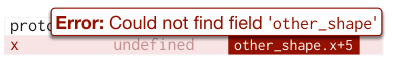

<!-- Source PDF SHA-256: 87a2858b850eb9be342920a1ab4a68ade782d40427925139b45a759c0f4f875b -->

<a id="page-1"></a>

# InterState: A Language and Environment for Expressing Interface Behavior

[Source PDF](https://from.so/assets/pdfs/oney-interstate-uist2014.pdf) · [Publisher page](https://doi.org/10.1145/2642918.2647358)

Stephen Oney (1, 2), Brad Myers (1). 1: Carnegie Mellon University. {soney, bam}@cs.cmu.edu

Joel Brandt (2).

2: Adobe Research.

joel.brandt@adobe.com

UIST '14, October 05 - 08 2014, Honolulu, HI, USA Copyright 2014 ACM 978-1-4503-3069-5/14/10…$15.00. http://dx.doi.org/10.1145/2642918.2647358

> Permission to make digital or hard copies of all or part of this work for personal or classroom use is granted without fee provided that copies are not made or distributed for profit or commercial advantage and that copies bear this notice and the full citation on the first page. Copyrights for components of this work owned by others than ACM must be honored. Abstracting with credit is permitted. To copy otherwise, or republish, to post on servers or to redistribute to lists, requires prior specific permission and/or a fee. Request permissions from Permissions@acm.org.

## ABSTRACT

InterState is a new programming language and environment that addresses the challenges of writing and reusing user interface code. InterState represents interactive behaviors clearly and concisely using a combination of novel forms of state machines and constraints. It also introduces new language features that allow programmers to easily modularize and reuse behaviors. InterState uses a new visual notation that allows programmers to better understand and navigate their code. InterState also includes a live editor that immediately updates the running application in response to changes in the editor and vice versa to help programmers understand the state of their program. Finally, InterState can interface with code and widgets written in other languages, for example to create a user interface in InterState that communicates with a database. We evaluated the understandability of InterState’s programming primitives in a comparative laboratory study. We found that participants were twice as fast at understanding and modifying GUI components when they were implemented with InterState than when they were implemented in a conventional textual event-callback style. We evaluated InterState’s scalability with a series of benchmarks and example applications and found that it can scale to implement complex behaviors involving thousands of objects and constraints.

### ACM Classification Keywords

D.2.6 Programming Environments

## INTRODUCTION

User interface development is notoriously difficult \[22\]. The event-callback model used by nearly all widely-deployed user interface frameworks tends to produce error-prone “spaghetti” code by splitting the implementation of a single behavior across many locations \[21,26\]. Researchers and practitioners have tried to address this problem by augmenting traditional programming languages with programming paradigms more suitable for expressing user interfaces. Two of the common difficulties these libraries address are managing states—an interface’s status, which often controls its appearance and behavior \[1,33\]—and expressing constraints—relationships among interface components and underlying data models \[21,26,30\]. However, it is still difficult to integrate constraints or state models into imperative languages, in part because most development tools are designed for presenting, navigating, and debugging sequential code \[22\]. Further, the mechanisms for code reuse and modularization in imperative languages often do not match the needs of user interface programmers \[18\].

![Figure 1: A basic InterState object, named draggable, which implements draggable and drag lock behaviors. Properties that control draggable’s display are represented as rows (e.g. x, y, and fill). States and transitions are represented as columns (e.g. no\_drag and drag). An entry in a property’s row for a particular state specifies a constraint that controls that property’s value in that state. Here, while draggable is in the drag state, x and y will be constrained to mouse.x and mouse.y respectively, meaning draggable will follow the mouse.](../figures/oney-interstate-uist2014/figure-001-p001.png)

Figure 1: A basic InterState object, named draggable, which implements draggable and drag lock behaviors. Properties that control draggable’s display are represented as rows (e.g. x, y, and fill). States and transitions are represented as columns (e.g. no\_drag and drag). An entry in a property’s row for a particular state specifies a constraint that controls that property’s value in that state. Here, while draggable is in the drag state, x and y will be constrained to mouse.x and mouse.y respectively, meaning draggable will follow the mouse.

### InterState Overview and Contributions

We created InterState with the insight that we can improve user interface development tools by redesigning the language and runtime features in concert. InterState contributes to the state of the art for user interface development tools by introducing a novel computational model, a visual notation, an inheritance mechanism, and a live editor for its visual notation. Further, InterState demonstrates how designing these features to work well together improves both the individual components and the usability of the system as an integrated whole.

<a id="page-2"></a>

Computational Model — The state of a user interface often controls its appearance and behavior, which in turn are defined by relationships among objects. In event-callback code, it is difficult to manage, maintain, debug, and understand these states and relationships \[26,30\]. InterState introduces a computational model that addresses these challenges by including state machines and constraints as fundamental language constructs. This model expresses interactive behaviors as constraints that are enforced only in particular states \[30\]. It also removes much of the boilerplate that is required to express constraints in other systems \[21,23,24,30\], allowing programmers to express constraints with simple equations—like those in spreadsheets—rather than with a complex syntax.

Visual Notation — In most languages, understanding what user events affect a particular property or, conversely, what properties are affected by a particular user event, can be difficult because event-callback code is usually spread throughout multiple locations \[26\]. InterState introduces a visual notation that concisely represents interactive behaviors as a table whose rows are properties and columns are states. Combined with its computational model, the visual notation allows programmers to see which events affect a property by scanning the property’s row and which properties an event affects by looking at that event’s column. Further, InterState’s visual notation helps overcome some well-known issues with constraints, such as that they can be hard to understand and control \[22\].

Behavior Reuse — Programmers often want to reuse, combine, and inherit behaviors, but nearly every widely-used programming language only allows properties and methods to be inherited. InterState introduces a style of inheritance that extends traditional prototype-instance inheritance mechanisms to allow behaviors to be inherited. This is possible in InterState because its computational model defines behaviors using state machines whose structure can be inherited. Because interactive behaviors are often combined, InterState supports multiple inheritance by combining property values across states. The table-based representation of property values offers an intuitive way to resolve the ambiguities inherent in multiple inheritance in other systems: potential conflicts use left-most precedence, which is readily visible due to the clear visual notation. InterState also introduces a mechanism for templates that allows items in a list of interactive components to be dynamically created and updated to reflect changes in an underlying data model.

Live Development — Quick experimentation and parameter tuning are crucial parts of the design process that are not well supported by today’s programming environments \[5,6\]. InterState introduces a live editor for its visual notation, where edits are immediately reflected in the running application (runtime) and changes in runtime state and property values are highlighted in the editor. This helps bridge the “gulf of evaluation” in determining the effects of a change \[28\], which has been shown to be a significant barrier for experienced and new programmers \[16\] alike.

Complimentary Features — In addition to innovations in the aforementioned areas, a significant contribution of Inter- State is in designing these features and concepts to complement each other in a cohesive programming environment. We start this paper with a motivating example and sample applications before detailing the design of Inter- State’s programming primitives and editor. We conclude with an evaluation of InterState’s usability and scalability for complex behaviors.

```
var isDragLocked = false,
    mm_listener  = function(mm_event) {
        draggable.attr({ x: mm_ev.x, y: mm_ev.y });
    },
    mu_listener  = function(mu_event) {
        removeEventListener("mousemove", mm_listener);
        removeEventListener("mouseup",   mu_listener);
    };
draggable.mousedown(function(md_ev) {
    draggable.attr({ x: md_ev.x, y: md_ev.y });
    addEventListener("mousemove", mm_listener);
    addEventListener("mouseup",   mu_listener);
}).dblclick(function(md_event) {
    if(isDragLocked) {
        removeEventListener("mousemove", mm_listener);
    } else {
        addEventListener   ("mousemove", mm_listener);
    }
    isDragLocked = !isDragLocked;
});
```

Figure 2: A representative JavaScript snippet that implements draggable and drag lock for an object named draggable.

## MOTIVATING EXAMPLE

Drag-lock is an example of a common interactive behavior. Drag-lock is a standard accessibility feature that augments “drag and drop” to allow users to double click an object and drag it until they double click again. Suppose we want to implement drag-lock on an object named draggable which we will later reuse throughout a user interface. We asked an expert programmer to implement this behavior in JavaScript and refactored their code for clarity by adding more descriptive variable names and removing unnecessary lines. The resulting code is shown in Figure 2. At 20 lines, it is compact but difficult to follow and even more difficult to write correctly. When a user double clicks on draggable to initiate a drag lock, five different snippets of code are executed in an order that is difficult to predict (mousedown, mu\_listener, mousedown, mu\_listener, then dblclick). Some of these listeners also activate and deactivate other listeners, making it even more difficult to understand the snippet’s state at a given time.

Compare this with InterState’s implementation of the same behavior, shown in Figure 1. With InterState, the execution flow is clearly illustrated, as are the different possible values for x and y. Further, InterState makes it easy to follow which state the draggable object is in by highlighting the active state and relevant values, and by animating transitions as they fire. In the evaluation described later in this paper, we found that these features were effective in helping programmers implement this behavior over twice as fast with InterState than with JavaScript.

<a id="page-3"></a>

Further, suppose we want to extend this example to add some common usability features that users expect: keyboard accessibility and a visual indication of the current state. Specifically, in our example, pressing ESC should terminate dragging, and the color of draggable should change when it is “locked”. In JavaScript, adding keyboard accessibility requires at least eight more lines of code, including modifications to the previous code. In InterState, it simply requires the addition of two new transitions (from the drag and drag\_lock states) and no modifications of the existing states or transitions. In JavaScript, adding a visual state indication to draggable (e.g. so it is black by default, blue while dragging, and navy when drag-locked) requires five more carefully placed lines that, again, would modify the original code. In InterState, this simply requires specifying the color in three existing states (see Figure 1). Finally, modifying the behavior to use a single click to escape drag-lock rather than a double click, which is seemingly trivial, requires nearly a complete rewrite of the Java- Script code (to work with the original mouseup and dblclick listeners) but only requires modifying one transition in InterState. Figure 1 shows the InterState code after all of these modifications have been made, but the Java- Script code would be about twice as long as Figure 2.

Now, suppose we want to reuse our drag-lock behavior in other contexts (e.g. a drag-lock slider). In JavaScript, we would need to carefully abstract and package this behavior to be reusable in a way that does not interfere with other behaviors. In InterState, this is supported by default since other objects can simply inherit from draggable. Frameworks that include a notion of state \[1,3,30,36\] would allow drag-lock to be declared in a more natural way than plain JavaScript. However, they lack InterState’s visual notation, which makes understanding and debugging this behavior relatively easy. Further, none of these other frameworks address the challenge of behavior reuse.

### Applications

To illustrate InterState’s expressiveness, we implemented a number of example applications. We will briefly describe three of these example applications and link to their working implementations. We will refer back to these examples in subsequent sections.

#### Music Player &amp; Playlist Editor

http://istate.co/music This music player includes a playlist manager that allows users to create and edit playlists. It takes advantage of InterState’s ability to call JavaScript functions to play music with the HTML5 audio API.

#### Breakout

http://istate.co/breakout

Our version of the classic game “breakout” includes bonuses and power-ups. It also interfaces with Box2D, a third-party physics engine, for collision detection and reactions.

#### Touchscreen Maps

http://istate.co/touch\_map

This application allows users to pan and zoom a map image using touch and accelerometer events on touchscreen devices. It illustrates InterState’s ability to express behaviors using multiple input modalities.

## INTERSTATE’S COMPUTATIONAL MODEL

InterState starts with a computational model that builds on the idea of defining interactive behaviors using constraints that apply in specific states, as used in ConstraintJS \[30\]. This combination of state machines and constraints allows programmers to express interactive behaviors by tracking UI state and declaring nuanced relationships between elements that depend on its state. Moving this computational model from an imperative context (ConstraintJS in JavaScript) to a declarative model (InterState) required two fundamental additions to increase its expressiveness.

First, property values can be set either on states (as usual) but also on transitions, in which case they are evaluated once when the transition executed, so the value stays fixed even if dependencies change. In contrast, constraints on states are continuously updated whenever dependencies change while in that state. Setting on transitions allows programs to store the value of an expression at specific points in time, for example, to calculate offsets for dragging an object based on the initial mouse point and peg it to its last location when it finishes dragging. Second, InterState carefully controls the order in which property values are evaluated on transitions by determining the appropriate property evaluation order when two separate transitions fire simultaneously based on internal dependencies.

### Constraint Expressions

Constraints are a built-in primitive in InterState, which allows many other InterState features to benefit from their expressiveness; state machine transitions can use constraints to express mutable targets and events, objects can dynamically vary their prototypes using constraints, and constraints can express a dynamic list of items to be displayed with a given template. InterState allows programmers to express constraints with simple equations—like those in spreadsheets—rather than with a complex syntax, as required in previous work \[21,23,24,30\]. These equations are still capable of concisely expressing many complex constraints. For instance, constraints may contain indirection (the target object can itself be calculated by a constraint) \[23,24,37\] such as:

```
this.currentlyPlayingSong.title
```

It is also often useful to express operations on groups of objects \[31\]. InterState includes a function called find for making such queries with a chaining syntax inspired by other query languages, including EET \[8\] and HANDS \[31\]. For example, in Breakout, players reach the next level by destroying all of the blocks in the current level. This can be expressed in a transition as:

```
find(blocks).in_state('alive').is_empty()
```

<a id="page-4"></a>

Every InterState object exists in a containment hierarchy. References and scoping across a large containment hierarchy can be challenging, sometimes requiring specialized query languages—e.g. XQuery or Sizzle (sizzlejs.com). In other frameworks, referencing objects elsewhere in the containment hierarchy requires long chains of “parent” expressions that are brittle with respect to changes to the program’s structure \[23\]. InterState makes referencing fields in constraints easier by naming every field, unlike the DOM and other XML-based containment hierarchies. This allows references to jump up the containment hierarchy by using unique field names in a manner analogous to scoping rules in textual languages. Although this requires an effort on the part of the programmer to name every field and provide unique names for important fields, it makes the resulting code more readable and robust to structural changes.

### State Machines

Including state machines as a built-in primitive allows InterState to handle the stateful nature of user interface behaviors \[33\]. While some previous systems have included state as a separate primitive \[1,3,17,29\], including state as a fundamental part of objects is crucial to InterState’s support of behavior inheritance and reuse. This is because an object’s state machines and fields define its behavior; so allowing both to be inherited makes it possible for other objects to reuse its behaviors.

InterState objects contain one or more state machines and any number of named properties, which map every state and transition of its state machine to a value. This value can be empty (represented as a grey circle in the editor) in which case the property’s last value remains in use. Otherwise, the value can be a constant or a constraint. Thus, a property’s value in a state might depend upon which transition was fired to arrive at that state.

#### Starting State

As we will discuss in the “scalability” section below, scalability is a multifaceted issue in programming tools. Most of this paper focuses on ways that InterState can scale up to express complex behaviors. However, it is also important to consider how programming frameworks scale down to concisely express simple behaviors. The difficulty of expressing a behavior should rise linearly with the complexity of the behavior \[22\].

In InterState, creating static interfaces (no interactivity) is straightforward. InterState objects start with one state to match the simplicity of property sheets \[34\], which allow programmers to easily see and modify an object’s settable properties. However, whereas property sheets can only specify the look of an application, InterState’s state machines scale to allow programmers to specify its behavior.

This is in contrast to previous systems that have integrated state machines as a layer \[27,36\] where interface behavior code goes inside of states. Consequently, these systems scale down to static interfaces only as well as their underlying imperative languages. Further, by relying on side-effects to define behavior, these systems can still be subject to the “spaghetti” code problem that makes it difficult to determine how an interactive behavior works \[26\].

#### Combining State Machines

Behaviors often combine multiple state machines; an object might, for instance, be draggable and selectable. In order to avoid the state explosion problem \[29\] where programmers would have to create combinatorial numbers of states (e.g. draggingAndSelected, idleAndSelected, etc.), Inter- State borrows two ideas from StateCharts \[12\]: concurrent and nested states. As discussed below, objects can contain multiple state machines that operate independently. When multiple states are active, InterState uses left-to-right precedence to choose which active value the properties should use in the event of conflicts, a convention that is easy to understand in InterState’s visual notation.

#### Transition Events

InterState’s event model is input agnostic. Any event exposed by the runtime environment (usually the browser) can be used. For instance, when the runtime is running on a mobile touchscreen device, InterState transitions can be triggered by touch and accelerometer events.

To allow programmers to concisely and declaratively express complex events, event targets can be computed by dynamic constraints, e.g. on('click', currently- PlayingSong). Such dynamic targets have been tried in previous systems \[8\] but were hampered by performance and implementation challenges. In InterState’s runtime implementation, we optimized performance for dynamic event targets by using JavaScript’s native event listener mechanism, rather than distributing events in the runtime. This required modifying our constraint solver, which is normally lazy (pull-based), so that constraints used to calculate the active event listeners are updated whenever an event’s target is changed (push-based).

#### Constraint Events

Another innovative way that InterState allows events to be dynamically calculated is to support events that refer to changes in constraint values. For instance, in our Breakout example, the player should lose a life when the ball goes past the paddle. In imperative languages, this usually requires passing property changes through a setter method, which then triggers the corresponding state change. Inter- State simplifies this by introducing constraint events— Boolean expressions like (ball.cy &gt; paddle.y)—that fire any time the value of the expression switches from false to true. While constraint events have technically been possible in other constraint systems \[21\], InterState reduces the syntactic burden of expressing them by allowing constraint events to be expressed using the same syntax as constraints. Further, the efficient eager evaluation mechanism discussed in the previous section makes these constraint events practical.

### Manipulating Visual Objects

InterState is output-agnostic and can be made to work with any output supporting a structured graphics model (sometimes called a “retained object model”). We have fully implemented output mechanisms for HTML DOM objects and Scalable Vector Graphics (SVG) objects. We have also created a prototype to confirm the feasibility of using WebGL as an output mechanism for creating 3D interfaces.

<a id="page-5"></a>

New outputs can be added by writing a JavaScript wrapper that maps changes in InterState objects’ fields and containment hierarchy to operations in the output mechanism. Depending on the specific output mechanism, additional code might also be needed to detect input events. In total, our wrapper for the SVG output mechanism only requires about 300 lines of JavaScript.

To make an SVG graphical object appear on the screen in InterState, programmers can make that object inherit from one of seven types of SVG objects: circle, ellipse, image, rectangle, text, group, and path. (Programming with HTML DOM or other output models works similarly.) All of these prototypes provide default values for their display properties (for example, rectangle has a width attribute with a default value of 150 and image has a src attribute with a default URI that points to the Inter- State logo). InterState also includes attributes that allow programmers to specify how display properties should animate between values, using CSS transitions. Finally, to enable a dynamic DOM hierarchy despite the static containment hierarchy of InterState objects, InterState DOM objects include a property that allows programmers to express a node’s DOM children as a dynamic constraint.

## BEHAVIOR REUSE IN INTERSTATE

User interfaces often re-use and combine behaviors. Inter- State supports this by introducing an inheritance mechanism that allows behaviors to be re-used as easily as fields and methods are in traditional inheritance.

### Inheritance

Other toolkits have achieved behavior inheritance by requiring that programmers create separate interactor objects that describe specific built-in behaviors and can be attached to graphical objects \[15,23,24\]. Rather than requiring such specialized mechanisms, InterState’s inheritance model extends traditional prototype-instance inheritance \[23\] by adding several features to support behavior inheritance.

First, when one InterState object inherits from another, it also inherits an instance of that object’s state machine. For example, in Figure 4, my\_selectable\_draggable gets an instance of the state machines for both selectable and draggable. The fact that an instance of the state machine is inherited, rather than the state machine itself, is important; we usually do not want all of the objects that inherit from a particular object to be in the same state. For example, we do not want every object that inherits from draggable to enter the dragging state when one of them does. When the structure (not current state) of a prototype’s state machine is changed, that change is instantly reflected in the structure of all objects that inherit from it. This allows programmers to quickly modify the behavior of objects in their interface to explore behavior variations. For example, in an interface with a number of draggable elements, drag-lock could be implemented for every element by modifying the definition of one “draggable” prototype.

Second, rather than inheriting a property’s value, InterState inherits the property’s constraint. Further, the values of the of references in the constraint expression are computed based on the context of the instance, not the prototype. By inheriting the constraint’s definition and redetermining referents, InterState allows prototypes to define behaviors that reference the state and property values of the objects that inherit from them. This is illustrated in Figure 3, where my\_square inherits the definition of height, rather than its value, and the value computed for my\_square.height depends on my\_square.width, not square.width. Amulet and Garnet included a similar mechanism \[23,24\], but using a more verbose syntax.


Figure 3: InterState uses a prototype-instance inheritance model with multiple inheritance. Prototypes are simply specified in the prototypes property. Here, my\_square inherits from square. Because my\_square does not define a value for height, it inherits the definition of square.height, as indicated by the greyed out text in the columns on the right. Note that my\_square inherits the definition of height, not the value. Thus, its width property evaluates to a different value (20) than it does in square (15).

Third, unlike most prototype-instance inheritance models, InterState allows multiple inheritance. A handful of other prototype-instance frameworks have included multiple inheritance, but only for fields \[24,35\]. In InterState, multiple inheritance is crucial because interface components often combine multiple inherited behaviors. InterState objects may inherit from any number of other objects. InterState then combines inherited values across states. If an object’s property is not defined for a state but it is in one of the object’s prototypes, that prototype’s definition is used for the state. This allows multiple behaviors to control the same property simultaneously. For example, in Figure 4, selectable and draggable define color. my\_selectable\_draggable combines the definitions of both of these prototypes. In the selected state, it will be 'blue'; otherwise, it will be 'black' or 'red', depending on the dragging state. For conflicting values, the left-most value is used; a convention that is easy to control and understand in concert with the visual notation.

Previous multiple inheritance frameworks have been hampered by the “diamond problem”, which occurs when objects B and C both inherit from A and object D inherits from both B and C, leading previous systems to inherit A twice \[19\]. InterState addresses the diamond problem by detecting duplicate prototypes and only inheriting them once. If there are conflicts among prototypes (i.e. two prototypes set the same field for the same state), InterState gives precedence to the first (leftmost) prototype.

<a id="page-6"></a>


Figure 4: An object that inherits from both draggable and selectable behaviors. Note that the definitions for the color property are inherited from draggable ('red') and selectable ('blue').

Finally, prototypes, like every other property, can have different values in different states, and can even be computed by constraints, allowing the prototypes of any given object to depend on its current state. This dynamic inheritance provides a declarative way for interface elements to modify their behavior based on the interface state \[35\]. For instance, programmers can declaratively change an SVG object from a rectangle to a circle by changing its prototype, rather than imperatively removing and creating objects.

### Copies and Templates

User interfaces often contain lists of items that behave similarly. Programmers should not have to declare a display for every item in such a list, because it is too tedious and because that list of items may be computed at runtime. In imperative languages, this functionality has been implemented as list views in data-binding libraries, or as special groups \[23\] that allow programmers to specify a template display and to specify the number of instances they want. Most template mechanisms, however, require separate template objects and a special template syntax \[30\]. InterState’s template mechanism improves on this by enabling the features of templates without requiring a special syntax or special form for template objects.

InterState adds an optional copies field to all objects. Like other fields, copies can be dynamic and can reference other fields or JavaScript objects. When copies is set to an array or a number, its parent object then creates an array of objects. The editor visually signals this by displaying a stack under the object’s display (see Figure 5). For every copy, InterState sets two properties: my\_copy, which carries the corresponding value from the copies array (e.g. 'Jane', 'Sue') and copy\_num, which carries an item’s index (e.g. 0, 1). When the value of copies changes (dynamically due to a constraint or by edits at design time), the list is efficiently updated with respect to added, moved, and removed items instead of recreating the entire list.

In our music player application, for instance, the list of playlists is stored in the playlists property. A playlist display will be automatically created for every item in playlists by setting copies of playlistsView. We then create a list of songs per-playlist by setting copies of currentPlaylistView to currentPlaylist.songs.

When the user modifies either the list of songs in a playlist or the list of playlists themselves, new elements are added and removed automatically.

This feature integrates well with InterState’s dynamic inheritance model, since copies can vary their displays. For instance, a directory viewer application might set copies of itemView to the current directory’s contents. Copies could inherit from folderView if my\_copy is a folder or from fileView if it is a file. This example could create a recursive tree structure by making itemView a child of folderView with a copy for every item in its folder.

## INTERSTATE VISUAL NOTATION AND EDITOR

In event-callback code, property values can be modified in any callback \[21,26\]. InterState’s computational model, by contrast, allows property values to change in two ways: either a constraint in that property is recomputed (e.g. mouse.x changes when the mouse moves) or the property’s specified value changes (e.g. a state change or the programmer edits the property’s value). This design trades some flexibility—losing the ability to set properties anywhere—for readability by ensuring all of a property’s possible values are visible in its row.

To achieve a tabular layout with every state and transition represented in a column, InterState’s visual notation “flattens” its state machines to allocate horizontal space for all local and inherited states. The trapezoidal shape of states is designed to allocate a column for every transition, horizontally centered where the transition’s arrow begins.

### InterState Live Editor

Previous research has shown how live programming can improve the experience of both novice and professional programmers \[11,20\]. The declarative nature of InterState’s computational model reduces many of the technical challenges of creating live editors in imperative languages \[6\].

<a id="page-7"></a>

InterState’s editor is displayed in a separate window that communicates with the runtime. The editor displays current field values and highlights and animates state changes to inform programmers of the current state of their program. When developing non-desktop applications (e.g. for a touchscreen phone or tablet), the editor can alternatively be displayed on a separate computer connected via a network. This allows the programmer to interact with their running program while editing its behavior.

![Figure 5. InterState person\_display object has copies \['Jane', 'Sue'\]. The selected first copy has my\_copy 'Jane' and copy\_num 0; the second has my\_copy 'Sue' and copy\_num 1. The copies control shows copy 1 of 2.](../figures/oney-interstate-uist2014/figure-004-p006.png)

Figure 5: An object with multiple copies; copies is set to \['Jane', 'Sue'\]. Every copy has two properties: my\_copy, which is set to that copy's item (here, either 'Jane' or 'Sue') and copy\_num, which is set to that copy's index. Here, we are looking at the first copy.

#### Space Efficiency and Navigation

Navigability is an important consideration in live editors \[6\]. Programmers should be able to navigate between objects in the editor and their representations in the runtime. InterState’s editor was built to enable quick exploration and navigation. The runtime allows users to inspect objects in the runtime display pane to open those objects in the editor window. Conversely, objects in the runtime display pane are highlighted whenever the mouse is hovered over the corresponding representation in the editor. When properties reference other objects in the containment hierarchy, programmers can click the name of the object to navigate to it.

By default, the InterState editor displays a single object at a time. To show every field immediately referenceable by the current object, the editor displays the names of every parent in the containment hierarchy, along with field names and a compact summary of their current value. The editor also allows programmers to “pin” objects so their display stays on the screen so they can be referenced while editing another object. InterState’s editor includes an inline text editor useful for quickly editing of short constraint values and a full multi-line text editor useful for editing longer values, like method definitions.

#### Error Reporting &amp; Debugging

One of the barriers to the adoption of constraint systems has been the difficulty of understanding and fixing bugs in constraint specifications \[22\]. When there is a bug in a constraint method, many constraint systems will halt program execution and present a cryptic error message \[23,24\].

InterState’s runtime was designed to enable programmers to always have a running application, like in spreadsheet programming, where constraint errors do not halt updates of other constraints \[7,22\]. InterState achieves this by “localizing” errors: constraints with errors only prevent the parts of the program from running that depend on those constraints. In the editor, errors are displayed next to the problematic constraint expression (see Figure 6).

Constraints are also challenging to debug in imperative languages because of their declarative nature \[22\]. Breakpoints in imperative languages are of limited use because they can freeze the program while the constraint solver is in an inconsistent state (i.e. in the middle of code maintaining a dependency). InterState’s editor makes constraint debugging easier by allowing programmers to always see the current values calculated by constraints, and to set breakpoints that halt its constraint solver in a consistent state just before a constraint is reevaluated. Breakpoints can also be set on transitions or states so programmers can see what relationships are being maintained at any point in their program.



Figure 6: Syntax and runtime errors are highlighted in the editor but do not prevent the program from running.

## EVALUATIONS OF INTERSTATE

To understand the efficacy and limitations of InterState, we evaluated it in three ways. First, implementing the example applications described earlier allowed us to evaluate the expressiveness of InterState’s model. Second, a comparative laboratory study helped us understand InterState’s learnability. Finally, performance benchmarks measured our runtime’s scalability.

### Comparative Laboratory Study

Given the design goals of InterState, we hypothesized that programmers could more easily understand and modify user interface code with InterState than in event-callback code.

#### Method

To evaluate this hypothesis, we conducted a comparative laboratory study with 20 experienced programmers (ages 19-41). There were two different study tasks and two systems with which to implement them (regular JavaScript or InterState), all counterbalanced to control for learning effects and differences in task difficulty. Participants were given the same task description regardless of implementation language. For each behavior, we asked participants to make modifications to evaluate their ability to understand the implemented behavior and express a new behavior.

For one behavior, participants were given code for a standard drag and drop behavior and were asked to implement the drag-lock behavior described earlier. For the other behavior, participants were given code for an image carousel that displayed a large “featured” image and a series of thumbnails. The featured image changes when a thumbnail is clicked or auto-advanced after a timeout. We asked participants to change display features of the thumbnails, the auto-advance interval, and to add a progress bar below the featured thumbnail to indicate the auto-advance interval.

To make our comparison as fair as possible, we started with third-party code for the JavaScript implementations and simplified them by reducing boilerplate and adding descriptive variable names that were consistent with those used in the InterState implementations. We also used a “live” JavaScript editor (JSBin) that immediately re-evaluates JavaScript snippets when their source changes. Finally, participants were given tutorials and reference sheets for JavaScript and InterState.

#### Results

<a id="page-8"></a>

Participants were able to implement the drag lock task significantly faster with InterState—taking less than half the time (JavaScript: 19.5±13.6 min, InterState: 8.0±6.8 min, two-tailed heteroscedastic Student’s t-test p &lt; 0.05). Although relatively few lines of code were required, reasoning about callbacks’ timing in the JavaScript task proved challenging for many users, and many participants used console logs to help them understand their interface’s state.

Participants also completed the image carousel task significantly faster with InterState, again in about half the time (JavaScript: 28.3±7.6 min, InterState: 14.7±5.5 min, p &lt; 0.01). For this task, participants added a timer indicator. Participants in both implementations used one of two strategies for this: either creating an indicator for each thumbnail or creating one indicator that follows the featured thumbnail. Both implementations already had a property that tracked the number of milliseconds before the featured image auto-advanced, which the programmers could utilize. Most JavaScript participants missed this variable while most InterState participants found it, apparently by observing how its value changed over time.

#### Discussion

Most participants felt comfortable with InterState’s visual notation, calling it “intuitive” and “clean”. Nearly every user cited InterState’s ability to display the current application state and live property values as one of the most useful aspects of the editor. This helped many users quickly debug and deduce the meaning and roles of properties.

Our evaluation also pointed to several ways to improve InterState, some of which are already reflected in the design described above. For example, we added the ability to jump from an on-screen object in the runtime to its representation in the editor as a result of observing the difficulty several participants had finding objects. Additionally, the ability to “pin” objects in the editor was suggested by a participant. Both of these features were added after this study.

The most common mistakes made in InterState were the result of a few conceptual barriers that we plan on improving. For example, some participants were not sure whether edits to an object with multiple copies changed every copy or just one, a distinction that the editor could make clearer. Some participants also had difficulty reasoning about the interaction between state machines in different copies. In the image carousel example, when the user clicks a thumbnail, that thumbnail should become selected and the previously selected thumbnail should become deselected. This is a breakdown of the visibility principle—by only showing one copy at a time, InterState’s representation of state machines does not make it clear how user events can affect multiple state machines.

### Scalability

We designed InterState to be “scalable” in three senses of the word. Application scalability refers to InterState’s ability to scale to implement even complex GUIS. Performance scalability refers to InterState’s ability to deal with large numbers of components. Editor scalability concerns the ability of the InterState editor to keep source code readable, understandable, and navigable even as applications become more complex.

#### Application Complexity

To scale in terms of application complexity, InterState includes a number of features. First, behavior inheritance and templating enable code re-use, which makes writing complex applications more practical.

Second, InterState includes a number of pre-built widgets, such as sliders and radio buttons that programmers can easily include in their application. Unlike many widget libraries, however, these widgets are not black-boxes, but can be inspected and modified if users want variations.

Finally, many applications require complexity in back-end code. For instance, a mailbox application might need to communicate with a server over IMAP to retrieve e-mail messages. Thus, InterState includes mechanisms for communicating with back-end code written in other languages, allowing programmers to connect a front-end written in InterState with a back-end written in another language.

#### Performance

We conducted a series of performance tests to evaluate InterState’s ability to scale for behaviors involving large numbers of objects. These tests were performed in Safari 7.0 on a 2.3 GHz Intel i7 Macintosh with 16 GB of RAM. We ran three tests and measured the delay between changing an attribute value in InterState’s runtime model and when that change was reflected in the runtime output.

In the first test, we created an object named obj whose prototype chain is N objects long, as in:

```
obj.prototypes = proto_1
proto_1.prototypes = proto_2
…
proto_(N-1).prototypes = proto_N
```

We then measured the latency between changing protoN and the runtime updating its DOM output for obj. In the second test, we measured the same latency for an object with N prototypes, as in: obj.prototypes = \[proto , 1 …, proto \]. In the third test, we created an object with N N copies and measured the time it took for a change to affect the runtime’s DOM output for every copy.

<a id="page-9"></a>

For each test, we measured the highest value of N for which a change was perceived to be instantaneous (100 milliseconds). We found that performance scaled linearly in all tests. The first test indicated that a prototype chain of 58 objects could be handled instantaneously. By contrast, the longest prototype chain in the implementation of the Eclipse IDE is only nine classes long. The second test indicated that an object could have about 2,400 prototypes before changes have any visible delay. This is far more than necessary in real-world interfaces. The third test indicated that 1,200 simultaneous changes to DOM attributes would appear instantaneous. By contrast, InterState’s constraint solver, ConstraintJS \[30\], could handle about 2,000 simultaneous changes in the same testing environment, which indicates that the InterState runtime only adds a 40% overhead. Much of this overhead comes from parsing and interpreting constraints, which is done in the runtime (rather than natively) to enable InterState’s dynamic scoping. As our results indicate, InterState can scale up to real-world interfaces with respect to performance. It is also important to note that a developer can implement any performance-critical operations natively and reference them in InterState.

#### Editor Scalability

InterState’s editor includes a number of features to allow programmers to navigate and understand complex behaviors. We described some of these techniques—such as pinning, and links to navigate between InterState objects—in the “InterState Visual Notation and Editor” section above.

Additionally, InterState’s visual notation for state machines is able to convey behaviors using less space than textual code. For instance, the image carousel from the user study required about 60 lines of JavaScript. In InterState, the same behavior required two objects (with three states and six transitions total) and 33 constraints across 22 properties. With the same font size, the InterState implementation required 30% less display space despite conveying more information (e.g. inherited properties and current property values). This is primarily because InterState’s visual notation reduces the verbosity needed to express states and establish constraints.

## RELATED WORK

InterState is influenced by work in multiple domains, some of which we have described in previous sections.

### Spreadsheet and Visual Programming

Many researchers consider spreadsheets to be the most popular form of “programming” \[22\]. InterState leverages several spreadsheet conventions, such as localizing errors only to problematic cells. Several other systems have used spreadsheet-like ideas to make it easier to create graphical-interfaces. For example, Forms/3 \[7\] demonstrated that procedural and data abstractions and graphical output were viable with spreadsheets. InterState builds on these spreadsheet-like concepts by combining them with state machines. These state machine are represented graphically, an idea explored by a number of visual programming systems—see \[14,25,38\] for surveys.

### Constraint Libraries for Imperative Languages

A number of constraint libraries for imperative languages have tried to simplify the development of interactive behaviors \[4,9,21,23,24,30\]. These systems have explored ways to make constraints more expressive, including with multi-way constraints and constraint hierarchies. Of these, the most relevant to InterState is ConstraintJS (CJS), a Java- Script library on which InterState is built \[30\]. While Inter- State and CJS both define interactive behaviors by combining states and constraints, CJS was built specifically to fit into the context of imperative JavaScript code, whereas InterState introduces a novel visual notation to allow programmers to express interactive applications with little or no imperative code. Achieving this goal went beyond simply adding a visual notation on top of CJS; it also required designing many new language features, as discussed above.

### Finite State Machine Libraries

A number of libraries have also added support for finite-state machines in textual languages to address the challenge of tracking GUI state \[29\]. TKZink, IntuiKit \[17\], and HsmTk \[3\] use state machines to allow interface designers to specify different application appearances in different states. Similarly, SwingStates \[1\] integrates finite state machines with the Java Swing toolkit. By adding constraints to its notion of state, InterState’s programming model makes it easier to specify how an interface reacts to state changes.

### Event Languages and Models

Many commercial and research systems have used and augmented the event-action framework. Early event models, like Sassafras \[13\] and the University of Alberta User Interface Management System \[10\] inspired the features of future commercial systems \[22\]. One interesting extension of the standard event model is the elements, events, &amp; transitions (EET) model, which allows programmers to more concisely express how user interfaces should respond to user events \[8\]. We built on some of the ideas introduced in these systems, such as dynamic event targets in transitions, to increase the expressiveness of InterState's state machines.

### UIDLs and Frameworks for Interactive Systems

User Interface Description Languages (UIDLs) have been created to explore alternate ways to represent GUI behavior and appearance. ICOs \[27\] combines petri nets with fragments of imperative code and also provides a visual editor. Despite addressing a related problem, InterState’s design is conceptually different. For instance, by placing state machines inside of objects (as opposed to treating petri-nets as top-level), InterState’s allows behaviors to be inherited in the same fashion as properties. Other frameworks have explored alternative ways to declare GUI behaviors. Loa \[2\], for instance, combines data bindings, templates, and interactors. However, Loa’s feature set, like ConstraintJS, was built to fit in with existing imperative languages.

## CONCLUSION &amp; FUTURE WORK

Currently, we have only tested InterState with experienced programmers, but we believe the ideas behind InterState will also allow end-user programmers who are familiar with spreadsheets to create custom behaviors. Although the current syntax for InterState constraints seems somewhat natural for mathematical expressions (e.g. width\*2), it could be improved for more complex expressions, which currently use JavaScript syntax (e.g. other\_obj\[this.prop\_ name\]). We plan on investigating ways of making the constraint syntax more beginner-friendly, guided by commonalities in how users naturally describe behaviors \[32\].

InterState’s primary goal is to simplify the specification of GUI behaviors, so it is best for interactive user interfaces

<a id="page-10"></a>

(the feel). Tools like Adobe Photoshop or Illustrator are still better for specifying the look of non-interactive interfaces or components. We plan on investigating ways to allow designers to design the look of components in Photoshop and the behavior of those components in InterState.

InterState shows how innovations in the execution model, combined with a visual notation and live editor, can work together to enable programmers to express interactive behaviors concisely and naturally. InterState also addresses many of the previously identified issues of programming with state machines and constraints and shows the value of putting these ideas together into a single cohesive programming framework. The InterState editor and an Inter- State tutorial are available online at http://istate.co.

## ACKNOWLEDGEMENTS

Funding for this research comes from Adobe and from NSF grant IIS-1116724. Any opinions, findings, and conclusions or recommendations are those of the authors and do not necessarily reflect those of any of the sponsors.

## REFERENCES

- 1. Appert, C. and Beaudouin-Lafon, M. SwingStates: Adding state machines to Java and the Swing toolkit. Software: Practice and Experience 38, 11 (2008), 1149–1182.

- 2. Beaudoux, O., Clavreul, M., Blouin, A., et al. Specifying and Running Rich Graphical Components with Loa. EICS, (2012), 169–178.

- 3. Blanch, R., Beaudouin-lafon, M., and Futurs, I. Programming Rich Interactions using the Hierarchical State Machine Toolkit. AVI, (2006), 51–58.

- 4. Bostock, M., Ogievetsky, V., and Heer, J. D<sup>3</sup>: Data-Driven Documents. Visualization and Computer Graphics 17, 12 (2011), 2301–2309.

- 5. Brandt, J., Guo, P.J., Lewenstein, J., and Klemmer, S.R. Opportunistic Programming: Writing Code to Prototype, Ideate, and Discover. IEEE Software 26, 5 (2009), 18–24.

- 6. Burckhardt, S., Fahndrich, M., de Halleux, P., et al. It’s Alive! Continuous Feedback in UI Programming. SIGPLAN 48, 6 (2013), 95–104.

- 7. Burnett, M., Atwood, J., Djang, R.W., Gottfried, H., Reichwein, J., and Yang, S. Forms/3: A First-Order Visual Language to Explore the Boundaries of the Spreadsheet Paradigm. Functional Programming 11, 2 (2001), 155–206.

- 8. Frank, M.R. Model-Based User Interface Design By Demonstration and By Interview. GT PhD Thesis, (1995).

- 9. Freeman-Benson, B. Kaleidoscope: Mixing Objects, Constraints, and Imperative Programming. OOPSLA, (1990), 77–88.

- 10. Green, M. A Survey of Three Dialogue Models. ACM Transactions on Graphics 5, 3 (1987), 244–275.

- 11. Hancock, C.M. Real-Time Programming and the Big Ideas of Computational Literacy. MIT PhD Thesis, (2003).

- 12. Harel, D. Statecharts: A Visual Formalism for Complex Systems. Science of Computer Programming 8, 3 (1987), 231– 274.

- 13. Hill, R.D. Supporting Concurrency, Communication, and Synchronization in Human-Computer Sassafras UIMS. Graphics 5, 3 (1987), 179–210.

- 14. Hils, D.D. Visual languages and computing survey: Data flow visual programming languages. Journal of Visual Languages &amp;

Computing 3, 1 (1992), 69–101.

- 15. Hudson, S.E. and Mankoff, J. Extensible Input Handling in the subArctic Toolkit. CHI, (2005), 381–390.

- 16. Ko, A.J., Myers, B.A., and Aung, H.H. Six Learning Barriers in End-User Programming. VL/HCC, (2004), 199–206.

- 17. Lecoanet, P., Lemort, A., Mertz, C., et al. Revisiting Visual Interface Programming: Creating GUI Tools for Designers and Programmers. UIST, (2004), 267–276.

- 18. Letondal, C., Chatty, S., Phillips, W.G., and André, F. Usability requirements for interaction-oriented development tools. PPIG, (2010), 12–26.

- 19. Malayeri, D. and Aldrich, J. CZ : Multiple Inheritance Without Diamonds. OOPSLA, (2009).

- 20. Maloney, J.H., Loop, I., and Smith, R.B. Directness and Liveness in the Morphic User Interface Construction Environment. (1995), 21–28.

- 21. Meyerovich, L., Guha, A., and Baskin, J. Flapjax: A Programming Language for Ajax Applications. OOPSLA, (2009), 1–20.

- 22. Myers, B., Hudson, S., and Pausch, R. Past, Present, and Future of User Interface Software Tools. TOCHI 7, 1 (2000), 3–28.

- 23. Myers, B.A., Mcdaniel, R., Miller, R., et al. The Amulet Environment: New Models for Effective User Interface Software Development. TOSE 23, 6 (1997), 347–365.

- 24. Myers, B.A. Garnet: Comprehensive Support for Graphical, Highly Interactive User Interfaces. Computer 23, 11 (1990), 71 – 85.

- 25. Myers, B.A. Taxonomies of Visual Programming and P rogram Visualization. Visual Languages and Computing 1, 1 (1990), 97–123.

- 26. Myers, B.A. Separating Application Code from Toolkits: Eliminating the Spaghetti of Callbacks. UIST, (1991), 211–220.

- 27. Navarre, D., Palanque, P., Ladry, J.-F., and Barboni, E. ICOs: A Model-Based User Interface Description Technique dedicated to Interactive Systems Addressing Usability, Reliability and Scalability. TOCHI 16, 4 (2009), 1–56.

- 28. Norman, D. The Design of Everyday Things. Doubleday, New York, New York, USA, 1988.

- 29. Olsen, D.R. User Interface Management Systems: Models and Algorithms. Morgan Kaufmann, San Mateo, CA, 1992.

- 30. Oney, S., Myers, B., and Brandt, J. ConstraintJS: Programming Interactive Behaviors for the Web by Integrating Constraints and States. UIST, (2012), 229–238.

- 31. Pane, J.F., Myers, B.A., and Miller, L.B. Using HCI Techniques to Design a More Usable Programming System. HCC, (2002), 198–206.

- 32. Park, S.Y., Myers, B., and Ko, A.J. Designers’ Natural Descriptions of Interactive Behaviors. VL/HCC, (2008), 185– 188.

- 33. Samek, M. Who Moved My State? Dr. Dobb’s Journal, 2003.

- 34. Travers, M. Recursive Interfaces for Reactive Objects. CHI, (1986), 379–385.

- 35. Ungar, D., Chambers, C., Chang, B.-W., and Hölzle, U. Organizing programs without classes. Lisp and Symbolic Computation 4, 3 (1991), 223–242.

- 36. Wingrave, C.A. and Bowman, D.A. Tiered developer-centric representations for 3D interfaces: Concept-Oriented design in Chasm. VR, IEEE (2008), 193–200.

- 37. Vander Zanden, B.T., Myers, B.A., Giuse, D.A., and Szekely, P. Integrating Pointer Variables into One-Way Constraint Models. TOCHI l, 2 (1994), 161–213.

- 38. Zhang, K. Visual Languages and Applications. Springer, 2007.
