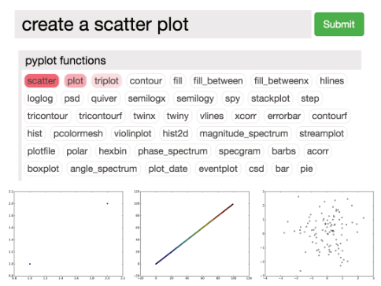

<!-- Source PDF SHA-256: 2bb575031bcb0950bfded6230a989fb817fc57e635de35c4b1dbaff6049d6937 -->

# CodeMend: Assisting Interactive Programming with Bimodal Embedding

[Source PDF](https://from.so/assets/pdfs/rong-codemend-uist2016.pdf) · [Publisher page](https://doi.org/10.1145/2984511.2984544)

Xin Rong University of Michigan Ann Arbor, MI ronxin@umich.edu

Shiyan Yan University of Michigan Ann Arbor, MI shiyansi@umich.edu

Stephen Oney University of Michigan Ann Arbor, MI soney@umich.edu

Mira Dontcheva Adobe Research San Francisco, CA mirad@adobe.com

Eytan Adar University of Michigan Ann Arbor, MI eadar@umich.edu

> Permission to make digital or hard copies of all or part of this work for personal or classroom use is granted without fee provided that copies are not made or distributed for profit or commercial advantage and that copies bear this notice and the full citation on the first page. Copyrights for components of this work owned by others than ACM must be honored. Abstracting with credit is permitted. To copy otherwise, or republish, to post on servers or to redistribute to lists, requires prior specific permission and/or a fee. Request permissions from permissions@acm.org. UIST’16, October 16-19, 2016, Tokyo, Japan Copyright c⃝ 2016 ACM. ISBN 978-1-4503-4189-9/16/10...$15.00.

## ABSTRACT

Software APIs often contain too many methods and parameters for developers to memorize or navigate effectively. Instead, developers resort to finding answers through online search engines and systems such as Stack Overflow. However, the process of finding and integrating a working solution is often very time-consuming. Though code search engines have increased in quality, there remain significant language-and workflow-gaps in meeting end-user needs. Novice and intermediate programmers often lack the “language” to query, and the expertise in transferring found code to their task. To address this problem, we present CodeMend, a system to support finding and integration of code. CodeMend leverages a neural embedding model to jointly model natural language and code as mined from large Web and code datasets. We also demonstrate a novel, mixed-initiative, interface to support query and integration steps. Through CodeMend, end-users describe their goal in natural language. The system makes salient the relevant API functions, the lines in the end-user’s program that should be changed, as well as proposing the actual change. We demonstrate the utility and accuracy of CodeMend through lab and simulation studies.

### Author Keywords

Natural language code search; word embedding; program embedding

### ACM Classification Keywords

D.2.6 Programming Environments

## INTRODUCTION

Modern programming libraries present complex APIs that are both powerful and potentially overwhelming. Python

DOI: http://dx.doi.org/10.1145/2984511.2984544 packages such as matplotlib and pandas are used in “traditional” programming environments but have also become critical for interactive computing environments. These environments enable end-users to perform data analysis in instantaneous read-eval-print loops (REPL). Driven by the demand of data scientists and analysts, interactive environments such as IPython/Jupyter Notebooks, Mathematica, and R, have grown in popularity \[[12](<#page-11>)\]. Though in some ways programming in interactive environments is “easier”—with relatively short code blocks and architectures—they are nonetheless difficult to learn and master due to the significant scale of functions and parameters provided through the APIs. Additionally, end-users for interactive environments are broader than professional programmers and the development environments themselves are often less feature-rich. Search engines may help, but using them successfully still demands a great amount of knowledge and skill. Specifically, the end-user must formulate the query, identify good matches, interpret the APIs’ use in example code, and correctly integrate this information into her own code.

Take a user who is using a graphing library to generate a bar-chart but doesn’t like the default location of the legend. She searches for: “move the legend in Bokeh”.[1](<#page-1>) She is likely to find lengthy documentation of the library, or possibly a long example where the correct function and parameter is buried inside. If she is really lucky (or an experienced searcher), she may find an answer on Stack Overflow that clearly matches the question and describes the function and parameter, but even then she would need to figure out where exactly in her code the function or parameter should go. We propose instead that IDEs should short-circuit this and provide in-situ code modification recommendations in response to natural language (NL) queries. Suggestions should be contextualized by inspecting the end-user’s current code context and supported by a large database of code examples.

In this paper, we present CodeMend, an intelligent assistant for interactive programming environments. CodeMend is aware of what code the end-user has already written and can respond to their NL requests directly in the context of that code. For the example above, the system can understand that the user has already created a legend, and can associate

1Bokeh is an increasingly popular Python plotting library.

Figure 1. CodeMend system screenshot: (A) code editor: highlights relevant lines and columns based on the user’s natural language query; (B) preview window: shows the image generated by the code; (C) query box: allows the user to type in natural language queries; (D) multi-function information box: provides code summary and nested-layer suggestions of possible code modifications.

to a large collection of code examples and understand what people usually do after creating a legend. By combining this contextual information with the user’s query, “move the legend,” CodeMend can more precisely recommend the correct function and parameter than a search engine would. Even better, CodeMend not only indicates to the user where in the code the modification should be made by highlighting the relevant lines and parameters, but also displays the suggested code changes through a novel interactive UI.

To build CodeMend, we adopt a neural network model, namely a bimodal embedding model \[[2](<#page-10>)\], to jointly model code and NL. This model is based on n-gram representations of code and NL. It learns the distributed representations of code and words in the same vector space by consuming large text and code corpora. In CodeMend, the corpora include data ranging from API documentations, Stack Overflow pages, GitHub repositories, and other webpages. After training, the model can be applied to different tasks, including code prediction, code captioning, as well as the primary function of CodeMend, contextualized code modification suggestion based on NL queries.

We trained CodeMend’s first model on matplotlib \[[20](<#page-11>)\], a popular Python library for plotting scientific figures, and is frequently used in IPython or Jupyter Notebook environments. We targeted matplotlib initially as it is representative of a broad set of additional libraries (e.g., numpy, pandas, networkx, and scikit-learn). To evaluate CodeMend, we tested our model against a set of collected user queries, demonstrating that our model can accurately understand a significant portion of the queries while handling many instances of vocabulary mismatches. We also conducted a user study with the full CodeMend interface to show an improvement in end-user productivity.

CodeMend contributes a novel end-to-end solution that applies a neural network model trained on a large Web-mined dataset to suggest API functions, parameters, values, or lines of code for modifying the user’s code snippet to achieve their tasks expressed in NL. Beyond the “back-end” models, Code- Mend provides an innovative UI design that supports the developer to efficiently search for code editing suggestions, browse common parameter values, inspect live previews, and integrate suggested modifications to their working code without leaving the IDE. Finally, our evaluation of the system contributes a set of insights into the ways that code search results can be effectively presented to the end-user.

## RELATED WORK

We briefly touch upon related solutions including both UI-focused approaches as well as novel “code mining” backends.

### Context-based Code Search and Code Synthesis

Code-search solutions have long-existed to support the needs of developers \[[3](<#page-10>), [22](<#page-11>), [23](<#page-11>), [25](<#page-11>), [30](<#page-12>)\]. Though many search engines are context-free, some have leveraged the end-user’s current code to enhance search performance \[[5](<#page-11>), [7](<#page-11>), [18](<#page-11>), [34](<#page-12>), [48](<#page-12>)\]. CodeBroker \[[48](<#page-12>)\], for example, uses comments and function definitions in the user’s current code to match code examples. Strathcona \[[18](<#page-11>)\], PRIME \[[34](<#page-12>)\], and SWIM \[[40](<#page-12>)\] extract class types and function calls as context. Some systems go further by helping adapt and integrate found code to the user’s current code \[[15](<#page-11>), [37](<#page-12>), [47](<#page-12>)\]. A few solutions can even synthesize new code blocks unseen by the system \[[6](<#page-11>), [11](<#page-11>), [13](<#page-11>), [26](<#page-11>), [40](<#page-12>), [44](<#page-12>)\]. To this end, the local variables defined in the user’s current code (and even their runtime values) are leveraged, which offers greater flexibility in terms of adapting the code example to the current codebase and helping the user navigate through complex APIs \[[27](<#page-11>), [45](<#page-12>), [46](<#page-12>)\]. While most of these existing systems present results as a ranked list of synthesized code snippets or directly modify the user’s code, CodeMend takes an innovative approach that directs the user’s attention to the part of the code that is most relevant to the query, and uses a nested-layer spotlight search interface to help the user select suggested code changes. To the best of our knowledge, CodeMend is unique in offering an end-to-end solution that combines mining massive Web resources, joint modeling of text and code, support for long-tail NL queries, and a novel UI to present code modifications with interactive visualizations.

### Associating Code with NL

Many code-search systems use keyword matching to process NL queries \[[6](<#page-11>), [22](<#page-11>), [29](<#page-11>)\]. Although keyword matching can be effective in catching lexical features (e.g., comments, variable and function names), it fails when there is a vocabulary mismatch between the query terms and the indexed terms. To address this issue, a number of systems employs query expansion \[[14](<#page-11>), [30](<#page-12>), [40](<#page-12>)\] or topic models \[[3](<#page-10>), [48](<#page-12>)\]. For example, AnyCode \[[14](<#page-11>)\] uses WordNet \[[33](<#page-12>)\] to perform query expansion, while SWIM \[[40](<#page-12>)\] leverages a proprietary commercial search engine’s click-through logs. Broker \[[48](<#page-12>)\] and SSI \[[3](<#page-10>)\] use variants of Latent Semantic Analysis (LSA) \[[7](<#page-11>)\]. In comparison, CodeMend uses a neural embedding model, which has several advantages: it can be trained on openly available domain-specific corpora and thus is not limited by the coverage of WordNet or proprietary data; it can be trained more efficiently than topic models; and it can easily consume a larger amount of data and gain better performance.

A second line of research focuses on synthesizing programs that perform small and repetitive tasks (e.g., text editing) based on NL instructions \[[8](<#page-11>), [28](<#page-11>), [43](<#page-12>), [49](<#page-12>)\]. These systems can achieve very high accuracy in composing domain-specific programs but have relatively strict requirement on the syntax of the NL query. In comparison, CodeMend focuses on handling more open-ended task expressions.

### Statistical Code Modeling

Statistical code modeling, or big code analysis \[[41](<#page-12>)\], captures regularities in a code corpus and distills useful knowledge about APIs or the underlying programming language \[[4](<#page-11>), [17](<#page-11>), [36](<#page-12>)\]. While such models are often used to enhance applications like plagiarism detection \[[19](<#page-11>)\] or code completion \[[42](<#page-12>)\], they can also be used to enhance the modeling of code context for suggesting code modifications as in CodeMend.

A popular choice for code modeling are n-gram models. Hsiao et al. \[[19](<#page-11>)\] use n-grams of code tokens to represent a program, and show that tf-idf (term frequency–inverse document frequency) weights, a common NL corpus statistic, can effectively improve code similarity measurement (leading to better performance in plagiarism detection). SLANG \[[42](<#page-12>)\] leverages an n-gram model of API call sequences, and allows the user to write programs with placeholders which the system will automatically fill in with appropriate API calls. While CodeMend also leverages the n-gram representation to model the code context, our objective is different and our model is also dependent on the NL context.

### Distributed Representation Models

Neural embedding models that learn distributed representations (vectors) of NL words have recently gained a great amount of attention \[[24](<#page-11>), [31](<#page-12>), [32](<#page-12>)\]. Such models are fast to train and can take advantage of large-scale unlabeled training data. They are shown to be able to learn representations of words that carry deep semantics \[[32](<#page-12>)\].

Several recent studies adapt the embedding approach to modeling tasks \[[1](<#page-10>)\] and programs \[[2](<#page-10>), [38](<#page-12>), [39](<#page-12>)\]. Our model is inspired by Allamanis et al. \[[2](<#page-10>)\]. Their solution frames the process of code generation as searching for plausible children tuples to be attached to a partially grown abstract syntax tree (AST). The searching is contextualized based on the bag-of-word representation of an NL utterance. As a result, their model supports code retrieval by NL and also caption generation for code snippets. Our model stems from this approach, but is based on a simpler code representation and employs a novel method to generate training data from code examples, so that the model can learn plausible code modifications.

Other work on recurrent neural networks (RNNs) and convolutional neural networks (CNNs) also show promising results when adapted to modeling programming language \[[21](<#page-11>), [35](<#page-12>)\]. CodeMend may benefit from these techniques in the future.

### Exploratory Programming Interfaces

Exploratory programming, or live programming, is a paradigm that is centered around the REPL experience \[[16](<#page-11>)\] Mathematica, MATLAB, R, IPython, and Jupyter Notebook are all examples in this space. Recent work has focused on augmenting these tools to support collaboration among data scientists. For example, Tempe \[[10](<#page-11>)\] is an integrated system that supports collaborative analysis on temporal and streaming data via REPL experience. The system can manage persistent research notebooks and make the results of analysis more reproducible than tools like Jupyter Notebooks by tracking workflow provenance. Although CodeMend has a similar motivation—augmenting the REPL experience for data scientists in general—our focus is on optimizing individual users’ experience of navigating through complex APIs.

## SYSTEM OVERVIEW

### Sample User Experience

Figure [1](<#page-2>) displays the interface of our system. Suppose Alice wants to create a scatter plot. She opens CodeMend with an empty editor. The system displays a list of functions that are likely to be called first (Figure [2](<#page-4>)). Although she can browse the suggested functions, Alice types in a search query “create a scatter plot”. As she types each word, the system updates the ranked list of functions, while using color to encode the likelihood of each candidate. When she stops typing, she finds that scatter is highest ranked, and clicks on it. Code- Mend shows a set of previews of scatter plots generated by different code examples mined from the Web, ranked by the simplicity (length) of the code. Alice clicks on one of them and the system populates the editor with its code. Alice can then replace the dummy data variables in the code with her real data.

Figure 2. CodeMend showing a ranked list of suggested functions based on the query “create a scatter plot”. Clicking on a suggested function will make the system display a number of images generated by the code examples using the function.

Unfortunately, the look of the chart still isn’t quite right. Alice wants to change the transparency of the points on the plot, but she does not know how to do this. She presses ESC to focus on the query box, and types a query: “change transparency of the points”. As Alice types, the system computes how likely each line is associated with this modification task and highlights the line with the highest likelihood. In this case, it is the line that has the plt.scatter() function (Figure [1](<#page-2>) (A)). After she clicks on the line, the system shows a suggestion box with a ranked list of parameters (Figure [1](<#page-2>) (D)), and the top ranked one is alpha. She clicks on the parameter and the API documentation of the parameter shows up, as well as a number of example values for this parameter. These values are extracted from tens of thousands of code examples online, and are ranked by the frequency of their usage. Alice clicks on a suggested value 0.5, and CodeMend updates the code and the image preview immediately. Alice checks the image and is satisfied with the change.

In summary, CodeMend has supported Alice’s editing process via: (1) query-dependent code highlighting; (2) multi-layer suggestion (functions, arguments, and values); and (3) instant preview of the effects of code changes.

### System Architecture

CodeMend contains three major components: an indexing module, a modeling module, and a front-end user interface component (Figure [3](<#page-4>)). The indexing module crawls GitHub repositories and webpages (such as Stack Overflow discussion pages), to collect code examples and NL text content. This data is then fed into a bimodal embedding model, which is a statistical model that can automatically learn the associations between code and NL and handle vocabulary mismatch by scanning large collections of data in both modes. Once training is complete, the back-end model is used to provide code suggestions. It takes both code context and the user query as input, and generates ranked lists of code elements (functions, parameters, and parameter values) for the front-end to display. While the user only interacts with Code- Mend’s UI, she benefits from the knowledge extracted from a large collection of Web resources. Below, we detail each of the CodeMend’s components.

Figure 3. Overview of the CodeMend architecture.

## DATA PREPARATION

To train a neural embedding model to learn high-quality representations, one has to supply an extensive amount of data. In our case, we need both a large collection of code examples that use matplotlib and a large text corpus that talks about the same library. To create a natural language corpus with reasonably good coverage on how developers describe tasks and problems in Python programming in general, we extracted all the NL content from Stack Overflow threads that were tagged “Python”. This resulted in a corpus of 90 million words extracted from 397,197 threads. All the text content was tokenized, lower-cased, and lemmatized.

To collect code examples, we searched GitHub for repositories that contained the string “matplotlib”, and cloned the first 1,000 repositories in the search results. We extracted code from Python source files as well IPython Notebooks. After discarding duplicates and unparseable files, we obtained 8,732 useful code examples. We also downloaded the entire Stack Overflow data dump[2](<#page-4>) and extracted code examples from positively rated answers in all the threads tagged “matplotlib”, which resulted in an extra 15,570 code examples. To obtain more code, we prepared a list of 1,428 queries using frequent keywords of matplotlib and appended “matplotlib” to the end of each query (e.g. “Axes matplotlib”). We submitted these queries to the Yahoo! Boss Search API and collected 38,590 URLs. Using these URLs and their one-hop outgoing links, we retrieved a total of 1,921,890 webpages. We then built a classifier using character sequences as features to identify the code examples in these webpages. This step gave us

2https://archive.org/details/stackexchange

![Figure 4. Training pipeline. GitHub and webpages supply code and natural-language content. Code becomes indexed function and argument n-grams; the example simplifies a matplotlib pie chart, title, bounding-box and axis calls. Natural-language content trains an embedding network, supplemented by API docstrings. The combined network takes a code-context vector and a natural-language vector, joins them in a hidden layer and predicts an output code element. In the example, code context plus the words color, set, face, bounding, the, box predict plt.title.set\_bbox@1@facecolor, identifier 8206.](../figures/rong-codemend-uist2016/figure-004-p005.png)

Figure 4. Pipeline for training a bimodal embedding model.

99,424 code examples, of which 21,993 were useful (examples shorter than 3 lines were discarded). We also included all the code examples of a textbook about matplotlib \[[9](<#page-11>)\]. In total, we collected 46,495 useful code examples.

In addition to training the model, the code examples are also used to generate sample plots of functions (see Figure [2](<#page-4>)). For this purpose, we consulted the documentation of matplotlib, and identified 47 functions that can directly generate figures (as opposed to adjusting a figure). For each function, we found the code examples that used the function and filtered out those that failed to execute. We ranked the remaining code examples by simplicity (measured by number of characters in code), and kept at most 20 shortest code examples per function. Finally, a total of 405 code examples and their generated plots were used for real-time previewing. Note that we did not support automatic mapping from data to example plots in the current version. Data transformation is beyond the scope of CodeMend but is a very interesting direction for future work.

## MODELING CODE AND NATURAL LANGUAGE

Figure [4](<#page-5>) illustrates our pipeline for training the CodeMend model. Below, we detail our modeling techniques, including creating simplified representations of code, modeling NL, and jointly modeling code and NL (i.e., bimodal modeling).

### Simplified Code Representation

We use a set of n-grams {x} to represent a piece of code C. Each n-gram x is a concatenation of a subset of tokens {t} 2 C, and each token t can be a module, a function, a parameter, or a keyword. The tokens in x must follow a specific order, which obeys the dependencies between the tokens. For example, a module token tM must be followed by a function token tF, while tF may be followed by another function token t′F if t′F is a member function of the returned value of tF, or alternatively tF may be followed by a parameter token, tP.

Figure [4](<#page-5>)(c) shows an example set of n-grams extracted from a given piece of code. One of the n- grams is plt.title.set bbox@1, which consists of four tokens: tM=plt, tF1=title, tF2=set bbox, and tP=@1. It represents the first positional argument of the set bbox() method of the returned variable of the function title(), which belongs to the module plt (short for matplotlib.pyplot).

Generating these n-grams from code and counting them is relatively cheap and convenient, which enables us to leverage the large collection of code examples quickly without losing much representational power. It also reduces the complexity of the downstream bimodal embedding model. However, the use of n-grams as code representation does limit the model’s capability of understanding the sequential ordering of code elements or more complex code structure. We describe these limitations further in the Discussion section as well as alternative designs.

To convert code examples to n-grams, we parsed found code using Python’s built-in ast module. We obtained 177,033 unique n-grams. Filtering those n-grams that did not relate to matplotlib or occurred fewer than 10 times. After filtering, we retained 9,569 unique n-grams as the vocabulary of program tokens. In subsequent processing, each code example, as well as the user’s code context, were abstracted as a “bag” of these n-grams.

### Modeling Natural Language

To handle the potential vocabulary mismatch between the user’s query and the documentation of the library, we used the word2vec package \[[31](<#page-12>)\] to train a word embedding model (see Figure [4](<#page-5>)(d)) by consuming the previously collected text corpus. We used the continuous bag-of-word (CBOW) model with a vector size of 150, a window of 10 words, and negative sampling of 5 samples per instance. Discarding rare words which occurred less than 20 times in the corpus resulted in a vocabulary of 28,872 words. We ran 10 iterations over the corpus for training.

Since the text corpus we collected was from all Python-related Stack Overflow threads, we were curious whether it had good precision in modeling terms specific to matplotlib. We looked at the terms that are most “similar”, as measured by cosine similarity, to the parameter names in matplotlib, and inspected whether these terms are indeed relevant to the concept of the parameters. Though anecdotal, this initial inspection shows that a number of terms relevant to matplotlib are precisely captured in the model. For example, among the most similar terms to “alpha” are “opacity”, “lightness”, “saturation”, and “transparency”; and among the most similar terms to “rotation” are “angle”, “orientation”, “clockwise”, and “counter-clockwise”. These term associations are important for handling vocabulary mismatch in the subsequent bimodal modeling process.

### Bimodal Modeling

Thus far we have introduced how we model the code context and NL, but these two models are still separate. In this section, we describe the techniques to jointly model code and NL in a single unified model—a neural embedding network. The reason we favor a single unified model over two separate ones is that the predictive outputs of the separate models often need to be merged based on human heuristics, whereas a unified model can automatically capture the associations between data of two domains with much less human intervention and is thus more robust than models heavily involved with heuristics.

The unified bimodal model we use is illustrated in Figure [4](<#page-5>)(f). The model is inspired by \[[31](<#page-12>)\] and \[[2](<#page-10>)\], but is specifically tailored for our code modification task. It takes a code context C and a user’s query Q as input, and generates a likelihood prediction p(X\|C, Q) over all possible code n-grams X = {x} as output. In our specific context, it takes a subset of 9,569 code n-grams and a subset of 28,872 NL tokens as input, and produces a score for each of the 9,569 code n-grams (see Figure [4](<#page-5>)). By training the model, we want the score p(X\|C, Q) to align well with the relevance of a code n-gram to the user’s task expressed by Q in the context of C.

For example, if C contains the plt.pie (generate a pie chart) function and Q contains the term “rotate”, then we want the correct parameter, startangle of the function pie, to have a very high ranking among all x 2 X. Since many functions have a parameter related to rotation, the code context, plt.pie, serves to disambiguate the user query. Conversely, Q disambiguates all related API functions.

To train the model, we need to supply a series of training instances, (C, Q, x∗), where C is the code context, Q is the query, and x∗ is the expected output. These training instances are generated by going through all the code n-grams of a code example, selecting one code n-gram as x∗ at a time, and using the surrounding code elements within a window (e.g., 5 lines of code on each side) as C, and using the docstring of x∗ as Q. When we construct C, we randomly drop the n-grams within the window with a 50% chance, so as to simulate the situations with incomplete code.

Internally, the model holds three sets of vector representations: (1) VC, the vectors of the code n-grams in the context; (2) VX, the vectors of code n-grams in the output layer; and (3) V , the vectors of NL words. For each training instanceQ (C, Q, x∗), the model fixes the positions of V , which areQ learned previously using word2vec, and adjusts the positions of VC and VX in the vector space to optimize the predicted ∗ score p(x \|C, Q).

![Figure 5. Four usage scenarios of the bimodal embedding model, arranged in a two-by-two grid. Each panel shows the same network connecting code context and natural-language input through an intermediate representation to code output; colored nodes and arrows indicate the inputs or outputs used, while unused input branches are gray. Panel (a), Code to Code: code context enters the upper input branch and predicts code at the right. Panel (b), NL to Code: natural language enters the lower input branch and predicts code at the right. Panel (c), NL plus Code to Code: both input branches are supplied to predict code. Panel (d), Code to NL: code context and target code are supplied, with the right-hand arrow pointing into the network and the lower-left arrow pointing outward to indicate natural-language output.](../figures/rong-codemend-uist2016/figure-005-p006.png)

Figure 5. Four usage scenarios of the bimodal embedding model.

Once trained, the bimodal model can be applied in a variety of scenarios. Figure [5](<#page-6>) illustrates four applications that are supported by the model, which we review below respectively.

#### Code to Code

If we only supply the code context C to the model (see Figure [5](<#page-6>)(a)), then the model is computing p(x\|C), essentially predicting what the developer would write next, given the code she has already written. Table [1](<#page-6>) gives an example ranked list of suggested code n-grams. It is interesting to note that the model captures the plt.bar@label in the code context, and provides a reasonable recommendation to “create a legend” among the highest ranked result, i.e., plt.legend.

<table>
  <thead>
    <tr>
      <th id="pdf-table-593:0-66b64167-table-6-13-0-0-62537744" scope="col" data-pdf-scope="Both">Suggested n-gram</th>
      <th id="pdf-table-593:0-66b64167-table-6-13-0-1-be371fd3" scope="col" headers="pdf-table-593:0-66b64167-table-6-13-0-0-62537744">Score (Unnormalized)</th>
    </tr>
  </thead>
  <tbody>
    <tr>
      <th id="pdf-table-593:0-66b64167-table-6-13-1-0-629b97c7" scope="row" headers="pdf-table-593:0-66b64167-table-6-13-0-0-62537744">plt.bar@1</th>
      <td headers="pdf-table-593:0-66b64167-table-6-13-0-1-be371fd3 pdf-table-593:0-66b64167-table-6-13-1-0-629b97c7">-3.510</td>
    </tr>
    <tr>
      <th id="pdf-table-593:0-66b64167-table-6-13-2-0-bd728857" scope="row" headers="pdf-table-593:0-66b64167-table-6-13-0-0-62537744">plt.legend</th>
      <td headers="pdf-table-593:0-66b64167-table-6-13-0-1-be371fd3 pdf-table-593:0-66b64167-table-6-13-2-0-bd728857">-3.715</td>
    </tr>
    <tr>
      <th id="pdf-table-593:0-66b64167-table-6-13-3-0-75a1ba19" scope="row" headers="pdf-table-593:0-66b64167-table-6-13-0-0-62537744">plt.bar@0</th>
      <td headers="pdf-table-593:0-66b64167-table-6-13-0-1-be371fd3 pdf-table-593:0-66b64167-table-6-13-3-0-75a1ba19">-4.478</td>
    </tr>
    <tr>
      <th id="pdf-table-593:0-66b64167-table-6-13-4-0-846171ce" scope="row" headers="pdf-table-593:0-66b64167-table-6-13-0-0-62537744">plt.bar@hatch</th>
      <td headers="pdf-table-593:0-66b64167-table-6-13-0-1-be371fd3 pdf-table-593:0-66b64167-table-6-13-4-0-846171ce">-4.556</td>
    </tr>
    <tr>
      <th id="pdf-table-593:0-66b64167-table-6-13-5-0-559f6eea" scope="row" headers="pdf-table-593:0-66b64167-table-6-13-0-0-62537744">plt.bar@log</th>
      <td headers="pdf-table-593:0-66b64167-table-6-13-0-1-be371fd3 pdf-table-593:0-66b64167-table-6-13-5-0-559f6eea">-5.512</td>
    </tr>
  </tbody>
</table>

Table 1. Top-ranked code n-grams based on code context only. The code context contains: plt.bar,plt.title,plt.bar@label.

#### NL to Code

As shown in Figure [5](<#page-6>)(b), if we only give the model NL input Q, then the model is predicting p(x\|Q)—the equivalent to performing a function or parameter look-up. Table [2](<#page-7>) shows a ranked list of code n-grams based only on an NL query, “add text label”.

#### NL &amp; Code to Code

Figure [5](<#page-6>)(c) shows the scenario in which the full model is at work. In this scenario, the model is predicting p(x\|Q, C)— recommending a code n-gram based on both code and NL contexts. The NL query is the same as in the last example, but

<table>
  <thead>
    <tr>
      <th id="pdf-table-628:0-5f12e49b-table-7-0-0-0-5246316e" scope="col" data-pdf-scope="Both">Suggested n-gram</th>
      <th id="pdf-table-628:0-5f12e49b-table-7-0-0-1-5f32f8d8" scope="col" headers="pdf-table-628:0-5f12e49b-table-7-0-0-0-5246316e">Score (Unnormalized)</th>
    </tr>
  </thead>
  <tbody>
    <tr>
      <th id="pdf-table-628:0-5f12e49b-table-7-0-1-0-e5226bc5" scope="row" headers="pdf-table-628:0-5f12e49b-table-7-0-0-0-5246316e">plt.plot@label</th>
      <td headers="pdf-table-628:0-5f12e49b-table-7-0-0-1-5f32f8d8 pdf-table-628:0-5f12e49b-table-7-0-1-0-e5226bc5">6.143</td>
    </tr>
    <tr>
      <th id="pdf-table-628:0-5f12e49b-table-7-0-2-0-be327426" scope="row" headers="pdf-table-628:0-5f12e49b-table-7-0-0-0-5246316e">plt.text</th>
      <td headers="pdf-table-628:0-5f12e49b-table-7-0-0-1-5f32f8d8 pdf-table-628:0-5f12e49b-table-7-0-2-0-be327426">5.881</td>
    </tr>
    <tr>
      <th id="pdf-table-628:0-5f12e49b-table-7-0-3-0-67828807" scope="row" headers="pdf-table-628:0-5f12e49b-table-7-0-0-0-5246316e">plt.clabel</th>
      <td headers="pdf-table-628:0-5f12e49b-table-7-0-0-1-5f32f8d8 pdf-table-628:0-5f12e49b-table-7-0-3-0-67828807">5.638</td>
    </tr>
    <tr>
      <th id="pdf-table-628:0-5f12e49b-table-7-0-4-0-166b19a3" scope="row" headers="pdf-table-628:0-5f12e49b-table-7-0-0-0-5246316e">plt.text@1</th>
      <td headers="pdf-table-628:0-5f12e49b-table-7-0-0-1-5f32f8d8 pdf-table-628:0-5f12e49b-table-7-0-4-0-166b19a3">4.832</td>
    </tr>
    <tr>
      <th id="pdf-table-628:0-5f12e49b-table-7-0-5-0-053a942e" scope="row" headers="pdf-table-628:0-5f12e49b-table-7-0-0-0-5246316e">plt.clabel@0</th>
      <td headers="pdf-table-628:0-5f12e49b-table-7-0-0-1-5f32f8d8 pdf-table-628:0-5f12e49b-table-7-0-5-0-053a942e">4.215</td>
    </tr>
  </tbody>
</table>

Table 2. Top-ranked code n-grams based on NL query only. The query is “add text label”.

the additional code context promotes the n-gram that creates a contour plot (plt.contourf) to the top. This example illustrates how code context helps improve the precision of NL-based search.

<table>
  <thead>
    <tr>
      <th id="pdf-table-649:0-e711b243-table-7-3-0-0-43521683" scope="col" data-pdf-scope="Both">Suggested n-gram</th>
      <th id="pdf-table-649:0-e711b243-table-7-3-0-1-e200de6b" scope="col" headers="pdf-table-649:0-e711b243-table-7-3-0-0-43521683">Score (Unnormalized)</th>
    </tr>
  </thead>
  <tbody>
    <tr>
      <th id="pdf-table-649:0-e711b243-table-7-3-1-0-ca8c4d35" scope="row" headers="pdf-table-649:0-e711b243-table-7-3-0-0-43521683">plt.clabel</th>
      <td headers="pdf-table-649:0-e711b243-table-7-3-0-1-e200de6b pdf-table-649:0-e711b243-table-7-3-1-0-ca8c4d35">5.342</td>
    </tr>
    <tr>
      <th id="pdf-table-649:0-e711b243-table-7-3-2-0-af1d390e" scope="row" headers="pdf-table-649:0-e711b243-table-7-3-0-0-43521683">plt.plot@label</th>
      <td headers="pdf-table-649:0-e711b243-table-7-3-0-1-e200de6b pdf-table-649:0-e711b243-table-7-3-2-0-af1d390e">4.210</td>
    </tr>
    <tr>
      <th id="pdf-table-649:0-e711b243-table-7-3-3-0-b73b339f" scope="row" headers="pdf-table-649:0-e711b243-table-7-3-0-0-43521683">plt.clabel@0</th>
      <td headers="pdf-table-649:0-e711b243-table-7-3-0-1-e200de6b pdf-table-649:0-e711b243-table-7-3-3-0-b73b339f">4.154</td>
    </tr>
    <tr>
      <th id="pdf-table-649:0-e711b243-table-7-3-4-0-737554d0" scope="row" headers="pdf-table-649:0-e711b243-table-7-3-0-0-43521683">plt.text</th>
      <td headers="pdf-table-649:0-e711b243-table-7-3-0-1-e200de6b pdf-table-649:0-e711b243-table-7-3-4-0-737554d0">4.023</td>
    </tr>
    <tr>
      <th id="pdf-table-649:0-e711b243-table-7-3-5-0-e19e33b1" scope="row" headers="pdf-table-649:0-e711b243-table-7-3-0-0-43521683">plt.xlabel</th>
      <td headers="pdf-table-649:0-e711b243-table-7-3-0-1-e200de6b pdf-table-649:0-e711b243-table-7-3-5-0-e19e33b1">3.955</td>
    </tr>
  </tbody>
</table>

Table 3. Top-ranked code n-grams based on a combination of NL query and code context. The query is “add text label” and the code context is plt.contourf, which creates a contour plot.

#### Code to NL

Figure [5](<#page-6>)(d) shows the reverse process, in which the model computes p(Q\|x, C)—given a code context and one or more code n-grams, as well as a collection of short NL utterances, determine which utterance would have best predicted the given code n-gram. The last scenario can be used to generate code captions, i.e., short text that summarizes the code. Table [4](<#page-7>) shows a set of results obtained through this process.

<table>
  <thead>
    <tr>
      <th id="pdf-table-671:0-acc3f7b5-table-7-7-0-0-5daae16a" scope="col" data-pdf-scope="Both">Suggested NL utterance</th>
      <th id="pdf-table-671:0-acc3f7b5-table-7-7-0-1-7d86421d" scope="col" headers="pdf-table-671:0-acc3f7b5-table-7-7-0-0-5daae16a">Score (Unnormalized)</th>
    </tr>
  </thead>
  <tbody>
    <tr>
      <th id="pdf-table-671:0-acc3f7b5-table-7-7-1-0-2a78ddc0" scope="row" headers="pdf-table-671:0-acc3f7b5-table-7-7-0-0-5daae16a">make a log log histogram</th>
      <td headers="pdf-table-671:0-acc3f7b5-table-7-7-0-1-7d86421d pdf-table-671:0-acc3f7b5-table-7-7-1-0-2a78ddc0">54.19</td>
    </tr>
    <tr>
      <th id="pdf-table-671:0-acc3f7b5-table-7-7-2-0-b2a680bc" scope="row" headers="pdf-table-671:0-acc3f7b5-table-7-7-0-0-5daae16a">fit to a log scale</th>
      <td headers="pdf-table-671:0-acc3f7b5-table-7-7-0-1-7d86421d pdf-table-671:0-acc3f7b5-table-7-7-2-0-b2a680bc">38.64</td>
    </tr>
    <tr>
      <th id="pdf-table-671:0-acc3f7b5-table-7-7-3-0-cf401bb9" scope="row" headers="pdf-table-671:0-acc3f7b5-table-7-7-0-0-5daae16a">annotate doesn’t work on log scale</th>
      <td headers="pdf-table-671:0-acc3f7b5-table-7-7-0-1-7d86421d pdf-table-671:0-acc3f7b5-table-7-7-3-0-cf401bb9">33.93</td>
    </tr>
    <tr>
      <th id="pdf-table-671:0-acc3f7b5-table-7-7-4-0-844ae2fa" scope="row" headers="pdf-table-671:0-acc3f7b5-table-7-7-0-0-5daae16a">create square log-log plots</th>
      <td headers="pdf-table-671:0-acc3f7b5-table-7-7-0-1-7d86421d pdf-table-671:0-acc3f7b5-table-7-7-4-0-844ae2fa">30.79</td>
    </tr>
    <tr>
      <th id="pdf-table-671:0-acc3f7b5-table-7-7-5-0-137e445b" scope="row" headers="pdf-table-671:0-acc3f7b5-table-7-7-0-0-5daae16a">use log scale on polar axis</th>
      <td headers="pdf-table-671:0-acc3f7b5-table-7-7-0-1-7d86421d pdf-table-671:0-acc3f7b5-table-7-7-5-0-137e445b">29.55</td>
    </tr>
  </tbody>
</table>

Table 4. Top-ranked NL utterances based on code context. The code context is plt.hist@log. The collection of NL utterances are extracted from the titles of the Stack Overflow posts that are tagged matplotlib.

In addition to being able to perform the above prediction tasks, the vectors learned by the neural network also captures the regularities of the code elements. One aspect of such regularities is analogous relations between code n- grams. Figure [6](<#page-7>) demonstrates this feature. The vectors VX’s of four “symmetric” pairs of functions are visualized in a 2D plot. Such relations can be potentially used to complete a prediction based on existing context. For example, if the user has called plt.xlim, plt.ylim, plt.xlabel, then the model can complete the analogy and recommend plt.ylabel.

## USER INTERFACE

We implemented our front-end UI using a client-server model. The interface is loaded in a browser. The code editor is rendered using CodeMirror[3](<#page-7>), and the interactive results

> 3https://codemirror.net/

Figure 6. Function name analogy in the vector space.

are rendered using D3.[4](<#page-7>) Whenever the user’s cursor moves in the code editor or the user types in a query, the code and the query are sent to a back-end Python server to process. The server loads a bimodal neural network model to compute prediction scores. The scores are then sent back to the front-end to render as interactive visualized suggestions.

Unlike most existing code suggestion approaches that involve complex algorithmic search and inference, our model is simple in that it is stateless and global. At any given point (as illustrated in Figure [5](<#page-6>)), the model takes the combination of code context (can be empty) and NL query (can be empty) as input, and produces an output likelihood distribution among tens of thousands of possible code elements. Since the model essentially operates like a search engine, we could, in theory, directly display the results as a series of search engine results and have the user browse through them. However, showing results this way has two shortcomings: (1) it might be hard for the user to interpret and adapt the result to their code context correctly; (2) it might be frustrating to the user if the model misinterprets the user’s intent due to severe vocabulary mismatch or ambiguity that the model is not yet able to handle. So the question becomes: what interface design can not only take full advantage of the neural embedding model’s predictive power, but also make its results easily understandable by the user, easily convertible to actual modifications to the code, and will not get in the way of the user’s workflow when the model fails?

### Nested-layer Spotlight Search

Our solution follows the idea of using multiple cues to guide the user’s focus to the correct result. When the user submits a search query, matching lines in the code editor will be highlighted. New functions that can be inserted are suggested in the right-hand panel and are ranked by their likelihood. If the user clicks on a line in the editor, or clicks on a suggested function on the right (e.g., plt.grid in Figure [7](<#page-8>)), then the detailed documentation and parameter suggestions will appear. These parameters are, again, ranked by their likelihoods as predicted by the same model. If the user is interested in any of the parameters (e.g., linestyle in Figure [7](<#page-8>)), then

4 https://d3js.org/ the possible values mined from the code repositories will appear, which are ranked by their usage frequency. If the user clicks on any of the items, the choice will be backpropagated to the top-layer so that the user can preview the modification made so far. She may later accept or abandon the modifications. In some cases, the value of a parameter can have its own substructure, such as a dictionary, then a deeper layer will be displayed to allow more precise control of the program’s behavior.

Figure 7. Example of nested-layer spotlight search.

Using this design of nested-layer spotlight search, we direct the user’s attention to the most relevant information on the interface, while providing a mapping between the structure of the search results and the user’s mental model of the code structure. Compared to conventional search interfaces, where a fixed number of search results are displayed per query, our interface makes a much larger number of alternative solutions (i.e., functions, parameters, values) visible to the user at once. As a result, when the system fails to rank a certain expected function high enough, the user can easily identify and try other options, instead of having to experiment with other queries. This also enables the user to conveniently explore the solution space and even have serendipitous findings.

### Automatic Search Scoping

When the user enters a new query, there may still be several layers of suggestions expanded. In such cases, it is not obvious whether the user intends to refine the existing query (i.e., stays in the current nested layer view), or to start a search for a new task (i.e., expands a different set of layers). To resolve this ambiguity, we rely on the output of the model. If the predicted ranking of the items on the current layer is above a cut-off threshold, then we leave the current layer expanded, otherwise we close the current layer, and recursively inspect the upper layers. If none of the expanded layers match the user’s intention, then we close all layers and allow the user to pick new lines to focus on.

## EVALUATION

We performed two evaluations of CodeMend. The first tested the CodeMend model’s performance with respect to the function and parameter search task. This was a more conventional information retrieval (IR)-style analysis which allowed us to quantify how well CodeMend could retrieve relevant results. The second experiment tested CodeMend’s usability through a lab user study.

### Search Task Evaluation

One of the main features of CodeMend is that it finds relevant functions and parameters and then highlights lines of code that are targets for modification. We framed the function and parameter search as a standard IR problem and tested where relevant results were ranked.

#### Query Collection

To generate a test set of queries, we leveraged workers on Amazon’s Mechanical Turk. We generated five pairs of plots, covering bar charts, pie charts, scatter plots, line plots, and contour plots. Each pair had one “original” plot and one “modified” plot (see Figure [8](<#page-8>) for an example). Workers saw the pair and were asked to provide NL descriptions of the changes between the two. They were prompted to generate these as if they would issue a Google query to find code to achieve this change.

For the example pair shown in Figure [8](<#page-8>), workers produced queries like: “change the color of bars”, “remove the grid”, “move the position of the legend”, and “add the shadow into the bars”. In the end, 50 workers provided queries. On average, for each pair of images, a worker spent 150.2 seconds, composed 3.74 queries, and was paid $0.13 dollars.

Figure 8. Example of pairs of images shown to workers in Amazon Mechnical Turk

The quality of the obtained queries varied greatly. For example, some workers misunderstood the task instructions and, instead of describing how one would specifically change Figure A to obtain Figure B, many workers submitted vague descriptions (e.g., “the figure styles are different”). Among the 883 queries we initially obtained, we manually selected 361 qualified queries. We filtered out queries if they were (1) duplicate (⇠40%); (2) too vague or incorrect (⇠30%); or (3) junk (e.g., a single word taken from the figure labels, ⇠30%).

In the end, we observed that most selected queries were commands to change functions and parameters in the code, such as “change the font size of title.” The selected queries cover the different changes and different chart types.

#### Results

We used the queries generated above to test CodeMend in the context of the matplolib API. Because we had both the code that generated the original plot as well as the modified code, we naturally had ground truth on which to test the queries. We used mean reciprocal rank (MRR) as the metric to evaluate the ranking results of CodeMend. We also used R@1, R@5, and R@10, where R@K tests if the correct answer was ranked among the top K results.

<table>
  <thead>
    <tr>
      <th id="pdf-table-734:0-c74e48fa-table-9-0-0-0-a430babc" scope="col" data-pdf-scope="Both">Model</th>
      <th id="pdf-table-734:0-c74e48fa-table-9-0-0-1-9b6b6033" scope="col" headers="pdf-table-734:0-c74e48fa-table-9-0-0-0-a430babc">MRR</th>
      <th id="pdf-table-734:0-c74e48fa-table-9-0-0-2-afe059e7" scope="col" headers="pdf-table-734:0-c74e48fa-table-9-0-0-0-a430babc">R@1</th>
      <th id="pdf-table-734:0-c74e48fa-table-9-0-0-3-fb5fdc5a" scope="col" headers="pdf-table-734:0-c74e48fa-table-9-0-0-0-a430babc">R@5</th>
      <th id="pdf-table-734:0-c74e48fa-table-9-0-0-4-7be03e28" scope="col" headers="pdf-table-734:0-c74e48fa-table-9-0-0-0-a430babc">R@10</th>
    </tr>
  </thead>
  <tbody>
    <tr>
      <th id="pdf-table-734:0-c74e48fa-table-9-0-1-0-c5731f5f" scope="row" headers="pdf-table-734:0-c74e48fa-table-9-0-0-0-a430babc">NL Only</th>
      <td headers="pdf-table-734:0-c74e48fa-table-9-0-0-1-9b6b6033 pdf-table-734:0-c74e48fa-table-9-0-1-0-c5731f5f">0.153</td>
      <td headers="pdf-table-734:0-c74e48fa-table-9-0-0-2-afe059e7 pdf-table-734:0-c74e48fa-table-9-0-1-0-c5731f5f">0.091</td>
      <td headers="pdf-table-734:0-c74e48fa-table-9-0-0-3-fb5fdc5a pdf-table-734:0-c74e48fa-table-9-0-1-0-c5731f5f">0.224</td>
      <td headers="pdf-table-734:0-c74e48fa-table-9-0-0-4-7be03e28 pdf-table-734:0-c74e48fa-table-9-0-1-0-c5731f5f">0.249</td>
    </tr>
    <tr>
      <th id="pdf-table-734:0-c74e48fa-table-9-0-2-0-ef16fa04" scope="row" headers="pdf-table-734:0-c74e48fa-table-9-0-0-0-a430babc">Code Only</th>
      <td headers="pdf-table-734:0-c74e48fa-table-9-0-0-1-9b6b6033 pdf-table-734:0-c74e48fa-table-9-0-2-0-ef16fa04">0.090</td>
      <td headers="pdf-table-734:0-c74e48fa-table-9-0-0-2-afe059e7 pdf-table-734:0-c74e48fa-table-9-0-2-0-ef16fa04">0.055</td>
      <td headers="pdf-table-734:0-c74e48fa-table-9-0-0-3-fb5fdc5a pdf-table-734:0-c74e48fa-table-9-0-2-0-ef16fa04">0.116</td>
      <td headers="pdf-table-734:0-c74e48fa-table-9-0-0-4-7be03e28 pdf-table-734:0-c74e48fa-table-9-0-2-0-ef16fa04">0.141</td>
    </tr>
    <tr>
      <th id="pdf-table-734:0-c74e48fa-table-9-0-3-0-e6f08957" scope="row" headers="pdf-table-734:0-c74e48fa-table-9-0-0-0-a430babc">NL + Code (Bimodal)</th>
      <td headers="pdf-table-734:0-c74e48fa-table-9-0-0-1-9b6b6033 pdf-table-734:0-c74e48fa-table-9-0-3-0-e6f08957">0.245</td>
      <td headers="pdf-table-734:0-c74e48fa-table-9-0-0-2-afe059e7 pdf-table-734:0-c74e48fa-table-9-0-3-0-e6f08957">0.163</td>
      <td headers="pdf-table-734:0-c74e48fa-table-9-0-0-3-fb5fdc5a pdf-table-734:0-c74e48fa-table-9-0-3-0-e6f08957">0.335</td>
      <td headers="pdf-table-734:0-c74e48fa-table-9-0-0-4-7be03e28 pdf-table-734:0-c74e48fa-table-9-0-3-0-e6f08957">0.429</td>
    </tr>
  </tbody>
</table>

Table 5. Performance of different models on the search task. NL Only is the word2vec baseline; Code Only is the bimodal model with only code as context; NL + Code (Bimodal) is the bimodal model with both NL and code as context.

We developed three models for the function and parameter search: (1) a word2vec model (treated as baseline); (2) a bimodal model that only used code context, as another baseline; and (3) a bimodal model using both code context and NL.

As shown in Table [5](<#page-9>), the bimodal model using both NL and code context outperformed the baseline word2vec model (using NL Only) as well as the baseline that used only code context. Although the bimodal model did not solve parameter and function search tasks perfectly, it demonstrated the ability to return the correct parameters and functions in many scenarios.[5](<#page-9>) Note that because CodeMend does not list the search results in linear fashion like Google, this current performance is actually very reasonable, as we can direct the user’s attention to the results by using line highlighting and nested-layer suggestion in the interface.

### Lab User Study

We recruited 20 subjects in our lab user study to investigate whether CodeMend could help with coding tasks. All but one students were graduate students (the last was an undergraduate). All were in CS/IS or related majors. Based on pre-study reports on skills we had: Python: 6 experts, 9 intermediates, and 5 beginners; Matplotlib: 2 experts, 7 intermediates, 7 beginners, and 4 never used it before. To ensure a variety of responses, we did not filter participants based on their self-reported experience. This greatly increased the variance of the distribution in both control and treatment groups and likely influenced the significance in the results.

In the study, all subjects undertook a brief training session with CodeMend, and were subsequently given programming tasks, with and without the help of CodeMend. The training was provided through a short demo video and an interactive tutorial. Subjects were asked to complete a set of tasks. In each task, a subject was shown one original plot and images of three modified versions (each building upon the result of the last). Subjects were asked to generate the modified plots, one at a time, starting from the original plot.

For example, one task had the participant change a bar plot. The modified versions included the addition of a grid, rotation of the labels on the x-axis, and addition of shadows to the bars. The pie chart task required changing the size of title box, changing the color of title box, and rotating the pie for 90 degrees. Each participant completed both tasks (bar and pie) using one of two interfaces: a version of CodeMend that replaced the suggestions with a list of Google search results for the query (clicking on these would open the webpage), and a version of CodeMend with all features enabled (and the Google search results listed underneath). We opted to offer Google in both as we did not feel that preventing Web search would be a realistic environment. We logged all interactions with both versions.

> 5The MRR value of .245 looks much worse than it actually is. As a reminder: the reciprocal rank (RR) of a result is the inverse (1/K) of the rank of the correct answer. If the winner is at rank 1, RR is 1/1; at rank 2: 1/2=.5; at rank 3: 1/3=.33; at rank 4: 1/4 = .25. Therefore, a score of .245 means that on average the desired answer is ranked at the 4th place for bimodal but 6th or lower for the other models.

Each participant completed one task with the Code- Mend+Google version, and one with only Google. Tasks were counterbalanced to account for learning effects.

At the end of the lab user study, the users were asked to fill in another survey to discuss the strengths and weaknesses of CodeMend, and describe whether CodeMend helped them with programming. They were also asked to assign grades to the search results of CodeMend and Google.

#### Results

In the user studies, we found that CodeMend helped the users find parameters and functions to use quickly, and as a result, the users who used CodeMend accomplished more subtasks than those using just the Google baseline. It is also interesting to note that while the users in the treatment group (with CodeMend) were also given access to Google, they averaged 1.5 Google queries per session, while the number of queries under the Google-only setting averaged at 5.5.

We counted the number of completed subtasks for users, and found that users completed 46 subtasks using CodeMend, whereas they completed 41 using Google search only. Especially, when faced with challenging subtasks, those users with CodeMend were more likely to complete the subtasks compared to users with Google search.

The time spent on completing a subtask with CodeMend was 108.70 seconds on average, whereas the time with Google search only is 134.12 seconds. Furthermore, we divided the users into two groups based on their responses in the pre-study survey: one with high expertise in programming with matplotlib, the other with low expertise. We found the difference of spent time was relatively larger in the group with low expertise than that in the group with high expertise. Thus CodeMend appears to be more helpful for users with low expertise in the programming with matplotlib. However, we note that these were not significantly different statistically. Based on our observations of participants, we believe that the novelty of the CodeMend led subjects to spend more time with the tool than we might expect in ordinary use. In addition, to ensure a variety of responses, we did not filter participants based on their self-reported experience. This also greatly increased the variance of the distribution in both control and treatment groups and likely influenced the significance in the results.

According to the responses of the post-survey, 70% of users agreed or strongly agreed with “CodeMend system efficiently helps me solve my assigned tasks,” whereas 55% of users agreed or strong agreed with “Google can efficiently helps me solve my assigned tasks.” Users appeared to be more satisfied with the results from CodeMend than Google search. We also found that users uniformly appreciated the function and parameter suggestions provided by CodeMend. Most users chose this as their favorite feature of CodeMend.

#### Limitations

According to the users’ responses, the returned results of CodeMend were not always accurate enough. Users sometimes needed to change the query multiple times before eventually finding the correct functions and parameters. We took this concern to heart, and after the conclusion of the study we improved the model with additional training and tuning. Anecdotally, we found that performance improved (i.e., by checking the queries from the lab study, better suggestions were generated).

Subjects also found the number of options in the interface overwhelming at times. In part, this was due to the unfamiliarity of the tool for the subjects. Additional, long-term use may correct for this concern. However, reducing the amount of information in the UI and making the matches more salient is an area of future work for us.

## DISCUSSION

We briefly describe a number of limitations and future opportunities for CodeMend.

Given that CodeMend uses n-grams to represent NL and code, it may seem that the system can only serve the purpose of connecting NL names and functions and parameters. However, our code-based n-grams collapse the AST into a set of tokens, which can capture not only functions and parameters, but also certain hierarchical structures (e.g. nested function calls). For example, as shown in Figure [1](<#page-2>)(c), the set bbox function is called on the return value of another function plt.title. This dependency is captured by CodeMend, which suggests the entire line of plt.title when it is absent. However, the simple n-gram representation does limit CodeMend’s capability of handling more complex code constructs. In particular: (1) CodeMend does not understand control flows (if-else, for-loops); (2) it cannot suggest parameter values that are return values of previous function calls; (3) it cannot generate code blocks that require coordination of multiple operations (e.g., set up a color palette, adjust its configurations, and apply it to a plotting function), although each individual step is well supported. To overcome such limitations, we believe more complex neural network structures are necessary.

CodeMend does not presently support contextualized recommendations based on specific values—these are based on popularity and not on the bimodal model. For example, when the user issues a query such as “make the color darker,” the system should be able to promote darker color values over lighter colors. However, parameter values are difficult to incorporate into the vector space. These would introduce a huge sparsity issue—there would be simply too many vectors and too few data to train these additional vectors. Currently the parameter values are suggested based on their counts. While we find this approach to work reasonably well, it will be meaningful in the future to explore solutions to encode certain kinds of values as vectors as well.

Finally, we believe CodeMend is currently well suited for coding styles that use the REPL paradigm. Such programming tasks usually involve a series of relatively stateless function calls to a complex API, and is particularly common among data scientists doing data manipulation and visualization. Some relevant libraries include pandas, scikit-learn, and networkx. We chose matplotlib because its visual output allows novice users (including many of our participants) to verify their codes correctness. However, even in non-visual code, there are either visual or textual responses that can be displayed (e.g., network visualization, statistical summaries, or sample pandas dataframes). CodeMend may work in more traditional code settings, but the architecture of more complex code bases (e.g., where many modules or objects are used) will likely require modifications to the underlying model.

## CONCLUSIONS

In this work, we have developed and evaluated CodeMend, an integrated system that supports natural language queries for code modification suggestions. CodeMend is able to highlight areas of code to change and suggest lines, functions, parameters, or values to use based on the context. We have shown that our model, a bimodal embedding model trained with unlabeled data (text and code), can indeed support programming tasks. We have also proposed a novel UI to provide a way for developers to interpret suggested results and easily integrate them. Through information retrieval benchmark evaluations as well as in-lab user studies, we demonstrated that the proposed model can indeed accurately suggest the relevant solutions and the proposed interface can help with query disambiguation and support the programmer to efficiently explore multiple different parameters to discover new solutions to their task.

We believe there is significant opportunity in the use of better models of code and natural language. These new techniques also present both opportunity and challenge in developing UIs that can provide effective interfaces between the end-user and underlying models.

\[Code &amp; data: [https://github.com/ronxin/codemend](<https://github.com/ronxin/codemend>)\]

## ACKNOWLEDGEMENTS

We thank Adobe for providing funding for this research. We also thank our reviewers for their helpful comments.

## REFERENCES

- 1. Adar, E., Dontcheva, M., and Laput, G. Commandspace: Modeling the relationships between tasks, descriptions and features. In Proceedings of the 27th Annual ACM Symposium on User Interface Software and Technology, UIST ’14, ACM (2014), 167–176.

- 2. Allamanis, M., Tarlow, D., Gordon, A., and Wei, Y. Bimodal modelling of source code and natural language. In Proceedings of The 32nd International Conference on Machine Learning (2015), 2123–2132.

- 3. Bajracharya, S. K., Ossher, J., and Lopes, C. V. Leveraging usage similarity for effective retrieval of examples in code repositories. In Proceedings of the

18th ACM SIGSOFT International Symposium on Foundations of Software Engineering, FSE ’10, ACM (2010), 157–166.

- 4. Bielik, P., Raychev, V., and Vechev, M. Programming with “Big Code”: Lessons, Techniques and Applications. 1st Summit on Advances in Programming Languages (2015), 41.

- 5. Brandt, J., Dontcheva, M., Weskamp, M., and Klemmer, S. R. Example-centric programming: Integrating web search into the development environment. In Proceedings of the SIGCHI Conference on Human Factors in Computing Systems, ACM (2010), 513–522.

- 6. Chatterjee, S., Juvekar, S., and Sen, K. Sniff: A search engine for java using free-form queries. In Fundamental Approaches to Software Engineering. Springer, 2009, 385–400.

- 7. Deerwester, S., Dumais, S. T., Furnas, G. W., Landauer, T. K., and Harshman, R. Indexing by latent semantic analysis. Journal of the American Society for Information Science 41, 6 (1990), 391–407.

- 8. Desai, A., Gulwani, S., Hingorani, V., Jain, N., Karkare, A., Marron, M., R, S., and Roy, S. Program synthesis using natural language. In Proceedings of the 38th International Conference on Software Engineering, ICSE ’16, ACM (2016), 345–356.

- 9. Devert, A. matplotlib Plotting Cookbook. Packt Publishing Ltd, 2014.

- 10. Fisher, D., Chandramouli, B., DeLine, R., Goldstein, J., Aron, A., Barnett, M., Platt, J. C., Terwilliger, J. F., and Wernsing, J. Tempe: an interactive data science environment for exploration of temporal and streaming data. Tech. rep., MSR-TR-2014–148, 2014.

- 11. Galenson, J., Reames, P., Bodik, R., Hartmann, B., and Sen, K. Codehint: Dynamic and interactive synthesis of code snippets. In Proceedings of the 36th International Conference on Software Engineering, ACM (2014), 653–663.

- 12. Granger, B., Silvester, S., Grout, J., Perez, F., Corlay, S., Colbert, Chris, O. C., Willmer, D., and Darian, A. Jupyterlab: Building blocks for interactive computing. SciPy 2016, 2016.

- 13. Gvero, T., and Kuncak, V. Interactive synthesis using free-form queries. In 2015 IEEE/ACM 37th IEEE International Conference on Software Engineering, vol. 2 (May 2015), 689–692.

- 14. Gvero, T., and Kuncak, V. Synthesizing Java expressions from free-form queries. In Proceedings of the 2015 ACM SIGPLAN International Conference on Object-Oriented Programming, Systems, Languages, and Applications, ACM (2015), 416–432.

- 15. Hartmann, B., MacDougall, D., Brandt, J., and Klemmer, S. R. What would other programmers do: suggesting solutions to error messages. In Proceedings of the SIGCHI Conference on Human Factors in Computing Systems, ACM (2010), 1019–1028.

- 16. Hey, T., Hey, A. J., and Papay,´ G. The computing universe: a journey through a revolution. Cambridge University Press, 2014.

- 17. Hindle, A., Barr, E. T., Su, Z., Gabel, M., and Devanbu, P. On the naturalness of software. In Proceedings of the 34th International Conference on Software Engineering, ICSE ’12, IEEE Press (2012), 837–847.

- 18. Holmes, R., and Murphy, G. C. Using structural context to recommend source code examples. In Proceedings of the 27th international conference on Software engineering, ACM (2005), 117–125.

- 19. Hsiao, C.-H., Cafarella, M., and Narayanasamy, S. Using web corpus statistics for program analysis. In Proceedings of the 2014 ACM International Conference on Object Oriented Programming Systems Languages &amp; Applications, OOPSLA ’14, ACM (New York, NY, USA, 2014), 49–65.

- 20. Hunter, J. D. Matplotlib: A 2D graphics environment. Computing In Science &amp; Engineering 9, 3 (2007), 90–95.

- 21. Karpathy, A. The unreasonable effectiveness of recurrent neural networks, 2015. Available at: [http://karpathy.](<http://karpathy.github.io/2015/05/21/rnn-effectiveness/>) [github.io/2015/05/21/rnn-effectiveness/](<http://karpathy.github.io/2015/05/21/rnn-effectiveness/>).

- 22. Keivanloo, I., Rilling, J., and Zou, Y. Spotting working code examples. In Proceedings of the 36th International Conference on Software Engineering, ACM (2014), 664–675.

- 23. Krugle. Krugle Code Search. [http://www.krugle.com/](<http://www.krugle.com/>).

- 24. Le, Q. V., and Mikolov, T. Distributed representations of sentences and documents. arXiv preprint arXiv:1405.4053 (2014).

- 25. Linstead, E., Bajracharya, S., Ngo, T., Rigor, P., Lopes, C., and Baldi, P. Sourcerer: Mining and searching internet-scale software repositories. Data Mining and Knowledge Discovery 18, 2 (2009), 300–336.

- 26. Little, G., and Miller, R. C. Keyword programming in Java. Automated Software Engineering 16, 1 (2009), 37–71.

- 27. ´ Mandelin, D., Xu, L., Bodık, R., and Kimelman, D. Jungloid mining: Helping to navigate the API jungle. ACM SIGPLAN Notices 40, 6 (2005), 48–61.

- 28. Mayer, M., Soares, G., Grechkin, M., Le, V., Marron, M., Polozov, A., Singh, R., Zorn, B., and Gulwani, S. User interaction models for disambiguation in programming by example. In 28th ACM User Interface Software and Technology Symposium (2015).

- 29. McMillan, C., Grechanik, M., Poshyvanyk, D., Fu, C., and Xie, Q. Exemplar: A source code search engine for finding highly relevant applications. Software Engineering, IEEE Transactions on 38, 5 (2012), 1069–1087.

- 30. Mcmillan, C., Poshyvanyk, D., Grechanik, M., Xie, Q., and Fu, C. Portfolio: Searching for relevant functions and their usages in millions of lines of code. ACM Transactions on Software Engineering and Methodology (TOSEM) 22, 4 (2013), 37.

- 31. Mikolov, T., Chen, K., Corrado, G., and Dean, J. Efficient estimation of word representations in vector space. arXiv preprint arXiv:1301.3781 (2013).

- 32. Mikolov, T., Sutskever, I., Chen, K., Corrado, G. S., and Dean, J. Distributed Representations of Words and Phrases and their Compositionality. In Advances in Neural Information Processing Systems 26, Curran Associates, Inc. (2013), 3111–3119.

- 33. Miller, G. A. WordNet: a lexical database for English. Communications of the ACM 38, 11 (1995), 39–41.

- 34. Mishne, A., Shoham, S., and Yahav, E. Typestate-based semantic code search over partial programs. In Proceedings of the ACM International Conference on Object Oriented Programming Systems Languages and Applications, OOPSLA ’12, ACM (New York, NY, USA, 2012), 997–1016.

- 35. Mou, L., Men, R., Li, G., Zhang, L., and Jin, Z. On End-to-End Program Generation from User Intention by Deep Neural Networks. arXiv preprint arXiv:1510.07211 (2015).

- 36. Nguyen, T. T., Nguyen, A. T., Nguyen, H. A., and Nguyen, T. N. A statistical semantic language model for source code. In Proceedings of the 2013 9th Joint Meeting on Foundations of Software Engineering, ACM (2013), 532–542.

- 37. Oney, S., and Brandt, J. Codelets: Linking interactive documentation and example code in the editor. In Proceedings of the SIGCHI Conference on Human Factors in Computing Systems, ACM (2012), 2697–2706.

- 38. Peng, H., Mou, L., Li, G., Liu, Y., Zhang, L., and Jin, Z. Building program vector representations for deep learning. In Knowledge Science, Engineering and Management. Springer, 2015, 547–553.

- 39. Piech, C., Huang, J., Nguyen, A., Phulsuksombati, M., Sahami, M., and Guibas, L. Learning program embeddings to propagate feedback on student code. In Proceedings of the 32nd International Conference on Machine Learning (ICML) (2015), 1093–1102.

- 40. Raghothaman, M., Wei, Y., and Hamadi, Y. Swim: Synthesizing what i mean. arXiv preprint arXiv:1511.08497 (2015).

- 41. Raychev, V., Vechev, M., and Krause, A. Predicting Program Properties from “Big Code”. In Proceedings of the 42nd Annual ACM SIGPLAN-SIGACT Symposium on Principles of Programming Languages, POPL ’15, ACM (New York, NY, USA, 2015), 111–124.

- 42. Raychev, V., Vechev, M., and Yahav, E. Code completion with statistical language models. In Proceedings of the 35th ACM SIGPLAN Conference on Programming Language Design and Implementation, PLDI ’14, ACM (New York, NY, USA, 2014), 419–428.

- 43. Raza, M., Gulwani, S., and Milic-Frayling, N. Compositional program synthesis from natural language and examples. In Proceedings of the 24th International Conference on Artificial Intelligence, AAAI Press (2015), 792–800.

- 44. Reiss, S. P. Semantics-based code search. In Software Engineering, 2009. ICSE 2009. IEEE 31st International Conference on Software Engineering, IEEE (2009), 243–253.

- 45. Sahavechaphan, N., and Claypool, K. XSnippet: Mining for sample code. ACM Sigplan Notices 41, 10 (2006), 413–430.

- 46. Thummalapenta, S., and Xie, T. Parseweb: A programmer assistant for reusing open source code on the web. In Proceedings of the 22nd IEEE/ACM international conference on Automated software engineering, ACM (2007), 204–213.

- 47. Wightman, D., Ye, Z., Brandt, J., and Vertegaal, R. Snipmatch: Using source code context to enhance snippet retrieval and parameterization. In Proceedings of the 25th Annual ACM Symposium on User Interface Software and Technology, UIST ’12, ACM (2012), 219–228.

- 48. Ye, Y., and Fischer, G. Reuse-conducive development environments. Automated Software Engineering 12, 2 (2005), 199–235.

- 49. Yessenov, K., Tulsiani, S., Menon, A., Miller, R. C., Gulwani, S., Lampson, B., and Kalai, A. A colorful approach to text processing by example. In Proceedings of the 26th Annual ACM Symposium on User Interface Software and Technology, UIST ’13, ACM (2013), 495–504.
