<!-- Source PDF SHA-256: c9b8c52104df34856548c4d661c5236631a03ccac303b1536f3bd6652fc4cd9b -->

# Colaroid: A Literate Programming Approach for Authoring Explorable Multi-Stage Tutorials

[Source PDF](https://from.so/assets/pdfs/wang-colaroid-chi2023.pdf) · [Publisher page](https://doi.org/10.1145/3544548.3581525)

[April Yi Wang](<https://orcid.org/0000-0001-8724-4662>) University of Michigan Ann Arbor, Michigan, USA aprilww@umich.edu

[Andrew Head](<https://orcid.org/0000-0002-1523-3347>) head@seas.upenn.edu University of Pennsylvania Philadelphia, Pennsylvania, USA

[Ashley Zhang](<https://orcid.org/0000-0001-5978-3714>) gezh@umich.edu University of Michigan Ann Arbor, Michigan, USA

[Steve Oney](<https://orcid.org/0000-0002-5823-1499>) University of Michigan Ann Arbor, MI, USA soney@umich.edu

[Christopher Brooks](<https://orcid.org/0000-0003-0875-0204>) University of Michigan Ann Arbor, MI, USA brooksch@umich.edu

© 2023 Copyright held by the owner/author(s). Publication rights licensed to ACM. ACM ISBN 978-1-4503-9421-5/23/04...$15.00 [https://doi.org/10.1145/3544548.3581525](<https://doi.org/10.1145/3544548.3581525>)

> Permission to make digital or hard copies of all or part of this work for personal or classroom use is granted without fee provided that copies are not made or distributed for profit or commercial advantage and that copies bear this notice and the full citation on the first page. Copyrights for components of this work owned by others than the author(s) must be honored. Abstracting with credit is permitted. To copy otherwise, or republish, to post on servers or to redistribute to lists, requires prior specific permission and/or a fee. Request permissions from permissions@acm.org. CHI ’23, April 23–28, 2023, Hamburg, Germany

## ABSTRACT

Multi-stage programming tutorials are key learning resources for programmers, using progressive incremental steps to teach them how to build larger software systems. A good multi-stage tutorial describes the code clearly, explains the rationale and code changes for each step, and allows readers to experiment as they work through the tutorial. In practice, it is time-consuming for authors to create tutorials with these attributes. In this paper, we introduce Colaroid, an interactive authoring tool for creating high quality multi-stage tutorials. Colaroid tutorials are augmented computational notebooks, where snippets and outputs represent a snapshot of a project, with source code differences highlighted, complete source code context for each snippet, and the ability to load and tinker with any stage of the project in a linked IDE. In two laboratory studies, we found Colaroid makes it easy to create multi-stage tutorials, while offering advantages to readers compared to video and web-based tutorials.

## CCS CONCEPTS

• Human-centered computing → Interactive systems and tools.

## KEYWORDS

programming, tutorials, instruction, computational notebooks

## ACM Reference Format:

April Yi Wang, Andrew Head, Ashley Zhang, Steve Oney, and Christopher Brooks. 2023. Colaroid: A Literate Programming Approach for Authoring Explorable Multi-Stage Tutorials. In Proceedings of the 2023 CHI Conference on Human Factors in Computing Systems (CHI ’23), April 23– 28, 2023, Hamburg, Germany. ACM, New York, NY, USA, [22](<#page-22>) pages. [https:](<https://doi.org/10.1145/3544548.3581525>) [//doi.org/10.1145/3544548.3581525](<https://doi.org/10.1145/3544548.3581525>)

## 1 INTRODUCTION

Programmers often need to communicate how a program is built in increments from scratch. For instance, instructors teach programming students by showing them not just final solutions, but also how those solutions are written step-by-step, demonstrating the process of designing programming solutions as they do so. Streamers \[[12](<#page-19>)\] broadcast their programming activities live to show how they build, deploy, and debug software projects of broad interest. During everyday work and study, programmers write reports and blog posts describing how they wrote code to reflect on their process and seek feedback. Members of software teams explore how code evolves by reviewing versions of that code in pull requests and commit records. And authors of software libraries author getting-started guides \[[9](<#page-19>)\] that show how to create simple applications that incorporate their software.

Ideally, one could create beautiful records of how programs are constructed with ease. Such a record might allow readers to easily see what has changed in the code from one stage of its development to the next, and empower readers to execute and tinker with each version of the code in their own development environment. However, in reality, creating such records of program construction can be time-consuming and difficult \[19, 37\].

Recently, computational notebooks have seen widespread adoption as a medium for creating rich descriptive documents about code. Notebooks allow authors to blend programming instructions with annotations of that code. In this way, computational notebooks support the practice of literate programming \[[26](<#page-19>)\], or writing programs as “essays” intended to be read. Because they support the possibility of integrating code snippets, documentation, and figures, such notebooks have been used by data scientists to create code tutorials \[[10](<#page-19>), [29](<#page-19>)\]. They support a kind of exploration and tinkering that is central to “learning by doing”\[[27](<#page-19>)\], because in a computational notebook, a code cell can be modified and executed, allowing readers to explore how changes to the code influence the results.

Despite their value in describing programs in domains like data science, the notebook paradigm has yet to influence the practice of describing how code is built in stages. This is because the predominant execution paradigm of contemporary notebooks is one where each cell is executed independently by submitting it to a REPL (read-eval-print loop). Instructions are submitted to an interpreter in sequential order. Thus, in practice, these tutorials typically consist of cells of code at the granularity of standalone functions or processes.

In many domains of programming, code is developed through a cyclical process of editing, compiling, and running the code. For example, a programmer may iteratively tweak the labels of a data visualization until they arrive at a set that succinctly and clearly describes the data, or a web programmer may build a web program through incremental elaborations to “spaghetti code” \[[32](<#page-19>)\] split across multiple files. Such a process, while common to software development and imperative to convey in many programming media, is difficult to describe in a conventional notebook. How can we help programmers document incremental code construction for a broader set of programming tasks?

In this paper, we introduce Colaroid,[1](<#page-2>)a temporal-based notebook that enables authors to flexibly track and document multi-stage code construction, and creates tutorials that are interactive, explorable, and IDE-integrated. Colaroid stands out from traditional computational notebook tools in several ways. First, it is embedded within the context of the authentic practice environment — the IDE where programmers can work on any programming activities in their familiar programming environments. Second, each code cell is made up of code changes, allowing programmers to organize the steps based upon pedagogical considerations rather than syntactic constraints. Meanwhile, Colaroid organizes the explanations and code snippets into the computational narrative structure for storytelling, providing output previews of each cell, and allowing users to easily tinker and explore an intermediate step.

> 1A portmanteau of the words “code,” referring to coding tutorials, and “Polaroid” \[[51](<#page-19>)\], a series of cameras that allowed photographers to easily and rapidly take and print a series of photographs.

We conducted two studies to evaluate the usefulness of Colaroid in the context of web programming tutorials. The first study focuses on the authoring experience where we asked instructors to create web programming tutorials on given topics using Colaroid. The second study explores the reading experience where we compared how readers interact and perceive differently among Colaroid, video, and article tutorials. The results show that the instructors find the process of creating web programming tutorials in Colaroid integrates well into their programming workflow. They found it easy to scaffold the programming process, annotate their thoughts while working on the programming, and post-edit the tutorials after they are done. In particular, they found it useful to not only explain the final solution, but also teach how to think like a programmer, demonstrate authentic practices of decomposing features, and show the hurdles of where things could go wrong. On the readers’ side, Colaroid ensures that the narratives are easy to follow and reproduce. They found it better explains the construction of the program and the impact of code changes between steps. In addition, readers are more willing to explore and tinker with intermediate steps in Colaroid, and thus more engaged with the tutorials. Moreover, readers perceive that the Colaroid tutorials allow both quick skimming and deep dive, and take less time to read in general.

In summary, our work makes the following contributions:

- We contribute an alternative design of temporal computational notebooks that allow programmers to author computational narratives on incremental code construction;

- We implement Colaroid, a system that integrates the idea of temporal computational notebooks and tailors for the context of web programming;

- We reveal the advantages and limitations of this new approach from both the authoring and learning experience.

## 2 BACKGROUND AND RELATED WORK

In this section, we motivate the design of Colaroid by reviewing challenges that present in the process of authoring multi-stage programming tutorials and inspiration that our tool draws from prior research systems developed to help with authoring tutorials and reviewing code changes.

### 2.1 Authoring multi-stage programming tutorials

#### 2.1.1 Authoring process.

Prior work suggests that the process of authoring high quality programming tutorials can be time-consuming and effortful. Authoring a tutorial involves finding and extracting source code snippets, often from multiple source code files, and then formatting those snippets \[[17](<#page-19>), [37](<#page-19>)\]. One particularly time-consuming aspect of authoring is keeping code snippets consistent between stages of a tutorial, and updating previews of program outputs if the authors change the snippets \[19\].

Two approaches to authoring tutorials have been observed in prior work \[[19](<#page-19>)\]. A first approach is to author a tutorial simultaneously with creating an application from scratch, creating snippets to add to the tutorial as the application is gradually built up. One downside of this approach is that authors may need to revise snippets in the tutorial if they decide later that the code is too complex, or if they wish to take a different implementation approach.

A second approach is to write the tutorial after the application is completely implemented, decomposing the finished application into snippets. While some authors have reported creating tutorials after they implemented an application \[[19](<#page-19>), [37](<#page-19>)\], it can be challenging to deconstruct a fully-implemented system into a series of partially-implemented programs, in part because authors may have forgotten important details about how they implemented the system \[37\].

Colaroid is designed to help authors create tutorials following the first approach, writing tutorials simultaneously with creating an application. The purpose of Colaroid is to reduce the effort needed to create rich multi-stage tutorials which comprise of formatted snippets, and explorable, fully-functional versions of the application at each step.

These features of Colaroid are meant to help tutorials adhere to best practices set forth by prior research. Prior studies of tutorial design suggest that, among other qualities, effective tutorials show solutions in multiple steps \[[34](<#page-19>)\]; highlight important elements of the code \[[34](<#page-19>)\]; support deliberate practice \[[42](<#page-19>)\] and provide feedback \[[24](<#page-19>), [42](<#page-19>)\]; and link to external resources \[[34](<#page-19>)\]. Colaroid incorporates these best practices by supporting the authoring of multi-stage tutorials, with differences in each stage highlighted, supporting tinkering and exploration with the code; and allowing rich text descriptions that may include links external learning resources.

#### 2.1.2 Tools for authoring tutorials.

To assist with the task of authoring tutorials, researchers have designed systems with numerous powerful affordances. One class of tools assists specifically with the creation multi-stage programming tutorials, i.e., tutorials that show the construction of a source code project through a series of program versions. Ginosar et al. \[[13](<#page-19>)\] proposed an IDE for authoring multi-stage code examples by taking snapshots of a program at various stages. Ginosar et al.’s environment supported the propagation of edits across stages, if an author decided to change code in the program that was introduced in an earlier stage. Colaroid’s program snapshotting capabilities resemble those from Ginosar et al.’s environment. The aim of Colaroid is to bring the multiple program snapshots into a single tutorial document with “literate” features for rich text authoring, enriched representations of each step with output previews, and tight integration into the IDE to allow readers to experiment with the code.

A number of systems have supported the creation of multi-stage tutorials in other media. For instance, Storyteller \[[31](<#page-19>)\] helps authors create videos showing the construction of a source code system, where authors can add checkpoints and comments labeling significant versions of the code. Along this line of research, prior work has explored the idea of linking video or textual tutorials with non-coding applications through vision-based techniques \[[40](<#page-19>)\], recording UI state \[[2](<#page-18>), [54](<#page-20>)\], and recording application state \[[15](<#page-19>)\]. Improv \[[6](<#page-19>)\] helps coders provide live coding demonstrations where a program is shown as a series of live snippets in a presentation where the snippets are synchronized with code in an IDE. With Improv, authors can save “waypoints,” or multiple versions of code that can be hot-loaded into the presentation \[[6](<#page-19>)\]. Torii \[[19](<#page-19>)\] supports the authoring of multi-stage textual programming tutorials. Like Colaroid, these tutorials are authored in a notebook-like interface, and, during authoring time, edits to snippets are synchronized with a single-version source code project. In relation to this prior work, Colaroid aims to support the creation of mixed-media tutorials, comprising of rich text and outputs with recorded interactions, to highlight differences between steps, and to support a powerful reading experience wherein readers can try out any version of code.

Prior work has also contributed techniques that could be assistive to creating a tutorial in a system like Colaroid. For instance, CodeScoop \[[17](<#page-19>)\] helps programmers extract code snippets using interactive program slicing; such snippets could be incorporated into a tutorial. Sanchez et al. \[[44](<#page-19>)\] propose an automated multi-staging technique that, given an input program, introduces code folding points that allow a program to be gradually introduced starting at the passages that are inferred to be the most important. The Codepourri \[[14](<#page-19>)\] project revealed that useful descriptions of individual lines of code in an interactive tutorial can be sourced from a crowd of programmers.

The broad motivation of Colaroid to support tutorial authoring via snapshots during program construction has precedent in the literature about interactive tutorial authoring tools. A few examples from the literature include the MixT \[[7](<#page-19>)\] tool for authoring mixed-media tutorials for illustration applications, the Chronicle \[[16](<#page-19>)\] tool for authoring tutorial videos with rich, annotated timelines of tool use, and the Torta \[[33](<#page-19>)\] tool for authoring mixed-media (text and embedded video) programming tutorials. The aim of Colaroid is to support the kind of ease of authoring and richness of output of some of these prior systems, focusing on the specific case of explaining and letting readers explore the construction of rich, multi-file software projects like games and web applications.

#### 2.1.3 Literate programming.

We see Colaroid as supportive of the vision of literate programming \[[26](<#page-19>)\] set forth by Donald Knuth decades ago. In his foundational paper about literate programming, Knuth proposed that program should be written in a way that supports an understanding of the program, where source code is presented in chunks in the order they should be considered by the reader, and interspersed with generous textual commentary. Literate programming has seen many instantiations in work that followed, including tools for tutorial authoring (see last section) and notebook interfaces (see next section). Colaroid’s unique approach to literate programming is to bring together the rich text editing affordances of notebooks together with automated creation of contextualized code snippets showing code differences, and close integration of the literate document into an IDE where code can be tinkered with.

### 2.2 Notebook programming environments

The tutorial authoring tool in Colaroid is a notebook. By our definition, a notebook is a programming environment that supports the creation of documents comprised of interspersed source code snippets, descriptive text, and program outputs. Computational notebooks are a kind of notebook that supports direct execution of snippets. They have seen widespread use in data analysis \[[38](<#page-19>)\], visualization \[35\], math and science \[4, [39,](<#page-19>) [52,](<#page-19>) 53\], software development \[[11](<#page-19>), [41](<#page-19>)\], technology for the Internet of Things (IoT) \[[8](<#page-19>)\], and music composition \[21\].

Colaroid embodies a vision of the notebook that is distinct in some ways from the conventional computational notebook. Because the purpose of Colaroid is to reveal how a program changes from one stage of its construction to the next, the base “cell” of the notebook is not a standalone executable cell of code, but rather a set of code changes. At the same time, drawing inspiration from the key affordance of many notebooks of live feedback on code, Colaroid still allows readers to understand what the code does, both by viewing the output of the program at that stage, as well as allowing them to load the code into their IDE to execute and experiment with it. We see these two features—code changes as an increment of code, and the ability to load any version of code into an execution environment—as those of a new kind of notebook, which we call a temporal-based notebook.

Prior systems have supported some subsets of these aspects of temporal-based notebooks. For instance, for the Torii \[[19](<#page-19>)\] system, snippets in a tutorial correspond to incremental additions to an underlying program. The same can be said with Codestrates \[[41](<#page-19>)\], where web applications are written as self-contained HTML, CSS, and JavaScript cells in a notebook, albeit without the document representing multiple versions of the same program. Colaroid aims to provide simultaneous support of all of these aspects, for showing the multi-stage construction multi-file projects.

For conventional computational notebooks, myriad challenges arise in supporting execution and experimentation with code as a notebook matures, as documented extensively in recent studies \[[5](<#page-19>), [18](<#page-19>), [23](<#page-19>), [43](<#page-19>), [48](<#page-19>)\]. Tools have been developed to support versioning of content in computational notebooks to try to support and augment exploration (e.g., \[[43](<#page-19>), [47](<#page-19>), [50](<#page-19>)\]). Colaroid aims to support the executability and explorability of the code, by generating steps with visible outputs and allowing code to be run in the IDE.

### 2.3 Interfaces for Understanding Code Revisions

Colaroid is one of many tools that aim to help programmers understand changes that have been made to code. Prior research introduced many mechanisms for understanding code changes, including recording audio of think-aloud descriptions of changes \[[28](<#page-19>)\], contextualized text discussions atop source code files \[[36](<#page-19>)\] and notebooks \[[49](<#page-19>)\], automatically generating documentation of changes \[[3](<#page-18>), [30](<#page-19>)\], visualizing changes to data outputs \[[47](<#page-19>)\] and models \[[20](<#page-19>)\], and advanced navigation affordances for code repositories \[[25](<#page-19>)\] and notebooks \[[22](<#page-19>)\]. Some techniques such as anchored conversation, documentation generation, and visualization of changes to outputs, could enrich tutorials created with Colaroid in the future. In our design efforts of Colaroid, we focused on designing representations of code changes that would fit compactly into a tutorial format, while calling attention to what has changed across multi-file projects.

## 3 AN EXPLORATORY ANALYSIS OF MULTI-STAGE PROGRAMMING TUTORIALS

Multi-stage programming tutorials allow authors to demonstrate the incremental construction process of a programming project and encourage learners to learn by doing. Prior work \[[19](<#page-19>)\] has been done to describe technical tutorials broadly. In this work we are interested in the makeup of tutorials in a more narrow context, where the tutorial is intentionally designed to support learners who are replicating the work of the author by following a set of clearly delineated stages. To gain a better understanding of the nature and composition of stages in this tutorial format we expand on the work of \[[19](<#page-19>)\] by engaging in an exploratory content analysis of 44 such tutorials to understand how authors arranged, formatted, and linked these stages together.

### 3.1 Collecting Representative Multi-Stage Tutorials

#### 3.1.1 Selection Criteria.

To better collect representative multi-stage tutorials, we came up with the following criteria:

- The tutorial must demonstrate the implementation process of a meaningful programming project. We exclude tutorials that are API documentation and example snippets, or blog posts that draw references to several code fragments from different projects. For example, tutorials on different ways to implement asynchronous programming in JavaScript would be excluded, while a tutorial which uses asynchronous programming in JavaScript as a stage in a project would be included.

- The tutorial must focus on achieving a specific programming project outcome. Thus we would exclude tutorials that teach configuration processes, such as how to configure a cloud service through GUI or using a given command line tool.

- The tutorial must contain at least two stages that involve coding. As we are interested in the mixture of technical and pedagogical support, we consider a stage to be a piece of the writing which has both English text which scaffolds the learning and code demonstrating how to achieve an outcome. Stages could also contain other forms of media support (e.g., images, animated GIFs).

#### 3.1.2 Multi-Stage Tutorials Linked from Stack Overflow.

Following the sampling methodology of Head et al \[[19](<#page-19>)\], we harvested links to multi-stage tutorials from Stack Overflow. We scraped links from Stack Overflow answers that contained the keyword “tutorial”. The results were then filtered based on the recency (no later than 2017) and quality (has more than 5 up-votes) to narrow our investigation, and considered only the first 500 URLs matched. For each match we manually inspected each tutorial to determine whether it met our selection criteria. Of these tutorials, 27 (5.4%) matched our criteria, as many of the outgoing links from Stack Overflow responses were to API documentation, or tool-based tutorials. From this list of 27, the majority 17 of the tutorials (63.0%) were authored by official library teams or organizations and the remaining 7 (25.9%) were personal blog posts.

#### 3.1.3 Multi-Stage Tutorials on FreeCodeCamp.

To collect a wider variety of tutorials, we additionally collected 17 multi-stage tutorials that are personal blog posts on FreeCodeCamp, a popular programming tutorial sharing site. We located the tutorials by searching titles that contain keywords “step-by-step” or “from scratch”. We then manually skimmed through the tutorials and filtered them based on the selection criteria. In addition, we only kept one unique tutorial if there are multiple tutorials from the same author.

#### 3.1.4 Data Analysis.

Three authors filtered and initially examined the sampled tutorials. The selection criteria was iteratively refined on a sample of 50 tutorials until substantial agreement was attained (Fleiss’ 𝜅 ≥ 0.8). In total, we collected 44 step-by-step tutorials. A list of tutorials that were analyzed appears in Appendix [A.](<#page-21>) Then one author selected tutorials using the criteria, and then conducted an initial qualitative analysis via open coding \[[45](<#page-19>)\] to identify common themes (as shown in Table [1)](<#page-5>) related to the research questions. The themes were discussed, refined, and categorized by three authors. More specifically, we categorized the themes in to five aspects: scaffolding strategies, composition of code snippets, presence of code snippets, presence of intermediate results, and strategies to support learning by doing.

### 3.2 Results

#### 3.2.1 How do authors scaffold the stages?

As shown in Table [1,](<#page-5>) we identified three different strategies for scaffolding the stages — iterative build-up, module-based build-up, and aggregated build-up:

Some tutorials use an iterative build-up strategy, where the current stage iteratively builds upon previous stages. In iterative build-up tutorials, authors may make changes at any line of the codebase. For example, T1 contains a stage where the authors declare a function definition. It then wrapped the function into a class definition. This scaffolding approach is used more in web programming or mobile development tutorials because of spaghetti code \[32\].

In contrast, module-based build-up and aggregated build-up have a complete block of changes that are self-contained. For module-based build-up, the module code blocks are independent of each other. They may be positioned in separate files and do not need to be combined in a certain order. We observed module-based build-up for both web programming and data science programming tutorials. For example, T13 is a data science tutorial on fine-tuning models. T13 is implemented with the functional programming paradigm where each stage declares a pure function. This tutorial focuses on how each function is implemented, rather than how functions are combined and used together.

<table>
  <thead>
    <tr>
      <th id="pdf-table-1861:0-8ee27f3b-table-5-1-0-0-7507b4b4" scope="col" data-pdf-scope="Both">Category</th>
      <th id="pdf-table-1861:0-8ee27f3b-table-5-1-0-1-9f8027ff" scope="col" data-pdf-scope="Both" headers="pdf-table-1861:0-8ee27f3b-table-5-1-0-0-7507b4b4">Theme</th>
      <th id="pdf-table-1861:0-8ee27f3b-table-5-1-0-2-64361232" scope="col" headers="pdf-table-1861:0-8ee27f3b-table-5-1-0-0-7507b4b4 pdf-table-1861:0-8ee27f3b-table-5-1-0-1-9f8027ff">Example</th>
      <th id="pdf-table-1861:0-8ee27f3b-table-5-1-0-3-730821d9" scope="col" headers="pdf-table-1861:0-8ee27f3b-table-5-1-0-0-7507b4b4 pdf-table-1861:0-8ee27f3b-table-5-1-0-1-9f8027ff">Tutorials</th>
    </tr>
  </thead>
  <tbody>
    <tr>
      <th id="pdf-table-1861:0-8ee27f3b-table-5-1-1-0-e8b69fc4" scope="row" rowspan="3" headers="pdf-table-1861:0-8ee27f3b-table-5-1-0-0-7507b4b4">Scaffolding Strategies</th>
      <th id="pdf-table-1861:0-8ee27f3b-table-5-1-1-1-bae50fdd" scope="row" headers="pdf-table-1861:0-8ee27f3b-table-5-1-0-1-9f8027ff pdf-table-1861:0-8ee27f3b-table-5-1-1-0-e8b69fc4">Iterative Build-up: The current stage iteratively build upon prior stages where the changes can take place in a nested way or at multiple locations.</th>
      <td headers="pdf-table-1861:0-8ee27f3b-table-5-1-0-2-64361232 pdf-table-1861:0-8ee27f3b-table-5-1-1-0-e8b69fc4 pdf-table-1861:0-8ee27f3b-table-5-1-1-1-bae50fdd">T1 first declared a function definition. It then wrapped the function into a class definition.</td>
      <td headers="pdf-table-1861:0-8ee27f3b-table-5-1-0-3-730821d9 pdf-table-1861:0-8ee27f3b-table-5-1-1-0-e8b69fc4 pdf-table-1861:0-8ee27f3b-table-5-1-1-1-bae50fdd">T1-6; T9-10; T15; T17-24; T26; T29; T31-36; T38-40; T42-44</td>
    </tr>
    <tr>
      <th id="pdf-table-1861:0-8ee27f3b-table-5-1-2-1-a5e48955" scope="row" headers="pdf-table-1861:0-8ee27f3b-table-5-1-0-1-9f8027ff pdf-table-1861:0-8ee27f3b-table-5-1-1-0-e8b69fc4">Module-based Build-up: The stages are divided into modules that are independent from each other. The order of the stages does not matter.</th>
      <td headers="pdf-table-1861:0-8ee27f3b-table-5-1-0-2-64361232 pdf-table-1861:0-8ee27f3b-table-5-1-1-0-e8b69fc4 pdf-table-1861:0-8ee27f3b-table-5-1-2-1-a5e48955">T25 has each stage implemented as an independent method in its own file.</td>
      <td headers="pdf-table-1861:0-8ee27f3b-table-5-1-0-3-730821d9 pdf-table-1861:0-8ee27f3b-table-5-1-1-0-e8b69fc4 pdf-table-1861:0-8ee27f3b-table-5-1-2-1-a5e48955">T13; T16; T25; T27; T37; T41</td>
    </tr>
    <tr>
      <th id="pdf-table-1861:0-8ee27f3b-table-5-1-3-1-0e42194e" scope="row" headers="pdf-table-1861:0-8ee27f3b-table-5-1-0-1-9f8027ff pdf-table-1861:0-8ee27f3b-table-5-1-1-0-e8b69fc4">Aggregated Build-up: The newly added code can be linearly aggregated to the end of the previous code base. It is different from module-based build-up since the order matters.</th>
      <td headers="pdf-table-1861:0-8ee27f3b-table-5-1-0-2-64361232 pdf-table-1861:0-8ee27f3b-table-5-1-1-0-e8b69fc4 pdf-table-1861:0-8ee27f3b-table-5-1-3-1-0e42194e">T7 uses a Jupyter notebook styled format where each stage contains lines of code to be executed after previous stages.</td>
      <td headers="pdf-table-1861:0-8ee27f3b-table-5-1-0-3-730821d9 pdf-table-1861:0-8ee27f3b-table-5-1-1-0-e8b69fc4 pdf-table-1861:0-8ee27f3b-table-5-1-3-1-0e42194e">T7-8; T11-12; T14; T28; T30</td>
    </tr>
    <tr>
      <th id="pdf-table-1861:0-8ee27f3b-table-5-1-4-0-df584eb8" scope="row" rowspan="3" headers="pdf-table-1861:0-8ee27f3b-table-5-1-0-0-7507b4b4">Composition of Code Snippets</th>
      <th id="pdf-table-1861:0-8ee27f3b-table-5-1-4-1-0b11473d" scope="row" headers="pdf-table-1861:0-8ee27f3b-table-5-1-0-1-9f8027ff pdf-table-1861:0-8ee27f3b-table-5-1-4-0-df584eb8">Changes Only: The code snippets only present the changes.</th>
      <td headers="pdf-table-1861:0-8ee27f3b-table-5-1-0-2-64361232 pdf-table-1861:0-8ee27f3b-table-5-1-4-0-df584eb8 pdf-table-1861:0-8ee27f3b-table-5-1-4-1-0b11473d">T19 only present the changes in each stage and never duplicate the content of adjacent stages.</td>
      <td headers="pdf-table-1861:0-8ee27f3b-table-5-1-0-3-730821d9 pdf-table-1861:0-8ee27f3b-table-5-1-4-0-df584eb8 pdf-table-1861:0-8ee27f3b-table-5-1-4-1-0b11473d">T5; T7-8; T11-15; T19-20; T23; T28; T30-31; T34-35; T37; T41- 42; T44</td>
    </tr>
    <tr>
      <th id="pdf-table-1861:0-8ee27f3b-table-5-1-5-1-823d355d" scope="row" headers="pdf-table-1861:0-8ee27f3b-table-5-1-0-1-9f8027ff pdf-table-1861:0-8ee27f3b-table-5-1-4-0-df584eb8">Full Context: The code snippet contains the complete context of the current code file.</th>
      <td headers="pdf-table-1861:0-8ee27f3b-table-5-1-0-2-64361232 pdf-table-1861:0-8ee27f3b-table-5-1-4-0-df584eb8 pdf-table-1861:0-8ee27f3b-table-5-1-5-1-823d355d">Each stage in T4 shows the entire implementation of the related code file.</td>
      <td headers="pdf-table-1861:0-8ee27f3b-table-5-1-0-3-730821d9 pdf-table-1861:0-8ee27f3b-table-5-1-4-0-df584eb8 pdf-table-1861:0-8ee27f3b-table-5-1-5-1-823d355d">T1-4; T9-10; T15; T17-18; T21; T24; T27; T33; T36; T38</td>
    </tr>
    <tr>
      <th id="pdf-table-1861:0-8ee27f3b-table-5-1-6-1-8aa6c840" scope="row" headers="pdf-table-1861:0-8ee27f3b-table-5-1-0-1-9f8027ff pdf-table-1861:0-8ee27f3b-table-5-1-4-0-df584eb8">Partial Context: The code snippet contains partial context of the current code file.</th>
      <td headers="pdf-table-1861:0-8ee27f3b-table-5-1-0-2-64361232 pdf-table-1861:0-8ee27f3b-table-5-1-4-0-df584eb8 pdf-table-1861:0-8ee27f3b-table-5-1-6-1-8aa6c840">One stage in T6 involves changing a long xml file. The irrelevant part in the xml file is hidden.</td>
      <td headers="pdf-table-1861:0-8ee27f3b-table-5-1-0-3-730821d9 pdf-table-1861:0-8ee27f3b-table-5-1-4-0-df584eb8 pdf-table-1861:0-8ee27f3b-table-5-1-6-1-8aa6c840">T6; T21-22; T25-26; T29; T39- 40</td>
    </tr>
    <tr>
      <th id="pdf-table-1861:0-8ee27f3b-table-5-1-7-0-97a9081e" scope="row" rowspan="3" headers="pdf-table-1861:0-8ee27f3b-table-5-1-0-0-7507b4b4">Presence of Code Snippets</th>
      <th id="pdf-table-1861:0-8ee27f3b-table-5-1-7-1-a89904e4" scope="row" headers="pdf-table-1861:0-8ee27f3b-table-5-1-0-1-9f8027ff pdf-table-1861:0-8ee27f3b-table-5-1-7-0-97a9081e">Changes Highlighted: Changes are highlighted from the context.</th>
      <td headers="pdf-table-1861:0-8ee27f3b-table-5-1-0-2-64361232 pdf-table-1861:0-8ee27f3b-table-5-1-7-0-97a9081e pdf-table-1861:0-8ee27f3b-table-5-1-7-1-a89904e4">T9 uses a darker background to highlight the changes in a stage.</td>
      <td headers="pdf-table-1861:0-8ee27f3b-table-5-1-0-3-730821d9 pdf-table-1861:0-8ee27f3b-table-5-1-7-0-97a9081e pdf-table-1861:0-8ee27f3b-table-5-1-7-1-a89904e4">T9; T17-18</td>
    </tr>
    <tr>
      <th id="pdf-table-1861:0-8ee27f3b-table-5-1-8-1-c3cc894c" scope="row" headers="pdf-table-1861:0-8ee27f3b-table-5-1-0-1-9f8027ff pdf-table-1861:0-8ee27f3b-table-5-1-7-0-97a9081e">With Syntax Highlights: The code snippets have syntax highlights.</th>
      <td headers="pdf-table-1861:0-8ee27f3b-table-5-1-0-2-64361232 pdf-table-1861:0-8ee27f3b-table-5-1-7-0-97a9081e pdf-table-1861:0-8ee27f3b-table-5-1-8-1-c3cc894c">The code snippets in T6 have syntax highlights.</td>
      <td headers="pdf-table-1861:0-8ee27f3b-table-5-1-0-3-730821d9 pdf-table-1861:0-8ee27f3b-table-5-1-7-0-97a9081e pdf-table-1861:0-8ee27f3b-table-5-1-8-1-c3cc894c">T2-4; T6-15; T17; T20-27; T29- 35; T38-40; T42-43</td>
    </tr>
    <tr>
      <th id="pdf-table-1861:0-8ee27f3b-table-5-1-9-1-60967e01" scope="row" headers="pdf-table-1861:0-8ee27f3b-table-5-1-0-1-9f8027ff pdf-table-1861:0-8ee27f3b-table-5-1-7-0-97a9081e">Context Locator: The code snippets use context locators (e.g., line number; file name) to indicate where the changes are.</th>
      <td headers="pdf-table-1861:0-8ee27f3b-table-5-1-0-2-64361232 pdf-table-1861:0-8ee27f3b-table-5-1-7-0-97a9081e pdf-table-1861:0-8ee27f3b-table-5-1-9-1-60967e01">T4 marks both file names and line numbers in each stage.</td>
      <td headers="pdf-table-1861:0-8ee27f3b-table-5-1-0-3-730821d9 pdf-table-1861:0-8ee27f3b-table-5-1-7-0-97a9081e pdf-table-1861:0-8ee27f3b-table-5-1-9-1-60967e01">T4; T9-10</td>
    </tr>
    <tr>
      <th id="pdf-table-1861:0-8ee27f3b-table-5-1-10-0-8befa162" scope="row" rowspan="5" headers="pdf-table-1861:0-8ee27f3b-table-5-1-0-0-7507b4b4">Presence of Intermediate Results</th>
      <th id="pdf-table-1861:0-8ee27f3b-table-5-1-10-1-82b9ba7e" scope="row" headers="pdf-table-1861:0-8ee27f3b-table-5-1-0-1-9f8027ff pdf-table-1861:0-8ee27f3b-table-5-1-10-0-8befa162">Textual Outputs: The textual output from the console</th>
      <td headers="pdf-table-1861:0-8ee27f3b-table-5-1-0-2-64361232 pdf-table-1861:0-8ee27f3b-table-5-1-10-0-8befa162 pdf-table-1861:0-8ee27f3b-table-5-1-10-1-82b9ba7e">Several stages in T15 contain textual output.</td>
      <td headers="pdf-table-1861:0-8ee27f3b-table-5-1-0-3-730821d9 pdf-table-1861:0-8ee27f3b-table-5-1-10-0-8befa162 pdf-table-1861:0-8ee27f3b-table-5-1-10-1-82b9ba7e">T1-2; T7-8; T11; T14-15; T17- 18; T24; T31; T41</td>
    </tr>
    <tr>
      <th id="pdf-table-1861:0-8ee27f3b-table-5-1-11-1-da852f2e" scope="row" headers="pdf-table-1861:0-8ee27f3b-table-5-1-0-1-9f8027ff pdf-table-1861:0-8ee27f3b-table-5-1-10-0-8befa162">Screenshot or Video of Intermediate Output: The output preview for intermediate stages</th>
      <td headers="pdf-table-1861:0-8ee27f3b-table-5-1-0-2-64361232 pdf-table-1861:0-8ee27f3b-table-5-1-10-0-8befa162 pdf-table-1861:0-8ee27f3b-table-5-1-11-1-da852f2e">T16 takes screenshot of the intermediate output.</td>
      <td headers="pdf-table-1861:0-8ee27f3b-table-5-1-0-3-730821d9 pdf-table-1861:0-8ee27f3b-table-5-1-10-0-8befa162 pdf-table-1861:0-8ee27f3b-table-5-1-11-1-da852f2e">T20-22; T26; T28-30; T32-36; T40; T42</td>
    </tr>
    <tr>
      <th id="pdf-table-1861:0-8ee27f3b-table-5-1-12-1-48aafeb0" scope="row" headers="pdf-table-1861:0-8ee27f3b-table-5-1-0-1-9f8027ff pdf-table-1861:0-8ee27f3b-table-5-1-10-0-8befa162">Screenshot of the Last Stage Only: The output preview for the last stage</th>
      <td headers="pdf-table-1861:0-8ee27f3b-table-5-1-0-2-64361232 pdf-table-1861:0-8ee27f3b-table-5-1-10-0-8befa162 pdf-table-1861:0-8ee27f3b-table-5-1-12-1-48aafeb0">T25 only has one screenshot of the final output.</td>
      <td headers="pdf-table-1861:0-8ee27f3b-table-5-1-0-3-730821d9 pdf-table-1861:0-8ee27f3b-table-5-1-10-0-8befa162 pdf-table-1861:0-8ee27f3b-table-5-1-12-1-48aafeb0">T5; T15; T25; T38</td>
    </tr>
    <tr>
      <th id="pdf-table-1861:0-8ee27f3b-table-5-1-13-1-415c5ec4" scope="row" headers="pdf-table-1861:0-8ee27f3b-table-5-1-0-1-9f8027ff pdf-table-1861:0-8ee27f3b-table-5-1-10-0-8befa162">Textual Description: The textual description of the output</th>
      <td headers="pdf-table-1861:0-8ee27f3b-table-5-1-0-2-64361232 pdf-table-1861:0-8ee27f3b-table-5-1-10-0-8befa162 pdf-table-1861:0-8ee27f3b-table-5-1-13-1-415c5ec4">T13 describes what will happen after executing the stages.</td>
      <td headers="pdf-table-1861:0-8ee27f3b-table-5-1-0-3-730821d9 pdf-table-1861:0-8ee27f3b-table-5-1-10-0-8befa162 pdf-table-1861:0-8ee27f3b-table-5-1-13-1-415c5ec4">T4; T6; T12-13; T20; T25; T27; T37; T43</td>
    </tr>
    <tr>
      <th id="pdf-table-1861:0-8ee27f3b-table-5-1-14-1-b6915317" scope="row" headers="pdf-table-1861:0-8ee27f3b-table-5-1-0-1-9f8027ff pdf-table-1861:0-8ee27f3b-table-5-1-10-0-8befa162">Attach a Working Demo: An interactive working demo</th>
      <td headers="pdf-table-1861:0-8ee27f3b-table-5-1-0-2-64361232 pdf-table-1861:0-8ee27f3b-table-5-1-10-0-8befa162 pdf-table-1861:0-8ee27f3b-table-5-1-14-1-b6915317">T3 embeds a working demo into the tutorial content.</td>
      <td headers="pdf-table-1861:0-8ee27f3b-table-5-1-0-3-730821d9 pdf-table-1861:0-8ee27f3b-table-5-1-10-0-8befa162 pdf-table-1861:0-8ee27f3b-table-5-1-14-1-b6915317">T3-4; T9; T12; T23; T28; T30; T34; T36; T41</td>
    </tr>
    <tr>
      <th id="pdf-table-1861:0-8ee27f3b-table-5-1-15-0-7caf5ff6" scope="row" rowspan="3" headers="pdf-table-1861:0-8ee27f3b-table-5-1-0-0-7507b4b4">Learn by Doing</th>
      <th id="pdf-table-1861:0-8ee27f3b-table-5-1-15-1-5bb99500" scope="row" headers="pdf-table-1861:0-8ee27f3b-table-5-1-0-1-9f8027ff pdf-table-1861:0-8ee27f3b-table-5-1-15-0-7caf5ff6">Starter Code: Providing the starter code for learners to follow</th>
      <td headers="pdf-table-1861:0-8ee27f3b-table-5-1-0-2-64361232 pdf-table-1861:0-8ee27f3b-table-5-1-15-0-7caf5ff6 pdf-table-1861:0-8ee27f3b-table-5-1-15-1-5bb99500">T4 links to a starter code at the beginning of the tutorial.</td>
      <td headers="pdf-table-1861:0-8ee27f3b-table-5-1-0-3-730821d9 pdf-table-1861:0-8ee27f3b-table-5-1-15-0-7caf5ff6 pdf-table-1861:0-8ee27f3b-table-5-1-15-1-5bb99500">T4; T22; T33</td>
    </tr>
    <tr>
      <th id="pdf-table-1861:0-8ee27f3b-table-5-1-16-1-69beaa8a" scope="row" headers="pdf-table-1861:0-8ee27f3b-table-5-1-0-1-9f8027ff pdf-table-1861:0-8ee27f3b-table-5-1-15-0-7caf5ff6">Full Source Code: Providing the full source code for reference</th>
      <td headers="pdf-table-1861:0-8ee27f3b-table-5-1-0-2-64361232 pdf-table-1861:0-8ee27f3b-table-5-1-15-0-7caf5ff6 pdf-table-1861:0-8ee27f3b-table-5-1-16-1-69beaa8a">T6 attaches a link to the full so; Source code.</td>
      <td headers="pdf-table-1861:0-8ee27f3b-table-5-1-0-3-730821d9 pdf-table-1861:0-8ee27f3b-table-5-1-15-0-7caf5ff6 pdf-table-1861:0-8ee27f3b-table-5-1-16-1-69beaa8a">T5-6; T9; T12-13; T16; T20; T24-31; T33-34; T36; T38-41; T43-44</td>
    </tr>
    <tr>
      <th id="pdf-table-1861:0-8ee27f3b-table-5-1-17-1-6862ff50" scope="row" headers="pdf-table-1861:0-8ee27f3b-table-5-1-0-1-9f8027ff pdf-table-1861:0-8ee27f3b-table-5-1-15-0-7caf5ff6">Live Playground: An online IDE hosting the full source code</th>
      <td headers="pdf-table-1861:0-8ee27f3b-table-5-1-0-2-64361232 pdf-table-1861:0-8ee27f3b-table-5-1-15-0-7caf5ff6 pdf-table-1861:0-8ee27f3b-table-5-1-17-1-6862ff50">T12 contains a link to a cloud-hosted Jupyter notebook</td>
      <td headers="pdf-table-1861:0-8ee27f3b-table-5-1-0-3-730821d9 pdf-table-1861:0-8ee27f3b-table-5-1-15-0-7caf5ff6 pdf-table-1861:0-8ee27f3b-table-5-1-17-1-6862ff50">T4; T9; T12; T28; T30; T36; T38- 39; T44</td>
    </tr>
  </tbody>
</table>

Table 1: Exploratory Analysis Results.

For aggregated build-up, the new code block can be linearly appended to the end of the previous code base. This scaffolding approach is used more often for data science programming or machine learning programming tutorials.

#### 3.2.2 How do authors structure the code snippets for a stage?

Next, we summarized the structures of the intermediate code snippets and discussed how they fit with the scaffolding strategies. The first composition structure we observed is showing changed code only. For example, T5 demonstrates the usage of an API for Android development and it involves changing multiple files. The tutorial contains only the modified code lines for stages. Without enough context, it might be hard for readers to understand where the changes occur. On the other side, we observed that most module-based build-up tutorials and aggregated build-up tutorials choose to display only the changes. Displaying only the changes is enough since the code blocks are independent of each other, and the learners can just position them at the end of the codebase. In addition, it saves space and makes the tutorial concise. For iterative build-up tutorials, authors usually provide the context of the changes. Some tutorials provide the complete context of a relevant code file. However, this may not work when the code file gets long and the tutorial may contain too many duplicated code. Thus, some tutorials choose to provide partial context by attaching the code lines nearby the changes.

#### 3.2.3 How do authors present the intermediate code snippets?

We found that most code snippets were rendered in the article with visual styles to make them stand out from the plain text. Most tutorials will wrap the code snippets with a different background and font style. And some tutorials further add syntax highlights to make them more distinct from other elements in the tutorial. In addition, code changes are highlighted in tutorials that have provided full or partial context. To help readers locate how the intermediate code snippets fit into the context, several tutorials (T4, T9, and T10) use mechanisms such as adding line numbers, adding file names, or directly explaining where the changes should go to. Notably, these styled code snippets with change highlighting and context locators are more likely to be found in official library tutorials. Most personal blog post tutorials use Markdown inline code rendering and are limited at tracking code changes and locating the changes in the entire project source code.

#### 3.2.4 How do authors present the intermediate results?

In addition to the presence of code snippets, we investigated the display of output previews in tutorials. We believe that providing intermediate results can help readers better understand what they need to achieve in each stage when reading through a tutorial. It also helps readers to align their progress if they choose to learn by replicating the stages in the tutorials locally. However, we found that most tutorials have low coverage of intermediate results in general. We observed that authors may directly display the output if the output is textual (e.g., an output from console), take screenshots (either static image or animated GIF) of a visual output, textually describe what is expected to happen, or attach a working demo. Some tutorials only present the output of the project for the last stage. We suspect that this is due to the additional cost of presenting the intermediate results. For example, authors may need to embed a working partial version of the application which they would need to change if the code changes, or save a screenshot and upload it to the static assets of their site, or rehearse and record a GIF.

#### 3.2.5 How do tutorials support learning by doing?

Lastly, we investigated elements in the tutorial that might encourage readers to learn by doing. It is common to see tutorials attaching a link to the final source code for readers to dive into details. Some tutorials also provide a starter code and encourage readers to follow along the way. However, in some cases, readers may not want to follow the tutorial from the beginning. Instead, they may want to skim the beginning, jump to a certain stage, and start from there. We observed that some tutorials provide an embedded code live playground where readers can directly tinker the code and see the updated output. However, these embedded code live playground are rarely provided for every stage because of the high cost of creating.

### 3.3 Design Opportunities to Improve Authoring and Reading Experience

To motivate the design of a literate programming approach for authoring multi-stage tutorials, our formative analysis explores the composition of representative multi-stage tutorials. Inspired by the results, we discuss potential challenges and opportunities to improve the authoring and reading experience of these tutorials.

#### 3.3.1 Design Tutorial Authoring Tools to Capture and Document the Entire Incremental Building Process.

Our formative study shows that multi-stage tutorials can be useful for demonstrating and explaining how a programming project is incrementally built from scratch. Depending on the programming project, the authors may create small or big incremental stages and provide the code and explanations for the stages. These tutorials allow learners to not only understand how the final source code works, but also the authentic practice of how to decompose the stages and build it incrementally. We argue that tutorial authoring tools should allow authors to capture the authentic incremental building process as if doing a video recording of the code editor.

#### 3.3.2 Design Tutorial Authoring Tools to Capture the Context of Code Changes.

In addition, we discovered three different ways to break down the coding process. For module-based build-up and aggregated build-up, existing approaches like computational notebooks \[[38](<#page-19>)\] and Codestrates \[[41](<#page-19>)\] allow authors to treat each code change as an individual code cell and linearly aggregate them together in the final document. However, if the process can not be simply broken down into individual pieces, authors need to provide context to indicate where the incremental changes are positioned. More specifically, we observed several strategies for describing the context, including providing incremental changes only, providing the complete context of the current code file, and providing the partial context of the current code file. Comparing the strategies, we argue that it is more work to capture the complete context of the current code, and would result in a long and tedious document and cause information overload if the project scales up. However, due to expert blind spots, providing the partial context of the current code file or providing incremental changes only may result in learners’ confusion to follow the stages. Thus, we further argue that tutorial authoring tools should help authors capture and efficiently present the full context of the changes.

#### 3.3.3 Design Tutorial Authoring Tools to Preview Multi-Stage Output.

Multi-stage tutorials usually capture both code changes and the output. The output of the stages can be presented in the form of screenshots, video recordings, or textual descriptions. However, we found that most tutorials only provide output previews for important stages, with an exception of a tutorial written in the Jupyter notebook that captures the output preview for every stage. We argue that previewing the output of each stage is important for learners to understand the impact of code changes. Given that the process of creating an output preview for each stage is time-consuming, we believe that there is an opportunity to improve tutorial authoring tools to automatically capture the output overview.

#### 3.3.4 Design Tutorial Authoring Tools to Encourage Learning by Doing.

From the exploratory analysis, we found that multi-stage tutorials contain elements that make it easier for learners to try out the code, which include starter code, full source code, and a live playground. Learners can better understand and follow the tutorial by replicating and tinkering with the stages. However, we observed that most live code playgrounds embedded in tutorials are only provided for the last stage. Learners have to follow the stages and can not flexibly skip stages to explore a stage of their interests. This indicates a design opportunity for tutorial authoring tools to enable learners to run and edit stages easily.

## 4 SYSTEM DESIGN

As our formative studies show, tutorial readers benefit from tutorials that are easy to distribute and enable them to skim the contents of the tutorial while providing enough detail to revisit individual steps in depth. We designed Colaroid to help authors easily create tutorials with these properties.

### 4.1 Illustrative Scenario

To illustrate the design of Colaroid for documenting incremental code construction and sharing tutorials, we will use a hypothetical scenario. Alice is a tutorial author who wants to create and distribute a tutorial that describes how to build an HTML-based “Flappy Bird”[2](<#page-7>) clone. We will also follow Bob, one reader of Alice’s tutorial. We will use Alice and Bob to illustrate the features of Colaroid in the following subsections.

> 2[https://en.wikipedia.org/wiki/Flappy\_Bird](<https://en.wikipedia.org/wiki/Flappy_Bird>)

### 4.2 Overview of Colaroid Notebooks

As shown in Figure [1,](<#page-8>) every Colaroid notebook exists as part of a larger codebase. Specifically, we implemented Colaroid as an extension for Visual Studio Code (VS Code), which is currently the most widely used IDE according to a recent survey[3](<#page-7>). This helps optimize Alice’s authoring experience by allowing her to write a tutorial while staying within her authentic development context. We implemented and tested Colaroid in the context of web programming (due to its ubiquity) but its design could be easily adapted and expanded to more languages and paradigms.

> 3[https://survey.stackoverflow.co/2022/#section-most-popular-technologies-](<https://survey.stackoverflow.co/2022/#section-most-popular-technologies-integrated-development-environment>) [integrated-development-environment](<https://survey.stackoverflow.co/2022/#section-most-popular-technologies-integrated-development-environment>)

To start writing her tutorial, Alice first opens her VS Code editor and creates a new directory containing a HTML file with several starter lines, as she would do if she were writing this code outside the context of a tutorial. To create a tutorial, Alice opens the Colaroid tutorial authoring side-panel (shown in Figure 1.B) from the VS Code menu bar. The Colaroid panel is adjacent to Alice’s regular code editor (Figure 1.A). In this panel, Alice sets the tutorial title and adds a short description of the tutorial in natural language and Markdown.

### 4.3 Cells as Steps in Colaroid

In Jupyter (and most other computational notebooks), code is divided into “cells” where each cell usually represents a single conceptual block. For example, a cell might contain all the code responsible for compressing all of the data that another cell produced. However, this conceptualization of cells is a poor fit for interactive web applications, like the “Flappy Bird” game that Alice is building. This is because web applications rely on event listeners and callbacks, which often results highly inter-dependent “spaghetti code” \[[32](<#page-19>)\]. As a result, the implementation of a single behavior might be split across many places in the code and difficult to isolate into a single cell. This can be particularly challenging in web programming, which relies on three separate languages (HTML, CSS, and JavaScript) to perform different functions on the same UI elements. For example, the code responsible for properly displaying an element might consist of HTML to define the content of that element (which needs to be placed in the appropriate part of the larger document), CSS to specify its appearance (which is typically in a different file), and multiple distributed segments of JavaScript (which is subject to the aforementioned spaghetti code phenomenon) that describe its dynamics.

Further, the order in which tutorial authors may want to explain their code often does not match the order of the code itself. It can me more intuitive to explain a code base through a description of components that are connected either conceptually or by their runtime behavior instead of through a line-by-line discussion from top to bottom.

To address these challenges, we re-conceptualized “cells” in Colaroid in a way that would allow them to represent code distributed across multiple locations, in any order. Rather than representing the code itself (which is often impossible to group into one cell) cells in Colaroid contain “pointers” to regions of code in the larger codebase context. More specifically, these pointers reference code edits—insertions and deletions in the larger codebase—that explain a part the resulting code. In the context of tutorials, each cell typically represents a step in the tutorial. In other words, a Colaroid cell represents a historical state of the programming process.

Every cell contains three components to make the historical state that they represent more understandable for readers: a text area to describe the explanations and rationales of the code in this state (Figure 1.C), a code preview area showing the state of the code and highlighting the changes from the previous state (Figure 1.D), and an output area where the code in this state is rendered as a live HTML preview (Figure 1.E). For example, Alice might create a cell describing how to add a “Score” indicator that points to: 1) HTML code that defines its content, 2) the portion of CSS that specifies its font and size, 3) the JavaScript code that updates it to add to the score when the user avoids a boundary, 4) the JavaScript code that resets the score when the user starts a new game, etc. Alice might augment that cell with a brief description of what the code does and illustrate its effect by recording an example game session that Bob and other tutorial readers can replay, see, and interact with. The following sections will describe how Alice does this in more detail.

### 4.4 Authoring Tutorials by Documenting Incremental Changes

Colaroid optimizes the authoring experience by allowing the authors to write these tutorials while staying within their authentic development context, capturing the context and highlighting the changes with minimal effort, and enabling rich editing and styling on the tutorials. Colaroid automatically tracks the changes across multiple project files and displays the code preview and the output preview under the explanations. This means users can progressively author the first draft of the tutorial as they construct the program.

After Alice initializes the tutorial, she begins to write code to create the central ‘bird’ character. In her code editor, she adds a &lt;div&gt; HTML element in the HTML file, writes CSS code to specify the bird’s size and color, and references the CSS code from within the HTML file. After testing the page locally, Alice decides to pause here to create a cell in Colaroid. The new cell automatically references Alice’s edits and Alice can add a more detailed explanation of her changes in Markdown.

![Figure 1: An overview of Colaroid. Colaroid is implemented as a VS Code extension. The user can open the Colaroid Notebook (B) side by side with their main code editor (A). A Colaroid notebook consists of cells. Each cell captures a history state of the codebase, which contains three components — a text annotation area explaining the rationale behind this state (C), a code editor area displaying the state of the code and highlighting the changes compared to the previous state (D), and an output area rendering the HTML display of the history state (E).](../figures/wang-colaroid-chi2023/figure-001-p008.png)

Figure 1: An overview of Colaroid. Colaroid is implemented as a VS Code extension. The user can open the Colaroid Notebook (B) side by side with their main code editor (A). A Colaroid notebook consists of cells. Each cell captures a history state of the codebase, which contains three components — a text annotation area explaining the rationale behind this state (C), a code editor area displaying the state of the code and highlighting the changes compared to the previous state (D), and an output area rendering the HTML display of the history state (E).

### 4.5 Recording Interactions in Output Widgets

The impact of code changes on the output might be not straightforward to observe. Natural language explanations might be helpful but insufficient to understand the code changes in a cell. It can instead be helpful to have a chance to see and try the resulting program, particularly for UI code that reacts to user input. Colaroid cells contain an “output” widget that display the UI at the historical state represented by that cell.

However, the specific part of the output that readers should focus on might not be readily apparent. For example, a tutorial author might write a cell containing code that reacts when the user hovers over a given element. The effect of these changes will not be apparent until a reader interacts with the output in the correct way. Thus, Colaroid allows tutorial authors to optionally record example interactions (e.g., typing or clicking on UI elements). These example interactions are automatically replayed for tutorial readers.

For example, suppose that after Alice writes the aforementioned code to create the ‘bird’ character, she decides to implement the interactive behavior of the bird character. Alice creates a JavaScript file and links to it from her HTML code. In the JavaScript file, Alice writes code to make the bird jump when users click the screen. Alice makes this a new step in the tutorial. When she does, Colaroid displays an output preview where Alice can interact with all of the code up to that cell. As Alice clicks the output preview widget, she is able to see the bird moving. To make the effect of her code changes more apparent for readers, Alice records her interactions. Alice is able to replay her interactions by clicking on the ‘play’ button and can re-record as necessary. Readers like Bob can replay these interactions and experiment with the code and output at this (and every) step.

### 4.6 Revising and Editing Colaroid Notebook Cells

In our pilot studies with early prototypes of Colaroid, participants expressed the importance of correcting errors in post-editing. Colaroid supports a variety of post-editing with the draft tutorial, including editing text explanations, editing code, and annotating outputs. For text explanations, users can toggle the display into a Markdown editor and make changes to the content. We implemented Markdown styling with Colaroid, which could be easily extended into a rich text editor for editing and styling the explanations. In terms of modifying code, Colaroid allows users to zoom into a particular cell by restoring the local files into the state of the cell and directly making changes from the main code editor. In order to keep the edits synchronized \[[13](<#page-19>)\], we chose to propagate these changes to the follow-up cells.

Thusfar, Alice has created three cells in Colaroid. However, she realizes that she forgot to change the HTML page title in the initial step, as shown in Figure [2.](<#page-10>) Alice can edit the initial step in Colaroid by clicking the ‘revise’ button, which then restores the state of every file in her codebase for that step in the tutorial. Alice then fixes her mistake by adding a page title and saving her changes. Colaroid automatically propagates her changes to later steps, which means the page title in steps 2 and 3 are also updated.

### 4.7 Sharing and Distributing Tutorials

After creating the tutorial, authors can share the entire project folder with learners so that they can open the tutorial in their own code editors. Authors can also export the tutorial into hosted webpages and static PDFs. Below, we explain how tutorials are stored, and describe several ways to share and distribute tutorials.

#### 4.7.1 Leveraging Git for Code Versioning.

Colaroid stores code changes by leveraging the git version control system. Additionally, Colaroid creates a JSON dictionary for storing the tutorial information, including the mapping between the code commit identification, the text annotations and the output interaction recordings. Thus, authors can directly pass the project folder to learners in order for them to open the Colaroid notebook in their own editor. Future front-ends for Git repositories (e.g., GitHub and GitLab) could easily add native support for Colaroid tutorials.

#### 4.7.2 Sharing through Cloud Platforms.

Alternatively, authors can also host their project folders through repository hosting platforms (e.g., GitHub, Bitbucket). When learners download the project code, they can access the Colaroid narrative by clicking the “Open Colaroid Notebook” option in the editor’s menu. With cloud computing environments that connect to these repository hosting platforms (e.g., GitHub Codespaces), learners can directly play around with the narrative in their browser. This approach overcomes the burden of cloning the project and opening it in their own editor, which requires Colaroid to be pre-installed.

Alice completes her tutorial and polishes it by fixing issues in intermediate steps and adding interaction recordings. Alice uploads her project directory to GitHub, a code repository sharing site. At some later point, Bob finds Alice’s tutorial and decides to open the GitHub Codespace to view it on a cloud-hosted VS Code editor.

### 4.8 Reading Tutorials

Colaroid enhances the experience of reading tutorials by encouraging learners to actively play around and explore the intermediate steps. In addition, it can render tutorials into several different formats according to learners’ needs.

#### 4.8.1 Explorable Explanation.

Inspired by computational notebooks, Colaroid allows learners to freely explore the intermediate steps to engage with the narrative. This way of learning concepts through live, interactive, and reactive environments has been characterized as “explorable explanation” \[[46](<#page-19>)\]. We design two mechanisms to support the explorable explanation. First, when skimming through the narrative, learners can play with the live preview of the output or watch the recorded interactions to get a better sense of what the current progress is. Next, if they are interested in exploring an alternative solution, they can load the state of the cell into their main code editor and tweak around with it.

#### 4.8.2 Rendering Notebooks into Multiple Formats.

Colaroid notebooks can be rendered into multiple formats according to users’ needs. In addition to the default article view, learners can browse the steps in a “slide view”, which gives them the focus on a particular step. They can also browse the steps in a “timeline view”. As the learners move the progress bar, the state of the intermediate code will be loaded to the main editor, which provides learners with a guided tour around the construction of the program.

After Bob finds Alice’s tutorial, he quickly skims through the initial steps in the ‘article’ view. Bob skims through the text annotations and highlighted code changes to skip steps when he already feels comfortable with the code changes. In addition, Bob can also visually observe the output of each step to gain an intuitive understanding.

At step 4, Bob notices that the tutorial describes the ‘repeat’ option in CSS. This is the first time Bob has heard of this property so he wants to do a deep dive and explore what things look like with alternative values. Thus, Bob clicks on the step to open the state of the codebase at that step in the VS Code editor. The state of the project is temporarly restored to that of step 4. Bob is able to browse and directly modify the code to experiment with its output. After exploring step 4, Bob can continue to read through the notebook and explore other steps.

### 4.9 Implementation

We implemented Colaroid as a VS Code extension so that we can enable the interaction between the tutorial panel and the code editor. In this section, we highlight the important implementation choices for Colaroid.

#### 4.9.1 The Notebook View.

The front-end component of Colaroid is built with the VS Code Extension Webview API, which renders HTML content and passes messages between the editor and the extension.

#### 4.9.2 Mapping Git Commit with Tutorial Cells.

Colaroid uses git to manage code versioning and editing and a separate JSON file (.colaroid.json) to determine how cells are rendered. Using git allows Colaroid to leverage a robust, widely-used versioning tool. For every cell in the notebook, .colaroid.json stores: message (the Markdown text of the step), hash (the corresponding git commit hash for the step), and recording (recorded interaction—mouse movement, clicks, etc.).

We chose to augment git with a separate data file (.colaroid.json) for several reasons. First, this structure allows us to easily remove a step without having to remove the commit. Second, we did not directly store the explanation as the commit messages for easy modification and unlimited word length. Lastly, this approach also allows us to store additional annotations like interactive recording data with each step.

Figure 2: Colaroid implements code versioning and change propagating through git. Suppose the author wants to edit the first step (e.g., changing HTML page title) and propagate the change to subsequent steps. Colaroid maps steps with the hash ID of the code commits in Git. As shown in phase 1 and phase 2, Colaroid will first check out the main branch into a new branch named “change” and reset the head to the code version that needs to be edited. By doing this, authors would see commit A loaded in their code editor. Next, tutorial authors can make changes directly in the code editor. Once they confirm finishing the edits, Colaroid will create a new commit for the changes and merge commits in the later steps into the change branch.

#### 4.9.3 Propagating Changes.

As Figure [2](<#page-10>) shows, Colaroid leverages git to implement code versioning and change propagation. When a user clicks on the ‘edit’ button of a code snapshot, Colaroid checks out the current branch into a temporal branch, and reset the head to that code snapshot (say commit A). This loads the code snapshot into the user’s editor and allows them to make changes. After the changes are done, the user would click on the save button, which triggers Colaroid to create a new commit in the temporal branch (say commit A'). Next, Colaroid starts the change propagation process. Colaroid loops through all the commit hash IDs for commits in the notebook JSON file. For each commit (say commit B), Colaroid would execute the git cherry-pick command with the merging strategy to be ours. This command would attempt to automatically merge the two commits (commit A' and commit B) and pick the original commit (commit B) if the changes can not be propagated automatically. After merging, we now get a new commit (say commit B'). Colaroid then updates the mapping table from \[commit A, commit B\] to \[commit A', commit B'\]. The underlying mechanism of git cherry-pick is implemented using a three-way merge algorithm, similar to \[[13](<#page-19>)\]. We choose to leverage git cherry-pick because it is a standard and widely-used implementation.

#### 4.9.4 Recording Interactions in Output Snapshot.

Colaroid allows users to record interactions to demonstrate behaviors in an output snapshot. The output snapshot is implemented as an &lt;iframe /&gt; element that renders the code snapshot. We implemented the interaction recording by injecting a tracking script inside the iframe that captures mouse and keyboards input. This input data is timestamped and stored in the notebook JSON file.

## 5 SYSTEM EVALUATION OVERVIEW

To evaluate how Colaroid supports documenting incremental code construction, we designed two studies to investigate the authoring experience and the reading experience of Colaroid. To evaluate the authoring experience, we recruited instructors and senior students to create web programming tutorials from given topics using Colaroid. We summarized how they perceive the usability of Colaroid and how they compare Colaroid with other tutorial authoring tools.

To further investigate the benefit of the Colaroid narrative in communicating the code construction process, we deployed Colaroid tutorials in a web programming workshop where students learned new programming concepts through project-based examples and applied them to a different context. We reported how students use and perceive Colaroid tutorials differently from a traditional static article tutorial and a video walkthrough.

## 6 STUDY 1: EVALUATING THE AUTHORING EXPERIENCE

To evaluate the authoring experience of Colaroid, we conducted a user study with 10 experienced web programmers where participants are asked to create a project-based tutorial using Colaroid. The scope of this study is to focus on the authoring experience from the tutorial creators’ perspective, instead of the learning experience from the learners’ perspective. More specifically, we aim to explore whether tutorial authors find Colaroid easy to use, and understand its usefulness compared to their prior experience in creating programming tutorials.

### 6.1 Method

#### 6.1.1 Recruitment.

We reached out to both instructors and senior students from the computer science program and the information science program on campus. We asked participants to fill a screening survey to indicate their prior experience in programming and teaching programming. Qualified participants identified themselves as experienced web programmers — including instructors, teaching assistants, or senior students who have previously taken an advanced web programming class or believe that they have equivalent skills. In total, we recruited 10 participants (9 graduate students and 1 senior undergraduate student). As shown in Table [2,](<#page-12>) their experience in web programming varies from 2 years to 15 years.

#### 6.1.2 Study Task.

Each study session consists of four components — a training component, a warm-up task, a freeform exploration task, and a post-task discussion. When participants joined the study, we first provided them with a 15 minutes training on how to install and use Colaroid. To ensure that they get enough practice of using Colaroid, we asked them to perform some exercises in a pre-made Colaroid tutorial. Participants were given a tutorial on the topic of creating a stopwatch. Participants need to make a few edits using the core features of Colaroid, including making changes to a markdown text to explain a concept, making changes to a previous step, recording an interaction, and building an additional feature in the application while making it a new step. We encouraged participants to ask any questions about the usage of the Colaroid notebook. The warm-up exercises last for 15 minutes.

Then, participants completed a 30-minute open-ended authoring task. In this task, a participant created a first draft of a tutorial describing the construction of a simple web application. Participants could write about any web application they wished. To help participants pick a focus, we provided examples of web applications they could focus on, including counters, TODO lists, and lottery number generators. These recommended applications were chosen to be simple enough to implement in the time given, yet just complex enough that the tutorials would be interesting.

Participants were asked to write for an envisioned audience of students who have just started learning HTML, JavaScript, and CSS. They were asked to add commentary to their tutorial that described both the functionality of the code, and engineering considerations, like the rationale behind requirements, and how to debug the code. The amount of time alotted for the task was sufficient for creating a tutorial with several steps, and draft text commentary. Full drafts of text commentary and polish were considered outside of scope for the task.

After the study session, we asked participants to complete a questionnaire about the usability of the tool. We also asked participants several semi-structured interview questions to probe into their feedback. In addition, we requested participants to upload their tutorials for additional analysis.

Each study session lasts around 80 minutes. All the sessions were conducted virtually with participants using Colaroid from their own VS Code editors and sharing screens through video conferencing tools.

### 6.2 Results

#### 6.2.1 Overall Quality of the Tutorials.

As shown in Table [2,](<#page-12>) all the participants were able to create a complete tutorial in Colaroid in the 30 minutes freeform exploration session. The topic of the tutorial covered a diverse range, including lottery number generator, number guessing game, calculator, todo list, and so on. We examined the tutorial artifacts and found that participants used different strategies to scaffold the steps (as referred as a base unit of the Colaroid notebook) of the tutorial. For example, I2, I6, and I8 all created tutorials on building a counter. I2 included 4 steps in the tutorial: setting up boilerplate code for the counter project, adding all the UI elements, programming interactive behaviors, and adding the style of the UI elements. I6 divided the steps by features with each step implementing a different button. I8 provided more detailed steps on how to link to external stylesheets and JavaScript files, how to get DOM elements in JavaScript, and how to respond to users’ interactions. Regardless of the scaffolding strategies, Colaroid ensures that the code context of each step is captured and organized together into a single narrative. In addition, we observed that participants use Colaroid to create different types of explanations. Some participants (I2, I5, I6, I9) simply explained the purpose of the code changes to each step — what they did. Others also included various pedagogical instructions. For example, I4 added many reference links to the Bootstrap API as he went through example UI components; I9 created a fully explained tutorial (1063 markdown words in total) which not only covers what he did, but also how he did it and why he did it in styled markdowns. From the post-task questionnaire, most participants (8 out of 10) are satisfied with the tutorials they created. Several participants (I4, I8, I10) mentioned that if given more time, they would like to polish the explanations and add more external references, though the first draft is “good enough for capturing the process” (I4).

#### 6.2.2 Easy to Author.

Next, we examined how participants perceived the authoring experience in Colaroid. In the post-task questionnaire, most participants found the system not difficult to use (9 out of 10) and easy to learn (10 out of 10). Participants commented that the interface is “intuitive” (I1, I6, I7). Participants highlighted two features that improve the authoring experience — propagating changes from editing previous steps (I1, I4, I6, I9), and recording interactions on the output (I3, I4, I5, I9). For example, I1 and I6 mentioned that they may want to later polish the code or fix mistakes in previous steps; I3 mentioned the benefits of recording interactions:

Table 2: For study 1, we recruited 10 teaching assistants and senior students who are experienced in web programming.

<table>
  <thead>
    <tr>
      <th id="pdf-table-1008:0-db9f5e2c-table-12-2-0-0-d8e8a3b8" scope="col" data-pdf-scope="Both">PID</th>
      <th id="pdf-table-1008:0-db9f5e2c-table-12-2-0-1-48ea48ae" scope="col" headers="pdf-table-1008:0-db9f5e2c-table-12-2-0-0-d8e8a3b8">Background</th>
      <th id="pdf-table-1008:0-db9f5e2c-table-12-2-0-2-fbf1addc" scope="col" headers="pdf-table-1008:0-db9f5e2c-table-12-2-0-0-d8e8a3b8">Web Prog. Exp.</th>
      <th id="pdf-table-1008:0-db9f5e2c-table-12-2-0-3-fff6b022" scope="col" headers="pdf-table-1008:0-db9f5e2c-table-12-2-0-0-d8e8a3b8">Teaching Exp.</th>
      <th id="pdf-table-1008:0-db9f5e2c-table-12-2-0-4-3d17c84e" scope="col" headers="pdf-table-1008:0-db9f5e2c-table-12-2-0-0-d8e8a3b8">Tutorial Topic</th>
      <th id="pdf-table-1008:0-db9f5e2c-table-12-2-0-5-af3c3153" scope="col" headers="pdf-table-1008:0-db9f5e2c-table-12-2-0-0-d8e8a3b8">Tutorial Length</th>
      <th id="pdf-table-1008:0-db9f5e2c-table-12-2-0-6-08dcdd77" scope="col" headers="pdf-table-1008:0-db9f5e2c-table-12-2-0-0-d8e8a3b8">Markdown Words</th>
    </tr>
  </thead>
  <tbody>
    <tr>
      <th id="pdf-table-1008:0-db9f5e2c-table-12-2-1-0-7f22c84b" scope="row" headers="pdf-table-1008:0-db9f5e2c-table-12-2-0-0-d8e8a3b8">I1</th>
      <td headers="pdf-table-1008:0-db9f5e2c-table-12-2-0-1-48ea48ae pdf-table-1008:0-db9f5e2c-table-12-2-1-0-7f22c84b">Ph.D. in CS</td>
      <td headers="pdf-table-1008:0-db9f5e2c-table-12-2-0-2-fbf1addc pdf-table-1008:0-db9f5e2c-table-12-2-1-0-7f22c84b">6 Years</td>
      <td headers="pdf-table-1008:0-db9f5e2c-table-12-2-0-3-fff6b022 pdf-table-1008:0-db9f5e2c-table-12-2-1-0-7f22c84b">Teaching Assistant</td>
      <td headers="pdf-table-1008:0-db9f5e2c-table-12-2-0-4-3d17c84e pdf-table-1008:0-db9f5e2c-table-12-2-1-0-7f22c84b">Lottery Number Generator</td>
      <td headers="pdf-table-1008:0-db9f5e2c-table-12-2-0-5-af3c3153 pdf-table-1008:0-db9f5e2c-table-12-2-1-0-7f22c84b">16 Steps</td>
      <td headers="pdf-table-1008:0-db9f5e2c-table-12-2-0-6-08dcdd77 pdf-table-1008:0-db9f5e2c-table-12-2-1-0-7f22c84b">463</td>
    </tr>
    <tr>
      <th id="pdf-table-1008:0-db9f5e2c-table-12-2-2-0-95eb0940" scope="row" headers="pdf-table-1008:0-db9f5e2c-table-12-2-0-0-d8e8a3b8">I2</th>
      <td headers="pdf-table-1008:0-db9f5e2c-table-12-2-0-1-48ea48ae pdf-table-1008:0-db9f5e2c-table-12-2-2-0-95eb0940">Ph.D. in CS</td>
      <td headers="pdf-table-1008:0-db9f5e2c-table-12-2-0-2-fbf1addc pdf-table-1008:0-db9f5e2c-table-12-2-2-0-95eb0940">15 Years</td>
      <td headers="pdf-table-1008:0-db9f5e2c-table-12-2-0-3-fff6b022 pdf-table-1008:0-db9f5e2c-table-12-2-2-0-95eb0940">Teaching Assistant</td>
      <td headers="pdf-table-1008:0-db9f5e2c-table-12-2-0-4-3d17c84e pdf-table-1008:0-db9f5e2c-table-12-2-2-0-95eb0940">Counter</td>
      <td headers="pdf-table-1008:0-db9f5e2c-table-12-2-0-5-af3c3153 pdf-table-1008:0-db9f5e2c-table-12-2-2-0-95eb0940">4 Steps</td>
      <td headers="pdf-table-1008:0-db9f5e2c-table-12-2-0-6-08dcdd77 pdf-table-1008:0-db9f5e2c-table-12-2-2-0-95eb0940">98</td>
    </tr>
    <tr>
      <th id="pdf-table-1008:0-db9f5e2c-table-12-2-3-0-788caf22" scope="row" headers="pdf-table-1008:0-db9f5e2c-table-12-2-0-0-d8e8a3b8">I3</th>
      <td headers="pdf-table-1008:0-db9f5e2c-table-12-2-0-1-48ea48ae pdf-table-1008:0-db9f5e2c-table-12-2-3-0-788caf22">Master in IS</td>
      <td headers="pdf-table-1008:0-db9f5e2c-table-12-2-0-2-fbf1addc pdf-table-1008:0-db9f5e2c-table-12-2-3-0-788caf22">4 Years</td>
      <td headers="pdf-table-1008:0-db9f5e2c-table-12-2-0-3-fff6b022 pdf-table-1008:0-db9f5e2c-table-12-2-3-0-788caf22">Tutoring</td>
      <td headers="pdf-table-1008:0-db9f5e2c-table-12-2-0-4-3d17c84e pdf-table-1008:0-db9f5e2c-table-12-2-3-0-788caf22">Number Guessing Game</td>
      <td headers="pdf-table-1008:0-db9f5e2c-table-12-2-0-5-af3c3153 pdf-table-1008:0-db9f5e2c-table-12-2-3-0-788caf22">4 Steps</td>
      <td headers="pdf-table-1008:0-db9f5e2c-table-12-2-0-6-08dcdd77 pdf-table-1008:0-db9f5e2c-table-12-2-3-0-788caf22">485</td>
    </tr>
    <tr>
      <th id="pdf-table-1008:0-db9f5e2c-table-12-2-4-0-a4b176a8" scope="row" headers="pdf-table-1008:0-db9f5e2c-table-12-2-0-0-d8e8a3b8">I4</th>
      <td headers="pdf-table-1008:0-db9f5e2c-table-12-2-0-1-48ea48ae pdf-table-1008:0-db9f5e2c-table-12-2-4-0-a4b176a8">Senior in IS</td>
      <td headers="pdf-table-1008:0-db9f5e2c-table-12-2-0-2-fbf1addc pdf-table-1008:0-db9f5e2c-table-12-2-4-0-a4b176a8">2 Years</td>
      <td headers="pdf-table-1008:0-db9f5e2c-table-12-2-0-3-fff6b022 pdf-table-1008:0-db9f5e2c-table-12-2-4-0-a4b176a8">Tutoring</td>
      <td headers="pdf-table-1008:0-db9f5e2c-table-12-2-0-4-3d17c84e pdf-table-1008:0-db9f5e2c-table-12-2-4-0-a4b176a8">Bootstrap</td>
      <td headers="pdf-table-1008:0-db9f5e2c-table-12-2-0-5-af3c3153 pdf-table-1008:0-db9f5e2c-table-12-2-4-0-a4b176a8">5 Steps</td>
      <td headers="pdf-table-1008:0-db9f5e2c-table-12-2-0-6-08dcdd77 pdf-table-1008:0-db9f5e2c-table-12-2-4-0-a4b176a8">102</td>
    </tr>
    <tr>
      <th id="pdf-table-1008:0-db9f5e2c-table-12-2-5-0-0934cda5" scope="row" headers="pdf-table-1008:0-db9f5e2c-table-12-2-0-0-d8e8a3b8">I5</th>
      <td headers="pdf-table-1008:0-db9f5e2c-table-12-2-0-1-48ea48ae pdf-table-1008:0-db9f5e2c-table-12-2-5-0-0934cda5">Master in IS</td>
      <td headers="pdf-table-1008:0-db9f5e2c-table-12-2-0-2-fbf1addc pdf-table-1008:0-db9f5e2c-table-12-2-5-0-0934cda5">4 Years</td>
      <td headers="pdf-table-1008:0-db9f5e2c-table-12-2-0-3-fff6b022 pdf-table-1008:0-db9f5e2c-table-12-2-5-0-0934cda5">Teaching Assistant</td>
      <td headers="pdf-table-1008:0-db9f5e2c-table-12-2-0-4-3d17c84e pdf-table-1008:0-db9f5e2c-table-12-2-5-0-0934cda5">Counter</td>
      <td headers="pdf-table-1008:0-db9f5e2c-table-12-2-0-5-af3c3153 pdf-table-1008:0-db9f5e2c-table-12-2-5-0-0934cda5">7 Steps</td>
      <td headers="pdf-table-1008:0-db9f5e2c-table-12-2-0-6-08dcdd77 pdf-table-1008:0-db9f5e2c-table-12-2-5-0-0934cda5">178</td>
    </tr>
    <tr>
      <th id="pdf-table-1008:0-db9f5e2c-table-12-2-6-0-ab217164" scope="row" headers="pdf-table-1008:0-db9f5e2c-table-12-2-0-0-d8e8a3b8">I6</th>
      <td headers="pdf-table-1008:0-db9f5e2c-table-12-2-0-1-48ea48ae pdf-table-1008:0-db9f5e2c-table-12-2-6-0-ab217164">Ph.D. in CS</td>
      <td headers="pdf-table-1008:0-db9f5e2c-table-12-2-0-2-fbf1addc pdf-table-1008:0-db9f5e2c-table-12-2-6-0-ab217164">2 Years</td>
      <td headers="pdf-table-1008:0-db9f5e2c-table-12-2-0-3-fff6b022 pdf-table-1008:0-db9f5e2c-table-12-2-6-0-ab217164">None</td>
      <td headers="pdf-table-1008:0-db9f5e2c-table-12-2-0-4-3d17c84e pdf-table-1008:0-db9f5e2c-table-12-2-6-0-ab217164">Counter</td>
      <td headers="pdf-table-1008:0-db9f5e2c-table-12-2-0-5-af3c3153 pdf-table-1008:0-db9f5e2c-table-12-2-6-0-ab217164">5 Steps</td>
      <td headers="pdf-table-1008:0-db9f5e2c-table-12-2-0-6-08dcdd77 pdf-table-1008:0-db9f5e2c-table-12-2-6-0-ab217164">30</td>
    </tr>
    <tr>
      <th id="pdf-table-1008:0-db9f5e2c-table-12-2-7-0-c7ca9199" scope="row" headers="pdf-table-1008:0-db9f5e2c-table-12-2-0-0-d8e8a3b8">I7</th>
      <td headers="pdf-table-1008:0-db9f5e2c-table-12-2-0-1-48ea48ae pdf-table-1008:0-db9f5e2c-table-12-2-7-0-c7ca9199">Master in IS</td>
      <td headers="pdf-table-1008:0-db9f5e2c-table-12-2-0-2-fbf1addc pdf-table-1008:0-db9f5e2c-table-12-2-7-0-c7ca9199">3 Years</td>
      <td headers="pdf-table-1008:0-db9f5e2c-table-12-2-0-3-fff6b022 pdf-table-1008:0-db9f5e2c-table-12-2-7-0-c7ca9199">Tutoring</td>
      <td headers="pdf-table-1008:0-db9f5e2c-table-12-2-0-4-3d17c84e pdf-table-1008:0-db9f5e2c-table-12-2-7-0-c7ca9199">Lottery Number Generator</td>
      <td headers="pdf-table-1008:0-db9f5e2c-table-12-2-0-5-af3c3153 pdf-table-1008:0-db9f5e2c-table-12-2-7-0-c7ca9199">7 Steps</td>
      <td headers="pdf-table-1008:0-db9f5e2c-table-12-2-0-6-08dcdd77 pdf-table-1008:0-db9f5e2c-table-12-2-7-0-c7ca9199">152</td>
    </tr>
    <tr>
      <th id="pdf-table-1008:0-db9f5e2c-table-12-2-8-0-a03acecf" scope="row" headers="pdf-table-1008:0-db9f5e2c-table-12-2-0-0-d8e8a3b8">I8</th>
      <td headers="pdf-table-1008:0-db9f5e2c-table-12-2-0-1-48ea48ae pdf-table-1008:0-db9f5e2c-table-12-2-8-0-a03acecf">Master in CS</td>
      <td headers="pdf-table-1008:0-db9f5e2c-table-12-2-0-2-fbf1addc pdf-table-1008:0-db9f5e2c-table-12-2-8-0-a03acecf">2 Years</td>
      <td headers="pdf-table-1008:0-db9f5e2c-table-12-2-0-3-fff6b022 pdf-table-1008:0-db9f5e2c-table-12-2-8-0-a03acecf">None</td>
      <td headers="pdf-table-1008:0-db9f5e2c-table-12-2-0-4-3d17c84e pdf-table-1008:0-db9f5e2c-table-12-2-8-0-a03acecf">Counter</td>
      <td headers="pdf-table-1008:0-db9f5e2c-table-12-2-0-5-af3c3153 pdf-table-1008:0-db9f5e2c-table-12-2-8-0-a03acecf">10 Steps</td>
      <td headers="pdf-table-1008:0-db9f5e2c-table-12-2-0-6-08dcdd77 pdf-table-1008:0-db9f5e2c-table-12-2-8-0-a03acecf">237</td>
    </tr>
    <tr>
      <th id="pdf-table-1008:0-db9f5e2c-table-12-2-9-0-eb97fe5a" scope="row" headers="pdf-table-1008:0-db9f5e2c-table-12-2-0-0-d8e8a3b8">I9</th>
      <td headers="pdf-table-1008:0-db9f5e2c-table-12-2-0-1-48ea48ae pdf-table-1008:0-db9f5e2c-table-12-2-9-0-eb97fe5a">Master in CS</td>
      <td headers="pdf-table-1008:0-db9f5e2c-table-12-2-0-2-fbf1addc pdf-table-1008:0-db9f5e2c-table-12-2-9-0-eb97fe5a">3 Years</td>
      <td headers="pdf-table-1008:0-db9f5e2c-table-12-2-0-3-fff6b022 pdf-table-1008:0-db9f5e2c-table-12-2-9-0-eb97fe5a">None</td>
      <td headers="pdf-table-1008:0-db9f5e2c-table-12-2-0-4-3d17c84e pdf-table-1008:0-db9f5e2c-table-12-2-9-0-eb97fe5a">Calculator</td>
      <td headers="pdf-table-1008:0-db9f5e2c-table-12-2-0-5-af3c3153 pdf-table-1008:0-db9f5e2c-table-12-2-9-0-eb97fe5a">13 Steps</td>
      <td headers="pdf-table-1008:0-db9f5e2c-table-12-2-0-6-08dcdd77 pdf-table-1008:0-db9f5e2c-table-12-2-9-0-eb97fe5a">1063</td>
    </tr>
    <tr>
      <th id="pdf-table-1008:0-db9f5e2c-table-12-2-10-0-4d89dda4" scope="row" headers="pdf-table-1008:0-db9f5e2c-table-12-2-0-0-d8e8a3b8">I10</th>
      <td headers="pdf-table-1008:0-db9f5e2c-table-12-2-0-1-48ea48ae pdf-table-1008:0-db9f5e2c-table-12-2-10-0-4d89dda4">Master in IS</td>
      <td headers="pdf-table-1008:0-db9f5e2c-table-12-2-0-2-fbf1addc pdf-table-1008:0-db9f5e2c-table-12-2-10-0-4d89dda4">8 years</td>
      <td headers="pdf-table-1008:0-db9f5e2c-table-12-2-0-3-fff6b022 pdf-table-1008:0-db9f5e2c-table-12-2-10-0-4d89dda4">Teaching Assistant</td>
      <td headers="pdf-table-1008:0-db9f5e2c-table-12-2-0-4-3d17c84e pdf-table-1008:0-db9f5e2c-table-12-2-10-0-4d89dda4">Todo List</td>
      <td headers="pdf-table-1008:0-db9f5e2c-table-12-2-0-5-af3c3153 pdf-table-1008:0-db9f5e2c-table-12-2-10-0-4d89dda4">7 Steps</td>
      <td headers="pdf-table-1008:0-db9f5e2c-table-12-2-0-6-08dcdd77 pdf-table-1008:0-db9f5e2c-table-12-2-10-0-4d89dda4">219</td>
    </tr>
  </tbody>
</table>

![Figure 3. Post-task questionnaire, 10 participants. Counts are listed from Strongly Disagree, Disagree, Neutral, Agree, to Strongly Agree; omitted categories have zero responses. Most people would learn the system quickly: Agree 4, Strongly Agree 6. System difficult to use: Strongly Disagree 6, Disagree 3, Neutral 1. Satisfied with the created tutorial: Neutral 2, Agree 6, Strongly Agree 2. Students can follow the tutorial and replicate the project: Agree 5, Strongly Agree 5. Would use the tool for future teaching tutorials and demonstrations: Neutral 4, Agree 2, Strongly Agree 4. Useful for students creating project reports: Disagree 1, Neutral 1, Agree 2, Strongly Agree 6. Necessary to edit intermediate code after creating checkpoints: Strongly Disagree 1, Disagree 1, Agree 3, Strongly Agree 5. Useful to record and replay tutorial interactions: Disagree 2, Neutral 3, Agree 2, Strongly Agree 3.](../figures/wang-colaroid-chi2023/figure-003-p012.png)

Figure 3: Results of the post-task questionnaire in study 1.

I really like how the recorded interaction would track your mouse. I have worked on similar tutorials before for react components. It is not always super apparent to learners on what happened to the output. (I3)

Several participants (I1-3, I6-8, I10) who have used Jupyter notebooks mentioned that the Colaroid notebook reminds them of Jupyter notebook and it is easy to understand the idea behind Colaroid. Participants also mentioned the differences between the two notebooks:

This reminds me of Jupyter notebook where you can use it to teaching things progressively and see how things are worked through. But with Jupyter Notebook, cells do not usually build on top of each other. Sometimes you can mess up with the notebook by executing the same cell multiple times or revise a previous cell and rerun it. I think Colaroid captures the process more honestly. (I3)

In the post-task questionnaire, we probed into participants’ prior experience in demonstrating a coding project to others. Some participants mentioned live demo in classroom (I1, I2) or remote sharing (I3) and pointed out two issues with live demo: difficult for async setting — “may have different schedules” (I3), and hard to archive — “depends on the students in terms of how they take notes about the process” (I2).

Other participants mentioned their prior experience of authoring article tutorials and video tutorials and compared it with Colaroid tutorials. Participants reported several challenges of authoring article tutorials. For example, I2 reported the challenges of switching context and interleaving the development context when creating article tutorials — “I prefer creating tutorials directly inside the VS Code editor because I don’t have to go back and forth between different authoring tools.” (I2); I6 mentioned that it is a tedious process to supplement all the details in an article tutorial — “I really like to attach screenshots. But in a Medium post, I am not going to screenshot everything.” (I6); I7 said that making an engaging web article is technically hard — “With web articles, I think the biggest problem is that it is hard to create interactive elements in it. Some people are able to make very fancy web articles. But it takes efforts you know” (I7). For authoring video tutorials, participants reported the difficulties in post-editing:

In the past I have had to author documentation videos where I am recording myself going through things step by step for future programmers. But the problem with the video is the editing process. If I made a mistake, if it is just a word cut or something, I will start over and continue on. If it is something I realized later on, I will probably have to go through the entire process again. (I9)

#### 6.2.3 Perceived Benefits for Learners.

Lastly, participants made several comments on how they think the Colaroid tutorials will benefit learners. We categorized the feedbacks into two aspects: potential usage scenarios and advantages over other tutorials.

For potential usage scenarios, most participants mentioned the Colaroid can be useful for instructors to deliver demonstrations to students. For example, I5 mentioned creating lecture notes in Colaroid to make students “easier to follow along in the class.”; I2 and I10 mentioned that students would “get a better sense of the flow by seeing the intermediate process”. Participants also mentioned that Colaroid can be useful for students to handle their assignments, which helps instructors understand “how they scaffold the project and why they do certain things” (I4). In addition, several participants mentioned using Colaroid for collaboration:

This tool can be potentially useful for collaboration. Consider working with massive number of people on an open-source project, the documentation is very important. It can be helpful to explain decisions regarding each steps. (I1)

Participants also solicited the advantages of Colaroid over other tutorials from learners’ perspective, including capturing all the implementation details compared to article tutorials (I3, I5, I6, I8), encouraging learning by doing rather than passive reading (I2-3, I6), and less time consuming than video tutorials (I4-7, I9, I10). These results correspond to our findings in study 2 on the reading experience of Colaroid. Since this is not the focus of study 1, we will elaborate on these advantages later in the results of study 2.

## 7 STUDY 2: EVALUATING THE READING EXPERIENCE

Colaroid introduces not only a novel way of authoring tutorials, but also a new approach to interact with tutorials. Thus, we conducted a second study to evaluate how the affordances of Colaroid influence the experience of following a tutorial. In the second study, we provided learners with expert-created tutorials and asked them to apply what they learn into a new problem context. We compared Colaroid tutorials to two baseline formats of tutorials — text articles, and video tutorials.

### 7.1 Method

#### 7.1.1 Recruitment.

The study takes place as part of an advanced web programming workshop. The topic of the workshop is building HTML5 games, where the target audience are students who have basic knowledge of HTML5, but have never programmed HTML5 games before. We reached out to students who are currently taking or previously took the web programming class from our institution. In total, we recruited 16 participants for the study. All the participants had formally taken classes on web programming, and none of them had programmed HTML5 games before.

#### 7.1.2 Study Setup.

The study consisted of two sessions over a span of two weeks. The final project of the workshop is to build a dinosaur adventure game in HTML5. We provided participants with a set of tutorials on building a Flappy Bird game in HTML5. The dinasaur adventure game in the final project and the Flappy Bird game in the tutorial use similar APIs but are different in several mechanisms. We purposely made the final project challenging so that participants can maximally utilize the tutorials to help them accomplish the goal. We later validated the task difficulty with experts evaluating the project submissions and found that half of the participants were able to satisfy 60% of the final requirements.

The final project is scaffolded into two subgoals. In week one, students were asked to implement the layout and basic animation of the game. In week two, they finished the rest of the game by making the game interactive with users’ input. We scheduled a 60-minute individual session each week with each participant to observe how they interact with the tutorials. In the first session, we provided 10 minutes of training on how to use the tutorial environment. Participants then spent 40 minutes exploring the session goal. After each session, participants were asked to complete a questionnaire asking them to assess their experience of following along with the tutorial. Lastly, after the second session where participants have experienced both conditions, we conducted a reflective interview for comparing the tutorials. All the sessions were conducted virtually using a video conferencing tool. Participants were explicitly told not to work on the game outside of the study session.

Our study used a within-subjects design where participants were given the Colaroid tutorial and one of the traditional tutorials. We counterbalanced the order of the tutorials. More specifically, there are 4 participants in each unique combination of conditions (Colaroid + article, article + Colaroid, Colaroid + video, video + Colaroid).

#### 7.1.3 Study Apparatus.

We used GitHub Codespaces for participants to access the tutorials. GitHub Codespaces allows participants to view the Colaroid tutorials in an online VS Code editor which has Colaroid installed. The online VS Code editor is connected to a virtual machine, thus, participants could edit, run, and test the code as if they are doing it locally. We hosted the tutorial projects on GitHub, and created the codespace instance ahead of time. We chose to use GitHub Codespaces because it simplifies the process of sharing the project, installing the Colaroid extension, and setting up the study environment on participants’ local editors. It also avoids inconsistent versions or any incompatibility issues on users’ local editors. To ensure participants have a similar experience in viewing tutorials and project code, we embedded the article tutorial and video tutorial inside the code editor. As shown in Figure [4,](<#page-14>) all three types of tutorials are shown side by side with the main code editor. Participants can open them in new tabs if needed.

Figure 4: We used GitHub Codespaces for participants to access tutorials. All the three types of tutorials are displayed side by side with the main code editor.

#### 7.1.4 Tutorial Preparation.

We asked the two instructors of the web programming class to prepare the tutorials. The two instructors are familiar with participants’ web programming experience and therefore can create instructional materials that best suit their learning. Each instructor was responsible for creating a set of tutorials for one session. Each set of tutorials contains the same instructional content in three forms — article, video, and Colaroid. For Colaroid tutorials, we provided instructors documentation on how to use Colaroid for creating tutorials. For article tutorials, instructors used a document editing tool (Dropbox paper) for creating styled texts with screenshots. Instructors can also include external links to provide more context for the tutorial. For video tutorials, instructors used a screen recording tool to demonstrate how they build the application while talking over the video to provide explanations. Instructors also did some post-production edits such as cutting and adjusting the speed. Instructors are explicitly told to create the best version of the tutorial they could and to make sure that the three types of tutorials convey similar instructional content. The research team further helped instructors edit the tutorials by fixing typos and styling issues, improving the quality of the screenshots, making sure the contents are reasonable and approximately the same quality across across three formats.

#### 7.1.5 Data Collection and Analysis.

This study collected data from multiple sources. First, we collected students’ background information on their familiarity with web programming, HTML5 game programming, and the VS Code editor. This data is used in screening the participants so that participants meet the same criteria for recruitment. For each session, two members from the research team were present and took observational notes individually. After discussing, synthesizing, and iterating the observation notes, we created a code book on interesting behaviors that emerged from observations. One member from the research team further applied closed coding on the screen recording to understand how students interact with the tutorials. For students’ final artifacts for both sessions, we asked two experts to rate the quality of their submissions. The two experts first discussed the rubric for grading the functionality of the game (e.g., giving 10 points if the game character reacts to users’ keyboard interaction, an additional 10 points if the game character demonstrates a “jumping” movement, and an additional 10 points of the game character stops movements when running into a tree.), This analysis is to help us understand how the tutorial formats led to noticeably different programming outcomes. In addition, we asked students to fill out a questionnaire after each session and compared the questionnaire results for each session. As shown in Table [3,](<#page-16>) we divided the population into two groups — groups that use Colaroid and article tutorials, and groups that use Colaroid and video tutorials. For each group, we conducted a paired t-test to understand the significance between the Colaroid condition and the regular tutorial’s condition. We also conducted an exit interview with participants after the second session where we asked them additional questions comparing the tutorials they have experienced in the two learning sessions.

### 7.2 Results

#### 7.2.1 How do participants engage with the tutorials?

Firstly, we are interested in how participants engage differently with three types of tutorials. We consider learners’ engagement with the tutorials beneficial to the purpose of learning, though the frequent use of a tutorial may actually slow them down. We probe into participants’ engagement by coding and visualizing their interactions with the tutorial.

Figure [5](<#page-17>) illustrates how participants switch context between the tutorial and their own project where the x–axis represents the entire experiment duration. All participants spent the full duration of 40 minutes on the task. Although there is no significant difference in participants’ self-reported feeling of engagement, we found that there was a significant effect for the tutorial type, with participants’ actual engagement time with Colaroid tutorials more than video tutorials (M=8.79 mins, SD=5.40, p&lt;0.01) and article tutorials (M=8.76 mins, SD=2.69, p&lt;0.01). Participants mentioned that they benefited from tinkering the intermediate steps in Colaroid:

- I feel more engaged because I can run the tutorial code for each step and change the code to see how it works. (P6) I feel more engaged because there’s literally a workspace in the Colaroid tutorial which allows you to work alongside it. (P20)

In addition, we counted the occurrence of switching between the tutorial and the project, and found that participants switched more frequently in Colaroid (M=16.5, SD=7.46) and article tutorials (M=14.38, SD=8.75) than video tutorials (M=7.13, SD=4.67). We further observed that many participants switched more frequently in Colaroid and article tutorials to either copy the example code or compare their own code with the example code. In the reflection interview, some participants mentioned that video tutorials are less engaging because “you can’t do it on your own pace” (P4), “you can not copy the code and revise it” (P12), and “I don’t have patience to watch them” (P2). In particular, we noticed that some participants (e.g., P20, P12) gave up on the video tutorials after watching a segment at the beginning of the study, and decided to only use the final code of the Flappy Bird game to help them implement the dinosaur game.

#### 7.2.2 Are Colaroid tutorials easier to follow along?

As shown in Table [3,](<#page-16>) we found significant differences in how participants perceive the time costs to follow along with three formats of tutorials. On a scale of 5 where 1 is completely disagree and 5 is completely agree, video tutorials (M=3.88, SD=0.99, p&lt;0.05) are perceived to take more time to read than Colaroid tutorials (M=2.38, SD=1.41).

When comparing Colaroid tutorials with article tutorials, many participants mentioned that showing the code difference and output preview saved them time in reading:

It saves time to only read the code diff, and the preview works great because I don’t need to guess myself. (P6)

When comparing Colaroid tutorials with video tutorials, most participants mentioned that video tutorials are lengthy to watch and hard to navigate around:

The explanations in two tutorials (Colaroid and video) are both clear to me. It (Colaroid tutorial) is easier for me to find what I want, but in the video tutorial, I have to go over it and find what I need. (P1)

- P3 recalled her prior experience with video tutorials: When I first learn programming, I need to have at least two screens. I need to watch how professor do the coding, and I need to do it by myself. When I watch a video, I sometimes need to spend time to understand what the professor is talking about. So I have to press pause and read the code again. (P3)

In addition, some participants also mentioned the challenges in navigating between steps in video tutorials:

- I like the Colaroid tutorial because I can skip around, look at the code, and play around with it for myself. I think I like to look at things twice over on and maybe read twice. With video, it’s pain to rewind and rewatch and rewind. (P15)

#### 7.2.3 Does Colaroid support more incremental procedure following?

Next, we investigated how different tutorial modalities communicate the process. Participants complained that article tutorials were not good at tracking the process for several reasons. First, article tutorials only showed a sliced range of the code snippets. We observed that a common pattern for participants to learn from a tutorial is by trial and error. Many participants copied and pasted the tutorial’s code into their own projects to see how it applied to their scenarios. However, it is not straightforward for them to see where the new code should be pasted. In a step where the instructor inserts a statement into a declared function, some participants were confused about where to locate the newly added code and pasted it outside of the declared function. In the post-task questionnaire, participants perceived that it is clear to them how the steps evolved in Colaroid (M=4.5, SD=0.73) than in the article tutorial (M=3.63, SD=0.52, p &lt; 0.01). For example, one participant reported:

- I had a harder time with this one (article). I can’t easily compare the steps. Although each step has a link to a github repo, having them open separately and not able to see the differences between the repo does make it a bit more difficult. And a lot of the article tutorials don’t guarantee to have that. It was a lot easier to have the centralized space and to see changes between each step (in Colaroid). (P7)

Colaroid tutorials also provide better translation of the process by showing how the step changes affect the output in the tutorial. We observed that when skimming the tutorial, many participants would try the intermediate output in the Colaroid tutorial to understand the outcome of the step and then decide whether they are interested to look into more details. One participant compared the fidelity across three modalities and rated Colaroid as between video and article:

I think it really helps to see someone do it and be able to understand how each step they are doing and make sure I understand how to replicate it. The only issue with video tutorials is sometimes that I don’t have patience to watch them because I read much faster than I can. So sometimes I prefer to skim an article. I think Colaroid is like between the video and article. I could skim through it, but I can understand the materials much more thoroughly and comprehensively like actually being able to watch someone go through every step of the process and explain it. (P2)

Table 3: Perceptions of the three tutorials. Participants rated their agreement with nine questions on a scale from 1 (strongly disagree) to 5 (strongly agree). (M: mean, SD: standard deviation). \*p &lt; 0.05; \*\* p &lt; 0.01

<table>
  <thead>
    <tr>
      <th id="pdf-table-1172:0-9fc35587-table-16-2-0-0-9f465fa8" scope="col" data-pdf-scope="Both">Statement</th>
      <th id="pdf-table-1172:0-9fc35587-table-16-2-0-1-c892b7ae" scope="col" data-pdf-scope="Both" headers="pdf-table-1172:0-9fc35587-table-16-2-0-0-9f465fa8">Condition</th>
      <th id="pdf-table-1172:0-9fc35587-table-16-2-0-2-95b452e1" scope="col" headers="pdf-table-1172:0-9fc35587-table-16-2-0-0-9f465fa8 pdf-table-1172:0-9fc35587-table-16-2-0-1-c892b7ae">N</th>
      <th id="pdf-table-1172:0-9fc35587-table-16-2-0-3-431f0d4d" scope="col" headers="pdf-table-1172:0-9fc35587-table-16-2-0-0-9f465fa8 pdf-table-1172:0-9fc35587-table-16-2-0-1-c892b7ae">M</th>
      <th id="pdf-table-1172:0-9fc35587-table-16-2-0-4-d3c58af4" scope="col" headers="pdf-table-1172:0-9fc35587-table-16-2-0-0-9f465fa8 pdf-table-1172:0-9fc35587-table-16-2-0-1-c892b7ae">SD</th>
      <th id="pdf-table-1172:0-9fc35587-table-16-2-0-5-a787b19b" scope="col" headers="pdf-table-1172:0-9fc35587-table-16-2-0-0-9f465fa8 pdf-table-1172:0-9fc35587-table-16-2-0-1-c892b7ae">p</th>
      <th id="pdf-table-1172:0-9fc35587-table-16-2-0-6-13e90884" scope="col" headers="pdf-table-1172:0-9fc35587-table-16-2-0-0-9f465fa8 pdf-table-1172:0-9fc35587-table-16-2-0-1-c892b7ae">Agreement: 1 to 5</th>
    </tr>
  </thead>
  <tbody>
    <tr>
      <th id="pdf-table-1172:0-9fc35587-table-16-2-1-0-e8ae5b70" scope="row" rowspan="4" headers="pdf-table-1172:0-9fc35587-table-16-2-0-0-9f465fa8">This tutorial is easy to follow.</th>
      <th id="pdf-table-1172:0-9fc35587-table-16-2-1-1-5cac1244" scope="row" headers="pdf-table-1172:0-9fc35587-table-16-2-0-1-c892b7ae pdf-table-1172:0-9fc35587-table-16-2-1-0-e8ae5b70">Colaroid</th>
      <td headers="pdf-table-1172:0-9fc35587-table-16-2-0-2-95b452e1 pdf-table-1172:0-9fc35587-table-16-2-1-0-e8ae5b70 pdf-table-1172:0-9fc35587-table-16-2-1-1-5cac1244">8</td>
      <td headers="pdf-table-1172:0-9fc35587-table-16-2-0-3-431f0d4d pdf-table-1172:0-9fc35587-table-16-2-1-0-e8ae5b70 pdf-table-1172:0-9fc35587-table-16-2-1-1-5cac1244">4.13</td>
      <td headers="pdf-table-1172:0-9fc35587-table-16-2-0-4-d3c58af4 pdf-table-1172:0-9fc35587-table-16-2-1-0-e8ae5b70 pdf-table-1172:0-9fc35587-table-16-2-1-1-5cac1244">0.64</td>
      <td rowspan="2" headers="pdf-table-1172:0-9fc35587-table-16-2-0-5-a787b19b pdf-table-1172:0-9fc35587-table-16-2-1-0-e8ae5b70 pdf-table-1172:0-9fc35587-table-16-2-1-1-5cac1244 pdf-table-1172:0-9fc35587-table-16-2-2-1-44c8027c">0.17</td>
      <td rowspan="2" headers="pdf-table-1172:0-9fc35587-table-16-2-0-6-13e90884 pdf-table-1172:0-9fc35587-table-16-2-1-0-e8ae5b70 pdf-table-1172:0-9fc35587-table-16-2-1-1-5cac1244 pdf-table-1172:0-9fc35587-table-16-2-2-1-44c8027c"></td>
    </tr>
    <tr>
      <th id="pdf-table-1172:0-9fc35587-table-16-2-2-1-44c8027c" scope="row" headers="pdf-table-1172:0-9fc35587-table-16-2-0-1-c892b7ae pdf-table-1172:0-9fc35587-table-16-2-1-0-e8ae5b70">Article</th>
      <td headers="pdf-table-1172:0-9fc35587-table-16-2-0-2-95b452e1 pdf-table-1172:0-9fc35587-table-16-2-1-0-e8ae5b70 pdf-table-1172:0-9fc35587-table-16-2-2-1-44c8027c">8</td>
      <td headers="pdf-table-1172:0-9fc35587-table-16-2-0-3-431f0d4d pdf-table-1172:0-9fc35587-table-16-2-1-0-e8ae5b70 pdf-table-1172:0-9fc35587-table-16-2-2-1-44c8027c">3.63</td>
      <td headers="pdf-table-1172:0-9fc35587-table-16-2-0-4-d3c58af4 pdf-table-1172:0-9fc35587-table-16-2-1-0-e8ae5b70 pdf-table-1172:0-9fc35587-table-16-2-2-1-44c8027c">0.52</td>
    </tr>
    <tr>
      <th id="pdf-table-1172:0-9fc35587-table-16-2-3-1-b7eb5ba0" scope="row" headers="pdf-table-1172:0-9fc35587-table-16-2-0-1-c892b7ae pdf-table-1172:0-9fc35587-table-16-2-1-0-e8ae5b70">Colaroid</th>
      <td headers="pdf-table-1172:0-9fc35587-table-16-2-0-2-95b452e1 pdf-table-1172:0-9fc35587-table-16-2-1-0-e8ae5b70 pdf-table-1172:0-9fc35587-table-16-2-3-1-b7eb5ba0">8</td>
      <td headers="pdf-table-1172:0-9fc35587-table-16-2-0-3-431f0d4d pdf-table-1172:0-9fc35587-table-16-2-1-0-e8ae5b70 pdf-table-1172:0-9fc35587-table-16-2-3-1-b7eb5ba0">3.88</td>
      <td headers="pdf-table-1172:0-9fc35587-table-16-2-0-4-d3c58af4 pdf-table-1172:0-9fc35587-table-16-2-1-0-e8ae5b70 pdf-table-1172:0-9fc35587-table-16-2-3-1-b7eb5ba0">1.36</td>
      <td rowspan="2" headers="pdf-table-1172:0-9fc35587-table-16-2-0-5-a787b19b pdf-table-1172:0-9fc35587-table-16-2-1-0-e8ae5b70 pdf-table-1172:0-9fc35587-table-16-2-3-1-b7eb5ba0 pdf-table-1172:0-9fc35587-table-16-2-4-1-9fc6bbd5">0.32</td>
      <td rowspan="2" headers="pdf-table-1172:0-9fc35587-table-16-2-0-6-13e90884 pdf-table-1172:0-9fc35587-table-16-2-1-0-e8ae5b70 pdf-table-1172:0-9fc35587-table-16-2-3-1-b7eb5ba0 pdf-table-1172:0-9fc35587-table-16-2-4-1-9fc6bbd5">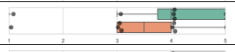</td>
    </tr>
    <tr>
      <th id="pdf-table-1172:0-9fc35587-table-16-2-4-1-9fc6bbd5" scope="row" headers="pdf-table-1172:0-9fc35587-table-16-2-0-1-c892b7ae pdf-table-1172:0-9fc35587-table-16-2-1-0-e8ae5b70">Video</th>
      <td headers="pdf-table-1172:0-9fc35587-table-16-2-0-2-95b452e1 pdf-table-1172:0-9fc35587-table-16-2-1-0-e8ae5b70 pdf-table-1172:0-9fc35587-table-16-2-4-1-9fc6bbd5">8</td>
      <td headers="pdf-table-1172:0-9fc35587-table-16-2-0-3-431f0d4d pdf-table-1172:0-9fc35587-table-16-2-1-0-e8ae5b70 pdf-table-1172:0-9fc35587-table-16-2-4-1-9fc6bbd5">3.38</td>
      <td headers="pdf-table-1172:0-9fc35587-table-16-2-0-4-d3c58af4 pdf-table-1172:0-9fc35587-table-16-2-1-0-e8ae5b70 pdf-table-1172:0-9fc35587-table-16-2-4-1-9fc6bbd5">1.19</td>
    </tr>
    <tr>
      <th id="pdf-table-1172:0-9fc35587-table-16-2-5-0-d765026d" scope="row" rowspan="4" headers="pdf-table-1172:0-9fc35587-table-16-2-0-0-9f465fa8">It is clear to me how the steps evolved.</th>
      <th id="pdf-table-1172:0-9fc35587-table-16-2-5-1-19c854d9" scope="row" headers="pdf-table-1172:0-9fc35587-table-16-2-0-1-c892b7ae pdf-table-1172:0-9fc35587-table-16-2-5-0-d765026d">Colaroid</th>
      <td headers="pdf-table-1172:0-9fc35587-table-16-2-0-2-95b452e1 pdf-table-1172:0-9fc35587-table-16-2-5-0-d765026d pdf-table-1172:0-9fc35587-table-16-2-5-1-19c854d9">8</td>
      <td headers="pdf-table-1172:0-9fc35587-table-16-2-0-3-431f0d4d pdf-table-1172:0-9fc35587-table-16-2-5-0-d765026d pdf-table-1172:0-9fc35587-table-16-2-5-1-19c854d9">4.63</td>
      <td headers="pdf-table-1172:0-9fc35587-table-16-2-0-4-d3c58af4 pdf-table-1172:0-9fc35587-table-16-2-5-0-d765026d pdf-table-1172:0-9fc35587-table-16-2-5-1-19c854d9">0.52</td>
      <td rowspan="2" headers="pdf-table-1172:0-9fc35587-table-16-2-0-5-a787b19b pdf-table-1172:0-9fc35587-table-16-2-5-0-d765026d pdf-table-1172:0-9fc35587-table-16-2-5-1-19c854d9 pdf-table-1172:0-9fc35587-table-16-2-6-1-b9eb3236">0.001**</td>
      <td rowspan="2" headers="pdf-table-1172:0-9fc35587-table-16-2-0-6-13e90884 pdf-table-1172:0-9fc35587-table-16-2-5-0-d765026d pdf-table-1172:0-9fc35587-table-16-2-5-1-19c854d9 pdf-table-1172:0-9fc35587-table-16-2-6-1-b9eb3236"></td>
    </tr>
    <tr>
      <th id="pdf-table-1172:0-9fc35587-table-16-2-6-1-b9eb3236" scope="row" headers="pdf-table-1172:0-9fc35587-table-16-2-0-1-c892b7ae pdf-table-1172:0-9fc35587-table-16-2-5-0-d765026d">Article</th>
      <td headers="pdf-table-1172:0-9fc35587-table-16-2-0-2-95b452e1 pdf-table-1172:0-9fc35587-table-16-2-5-0-d765026d pdf-table-1172:0-9fc35587-table-16-2-6-1-b9eb3236">8</td>
      <td headers="pdf-table-1172:0-9fc35587-table-16-2-0-3-431f0d4d pdf-table-1172:0-9fc35587-table-16-2-5-0-d765026d pdf-table-1172:0-9fc35587-table-16-2-6-1-b9eb3236">3.63</td>
      <td headers="pdf-table-1172:0-9fc35587-table-16-2-0-4-d3c58af4 pdf-table-1172:0-9fc35587-table-16-2-5-0-d765026d pdf-table-1172:0-9fc35587-table-16-2-6-1-b9eb3236">0.52</td>
    </tr>
    <tr>
      <th id="pdf-table-1172:0-9fc35587-table-16-2-7-1-34f7f939" scope="row" headers="pdf-table-1172:0-9fc35587-table-16-2-0-1-c892b7ae pdf-table-1172:0-9fc35587-table-16-2-5-0-d765026d">Colaroid</th>
      <td headers="pdf-table-1172:0-9fc35587-table-16-2-0-2-95b452e1 pdf-table-1172:0-9fc35587-table-16-2-5-0-d765026d pdf-table-1172:0-9fc35587-table-16-2-7-1-34f7f939">8</td>
      <td headers="pdf-table-1172:0-9fc35587-table-16-2-0-3-431f0d4d pdf-table-1172:0-9fc35587-table-16-2-5-0-d765026d pdf-table-1172:0-9fc35587-table-16-2-7-1-34f7f939">4.38</td>
      <td headers="pdf-table-1172:0-9fc35587-table-16-2-0-4-d3c58af4 pdf-table-1172:0-9fc35587-table-16-2-5-0-d765026d pdf-table-1172:0-9fc35587-table-16-2-7-1-34f7f939">0.92</td>
      <td rowspan="2" headers="pdf-table-1172:0-9fc35587-table-16-2-0-5-a787b19b pdf-table-1172:0-9fc35587-table-16-2-5-0-d765026d pdf-table-1172:0-9fc35587-table-16-2-7-1-34f7f939 pdf-table-1172:0-9fc35587-table-16-2-8-1-089ba83b">0.19</td>
      <td rowspan="2" headers="pdf-table-1172:0-9fc35587-table-16-2-0-6-13e90884 pdf-table-1172:0-9fc35587-table-16-2-5-0-d765026d pdf-table-1172:0-9fc35587-table-16-2-7-1-34f7f939 pdf-table-1172:0-9fc35587-table-16-2-8-1-089ba83b">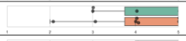</td>
    </tr>
    <tr>
      <th id="pdf-table-1172:0-9fc35587-table-16-2-8-1-089ba83b" scope="row" headers="pdf-table-1172:0-9fc35587-table-16-2-0-1-c892b7ae pdf-table-1172:0-9fc35587-table-16-2-5-0-d765026d">Video</th>
      <td headers="pdf-table-1172:0-9fc35587-table-16-2-0-2-95b452e1 pdf-table-1172:0-9fc35587-table-16-2-5-0-d765026d pdf-table-1172:0-9fc35587-table-16-2-8-1-089ba83b">8</td>
      <td headers="pdf-table-1172:0-9fc35587-table-16-2-0-3-431f0d4d pdf-table-1172:0-9fc35587-table-16-2-5-0-d765026d pdf-table-1172:0-9fc35587-table-16-2-8-1-089ba83b">4.00</td>
      <td headers="pdf-table-1172:0-9fc35587-table-16-2-0-4-d3c58af4 pdf-table-1172:0-9fc35587-table-16-2-5-0-d765026d pdf-table-1172:0-9fc35587-table-16-2-8-1-089ba83b">1.07</td>
    </tr>
    <tr>
      <th id="pdf-table-1172:0-9fc35587-table-16-2-9-0-953eacd4" scope="row" rowspan="4" headers="pdf-table-1172:0-9fc35587-table-16-2-0-0-9f465fa8">It is easy to understand how the step changes affect the output in the tutorial.</th>
      <th id="pdf-table-1172:0-9fc35587-table-16-2-9-1-f24e59c3" scope="row" headers="pdf-table-1172:0-9fc35587-table-16-2-0-1-c892b7ae pdf-table-1172:0-9fc35587-table-16-2-9-0-953eacd4">Colaroid</th>
      <td headers="pdf-table-1172:0-9fc35587-table-16-2-0-2-95b452e1 pdf-table-1172:0-9fc35587-table-16-2-9-0-953eacd4 pdf-table-1172:0-9fc35587-table-16-2-9-1-f24e59c3">8</td>
      <td headers="pdf-table-1172:0-9fc35587-table-16-2-0-3-431f0d4d pdf-table-1172:0-9fc35587-table-16-2-9-0-953eacd4 pdf-table-1172:0-9fc35587-table-16-2-9-1-f24e59c3">4.38</td>
      <td headers="pdf-table-1172:0-9fc35587-table-16-2-0-4-d3c58af4 pdf-table-1172:0-9fc35587-table-16-2-9-0-953eacd4 pdf-table-1172:0-9fc35587-table-16-2-9-1-f24e59c3">0.74</td>
      <td rowspan="2" headers="pdf-table-1172:0-9fc35587-table-16-2-0-5-a787b19b pdf-table-1172:0-9fc35587-table-16-2-9-0-953eacd4 pdf-table-1172:0-9fc35587-table-16-2-9-1-f24e59c3 pdf-table-1172:0-9fc35587-table-16-2-10-1-f6071890">0.07</td>
      <td rowspan="2" headers="pdf-table-1172:0-9fc35587-table-16-2-0-6-13e90884 pdf-table-1172:0-9fc35587-table-16-2-9-0-953eacd4 pdf-table-1172:0-9fc35587-table-16-2-9-1-f24e59c3 pdf-table-1172:0-9fc35587-table-16-2-10-1-f6071890"></td>
    </tr>
    <tr>
      <th id="pdf-table-1172:0-9fc35587-table-16-2-10-1-f6071890" scope="row" headers="pdf-table-1172:0-9fc35587-table-16-2-0-1-c892b7ae pdf-table-1172:0-9fc35587-table-16-2-9-0-953eacd4">Article</th>
      <td headers="pdf-table-1172:0-9fc35587-table-16-2-0-2-95b452e1 pdf-table-1172:0-9fc35587-table-16-2-9-0-953eacd4 pdf-table-1172:0-9fc35587-table-16-2-10-1-f6071890">8</td>
      <td headers="pdf-table-1172:0-9fc35587-table-16-2-0-3-431f0d4d pdf-table-1172:0-9fc35587-table-16-2-9-0-953eacd4 pdf-table-1172:0-9fc35587-table-16-2-10-1-f6071890">3.63</td>
      <td headers="pdf-table-1172:0-9fc35587-table-16-2-0-4-d3c58af4 pdf-table-1172:0-9fc35587-table-16-2-9-0-953eacd4 pdf-table-1172:0-9fc35587-table-16-2-10-1-f6071890">0.92</td>
    </tr>
    <tr>
      <th id="pdf-table-1172:0-9fc35587-table-16-2-11-1-86932800" scope="row" headers="pdf-table-1172:0-9fc35587-table-16-2-0-1-c892b7ae pdf-table-1172:0-9fc35587-table-16-2-9-0-953eacd4">Colaroid</th>
      <td headers="pdf-table-1172:0-9fc35587-table-16-2-0-2-95b452e1 pdf-table-1172:0-9fc35587-table-16-2-9-0-953eacd4 pdf-table-1172:0-9fc35587-table-16-2-11-1-86932800">8</td>
      <td headers="pdf-table-1172:0-9fc35587-table-16-2-0-3-431f0d4d pdf-table-1172:0-9fc35587-table-16-2-9-0-953eacd4 pdf-table-1172:0-9fc35587-table-16-2-11-1-86932800">4.25</td>
      <td headers="pdf-table-1172:0-9fc35587-table-16-2-0-4-d3c58af4 pdf-table-1172:0-9fc35587-table-16-2-9-0-953eacd4 pdf-table-1172:0-9fc35587-table-16-2-11-1-86932800">1.04</td>
      <td rowspan="2" headers="pdf-table-1172:0-9fc35587-table-16-2-0-5-a787b19b pdf-table-1172:0-9fc35587-table-16-2-9-0-953eacd4 pdf-table-1172:0-9fc35587-table-16-2-11-1-86932800 pdf-table-1172:0-9fc35587-table-16-2-12-1-4ee2b2a6">0.11</td>
      <td rowspan="2" headers="pdf-table-1172:0-9fc35587-table-16-2-0-6-13e90884 pdf-table-1172:0-9fc35587-table-16-2-9-0-953eacd4 pdf-table-1172:0-9fc35587-table-16-2-11-1-86932800 pdf-table-1172:0-9fc35587-table-16-2-12-1-4ee2b2a6">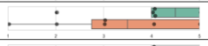</td>
    </tr>
    <tr>
      <th id="pdf-table-1172:0-9fc35587-table-16-2-12-1-4ee2b2a6" scope="row" headers="pdf-table-1172:0-9fc35587-table-16-2-0-1-c892b7ae pdf-table-1172:0-9fc35587-table-16-2-9-0-953eacd4">Video</th>
      <td headers="pdf-table-1172:0-9fc35587-table-16-2-0-2-95b452e1 pdf-table-1172:0-9fc35587-table-16-2-9-0-953eacd4 pdf-table-1172:0-9fc35587-table-16-2-12-1-4ee2b2a6">8</td>
      <td headers="pdf-table-1172:0-9fc35587-table-16-2-0-3-431f0d4d pdf-table-1172:0-9fc35587-table-16-2-9-0-953eacd4 pdf-table-1172:0-9fc35587-table-16-2-12-1-4ee2b2a6">3.50</td>
      <td headers="pdf-table-1172:0-9fc35587-table-16-2-0-4-d3c58af4 pdf-table-1172:0-9fc35587-table-16-2-9-0-953eacd4 pdf-table-1172:0-9fc35587-table-16-2-12-1-4ee2b2a6">1.51</td>
    </tr>
    <tr>
      <th id="pdf-table-1172:0-9fc35587-table-16-2-13-0-8cc09486" scope="row" rowspan="4" headers="pdf-table-1172:0-9fc35587-table-16-2-0-0-9f465fa8">This tutorial helps me with making progress on my dinosaur project.</th>
      <th id="pdf-table-1172:0-9fc35587-table-16-2-13-1-87b6747d" scope="row" headers="pdf-table-1172:0-9fc35587-table-16-2-0-1-c892b7ae pdf-table-1172:0-9fc35587-table-16-2-13-0-8cc09486">Colaroid</th>
      <td headers="pdf-table-1172:0-9fc35587-table-16-2-0-2-95b452e1 pdf-table-1172:0-9fc35587-table-16-2-13-0-8cc09486 pdf-table-1172:0-9fc35587-table-16-2-13-1-87b6747d">8</td>
      <td headers="pdf-table-1172:0-9fc35587-table-16-2-0-3-431f0d4d pdf-table-1172:0-9fc35587-table-16-2-13-0-8cc09486 pdf-table-1172:0-9fc35587-table-16-2-13-1-87b6747d">4.50</td>
      <td headers="pdf-table-1172:0-9fc35587-table-16-2-0-4-d3c58af4 pdf-table-1172:0-9fc35587-table-16-2-13-0-8cc09486 pdf-table-1172:0-9fc35587-table-16-2-13-1-87b6747d">0.53</td>
      <td rowspan="2" headers="pdf-table-1172:0-9fc35587-table-16-2-0-5-a787b19b pdf-table-1172:0-9fc35587-table-16-2-13-0-8cc09486 pdf-table-1172:0-9fc35587-table-16-2-13-1-87b6747d pdf-table-1172:0-9fc35587-table-16-2-14-1-ec5b016c">0.10</td>
      <td rowspan="2" headers="pdf-table-1172:0-9fc35587-table-16-2-0-6-13e90884 pdf-table-1172:0-9fc35587-table-16-2-13-0-8cc09486 pdf-table-1172:0-9fc35587-table-16-2-13-1-87b6747d pdf-table-1172:0-9fc35587-table-16-2-14-1-ec5b016c">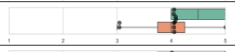</td>
    </tr>
    <tr>
      <th id="pdf-table-1172:0-9fc35587-table-16-2-14-1-ec5b016c" scope="row" headers="pdf-table-1172:0-9fc35587-table-16-2-0-1-c892b7ae pdf-table-1172:0-9fc35587-table-16-2-13-0-8cc09486">Article</th>
      <td headers="pdf-table-1172:0-9fc35587-table-16-2-0-2-95b452e1 pdf-table-1172:0-9fc35587-table-16-2-13-0-8cc09486 pdf-table-1172:0-9fc35587-table-16-2-14-1-ec5b016c">8</td>
      <td headers="pdf-table-1172:0-9fc35587-table-16-2-0-3-431f0d4d pdf-table-1172:0-9fc35587-table-16-2-13-0-8cc09486 pdf-table-1172:0-9fc35587-table-16-2-14-1-ec5b016c">4.00</td>
      <td headers="pdf-table-1172:0-9fc35587-table-16-2-0-4-d3c58af4 pdf-table-1172:0-9fc35587-table-16-2-13-0-8cc09486 pdf-table-1172:0-9fc35587-table-16-2-14-1-ec5b016c">0.76</td>
    </tr>
    <tr>
      <th id="pdf-table-1172:0-9fc35587-table-16-2-15-1-0293937a" scope="row" headers="pdf-table-1172:0-9fc35587-table-16-2-0-1-c892b7ae pdf-table-1172:0-9fc35587-table-16-2-13-0-8cc09486">Colaroid</th>
      <td headers="pdf-table-1172:0-9fc35587-table-16-2-0-2-95b452e1 pdf-table-1172:0-9fc35587-table-16-2-13-0-8cc09486 pdf-table-1172:0-9fc35587-table-16-2-15-1-0293937a">8</td>
      <td headers="pdf-table-1172:0-9fc35587-table-16-2-0-3-431f0d4d pdf-table-1172:0-9fc35587-table-16-2-13-0-8cc09486 pdf-table-1172:0-9fc35587-table-16-2-15-1-0293937a">4.13</td>
      <td headers="pdf-table-1172:0-9fc35587-table-16-2-0-4-d3c58af4 pdf-table-1172:0-9fc35587-table-16-2-13-0-8cc09486 pdf-table-1172:0-9fc35587-table-16-2-15-1-0293937a">1.13</td>
      <td rowspan="2" headers="pdf-table-1172:0-9fc35587-table-16-2-0-5-a787b19b pdf-table-1172:0-9fc35587-table-16-2-13-0-8cc09486 pdf-table-1172:0-9fc35587-table-16-2-15-1-0293937a pdf-table-1172:0-9fc35587-table-16-2-16-1-2e061170">0.49</td>
      <td rowspan="2" headers="pdf-table-1172:0-9fc35587-table-16-2-0-6-13e90884 pdf-table-1172:0-9fc35587-table-16-2-13-0-8cc09486 pdf-table-1172:0-9fc35587-table-16-2-15-1-0293937a pdf-table-1172:0-9fc35587-table-16-2-16-1-2e061170">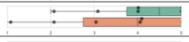</td>
    </tr>
    <tr>
      <th id="pdf-table-1172:0-9fc35587-table-16-2-16-1-2e061170" scope="row" headers="pdf-table-1172:0-9fc35587-table-16-2-0-1-c892b7ae pdf-table-1172:0-9fc35587-table-16-2-13-0-8cc09486">Video</th>
      <td headers="pdf-table-1172:0-9fc35587-table-16-2-0-2-95b452e1 pdf-table-1172:0-9fc35587-table-16-2-13-0-8cc09486 pdf-table-1172:0-9fc35587-table-16-2-16-1-2e061170">8</td>
      <td headers="pdf-table-1172:0-9fc35587-table-16-2-0-3-431f0d4d pdf-table-1172:0-9fc35587-table-16-2-13-0-8cc09486 pdf-table-1172:0-9fc35587-table-16-2-16-1-2e061170">3.63</td>
      <td headers="pdf-table-1172:0-9fc35587-table-16-2-0-4-d3c58af4 pdf-table-1172:0-9fc35587-table-16-2-13-0-8cc09486 pdf-table-1172:0-9fc35587-table-16-2-16-1-2e061170">1.50</td>
    </tr>
    <tr>
      <th id="pdf-table-1172:0-9fc35587-table-16-2-17-0-8ec8ffe0" scope="row" rowspan="4" headers="pdf-table-1172:0-9fc35587-table-16-2-0-0-9f465fa8">After reading the tutorial, I am confident that I can replicate the Flappy Bird project from scratch by myself.</th>
      <th id="pdf-table-1172:0-9fc35587-table-16-2-17-1-f4ed3fe8" scope="row" headers="pdf-table-1172:0-9fc35587-table-16-2-0-1-c892b7ae pdf-table-1172:0-9fc35587-table-16-2-17-0-8ec8ffe0">Colaroid</th>
      <td headers="pdf-table-1172:0-9fc35587-table-16-2-0-2-95b452e1 pdf-table-1172:0-9fc35587-table-16-2-17-0-8ec8ffe0 pdf-table-1172:0-9fc35587-table-16-2-17-1-f4ed3fe8">8</td>
      <td headers="pdf-table-1172:0-9fc35587-table-16-2-0-3-431f0d4d pdf-table-1172:0-9fc35587-table-16-2-17-0-8ec8ffe0 pdf-table-1172:0-9fc35587-table-16-2-17-1-f4ed3fe8">4.25</td>
      <td headers="pdf-table-1172:0-9fc35587-table-16-2-0-4-d3c58af4 pdf-table-1172:0-9fc35587-table-16-2-17-0-8ec8ffe0 pdf-table-1172:0-9fc35587-table-16-2-17-1-f4ed3fe8">0.70</td>
      <td rowspan="2" headers="pdf-table-1172:0-9fc35587-table-16-2-0-5-a787b19b pdf-table-1172:0-9fc35587-table-16-2-17-0-8ec8ffe0 pdf-table-1172:0-9fc35587-table-16-2-17-1-f4ed3fe8 pdf-table-1172:0-9fc35587-table-16-2-18-1-e577d025">0.001**</td>
      <td rowspan="2" headers="pdf-table-1172:0-9fc35587-table-16-2-0-6-13e90884 pdf-table-1172:0-9fc35587-table-16-2-17-0-8ec8ffe0 pdf-table-1172:0-9fc35587-table-16-2-17-1-f4ed3fe8 pdf-table-1172:0-9fc35587-table-16-2-18-1-e577d025"></td>
    </tr>
    <tr>
      <th id="pdf-table-1172:0-9fc35587-table-16-2-18-1-e577d025" scope="row" headers="pdf-table-1172:0-9fc35587-table-16-2-0-1-c892b7ae pdf-table-1172:0-9fc35587-table-16-2-17-0-8ec8ffe0">Article</th>
      <td headers="pdf-table-1172:0-9fc35587-table-16-2-0-2-95b452e1 pdf-table-1172:0-9fc35587-table-16-2-17-0-8ec8ffe0 pdf-table-1172:0-9fc35587-table-16-2-18-1-e577d025">8</td>
      <td headers="pdf-table-1172:0-9fc35587-table-16-2-0-3-431f0d4d pdf-table-1172:0-9fc35587-table-16-2-17-0-8ec8ffe0 pdf-table-1172:0-9fc35587-table-16-2-18-1-e577d025">2.88</td>
      <td headers="pdf-table-1172:0-9fc35587-table-16-2-0-4-d3c58af4 pdf-table-1172:0-9fc35587-table-16-2-17-0-8ec8ffe0 pdf-table-1172:0-9fc35587-table-16-2-18-1-e577d025">1.25</td>
    </tr>
    <tr>
      <th id="pdf-table-1172:0-9fc35587-table-16-2-19-1-6c88f562" scope="row" headers="pdf-table-1172:0-9fc35587-table-16-2-0-1-c892b7ae pdf-table-1172:0-9fc35587-table-16-2-17-0-8ec8ffe0">Colaroid</th>
      <td headers="pdf-table-1172:0-9fc35587-table-16-2-0-2-95b452e1 pdf-table-1172:0-9fc35587-table-16-2-17-0-8ec8ffe0 pdf-table-1172:0-9fc35587-table-16-2-19-1-6c88f562">8</td>
      <td headers="pdf-table-1172:0-9fc35587-table-16-2-0-3-431f0d4d pdf-table-1172:0-9fc35587-table-16-2-17-0-8ec8ffe0 pdf-table-1172:0-9fc35587-table-16-2-19-1-6c88f562">3.50</td>
      <td headers="pdf-table-1172:0-9fc35587-table-16-2-0-4-d3c58af4 pdf-table-1172:0-9fc35587-table-16-2-17-0-8ec8ffe0 pdf-table-1172:0-9fc35587-table-16-2-19-1-6c88f562">1.69</td>
      <td rowspan="2" headers="pdf-table-1172:0-9fc35587-table-16-2-0-5-a787b19b pdf-table-1172:0-9fc35587-table-16-2-17-0-8ec8ffe0 pdf-table-1172:0-9fc35587-table-16-2-19-1-6c88f562 pdf-table-1172:0-9fc35587-table-16-2-20-1-387252cd">1.0</td>
      <td rowspan="2" headers="pdf-table-1172:0-9fc35587-table-16-2-0-6-13e90884 pdf-table-1172:0-9fc35587-table-16-2-17-0-8ec8ffe0 pdf-table-1172:0-9fc35587-table-16-2-19-1-6c88f562 pdf-table-1172:0-9fc35587-table-16-2-20-1-387252cd">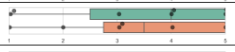</td>
    </tr>
    <tr>
      <th id="pdf-table-1172:0-9fc35587-table-16-2-20-1-387252cd" scope="row" headers="pdf-table-1172:0-9fc35587-table-16-2-0-1-c892b7ae pdf-table-1172:0-9fc35587-table-16-2-17-0-8ec8ffe0">Video</th>
      <td headers="pdf-table-1172:0-9fc35587-table-16-2-0-2-95b452e1 pdf-table-1172:0-9fc35587-table-16-2-17-0-8ec8ffe0 pdf-table-1172:0-9fc35587-table-16-2-20-1-387252cd">8</td>
      <td headers="pdf-table-1172:0-9fc35587-table-16-2-0-3-431f0d4d pdf-table-1172:0-9fc35587-table-16-2-17-0-8ec8ffe0 pdf-table-1172:0-9fc35587-table-16-2-20-1-387252cd">3.50</td>
      <td headers="pdf-table-1172:0-9fc35587-table-16-2-0-4-d3c58af4 pdf-table-1172:0-9fc35587-table-16-2-17-0-8ec8ffe0 pdf-table-1172:0-9fc35587-table-16-2-20-1-387252cd">1.51</td>
    </tr>
    <tr>
      <th id="pdf-table-1172:0-9fc35587-table-16-2-21-0-02a3ed02" scope="row" rowspan="4" headers="pdf-table-1172:0-9fc35587-table-16-2-0-0-9f465fa8">After reading the tutorial, I am confident that I can build similar HTML5 games from scratch by myself.</th>
      <th id="pdf-table-1172:0-9fc35587-table-16-2-21-1-6605541d" scope="row" headers="pdf-table-1172:0-9fc35587-table-16-2-0-1-c892b7ae pdf-table-1172:0-9fc35587-table-16-2-21-0-02a3ed02">Colaroid</th>
      <td headers="pdf-table-1172:0-9fc35587-table-16-2-0-2-95b452e1 pdf-table-1172:0-9fc35587-table-16-2-21-0-02a3ed02 pdf-table-1172:0-9fc35587-table-16-2-21-1-6605541d">8</td>
      <td headers="pdf-table-1172:0-9fc35587-table-16-2-0-3-431f0d4d pdf-table-1172:0-9fc35587-table-16-2-21-0-02a3ed02 pdf-table-1172:0-9fc35587-table-16-2-21-1-6605541d">3.50</td>
      <td headers="pdf-table-1172:0-9fc35587-table-16-2-0-4-d3c58af4 pdf-table-1172:0-9fc35587-table-16-2-21-0-02a3ed02 pdf-table-1172:0-9fc35587-table-16-2-21-1-6605541d">1.20</td>
      <td rowspan="2" headers="pdf-table-1172:0-9fc35587-table-16-2-0-5-a787b19b pdf-table-1172:0-9fc35587-table-16-2-21-0-02a3ed02 pdf-table-1172:0-9fc35587-table-16-2-21-1-6605541d pdf-table-1172:0-9fc35587-table-16-2-22-1-ff6615fe">0.04*</td>
      <td rowspan="2" headers="pdf-table-1172:0-9fc35587-table-16-2-0-6-13e90884 pdf-table-1172:0-9fc35587-table-16-2-21-0-02a3ed02 pdf-table-1172:0-9fc35587-table-16-2-21-1-6605541d pdf-table-1172:0-9fc35587-table-16-2-22-1-ff6615fe"></td>
    </tr>
    <tr>
      <th id="pdf-table-1172:0-9fc35587-table-16-2-22-1-ff6615fe" scope="row" headers="pdf-table-1172:0-9fc35587-table-16-2-0-1-c892b7ae pdf-table-1172:0-9fc35587-table-16-2-21-0-02a3ed02">Article</th>
      <td headers="pdf-table-1172:0-9fc35587-table-16-2-0-2-95b452e1 pdf-table-1172:0-9fc35587-table-16-2-21-0-02a3ed02 pdf-table-1172:0-9fc35587-table-16-2-22-1-ff6615fe">8</td>
      <td headers="pdf-table-1172:0-9fc35587-table-16-2-0-3-431f0d4d pdf-table-1172:0-9fc35587-table-16-2-21-0-02a3ed02 pdf-table-1172:0-9fc35587-table-16-2-22-1-ff6615fe">2.75</td>
      <td headers="pdf-table-1172:0-9fc35587-table-16-2-0-4-d3c58af4 pdf-table-1172:0-9fc35587-table-16-2-21-0-02a3ed02 pdf-table-1172:0-9fc35587-table-16-2-22-1-ff6615fe">0.89</td>
    </tr>
    <tr>
      <th id="pdf-table-1172:0-9fc35587-table-16-2-23-1-dda648e5" scope="row" headers="pdf-table-1172:0-9fc35587-table-16-2-0-1-c892b7ae pdf-table-1172:0-9fc35587-table-16-2-21-0-02a3ed02">Colaroid</th>
      <td headers="pdf-table-1172:0-9fc35587-table-16-2-0-2-95b452e1 pdf-table-1172:0-9fc35587-table-16-2-21-0-02a3ed02 pdf-table-1172:0-9fc35587-table-16-2-23-1-dda648e5">8</td>
      <td headers="pdf-table-1172:0-9fc35587-table-16-2-0-3-431f0d4d pdf-table-1172:0-9fc35587-table-16-2-21-0-02a3ed02 pdf-table-1172:0-9fc35587-table-16-2-23-1-dda648e5">3.00</td>
      <td headers="pdf-table-1172:0-9fc35587-table-16-2-0-4-d3c58af4 pdf-table-1172:0-9fc35587-table-16-2-21-0-02a3ed02 pdf-table-1172:0-9fc35587-table-16-2-23-1-dda648e5">1.69</td>
      <td rowspan="2" headers="pdf-table-1172:0-9fc35587-table-16-2-0-5-a787b19b pdf-table-1172:0-9fc35587-table-16-2-21-0-02a3ed02 pdf-table-1172:0-9fc35587-table-16-2-23-1-dda648e5 pdf-table-1172:0-9fc35587-table-16-2-24-1-730295df">1.0</td>
      <td rowspan="2" headers="pdf-table-1172:0-9fc35587-table-16-2-0-6-13e90884 pdf-table-1172:0-9fc35587-table-16-2-21-0-02a3ed02 pdf-table-1172:0-9fc35587-table-16-2-23-1-dda648e5 pdf-table-1172:0-9fc35587-table-16-2-24-1-730295df">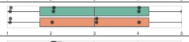</td>
    </tr>
    <tr>
      <th id="pdf-table-1172:0-9fc35587-table-16-2-24-1-730295df" scope="row" headers="pdf-table-1172:0-9fc35587-table-16-2-0-1-c892b7ae pdf-table-1172:0-9fc35587-table-16-2-21-0-02a3ed02">Video</th>
      <td headers="pdf-table-1172:0-9fc35587-table-16-2-0-2-95b452e1 pdf-table-1172:0-9fc35587-table-16-2-21-0-02a3ed02 pdf-table-1172:0-9fc35587-table-16-2-24-1-730295df">8</td>
      <td headers="pdf-table-1172:0-9fc35587-table-16-2-0-3-431f0d4d pdf-table-1172:0-9fc35587-table-16-2-21-0-02a3ed02 pdf-table-1172:0-9fc35587-table-16-2-24-1-730295df">3.00</td>
      <td headers="pdf-table-1172:0-9fc35587-table-16-2-0-4-d3c58af4 pdf-table-1172:0-9fc35587-table-16-2-21-0-02a3ed02 pdf-table-1172:0-9fc35587-table-16-2-24-1-730295df">1.60</td>
    </tr>
    <tr>
      <th id="pdf-table-1172:0-9fc35587-table-16-2-25-0-342b019f" scope="row" rowspan="4" headers="pdf-table-1172:0-9fc35587-table-16-2-0-0-9f465fa8">The tutorial takes too much time to read.</th>
      <th id="pdf-table-1172:0-9fc35587-table-16-2-25-1-51bf6842" scope="row" headers="pdf-table-1172:0-9fc35587-table-16-2-0-1-c892b7ae pdf-table-1172:0-9fc35587-table-16-2-25-0-342b019f">Colaroid</th>
      <td headers="pdf-table-1172:0-9fc35587-table-16-2-0-2-95b452e1 pdf-table-1172:0-9fc35587-table-16-2-25-0-342b019f pdf-table-1172:0-9fc35587-table-16-2-25-1-51bf6842">8</td>
      <td headers="pdf-table-1172:0-9fc35587-table-16-2-0-3-431f0d4d pdf-table-1172:0-9fc35587-table-16-2-25-0-342b019f pdf-table-1172:0-9fc35587-table-16-2-25-1-51bf6842">2.25</td>
      <td headers="pdf-table-1172:0-9fc35587-table-16-2-0-4-d3c58af4 pdf-table-1172:0-9fc35587-table-16-2-25-0-342b019f pdf-table-1172:0-9fc35587-table-16-2-25-1-51bf6842">0.89</td>
      <td rowspan="2" headers="pdf-table-1172:0-9fc35587-table-16-2-0-5-a787b19b pdf-table-1172:0-9fc35587-table-16-2-25-0-342b019f pdf-table-1172:0-9fc35587-table-16-2-25-1-51bf6842 pdf-table-1172:0-9fc35587-table-16-2-26-1-c623441b">0.06</td>
      <td rowspan="2" headers="pdf-table-1172:0-9fc35587-table-16-2-0-6-13e90884 pdf-table-1172:0-9fc35587-table-16-2-25-0-342b019f pdf-table-1172:0-9fc35587-table-16-2-25-1-51bf6842 pdf-table-1172:0-9fc35587-table-16-2-26-1-c623441b"></td>
    </tr>
    <tr>
      <th id="pdf-table-1172:0-9fc35587-table-16-2-26-1-c623441b" scope="row" headers="pdf-table-1172:0-9fc35587-table-16-2-0-1-c892b7ae pdf-table-1172:0-9fc35587-table-16-2-25-0-342b019f">Article</th>
      <td headers="pdf-table-1172:0-9fc35587-table-16-2-0-2-95b452e1 pdf-table-1172:0-9fc35587-table-16-2-25-0-342b019f pdf-table-1172:0-9fc35587-table-16-2-26-1-c623441b">8</td>
      <td headers="pdf-table-1172:0-9fc35587-table-16-2-0-3-431f0d4d pdf-table-1172:0-9fc35587-table-16-2-25-0-342b019f pdf-table-1172:0-9fc35587-table-16-2-26-1-c623441b">3.25</td>
      <td headers="pdf-table-1172:0-9fc35587-table-16-2-0-4-d3c58af4 pdf-table-1172:0-9fc35587-table-16-2-25-0-342b019f pdf-table-1172:0-9fc35587-table-16-2-26-1-c623441b">0.89</td>
    </tr>
    <tr>
      <th id="pdf-table-1172:0-9fc35587-table-16-2-27-1-817e8c28" scope="row" headers="pdf-table-1172:0-9fc35587-table-16-2-0-1-c892b7ae pdf-table-1172:0-9fc35587-table-16-2-25-0-342b019f">Colaroid</th>
      <td headers="pdf-table-1172:0-9fc35587-table-16-2-0-2-95b452e1 pdf-table-1172:0-9fc35587-table-16-2-25-0-342b019f pdf-table-1172:0-9fc35587-table-16-2-27-1-817e8c28">8</td>
      <td headers="pdf-table-1172:0-9fc35587-table-16-2-0-3-431f0d4d pdf-table-1172:0-9fc35587-table-16-2-25-0-342b019f pdf-table-1172:0-9fc35587-table-16-2-27-1-817e8c28">2.38</td>
      <td headers="pdf-table-1172:0-9fc35587-table-16-2-0-4-d3c58af4 pdf-table-1172:0-9fc35587-table-16-2-25-0-342b019f pdf-table-1172:0-9fc35587-table-16-2-27-1-817e8c28">1.41</td>
      <td rowspan="2" headers="pdf-table-1172:0-9fc35587-table-16-2-0-5-a787b19b pdf-table-1172:0-9fc35587-table-16-2-25-0-342b019f pdf-table-1172:0-9fc35587-table-16-2-27-1-817e8c28 pdf-table-1172:0-9fc35587-table-16-2-28-1-c65fb87a">0.04*</td>
      <td rowspan="2" headers="pdf-table-1172:0-9fc35587-table-16-2-0-6-13e90884 pdf-table-1172:0-9fc35587-table-16-2-25-0-342b019f pdf-table-1172:0-9fc35587-table-16-2-27-1-817e8c28 pdf-table-1172:0-9fc35587-table-16-2-28-1-c65fb87a">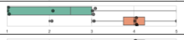</td>
    </tr>
    <tr>
      <th id="pdf-table-1172:0-9fc35587-table-16-2-28-1-c65fb87a" scope="row" headers="pdf-table-1172:0-9fc35587-table-16-2-0-1-c892b7ae pdf-table-1172:0-9fc35587-table-16-2-25-0-342b019f">Video</th>
      <td headers="pdf-table-1172:0-9fc35587-table-16-2-0-2-95b452e1 pdf-table-1172:0-9fc35587-table-16-2-25-0-342b019f pdf-table-1172:0-9fc35587-table-16-2-28-1-c65fb87a">8</td>
      <td headers="pdf-table-1172:0-9fc35587-table-16-2-0-3-431f0d4d pdf-table-1172:0-9fc35587-table-16-2-25-0-342b019f pdf-table-1172:0-9fc35587-table-16-2-28-1-c65fb87a">3.88</td>
      <td headers="pdf-table-1172:0-9fc35587-table-16-2-0-4-d3c58af4 pdf-table-1172:0-9fc35587-table-16-2-25-0-342b019f pdf-table-1172:0-9fc35587-table-16-2-28-1-c65fb87a">0.99</td>
    </tr>
    <tr>
      <th id="pdf-table-1172:0-9fc35587-table-16-2-29-0-e8713b5f" scope="row" rowspan="4" headers="pdf-table-1172:0-9fc35587-table-16-2-0-0-9f465fa8">I feel engaged when reading the tutorial.</th>
      <th id="pdf-table-1172:0-9fc35587-table-16-2-29-1-443d701f" scope="row" headers="pdf-table-1172:0-9fc35587-table-16-2-0-1-c892b7ae pdf-table-1172:0-9fc35587-table-16-2-29-0-e8713b5f">Colaroid</th>
      <td headers="pdf-table-1172:0-9fc35587-table-16-2-0-2-95b452e1 pdf-table-1172:0-9fc35587-table-16-2-29-0-e8713b5f pdf-table-1172:0-9fc35587-table-16-2-29-1-443d701f">8</td>
      <td headers="pdf-table-1172:0-9fc35587-table-16-2-0-3-431f0d4d pdf-table-1172:0-9fc35587-table-16-2-29-0-e8713b5f pdf-table-1172:0-9fc35587-table-16-2-29-1-443d701f">4.13</td>
      <td headers="pdf-table-1172:0-9fc35587-table-16-2-0-4-d3c58af4 pdf-table-1172:0-9fc35587-table-16-2-29-0-e8713b5f pdf-table-1172:0-9fc35587-table-16-2-29-1-443d701f">0.64</td>
      <td rowspan="2" headers="pdf-table-1172:0-9fc35587-table-16-2-0-5-a787b19b pdf-table-1172:0-9fc35587-table-16-2-29-0-e8713b5f pdf-table-1172:0-9fc35587-table-16-2-29-1-443d701f pdf-table-1172:0-9fc35587-table-16-2-30-1-69e7a5e6">0.04*</td>
      <td rowspan="2" headers="pdf-table-1172:0-9fc35587-table-16-2-0-6-13e90884 pdf-table-1172:0-9fc35587-table-16-2-29-0-e8713b5f pdf-table-1172:0-9fc35587-table-16-2-29-1-443d701f pdf-table-1172:0-9fc35587-table-16-2-30-1-69e7a5e6"></td>
    </tr>
    <tr>
      <th id="pdf-table-1172:0-9fc35587-table-16-2-30-1-69e7a5e6" scope="row" headers="pdf-table-1172:0-9fc35587-table-16-2-0-1-c892b7ae pdf-table-1172:0-9fc35587-table-16-2-29-0-e8713b5f">Article</th>
      <td headers="pdf-table-1172:0-9fc35587-table-16-2-0-2-95b452e1 pdf-table-1172:0-9fc35587-table-16-2-29-0-e8713b5f pdf-table-1172:0-9fc35587-table-16-2-30-1-69e7a5e6">8</td>
      <td headers="pdf-table-1172:0-9fc35587-table-16-2-0-3-431f0d4d pdf-table-1172:0-9fc35587-table-16-2-29-0-e8713b5f pdf-table-1172:0-9fc35587-table-16-2-30-1-69e7a5e6">3.50</td>
      <td headers="pdf-table-1172:0-9fc35587-table-16-2-0-4-d3c58af4 pdf-table-1172:0-9fc35587-table-16-2-29-0-e8713b5f pdf-table-1172:0-9fc35587-table-16-2-30-1-69e7a5e6">0.75</td>
    </tr>
    <tr>
      <th id="pdf-table-1172:0-9fc35587-table-16-2-31-1-6c5a1d71" scope="row" headers="pdf-table-1172:0-9fc35587-table-16-2-0-1-c892b7ae pdf-table-1172:0-9fc35587-table-16-2-29-0-e8713b5f">Colaroid</th>
      <td headers="pdf-table-1172:0-9fc35587-table-16-2-0-2-95b452e1 pdf-table-1172:0-9fc35587-table-16-2-29-0-e8713b5f pdf-table-1172:0-9fc35587-table-16-2-31-1-6c5a1d71">8</td>
      <td headers="pdf-table-1172:0-9fc35587-table-16-2-0-3-431f0d4d pdf-table-1172:0-9fc35587-table-16-2-29-0-e8713b5f pdf-table-1172:0-9fc35587-table-16-2-31-1-6c5a1d71">3.88</td>
      <td headers="pdf-table-1172:0-9fc35587-table-16-2-0-4-d3c58af4 pdf-table-1172:0-9fc35587-table-16-2-29-0-e8713b5f pdf-table-1172:0-9fc35587-table-16-2-31-1-6c5a1d71">1.25</td>
      <td rowspan="2" headers="pdf-table-1172:0-9fc35587-table-16-2-0-5-a787b19b pdf-table-1172:0-9fc35587-table-16-2-29-0-e8713b5f pdf-table-1172:0-9fc35587-table-16-2-31-1-6c5a1d71 pdf-table-1172:0-9fc35587-table-16-2-32-1-464a22c6">0.49</td>
      <td rowspan="2" headers="pdf-table-1172:0-9fc35587-table-16-2-0-6-13e90884 pdf-table-1172:0-9fc35587-table-16-2-29-0-e8713b5f pdf-table-1172:0-9fc35587-table-16-2-31-1-6c5a1d71 pdf-table-1172:0-9fc35587-table-16-2-32-1-464a22c6">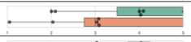</td>
    </tr>
    <tr>
      <th id="pdf-table-1172:0-9fc35587-table-16-2-32-1-464a22c6" scope="row" headers="pdf-table-1172:0-9fc35587-table-16-2-0-1-c892b7ae pdf-table-1172:0-9fc35587-table-16-2-29-0-e8713b5f">Video</th>
      <td headers="pdf-table-1172:0-9fc35587-table-16-2-0-2-95b452e1 pdf-table-1172:0-9fc35587-table-16-2-29-0-e8713b5f pdf-table-1172:0-9fc35587-table-16-2-32-1-464a22c6">8</td>
      <td headers="pdf-table-1172:0-9fc35587-table-16-2-0-3-431f0d4d pdf-table-1172:0-9fc35587-table-16-2-29-0-e8713b5f pdf-table-1172:0-9fc35587-table-16-2-32-1-464a22c6">3.38</td>
      <td headers="pdf-table-1172:0-9fc35587-table-16-2-0-4-d3c58af4 pdf-table-1172:0-9fc35587-table-16-2-29-0-e8713b5f pdf-table-1172:0-9fc35587-table-16-2-32-1-464a22c6">1.50</td>
    </tr>
    <tr>
      <th id="pdf-table-1172:0-9fc35587-table-16-2-33-0-6968e189" scope="row" rowspan="4" headers="pdf-table-1172:0-9fc35587-table-16-2-0-0-9f465fa8">I am satisfied with the progress of the dinosaur game so far.</th>
      <th id="pdf-table-1172:0-9fc35587-table-16-2-33-1-2672fa7c" scope="row" headers="pdf-table-1172:0-9fc35587-table-16-2-0-1-c892b7ae pdf-table-1172:0-9fc35587-table-16-2-33-0-6968e189">Colaroid</th>
      <td headers="pdf-table-1172:0-9fc35587-table-16-2-0-2-95b452e1 pdf-table-1172:0-9fc35587-table-16-2-33-0-6968e189 pdf-table-1172:0-9fc35587-table-16-2-33-1-2672fa7c">8</td>
      <td headers="pdf-table-1172:0-9fc35587-table-16-2-0-3-431f0d4d pdf-table-1172:0-9fc35587-table-16-2-33-0-6968e189 pdf-table-1172:0-9fc35587-table-16-2-33-1-2672fa7c">4.00</td>
      <td headers="pdf-table-1172:0-9fc35587-table-16-2-0-4-d3c58af4 pdf-table-1172:0-9fc35587-table-16-2-33-0-6968e189 pdf-table-1172:0-9fc35587-table-16-2-33-1-2672fa7c">0.76</td>
      <td rowspan="2" headers="pdf-table-1172:0-9fc35587-table-16-2-0-5-a787b19b pdf-table-1172:0-9fc35587-table-16-2-33-0-6968e189 pdf-table-1172:0-9fc35587-table-16-2-33-1-2672fa7c pdf-table-1172:0-9fc35587-table-16-2-34-1-bd520938">0.04*</td>
      <td rowspan="2" headers="pdf-table-1172:0-9fc35587-table-16-2-0-6-13e90884 pdf-table-1172:0-9fc35587-table-16-2-33-0-6968e189 pdf-table-1172:0-9fc35587-table-16-2-33-1-2672fa7c pdf-table-1172:0-9fc35587-table-16-2-34-1-bd520938"></td>
    </tr>
    <tr>
      <th id="pdf-table-1172:0-9fc35587-table-16-2-34-1-bd520938" scope="row" headers="pdf-table-1172:0-9fc35587-table-16-2-0-1-c892b7ae pdf-table-1172:0-9fc35587-table-16-2-33-0-6968e189">Article</th>
      <td headers="pdf-table-1172:0-9fc35587-table-16-2-0-2-95b452e1 pdf-table-1172:0-9fc35587-table-16-2-33-0-6968e189 pdf-table-1172:0-9fc35587-table-16-2-34-1-bd520938">8</td>
      <td headers="pdf-table-1172:0-9fc35587-table-16-2-0-3-431f0d4d pdf-table-1172:0-9fc35587-table-16-2-33-0-6968e189 pdf-table-1172:0-9fc35587-table-16-2-34-1-bd520938">3.38</td>
      <td headers="pdf-table-1172:0-9fc35587-table-16-2-0-4-d3c58af4 pdf-table-1172:0-9fc35587-table-16-2-33-0-6968e189 pdf-table-1172:0-9fc35587-table-16-2-34-1-bd520938">0.74</td>
    </tr>
    <tr>
      <th id="pdf-table-1172:0-9fc35587-table-16-2-35-1-23ec8c4c" scope="row" headers="pdf-table-1172:0-9fc35587-table-16-2-0-1-c892b7ae pdf-table-1172:0-9fc35587-table-16-2-33-0-6968e189">Colaroid</th>
      <td headers="pdf-table-1172:0-9fc35587-table-16-2-0-2-95b452e1 pdf-table-1172:0-9fc35587-table-16-2-33-0-6968e189 pdf-table-1172:0-9fc35587-table-16-2-35-1-23ec8c4c">8</td>
      <td headers="pdf-table-1172:0-9fc35587-table-16-2-0-3-431f0d4d pdf-table-1172:0-9fc35587-table-16-2-33-0-6968e189 pdf-table-1172:0-9fc35587-table-16-2-35-1-23ec8c4c">3.88</td>
      <td headers="pdf-table-1172:0-9fc35587-table-16-2-0-4-d3c58af4 pdf-table-1172:0-9fc35587-table-16-2-33-0-6968e189 pdf-table-1172:0-9fc35587-table-16-2-35-1-23ec8c4c">1.13</td>
      <td rowspan="2" headers="pdf-table-1172:0-9fc35587-table-16-2-0-5-a787b19b pdf-table-1172:0-9fc35587-table-16-2-33-0-6968e189 pdf-table-1172:0-9fc35587-table-16-2-35-1-23ec8c4c pdf-table-1172:0-9fc35587-table-16-2-36-1-f107c9c2">0.84</td>
      <td rowspan="2" headers="pdf-table-1172:0-9fc35587-table-16-2-0-6-13e90884 pdf-table-1172:0-9fc35587-table-16-2-33-0-6968e189 pdf-table-1172:0-9fc35587-table-16-2-35-1-23ec8c4c pdf-table-1172:0-9fc35587-table-16-2-36-1-f107c9c2">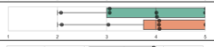</td>
    </tr>
    <tr>
      <th id="pdf-table-1172:0-9fc35587-table-16-2-36-1-f107c9c2" scope="row" headers="pdf-table-1172:0-9fc35587-table-16-2-0-1-c892b7ae pdf-table-1172:0-9fc35587-table-16-2-33-0-6968e189">Video</th>
      <td headers="pdf-table-1172:0-9fc35587-table-16-2-0-2-95b452e1 pdf-table-1172:0-9fc35587-table-16-2-33-0-6968e189 pdf-table-1172:0-9fc35587-table-16-2-36-1-f107c9c2">8</td>
      <td headers="pdf-table-1172:0-9fc35587-table-16-2-0-3-431f0d4d pdf-table-1172:0-9fc35587-table-16-2-33-0-6968e189 pdf-table-1172:0-9fc35587-table-16-2-36-1-f107c9c2">4.00</td>
      <td headers="pdf-table-1172:0-9fc35587-table-16-2-0-4-d3c58af4 pdf-table-1172:0-9fc35587-table-16-2-33-0-6968e189 pdf-table-1172:0-9fc35587-table-16-2-36-1-f107c9c2">1.07</td>
    </tr>
    <tr>
      <th id="pdf-table-1172:0-9fc35587-table-16-2-37-0-23e12ac4" scope="row" rowspan="4" headers="pdf-table-1172:0-9fc35587-table-16-2-0-0-9f465fa8">Expert Evaluation on the Artifact</th>
      <th id="pdf-table-1172:0-9fc35587-table-16-2-37-1-afc4993e" scope="row" headers="pdf-table-1172:0-9fc35587-table-16-2-0-1-c892b7ae pdf-table-1172:0-9fc35587-table-16-2-37-0-23e12ac4">Colaroid</th>
      <td headers="pdf-table-1172:0-9fc35587-table-16-2-0-2-95b452e1 pdf-table-1172:0-9fc35587-table-16-2-37-0-23e12ac4 pdf-table-1172:0-9fc35587-table-16-2-37-1-afc4993e">8</td>
      <td headers="pdf-table-1172:0-9fc35587-table-16-2-0-3-431f0d4d pdf-table-1172:0-9fc35587-table-16-2-37-0-23e12ac4 pdf-table-1172:0-9fc35587-table-16-2-37-1-afc4993e">60.00</td>
      <td headers="pdf-table-1172:0-9fc35587-table-16-2-0-4-d3c58af4 pdf-table-1172:0-9fc35587-table-16-2-37-0-23e12ac4 pdf-table-1172:0-9fc35587-table-16-2-37-1-afc4993e">27.26</td>
      <td rowspan="2" headers="pdf-table-1172:0-9fc35587-table-16-2-0-5-a787b19b pdf-table-1172:0-9fc35587-table-16-2-37-0-23e12ac4 pdf-table-1172:0-9fc35587-table-16-2-37-1-afc4993e pdf-table-1172:0-9fc35587-table-16-2-38-1-fb747738">0.12</td>
      <td rowspan="2" headers="pdf-table-1172:0-9fc35587-table-16-2-0-6-13e90884 pdf-table-1172:0-9fc35587-table-16-2-37-0-23e12ac4 pdf-table-1172:0-9fc35587-table-16-2-37-1-afc4993e pdf-table-1172:0-9fc35587-table-16-2-38-1-fb747738">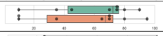</td>
    </tr>
    <tr>
      <th id="pdf-table-1172:0-9fc35587-table-16-2-38-1-fb747738" scope="row" headers="pdf-table-1172:0-9fc35587-table-16-2-0-1-c892b7ae pdf-table-1172:0-9fc35587-table-16-2-37-0-23e12ac4">Article</th>
      <td headers="pdf-table-1172:0-9fc35587-table-16-2-0-2-95b452e1 pdf-table-1172:0-9fc35587-table-16-2-37-0-23e12ac4 pdf-table-1172:0-9fc35587-table-16-2-38-1-fb747738">8</td>
      <td headers="pdf-table-1172:0-9fc35587-table-16-2-0-3-431f0d4d pdf-table-1172:0-9fc35587-table-16-2-37-0-23e12ac4 pdf-table-1172:0-9fc35587-table-16-2-38-1-fb747738">54.38</td>
      <td headers="pdf-table-1172:0-9fc35587-table-16-2-0-4-d3c58af4 pdf-table-1172:0-9fc35587-table-16-2-37-0-23e12ac4 pdf-table-1172:0-9fc35587-table-16-2-38-1-fb747738">32.12</td>
    </tr>
    <tr>
      <th id="pdf-table-1172:0-9fc35587-table-16-2-39-1-97e6c82d" scope="row" headers="pdf-table-1172:0-9fc35587-table-16-2-0-1-c892b7ae pdf-table-1172:0-9fc35587-table-16-2-37-0-23e12ac4">Colaroid</th>
      <td headers="pdf-table-1172:0-9fc35587-table-16-2-0-2-95b452e1 pdf-table-1172:0-9fc35587-table-16-2-37-0-23e12ac4 pdf-table-1172:0-9fc35587-table-16-2-39-1-97e6c82d">8</td>
      <td headers="pdf-table-1172:0-9fc35587-table-16-2-0-3-431f0d4d pdf-table-1172:0-9fc35587-table-16-2-37-0-23e12ac4 pdf-table-1172:0-9fc35587-table-16-2-39-1-97e6c82d">58.13</td>
      <td headers="pdf-table-1172:0-9fc35587-table-16-2-0-4-d3c58af4 pdf-table-1172:0-9fc35587-table-16-2-37-0-23e12ac4 pdf-table-1172:0-9fc35587-table-16-2-39-1-97e6c82d">35.75</td>
      <td rowspan="2" headers="pdf-table-1172:0-9fc35587-table-16-2-0-5-a787b19b pdf-table-1172:0-9fc35587-table-16-2-37-0-23e12ac4 pdf-table-1172:0-9fc35587-table-16-2-39-1-97e6c82d pdf-table-1172:0-9fc35587-table-16-2-40-1-ecbd6eb9">0.81</td>
      <td rowspan="2" headers="pdf-table-1172:0-9fc35587-table-16-2-0-6-13e90884 pdf-table-1172:0-9fc35587-table-16-2-37-0-23e12ac4 pdf-table-1172:0-9fc35587-table-16-2-39-1-97e6c82d pdf-table-1172:0-9fc35587-table-16-2-40-1-ecbd6eb9">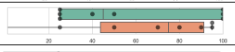</td>
    </tr>
    <tr>
      <th id="pdf-table-1172:0-9fc35587-table-16-2-40-1-ecbd6eb9" scope="row" headers="pdf-table-1172:0-9fc35587-table-16-2-0-1-c892b7ae pdf-table-1172:0-9fc35587-table-16-2-37-0-23e12ac4">Video</th>
      <td headers="pdf-table-1172:0-9fc35587-table-16-2-0-2-95b452e1 pdf-table-1172:0-9fc35587-table-16-2-37-0-23e12ac4 pdf-table-1172:0-9fc35587-table-16-2-40-1-ecbd6eb9">8</td>
      <td headers="pdf-table-1172:0-9fc35587-table-16-2-0-3-431f0d4d pdf-table-1172:0-9fc35587-table-16-2-37-0-23e12ac4 pdf-table-1172:0-9fc35587-table-16-2-40-1-ecbd6eb9">63.13</td>
      <td headers="pdf-table-1172:0-9fc35587-table-16-2-0-4-d3c58af4 pdf-table-1172:0-9fc35587-table-16-2-37-0-23e12ac4 pdf-table-1172:0-9fc35587-table-16-2-40-1-ecbd6eb9">35.25</td>
    </tr>
    <tr>
      <th id="pdf-table-1172:0-9fc35587-table-16-2-41-0-41c8e64c" scope="row" rowspan="4" headers="pdf-table-1172:0-9fc35587-table-16-2-0-0-9f465fa8">Actual Engagement Time (mins)</th>
      <th id="pdf-table-1172:0-9fc35587-table-16-2-41-1-38355161" scope="row" headers="pdf-table-1172:0-9fc35587-table-16-2-0-1-c892b7ae pdf-table-1172:0-9fc35587-table-16-2-41-0-41c8e64c">Colaroid</th>
      <td headers="pdf-table-1172:0-9fc35587-table-16-2-0-2-95b452e1 pdf-table-1172:0-9fc35587-table-16-2-41-0-41c8e64c pdf-table-1172:0-9fc35587-table-16-2-41-1-38355161">8</td>
      <td headers="pdf-table-1172:0-9fc35587-table-16-2-0-3-431f0d4d pdf-table-1172:0-9fc35587-table-16-2-41-0-41c8e64c pdf-table-1172:0-9fc35587-table-16-2-41-1-38355161">14.68</td>
      <td headers="pdf-table-1172:0-9fc35587-table-16-2-0-4-d3c58af4 pdf-table-1172:0-9fc35587-table-16-2-41-0-41c8e64c pdf-table-1172:0-9fc35587-table-16-2-41-1-38355161">3.00</td>
      <td rowspan="2" headers="pdf-table-1172:0-9fc35587-table-16-2-0-5-a787b19b pdf-table-1172:0-9fc35587-table-16-2-41-0-41c8e64c pdf-table-1172:0-9fc35587-table-16-2-41-1-38355161 pdf-table-1172:0-9fc35587-table-16-2-42-1-c1cdf0ab">0.007**</td>
      <td rowspan="2" headers="pdf-table-1172:0-9fc35587-table-16-2-0-6-13e90884 pdf-table-1172:0-9fc35587-table-16-2-41-0-41c8e64c pdf-table-1172:0-9fc35587-table-16-2-41-1-38355161 pdf-table-1172:0-9fc35587-table-16-2-42-1-c1cdf0ab"></td>
    </tr>
    <tr>
      <th id="pdf-table-1172:0-9fc35587-table-16-2-42-1-c1cdf0ab" scope="row" headers="pdf-table-1172:0-9fc35587-table-16-2-0-1-c892b7ae pdf-table-1172:0-9fc35587-table-16-2-41-0-41c8e64c">Article</th>
      <td headers="pdf-table-1172:0-9fc35587-table-16-2-0-2-95b452e1 pdf-table-1172:0-9fc35587-table-16-2-41-0-41c8e64c pdf-table-1172:0-9fc35587-table-16-2-42-1-c1cdf0ab">8</td>
      <td headers="pdf-table-1172:0-9fc35587-table-16-2-0-3-431f0d4d pdf-table-1172:0-9fc35587-table-16-2-41-0-41c8e64c pdf-table-1172:0-9fc35587-table-16-2-42-1-c1cdf0ab">8.76</td>
      <td headers="pdf-table-1172:0-9fc35587-table-16-2-0-4-d3c58af4 pdf-table-1172:0-9fc35587-table-16-2-41-0-41c8e64c pdf-table-1172:0-9fc35587-table-16-2-42-1-c1cdf0ab">2.69</td>
    </tr>
    <tr>
      <th id="pdf-table-1172:0-9fc35587-table-16-2-43-1-fcf3b6b6" scope="row" headers="pdf-table-1172:0-9fc35587-table-16-2-0-1-c892b7ae pdf-table-1172:0-9fc35587-table-16-2-41-0-41c8e64c">Colaroid</th>
      <td headers="pdf-table-1172:0-9fc35587-table-16-2-0-2-95b452e1 pdf-table-1172:0-9fc35587-table-16-2-41-0-41c8e64c pdf-table-1172:0-9fc35587-table-16-2-43-1-fcf3b6b6">8</td>
      <td headers="pdf-table-1172:0-9fc35587-table-16-2-0-3-431f0d4d pdf-table-1172:0-9fc35587-table-16-2-41-0-41c8e64c pdf-table-1172:0-9fc35587-table-16-2-43-1-fcf3b6b6">14.35</td>
      <td headers="pdf-table-1172:0-9fc35587-table-16-2-0-4-d3c58af4 pdf-table-1172:0-9fc35587-table-16-2-41-0-41c8e64c pdf-table-1172:0-9fc35587-table-16-2-43-1-fcf3b6b6">4.87</td>
      <td rowspan="2" headers="pdf-table-1172:0-9fc35587-table-16-2-0-5-a787b19b pdf-table-1172:0-9fc35587-table-16-2-41-0-41c8e64c pdf-table-1172:0-9fc35587-table-16-2-43-1-fcf3b6b6 pdf-table-1172:0-9fc35587-table-16-2-44-1-936a113f">0.002**</td>
      <td rowspan="2" headers="pdf-table-1172:0-9fc35587-table-16-2-0-6-13e90884 pdf-table-1172:0-9fc35587-table-16-2-41-0-41c8e64c pdf-table-1172:0-9fc35587-table-16-2-43-1-fcf3b6b6 pdf-table-1172:0-9fc35587-table-16-2-44-1-936a113f">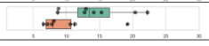</td>
    </tr>
    <tr>
      <th id="pdf-table-1172:0-9fc35587-table-16-2-44-1-936a113f" scope="row" headers="pdf-table-1172:0-9fc35587-table-16-2-0-1-c892b7ae pdf-table-1172:0-9fc35587-table-16-2-41-0-41c8e64c">Video</th>
      <td headers="pdf-table-1172:0-9fc35587-table-16-2-0-2-95b452e1 pdf-table-1172:0-9fc35587-table-16-2-41-0-41c8e64c pdf-table-1172:0-9fc35587-table-16-2-44-1-936a113f">8</td>
      <td headers="pdf-table-1172:0-9fc35587-table-16-2-0-3-431f0d4d pdf-table-1172:0-9fc35587-table-16-2-41-0-41c8e64c pdf-table-1172:0-9fc35587-table-16-2-44-1-936a113f">8.79</td>
      <td headers="pdf-table-1172:0-9fc35587-table-16-2-0-4-d3c58af4 pdf-table-1172:0-9fc35587-table-16-2-41-0-41c8e64c pdf-table-1172:0-9fc35587-table-16-2-44-1-936a113f">5.40</td>
    </tr>
  </tbody>
</table>

#### 7.2.4 Does Colaroid lead to better learning outcomes?

In the post-task questionnaire, we asked participants to rate a few statements regarding to the task performance. As shown in Table [3,](<#page-16>) there is no significant differences in terms of participants’ satisfaction to the final artifacts they built. In addition, we did not see a significant differences in terms of how experts’ evaluation of the artifacts regarding to different formats of the tutorials.

Despite that there no evidence showing that Colaroid tutorials can significantly improve participants’ learning outcome, several participants mentioned Colaroid encourage active learning: “I think I learned by doing. And having an interactive notebook is more suitable for that.” (P20). One participant provided an interesting analogy of the learning experience provided by three tutorial modalities:

Figure 5: We manually coded the screen recording to understand how students interact with the tutorials. All participants used the full 40 mins on the task. Participants’ engagement time with Colaroid tutorials is significantly more than article tutorials (1) and video tutorials (2). In particular, we noticed that some participants (3) gave up on the video tutorials after watching a segment at the beginning of the study.

An analogy to that is like you are in a chemistry class or biology class, Colaroid is like the lab where you can quickly do something to a chemical experiment, where the video is like watching a lecture recording and the article is like reading a textbook. You will learn it but I felt like it’s not as useful because you don’t see what actually happens in the environment of your world. (P19)

#### 7.2.5 Summary of the Results.

In summary, our evaluation shows that Colaroid provides a more engaging reading experience by following along the scaffolded steps with active exploration. Colaroid harnesses the advantages of article tutorials in terms of providing a self-paced and easy-to-skim reading experience. Colaroid also harnesses the advantages of video tutorials in terms of capturing the details and context for reproducing, supporting more incremental procedure following. Although there are no significant differences in the learning outcomes of Colaroid, participants perceive Colaroid to encourage active learning.

## 8 DISCUSSION

This paper describes the design of the Colaroid system and demonstrates how literate programming principles can be applied to support the instruction of software packages and libraries. We contribute to the field (1) a novel design for creating step-by-step technical education content, extending the concept of literate programming into a temporal dimension, (2) a system, Colaroid, which supports this design and is embedded within the software development tools commonly used by programmers, and (3) an evaluation of this system, looking at how both authors and learners would use it to create and understand learning resources.

By weaving together instructional narrative, code context, and output interactions we are able to support both the authors who create instructional content and the learners who aim to use it to improve their skills. Embedding this system within the authentic work environment for software developers – the integrated development environment – increases the engagement of learners with the instructional content, supporting an active learning experience.

Our design presents a new perspective on how literate programming \[[26](<#page-19>)\] can be extended to support guided complex instruction. Many of the literate programming systems in wide use, such as the Jupyter programming environment \[[38](<#page-19>)\] for computational notebooks, are “spatially-based”, where the narrative components are generally used to describe pieces of code in a top-down order through the document. Through the design of Colaroid we have introduced a new paradigm of “temporally-based” literate artifacts, where the code being constructed is described in an order in which someone would take to build a running system. The key difference between our design and existing systems \[[35](<#page-19>), [38](<#page-19>)\] is that each step in a temporal literate artifact is its own state, and the narrative, code, and runtime environment (e.g., web browser, or python interpreter) for that state is unique. Users can navigate between steps, and doing so shows them the appropriate execution state and instructions for that step. There is no “run all cells” command or the like – a user simply chooses to inspect the last step of the narrative to see the final state of the system.

This design ties together narrative (instruction), code, and system state, and for learners it promotes both guided instruction as well as active learning. Colaroid expanded prior studies \[[2](<#page-18>), [15](<#page-19>), [40](<#page-19>), [54](<#page-20>)\] on linking tutorials with application state into the domain of learning web programming, revealing the benefits in both authoring in authentic environments and learning in authentic environments. Compared to other application domains (e.g., drawing, 3D modeling), we can leverage existing code versioning tools and sharing platforms for tracking system states of the target application — code editors. In addition, Colaroid is different from existing approaches to annotating and replaying application states (e.g., CodeTour \[[1](<#page-18>)\]) as it generates the narrative for learners to skim through and learn at their own pace. Beyond supporting just the learner, this design also supports the iterative authoring process of tutorial content, encouraging encapsulation of instructional explanations with the appropriate code state.

### 8.1 Outlook

The growth of zero install web-based integrated development environments supported by software code repositories (e.g., gitpod, GitHub Codespaces, Binder) offers a new opportunity to streamline education as it relates to the features and use of software packages. Many open source software repositories already contain a directory of examples which are intended to go with web tutorial content. By leveraging the Colaroid system, these repositories could provide one-click learning opportunities, allowing users to go from the familiar source code version control interface into an authentic IDE with detailed instructional content. From within the browser, learners could immediately begin to explore both the code base and the runtime state of tutorials, engaging in active learning immediately. This also opens the potential for educational content to be woven into the software as a first class artifact, by extending the continuous integration systems in place to produce regression tests against the individual steps of the educational tutorials. Such an approach would allow project communities to require that a software release include up-to-date educational examples of a given library, reducing inconsistencies between online tutorials and the libraries they aim to teach.

### 8.2 Limitations

#### 8.2.1 Limitations of Colaroid.

As presented, Colaroid is engineered for creating web programming tutorials specifically and the current output preview is limited to this task. There is opportunity to consider how the system might need to be changed in order to support other kinds of tutorial content. For instance, rendering Python output in the preview, or visualizing data changes \[[47](<#page-19>)\], may be a straightforward way to support data science programming instruction. It is possible that this approach might go beyond traditional programming as well. For instance, in the field of graphic design step-by-step tutorials are often used for instruction, and share many similarities to the web programming context we explored. It would be interesting to apply temporally-based literate techniques inside of a tool such as Adobe Photoshop, where the software code is replaced with layered images, and the narrative describes how tool functions are used to manipulate the images to achieve a desired effect. Being able to load a given image (state) and set of instructions may be particularly interesting to study as graphic design often includes a kinesthetic expression component (e.g., drawing) which may be strengthened through repeated practice.

Through use of the system it became clear that there were many additional supports which might be integrated to improve experiences for both authors and learners. For instance, voice dictation through speech to text for narrative portions of the tutorial would naturally fit instructional approaches such as lecturing or massive online courses. We limited our narrative component markdown text, the rough format used in online tutorials, but there are other media types which may be appropriate and further the authoring experience. In addition, Colaroid does not save learners’ exploration of the steps, or compare them with the reference solution.

#### 8.2.2 Limitations of our Evaluation.

We chose to explore the Colaroid with an eye to both authoring and learning tasks. For the authoring study, only a small number of participants (𝑛 = 10) were observed, and they created small-size tutorials for simple web development tasks, and were not given explicit instructions or time for polishing of the educational content. This evaluation method allowed us to study their interactions in-depth, and follow up with interview questions to understand their thinking. However, a larger field trial of the tool would help to uncover whether tutorial style has an interaction on adoption and acceptance of the authoring experience. It would be especially beneficial if Colaroid was enabled for more programming domains as the interaction between domain, tutorial style, and the temporal literate programming design could be explored.

For the learner study, the tutorial topic (Flappy Bird) and the task topic (Dinosaur Game) only represent one usage case of tutorials — following a tutorial step-by-step to create a similar application. It is worth exploring different usage cases of tutorials, including replicating a project by following a tutorial, or learning key concepts as one might do in lecture content. Importantly, we did not measure learning gains which is one of the reasons users engage in consuming online tutorial content. The interactions between productivity, engagement, and long term learning (versus immediate performance learning) are significant, and thus we make no claims here that Colaroid results in longer term knowledge retention. However, we are excited by the increased engagement that learners experienced in the Colaroid condition, as there is significant evidence that active learning and hands on practice does result in long term learning gains \[27\].

## 9 CONCLUSION

This paper presents a literate programming approach to author explorable and multi-stage tutorials. We implemented a prototype Colaroid, an IDE-integrated tutorial editor that captures the scaffolded implementation process in the authentic work environment. On the other hand, Colaroid provides the IDE-integrated reading experience, allowing learners to explore and tinker with the steps in the tutorial directly in their authentic work environment. Our evaluation shows that Colaroid can benefit both the authoring experience by effective and rich editing, and the reading experience by encouraging learning by doing.

## ACKNOWLEDGMENTS

This material is based upon work supported by the National Science Foundation under DUE 1915515. We would like to thank Michael Nebeling for his feedback on the paper. We thank Yuyu Yang and Steven Nguyen for their help in collecting the programming tutorials. We thank the SI 579 teaching team for their help in the evaluation study. We also thank the study participants and reviewers for their time and effort.

## REFERENCES

- \[1\] 2022. CodeTour. [https://marketplace.visualstudio.com/items?itemName=vsls-](<https://marketplace.visualstudio.com/items?itemName=vsls-contrib.codetour>) [contrib.codetour](<https://marketplace.visualstudio.com/items?itemName=vsls-contrib.codetour>)

- \[2\] Lawrence Bergman, Vittorio Castelli, Tessa Lau, and Daniel Oblinger. 2005. DocWizards: a system for authoring follow-me documentation wizards. In Proceedings of the 18th annual ACM symposium on User interface software and technology. 191–200.

- \[3\] Raymond PL Buse and Westley R Weimer. 2010. Automatically documenting program changes. In Proceedings of the IEEE/ACM international conference on Automated software engineering. 33–42.

- \[4\] Paul Cairns and Jeremy Gow. 2005. Literate proving: presenting and documenting formal proofs. In International Conference on Mathematical Knowledge Management. Springer, 159–173. \[5\] Souti Chattopadhyay, Ishita Prasad, Austin Z Henley, Anita Sarma, and Titus Barik. 2020. What’s wrong with computational notebooks? Pain points, needs, and design opportunities. In Proceedings of the 2020 CHI Conference on Human Factors in Computing Systems. 1–12. \[6\] Charles H Chen and Philip J Guo. 2019. Improv: Teaching programming at scale via live coding. In Proceedings of the Sixth (2019) ACM Conference on Learning@ Scale. 1–10. \[7\] Pei-Yu Chi, Sally Ahn, Amanda Ren, Mira Dontcheva, Wilmot Li, and Björn Hartmann. 2012. MixT: automatic generation of step-by-step mixed media tutorials. In Proceedings of the 25th annual ACM symposium on User interface software and technology. 93–102. \[8\] Fulvio Corno, Luigi De Russis, and Juan Pablo Sáenz. 2019. Towards computational notebooks for IoT development. In Extended Abstracts of the 2019 CHI Conference on Human Factors in Computing Systems. 1–6. \[9\] Barthélémy Dagenais and Martin P Robillard. 2010. Creating and evolving developer documentation: understanding the decisions of open source contributors. In Proceedings of the eighteenth ACM SIGSOFT international symposium on Foundations of software engineering. 127–136. \[10\] Alan Davies, Frances Hooley, Peter Causey-Freeman, Iliada Eleftheriou, and Georgina Moulton. 2020. Using interactive digital notebooks for bioscience and informatics education. PLoS computational biology 16, 11 (2020), e1008326. \[11\] Eve 2020. Eve: Programming designed for humans. [http://witheve.com/](<http://witheve.com/>)

- \[12\] Travis Faas, Lynn Dombrowski, Alyson Young, and Andrew D Miller. 2018. Watch me code: Programming mentorship communities on twitch. tv. Proceedings of the ACM on Human-Computer Interaction 2, CSCW (2018), 1–18. \[13\] Shiry Ginosar, Luis Fernando De Pombo, Maneesh Agrawala, and Bjorn Hartmann. 2013. Authoring multi-stage code examples with editable code histories. In Proceedings of the 26th annual ACM symposium on User interface software and technology. 485–494. \[14\] Mitchell Gordon and Philip J Guo. 2015. Codepourri: Creating visual coding tutorials using a volunteer crowd of learners. In 2015 IEEE symposium on visual languages and human-centric computing (VL/HCC). IEEE, 13–21. \[15\] Floraine Grabler, Maneesh Agrawala, Wilmot Li, Mira Dontcheva, and Takeo Igarashi. 2009. Generating photo manipulation tutorials by demonstration. In ACM SIGGRAPH 2009 papers. 1–9. \[16\] Tovi Grossman, Justin Matejka, and George Fitzmaurice. 2010. Chronicle: capture, exploration, and playback of document workflow histories. In Proceedings of the 23nd annual ACM symposium on User interface software and technology. 143–152. \[17\] Andrew Head, Elena L Glassman, Björn Hartmann, and Marti A Hearst. 2018. Interactive extraction of examples from existing code. In Proceedings of the 2018 CHI Conference on Human Factors in Computing Systems. 1–12. \[18\] Andrew Head, Fred Hohman, Titus Barik, Steven M Drucker, and Robert DeLine. 2019. Managing messes in computational notebooks. In Proceedings of the 2019 CHI Conference on Human Factors in Computing Systems. 1–12. \[19\] Andrew Head, Jason Jiang, James Smith, Marti A Hearst, and Björn Hartmann. 2020. Composing flexibly-organized step-by-step tutorials from linked source code, snippets, and outputs. In Proceedings of the 2020 CHI Conference on Human Factors in Computing Systems. 1–12. \[20\] Fred Hohman, Kanit Wongsuphasawat, Mary Beth Kery, and Kayur Patel. 2020. Understanding and visualizing data iteration in machine learning. In Proceedings of the 2020 CHI conference on human factors in computing systems. 1–13. \[21\] Mike Horn, Amartya Banerjee, and Matthew Brucker. 2022. TunePad Playbooks: Designing Computational Notebooks for Creative Music Coding. In CHI Conference on Human Factors in Computing Systems. 1–12. \[22\] Mary Beth Kery, Bonnie E John, Patrick O’Flaherty, Amber Horvath, and Brad A Myers. 2019. Towards effective foraging by data scientists to find past analysis choices. In Proceedings of the 2019 CHI Conference on Human Factors in Computing Systems. 1–13. \[23\] Mary Beth Kery, Marissa Radensky, Mahima Arya, Bonnie E John, and Brad A Myers. 2018. The story in the notebook: Exploratory data science using a literate programming tool. In Proceedings of the 2018 CHI Conference on Human Factors in Computing Systems. 1–11. \[24\] Ada S Kim and Amy J Ko. 2017. A pedagogical analysis of online coding tutorials. In Proceedings of the 2017 ACM SIGCSE Technical Symposium on Computer Science Education. 321–326. \[25\] Youngtaek Kim, Jaeyoung Kim, Hyeon Jeon, Young-Ho Kim, Hyunjoo Song, Bohyoung Kim, and Jinwook Seo. 2020. Githru: visual analytics for understanding software development history through git metadata analysis. IEEE Transactions on Visualization and Computer Graphics 27, 2 (2020), 656–666. \[26\] Donald Ervin Knuth. 1984. Literate programming. The computer journal 27, 2 (1984), 97–111.

- \[27\] Kenneth R Koedinger, Elizabeth A McLaughlin, Julianna Zhuxin Jia, and Norman L Bier. 2016. Is the doer effect a causal relationship? How can we tell and why it’s important. In Proceedings of the sixth international conference on learning

- analytics &amp; knowledge. 388–397. \[28\] Rebecca Krosnick, Fraser Anderson, Justin Matejka, Steve Oney, Walter S. Lasecki, Tovi Grossman, and George Fitzmaurice. 2021. Think-Aloud Computing: Supporting Rich and Low-Effort Knowledge Capture. In Proceedings of the 2021 CHI Conference on Human Factors in Computing Systems. 1–13. \[29\] Sean Kross and Philip J Guo. 2019. Practitioners teaching data science in industry and academia: Expectations, workflows, and challenges. In Proceedings of the 2019 CHI conference on human factors in computing systems. 1–14. \[30\] Mario Linares-Vásquez, Luis Fernando Cortés-Coy, Jairo Aponte, and Denys Poshyvanyk. 2015. Changescribe: A tool for automatically generating commit messages. In 2015 IEEE/ACM 37th IEEE International Conference on Software Engineering, Vol. 2. IEEE, 709–712. \[31\] Mark Mahoney. 2018. Storyteller: a tool for creating worked examples. Journal of Computing Sciences in Colleges 34, 1 (2018), 137–144. \[32\] Brad A Myers. 1991. Separating application code from toolkits: Eliminating the spaghetti of call-backs. In Proceedings of the 4th annual ACM symposium on User interface software and technology. 211–220. \[33\] Alok Mysore and Philip J Guo. 2017. Torta: Generating mixed-media gui and command-line app tutorials using operating-system-wide activity tracing. In Proceedings of the 30th Annual ACM Symposium on User Interface Software and Technology. 703–714. \[34\] Seyed Mehdi Nasehi, Jonathan Sillito, Frank Maurer, and Chris Burns. 2012. What makes a good code example?: A study of programming Q&amp;A in StackOverflow. In 2012 28th IEEE International Conference on Software Maintenance (ICSM). IEEE, 25–34. \[35\] Observable 2020. Observable: the magic notebook for exploring data and thinking with code. [https://observablehq.com/](<https://observablehq.com/>) \[36\] Steve Oney, Christopher Brooks, and Paul Resnick. 2018. Creating guided code explanations with chat. codes. Proceedings of the ACM on Human-Computer Interaction 2, CSCW (2018), 1–20. \[37\] Chris Parnin, Christoph Treude, and Margaret-Anne Storey. 2013. Blogging developer knowledge: Motivations, challenges, and future directions. In 2013 21st International Conference on Program Comprehension (ICPC). IEEE, 211–214. \[38\] Jeffrey M Perkel. 2018. Why Jupyter is data scientists’ computational notebook of choice. Nature 563, 7732 (2018), 145–147. \[39\] Clément Pit-Claudel. 2020. Untangling mechanized proofs. In Proceedings of the 13th ACM SIGPLAN International Conference on Software Language Engineering. 155–174. \[40\] Suporn Pongnumkul, Mira Dontcheva, Wilmot Li, Jue Wang, Lubomir Bourdev, Shai Avidan, and Michael F Cohen. 2011. Pause-and-play: automatically linking screencast video tutorials with applications. In Proceedings of the 24th annual ACM symposium on User interface software and technology. 135–144. \[41\] Roman Rädle, Midas Nouwens, Kristian Antonsen, James R Eagan, and Clemens N Klokmose. 2017. Codestrates: Literate computing with webstrates. In Proceedings of the 30th Annual ACM Symposium on User Interface Software and Technology. 715–725.

- \[42\] Ernst Z Rothkopf and MJ Billington. 1979. Goal-guided learning from text: inferring a descriptive processing model from inspection times and eye movements. Journal of educational psychology 71, 3 (1979), 310. \[43\] Adam Carl Rule. 2018. Design and use of computational notebooks. University of California, San Diego. \[44\] Huascar Sanchez, Jim Whitehead, and Martin Schäf. 2016. Multistaging to understand: Distilling the essence of java code examples. In 2016 IEEE 24th International Conference on Program Comprehension (ICPC). IEEE, 1–10. \[45\] Anselm Strauss and Juliet Corbin. 1994. Grounded theory methodology: An overview. (1994). \[46\] Brad Victor. 2011. Explorable Explanations. (2011). [http://worrydream.com/](<http://worrydream.com/ExplorableExplanations/>) [ExplorableExplanations/](<http://worrydream.com/ExplorableExplanations/>)

- \[47\] April Yi Wang, Will Epperson, Robert A DeLine, and Steven M Drucker. 2022. Diff in the Loop: Supporting Data Comparison in Exploratory Data Analysis. In CHI Conference on Human Factors in Computing Systems. 1–10. \[48\] April Yi Wang, Anant Mittal, Christopher Brooks, and Steve Oney. 2019. How data scientists use computational notebooks for real-time collaboration. Proceedings of the ACM on Human-Computer Interaction 3, CSCW (2019), 1–30.

- \[49\] April Yi Wang, Zihan Wu, Christopher Brooks, and Steve Oney. 2020. Callisto: Capturing the" Why" by Connecting Conversations with Computational Narratives. In Proceedings of the 2020 CHI Conference on Human Factors in Computing Systems. 1–13.

- \[50\] Nathaniel Weinman, Steven M Drucker, Titus Barik, and Robert DeLine. 2021. Fork It: Supporting stateful alternatives in computational notebooks. In Proceedings of the 2021 CHI Conference on Human Factors in Computing Systems. 1–12.

- \[51\] Wikipedia contributors. 2022. Instant camera — Wikipedia, The Free Encyclopedia. [https://en.wikipedia.org/w/index.php?title=Instant\_camera&amp;oldid=](<https://en.wikipedia.org/w/index.php?title=Instant_camera&oldid=1109305997>) [1109305997](<https://en.wikipedia.org/w/index.php?title=Instant_camera&oldid=1109305997>) \[Online; accessed 15-September-2022\].

- \[52\] Stephen Wolfram. 2003. The mathematica book. Vol. 1. Wolfram Research, Inc.

- \[53\] Yihui Xie. 2018. knitr: a comprehensive tool for reproducible research in R. In Implementing reproducible research. Chapman and Hall/CRC, 3–31.

- \[54\] Tom Yeh, Tsung-Hsiang Chang, and Robert C Miller. 2009. Sikuli: using GUI screenshots for search and automation. In Proceedings of the 22nd annual ACM

## A TUTORIAL LISTS IN FORMATIVE STUDY

<table>
  <thead>
    <tr>
      <th id="pdf-table-1492:0-2b703edd-table-21-2-0-0-ce2c75ca" scope="col" data-pdf-scope="Both">ID</th>
      <th id="pdf-table-1492:0-2b703edd-table-21-2-0-1-6ddc7ea6" scope="col" headers="pdf-table-1492:0-2b703edd-table-21-2-0-0-ce2c75ca">Tutorial Title</th>
      <th id="pdf-table-1492:0-2b703edd-table-21-2-0-2-d1068ebf" scope="col" headers="pdf-table-1492:0-2b703edd-table-21-2-0-0-ce2c75ca">Link</th>
      <th id="pdf-table-1492:0-2b703edd-table-21-2-0-3-129d0a42" scope="col" headers="pdf-table-1492:0-2b703edd-table-21-2-0-0-ce2c75ca">Author</th>
      <th id="pdf-table-1492:0-2b703edd-table-21-2-0-4-d96f3221" scope="col" headers="pdf-table-1492:0-2b703edd-table-21-2-0-0-ce2c75ca">Source</th>
    </tr>
  </thead>
  <tbody>
    <tr>
      <th id="pdf-table-1492:0-2b703edd-table-21-2-1-0-8829a412" scope="row" headers="pdf-table-1492:0-2b703edd-table-21-2-0-0-ce2c75ca">T1</th>
      <td headers="pdf-table-1492:0-2b703edd-table-21-2-0-1-6ddc7ea6 pdf-table-1492:0-2b703edd-table-21-2-1-0-8829a412">Polymorphism</td>
      <td headers="pdf-table-1492:0-2b703edd-table-21-2-0-2-d1068ebf pdf-table-1492:0-2b703edd-table-21-2-1-0-8829a412"><a href="https://docs.oracle.com/javase/tutorial/java/IandI/polymorphism.html">https://docs.oracle.com/javase/tutorial/java/IandI/</a> <a href="https://docs.oracle.com/javase/tutorial/java/IandI/polymorphism.html">polymorphism.html</a></td>
      <td headers="pdf-table-1492:0-2b703edd-table-21-2-0-3-129d0a42 pdf-table-1492:0-2b703edd-table-21-2-1-0-8829a412">Official</td>
      <td headers="pdf-table-1492:0-2b703edd-table-21-2-0-4-d96f3221 pdf-table-1492:0-2b703edd-table-21-2-1-0-8829a412">Stack Overflow</td>
    </tr>
    <tr>
      <th id="pdf-table-1492:0-2b703edd-table-21-2-2-0-e9d09f29" scope="row" headers="pdf-table-1492:0-2b703edd-table-21-2-0-0-ce2c75ca">T2</th>
      <td headers="pdf-table-1492:0-2b703edd-table-21-2-0-1-6ddc7ea6 pdf-table-1492:0-2b703edd-table-21-2-2-0-e9d09f29">Guide to Java 8 Comparator.comparing()</td>
      <td headers="pdf-table-1492:0-2b703edd-table-21-2-0-2-d1068ebf pdf-table-1492:0-2b703edd-table-21-2-2-0-e9d09f29"><a href="https://www.baeldung.com/java-8-comparator-comparing">https://www.baeldung.com/java-8-comparator-comparing</a></td>
      <td headers="pdf-table-1492:0-2b703edd-table-21-2-0-3-129d0a42 pdf-table-1492:0-2b703edd-table-21-2-2-0-e9d09f29">Third-Party</td>
      <td headers="pdf-table-1492:0-2b703edd-table-21-2-0-4-d96f3221 pdf-table-1492:0-2b703edd-table-21-2-2-0-e9d09f29">Stack Overflow</td>
    </tr>
    <tr>
      <th id="pdf-table-1492:0-2b703edd-table-21-2-3-0-1cb7286c" scope="row" headers="pdf-table-1492:0-2b703edd-table-21-2-0-0-ce2c75ca">T3</th>
      <td headers="pdf-table-1492:0-2b703edd-table-21-2-0-1-6ddc7ea6 pdf-table-1492:0-2b703edd-table-21-2-3-0-1cb7286c">React Authenticator</td>
      <td headers="pdf-table-1492:0-2b703edd-table-21-2-0-2-d1068ebf pdf-table-1492:0-2b703edd-table-21-2-3-0-1cb7286c"><a href="https://ui.docs.amplify.aws/react/connected-components/authenticator">https://ui.docs.amplify.aws/react/connected-components/</a> <a href="https://ui.docs.amplify.aws/react/connected-components/authenticator">authenticator</a></td>
      <td headers="pdf-table-1492:0-2b703edd-table-21-2-0-3-129d0a42 pdf-table-1492:0-2b703edd-table-21-2-3-0-1cb7286c">Official</td>
      <td headers="pdf-table-1492:0-2b703edd-table-21-2-0-4-d96f3221 pdf-table-1492:0-2b703edd-table-21-2-3-0-1cb7286c">Stack Overflow</td>
    </tr>
    <tr>
      <th id="pdf-table-1492:0-2b703edd-table-21-2-4-0-f912bb71" scope="row" headers="pdf-table-1492:0-2b703edd-table-21-2-0-0-ce2c75ca">T4</th>
      <td headers="pdf-table-1492:0-2b703edd-table-21-2-0-1-6ddc7ea6 pdf-table-1492:0-2b703edd-table-21-2-4-0-f912bb71">React Router Tutorial</td>
      <td headers="pdf-table-1492:0-2b703edd-table-21-2-0-2-d1068ebf pdf-table-1492:0-2b703edd-table-21-2-4-0-f912bb71"><a href="https://reactrouter.com/en/v6.3.0/getting-started/tutorial#tutorial">https://reactrouter.com/en/v6.3.0/getting-started/tutorial#</a> <a href="https://reactrouter.com/en/v6.3.0/getting-started/tutorial#tutorial">tutorial</a></td>
      <td headers="pdf-table-1492:0-2b703edd-table-21-2-0-3-129d0a42 pdf-table-1492:0-2b703edd-table-21-2-4-0-f912bb71">Official</td>
      <td headers="pdf-table-1492:0-2b703edd-table-21-2-0-4-d96f3221 pdf-table-1492:0-2b703edd-table-21-2-4-0-f912bb71">Stack Overflow</td>
    </tr>
    <tr>
      <th id="pdf-table-1492:0-2b703edd-table-21-2-5-0-30423303" scope="row" headers="pdf-table-1492:0-2b703edd-table-21-2-0-0-ce2c75ca">T5</th>
      <td headers="pdf-table-1492:0-2b703edd-table-21-2-0-1-6ddc7ea6 pdf-table-1492:0-2b703edd-table-21-2-5-0-30423303">Explore SplashScreen API, Android 12, Kotlin</td>
      <td headers="pdf-table-1492:0-2b703edd-table-21-2-0-2-d1068ebf pdf-table-1492:0-2b703edd-table-21-2-5-0-30423303"><a href="https://medium.com/realm/explore-splashscreen-api-android-12-kotlin-7a8bf83b061a">https://medium.com/realm/explore-splashscreen-api-</a> <a href="https://medium.com/realm/explore-splashscreen-api-android-12-kotlin-7a8bf83b061a">android-12-kotlin-7a8bf83b061a</a></td>
      <td headers="pdf-table-1492:0-2b703edd-table-21-2-0-3-129d0a42 pdf-table-1492:0-2b703edd-table-21-2-5-0-30423303">Personal</td>
      <td headers="pdf-table-1492:0-2b703edd-table-21-2-0-4-d96f3221 pdf-table-1492:0-2b703edd-table-21-2-5-0-30423303">Stack Overflow</td>
    </tr>
    <tr>
      <th id="pdf-table-1492:0-2b703edd-table-21-2-6-0-c388a715" scope="row" headers="pdf-table-1492:0-2b703edd-table-21-2-0-0-ce2c75ca">T6</th>
      <td headers="pdf-table-1492:0-2b703edd-table-21-2-0-1-6ddc7ea6 pdf-table-1492:0-2b703edd-table-21-2-6-0-c388a715">Adding a splash screen to your mobile app</td>
      <td headers="pdf-table-1492:0-2b703edd-table-21-2-0-2-d1068ebf pdf-table-1492:0-2b703edd-table-21-2-6-0-c388a715"><a href="https://flutter.dev/go/android-splash-migration">https://flutter.dev/go/android-splash-migration</a></td>
      <td headers="pdf-table-1492:0-2b703edd-table-21-2-0-3-129d0a42 pdf-table-1492:0-2b703edd-table-21-2-6-0-c388a715">Official</td>
      <td headers="pdf-table-1492:0-2b703edd-table-21-2-0-4-d96f3221 pdf-table-1492:0-2b703edd-table-21-2-6-0-c388a715">Stack Overflow</td>
    </tr>
    <tr>
      <th id="pdf-table-1492:0-2b703edd-table-21-2-7-0-b0a4e7a0" scope="row" headers="pdf-table-1492:0-2b703edd-table-21-2-0-0-ce2c75ca">T7</th>
      <td headers="pdf-table-1492:0-2b703edd-table-21-2-0-1-6ddc7ea6 pdf-table-1492:0-2b703edd-table-21-2-7-0-b0a4e7a0">Federated Learning for Image Classification</td>
      <td headers="pdf-table-1492:0-2b703edd-table-21-2-0-2-d1068ebf pdf-table-1492:0-2b703edd-table-21-2-7-0-b0a4e7a0"><a href="https://www.tensorflow.org/federated/tutorials/federated_learning_for_image_classification">https://www.tensorflow.org/federated/tutorials/federated_</a> <a href="https://www.tensorflow.org/federated/tutorials/federated_learning_for_image_classification">learning_for_image_classification</a></td>
      <td headers="pdf-table-1492:0-2b703edd-table-21-2-0-3-129d0a42 pdf-table-1492:0-2b703edd-table-21-2-7-0-b0a4e7a0">Official</td>
      <td headers="pdf-table-1492:0-2b703edd-table-21-2-0-4-d96f3221 pdf-table-1492:0-2b703edd-table-21-2-7-0-b0a4e7a0">Stack Overflow</td>
    </tr>
    <tr>
      <th id="pdf-table-1492:0-2b703edd-table-21-2-8-0-0224a655" scope="row" headers="pdf-table-1492:0-2b703edd-table-21-2-0-0-ce2c75ca">T8</th>
      <td headers="pdf-table-1492:0-2b703edd-table-21-2-0-1-6ddc7ea6 pdf-table-1492:0-2b703edd-table-21-2-8-0-0224a655">Building Your Own Federated Learning Algorithm</td>
      <td headers="pdf-table-1492:0-2b703edd-table-21-2-0-2-d1068ebf pdf-table-1492:0-2b703edd-table-21-2-8-0-0224a655"><a href="https://www.tensorflow.org/federated/tutorials/building_your_own_federated_learning_algorithm">https://www.tensorflow.org/federated/tutorials/building_</a> <a href="https://www.tensorflow.org/federated/tutorials/building_your_own_federated_learning_algorithm">your_own_federated_learning_algorithm</a></td>
      <td headers="pdf-table-1492:0-2b703edd-table-21-2-0-3-129d0a42 pdf-table-1492:0-2b703edd-table-21-2-8-0-0224a655">Official</td>
      <td headers="pdf-table-1492:0-2b703edd-table-21-2-0-4-d96f3221 pdf-table-1492:0-2b703edd-table-21-2-8-0-0224a655">Stack Overflow</td>
    </tr>
    <tr>
      <th id="pdf-table-1492:0-2b703edd-table-21-2-9-0-707cb800" scope="row" headers="pdf-table-1492:0-2b703edd-table-21-2-0-0-ce2c75ca">T9</th>
      <td headers="pdf-table-1492:0-2b703edd-table-21-2-0-1-6ddc7ea6 pdf-table-1492:0-2b703edd-table-21-2-9-0-707cb800">RTK Query Quick Start</td>
      <td headers="pdf-table-1492:0-2b703edd-table-21-2-0-2-d1068ebf pdf-table-1492:0-2b703edd-table-21-2-9-0-707cb800"><a href="https://redux-toolkit.js.org/tutorials/rtk-query">https://redux-toolkit.js.org/tutorials/rtk-query</a></td>
      <td headers="pdf-table-1492:0-2b703edd-table-21-2-0-3-129d0a42 pdf-table-1492:0-2b703edd-table-21-2-9-0-707cb800">Official</td>
      <td headers="pdf-table-1492:0-2b703edd-table-21-2-0-4-d96f3221 pdf-table-1492:0-2b703edd-table-21-2-9-0-707cb800">Stack Overflow</td>
    </tr>
    <tr>
      <th id="pdf-table-1492:0-2b703edd-table-21-2-10-0-d8eeb8a0" scope="row" headers="pdf-table-1492:0-2b703edd-table-21-2-0-0-ce2c75ca">T10</th>
      <td headers="pdf-table-1492:0-2b703edd-table-21-2-0-1-6ddc7ea6 pdf-table-1492:0-2b703edd-table-21-2-10-0-d8eeb8a0">Redux Toolkit TypeScript Quick Start</td>
      <td headers="pdf-table-1492:0-2b703edd-table-21-2-0-2-d1068ebf pdf-table-1492:0-2b703edd-table-21-2-10-0-d8eeb8a0"><a href="https://redux-toolkit.js.org/tutorials/typescript">https://redux-toolkit.js.org/tutorials/typescript</a></td>
      <td headers="pdf-table-1492:0-2b703edd-table-21-2-0-3-129d0a42 pdf-table-1492:0-2b703edd-table-21-2-10-0-d8eeb8a0">Official</td>
      <td headers="pdf-table-1492:0-2b703edd-table-21-2-0-4-d96f3221 pdf-table-1492:0-2b703edd-table-21-2-10-0-d8eeb8a0">Stack Overflow</td>
    </tr>
    <tr>
      <th id="pdf-table-1492:0-2b703edd-table-21-2-11-0-dc031e93" scope="row" headers="pdf-table-1492:0-2b703edd-table-21-2-0-0-ce2c75ca">T11</th>
      <td headers="pdf-table-1492:0-2b703edd-table-21-2-0-1-6ddc7ea6 pdf-table-1492:0-2b703edd-table-21-2-11-0-dc031e93">Text generation with an RNN</td>
      <td headers="pdf-table-1492:0-2b703edd-table-21-2-0-2-d1068ebf pdf-table-1492:0-2b703edd-table-21-2-11-0-dc031e93"><a href="https://www.tensorflow.org/text/tutorials/text_generation">https://www.tensorflow.org/text/tutorials/text_generation</a></td>
      <td headers="pdf-table-1492:0-2b703edd-table-21-2-0-3-129d0a42 pdf-table-1492:0-2b703edd-table-21-2-11-0-dc031e93">Official</td>
      <td headers="pdf-table-1492:0-2b703edd-table-21-2-0-4-d96f3221 pdf-table-1492:0-2b703edd-table-21-2-11-0-dc031e93">Stack Overflow</td>
    </tr>
    <tr>
      <th id="pdf-table-1492:0-2b703edd-table-21-2-12-0-24e90952" scope="row" headers="pdf-table-1492:0-2b703edd-table-21-2-0-0-ce2c75ca">T12</th>
      <td headers="pdf-table-1492:0-2b703edd-table-21-2-0-1-6ddc7ea6 pdf-table-1492:0-2b703edd-table-21-2-12-0-24e90952">A Visual Guide to Using BERT for the First Time</td>
      <td headers="pdf-table-1492:0-2b703edd-table-21-2-0-2-d1068ebf pdf-table-1492:0-2b703edd-table-21-2-12-0-24e90952"><a href="https://jalammar.github.io/a-visual-guide-to-using-bert-for-the-first-time/">https://jalammar.github.io/a-visual-guide-to-using-bert-</a> <a href="https://jalammar.github.io/a-visual-guide-to-using-bert-for-the-first-time/">for-the-first-time/</a></td>
      <td headers="pdf-table-1492:0-2b703edd-table-21-2-0-3-129d0a42 pdf-table-1492:0-2b703edd-table-21-2-12-0-24e90952">Personal</td>
      <td headers="pdf-table-1492:0-2b703edd-table-21-2-0-4-d96f3221 pdf-table-1492:0-2b703edd-table-21-2-12-0-24e90952">Stack Overflow</td>
    </tr>
    <tr>
      <th id="pdf-table-1492:0-2b703edd-table-21-2-13-0-2a0d31d2" scope="row" headers="pdf-table-1492:0-2b703edd-table-21-2-0-0-ce2c75ca">T13</th>
      <td headers="pdf-table-1492:0-2b703edd-table-21-2-0-1-6ddc7ea6 pdf-table-1492:0-2b703edd-table-21-2-13-0-2a0d31d2">Hugging Face Transformers: Fine-tuning DistilBERT for Binary Classification Tasks</td>
      <td headers="pdf-table-1492:0-2b703edd-table-21-2-0-2-d1068ebf pdf-table-1492:0-2b703edd-table-21-2-13-0-2a0d31d2"><a href="https://towardsdatascience.com/hugging-face-transformers-fine-tuning-distilbert-for-binary-classification-tasks-490f1d192379">https://towardsdatascience.com/hugging-face-</a> <a href="https://towardsdatascience.com/hugging-face-transformers-fine-tuning-distilbert-for-binary-classification-tasks-490f1d192379">transformers-fine-tuning-distilbert-for-binary-</a> <a href="https://towardsdatascience.com/hugging-face-transformers-fine-tuning-distilbert-for-binary-classification-tasks-490f1d192379">classification-tasks-490f1d192379</a></td>
      <td headers="pdf-table-1492:0-2b703edd-table-21-2-0-3-129d0a42 pdf-table-1492:0-2b703edd-table-21-2-13-0-2a0d31d2">Personal</td>
      <td headers="pdf-table-1492:0-2b703edd-table-21-2-0-4-d96f3221 pdf-table-1492:0-2b703edd-table-21-2-13-0-2a0d31d2">Stack Overflow</td>
    </tr>
    <tr>
      <th id="pdf-table-1492:0-2b703edd-table-21-2-14-0-afc3640d" scope="row" headers="pdf-table-1492:0-2b703edd-table-21-2-0-0-ce2c75ca">T14</th>
      <td headers="pdf-table-1492:0-2b703edd-table-21-2-0-1-6ddc7ea6 pdf-table-1492:0-2b703edd-table-21-2-14-0-afc3640d">Huggingface Fine Tuning</td>
      <td headers="pdf-table-1492:0-2b703edd-table-21-2-0-2-d1068ebf pdf-table-1492:0-2b703edd-table-21-2-14-0-afc3640d"><a href="https://nbviewer.org/github/omontasama/nlp-huggingface/blob/main/fine_tuning/huggingface_fine_tuning.ipynb">https://nbviewer.org/github/omontasama/nlp-huggingface/</a> <a href="https://nbviewer.org/github/omontasama/nlp-huggingface/blob/main/fine_tuning/huggingface_fine_tuning.ipynb">blob/main/fine_tuning/huggingface_fine_tuning.ipynb</a></td>
      <td headers="pdf-table-1492:0-2b703edd-table-21-2-0-3-129d0a42 pdf-table-1492:0-2b703edd-table-21-2-14-0-afc3640d">Personal</td>
      <td headers="pdf-table-1492:0-2b703edd-table-21-2-0-4-d96f3221 pdf-table-1492:0-2b703edd-table-21-2-14-0-afc3640d">Stack Overflow</td>
    </tr>
    <tr>
      <th id="pdf-table-1492:0-2b703edd-table-21-2-15-0-50baff7e" scope="row" headers="pdf-table-1492:0-2b703edd-table-21-2-0-0-ce2c75ca">T15</th>
      <td headers="pdf-table-1492:0-2b703edd-table-21-2-0-1-6ddc7ea6 pdf-table-1492:0-2b703edd-table-21-2-15-0-50baff7e">Swift 5.5: Asynchronous Looping With Async/Await</td>
      <td headers="pdf-table-1492:0-2b703edd-table-21-2-0-2-d1068ebf pdf-table-1492:0-2b703edd-table-21-2-15-0-50baff7e"><a href="https://www.biteinteractive.com/swift-5-5-asynchronous-looping-with-async-await/">https://www.biteinteractive.com/swift-5-5-asynchronous-</a> <a href="https://www.biteinteractive.com/swift-5-5-asynchronous-looping-with-async-await/">looping-with-async-await/</a></td>
      <td headers="pdf-table-1492:0-2b703edd-table-21-2-0-3-129d0a42 pdf-table-1492:0-2b703edd-table-21-2-15-0-50baff7e">Third-Party</td>
      <td headers="pdf-table-1492:0-2b703edd-table-21-2-0-4-d96f3221 pdf-table-1492:0-2b703edd-table-21-2-15-0-50baff7e">Stack Overflow</td>
    </tr>
    <tr>
      <th id="pdf-table-1492:0-2b703edd-table-21-2-16-0-2bfaa109" scope="row" headers="pdf-table-1492:0-2b703edd-table-21-2-0-0-ce2c75ca">T16</th>
      <td headers="pdf-table-1492:0-2b703edd-table-21-2-0-1-6ddc7ea6 pdf-table-1492:0-2b703edd-table-21-2-16-0-2bfaa109">How do Spring Boot 2.X add interceptors?</td>
      <td headers="pdf-table-1492:0-2b703edd-table-21-2-0-2-d1068ebf pdf-table-1492:0-2b703edd-table-21-2-16-0-2bfaa109"><a href="https://programmer.group/how-do-spring-boot-2.x-add-interceptors.html">https://programmer.group/how-do-spring-boot-2.x-add-</a> <a href="https://programmer.group/how-do-spring-boot-2.x-add-interceptors.html">interceptors.html</a></td>
      <td headers="pdf-table-1492:0-2b703edd-table-21-2-0-3-129d0a42 pdf-table-1492:0-2b703edd-table-21-2-16-0-2bfaa109">Third-Party</td>
      <td headers="pdf-table-1492:0-2b703edd-table-21-2-0-4-d96f3221 pdf-table-1492:0-2b703edd-table-21-2-16-0-2bfaa109">Stack Overflow</td>
    </tr>
    <tr>
      <th id="pdf-table-1492:0-2b703edd-table-21-2-17-0-b5d5d99a" scope="row" headers="pdf-table-1492:0-2b703edd-table-21-2-0-0-ce2c75ca">T17</th>
      <td headers="pdf-table-1492:0-2b703edd-table-21-2-0-1-6ddc7ea6 pdf-table-1492:0-2b703edd-table-21-2-17-0-b5d5d99a">Testing Smart Contracts</td>
      <td headers="pdf-table-1492:0-2b703edd-table-21-2-0-2-d1068ebf pdf-table-1492:0-2b703edd-table-21-2-17-0-b5d5d99a"><a href="https://hardhat.org/tutorial/testing-contracts.html#using-a-different-account">https://hardhat.org/tutorial/testing-contracts.html#using-a-</a> <a href="https://hardhat.org/tutorial/testing-contracts.html#using-a-different-account">different-account</a></td>
      <td headers="pdf-table-1492:0-2b703edd-table-21-2-0-3-129d0a42 pdf-table-1492:0-2b703edd-table-21-2-17-0-b5d5d99a">Official</td>
      <td headers="pdf-table-1492:0-2b703edd-table-21-2-0-4-d96f3221 pdf-table-1492:0-2b703edd-table-21-2-17-0-b5d5d99a">Stack Overflow</td>
    </tr>
    <tr>
      <th id="pdf-table-1492:0-2b703edd-table-21-2-18-0-bd960ee1" scope="row" headers="pdf-table-1492:0-2b703edd-table-21-2-0-0-ce2c75ca">T18</th>
      <td headers="pdf-table-1492:0-2b703edd-table-21-2-0-1-6ddc7ea6 pdf-table-1492:0-2b703edd-table-21-2-18-0-bd960ee1">Tutorial: Create a Go module</td>
      <td headers="pdf-table-1492:0-2b703edd-table-21-2-0-2-d1068ebf pdf-table-1492:0-2b703edd-table-21-2-18-0-bd960ee1"><a href="https://go.dev/doc/tutorial/create-module">https://go.dev/doc/tutorial/create-module</a></td>
      <td headers="pdf-table-1492:0-2b703edd-table-21-2-0-3-129d0a42 pdf-table-1492:0-2b703edd-table-21-2-18-0-bd960ee1">Official</td>
      <td headers="pdf-table-1492:0-2b703edd-table-21-2-0-4-d96f3221 pdf-table-1492:0-2b703edd-table-21-2-18-0-bd960ee1">Stack Overflow</td>
    </tr>
    <tr>
      <th id="pdf-table-1492:0-2b703edd-table-21-2-19-0-0d0d1968" scope="row" headers="pdf-table-1492:0-2b703edd-table-21-2-0-0-ce2c75ca">T19</th>
      <td headers="pdf-table-1492:0-2b703edd-table-21-2-0-1-6ddc7ea6 pdf-table-1492:0-2b703edd-table-21-2-19-0-0d0d1968">5 minute guide to deploying smart contracts with Truffle and Ropsten</td>
      <td headers="pdf-table-1492:0-2b703edd-table-21-2-0-2-d1068ebf pdf-table-1492:0-2b703edd-table-21-2-19-0-0d0d1968"><a href="https://medium.com/coinmonks/5-minute-guide-to-deploying-smart-contracts-with-truffle-and-ropsten-b3e30d5ee1e">https://medium.com/coinmonks/5-minute-guide-to-</a> <a href="https://medium.com/coinmonks/5-minute-guide-to-deploying-smart-contracts-with-truffle-and-ropsten-b3e30d5ee1e">deploying-smart-contracts-with-truffle-and-ropsten-</a> <a href="https://medium.com/coinmonks/5-minute-guide-to-deploying-smart-contracts-with-truffle-and-ropsten-b3e30d5ee1e">b3e30d5ee1e</a></td>
      <td headers="pdf-table-1492:0-2b703edd-table-21-2-0-3-129d0a42 pdf-table-1492:0-2b703edd-table-21-2-19-0-0d0d1968">Personal</td>
      <td headers="pdf-table-1492:0-2b703edd-table-21-2-0-4-d96f3221 pdf-table-1492:0-2b703edd-table-21-2-19-0-0d0d1968">Stack Overflow</td>
    </tr>
    <tr>
      <th id="pdf-table-1492:0-2b703edd-table-21-2-20-0-10681e48" scope="row" headers="pdf-table-1492:0-2b703edd-table-21-2-0-0-ce2c75ca">T20</th>
      <td headers="pdf-table-1492:0-2b703edd-table-21-2-0-1-6ddc7ea6 pdf-table-1492:0-2b703edd-table-21-2-20-0-10681e48">Using HDR rendering</td>
      <td headers="pdf-table-1492:0-2b703edd-table-21-2-0-2-d1068ebf pdf-table-1492:0-2b703edd-table-21-2-20-0-10681e48"><a href="https://github.com/microsoft/DirectXTK12/wiki/Using-HDR-rendering">https://github.com/microsoft/DirectXTK12/wiki/Using-</a> <a href="https://github.com/microsoft/DirectXTK12/wiki/Using-HDR-rendering">HDR-rendering</a></td>
      <td headers="pdf-table-1492:0-2b703edd-table-21-2-0-3-129d0a42 pdf-table-1492:0-2b703edd-table-21-2-20-0-10681e48">Official</td>
      <td headers="pdf-table-1492:0-2b703edd-table-21-2-0-4-d96f3221 pdf-table-1492:0-2b703edd-table-21-2-20-0-10681e48">Stack Overflow</td>
    </tr>
    <tr>
      <th id="pdf-table-1492:0-2b703edd-table-21-2-21-0-f084e878" scope="row" headers="pdf-table-1492:0-2b703edd-table-21-2-0-0-ce2c75ca">T21</th>
      <td headers="pdf-table-1492:0-2b703edd-table-21-2-0-1-6ddc7ea6 pdf-table-1492:0-2b703edd-table-21-2-21-0-f084e878">JSF 2.3 tutorial with Eclipse, Maven, WildFly and H2</td>
      <td headers="pdf-table-1492:0-2b703edd-table-21-2-0-2-d1068ebf pdf-table-1492:0-2b703edd-table-21-2-21-0-f084e878"><a href="https://balusc.omnifaces.org/2020/04/jsf-23-tutorial-with-eclipse-maven.html#InstallingWildFly">https://balusc.omnifaces.org/2020/04/jsf-23-tutorial-with-</a> <a href="https://balusc.omnifaces.org/2020/04/jsf-23-tutorial-with-eclipse-maven.html#InstallingWildFly">eclipse-maven.html#InstallingWildFly</a></td>
      <td headers="pdf-table-1492:0-2b703edd-table-21-2-0-3-129d0a42 pdf-table-1492:0-2b703edd-table-21-2-21-0-f084e878">Personal</td>
      <td headers="pdf-table-1492:0-2b703edd-table-21-2-0-4-d96f3221 pdf-table-1492:0-2b703edd-table-21-2-21-0-f084e878">Stack Overflow</td>
    </tr>
    <tr>
      <th id="pdf-table-1492:0-2b703edd-table-21-2-22-0-5299c109" scope="row" headers="pdf-table-1492:0-2b703edd-table-21-2-0-0-ce2c75ca">T22</th>
      <td headers="pdf-table-1492:0-2b703edd-table-21-2-0-1-6ddc7ea6 pdf-table-1492:0-2b703edd-table-21-2-22-0-5299c109">Developing an Accessibility Service for Android</td>
      <td headers="pdf-table-1492:0-2b703edd-table-21-2-0-2-d1068ebf pdf-table-1492:0-2b703edd-table-21-2-22-0-5299c109"><a href="https://codelabs.developers.google.com/codelabs/developing-android-a11y-service">https://codelabs.developers.google.com/codelabs/</a> <a href="https://codelabs.developers.google.com/codelabs/developing-android-a11y-service">developing-android-a11y-service</a></td>
      <td headers="pdf-table-1492:0-2b703edd-table-21-2-0-3-129d0a42 pdf-table-1492:0-2b703edd-table-21-2-22-0-5299c109">Official</td>
      <td headers="pdf-table-1492:0-2b703edd-table-21-2-0-4-d96f3221 pdf-table-1492:0-2b703edd-table-21-2-22-0-5299c109">Stack Overflow</td>
    </tr>
    <tr>
      <th id="pdf-table-1492:0-2b703edd-table-21-2-23-0-93a88b60" scope="row" headers="pdf-table-1492:0-2b703edd-table-21-2-0-0-ce2c75ca">T23</th>
      <td headers="pdf-table-1492:0-2b703edd-table-21-2-0-1-6ddc7ea6 pdf-table-1492:0-2b703edd-table-21-2-23-0-93a88b60">Practical use of scoped slots with GoogleMaps</td>
      <td headers="pdf-table-1492:0-2b703edd-table-21-2-0-2-d1068ebf pdf-table-1492:0-2b703edd-table-21-2-23-0-93a88b60"><a href="https://vuejs.org/v2/cookbook/practical-use-of-scoped-slots.html">https://vuejs.org/v2/cookbook/practical-use-of-scoped-</a> <a href="https://vuejs.org/v2/cookbook/practical-use-of-scoped-slots.html">slots.html</a></td>
      <td headers="pdf-table-1492:0-2b703edd-table-21-2-0-3-129d0a42 pdf-table-1492:0-2b703edd-table-21-2-23-0-93a88b60">Official</td>
      <td headers="pdf-table-1492:0-2b703edd-table-21-2-0-4-d96f3221 pdf-table-1492:0-2b703edd-table-21-2-23-0-93a88b60">Stack Overflow</td>
    </tr>
    <tr>
      <th id="pdf-table-1492:0-2b703edd-table-21-2-24-0-918f4dbb" scope="row" headers="pdf-table-1492:0-2b703edd-table-21-2-0-0-ce2c75ca">T24</th>
      <td headers="pdf-table-1492:0-2b703edd-table-21-2-0-1-6ddc7ea6 pdf-table-1492:0-2b703edd-table-21-2-24-0-918f4dbb">Using Django Check Constraints to Ensure Only One Field Is Set</td>
      <td headers="pdf-table-1492:0-2b703edd-table-21-2-0-2-d1068ebf pdf-table-1492:0-2b703edd-table-21-2-24-0-918f4dbb"><a href="https://adamj.eu/tech/2020/03/25/django-check-constraints-one-field-set/">https://adamj.eu/tech/2020/03/25/django-check-</a> <a href="https://adamj.eu/tech/2020/03/25/django-check-constraints-one-field-set/">constraints-one-field-set/</a></td>
      <td headers="pdf-table-1492:0-2b703edd-table-21-2-0-3-129d0a42 pdf-table-1492:0-2b703edd-table-21-2-24-0-918f4dbb">Personal</td>
      <td headers="pdf-table-1492:0-2b703edd-table-21-2-0-4-d96f3221 pdf-table-1492:0-2b703edd-table-21-2-24-0-918f4dbb">Stack Overflow</td>
    </tr>
    <tr>
      <th id="pdf-table-1492:0-2b703edd-table-21-2-25-0-680ac883" scope="row" headers="pdf-table-1492:0-2b703edd-table-21-2-0-0-ce2c75ca">T25</th>
      <td headers="pdf-table-1492:0-2b703edd-table-21-2-0-1-6ddc7ea6 pdf-table-1492:0-2b703edd-table-21-2-25-0-680ac883">JWT Auth in ASP.NET Core</td>
      <td headers="pdf-table-1492:0-2b703edd-table-21-2-0-2-d1068ebf pdf-table-1492:0-2b703edd-table-21-2-25-0-680ac883"><a href="https://codeburst.io/jwt-auth-in-asp-net-core-148fb72bed03?gi=cef51cc81e61">https://codeburst.io/jwt-auth-in-asp-net-core-</a> <a href="https://codeburst.io/jwt-auth-in-asp-net-core-148fb72bed03?gi=cef51cc81e61">148fb72bed03?gi=cef51cc81e61</a></td>
      <td headers="pdf-table-1492:0-2b703edd-table-21-2-0-3-129d0a42 pdf-table-1492:0-2b703edd-table-21-2-25-0-680ac883">Personal</td>
      <td headers="pdf-table-1492:0-2b703edd-table-21-2-0-4-d96f3221 pdf-table-1492:0-2b703edd-table-21-2-25-0-680ac883">Stack Overflow</td>
    </tr>
  </tbody>
</table>

Table 4: Tutorial Lists in Formative Study (1)

<table>
  <thead>
    <tr>
      <th id="pdf-table-1699:0-8b27c3ba-table-22-1-0-0-f6d6a8b0" scope="col" data-pdf-scope="Both">ID</th>
      <th id="pdf-table-1699:0-8b27c3ba-table-22-1-0-1-047f3bf1" scope="col" headers="pdf-table-1699:0-8b27c3ba-table-22-1-0-0-f6d6a8b0">Tutorial Title</th>
      <th id="pdf-table-1699:0-8b27c3ba-table-22-1-0-2-e3a5bca5" scope="col" headers="pdf-table-1699:0-8b27c3ba-table-22-1-0-0-f6d6a8b0">Link</th>
      <th id="pdf-table-1699:0-8b27c3ba-table-22-1-0-3-90ba22d7" scope="col" headers="pdf-table-1699:0-8b27c3ba-table-22-1-0-0-f6d6a8b0">Author</th>
      <th id="pdf-table-1699:0-8b27c3ba-table-22-1-0-4-0dd1f449" scope="col" headers="pdf-table-1699:0-8b27c3ba-table-22-1-0-0-f6d6a8b0">Source</th>
    </tr>
  </thead>
  <tbody>
    <tr>
      <th id="pdf-table-1699:0-8b27c3ba-table-22-1-1-0-d396621f" scope="row" headers="pdf-table-1699:0-8b27c3ba-table-22-1-0-0-f6d6a8b0">T26</th>
      <td headers="pdf-table-1699:0-8b27c3ba-table-22-1-0-1-047f3bf1 pdf-table-1699:0-8b27c3ba-table-22-1-1-0-d396621f">How to add SectionIndexTitles in SwiftUI</td>
      <td headers="pdf-table-1699:0-8b27c3ba-table-22-1-0-2-e3a5bca5 pdf-table-1699:0-8b27c3ba-table-22-1-1-0-d396621f"><a href="https://www.fivestars.blog/code/section-title-index-swiftui.html">https://www.fivestars.blog/code/section-title-index-</a> <a href="https://www.fivestars.blog/code/section-title-index-swiftui.html">swiftui.html</a></td>
      <td headers="pdf-table-1699:0-8b27c3ba-table-22-1-0-3-90ba22d7 pdf-table-1699:0-8b27c3ba-table-22-1-1-0-d396621f">Third-Party</td>
      <td headers="pdf-table-1699:0-8b27c3ba-table-22-1-0-4-0dd1f449 pdf-table-1699:0-8b27c3ba-table-22-1-1-0-d396621f">Stack Overflow</td>
    </tr>
    <tr>
      <th id="pdf-table-1699:0-8b27c3ba-table-22-1-2-0-651438c6" scope="row" headers="pdf-table-1699:0-8b27c3ba-table-22-1-0-0-f6d6a8b0">T27</th>
      <td headers="pdf-table-1699:0-8b27c3ba-table-22-1-0-1-047f3bf1 pdf-table-1699:0-8b27c3ba-table-22-1-2-0-651438c6">Creating a React and Spring REST application that queries Amazon DynamoDB data</td>
      <td headers="pdf-table-1699:0-8b27c3ba-table-22-1-0-2-e3a5bca5 pdf-table-1699:0-8b27c3ba-table-22-1-2-0-651438c6"><a href="https://github.com/awsdocs/aws-doc-sdk-examples/tree/master/javav2/usecases/creating_dynamodb_web_app">https://github.com/awsdocs/aws-doc-sdk-</a> <a href="https://github.com/awsdocs/aws-doc-sdk-examples/tree/master/javav2/usecases/creating_dynamodb_web_app">examples/tree/master/javav2/usecases/creating_</a> <a href="https://github.com/awsdocs/aws-doc-sdk-examples/tree/master/javav2/usecases/creating_dynamodb_web_app">dynamodb_web_app</a></td>
      <td headers="pdf-table-1699:0-8b27c3ba-table-22-1-0-3-90ba22d7 pdf-table-1699:0-8b27c3ba-table-22-1-2-0-651438c6">Official</td>
      <td headers="pdf-table-1699:0-8b27c3ba-table-22-1-0-4-0dd1f449 pdf-table-1699:0-8b27c3ba-table-22-1-2-0-651438c6">Stack Overflow</td>
    </tr>
    <tr>
      <th id="pdf-table-1699:0-8b27c3ba-table-22-1-3-0-7bb701ad" scope="row" headers="pdf-table-1699:0-8b27c3ba-table-22-1-0-0-f6d6a8b0">T28</th>
      <td headers="pdf-table-1699:0-8b27c3ba-table-22-1-0-1-047f3bf1 pdf-table-1699:0-8b27c3ba-table-22-1-3-0-7bb701ad">How to Train BPE, WordPiece, and Unigram Tokenizers from Scratch using Hugging Face</td>
      <td headers="pdf-table-1699:0-8b27c3ba-table-22-1-0-2-e3a5bca5 pdf-table-1699:0-8b27c3ba-table-22-1-3-0-7bb701ad"><a href="https://www.freecodecamp.org/news/train-algorithms-from-scratch-with-hugging-face/">https://www.freecodecamp.org/news/train-</a> <a href="https://www.freecodecamp.org/news/train-algorithms-from-scratch-with-hugging-face/">algorithms-from-scratch-with-hugging-face/</a></td>
      <td headers="pdf-table-1699:0-8b27c3ba-table-22-1-0-3-90ba22d7 pdf-table-1699:0-8b27c3ba-table-22-1-3-0-7bb701ad">Personal</td>
      <td headers="pdf-table-1699:0-8b27c3ba-table-22-1-0-4-0dd1f449 pdf-table-1699:0-8b27c3ba-table-22-1-3-0-7bb701ad">FreeCodeCamp</td>
    </tr>
    <tr>
      <th id="pdf-table-1699:0-8b27c3ba-table-22-1-4-0-20f86611" scope="row" headers="pdf-table-1699:0-8b27c3ba-table-22-1-0-0-f6d6a8b0">T29</th>
      <td headers="pdf-table-1699:0-8b27c3ba-table-22-1-0-1-047f3bf1 pdf-table-1699:0-8b27c3ba-table-22-1-4-0-20f86611">React CRUD App Tutorial – How to Build a Book Management App in React from Scratch</td>
      <td headers="pdf-table-1699:0-8b27c3ba-table-22-1-0-2-e3a5bca5 pdf-table-1699:0-8b27c3ba-table-22-1-4-0-20f86611"><a href="https://www.freecodecamp.org/news/react-crud-app-how-to-create-a-book-management-app-from-scratch/">https://www.freecodecamp.org/news/react-crud-</a> <a href="https://www.freecodecamp.org/news/react-crud-app-how-to-create-a-book-management-app-from-scratch/">app-how-to-create-a-book-management-app-from-</a> <a href="https://www.freecodecamp.org/news/react-crud-app-how-to-create-a-book-management-app-from-scratch/">scratch/</a></td>
      <td headers="pdf-table-1699:0-8b27c3ba-table-22-1-0-3-90ba22d7 pdf-table-1699:0-8b27c3ba-table-22-1-4-0-20f86611">Personal</td>
      <td headers="pdf-table-1699:0-8b27c3ba-table-22-1-0-4-0dd1f449 pdf-table-1699:0-8b27c3ba-table-22-1-4-0-20f86611">FreeCodeCamp</td>
    </tr>
    <tr>
      <th id="pdf-table-1699:0-8b27c3ba-table-22-1-5-0-6e150d08" scope="row" headers="pdf-table-1699:0-8b27c3ba-table-22-1-0-0-f6d6a8b0">T30</th>
      <td headers="pdf-table-1699:0-8b27c3ba-table-22-1-0-1-047f3bf1 pdf-table-1699:0-8b27c3ba-table-22-1-5-0-6e150d08">How to Build a Neural Network from Scratch with PyTorch</td>
      <td headers="pdf-table-1699:0-8b27c3ba-table-22-1-0-2-e3a5bca5 pdf-table-1699:0-8b27c3ba-table-22-1-5-0-6e150d08"><a href="https://www.freecodecamp.org/news/how-to-build-a-neural-network-with-pytorch/">https://www.freecodecamp.org/news/how-to-build-</a> <a href="https://www.freecodecamp.org/news/how-to-build-a-neural-network-with-pytorch/">a-neural-network-with-pytorch/</a></td>
      <td headers="pdf-table-1699:0-8b27c3ba-table-22-1-0-3-90ba22d7 pdf-table-1699:0-8b27c3ba-table-22-1-5-0-6e150d08">Personal</td>
      <td headers="pdf-table-1699:0-8b27c3ba-table-22-1-0-4-0dd1f449 pdf-table-1699:0-8b27c3ba-table-22-1-5-0-6e150d08">FreeCodeCamp</td>
    </tr>
    <tr>
      <th id="pdf-table-1699:0-8b27c3ba-table-22-1-6-0-844254df" scope="row" headers="pdf-table-1699:0-8b27c3ba-table-22-1-0-0-f6d6a8b0">T31</th>
      <td headers="pdf-table-1699:0-8b27c3ba-table-22-1-0-1-047f3bf1 pdf-table-1699:0-8b27c3ba-table-22-1-6-0-844254df">How to Build a Blockchain from Scratch with Go</td>
      <td headers="pdf-table-1699:0-8b27c3ba-table-22-1-0-2-e3a5bca5 pdf-table-1699:0-8b27c3ba-table-22-1-6-0-844254df"><a href="https://www.freecodecamp.org/news/build-a-blockchain-in-golang-from-scratch/">https://www.freecodecamp.org/news/build-a-</a> <a href="https://www.freecodecamp.org/news/build-a-blockchain-in-golang-from-scratch/">blockchain-in-golang-from-scratch/</a></td>
      <td headers="pdf-table-1699:0-8b27c3ba-table-22-1-0-3-90ba22d7 pdf-table-1699:0-8b27c3ba-table-22-1-6-0-844254df">Personal</td>
      <td headers="pdf-table-1699:0-8b27c3ba-table-22-1-0-4-0dd1f449 pdf-table-1699:0-8b27c3ba-table-22-1-6-0-844254df">FreeCodeCamp</td>
    </tr>
    <tr>
      <th id="pdf-table-1699:0-8b27c3ba-table-22-1-7-0-8581a97a" scope="row" headers="pdf-table-1699:0-8b27c3ba-table-22-1-0-0-f6d6a8b0">T32</th>
      <td headers="pdf-table-1699:0-8b27c3ba-table-22-1-0-1-047f3bf1 pdf-table-1699:0-8b27c3ba-table-22-1-7-0-8581a97a">PHP Laravel Tutorial – How to Build a Keyword Density Tool from Scratch</td>
      <td headers="pdf-table-1699:0-8b27c3ba-table-22-1-0-2-e3a5bca5 pdf-table-1699:0-8b27c3ba-table-22-1-7-0-8581a97a"><a href="https://www.freecodecamp.org/news/how-to-build-a-keyword-density-tool-with-laravel/">https://www.freecodecamp.org/news/how-to-build-</a> <a href="https://www.freecodecamp.org/news/how-to-build-a-keyword-density-tool-with-laravel/">a-keyword-density-tool-with-laravel/</a></td>
      <td headers="pdf-table-1699:0-8b27c3ba-table-22-1-0-3-90ba22d7 pdf-table-1699:0-8b27c3ba-table-22-1-7-0-8581a97a">Personal</td>
      <td headers="pdf-table-1699:0-8b27c3ba-table-22-1-0-4-0dd1f449 pdf-table-1699:0-8b27c3ba-table-22-1-7-0-8581a97a">FreeCodeCamp</td>
    </tr>
    <tr>
      <th id="pdf-table-1699:0-8b27c3ba-table-22-1-8-0-825df93e" scope="row" headers="pdf-table-1699:0-8b27c3ba-table-22-1-0-0-f6d6a8b0">T33</th>
      <td headers="pdf-table-1699:0-8b27c3ba-table-22-1-0-1-047f3bf1 pdf-table-1699:0-8b27c3ba-table-22-1-8-0-825df93e">How to Create a Production-Ready Webpack 4 Config From Scratch</td>
      <td headers="pdf-table-1699:0-8b27c3ba-table-22-1-0-2-e3a5bca5 pdf-table-1699:0-8b27c3ba-table-22-1-8-0-825df93e"><a href="https://www.freecodecamp.org/news/creating-a-production-ready-webpack-4-config-from-scratch/">https://www.freecodecamp.org/news/creating-a-</a> <a href="https://www.freecodecamp.org/news/creating-a-production-ready-webpack-4-config-from-scratch/">production-ready-webpack-4-config-from-scratch/</a></td>
      <td headers="pdf-table-1699:0-8b27c3ba-table-22-1-0-3-90ba22d7 pdf-table-1699:0-8b27c3ba-table-22-1-8-0-825df93e">Personal</td>
      <td headers="pdf-table-1699:0-8b27c3ba-table-22-1-0-4-0dd1f449 pdf-table-1699:0-8b27c3ba-table-22-1-8-0-825df93e">FreeCodeCamp</td>
    </tr>
    <tr>
      <th id="pdf-table-1699:0-8b27c3ba-table-22-1-9-0-04bed82d" scope="row" headers="pdf-table-1699:0-8b27c3ba-table-22-1-0-0-f6d6a8b0">T34</th>
      <td headers="pdf-table-1699:0-8b27c3ba-table-22-1-0-1-047f3bf1 pdf-table-1699:0-8b27c3ba-table-22-1-9-0-04bed82d">How to build a PWA from scratch with HTML, CSS, and JavaScript</td>
      <td headers="pdf-table-1699:0-8b27c3ba-table-22-1-0-2-e3a5bca5 pdf-table-1699:0-8b27c3ba-table-22-1-9-0-04bed82d"><a href="https://www.freecodecamp.org/news/build-a-pwa-from-scratch-with-html-css-and-javascript/">https://www.freecodecamp.org/news/build-a-pwa-</a> <a href="https://www.freecodecamp.org/news/build-a-pwa-from-scratch-with-html-css-and-javascript/">from-scratch-with-html-css-and-javascript/</a></td>
      <td headers="pdf-table-1699:0-8b27c3ba-table-22-1-0-3-90ba22d7 pdf-table-1699:0-8b27c3ba-table-22-1-9-0-04bed82d">Personal</td>
      <td headers="pdf-table-1699:0-8b27c3ba-table-22-1-0-4-0dd1f449 pdf-table-1699:0-8b27c3ba-table-22-1-9-0-04bed82d">FreeCodeCamp</td>
    </tr>
    <tr>
      <th id="pdf-table-1699:0-8b27c3ba-table-22-1-10-0-b54c603c" scope="row" headers="pdf-table-1699:0-8b27c3ba-table-22-1-0-0-f6d6a8b0">T35</th>
      <td headers="pdf-table-1699:0-8b27c3ba-table-22-1-0-1-047f3bf1 pdf-table-1699:0-8b27c3ba-table-22-1-10-0-b54c603c">How to build an Angular 8 app from scratch in 11 easy steps</td>
      <td headers="pdf-table-1699:0-8b27c3ba-table-22-1-0-2-e3a5bca5 pdf-table-1699:0-8b27c3ba-table-22-1-10-0-b54c603c"><a href="https://www.freecodecamp.org/news/angular-8-tutorial-in-easy-steps/">https://www.freecodecamp.org/news/angular-8-</a> <a href="https://www.freecodecamp.org/news/angular-8-tutorial-in-easy-steps/">tutorial-in-easy-steps/</a></td>
      <td headers="pdf-table-1699:0-8b27c3ba-table-22-1-0-3-90ba22d7 pdf-table-1699:0-8b27c3ba-table-22-1-10-0-b54c603c">Personal</td>
      <td headers="pdf-table-1699:0-8b27c3ba-table-22-1-0-4-0dd1f449 pdf-table-1699:0-8b27c3ba-table-22-1-10-0-b54c603c">FreeCodeCamp</td>
    </tr>
    <tr>
      <th id="pdf-table-1699:0-8b27c3ba-table-22-1-11-0-61be72fa" scope="row" headers="pdf-table-1699:0-8b27c3ba-table-22-1-0-0-f6d6a8b0">T36</th>
      <td headers="pdf-table-1699:0-8b27c3ba-table-22-1-0-1-047f3bf1 pdf-table-1699:0-8b27c3ba-table-22-1-11-0-61be72fa">How to Build Your Coding Blog From Scratch Using Gatsby and MDX</td>
      <td headers="pdf-table-1699:0-8b27c3ba-table-22-1-0-2-e3a5bca5 pdf-table-1699:0-8b27c3ba-table-22-1-11-0-61be72fa"><a href="https://www.freecodecamp.org/news/build-a-developer-blog-from-scratch-with-gatsby-and-mdx/">https://www.freecodecamp.org/news/build-a-</a> <a href="https://www.freecodecamp.org/news/build-a-developer-blog-from-scratch-with-gatsby-and-mdx/">developer-blog-from-scratch-with-gatsby-and-</a> <a href="https://www.freecodecamp.org/news/build-a-developer-blog-from-scratch-with-gatsby-and-mdx/">mdx/</a></td>
      <td headers="pdf-table-1699:0-8b27c3ba-table-22-1-0-3-90ba22d7 pdf-table-1699:0-8b27c3ba-table-22-1-11-0-61be72fa">Personal</td>
      <td headers="pdf-table-1699:0-8b27c3ba-table-22-1-0-4-0dd1f449 pdf-table-1699:0-8b27c3ba-table-22-1-11-0-61be72fa">FreeCodeCamp</td>
    </tr>
    <tr>
      <th id="pdf-table-1699:0-8b27c3ba-table-22-1-12-0-69d8d528" scope="row" headers="pdf-table-1699:0-8b27c3ba-table-22-1-0-0-f6d6a8b0">T37</th>
      <td headers="pdf-table-1699:0-8b27c3ba-table-22-1-0-1-047f3bf1 pdf-table-1699:0-8b27c3ba-table-22-1-12-0-69d8d528">How to build a Neural Network from scratch</td>
      <td headers="pdf-table-1699:0-8b27c3ba-table-22-1-0-2-e3a5bca5 pdf-table-1699:0-8b27c3ba-table-22-1-12-0-69d8d528"><a href="https://www.freecodecamp.org/news/building-a-neural-network-from-scratch/">https://www.freecodecamp.org/news/building-a-</a> <a href="https://www.freecodecamp.org/news/building-a-neural-network-from-scratch/">neural-network-from-scratch/</a></td>
      <td headers="pdf-table-1699:0-8b27c3ba-table-22-1-0-3-90ba22d7 pdf-table-1699:0-8b27c3ba-table-22-1-12-0-69d8d528">Personal</td>
      <td headers="pdf-table-1699:0-8b27c3ba-table-22-1-0-4-0dd1f449 pdf-table-1699:0-8b27c3ba-table-22-1-12-0-69d8d528">FreeCodeCamp</td>
    </tr>
    <tr>
      <th id="pdf-table-1699:0-8b27c3ba-table-22-1-13-0-9ee812ce" scope="row" headers="pdf-table-1699:0-8b27c3ba-table-22-1-0-0-f6d6a8b0">T38</th>
      <td headers="pdf-table-1699:0-8b27c3ba-table-22-1-0-1-047f3bf1 pdf-table-1699:0-8b27c3ba-table-22-1-13-0-9ee812ce">Progressive Web Apps 102: Building a Progressive Web App from scratch</td>
      <td headers="pdf-table-1699:0-8b27c3ba-table-22-1-0-2-e3a5bca5 pdf-table-1699:0-8b27c3ba-table-22-1-13-0-9ee812ce"><a href="https://www.freecodecamp.org/news/progressive-web-apps-102-building-a-progressive-web-app-from-scratch-397b72168040/">https://www.freecodecamp.org/news/progressive-</a> <a href="https://www.freecodecamp.org/news/progressive-web-apps-102-building-a-progressive-web-app-from-scratch-397b72168040/">web-apps-102-building-a-progressive-web-app-</a> <a href="https://www.freecodecamp.org/news/progressive-web-apps-102-building-a-progressive-web-app-from-scratch-397b72168040/">from-scratch-397b72168040/</a></td>
      <td headers="pdf-table-1699:0-8b27c3ba-table-22-1-0-3-90ba22d7 pdf-table-1699:0-8b27c3ba-table-22-1-13-0-9ee812ce">Personal</td>
      <td headers="pdf-table-1699:0-8b27c3ba-table-22-1-0-4-0dd1f449 pdf-table-1699:0-8b27c3ba-table-22-1-13-0-9ee812ce">FreeCodeCamp</td>
    </tr>
    <tr>
      <th id="pdf-table-1699:0-8b27c3ba-table-22-1-14-0-679d1900" scope="row" headers="pdf-table-1699:0-8b27c3ba-table-22-1-0-0-f6d6a8b0">T39</th>
      <td headers="pdf-table-1699:0-8b27c3ba-table-22-1-0-1-047f3bf1 pdf-table-1699:0-8b27c3ba-table-22-1-14-0-679d1900">How to build a range slider component in React from scratch using only div and span</td>
      <td headers="pdf-table-1699:0-8b27c3ba-table-22-1-0-2-e3a5bca5 pdf-table-1699:0-8b27c3ba-table-22-1-14-0-679d1900"><a href="https://www.freecodecamp.org/news/how-to-build-a-range-slider-component-in-react-from-scratch-using-only-div-and-span-d53e1a62c4a3/">https://www.freecodecamp.org/news/how-to-build-</a> <a href="https://www.freecodecamp.org/news/how-to-build-a-range-slider-component-in-react-from-scratch-using-only-div-and-span-d53e1a62c4a3/">a-range-slider-component-in-react-from-scratch-</a> <a href="https://www.freecodecamp.org/news/how-to-build-a-range-slider-component-in-react-from-scratch-using-only-div-and-span-d53e1a62c4a3/">using-only-div-and-span-d53e1a62c4a3/</a></td>
      <td headers="pdf-table-1699:0-8b27c3ba-table-22-1-0-3-90ba22d7 pdf-table-1699:0-8b27c3ba-table-22-1-14-0-679d1900">Personal</td>
      <td headers="pdf-table-1699:0-8b27c3ba-table-22-1-0-4-0dd1f449 pdf-table-1699:0-8b27c3ba-table-22-1-14-0-679d1900">FreeCodeCamp</td>
    </tr>
    <tr>
      <th id="pdf-table-1699:0-8b27c3ba-table-22-1-15-0-bca365bf" scope="row" headers="pdf-table-1699:0-8b27c3ba-table-22-1-0-0-f6d6a8b0">T40</th>
      <td headers="pdf-table-1699:0-8b27c3ba-table-22-1-0-1-047f3bf1 pdf-table-1699:0-8b27c3ba-table-22-1-15-0-bca365bf">How to build an HTML calculator app from scratch using JavaScript</td>
      <td headers="pdf-table-1699:0-8b27c3ba-table-22-1-0-2-e3a5bca5 pdf-table-1699:0-8b27c3ba-table-22-1-15-0-bca365bf"><a href="https://www.freecodecamp.org/news/how-to-build-an-html-calculator-app-from-scratch-using-javascript-4454b8714b98/">https://www.freecodecamp.org/news/how-to-</a> <a href="https://www.freecodecamp.org/news/how-to-build-an-html-calculator-app-from-scratch-using-javascript-4454b8714b98/">build-an-html-calculator-app-from-scratch-using-</a> <a href="https://www.freecodecamp.org/news/how-to-build-an-html-calculator-app-from-scratch-using-javascript-4454b8714b98/">javascript-4454b8714b98/</a></td>
      <td headers="pdf-table-1699:0-8b27c3ba-table-22-1-0-3-90ba22d7 pdf-table-1699:0-8b27c3ba-table-22-1-15-0-bca365bf">Personal</td>
      <td headers="pdf-table-1699:0-8b27c3ba-table-22-1-0-4-0dd1f449 pdf-table-1699:0-8b27c3ba-table-22-1-15-0-bca365bf">FreeCodeCamp</td>
    </tr>
    <tr>
      <th id="pdf-table-1699:0-8b27c3ba-table-22-1-16-0-2e1e20d8" scope="row" headers="pdf-table-1699:0-8b27c3ba-table-22-1-0-0-f6d6a8b0">T41</th>
      <td headers="pdf-table-1699:0-8b27c3ba-table-22-1-0-1-047f3bf1 pdf-table-1699:0-8b27c3ba-table-22-1-16-0-2e1e20d8">You don’t need chatbot creation tools — Let’s build a Messenger bot from scratch</td>
      <td headers="pdf-table-1699:0-8b27c3ba-table-22-1-0-2-e3a5bca5 pdf-table-1699:0-8b27c3ba-table-22-1-16-0-2e1e20d8"><a href="https://www.freecodecamp.org/news/you-dont-needs-chatbot-creation-tools-let-s-build-a-messenger-bot-from-scratch-8fcbb40f073b/">https://www.freecodecamp.org/news/you-dont-</a> <a href="https://www.freecodecamp.org/news/you-dont-needs-chatbot-creation-tools-let-s-build-a-messenger-bot-from-scratch-8fcbb40f073b/">needs-chatbot-creation-tools-let-s-build-a-</a> <a href="https://www.freecodecamp.org/news/you-dont-needs-chatbot-creation-tools-let-s-build-a-messenger-bot-from-scratch-8fcbb40f073b/">messenger-bot-from-scratch-8fcbb40f073b/</a></td>
      <td headers="pdf-table-1699:0-8b27c3ba-table-22-1-0-3-90ba22d7 pdf-table-1699:0-8b27c3ba-table-22-1-16-0-2e1e20d8">Personal</td>
      <td headers="pdf-table-1699:0-8b27c3ba-table-22-1-0-4-0dd1f449 pdf-table-1699:0-8b27c3ba-table-22-1-16-0-2e1e20d8">FreeCodeCamp</td>
    </tr>
    <tr>
      <th id="pdf-table-1699:0-8b27c3ba-table-22-1-17-0-a2677914" scope="row" headers="pdf-table-1699:0-8b27c3ba-table-22-1-0-0-f6d6a8b0">T42</th>
      <td headers="pdf-table-1699:0-8b27c3ba-table-22-1-0-1-047f3bf1 pdf-table-1699:0-8b27c3ba-table-22-1-17-0-a2677914">HTML and CSS Project – How to Build A YouTube Clone Step by Step</td>
      <td headers="pdf-table-1699:0-8b27c3ba-table-22-1-0-2-e3a5bca5 pdf-table-1699:0-8b27c3ba-table-22-1-17-0-a2677914"><a href="https://www.freecodecamp.org/news/how-to-build-a-website-with-html-and-css-step-by-step/">https://www.freecodecamp.org/news/how-to-build-</a> <a href="https://www.freecodecamp.org/news/how-to-build-a-website-with-html-and-css-step-by-step/">a-website-with-html-and-css-step-by-step/</a></td>
      <td headers="pdf-table-1699:0-8b27c3ba-table-22-1-0-3-90ba22d7 pdf-table-1699:0-8b27c3ba-table-22-1-17-0-a2677914">Personal</td>
      <td headers="pdf-table-1699:0-8b27c3ba-table-22-1-0-4-0dd1f449 pdf-table-1699:0-8b27c3ba-table-22-1-17-0-a2677914">FreeCodeCamp</td>
    </tr>
    <tr>
      <th id="pdf-table-1699:0-8b27c3ba-table-22-1-18-0-98316de3" scope="row" headers="pdf-table-1699:0-8b27c3ba-table-22-1-0-0-f6d6a8b0">T43</th>
      <td headers="pdf-table-1699:0-8b27c3ba-table-22-1-0-1-047f3bf1 pdf-table-1699:0-8b27c3ba-table-22-1-18-0-98316de3">The SaaS Handbook – How to Build Your First Software-as-a-Service Product Step-By-Step</td>
      <td headers="pdf-table-1699:0-8b27c3ba-table-22-1-0-2-e3a5bca5 pdf-table-1699:0-8b27c3ba-table-22-1-18-0-98316de3"><a href="https://www.freecodecamp.org/news/how-to-build-your-first-saas/">https://www.freecodecamp.org/news/how-to-build-</a> <a href="https://www.freecodecamp.org/news/how-to-build-your-first-saas/">your-first-saas/</a></td>
      <td headers="pdf-table-1699:0-8b27c3ba-table-22-1-0-3-90ba22d7 pdf-table-1699:0-8b27c3ba-table-22-1-18-0-98316de3">Personal</td>
      <td headers="pdf-table-1699:0-8b27c3ba-table-22-1-0-4-0dd1f449 pdf-table-1699:0-8b27c3ba-table-22-1-18-0-98316de3">FreeCodeCamp</td>
    </tr>
    <tr>
      <th id="pdf-table-1699:0-8b27c3ba-table-22-1-19-0-20f2a872" scope="row" headers="pdf-table-1699:0-8b27c3ba-table-22-1-0-0-f6d6a8b0">T44</th>
      <td headers="pdf-table-1699:0-8b27c3ba-table-22-1-0-1-047f3bf1 pdf-table-1699:0-8b27c3ba-table-22-1-19-0-20f2a872">A step-by-step guide to making pure-CSS tooltips</td>
      <td headers="pdf-table-1699:0-8b27c3ba-table-22-1-0-2-e3a5bca5 pdf-table-1699:0-8b27c3ba-table-22-1-19-0-20f2a872"><a href="https://www.freecodecamp.org/news/a-step-by-step-guide-to-making-pure-css-tooltips-3d5a3e237346/">https://www.freecodecamp.org/news/a-step-</a> <a href="https://www.freecodecamp.org/news/a-step-by-step-guide-to-making-pure-css-tooltips-3d5a3e237346/">by-step-guide-to-making-pure-css-tooltips-</a> <a href="https://www.freecodecamp.org/news/a-step-by-step-guide-to-making-pure-css-tooltips-3d5a3e237346/">3d5a3e237346/</a></td>
      <td headers="pdf-table-1699:0-8b27c3ba-table-22-1-0-3-90ba22d7 pdf-table-1699:0-8b27c3ba-table-22-1-19-0-20f2a872">Personal</td>
      <td headers="pdf-table-1699:0-8b27c3ba-table-22-1-0-4-0dd1f449 pdf-table-1699:0-8b27c3ba-table-22-1-19-0-20f2a872">FreeCodeCamp</td>
    </tr>
  </tbody>
</table>
