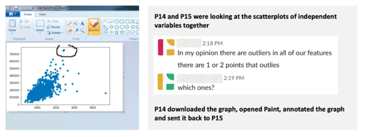

<!-- Source PDF SHA-256: 52d09ce89c98ca28f776ed58d7fec7cbc89fd23da48915bb73b03ca0074598f4 -->

# How Data Scientists Use Computational Notebooks for Real-Time Collaboration

[Source PDF](https://from.so/assets/pdfs/wang-how-data-scientists-cscw2019.pdf) · [Publisher page](https://doi.org/10.1145/3359141)

APRIL YI WANG∗, The University of Michigan, USA ANANT MITTAL, The University of Michigan, USA CHRISTOPHER BROOKS, The University of Michigan, USA STEVE ONEY, The University of Michigan, USA

Effective collaboration in data science can leverage domain expertise from each team member and thus improve the quality and efficiency of the work. Computational notebooks give data scientists a convenient interactive solution for sharing and keeping track of the data exploration process through a combination of code, narrative text, visualizations, and other rich media. In this paper, we report how synchronous editing in computational notebooks changes the way data scientists work together compared to working on individual notebooks. We first conducted a [formative survey](<#page-9>) with 195 data scientists to understand their past experience with collaboration in the context of data science. Next, we carried out an [observational study](<#page-12>) of 24 data scientists working in pairs remotely to solve a typical data science predictive modeling problem, working on either notebooks supported by synchronous groupware or individual notebooks in a collaborative setting. The study showed that working on the synchronous notebooks improves collaboration by creating a shared context, encouraging more exploration, and reducing communication costs. However, the current synchronous editing features may lead to unbalanced participation and activity interference without strategic coordination. The synchronous notebooks may also amplify the tension between quick exploration and clear explanations. Building on these findings, we propose several design implications aimed at better supporting collaborative editing in computational notebooks, and thus improving efficiency in teamwork among data scientists.

CCS Concepts: • Human-centered computing → Empirical studies in collaborative and social computing; Empirical studies in HCI.

Additional Key Words and Phrases: computational notebooks, collaborative systems, data science

© 2019 Association for Computing Machinery. 2573-0142/2019/11-ART39 $15.00 [https://doi.org/10.1145/3359141](<https://doi.org/10.1145/3359141>)

> Permission to make digital or hard copies of all or part of this work for personal or classroom use is granted without fee provided that copies are not made or distributed for profit or commercial advantage and that copies bear this notice and the full citation on the first page. Copyrights for components of this work owned by others than ACM must be honored. Abstracting with credit is permitted. To copy otherwise, or republish, to post on servers or to redistribute to lists, requires prior specific permission and/or a fee. Request permissions from permissions@acm.org.

## ACM Reference Format:

April Yi Wang, Anant Mittal, Christopher Brooks, and Steve Oney. 2019. How Data Scientists Use Computational Notebooks for Real-Time Collaboration. Proc. ACM Hum.-Comput. Interact. 3, CSCW, Article 39 (November 2019), [30](<#page-30>) pages. [https://doi.org/10.1145/3359141](<https://doi.org/10.1145/3359141>)

∗This is the corresponding author

Authors’ addresses: April Yi Wang, The University of Michigan, 105 S State St, Ann Arbor, MI, 48103, USA, aprilww@ umich.edu; Anant Mittal, The University of Michigan, 105 S State St. Ann Arbor, MI, 48103, USA, anmittal@umich.edu; Christopher Brooks, The University of Michigan, 105 S State St. Ann Arbor, MI, 48103, USA, brooksch@umich.edu; Steve Oney, The University of Michigan, 105 S State St. Ann Arbor, MI, 48103, USA, soney@umich.edu.

## 1 INTRODUCTION

The complexity of data science work and the demand to adopt data science practices in various domains has grown rapidly in the last decade. With this increase in adoption, there is a need to facilitate collaboration among data science workers, domain experts, and consumers. Data scientists often create computational narratives, which combine data, code to process those data, and natural language explanations to form a narrative. Some even consider computational narratives to be the engine of collaborative data science \[[32](<#page-28>)\]. Computational notebooks allow data scientists to create and share computational narratives. Jupyter Notebook[1](<#page-2>), a computational notebook platform that supports more than 40 programming languages, has been widely used for writing and sharing computational narratives in various contexts \[[59](<#page-29>)\]. For example, data science instructors use Jupyter notebooks to create interactive lecture notes or textbooks. Data science learners can experiment with these interactive lecture notes to deepen their understanding or explore alternative solutions \[[45](<#page-29>)\]. Researchers use Jupyter notebooks to demonstrate their computational work and share their data analysis process for open science, which makes it easy for others to reproduce the results \[[61](<#page-29>)\]. As Figure [1](<#page-2>) shows, Jupyter notebooks allow users to weave together source code, narrative text, visualization, computational outputs, and other rich media using structured cells.

Fig. 1. An example of a Jupyter notebook. (1) A custom collaborative extension for users to share their notebook. (2) A notebook cell that contains code to import libraries and load dataset. (3) An output of a shared data frame. (4) A markdown cell that contains narrative text. (5) An output of a visualization

Prior studies have revealed the challenges in constructing and sharing computational narratives through notebooks. For example, data scientists are reluctant to keep up-to-date explanatory notes, which impedes sharing and collaboration \[[63](<#page-30>)\]. Studies have also explored ways to lower the barriers for writing and sharing computational narratives: folding content selectively \[[62](<#page-30>)\]; local version control mechanisms \[[36](<#page-28>)\]; and managing and reorganizing content \[[28](<#page-28>)\]. Most of these innovations are designed and evaluated for sharing the computational narrative after it is finished, leaving data scientists to work on individual notebooks. Recently, tools like Google Colab[2](<#page-2>) have demonstrated the possibility for synchronous editing — multiple users are able to edit the same notebook and changes are updated in real-time, which may revolutionize the ways data scientists collaborate.

> 1[https://jupyter.org](<https://jupyter.org>)

> 2[https://colab.research.google.com](<https://colab.research.google.com>)

However, synchronous editing comes with its own challenges and may not always improve work efficiency. Studies have identified several issues with synchronous editing in other contexts. For example, in narrative writing, multiple users rarely synchronously edit adjacent content \[[11](<#page-27>)\], and programmers can interfere with each others’ work when using synchronous code editors \[[21](<#page-28>)\]. While many of these studies are constructed around the context of collaborative writing and programming, it remains unknown how synchronous editing in computational notebooks might work for data scientists. More specifically, we are interested in three questions:

- (1) What tools and strategies do data scientists currently use for collaboration? (2) Compared to working on individual notebooks in a collaborative setting, how does synchronous notebook editing change the way data scientists collaborate in computational notebooks? (3) What challenges, if any, do data scientists perceive in synchronous notebook editing?

To address these questions, we first conducted a [formative survey](<#page-9>) with 195 data scientists who were familiar with Jupyter notebooks. Based on the common tools and mechanisms they use for collaboration and communication, we further conducted [an observational study](<#page-12>) with 24 intermediate data scientists working in pairs remotely to solve a predictive modeling problem. To understand a broader spectrum of synchronous notebook editing, we assigned participants with different settings for collaboration, which included: (1) working on synchronized notebooks — participants worked on notebooks with synchronous editing similar to that in Google Docs, and could communicate through other tools, (2) working on individual notebooks — participants were not able to edit the same notebook, but could communicate the intermediate code and output through other tools. We also provided participants different options for communication which included: (1) text-based messaging, (2) video chat. Through this observational study we empirically probed both the benefits and challenges for the different ways of collaborating with computational notebooks.

Our key finding reveals that working on synchronized notebooks can improve the collaboration outcomes by reducing communication costs and encouraging more exploration in a shared context. However, working on synced notebooks requires participants to be more strategic when coordinating their work. Working on synced notebooks is more likely to lead to unbalanced participation where one team member does the majority of implementations and ideation. In addition, participants found other challenges in using synchronized notebooks such as interference with each other, lack of awareness, and privacy concerns. These findings suggest ways in which we need to improve the design of collaborative notebook editing tools to better foster teamwork among data scientists.

The main contributions of this work are the empirical insights we present on how data scientists collaborate using computational notebooks. These insights lead to design implications to enhance collaborative computational notebooks for fostering collaboration among data science learners and practitioners. This work extends prior work on real-time collaborative systems and is broadly applicable to understanding collaboration in exploratory and open-ended tasks.

## 2 RELATED WORK

To contextualize our studies, we draw upon prior research in collaborative data science work practices, tools and systems that extend the usability of computational notebooks, computer-mediated collaboration, and its practice in the context of writing and programming.

### 2.1 Data Science Applications and Processes

The term data science was first distinguished from pure statistics in 1997, with the notion of extracting knowledge and insights from data \[[14](<#page-27>)\]. The field of data science has grown rapidly over the last decade amidst the rise of big data and breakthroughs in technologies like machine learning that expand our capabilities for understanding data \[[12](<#page-27>)\]. According to a survey of the United States workforce on LinkedIn \[[1](<#page-27>)\], the demand for data scientists will continue to increase as more industries (e.g., finance, business, healthcare) adopt big data to make business decisions.

The process of doing data science has been categorized and discussed among statisticians, computer scientists, HCI researchers, and others (e.g., \[[22](<#page-28>), [34](<#page-28>), [40](<#page-28>), [52](<#page-29>), [55](<#page-29>)\]). O’Neil and Schutt distinguished the data science process into several iterative phases \[[55](<#page-29>)\]:

- (1) Collecting data from a variety of sources (e.g., emails, logs, and medical records) (2) Building and using pipelines for data munging (e.g., joining, scraping, and wrangling) (3) Cleaning data to ensure its validity and accuracy for analysis (e.g., manipulating duplicates, filtering outliers, and tuning missing values) (4) Exploring and hypothesizing the relationship between variables using different techniques (e.g., generating statistical summary, plotting pairwise relationships) (5) Applying machine learning algorithms or statistical models based on the type of problems (e.g., k-nearest neighbor, linear regression, and naive Bayes) (6) Finally interpreting and communicating results to different audiences (e.g., managers, coworkers, and clients)

Not all stages are required depending on the type of data science task. The exploration process can be non-sequential, as feedback from later stages may result in additional work in earlier stages. Kery and Myers \[[37](<#page-28>)\] considered data science as a practice of exploratory programming where programmers write code to experiment with ideas in an open-ended task. In particular, communication can happen back and forth in a collaborative setting, while collaboration patterns may vary between stages.

### 2.2 Collaboration in Data Science

Prior research has found that data scientists in software companies often work collaboratively \[[40](<#page-28>)\]. For example, some data science teams have adopted a triangular structure where they divide the task into collecting data, cleaning data, and analyzing data. However, collaboration in data science can be challenging. Transferring findings from data science work to business actions requires successful communication between data scientists and stakeholders who are usually non-technical professionals \[[57](<#page-29>)\]. Kandel et al. \[[34](<#page-28>)\] revealed that collaboration between data scientists rarely happens in domains like marketing and finance. One major reason is that the diversity of tools and programming languages has made it laborious to share intermediate code, especially when it is not well documented. Correspondingly, Kery and Myers \[[37](<#page-28>)\] addressed the difficulty of maintaining a shared understanding of the exploration progress since the intermediate code and data artifacts can be experimental and messy. Nonetheless, with the growing demand for data analysis, efficient collaboration between data scientists will become increasingly important and challenging. Building upon the work of Kandel et al. \[[34](<#page-28>)\], and Kery and Myers \[[37](<#page-28>)\], our study further investigates the benefits and trade-offs of mechanisms that enable real-time collaboration and communication in data science work.

### 2.3 Computational Narratives, Computational Notebooks, and Innovations

Data science involves a large amount of experimentation and subjective decision making. Thus, it is important for data scientists to document the story behind the computation of results (e.g., reporting alternative solutions and explaining the limitations for them). A variety of media such as textual explanations, graphs, forms, interactive visualizations, code segments, and output are used for narrative and storytelling to document the data analysis process. Extending Knuth’s idea of literate programming, wherein he argues that making programming sources more understandable to human beings can be achieved by combining a programming language with a documentation language \[[41](<#page-29>)\], computational narratives serve as literature for data scientists and data science consumers to present work and exchange ideas.

#### 2.3.1 Computational Notebooks.

Researchers and practitioners have long explored approaches for creating and sharing digital documents for data analysis (e.g., \[[9](<#page-27>), [24](<#page-28>), [66](<#page-30>)\]). Establishing a common format for documenting data analysis can make it easier to present, reproduce, share, and collaborate. One approach is to capture digital assets (e.g., code, output, documentation) and computational environments (e.g., browsing, UI interaction, file versioning) from the OS level \[[24](<#page-28>)\]. Another approach integrates digital components (e.g., text-based lab notes, emails, web pages) into a combined entry \[[66](<#page-30>)\]. Yet, the most popular tools for data scientists are computational notebooks — web-based platforms that allow users to write and execute code, inspect output, and integrate text annotations, figures, interactive visualization, and other rich media (e.g., Apache Zeppelin[3](<#page-5>), Spark Notebook[4](<#page-5>), Observable[5](<#page-5>), and Jupyter Notebook).

#### 2.3.2 Jupyter Notebook.

Project Jupyter evolved from IPython \[[58](<#page-29>)\], a terminal-based interactive shell that originally designed for creating interactive visualizations for scientific computing. Wrapping IPython as the kernel, Project Jupyter is designed as a web-based platform for authoring a single document that combines code cells and intermediate results. The evolution of Project Jupyter is influenced by the rise of data science. Data science is exploratory and fluid, and the process benefits from creating reproducible computational narratives for iterative exploration and interactive inspect of intermediate results. Jupyter Notebook is an open source project that is also extensible through optional add-ons. As Figure [1](<#page-2>) shows, Jupyter notebooks consist of “cells” — typically small chunks of code or narrative text in the Markdown format. Users can execute cells (typically, but not necessarily, from top to bottom) and observe their outputs, which can include visualizations, data frames, or rendered narrative text.

Most other notebook platforms have a very similar user interface to Jupyter but differ in the programming languages they support (Jupyter uses Python by default but its architecture can support other languages). Other computational notebook platforms include Observable (which uses JavaScript), RStudio[6](<#page-5>) (which uses R Markdown), Wolfram Notebooks[7](<#page-5>) (which uses the Wolfram Programming Languages), and Zeppelin (which allows multiple programming languages to be used in the same notebook). Some notebook platforms use a different computational architectures. For example, some notebook platforms enable reactive notebooks that automatically run cells when necessary (as opposed to requiring that users run cells manually, as Jupyter does). For example, Observable notebooks run cells in “topological” order—data dependencies between cells are tracked and changing a cell automatically re-runs other cells that depend on its result. Compared to other notebook services, Jupyter has a larger community of users given its’ long history and prevalence among different contexts. Jupyter also has more customized extensions because of its large community.

> 3[https://zeppelin.apache.org](<https://zeppelin.apache.org>)

> 4[http://spark-notebook.io](<http://spark-notebook.io>)

> 5[https://observablehq.com](<https://observablehq.com>)

> 6[https://www.rstudio.com/](<https://www.rstudio.com/>)

> 7[http://www.wolfram.com/notebooks/](<http://www.wolfram.com/notebooks/>)

Jupyter has become one of the most popular tools for data related work among academia, industry, and data science education \[[59](<#page-29>)\], even earning the 2017 ACM Software System Award \[[33](<#page-28>)\]. Studies have found that Jupyter is popular in a variety of settings. Kross and Guo \[[45](<#page-29>)\] interviewed practitioners who taught data science and found that Jupyter notebooks have been widely used by instructors to deliver course materials. They also found that Jupyter notebooks allow students to easily write computational narratives with a low cost for setting up an environment. Kery et al. studied how professional data scientists used Jupyter notebooks in their daily work to create computational narratives \[[39](<#page-28>)\]. Randles et al. \[[61](<#page-29>)\] investigated how Jupyter notebooks can be used for open science under the principles of Findable, Accessible, Interoperable, Reusable (FAIR). In fact, some academic venues encourage paper authors to include notebooks with their submissions (e.g., the Distill Journal[8](<#page-6>) in the area of machine learning).

However, studies have identified several limitations with computational notebooks \[[39](<#page-28>), [63](<#page-30>), [64](<#page-30>)\]. Rule et al. conducted a large scale analysis of over 1 million open-source computational notebooks and found that only one in four held explanatory text \[[63](<#page-30>)\]. Kery et al. interviewed 21 data scientists to study their coding behaviors using computational notebooks and highlighted the challenges of tracking history of experimentation \[[39](<#page-28>)\]. Both studies revealed the tension between using computational notebooks for rapid exploration and instructive explanation. For quick exploration, data scientists sometimes generate messy and informal notebooks, which can be difficult for others (or even the author) to read later on \[[63](<#page-30>)\]. Data scientists have to use strategies like actively pausing the experiment to curate and clean notebooks into narratives, which may hinder the exploration process \[[39](<#page-28>)\]. The tension between quick exploration and instructive explanation can be contextually sensitive depending on how exploratory and open-ended the task is. Building upon current computational notebooks, other systems have explored designs to better support non-linear exploration in notebooks. For instance, Kery et al. integrated a lightweight local versioning mechanism to help data scientists keep track of their exploration history \[[35](<#page-28>), [36](<#page-28>), [38](<#page-28>)\], while Rule et al. took a different approach to enable data scientists to fold content blocks with annotations in notebooks \[[62](<#page-30>)\]. Head et al. explored code gathering extensions for data scientists to manage and navigate through cluttered and inconsistent notebooks \[[28](<#page-28>)\], and Zhang and Guo \[[73](<#page-30>)\] created DS.js to transform any webpage to a computational notebook, lowering the barrier for novices to retrieve data for exploration. Companies have also built innovations on the notebook infrastructure to support various data related tasks in practice. For example, the Netflix data team \[[5](<#page-27>)\] developed nteract[9](<#page-6>), with extra features for data explorations; Papermill[10](<#page-6>), which facilitates rapid exploration by spawning notebooks for different parameter sets; and Commuter[11](<#page-6>)— a platform for curating and sharing notebooks.

The tools mentioned above focus on the use of computational notebooks for individual authoring. Recently, tools like Google Colab[12](<#page-6>) have further fostered collaborative data science by allowing multiple users to edit the same notebook in real time. However, prior studies on computational notebooks have only inspected individuals authoring the notebooks, not yet multiple data scientists collaboratively authoring the notebooks. Only recently, Koesten et al. \[[42](<#page-29>)\] interviewed data practitioners about their collaborative practices with structured data. They synthesized collaboration needs across a wide range of scenarios from co-creation data analysis to reusing others’ data in a new context. Our work takes a different scope to investigate real-time collaborative editing in computational notebooks. We aim to understand whether collaborative editing would help collaborators maintain a shared understanding or rather intensify the tension between exploration and explanation. In our discussion, we propose suggestions to improve the current design of real-time collaborative editing features to better support collaborative data science.

> 8[https://distill.pub/journal](<https://distill.pub/journal>)

> 9[https://github.com/nteract/nteract](<https://github.com/nteract/nteract>)

> 10[https://github.com/nteract/papermill](<https://github.com/nteract/papermill>)

> 11[https://github.com/nteract/commuter](<https://github.com/nteract/commuter>)

> 12[https://colab.research.google.com](<https://colab.research.google.com>)

### 2.4 Collaborative Systems

Since the late 1980s, work has explored different forms of computer-mediated collaboration \[[44](<#page-29>), [48](<#page-29>), [51](<#page-29>)\], evaluations of collaborative systems \[[27](<#page-28>), [46](<#page-29>)\], and principles for designing computer-based collaborative tools \[[18](<#page-27>), [43](<#page-29>)\]. One critical aspect for collaborative systems is supporting group awareness \[[15](<#page-27>), [25](<#page-28>), [46](<#page-29>)\]. Presenting awareness information in a group facilitates collaboration by maintaining a shared mental model among collaborators, by reducing communication costs, and thus improving the usability of real-time distributed groupware systems \[[25](<#page-28>)\]. To aid the design of groupware systems, Gutwin and Greenburg have specifically examined collaboration in small groups and proposed a conceptual framework to describe various aspects of workplace awareness \[[26](<#page-28>)\]. The framework has addressed how people gather and use workplace awareness information for collaboration and issues around awareness information. Our studies also shed light on the common awareness mechanisms (e.g., shared cursor information, shared editors) in real-time collaborative notebooks. Existing real-time collaborative notebooks such as Google Colab migrate these common awareness mechanisms from collaborative writing systems like Google Docs. However, these mechanisms may be limited for collaborative data science given the differences between the nature and complexity of tasks. For example, data scientists may want more awareness information on whether their collaborators are modifying a data frame — the instance of data in a structured format. To understand how these mechanisms support collaboration in other contexts, we surveyed studies on collaborative writing, coding, and visual analytics practice below.

#### 2.4.1 Collaborative Writing.

With the emergence of early collaborative writing systems (e.g., SASSE \[[2](<#page-27>), [50](<#page-29>)\], ShrEdit \[[53](<#page-29>)\]), researchers have developed theoretical frameworks and taxonomies for issues around collaborative writing \[[49](<#page-29>), [60](<#page-29>)\]. Posner and Baecker synthesized common roles, activities, and writing strategies in collaborative writing \[[60](<#page-29>)\]. In particular, they have discussed five writing strategies in the joint writing process:

- Single writer: one team member writes the document with minimal assistance from others

- Scribe strategy: one team member writes the document while the others engage in the ideation process

- Separate writers: dividing the document into parts and have different individuals writing the various parts

- Joint writing: group members write the document closely together

- Consulted strategy: a combination of the other writing strategies that involves with a consultant throughout the project

More recent studies have revisited how people write together using modern collaborative writing tools like Google Docs (e.g., \[[4](<#page-27>), [11](<#page-27>), [54](<#page-29>), [69](<#page-30>), [72](<#page-30>)\]). For example, Yim et al. \[[72](<#page-30>)\] explored styles of synchronous writing by analyzing 45 Google Docs documents and found that students tended to produce higher quality documents when they worked in divide and conquer mode with balanced participation.

A recent analysis of usage patterns in Etherpad (a collaborative editing system) revealed that users rarely edited near-by document parts simultaneously in practice \[[11](<#page-27>)\]. For instance, roughly half of the Etherpad documents retrieved from a public platform only had one author. For the other half, in most cases, authors took turns editing documents asynchronously. Correspondingly, Wang et al. interviewed 30 users and surprisingly found that users were reluctant to write together when they were collaboratively constructing a document \[[69](<#page-30>)\]. For example, role structure and concomitant power differentials may hold users back from writing together; the co-editing environment may blur the accountability and credit of contribution; there might be a social embarrassment to be watched by others when typing. These findings triggered our interest in understanding how data scientists perceived writing a computational narrative in a collaborative setting. Furthermore, studies on collaborative editing inspired our study design to observe collaboration in a given time limit (e.g., \[[72](<#page-30>)\], \[[4](<#page-27>)\]). Although data scientists may not always need to work in the same notebook simultaneously in the real world, understanding and supporting synchronous collaboration on computational notebooks is still valuable and important as a first step to understand other forms of collaborations.

#### 2.4.2 Collaborative Programming.

Collaborative programming among geographically distributed teams is a broadly studied topic of Software Engineering and HCI research. Built upon discussions on coordination and management strategies in software engineering process (e.g., \[[3](<#page-27>), [30](<#page-28>), [65](<#page-30>), [68](<#page-30>)\]), researchers have explored various technical interventions that enable real-time collaborative programming (e.g., \[[7](<#page-27>), [8](<#page-27>), [13](<#page-27>), [16](<#page-27>), [21](<#page-28>), [23](<#page-28>), [47](<#page-29>), [56](<#page-29>), [70](<#page-30>)\]). For example, the system ATCoPE integrated version control support in real-time collaborative Integrated Development Environments (IDEs) \[[16](<#page-27>)\]; Lee et al. explored the subtasks model for collaborative code editors \[[47](<#page-29>)\]. Studies also addressed issues that impeded collaboration. Apart from what is discussed in collaborative writing practice \[[11](<#page-27>), [69](<#page-30>)\], Goldman addressed a problem that one person’s compilation error may completely block others’ work \[[20](<#page-28>)\]. Goldman further examined different roles in collaborative programming \[[19](<#page-28>)\], and designed an asymmetric, role-based environment to alleviate conflicts in real-time collaborative software development \[[21](<#page-28>)\].

Wilson et al. \[[71](<#page-30>)\] studied the benefits of pairing for programming tasks and found it led to better problem-solving. Pair programming—where two programmers work together at one work station and take turns to write and review code—later became popular in software development practice \[[6](<#page-27>)\]. Another common scenario for real-time collaborative programming is tutoring, where tutors help learners with debugging through shared computational environments. Warner and Guo integrated features like bug reporting and version control management in the real-time collaborative system CodePilot \[[70](<#page-30>)\] to help novice programmers. Guo designed Codeopticon \[[23](<#page-28>)\], which allowed tutors to monitor the programming environments of multiple learners at scale. Codeon \[[7](<#page-27>), [8](<#page-27>)\] embedded an on-demand help requests component within an IDE and shared related code contexts to remote helpers. Oney et al. further introduced a deictic code referencing module that tracks code history and allows users to make inline references for chat messages \[[56](<#page-29>)\]. These systems have all been designed or evaluated in the educational context. Similarly, our study of supporting real-time collaborative editing in computational notebooks can explicitly benefit data science novices and students.

#### 2.4.3 Collaborative Visualization.

Visual analytics, which uses visual information to support sense-making, is a powerful tool for data science. Most visual analysis systems (e.g., Tableau[13](<#page-8>)) are designed to support code-free exploration through interactive user interfaces. Studies in the area of information visualization have shed light on the benefits and challenges of collaborative visualization. As defined by Isenberg et al. \[[31](<#page-28>)\], collaborative visualization is “the shared use of visual representations of data by multiple users with the goal of joint information processing”. Collaborative visualization can be distinguished from collaborative data science as it highlights the perspective on joint viewing, interacting, discussing and interpreting the data representation.

13[https://www.tableau.com](<https://www.tableau.com>)

Visualization research has also explored different types of collaboration scenarios: collocated collaboration through large displays and shared workspaces, distributed collaboration through real-time shared displays. In particular, Heer and Agrawala \[[29](<#page-28>)\] discussed issues for designing asynchronous collaboration systems for visual analytics (e.g., building common ground and awareness, designing reference and deixis, maintaining group dynamics, and establishing group consensus).

## 3 OVERVIEW OF THE METHODOLOGY

This project investigates three research questions:

- RQ1 What tools and strategies do data scientists currently use for collaboration? RQ2 Compared to working on individual notebooks in a collaborative setting, how does synchronous notebook editing change the way data scientists collaborate in computational notebooks?

RQ3 What challenges, if any, do data scientists perceive in synchronous notebook editing?

To understand tools and strategies data scientists currently used in practice (RQ1), we first conducted a survey with 195 data scientists/data science students who came from diverse backgrounds. We summarized the tools they used for programming, communication, and project management, as well as their strategies for collaboration. In particular, we identified two approaches for data scientists to collaborate: 1) the traditional collaboration setting where team members work on individual Jupyter Notebook and update each others’ work asynchronously, and 2) the emerging collaboration setting where team members work closely together on a shared Jupyter Notebook and all the edits are synchronized in real-time.

To further compare how data scientists’ collaboration styles varied between two approaches (RQ2), we conducted an observational study with 24 intermediate data scientists working in pairs remotely to solve a predictive modeling problem. We summarized the common collaboration styles that emerged in the two collaboration settings. We reported the comparison of communication styles, performance, and perceptions of the collaboration experience. We also analyzed the challenges that participants faced in using real-time collaborative editing features (RQ3).

## 4 STUDY 1: FORMATIVE SURVEY ON COLLABORATIVE DATA SCIENCE

We conducted a formative survey to investigate data scientists’ previous experiences with collaboration. In particular, we aimed to understand the tools they used for programming, communication, and project management, as well as their strategies for collaboration.

We sent the survey to data science interest groups in a university and to individuals who completed a specialization course on Coursera that teaches data science using Python. Respondents had to meet the following criteria to take the survey: (1) be familiar with Python and Jupyter notebooks, (2) have formal training in data science, and (3) have worked individually on at least one data science project. To motivate participation, we randomly picked two respondents and rewarded them each a $25 gift card.

### 4.1 The Survey Instrument

The online survey consisted of four sections: (1) informed consent, (2) demographics and data science experience, (3) experience with collaborative data science, and (4) willingness to participate in [the observational study](<#page-12>).

In the first section, we explained the purpose of the survey and collected respondents’ consent. The second section asked about demographics (age, gender, educational background, job role), experience with data science (e.g., what techniques they have used or learned in the past), and degrees of identification as the given roles: computer scientists, software engineers, data scientists, and statistician analysts. In the third section, we asked respondents to recall their most recent experience of working with other people on a data science project. If respondents did not have any experience in collaboration, we provided them a hypothetical scenario:

“Imagine you are participating remotely at a 2-day long data science hackathon with 2 other team members on a predictive modeling problem.”

Respondents were then asked to provide more details about the project, for example, describing the context of the project (e.g., purpose, problem, and dataset), and selecting activities that are involved in the project (e.g., collecting data, sampling data, feature selection, data visualization). In addition, respondents were asked to list the tools they have used when collaborating with others on data science projects for the purposes of programming, communication, and project management. Followed by an open-ended question, we asked their strategies for keeping a shared understanding across the team. In the last section, we asked whether respondents would be willing to participate in an [observational study](<#page-12>). We collected the names and e-mail addresses of participants that indicated they were willing to participate.

### 4.2 Data Analysis

We first filtered the responses by deleting incomplete entries and merging duplicated entries from the same respondents. For the open-ended questions, we took an inductive analysis approach to explore themes for each question. Four coders worked individually on a small sample of the responses and developed a list of potential codes. After discussing and merging the coding scheme, we coded the same sample independently. We then compared the result by computing a Fleiss’ Kappa score to measure both the reliability of the coding scheme and the agreement among the coders. We iterated on the coding scheme until an appropriate level of agreement was achieved among the four coders (Fleiss’s kappa, κ = 0.74).

## 5 KEY FINDINGS FROM STUDY 1

We reported the key findings from the formative survey study.

### 5.1 Data Overview

The survey received 195 valid responses in total (23.08% female and 76.92% male). Among 195 responses, 35 are from data science interest groups in a university and 160 are from individuals who completed a data science specialization course on Coursera. The majority of respondents (73.8%) were age 20–40. Respondents came from a variety of job roles: students (29.74%), data scientists (25.13%), software engineers including Information Technology (IT), system architecture (14.87%), researchers (9.74%), managers including CEOs, VPs, and product managers (9.23%), business analysts (8.20%) and others (3.09%, e.g., drilling engineer).

The respondents were generally well trained in data science. The majority of them (94.36%) held or were pursuing a bachelor or higher degree. Most of these degrees are in technical fields (e.g., computer science, information science, electrical engineering, applied science, or data science). When asked about their previous experience in applying common techniques in data sciences, the respondents indicated they were skilled in linear regression (96.92%), decision trees (92.31%), SVMs (85.64%), neural networks (82.05%), non-linear regression (70.26%), deep learning (65.13%), Bayesian modeling (62.56%), and other advanced techniques (e.g., XGBoost, reinforcement learning).

The respondents also reported engaging in a variety of data science activities: data cleaning (67.69%), applying machine learning algorithms (57.95%), data visualization (52.82%), exploratory data analysis (49.74%), collecting raw data (44.10%), writing a report (38.97%), feature selection (38.46%), applying statistical models (31.28%), doing an oral presentation (31.28%), data sampling (28.20%), hypothesis testing (22.56%), and building data products (21.03%).

<table>
  <thead>
    <tr>
      <th id="pdf-table-1143:0-fba4c731-table-11-2-0-0-53dd91a3" scope="col" data-pdf-scope="Both">Purpose</th>
      <th id="pdf-table-1143:0-fba4c731-table-11-2-0-1-a709e683" scope="col" data-pdf-scope="Both" headers="pdf-table-1143:0-fba4c731-table-11-2-0-0-53dd91a3">Tool</th>
      <th id="pdf-table-1143:0-fba4c731-table-11-2-0-2-c2ccb6d0" scope="col" headers="pdf-table-1143:0-fba4c731-table-11-2-0-0-53dd91a3 pdf-table-1143:0-fba4c731-table-11-2-0-1-a709e683">Percent</th>
    </tr>
  </thead>
  <tbody>
    <tr>
      <th id="pdf-table-1143:0-fba4c731-table-11-2-1-0-d9b81235" scope="row" rowspan="4" headers="pdf-table-1143:0-fba4c731-table-11-2-0-0-53dd91a3">Programming</th>
      <th id="pdf-table-1143:0-fba4c731-table-11-2-1-1-a553e9d4" scope="row" headers="pdf-table-1143:0-fba4c731-table-11-2-0-1-a709e683 pdf-table-1143:0-fba4c731-table-11-2-1-0-d9b81235">Jupyter Notebooks</th>
      <td headers="pdf-table-1143:0-fba4c731-table-11-2-0-2-c2ccb6d0 pdf-table-1143:0-fba4c731-table-11-2-1-0-d9b81235 pdf-table-1143:0-fba4c731-table-11-2-1-1-a553e9d4">88.72%</td>
    </tr>
    <tr>
      <th id="pdf-table-1143:0-fba4c731-table-11-2-2-1-8bcb0704" scope="row" headers="pdf-table-1143:0-fba4c731-table-11-2-0-1-a709e683 pdf-table-1143:0-fba4c731-table-11-2-1-0-d9b81235">IDEs (e.g., RStudio, PyCharm)</th>
      <td headers="pdf-table-1143:0-fba4c731-table-11-2-0-2-c2ccb6d0 pdf-table-1143:0-fba4c731-table-11-2-1-0-d9b81235 pdf-table-1143:0-fba4c731-table-11-2-2-1-8bcb0704">51.79%</td>
    </tr>
    <tr>
      <th id="pdf-table-1143:0-fba4c731-table-11-2-3-1-980cfbe6" scope="row" headers="pdf-table-1143:0-fba4c731-table-11-2-0-1-a709e683 pdf-table-1143:0-fba4c731-table-11-2-1-0-d9b81235">Code Editors (e.g., Atom, Sublime)</th>
      <td headers="pdf-table-1143:0-fba4c731-table-11-2-0-2-c2ccb6d0 pdf-table-1143:0-fba4c731-table-11-2-1-0-d9b81235 pdf-table-1143:0-fba4c731-table-11-2-3-1-980cfbe6">46.15%</td>
    </tr>
    <tr>
      <th id="pdf-table-1143:0-fba4c731-table-11-2-4-1-357335cd" scope="row" headers="pdf-table-1143:0-fba4c731-table-11-2-0-1-a709e683 pdf-table-1143:0-fba4c731-table-11-2-1-0-d9b81235">Google Colab</th>
      <td headers="pdf-table-1143:0-fba4c731-table-11-2-0-2-c2ccb6d0 pdf-table-1143:0-fba4c731-table-11-2-1-0-d9b81235 pdf-table-1143:0-fba4c731-table-11-2-4-1-357335cd">12.31%</td>
    </tr>
    <tr>
      <th id="pdf-table-1143:0-fba4c731-table-11-2-5-0-07871493" scope="row" rowspan="5" headers="pdf-table-1143:0-fba4c731-table-11-2-0-0-53dd91a3">Communication</th>
      <th id="pdf-table-1143:0-fba4c731-table-11-2-5-1-7472f3be" scope="row" headers="pdf-table-1143:0-fba4c731-table-11-2-0-1-a709e683 pdf-table-1143:0-fba4c731-table-11-2-5-0-07871493">E-mail</th>
      <td headers="pdf-table-1143:0-fba4c731-table-11-2-0-2-c2ccb6d0 pdf-table-1143:0-fba4c731-table-11-2-5-0-07871493 pdf-table-1143:0-fba4c731-table-11-2-5-1-7472f3be">79.49%</td>
    </tr>
    <tr>
      <th id="pdf-table-1143:0-fba4c731-table-11-2-6-1-1a828d48" scope="row" headers="pdf-table-1143:0-fba4c731-table-11-2-0-1-a709e683 pdf-table-1143:0-fba4c731-table-11-2-5-0-07871493">Face-to-face Communication</th>
      <td headers="pdf-table-1143:0-fba4c731-table-11-2-0-2-c2ccb6d0 pdf-table-1143:0-fba4c731-table-11-2-5-0-07871493 pdf-table-1143:0-fba4c731-table-11-2-6-1-1a828d48">68.72%</td>
    </tr>
    <tr>
      <th id="pdf-table-1143:0-fba4c731-table-11-2-7-1-10812b14" scope="row" headers="pdf-table-1143:0-fba4c731-table-11-2-0-1-a709e683 pdf-table-1143:0-fba4c731-table-11-2-5-0-07871493">Instant Messaging</th>
      <td headers="pdf-table-1143:0-fba4c731-table-11-2-0-2-c2ccb6d0 pdf-table-1143:0-fba4c731-table-11-2-5-0-07871493 pdf-table-1143:0-fba4c731-table-11-2-7-1-10812b14">55.90%</td>
    </tr>
    <tr>
      <th id="pdf-table-1143:0-fba4c731-table-11-2-8-1-e705af4e" scope="row" headers="pdf-table-1143:0-fba4c731-table-11-2-0-1-a709e683 pdf-table-1143:0-fba4c731-table-11-2-5-0-07871493">Google Docs</th>
      <td headers="pdf-table-1143:0-fba4c731-table-11-2-0-2-c2ccb6d0 pdf-table-1143:0-fba4c731-table-11-2-5-0-07871493 pdf-table-1143:0-fba4c731-table-11-2-8-1-e705af4e">40.51%</td>
    </tr>
    <tr>
      <th id="pdf-table-1143:0-fba4c731-table-11-2-9-1-ea1fd3a3" scope="row" headers="pdf-table-1143:0-fba4c731-table-11-2-0-1-a709e683 pdf-table-1143:0-fba4c731-table-11-2-5-0-07871493">Video Conferencing</th>
      <td headers="pdf-table-1143:0-fba4c731-table-11-2-0-2-c2ccb6d0 pdf-table-1143:0-fba4c731-table-11-2-5-0-07871493 pdf-table-1143:0-fba4c731-table-11-2-9-1-ea1fd3a3">38.46%</td>
    </tr>
    <tr>
      <th id="pdf-table-1143:0-fba4c731-table-11-2-10-0-a44da83e" scope="row" rowspan="3" headers="pdf-table-1143:0-fba4c731-table-11-2-0-0-53dd91a3">Project Management</th>
      <th id="pdf-table-1143:0-fba4c731-table-11-2-10-1-2b58e745" scope="row" headers="pdf-table-1143:0-fba4c731-table-11-2-0-1-a709e683 pdf-table-1143:0-fba4c731-table-11-2-10-0-a44da83e">Version Control (e.g., Github, Bitbucket)</th>
      <td headers="pdf-table-1143:0-fba4c731-table-11-2-0-2-c2ccb6d0 pdf-table-1143:0-fba4c731-table-11-2-10-0-a44da83e pdf-table-1143:0-fba4c731-table-11-2-10-1-2b58e745">49.74%</td>
    </tr>
    <tr>
      <th id="pdf-table-1143:0-fba4c731-table-11-2-11-1-c5637e69" scope="row" headers="pdf-table-1143:0-fba4c731-table-11-2-0-1-a709e683 pdf-table-1143:0-fba4c731-table-11-2-10-0-a44da83e">Task Tracking (e.g., Trello, Jira)</th>
      <td headers="pdf-table-1143:0-fba4c731-table-11-2-0-2-c2ccb6d0 pdf-table-1143:0-fba4c731-table-11-2-10-0-a44da83e pdf-table-1143:0-fba4c731-table-11-2-11-1-c5637e69">21.03%</td>
    </tr>
    <tr>
      <th id="pdf-table-1143:0-fba4c731-table-11-2-12-1-e998ec61" scope="row" headers="pdf-table-1143:0-fba4c731-table-11-2-0-1-a709e683 pdf-table-1143:0-fba4c731-table-11-2-10-0-a44da83e">Shared Storage Services (e.g., Google Drive, Dropbox)</th>
      <td headers="pdf-table-1143:0-fba4c731-table-11-2-0-2-c2ccb6d0 pdf-table-1143:0-fba4c731-table-11-2-10-0-a44da83e pdf-table-1143:0-fba4c731-table-11-2-12-1-e998ec61">3.07%</td>
    </tr>
  </tbody>
</table>

Table 1. The tools that respondents have used for programming, communication and project management during collaboration.

### 5.2 Experience with Collaborative Data Science

When asked about their previous experience in collaborative data science, most respondents (73.3%) reported that they had prior experience collaborating with other people on a data science project. Of the respondents who had previous collaboration experience, most (72.72%) collaborated on a data science project for work, while the others mentioned other purposes such as course projects (30.07%), competitions or hackathons (18.89%), or personal side projects (13.20%).

#### 5.2.1 Choices of Tools.

We asked respondents to list the tools they have used for programming, communication and project management during collaboration. For respondents who do not have or can not remember their past collaboration experience (26.7%), we gave them a scenario of participating in a data hackathon in teams and asked about their choices of tools and collaboration strategies. For programming purposes, most respondents mentioned Jupyter notebooks (88.72%), IDEs (51.79%), and code editors (46.15%). In addition, some respondents mentioned Google Colab (12.31%), a computational narrative environment which is an alternative to, but similar to, Jupyter notebooks. For communication purposes, e-mails (79.49%) and face-to-face communication (68.72%) are most mentioned by respondents, followed by instant messaging (55.90%), Google Docs (40.51%) and video conferencing tools (38.46%). For project management tasks, roughly half of respondents mentioned version control suites (49.74%) such as Github and Bitbucket for sharing code and datasets. Several respondents also mentioned using shared storage services such as Google Drive and Dropbox for managing project assets. Some respondents mentioned task tracking tools (21.03%) such as Trello and Jira. Respondents also mentioned using Google Calendar, spreadsheets, or physical whiteboards to keep track of tasks and project progress. Our results are summarized in Table [1](<#page-11>).

#### 5.2.2 Strategies for Keeping a Shared Understanding.

When asked about their strategies for keeping a shared understanding across team members, most respondents mentioned regular discussions and project meetings (54.36%). For example, respondents mentioned “weekly meetings with the team to follow up the stages of deployment”, and also frequently reported that they used check-ups (51.79%) such as keeping the other team members informed of any changes made to the code. Some of these respondents reported that they would work closely in a physical space to reduce the communication cost by talking face-to-face. Documenting (48.20%) is another common strategy used for collaboration. For example, respondents mentioned that they would keep all the intermediate findings in shared Google Docs. Some respondents also mentioned coordination strategies such as planning ahead and being clear about everyone’s responsibility (28.72%). In addition, respondents mentioned that they would share any intermediate results and code using version control tools or shared folders (25.13%). The others mentioned strategies such as code reviews to help them maintain a shared understanding. The results are summarized in Table [2](<#page-12>).

<table>
  <thead>
    <tr>
      <th id="pdf-table-1198:0-afd2fc88-table-12-2-0-0-d8e8a3b8" scope="col" data-pdf-scope="Both">Strategy</th>
      <th id="pdf-table-1198:0-afd2fc88-table-12-2-0-1-48ea48ae" scope="col" headers="pdf-table-1198:0-afd2fc88-table-12-2-0-0-d8e8a3b8">Percent</th>
      <th id="pdf-table-1198:0-afd2fc88-table-12-2-0-2-fbf1addc" scope="col" headers="pdf-table-1198:0-afd2fc88-table-12-2-0-0-d8e8a3b8">Example Response</th>
    </tr>
  </thead>
  <tbody>
    <tr>
      <th id="pdf-table-1198:0-afd2fc88-table-12-2-1-0-7f22c84b" scope="row" headers="pdf-table-1198:0-afd2fc88-table-12-2-0-0-d8e8a3b8">Discussions and meetings</th>
      <td headers="pdf-table-1198:0-afd2fc88-table-12-2-0-1-48ea48ae pdf-table-1198:0-afd2fc88-table-12-2-1-0-7f22c84b">54.36%</td>
      <td headers="pdf-table-1198:0-afd2fc88-table-12-2-0-2-fbf1addc pdf-table-1198:0-afd2fc88-table-12-2-1-0-7f22c84b">There were weekly meeting among team members to keep track of the progress of each element of the project</td>
    </tr>
    <tr>
      <th id="pdf-table-1198:0-afd2fc88-table-12-2-2-0-95eb0940" scope="row" headers="pdf-table-1198:0-afd2fc88-table-12-2-0-0-d8e8a3b8">Frequently check-ups</th>
      <td headers="pdf-table-1198:0-afd2fc88-table-12-2-0-1-48ea48ae pdf-table-1198:0-afd2fc88-table-12-2-2-0-95eb0940">51.79%</td>
      <td headers="pdf-table-1198:0-afd2fc88-table-12-2-0-2-fbf1addc pdf-table-1198:0-afd2fc88-table-12-2-2-0-95eb0940">Communicate actively and frequently; check-up on every hour</td>
    </tr>
    <tr>
      <th id="pdf-table-1198:0-afd2fc88-table-12-2-3-0-788caf22" scope="row" headers="pdf-table-1198:0-afd2fc88-table-12-2-0-0-d8e8a3b8">Documentation</th>
      <td headers="pdf-table-1198:0-afd2fc88-table-12-2-0-1-48ea48ae pdf-table-1198:0-afd2fc88-table-12-2-3-0-788caf22">48.20%</td>
      <td headers="pdf-table-1198:0-afd2fc88-table-12-2-0-2-fbf1addc pdf-table-1198:0-afd2fc88-table-12-2-3-0-788caf22">Keep notes in Google Docs; ... comments in code;</td>
    </tr>
    <tr>
      <th id="pdf-table-1198:0-afd2fc88-table-12-2-4-0-a4b176a8" scope="row" headers="pdf-table-1198:0-afd2fc88-table-12-2-0-0-d8e8a3b8">Organization</th>
      <td headers="pdf-table-1198:0-afd2fc88-table-12-2-0-1-48ea48ae pdf-table-1198:0-afd2fc88-table-12-2-4-0-a4b176a8">28.72%</td>
      <td headers="pdf-table-1198:0-afd2fc88-table-12-2-0-2-fbf1addc pdf-table-1198:0-afd2fc88-table-12-2-4-0-a4b176a8">Divide up the work into definable parts, make sure that everyone knows the progress that everyone else has made and how it impacts their part of the project</td>
    </tr>
    <tr>
      <th id="pdf-table-1198:0-afd2fc88-table-12-2-5-0-0934cda5" scope="row" headers="pdf-table-1198:0-afd2fc88-table-12-2-0-0-d8e8a3b8">Shared Assets</th>
      <td headers="pdf-table-1198:0-afd2fc88-table-12-2-0-1-48ea48ae pdf-table-1198:0-afd2fc88-table-12-2-5-0-0934cda5">25.13%</td>
      <td headers="pdf-table-1198:0-afd2fc88-table-12-2-0-2-fbf1addc pdf-table-1198:0-afd2fc88-table-12-2-5-0-0934cda5">Common repository for files; share the same place for storing project, and name the file clearly</td>
    </tr>
    <tr>
      <th id="pdf-table-1198:0-afd2fc88-table-12-2-6-0-ab217164" scope="row" headers="pdf-table-1198:0-afd2fc88-table-12-2-0-0-d8e8a3b8">Others</th>
      <td headers="pdf-table-1198:0-afd2fc88-table-12-2-0-1-48ea48ae pdf-table-1198:0-afd2fc88-table-12-2-6-0-ab217164">5.01%</td>
      <td headers="pdf-table-1198:0-afd2fc88-table-12-2-0-2-fbf1addc pdf-table-1198:0-afd2fc88-table-12-2-6-0-ab217164">Code review to ensure code matched intent; all worked in a friendly manner</td>
    </tr>
  </tbody>
</table>

Table 2. Strategies for keeping a shared understanding

### 5.3 High-Level Summary of Findings

In summary, respondents to our survey were made up of a variety of practitioners and students who are well trained in data science and are familiar with Python and Jupyter notebooks. Most respondents had previous experience in collaborating with others on a data science project, and working in individual Jupyter notebooks with version control tools was the most popular setting for collaboration. Team members constantly discuss and keep everyone informed about the progress of the project, as well as maintain shared notes. Although Google Colab was relatively new and was not be used by many respondents, several respondents mentioned Google Colab as an option for collaborative editing. With this more holistic understanding of collaboration among data scientists, we decided to narrow our focus and probe into the differences afforded by traditional collaboration settings, where team members work on individual Jupyter notebooks and update each others’ work asynchronously, and the emerging real-time synchronized editing collaboration setting, where team members work closely together on a single Jupyter notebook with shared edits.

## 6 STUDY 2: OBSERVATIONAL STUDY ON REAL-TIME COLLABORATIVE DATA SCIENCE

We conducted an observational study with 24 data scientists working remotely in pairs to solve a predictive modeling problem. We tested two conditions, with users working on either individual notebooks or notebooks that enable synchronous editing in a collaborative setting. Our goal was to examine how collaboration styles varied between the two conditions, and to gain empirical insights on the benefits and trade-offs for each setting.

<table>
  <thead>
    <tr>
      <th id="pdf-table-1236:0-5841aaed-table-13-2-0-0-754d7fcf" scope="col" data-pdf-scope="Both">PID</th>
      <th id="pdf-table-1236:0-5841aaed-table-13-2-0-1-8fe41f9c" scope="col" headers="pdf-table-1236:0-5841aaed-table-13-2-0-0-754d7fcf">GID</th>
      <th id="pdf-table-1236:0-5841aaed-table-13-2-0-2-f40de367" scope="col" headers="pdf-table-1236:0-5841aaed-table-13-2-0-0-754d7fcf">Country</th>
      <th id="pdf-table-1236:0-5841aaed-table-13-2-0-3-292a630d" scope="col" headers="pdf-table-1236:0-5841aaed-table-13-2-0-0-754d7fcf">Occupation</th>
      <th id="pdf-table-1236:0-5841aaed-table-13-2-0-4-57ab9178" scope="col" headers="pdf-table-1236:0-5841aaed-table-13-2-0-0-754d7fcf">Major</th>
    </tr>
  </thead>
  <tbody>
    <tr>
      <th id="pdf-table-1236:0-5841aaed-table-13-2-1-0-766c49e5" scope="row" headers="pdf-table-1236:0-5841aaed-table-13-2-0-0-754d7fcf">P01 (M)</th>
      <td headers="pdf-table-1236:0-5841aaed-table-13-2-0-1-8fe41f9c pdf-table-1236:0-5841aaed-table-13-2-1-0-766c49e5">S1</td>
      <td headers="pdf-table-1236:0-5841aaed-table-13-2-0-2-f40de367 pdf-table-1236:0-5841aaed-table-13-2-1-0-766c49e5">U.S.</td>
      <td headers="pdf-table-1236:0-5841aaed-table-13-2-0-3-292a630d pdf-table-1236:0-5841aaed-table-13-2-1-0-766c49e5">Student</td>
      <td headers="pdf-table-1236:0-5841aaed-table-13-2-0-4-57ab9178 pdf-table-1236:0-5841aaed-table-13-2-1-0-766c49e5">Master in Information Science</td>
    </tr>
    <tr>
      <th id="pdf-table-1236:0-5841aaed-table-13-2-2-0-8dd4c379" scope="row" headers="pdf-table-1236:0-5841aaed-table-13-2-0-0-754d7fcf">P02 (F)</th>
      <td headers="pdf-table-1236:0-5841aaed-table-13-2-0-1-8fe41f9c pdf-table-1236:0-5841aaed-table-13-2-2-0-8dd4c379">S1</td>
      <td headers="pdf-table-1236:0-5841aaed-table-13-2-0-2-f40de367 pdf-table-1236:0-5841aaed-table-13-2-2-0-8dd4c379">U.S.</td>
      <td headers="pdf-table-1236:0-5841aaed-table-13-2-0-3-292a630d pdf-table-1236:0-5841aaed-table-13-2-2-0-8dd4c379">Student</td>
      <td headers="pdf-table-1236:0-5841aaed-table-13-2-0-4-57ab9178 pdf-table-1236:0-5841aaed-table-13-2-2-0-8dd4c379">Bachelor in Statistics</td>
    </tr>
    <tr>
      <th id="pdf-table-1236:0-5841aaed-table-13-2-3-0-3e64dd2c" scope="row" headers="pdf-table-1236:0-5841aaed-table-13-2-0-0-754d7fcf">P03 (M)</th>
      <td headers="pdf-table-1236:0-5841aaed-table-13-2-0-1-8fe41f9c pdf-table-1236:0-5841aaed-table-13-2-3-0-3e64dd2c">N1</td>
      <td headers="pdf-table-1236:0-5841aaed-table-13-2-0-2-f40de367 pdf-table-1236:0-5841aaed-table-13-2-3-0-3e64dd2c">U.S.</td>
      <td headers="pdf-table-1236:0-5841aaed-table-13-2-0-3-292a630d pdf-table-1236:0-5841aaed-table-13-2-3-0-3e64dd2c">Data Scientist</td>
      <td headers="pdf-table-1236:0-5841aaed-table-13-2-0-4-57ab9178 pdf-table-1236:0-5841aaed-table-13-2-3-0-3e64dd2c">Master in Data Science</td>
    </tr>
    <tr>
      <th id="pdf-table-1236:0-5841aaed-table-13-2-4-0-c23eb688" scope="row" headers="pdf-table-1236:0-5841aaed-table-13-2-0-0-754d7fcf">P04 (M)</th>
      <td headers="pdf-table-1236:0-5841aaed-table-13-2-0-1-8fe41f9c pdf-table-1236:0-5841aaed-table-13-2-4-0-c23eb688">N1</td>
      <td headers="pdf-table-1236:0-5841aaed-table-13-2-0-2-f40de367 pdf-table-1236:0-5841aaed-table-13-2-4-0-c23eb688">U.S.</td>
      <td headers="pdf-table-1236:0-5841aaed-table-13-2-0-3-292a630d pdf-table-1236:0-5841aaed-table-13-2-4-0-c23eb688">Student</td>
      <td headers="pdf-table-1236:0-5841aaed-table-13-2-0-4-57ab9178 pdf-table-1236:0-5841aaed-table-13-2-4-0-c23eb688">Master in Computer Science</td>
    </tr>
    <tr>
      <th id="pdf-table-1236:0-5841aaed-table-13-2-5-0-b7c2012c" scope="row" headers="pdf-table-1236:0-5841aaed-table-13-2-0-0-754d7fcf">P05 (F)</th>
      <td headers="pdf-table-1236:0-5841aaed-table-13-2-0-1-8fe41f9c pdf-table-1236:0-5841aaed-table-13-2-5-0-b7c2012c">N2</td>
      <td headers="pdf-table-1236:0-5841aaed-table-13-2-0-2-f40de367 pdf-table-1236:0-5841aaed-table-13-2-5-0-b7c2012c">Canada</td>
      <td headers="pdf-table-1236:0-5841aaed-table-13-2-0-3-292a630d pdf-table-1236:0-5841aaed-table-13-2-5-0-b7c2012c">Business Analyst</td>
      <td headers="pdf-table-1236:0-5841aaed-table-13-2-0-4-57ab9178 pdf-table-1236:0-5841aaed-table-13-2-5-0-b7c2012c">Master in Management</td>
    </tr>
    <tr>
      <th id="pdf-table-1236:0-5841aaed-table-13-2-6-0-13c023e9" scope="row" headers="pdf-table-1236:0-5841aaed-table-13-2-0-0-754d7fcf">P06 (M)</th>
      <td headers="pdf-table-1236:0-5841aaed-table-13-2-0-1-8fe41f9c pdf-table-1236:0-5841aaed-table-13-2-6-0-13c023e9">N2</td>
      <td headers="pdf-table-1236:0-5841aaed-table-13-2-0-2-f40de367 pdf-table-1236:0-5841aaed-table-13-2-6-0-13c023e9">Pakistan</td>
      <td headers="pdf-table-1236:0-5841aaed-table-13-2-0-3-292a630d pdf-table-1236:0-5841aaed-table-13-2-6-0-13c023e9">Software Engineer</td>
      <td headers="pdf-table-1236:0-5841aaed-table-13-2-0-4-57ab9178 pdf-table-1236:0-5841aaed-table-13-2-6-0-13c023e9">Bachelor in Computer Science</td>
    </tr>
    <tr>
      <th id="pdf-table-1236:0-5841aaed-table-13-2-7-0-5209d332" scope="row" headers="pdf-table-1236:0-5841aaed-table-13-2-0-0-754d7fcf">P07 (M)</th>
      <td headers="pdf-table-1236:0-5841aaed-table-13-2-0-1-8fe41f9c pdf-table-1236:0-5841aaed-table-13-2-7-0-5209d332">N3</td>
      <td headers="pdf-table-1236:0-5841aaed-table-13-2-0-2-f40de367 pdf-table-1236:0-5841aaed-table-13-2-7-0-5209d332">India</td>
      <td headers="pdf-table-1236:0-5841aaed-table-13-2-0-3-292a630d pdf-table-1236:0-5841aaed-table-13-2-7-0-5209d332">Student</td>
      <td headers="pdf-table-1236:0-5841aaed-table-13-2-0-4-57ab9178 pdf-table-1236:0-5841aaed-table-13-2-7-0-5209d332">Bachelor in Information Technology</td>
    </tr>
    <tr>
      <th id="pdf-table-1236:0-5841aaed-table-13-2-8-0-75de2ccd" scope="row" headers="pdf-table-1236:0-5841aaed-table-13-2-0-0-754d7fcf">P08 (M)</th>
      <td headers="pdf-table-1236:0-5841aaed-table-13-2-0-1-8fe41f9c pdf-table-1236:0-5841aaed-table-13-2-8-0-75de2ccd">N3</td>
      <td headers="pdf-table-1236:0-5841aaed-table-13-2-0-2-f40de367 pdf-table-1236:0-5841aaed-table-13-2-8-0-75de2ccd">India</td>
      <td headers="pdf-table-1236:0-5841aaed-table-13-2-0-3-292a630d pdf-table-1236:0-5841aaed-table-13-2-8-0-75de2ccd">Student</td>
      <td headers="pdf-table-1236:0-5841aaed-table-13-2-0-4-57ab9178 pdf-table-1236:0-5841aaed-table-13-2-8-0-75de2ccd">Bachelor in Computer Science</td>
    </tr>
    <tr>
      <th id="pdf-table-1236:0-5841aaed-table-13-2-9-0-dacdb84c" scope="row" headers="pdf-table-1236:0-5841aaed-table-13-2-0-0-754d7fcf">P09 (M)</th>
      <td headers="pdf-table-1236:0-5841aaed-table-13-2-0-1-8fe41f9c pdf-table-1236:0-5841aaed-table-13-2-9-0-dacdb84c">N4</td>
      <td headers="pdf-table-1236:0-5841aaed-table-13-2-0-2-f40de367 pdf-table-1236:0-5841aaed-table-13-2-9-0-dacdb84c">U.S.</td>
      <td headers="pdf-table-1236:0-5841aaed-table-13-2-0-3-292a630d pdf-table-1236:0-5841aaed-table-13-2-9-0-dacdb84c">Student</td>
      <td headers="pdf-table-1236:0-5841aaed-table-13-2-0-4-57ab9178 pdf-table-1236:0-5841aaed-table-13-2-9-0-dacdb84c">Bachelor in Computer Science</td>
    </tr>
    <tr>
      <th id="pdf-table-1236:0-5841aaed-table-13-2-10-0-b85d8e32" scope="row" headers="pdf-table-1236:0-5841aaed-table-13-2-0-0-754d7fcf">P10 (M)</th>
      <td headers="pdf-table-1236:0-5841aaed-table-13-2-0-1-8fe41f9c pdf-table-1236:0-5841aaed-table-13-2-10-0-b85d8e32">N4</td>
      <td headers="pdf-table-1236:0-5841aaed-table-13-2-0-2-f40de367 pdf-table-1236:0-5841aaed-table-13-2-10-0-b85d8e32">Brazil</td>
      <td headers="pdf-table-1236:0-5841aaed-table-13-2-0-3-292a630d pdf-table-1236:0-5841aaed-table-13-2-10-0-b85d8e32">Data Scientist</td>
      <td headers="pdf-table-1236:0-5841aaed-table-13-2-0-4-57ab9178 pdf-table-1236:0-5841aaed-table-13-2-10-0-b85d8e32">Bachelor in Computer Science</td>
    </tr>
    <tr>
      <th id="pdf-table-1236:0-5841aaed-table-13-2-11-0-f519cb4c" scope="row" headers="pdf-table-1236:0-5841aaed-table-13-2-0-0-754d7fcf">P11 (M)</th>
      <td headers="pdf-table-1236:0-5841aaed-table-13-2-0-1-8fe41f9c pdf-table-1236:0-5841aaed-table-13-2-11-0-f519cb4c">S2</td>
      <td headers="pdf-table-1236:0-5841aaed-table-13-2-0-2-f40de367 pdf-table-1236:0-5841aaed-table-13-2-11-0-f519cb4c">Canada</td>
      <td headers="pdf-table-1236:0-5841aaed-table-13-2-0-3-292a630d pdf-table-1236:0-5841aaed-table-13-2-11-0-f519cb4c">Student</td>
      <td headers="pdf-table-1236:0-5841aaed-table-13-2-0-4-57ab9178 pdf-table-1236:0-5841aaed-table-13-2-11-0-f519cb4c">Master in Computer Science</td>
    </tr>
    <tr>
      <th id="pdf-table-1236:0-5841aaed-table-13-2-12-0-9d04735a" scope="row" headers="pdf-table-1236:0-5841aaed-table-13-2-0-0-754d7fcf">P12 (M)</th>
      <td headers="pdf-table-1236:0-5841aaed-table-13-2-0-1-8fe41f9c pdf-table-1236:0-5841aaed-table-13-2-12-0-9d04735a">S2</td>
      <td headers="pdf-table-1236:0-5841aaed-table-13-2-0-2-f40de367 pdf-table-1236:0-5841aaed-table-13-2-12-0-9d04735a">Canada</td>
      <td headers="pdf-table-1236:0-5841aaed-table-13-2-0-3-292a630d pdf-table-1236:0-5841aaed-table-13-2-12-0-9d04735a">Student</td>
      <td headers="pdf-table-1236:0-5841aaed-table-13-2-0-4-57ab9178 pdf-table-1236:0-5841aaed-table-13-2-12-0-9d04735a">Bachelor in Computer Science</td>
    </tr>
    <tr>
      <th id="pdf-table-1236:0-5841aaed-table-13-2-13-0-4e409be8" scope="row" headers="pdf-table-1236:0-5841aaed-table-13-2-0-0-754d7fcf">P13 (M)</th>
      <td headers="pdf-table-1236:0-5841aaed-table-13-2-0-1-8fe41f9c pdf-table-1236:0-5841aaed-table-13-2-13-0-4e409be8">S3</td>
      <td headers="pdf-table-1236:0-5841aaed-table-13-2-0-2-f40de367 pdf-table-1236:0-5841aaed-table-13-2-13-0-4e409be8">Canada</td>
      <td headers="pdf-table-1236:0-5841aaed-table-13-2-0-3-292a630d pdf-table-1236:0-5841aaed-table-13-2-13-0-4e409be8">Student</td>
      <td headers="pdf-table-1236:0-5841aaed-table-13-2-0-4-57ab9178 pdf-table-1236:0-5841aaed-table-13-2-13-0-4e409be8">Bachelor in Computer Science</td>
    </tr>
    <tr>
      <th id="pdf-table-1236:0-5841aaed-table-13-2-14-0-ebe04999" scope="row" headers="pdf-table-1236:0-5841aaed-table-13-2-0-0-754d7fcf">P14 (M)</th>
      <td headers="pdf-table-1236:0-5841aaed-table-13-2-0-1-8fe41f9c pdf-table-1236:0-5841aaed-table-13-2-14-0-ebe04999">S3</td>
      <td headers="pdf-table-1236:0-5841aaed-table-13-2-0-2-f40de367 pdf-table-1236:0-5841aaed-table-13-2-14-0-ebe04999">Canada</td>
      <td headers="pdf-table-1236:0-5841aaed-table-13-2-0-3-292a630d pdf-table-1236:0-5841aaed-table-13-2-14-0-ebe04999">Student</td>
      <td headers="pdf-table-1236:0-5841aaed-table-13-2-0-4-57ab9178 pdf-table-1236:0-5841aaed-table-13-2-14-0-ebe04999">Bachelor in Computer Science</td>
    </tr>
    <tr>
      <th id="pdf-table-1236:0-5841aaed-table-13-2-15-0-8869cfc7" scope="row" headers="pdf-table-1236:0-5841aaed-table-13-2-0-0-754d7fcf">P15 (M)</th>
      <td headers="pdf-table-1236:0-5841aaed-table-13-2-0-1-8fe41f9c pdf-table-1236:0-5841aaed-table-13-2-15-0-8869cfc7">S4</td>
      <td headers="pdf-table-1236:0-5841aaed-table-13-2-0-2-f40de367 pdf-table-1236:0-5841aaed-table-13-2-15-0-8869cfc7">U.S.</td>
      <td headers="pdf-table-1236:0-5841aaed-table-13-2-0-3-292a630d pdf-table-1236:0-5841aaed-table-13-2-15-0-8869cfc7">Student</td>
      <td headers="pdf-table-1236:0-5841aaed-table-13-2-0-4-57ab9178 pdf-table-1236:0-5841aaed-table-13-2-15-0-8869cfc7">Bachelor in Economics</td>
    </tr>
    <tr>
      <th id="pdf-table-1236:0-5841aaed-table-13-2-16-0-36a8e5bf" scope="row" headers="pdf-table-1236:0-5841aaed-table-13-2-0-0-754d7fcf">P16 (M)</th>
      <td headers="pdf-table-1236:0-5841aaed-table-13-2-0-1-8fe41f9c pdf-table-1236:0-5841aaed-table-13-2-16-0-36a8e5bf">S4</td>
      <td headers="pdf-table-1236:0-5841aaed-table-13-2-0-2-f40de367 pdf-table-1236:0-5841aaed-table-13-2-16-0-36a8e5bf">U.S.</td>
      <td headers="pdf-table-1236:0-5841aaed-table-13-2-0-3-292a630d pdf-table-1236:0-5841aaed-table-13-2-16-0-36a8e5bf">Student</td>
      <td headers="pdf-table-1236:0-5841aaed-table-13-2-0-4-57ab9178 pdf-table-1236:0-5841aaed-table-13-2-16-0-36a8e5bf">Master in Information Science</td>
    </tr>
    <tr>
      <th id="pdf-table-1236:0-5841aaed-table-13-2-17-0-29d8a05f" scope="row" headers="pdf-table-1236:0-5841aaed-table-13-2-0-0-754d7fcf">P17 (M)</th>
      <td headers="pdf-table-1236:0-5841aaed-table-13-2-0-1-8fe41f9c pdf-table-1236:0-5841aaed-table-13-2-17-0-29d8a05f">S5</td>
      <td headers="pdf-table-1236:0-5841aaed-table-13-2-0-2-f40de367 pdf-table-1236:0-5841aaed-table-13-2-17-0-29d8a05f">China</td>
      <td headers="pdf-table-1236:0-5841aaed-table-13-2-0-3-292a630d pdf-table-1236:0-5841aaed-table-13-2-17-0-29d8a05f">Software Engineer</td>
      <td headers="pdf-table-1236:0-5841aaed-table-13-2-0-4-57ab9178 pdf-table-1236:0-5841aaed-table-13-2-17-0-29d8a05f">Bachelor in Computer Science</td>
    </tr>
    <tr>
      <th id="pdf-table-1236:0-5841aaed-table-13-2-18-0-5c878760" scope="row" headers="pdf-table-1236:0-5841aaed-table-13-2-0-0-754d7fcf">P18 (F)</th>
      <td headers="pdf-table-1236:0-5841aaed-table-13-2-0-1-8fe41f9c pdf-table-1236:0-5841aaed-table-13-2-18-0-5c878760">S5</td>
      <td headers="pdf-table-1236:0-5841aaed-table-13-2-0-2-f40de367 pdf-table-1236:0-5841aaed-table-13-2-18-0-5c878760">China</td>
      <td headers="pdf-table-1236:0-5841aaed-table-13-2-0-3-292a630d pdf-table-1236:0-5841aaed-table-13-2-18-0-5c878760">Student</td>
      <td headers="pdf-table-1236:0-5841aaed-table-13-2-0-4-57ab9178 pdf-table-1236:0-5841aaed-table-13-2-18-0-5c878760">Ph.D. in Computer Science</td>
    </tr>
    <tr>
      <th id="pdf-table-1236:0-5841aaed-table-13-2-19-0-6605f124" scope="row" headers="pdf-table-1236:0-5841aaed-table-13-2-0-0-754d7fcf">P19 (M)</th>
      <td headers="pdf-table-1236:0-5841aaed-table-13-2-0-1-8fe41f9c pdf-table-1236:0-5841aaed-table-13-2-19-0-6605f124">S6</td>
      <td headers="pdf-table-1236:0-5841aaed-table-13-2-0-2-f40de367 pdf-table-1236:0-5841aaed-table-13-2-19-0-6605f124">U.S.</td>
      <td headers="pdf-table-1236:0-5841aaed-table-13-2-0-3-292a630d pdf-table-1236:0-5841aaed-table-13-2-19-0-6605f124">Data Scientist</td>
      <td headers="pdf-table-1236:0-5841aaed-table-13-2-0-4-57ab9178 pdf-table-1236:0-5841aaed-table-13-2-19-0-6605f124">Master in Computer Science</td>
    </tr>
    <tr>
      <th id="pdf-table-1236:0-5841aaed-table-13-2-20-0-415bd180" scope="row" headers="pdf-table-1236:0-5841aaed-table-13-2-0-0-754d7fcf">P20 (F)</th>
      <td headers="pdf-table-1236:0-5841aaed-table-13-2-0-1-8fe41f9c pdf-table-1236:0-5841aaed-table-13-2-20-0-415bd180">S6</td>
      <td headers="pdf-table-1236:0-5841aaed-table-13-2-0-2-f40de367 pdf-table-1236:0-5841aaed-table-13-2-20-0-415bd180">U.S.</td>
      <td headers="pdf-table-1236:0-5841aaed-table-13-2-0-3-292a630d pdf-table-1236:0-5841aaed-table-13-2-20-0-415bd180">Business Analyst</td>
      <td headers="pdf-table-1236:0-5841aaed-table-13-2-0-4-57ab9178 pdf-table-1236:0-5841aaed-table-13-2-20-0-415bd180">Master in Business</td>
    </tr>
    <tr>
      <th id="pdf-table-1236:0-5841aaed-table-13-2-21-0-a064f97a" scope="row" headers="pdf-table-1236:0-5841aaed-table-13-2-0-0-754d7fcf">P21 (M)</th>
      <td headers="pdf-table-1236:0-5841aaed-table-13-2-0-1-8fe41f9c pdf-table-1236:0-5841aaed-table-13-2-21-0-a064f97a">N5</td>
      <td headers="pdf-table-1236:0-5841aaed-table-13-2-0-2-f40de367 pdf-table-1236:0-5841aaed-table-13-2-21-0-a064f97a">India</td>
      <td headers="pdf-table-1236:0-5841aaed-table-13-2-0-3-292a630d pdf-table-1236:0-5841aaed-table-13-2-21-0-a064f97a">Student</td>
      <td headers="pdf-table-1236:0-5841aaed-table-13-2-0-4-57ab9178 pdf-table-1236:0-5841aaed-table-13-2-21-0-a064f97a">Bachelor in Computer Science</td>
    </tr>
    <tr>
      <th id="pdf-table-1236:0-5841aaed-table-13-2-22-0-6cd1e362" scope="row" headers="pdf-table-1236:0-5841aaed-table-13-2-0-0-754d7fcf">P22 (M)</th>
      <td headers="pdf-table-1236:0-5841aaed-table-13-2-0-1-8fe41f9c pdf-table-1236:0-5841aaed-table-13-2-22-0-6cd1e362">N5</td>
      <td headers="pdf-table-1236:0-5841aaed-table-13-2-0-2-f40de367 pdf-table-1236:0-5841aaed-table-13-2-22-0-6cd1e362">India</td>
      <td headers="pdf-table-1236:0-5841aaed-table-13-2-0-3-292a630d pdf-table-1236:0-5841aaed-table-13-2-22-0-6cd1e362">Student</td>
      <td headers="pdf-table-1236:0-5841aaed-table-13-2-0-4-57ab9178 pdf-table-1236:0-5841aaed-table-13-2-22-0-6cd1e362">Master in Computer Science</td>
    </tr>
    <tr>
      <th id="pdf-table-1236:0-5841aaed-table-13-2-23-0-69c71f86" scope="row" headers="pdf-table-1236:0-5841aaed-table-13-2-0-0-754d7fcf">P23 (M)</th>
      <td headers="pdf-table-1236:0-5841aaed-table-13-2-0-1-8fe41f9c pdf-table-1236:0-5841aaed-table-13-2-23-0-69c71f86">N6</td>
      <td headers="pdf-table-1236:0-5841aaed-table-13-2-0-2-f40de367 pdf-table-1236:0-5841aaed-table-13-2-23-0-69c71f86">India</td>
      <td headers="pdf-table-1236:0-5841aaed-table-13-2-0-3-292a630d pdf-table-1236:0-5841aaed-table-13-2-23-0-69c71f86">Student</td>
      <td headers="pdf-table-1236:0-5841aaed-table-13-2-0-4-57ab9178 pdf-table-1236:0-5841aaed-table-13-2-23-0-69c71f86">Master in Computer Science</td>
    </tr>
    <tr>
      <th id="pdf-table-1236:0-5841aaed-table-13-2-24-0-cc2e65b6" scope="row" headers="pdf-table-1236:0-5841aaed-table-13-2-0-0-754d7fcf">P24 (M)</th>
      <td headers="pdf-table-1236:0-5841aaed-table-13-2-0-1-8fe41f9c pdf-table-1236:0-5841aaed-table-13-2-24-0-cc2e65b6">N6</td>
      <td headers="pdf-table-1236:0-5841aaed-table-13-2-0-2-f40de367 pdf-table-1236:0-5841aaed-table-13-2-24-0-cc2e65b6">India</td>
      <td headers="pdf-table-1236:0-5841aaed-table-13-2-0-3-292a630d pdf-table-1236:0-5841aaed-table-13-2-24-0-cc2e65b6">Student</td>
      <td headers="pdf-table-1236:0-5841aaed-table-13-2-0-4-57ab9178 pdf-table-1236:0-5841aaed-table-13-2-24-0-cc2e65b6">Master in Business</td>
    </tr>
  </tbody>
</table>

Table 3. Demographics of Participants in Study 2

Groups chose from two communication mechanisms that were commonly used for collaboration: Slack for text-based messaging and Google Hangouts for video-based communication. In pilot studies, we found it difficult to control the communication mechanism due to technical limitations (e.g. participant microphone or network issues). Thus at the beginning of the study, we asked individual groups to decide which communication mechanisms they wanted to use throughout the study.

### 6.1 Participants and Task

We recruited participants who had a sufficiently substantial background in data science: (1) be familiar with Python and Jupyter notebooks, (2) have formal training in data science, and (3) have experience with predictive modeling. For reference, we provided an example predictive modeling task to potential participants for evaluating whether to opt-in to the study. We reached out to 12 initial participants from respondents to [our first survey](<#page-9>) who indicated a willingness to participate in future research, and used them as seeds to recruit the rest of participants through snowball sampling. Participants (4 females, 20 males, average age = 24.62) all had basic knowledge in data science related fields (e.g., computer science, business analytics, statistics, economics), as listed in Table [3](<#page-13>). Seven participants currently worked as data scientists and analysts, and most (23/24) have collaborated with others on a data science project before.

Participants were randomly assigned to pairs and were instructed to work collaboratively on a predictive modeling problem. The task given was to predict housing sale prices using 80 features (e.g., lot size, type of road access, original construction date). The task involved features not relevant to the prediction, outlier records, and missing values. Pairs were asked to to develop their own strategies to judge the importance of features, handle pre-processing, and apply predictive models for sales prices. This task was based on a beginner-level competition on Kaggle[14](<#page-14>), and indirect questions were asked in the recruitment process to ensure that participants had not worked on the same task previously. We chose the predictive modeling problem since it captures the majority activities in the data science pipeline (e.g., exploratory data analysis, data cleaning, modeling, and evaluation). In addition, the problem is open-ended, which left space for groups to try advanced models and improve the prediction result.

### 6.2 Apparatus

Participants joined the study remotely and their browser screens, webcams, and microphones were recorded by the research team with consent. Groups could choose to use Slack for sending text, images, or code snippets, or Google Hangouts for video calling. A JupyterHub[15](<#page-14>) instance was made available so that participants could access the computational environment and run their notebooks from the cloud. Groups were assigned to work in either the shared condition or non-shared condition as described below.

#### 6.2.1 Non-Shared Condition.

In the non-shared condition, participants logged on to the JupyterHub platform and worked on individual notebooks. They were allowed to exchange the notebook file, set up a git repository, or send code snippets through chat or any other tool.

#### 6.2.2 Shared Condition.

In the shared condition, a Jupyter notebook collaboration extension was enabled on the server to support synchronous editing in notebooks. Participants logged on to the JupyterHub platform, created a shared notebook and invited their teammates to join the notebook.

### 6.3 Collaboration Extension

The collaboration extension allows code to be executed on a single interpreter while the output and runtime variables are shared among collaborators (Figure [1](<#page-2>)).

#### 6.3.1 Workflow.

To demonstrate the workflow of the extension, consider a data scientist Bob is working with his colleague Alice remotely on an exploratory data analysis problem. The extension allows Bob to enable the collaborative editing mode on the existing notebook, and share the session code with Alice. Alice then joins the notebook using the session code and edits the same notebook with Bob. The notebook updates changes in real-time, and shares the cursor positions and selections between Alice and Bob.

#### 6.3.2 Implementation.

We use Operational Transformations (OTs) to handle real-time information exchange among notebooks in the shared session, where OT is a widely-used technology for supporting consistency maintenance and concurrency control in real-time groupware systems (e.g., Google Docs). There are two types of synchronization strategies in our extension. For operations that do not involve code interpreter (e.g., editing code, adding cells, deleting cells), we use a decentralized model to update all notebooks in the shared session with recent edits. For operations that involve with code interpreter (e.g., execution a code cell, rendering a markdown cell), we first send the operation to a host notebook. We then execute the cell on the host’s interpreter and update clients with output and runtime variables after the interpreter finishes execution. The extension is implemented by a Node.js web server that connects to a Postgres database, and a web-based client that implemented as a Jupyter Extension.

> 14[https://www.kaggle.com/c/house-prices-advanced-regression-techniques](<https://www.kaggle.com/c/house-prices-advanced-regression-techniques>)

> 15[https://jupyter.org/hub](<https://jupyter.org/hub>)

### 6.4 Study Procedure

The observational study consisted of four sessions, each of which lasted an hour. We gave participants goals for every session: to better understand data (session 1), to clean the data (session 2), to create a basic predictive model for the data (session 3), and to create a more advanced prediction model to further improve the results (session 4). Although we encouraged participants to meet the goals we set, we did not enforce these goals or any particular task ordering. Before the first session, groups were given 15 minute orientation to become familiar with each other and the study setting. We provided participants with written instructions about the study task. Groups were allowed to use external resources throughout the study.

At the end of each session, participants were asked to fill out a post-session questionnaire wherein they were asked to describe the exploration progress, their own contributions, and any difficulties they encountered in that session. Participants were also asked to evaluate a set of statements on a seven-point Likert scale. There are three themes in the statements: communication (e.g., being able to follow the conversation), awareness of others (e.g., being aware of what issues teammates are struggling with), and group maintenance (e.g., enjoying working with others). Lastly, the first two groups who completed the study were asked about their feedback on study settings and instructions.

After the final session, groups submitted a final prediction result, together with a merged notebook report that explained the exploration process. To motivate participants, we rewarded each participant a $40 base incentive. The group with the best prediction result was awarded an additional $10 for each member.

In addition, we conducted one-on-one post-task interviews to investigate how participants perceived the study. We first asked them to reflect on their collaboration experience (e.g., what was their strategy for coordinating work). Next we used the critical incident technique \[[17](<#page-27>)\] to investigate if there was a situation where they could not follow the conversation, they did not feel aware of others’ work, or they disturbed others’ work. Participants were then prompted to think about how these incidents could be addressed if they could change the features of the tool.

### 6.5 Data Analysis

We used an inductive analysis approach with other methods (e.g., affinity diagramming, memoing) from grounded theory \[[10](<#page-27>)\] to analyze the data. Screen recordings, open-ended questions from the post-session survey, and interview transcripts were first observed by the lead author to identify: (1) common collaboration patterns, (2) activities that are involved in the exploration, and (3) any challenges that were faced during collaboration. Using an open-coding approach, we first created a coding scheme based on initial observations. Four coders independently coded two samples to refine the coding scheme. We then discussed and used affinity diagramming to synthesize emerging themes. Next, we went through several iterations to check another two samples individually. The purpose of this step was to confirm the legitimacy of the coding scheme and to check the inter-rater reliability. After several iterations, four coders reached a suitable level of agreement (Fleiss’s kappa, κ = 0.71).

<table>
  <thead>
    <tr>
      <th id="pdf-table-1333:0-21724647-table-16-2-0-0-9f465fa8" scope="col" data-pdf-scope="Both">Group ID</th>
      <th id="pdf-table-1333:0-21724647-table-16-2-0-1-c892b7ae" scope="col" headers="pdf-table-1333:0-21724647-table-16-2-0-0-9f465fa8">Collaboration Style</th>
      <th id="pdf-table-1333:0-21724647-table-16-2-0-2-95b452e1" scope="col" headers="pdf-table-1333:0-21724647-table-16-2-0-0-9f465fa8">Notebook Ratio</th>
      <th id="pdf-table-1333:0-21724647-table-16-2-0-3-431f0d4d" scope="col" headers="pdf-table-1333:0-21724647-table-16-2-0-0-9f465fa8">Message Ratio</th>
      <th id="pdf-table-1333:0-21724647-table-16-2-0-4-d3c58af4" scope="col" headers="pdf-table-1333:0-21724647-table-16-2-0-0-9f465fa8">Error Score</th>
    </tr>
  </thead>
  <tbody>
    <tr>
      <th id="pdf-table-1333:0-21724647-table-16-2-1-0-e8ae5b70" scope="row" headers="pdf-table-1333:0-21724647-table-16-2-0-0-9f465fa8">N1</th>
      <td headers="pdf-table-1333:0-21724647-table-16-2-0-1-c892b7ae pdf-table-1333:0-21724647-table-16-2-1-0-e8ae5b70">Competitive Authoring</td>
      <td headers="pdf-table-1333:0-21724647-table-16-2-0-2-95b452e1 pdf-table-1333:0-21724647-table-16-2-1-0-e8ae5b70">88%</td>
      <td headers="pdf-table-1333:0-21724647-table-16-2-0-3-431f0d4d pdf-table-1333:0-21724647-table-16-2-1-0-e8ae5b70">61%</td>
      <td headers="pdf-table-1333:0-21724647-table-16-2-0-4-d3c58af4 pdf-table-1333:0-21724647-table-16-2-1-0-e8ae5b70">0.21</td>
    </tr>
    <tr>
      <th id="pdf-table-1333:0-21724647-table-16-2-2-0-0a170fc9" scope="row" headers="pdf-table-1333:0-21724647-table-16-2-0-0-9f465fa8">N2</th>
      <td headers="pdf-table-1333:0-21724647-table-16-2-0-1-c892b7ae pdf-table-1333:0-21724647-table-16-2-2-0-0a170fc9">Divide and Conquer (datasets)</td>
      <td headers="pdf-table-1333:0-21724647-table-16-2-0-2-95b452e1 pdf-table-1333:0-21724647-table-16-2-2-0-0a170fc9">71%</td>
      <td headers="pdf-table-1333:0-21724647-table-16-2-0-3-431f0d4d pdf-table-1333:0-21724647-table-16-2-2-0-0a170fc9">54%</td>
      <td headers="pdf-table-1333:0-21724647-table-16-2-0-4-d3c58af4 pdf-table-1333:0-21724647-table-16-2-2-0-0a170fc9">0.36</td>
    </tr>
    <tr>
      <th id="pdf-table-1333:0-21724647-table-16-2-3-0-b3fd097d" scope="row" headers="pdf-table-1333:0-21724647-table-16-2-0-0-9f465fa8">N3</th>
      <td headers="pdf-table-1333:0-21724647-table-16-2-0-1-c892b7ae pdf-table-1333:0-21724647-table-16-2-3-0-b3fd097d">Competitive Authoring</td>
      <td headers="pdf-table-1333:0-21724647-table-16-2-0-2-95b452e1 pdf-table-1333:0-21724647-table-16-2-3-0-b3fd097d">84%</td>
      <td headers="pdf-table-1333:0-21724647-table-16-2-0-3-431f0d4d pdf-table-1333:0-21724647-table-16-2-3-0-b3fd097d">61%</td>
      <td headers="pdf-table-1333:0-21724647-table-16-2-0-4-d3c58af4 pdf-table-1333:0-21724647-table-16-2-3-0-b3fd097d">0.25</td>
    </tr>
    <tr>
      <th id="pdf-table-1333:0-21724647-table-16-2-4-0-6d40e6e3" scope="row" headers="pdf-table-1333:0-21724647-table-16-2-0-0-9f465fa8">N4</th>
      <td headers="pdf-table-1333:0-21724647-table-16-2-0-1-c892b7ae pdf-table-1333:0-21724647-table-16-2-4-0-6d40e6e3">Competitive Authoring</td>
      <td headers="pdf-table-1333:0-21724647-table-16-2-0-2-95b452e1 pdf-table-1333:0-21724647-table-16-2-4-0-6d40e6e3">69%</td>
      <td headers="pdf-table-1333:0-21724647-table-16-2-0-3-431f0d4d pdf-table-1333:0-21724647-table-16-2-4-0-6d40e6e3">55%</td>
      <td headers="pdf-table-1333:0-21724647-table-16-2-0-4-d3c58af4 pdf-table-1333:0-21724647-table-16-2-4-0-6d40e6e3">0.48</td>
    </tr>
    <tr>
      <th id="pdf-table-1333:0-21724647-table-16-2-5-0-d765026d" scope="row" headers="pdf-table-1333:0-21724647-table-16-2-0-0-9f465fa8">N5</th>
      <td headers="pdf-table-1333:0-21724647-table-16-2-0-1-c892b7ae pdf-table-1333:0-21724647-table-16-2-5-0-d765026d">Divide and Conquer (datasets)</td>
      <td headers="pdf-table-1333:0-21724647-table-16-2-0-2-95b452e1 pdf-table-1333:0-21724647-table-16-2-5-0-d765026d">68%</td>
      <td headers="pdf-table-1333:0-21724647-table-16-2-0-3-431f0d4d pdf-table-1333:0-21724647-table-16-2-5-0-d765026d">59%</td>
      <td headers="pdf-table-1333:0-21724647-table-16-2-0-4-d3c58af4 pdf-table-1333:0-21724647-table-16-2-5-0-d765026d">0.23</td>
    </tr>
    <tr>
      <th id="pdf-table-1333:0-21724647-table-16-2-6-0-177de231" scope="row" headers="pdf-table-1333:0-21724647-table-16-2-0-0-9f465fa8">N6</th>
      <td headers="pdf-table-1333:0-21724647-table-16-2-0-1-c892b7ae pdf-table-1333:0-21724647-table-16-2-6-0-177de231">Competitive Authoring</td>
      <td headers="pdf-table-1333:0-21724647-table-16-2-0-2-95b452e1 pdf-table-1333:0-21724647-table-16-2-6-0-177de231">91%</td>
      <td headers="pdf-table-1333:0-21724647-table-16-2-0-3-431f0d4d pdf-table-1333:0-21724647-table-16-2-6-0-177de231">51%</td>
      <td headers="pdf-table-1333:0-21724647-table-16-2-0-4-d3c58af4 pdf-table-1333:0-21724647-table-16-2-6-0-177de231">0.12</td>
    </tr>
    <tr>
      <th id="pdf-table-1333:0-21724647-table-16-2-7-0-702ef44e" scope="row" headers="pdf-table-1333:0-21724647-table-16-2-0-0-9f465fa8">S1</th>
      <td headers="pdf-table-1333:0-21724647-table-16-2-0-1-c892b7ae pdf-table-1333:0-21724647-table-16-2-7-0-702ef44e">Divide and Conquer (tasks)</td>
      <td headers="pdf-table-1333:0-21724647-table-16-2-0-2-95b452e1 pdf-table-1333:0-21724647-table-16-2-7-0-702ef44e">58%</td>
      <td headers="pdf-table-1333:0-21724647-table-16-2-0-3-431f0d4d pdf-table-1333:0-21724647-table-16-2-7-0-702ef44e">61%</td>
      <td headers="pdf-table-1333:0-21724647-table-16-2-0-4-d3c58af4 pdf-table-1333:0-21724647-table-16-2-7-0-702ef44e">0.13</td>
    </tr>
    <tr>
      <th id="pdf-table-1333:0-21724647-table-16-2-8-0-518af71a" scope="row" headers="pdf-table-1333:0-21724647-table-16-2-0-0-9f465fa8">S2</th>
      <td headers="pdf-table-1333:0-21724647-table-16-2-0-1-c892b7ae pdf-table-1333:0-21724647-table-16-2-8-0-518af71a">Single Authoring</td>
      <td headers="pdf-table-1333:0-21724647-table-16-2-0-2-95b452e1 pdf-table-1333:0-21724647-table-16-2-8-0-518af71a">94%</td>
      <td headers="pdf-table-1333:0-21724647-table-16-2-0-3-431f0d4d pdf-table-1333:0-21724647-table-16-2-8-0-518af71a">N/A</td>
      <td headers="pdf-table-1333:0-21724647-table-16-2-0-4-d3c58af4 pdf-table-1333:0-21724647-table-16-2-8-0-518af71a">0.15</td>
    </tr>
    <tr>
      <th id="pdf-table-1333:0-21724647-table-16-2-9-0-953eacd4" scope="row" headers="pdf-table-1333:0-21724647-table-16-2-0-0-9f465fa8">S3</th>
      <td headers="pdf-table-1333:0-21724647-table-16-2-0-1-c892b7ae pdf-table-1333:0-21724647-table-16-2-9-0-953eacd4">Divide and Conquer (tasks)</td>
      <td headers="pdf-table-1333:0-21724647-table-16-2-0-2-95b452e1 pdf-table-1333:0-21724647-table-16-2-9-0-953eacd4">71%</td>
      <td headers="pdf-table-1333:0-21724647-table-16-2-0-3-431f0d4d pdf-table-1333:0-21724647-table-16-2-9-0-953eacd4">58%</td>
      <td headers="pdf-table-1333:0-21724647-table-16-2-0-4-d3c58af4 pdf-table-1333:0-21724647-table-16-2-9-0-953eacd4">0.21</td>
    </tr>
    <tr>
      <th id="pdf-table-1333:0-21724647-table-16-2-10-0-43ebe7f2" scope="row" headers="pdf-table-1333:0-21724647-table-16-2-0-0-9f465fa8">S4</th>
      <td headers="pdf-table-1333:0-21724647-table-16-2-0-1-c892b7ae pdf-table-1333:0-21724647-table-16-2-10-0-43ebe7f2">Divide and Conquer (tasks)</td>
      <td headers="pdf-table-1333:0-21724647-table-16-2-0-2-95b452e1 pdf-table-1333:0-21724647-table-16-2-10-0-43ebe7f2">67%</td>
      <td headers="pdf-table-1333:0-21724647-table-16-2-0-3-431f0d4d pdf-table-1333:0-21724647-table-16-2-10-0-43ebe7f2">N/A</td>
      <td headers="pdf-table-1333:0-21724647-table-16-2-0-4-d3c58af4 pdf-table-1333:0-21724647-table-16-2-10-0-43ebe7f2">0.16</td>
    </tr>
    <tr>
      <th id="pdf-table-1333:0-21724647-table-16-2-11-0-be11b357" scope="row" headers="pdf-table-1333:0-21724647-table-16-2-0-0-9f465fa8">S5</th>
      <td headers="pdf-table-1333:0-21724647-table-16-2-0-1-c892b7ae pdf-table-1333:0-21724647-table-16-2-11-0-be11b357">Single Authoring</td>
      <td headers="pdf-table-1333:0-21724647-table-16-2-0-2-95b452e1 pdf-table-1333:0-21724647-table-16-2-11-0-be11b357">83%</td>
      <td headers="pdf-table-1333:0-21724647-table-16-2-0-3-431f0d4d pdf-table-1333:0-21724647-table-16-2-11-0-be11b357">75%</td>
      <td headers="pdf-table-1333:0-21724647-table-16-2-0-4-d3c58af4 pdf-table-1333:0-21724647-table-16-2-11-0-be11b357">0.23</td>
    </tr>
    <tr>
      <th id="pdf-table-1333:0-21724647-table-16-2-12-0-3181243f" scope="row" headers="pdf-table-1333:0-21724647-table-16-2-0-0-9f465fa8">S6</th>
      <td headers="pdf-table-1333:0-21724647-table-16-2-0-1-c892b7ae pdf-table-1333:0-21724647-table-16-2-12-0-3181243f">Pair Authoring</td>
      <td headers="pdf-table-1333:0-21724647-table-16-2-0-2-95b452e1 pdf-table-1333:0-21724647-table-16-2-12-0-3181243f">86%</td>
      <td headers="pdf-table-1333:0-21724647-table-16-2-0-3-431f0d4d pdf-table-1333:0-21724647-table-16-2-12-0-3181243f">N/A</td>
      <td headers="pdf-table-1333:0-21724647-table-16-2-0-4-d3c58af4 pdf-table-1333:0-21724647-table-16-2-12-0-3181243f">0.16</td>
    </tr>
  </tbody>
</table>

Table 4. Collaboration Styles. The notebook ratio is the percentage of cells that one member contributes in the final notebook. The message ratio is the percentage of messages that one member sends in total Slack messages; N/A means the team uses video-based communication (Google Hangouts). The error score is calculated using Root Mean Square Error (RMSE). Lower error scores are better.

## 7 KEY FINDINGS FROM STUDY 2

We first present the results of the common collaboration styles that emerged in the two collaboration settings. Based on the framework of collaborative writing developed by Posner and Baecker \[[60](<#page-29>)\], we propose four collaboration styles. Then, we present an analysis of our comparison of communication styles, finding that working in the synchronized notebook can reduce the communication costs by establishing a shared context. We also report the differences in performance (e.g., final prediction scores, number of alternative models, notebook lengths) between the two collaboration settings. Lastly, we present the challenges that participants faced in using real-time collaborative editing features.

### 7.1 Collaboration and Communication Styles

Based on what we observed in our study and extending the framework developed by Posner and Baecker \[[60](<#page-29>)\] for collaborative writing styles, we refine and propose four collaboration styles for data science tasks based on team members’ contributions in ideation and implementation.

- Single Authoring: The single authoring style is extended from the single writer strategy from Posner’s framework. In this style, one team member contributed the majority of ideas and did the majority of implementation, while the other did not provide substantial contributions.

- Pair Authoring: The pair authoring style is extended from the scribe strategy from Posner’s framework where one team member completed the majority of the implementation while the other contributed ideas, engaged in discussions and reviewed the results. We chose the term pair authoring because it is as analogous to the collaboration style in pair programming where one person writes the code and the other reviews the code. This is different from pair programming where two programmers frequently switch roles: here, the individuals engaged in pair authoring stick to their roles from the beginning to the end.

- Divide and Conquer: The divide and conquer style is a combination of the separate writers strategy and joint writing strategy from Posner’s framework. Here, participants divided the

task into subgoals and explored the subgoals independently. We observed two types of divide and conquer strategies — (1) dividing datasets, where participants split the dataset into half and explore in parallel using the same technique, (2) dividing tasks, where participants split the task and work on different parts in parallel.

- Competitive Authoring: We proposed this collaboration style based on our observation of team members going through an idea together and competitively implementing it. It is different from divide and conquer that team members wrote the code for the same purpose and reached the consensus to use the code by whoever finished first. There is no equivalent strategy in Posner’s framework.

We then used these definitions to code each group’s collaboration style. We analyzed the notebook contribution ratio (the percentage of cells that one member contributes in the final notebook) and the message ratio (the percentage of messages that one member sends out of the total number of Slack messages) with the code and notes from screen recordings to inform our judgment. We report how groups adopted different collaboration styles using a collaborative editing notebook (shared condition) and using individual notebooks (non-shared condition) in Table [4](<#page-16>).

#### 7.1.1 Single Authoring Style.

Two groups adopted the single authoring style when working in the synchronized (shared condition) notebook. We observed an unbalanced contribution in their final notebooks. Participants who contributed less reported that without strategic coordination and communication, they did not have a task that fit their level of expertise and ended up walking through the same task with their teammate. One explanation that arose is that the participants might feel pressured and off-topic, not knowing how to engage in the task:

... My teammate is better and faster in doing the task. Sometimes I know he is trying an idea, but it may take me a while to figure it out and he just jumped to the next task... I wish I could have a separate window to try the code in my own pace... (P12 from S2)

#### 7.1.2 Pair Authoring Style.

One group used the pair authoring style when working in the same notebook. Two members agreed that one person was in charge of implementation while the other helped with ideation and finding documentation. As opposed to single authoring, where one group member contributes the majority of code and ideas, in pair authoring, both group members felt engaged in decision making. They further explained why they found pair authoring useful using the pair programming metaphor of a driver who writes the code, and a navigator who reviews the code:

... There is a dynamic in pair programming called “Driving and Navigating”. The idea is that two people on one keyboard is difficult to do well, so one should primarily be leading... (P19, the main driver from S6)

... Data science is not just about writing code, you know. My role is as important as my teammate. I can think about the big picture while my teammate is working on the details in Python. It is not necessary for me to step into his code... (P20, the main navigator from S6)

#### 7.1.3 Divide and Conquer.

We observed the pattern of “divide and conquer” from five groups, with three groups from the shared condition and two from the non-shared condition. Participants used different strategies to decide how to divide the task. Some groups planned ahead to discuss the goal of the session and used that to guide how to divide the task. These groups often decided whom to assign the sub-tasks to based on group members’ skills. For example, participants in group S3 used markdown cells to list things they wanted to explore and put group members’ name aside to track the tasks. Other groups did not plan ahead and used ad-hoc planning, keeping each other updated about what they were doing so that the other group member could find a new task to work on. For example, P2 in group S1 said to P1, “OK, while you fix the stuff, I’ll create one hot encoding for categorical variables”. However, participants explained their concerns that not knowing enough about another person’s skill set made it difficult to split the work:

... I wish I had a more personal relationship with my fellow research participant so I didn’t feel weird about judging who should do what based on skill... (P13 from S3)

... Basically, I don’t like having to make a judgment about the ability of my partner without having the benefit of knowing our strengths and desires relative to each other. It makes me self-conscious that I’m not listening to my partner enough... (P16 from S4)

In addition, we identified two types of divide and conquer strategies: dividing datasets and dividing tasks based on alternative solutions. Both groups from the non-shared condition split the dataset and had each member walked through half of the features. This strategy can boost efficiency in exploratory data analysis given that there are roughly 80 features in the dataset. It can help two members to establish common ground in the general task. However, this might result in duplicated implementation. For example, both group members wrote their own code to plot the distribution of certain features. None of the groups in the shared condition used this strategy. Instead, they divided the task by alternative solutions. For example, in the data modeling stages, participants came up with different models (e.g., decision trees, elastic nets) and assigned each person the task to explore one model.

#### 7.1.4 Competitive Authoring.

Non-shared groups often used competitive authoring, where group members would competitively implement the same idea. They would either choose to copy the code from whomever finishes the implementation first or choose to keep their own version of implementation. For example, two group members were both working on the implementation of linear regression, while one member got their code working faster than the other member. The other member would agree to copy the code to their own notebook and move on to the next task. There can be an unbalanced distribution in the final work and working efficiency can decrease because one member is always writing “unnecessary” code. However, from the individuals’ perspective, they sometimes felt it necessary to explore the code on their own:

... Each would do the same tasks and share the insights ... I don’t think it is wasting time. When we both wrote the code, at least we were on the same page. When he shared his code, I can have a better understanding of what was going on... (P24 from N6)

### 7.2 Communication Channels

Web conferencing is perceived to have high communication bandwidth with synchronous and immediate information exchange, whereas instant messaging and chat tools have a lower communication bandwidth and support both synchronous and asynchronous information exchange \[[67](<#page-30>)\]. The fact that participants chose to use Slack rather than Hangouts in the non-shared condition (without prompting from the study coordinators) indicates that the affordances of Slack with a variety of media formats, as well as the ability to represent conversation artifacts (e.g. source code) in a manner which fit their needs. Data scientists need to constantly share intermediate code or outcomes with each other. Working in the shared notebook reduces the communication costs by providing a shared context for discussion. For example, a participant from the non-shared condition explained that they preferred Slack messaging over Hangouts, and they wished to have the shared notebook for better communication:

... would be much nicer to work on the same notebook rather than copying code in Slack but worked much better than Hangouts... (P7 from N3)

Fig. 2. Overview of how participants iteratively explore the house price prediction task in 15-minute intervals. Participants in the shared condition tended to switch between phases more frequently. The initial attempts at modeling occurred earlier in the shared condition.

In addition, we examined the types of messages participants sent in each condition. Overall, we found that participants in the non-shared condition used Slack more often to send files, code snippets, and output (e.g., data pieces, error messages, visualization, screenshots of the notebook). Every group in the non-shared condition exchanged their notebooks at least once during the study session. Groups in the non-shared condition also sent more execution output such as data pieces and images in the Slack channel. Moreover, they sent at least four times as many code snippets during the study, while groups in the shared condition rarely did so. This result suggests that working in the same notebook can reduce the communication costs by establishing a shared context.

### 7.3 Working Across Phases

As we describe in section [6.4](<#page-15>), we gave participants recommended goals for each of the four sessions but did not require that they met these goals or worked in any particular order. In order to understand participants’ exploration patterns and how they differ across both conditions, we segmented the screen recordings into 15-minute intervals and categorized participants’ activities. We found that participants typically did any given activity for a minimum of 10–15 minutes so 15 minutes was an appropriate level of granularity. For each 15-minute interval, we categorized their activity into one of the common data science phases described by O’Neil and Schutt \[[55](<#page-29>)\][16](<#page-19>):

- Preparing: Reading task instructions and setting up the environment

- Cleaning: Cleaning data to ensure its validity and accuracy for analysis

- Modeling: Applying machine learning algorithms or statistical models for prediction

- Feature Engineering: Exploring the relationship between variables using different techniques

- Submission: Organizing notebooks as final reports and submitting the results

Figure [2](<#page-19>) shows the activity classifications for every group across every session. Participants did not perform tasks in sequence — they frequently backtracked and switched between different phases of analysis as necessary. Participants in the shared condition tended to switch between phases more frequently. We calculated how many times participants switched between phases (when the adjacent tiles have different colors in Figure [2](<#page-19>)) and ran a two-sample T-test on the result. We found that participants in the shared condition switched more frequently (avg=8.58, p=0.000043) than participants in the non-shared condition (avg=5.83). This result indicated that working on the same notebook provides collaborators with convenience to branch through tasks. Perhaps as a result of this convenience, the initial attempts at modeling (green squares in Figure [2](<#page-19>)) occurred earlier in the shared condition than in the non-shared condition. As Figure [2](<#page-19>) also shows, in every group in the non-shared condition, one participant bore the responsibility of organizing the notebooks for submission (brown squares in Figure [2](<#page-19>)). By contrast, nearly every participant in the shared condition helped organize the notebook and results for the final report.

> 16We omitted the “data munging” and “data collection” phases because participants were given an existing dataset and did not need to collect raw data themselves.

![Figure 3. Stacked response distributions on a seven-point scale from strongly agree to strongly disagree, comparing shared and non-shared notebooks. Combined strongly-agree and agree percentages, shared versus non-shared, are: following conversations 80% versus 79%; effective team communication 67% versus 77%; awareness of teammates’ subtasks 80% versus 71%; awareness of teammates’ technical issues 56% versus 40%; fair workload 70% versus 54%; all teammates fully engaged 77% versus 84%; enough work 82% versus 88%; waiting for others 14% versus 17%; enjoyment of teammates 82% versus 71%. Most responses are positive except the negatively worded waiting question, where disagreement is common. Bars also show somewhat agree, neutral and three levels of disagreement.](../figures/wang-how-data-scientists-cscw2019/figure-003-p020.png)

Fig. 3. Post-task questionnaire results for participants in both conditions.

### 7.4 Overall Effectiveness — Accuracy and Questionnaire Results

We found an improvement in the exploration process across two conditions. As shown in Table [5](<#page-21>), we run a two sample T-test to compare the outcomes from the final notebooks and prediction results across two conditions. Groups working in the same notebook (avg error score[17](<#page-20>)= 0.17) achieved a better prediction result compared to groups working in individual notebooks (avg error score=0.27, p=0.09). Groups working in the same notebook explored more alternative models (avg=6.17) compared to groups working in individual notebooks (avg=3.00, p=0.05). In addition, we compared the post-session survey results across all sessions, as illustrated in Figure [3](<#page-20>). Participants’ rating of their enjoyment working with teammates was significantly improved when working in the shared condition after the first session (p=0.04). We also compared the total lines of code in the final notebook and found a significant difference in the shared condition (avg=186.67) and the non-shared condition (avg=90.33, p=0.04). This result suggests that working in the same notebook encourages groups to explore more solutions and leads to a better result. For example, P2 noted:

... Overall, I think the tool is amazing! This tech can really increase productivity in data science teams!... (P2 from S1)

When we compared the ratio of annotation cells and total cells from the final submission, we did not see differences across two conditions. Moreover, the average ratio of annotation cells to total cells was lower in the shared condition (avg=0.19) compared to the non-shared condition (avg=0.20). This result indicates that when working in groups, participants would not pay extra attention to add annotations into the notebook compared to working in a private notebook.

> 17The error score is calculated using Root Mean Square Error (RMSE)

<table>
  <tbody>
    <tr>
      <td colspan="2"></td>
      <th id="pdf-table-1507:0-792ceace-table-21-2-0-2-d1068ebf" scope="col">Shared</th>
      <th id="pdf-table-1507:0-792ceace-table-21-2-0-3-129d0a42" scope="col">Non-shared</th>
    </tr>
    <tr>
      <th id="pdf-table-1507:0-792ceace-table-21-2-1-0-8829a412" scope="row" rowspan="2">Error Score</th>
      <th id="pdf-table-1507:0-792ceace-table-21-2-1-1-8c2fd0c2" scope="row" headers="pdf-table-1507:0-792ceace-table-21-2-1-0-8829a412">x</th>
      <td headers="pdf-table-1507:0-792ceace-table-21-2-0-2-d1068ebf pdf-table-1507:0-792ceace-table-21-2-1-0-8829a412 pdf-table-1507:0-792ceace-table-21-2-1-1-8c2fd0c2">0.17</td>
      <td headers="pdf-table-1507:0-792ceace-table-21-2-0-3-129d0a42 pdf-table-1507:0-792ceace-table-21-2-1-0-8829a412 pdf-table-1507:0-792ceace-table-21-2-1-1-8c2fd0c2">0.27</td>
    </tr>
    <tr>
      <th id="pdf-table-1507:0-792ceace-table-21-2-2-1-bfc26644" scope="row" headers="pdf-table-1507:0-792ceace-table-21-2-1-0-8829a412">σ</th>
      <td headers="pdf-table-1507:0-792ceace-table-21-2-0-2-d1068ebf pdf-table-1507:0-792ceace-table-21-2-1-0-8829a412 pdf-table-1507:0-792ceace-table-21-2-2-1-bfc26644">0.04</td>
      <td headers="pdf-table-1507:0-792ceace-table-21-2-0-3-129d0a42 pdf-table-1507:0-792ceace-table-21-2-1-0-8829a412 pdf-table-1507:0-792ceace-table-21-2-2-1-bfc26644">0.13</td>
    </tr>
    <tr>
      <th id="pdf-table-1507:0-792ceace-table-21-2-3-0-1cb7286c" scope="row" rowspan="2">Number of Models</th>
      <th id="pdf-table-1507:0-792ceace-table-21-2-3-1-a394ba86" scope="row" headers="pdf-table-1507:0-792ceace-table-21-2-3-0-1cb7286c">x</th>
      <td headers="pdf-table-1507:0-792ceace-table-21-2-0-2-d1068ebf pdf-table-1507:0-792ceace-table-21-2-3-0-1cb7286c pdf-table-1507:0-792ceace-table-21-2-3-1-a394ba86">6.17</td>
      <td headers="pdf-table-1507:0-792ceace-table-21-2-0-3-129d0a42 pdf-table-1507:0-792ceace-table-21-2-3-0-1cb7286c pdf-table-1507:0-792ceace-table-21-2-3-1-a394ba86">3.00</td>
    </tr>
    <tr>
      <th id="pdf-table-1507:0-792ceace-table-21-2-4-1-cc9ddeba" scope="row" headers="pdf-table-1507:0-792ceace-table-21-2-3-0-1cb7286c">σ</th>
      <td headers="pdf-table-1507:0-792ceace-table-21-2-0-2-d1068ebf pdf-table-1507:0-792ceace-table-21-2-3-0-1cb7286c pdf-table-1507:0-792ceace-table-21-2-4-1-cc9ddeba">2.99</td>
      <td headers="pdf-table-1507:0-792ceace-table-21-2-0-3-129d0a42 pdf-table-1507:0-792ceace-table-21-2-3-0-1cb7286c pdf-table-1507:0-792ceace-table-21-2-4-1-cc9ddeba">2.10</td>
    </tr>
    <tr>
      <th id="pdf-table-1507:0-792ceace-table-21-2-5-0-30423303" scope="row" rowspan="2">Lines in the Notebook</th>
      <th id="pdf-table-1507:0-792ceace-table-21-2-5-1-6ad78e74" scope="row" headers="pdf-table-1507:0-792ceace-table-21-2-5-0-30423303">x</th>
      <td headers="pdf-table-1507:0-792ceace-table-21-2-0-2-d1068ebf pdf-table-1507:0-792ceace-table-21-2-5-0-30423303 pdf-table-1507:0-792ceace-table-21-2-5-1-6ad78e74">186.67</td>
      <td headers="pdf-table-1507:0-792ceace-table-21-2-0-3-129d0a42 pdf-table-1507:0-792ceace-table-21-2-5-0-30423303 pdf-table-1507:0-792ceace-table-21-2-5-1-6ad78e74">90.33</td>
    </tr>
    <tr>
      <th id="pdf-table-1507:0-792ceace-table-21-2-6-1-12311da2" scope="row" headers="pdf-table-1507:0-792ceace-table-21-2-5-0-30423303">σ</th>
      <td headers="pdf-table-1507:0-792ceace-table-21-2-0-2-d1068ebf pdf-table-1507:0-792ceace-table-21-2-5-0-30423303 pdf-table-1507:0-792ceace-table-21-2-6-1-12311da2">82.10</td>
      <td headers="pdf-table-1507:0-792ceace-table-21-2-0-3-129d0a42 pdf-table-1507:0-792ceace-table-21-2-5-0-30423303 pdf-table-1507:0-792ceace-table-21-2-6-1-12311da2">64.50</td>
    </tr>
    <tr>
      <th id="pdf-table-1507:0-792ceace-table-21-2-7-0-b0a4e7a0" scope="row" rowspan="2">Percentage of Annotation Cells</th>
      <th id="pdf-table-1507:0-792ceace-table-21-2-7-1-06d0e190" scope="row" headers="pdf-table-1507:0-792ceace-table-21-2-7-0-b0a4e7a0">x</th>
      <td headers="pdf-table-1507:0-792ceace-table-21-2-0-2-d1068ebf pdf-table-1507:0-792ceace-table-21-2-7-0-b0a4e7a0 pdf-table-1507:0-792ceace-table-21-2-7-1-06d0e190">0.19</td>
      <td headers="pdf-table-1507:0-792ceace-table-21-2-0-3-129d0a42 pdf-table-1507:0-792ceace-table-21-2-7-0-b0a4e7a0 pdf-table-1507:0-792ceace-table-21-2-7-1-06d0e190">0.20</td>
    </tr>
    <tr>
      <th id="pdf-table-1507:0-792ceace-table-21-2-8-1-c883b7ba" scope="row" headers="pdf-table-1507:0-792ceace-table-21-2-7-0-b0a4e7a0">σ</th>
      <td headers="pdf-table-1507:0-792ceace-table-21-2-0-2-d1068ebf pdf-table-1507:0-792ceace-table-21-2-7-0-b0a4e7a0 pdf-table-1507:0-792ceace-table-21-2-8-1-c883b7ba">0.11</td>
      <td headers="pdf-table-1507:0-792ceace-table-21-2-0-3-129d0a42 pdf-table-1507:0-792ceace-table-21-2-7-0-b0a4e7a0 pdf-table-1507:0-792ceace-table-21-2-8-1-c883b7ba">0.l3</td>
    </tr>
  </tbody>
</table>

Table 5. Comparing the outcomes from prediction results and final notebooks (mean: x, standard deviation: σ). Working in the same notebook encourages groups to explore more solutions and leads to a better result.

### 7.5 Challenges in Using the Collaborative Notebooks

Despite all benefits that collaborative editing features offer with respect to sharing context and improving productivity, we discovered several challenges in using the collaborative notebooks. We present the key findings below.

#### 7.5.1 Interference with Each Other.

Over half of the participants in the shared condition (7/12) raised concerns about interference with each other in the post-task interviews. Participants would take ownership of the code cells they created. They would expect others not to edit “their” cells. Some participants even took actions such as inserting blank cells between each others’ editing areas to prevent interference. Participants also reported that different naming styles could cause trouble, especially changing a variable name halfway through the exploration:

... When using Jupyter notebooks together, it’s hard to keep track of variable names. Everyone might use a different name and may cause issues. For example, my teammate used train\_df as name, and later changed it to something else, but I wanted him to keep using the original name... (P2 from S1)

In addition, we observed that during exploration, some participants directly modified the shared data frame (Figure [1](<#page-2>).3) without making copies or notifying their teammates. For example, P14 from S3 spent a long time debugging the error score for the basic linear regression model and finally realized that his teammate had transformed the scale of the shared data frame for other purposes.

#### 7.5.2 Lack of Awareness.

Although the collaborative Jupyter notebook shares cursor positions and selections with collaborators, participants reported that this mechanism was not enough to understand what their teammates’ activities. First, participants would have to scroll the notebook frequently to check their teammates’ edits, which can be difficult when the notebook grows rapidly during quick exploration. Second, if the participant only wants to know the high-level task his teammate is working on, it takes time for him to read and understand the code when it is not well annotated. Lastly, the cursor information may not reflect their teammates’ activities, especially when doing data science needs reasoning and decision making. For example, participants reported:

... I want it to be easier for my research partner to show me what they’re working on. I felt it was difficult to do something quickly on the side without affecting what my partner was working on... (P17 from S5)

Fig. 4. Group S3 coordinated the work well by planning subgoals in the notebook

... It’s hard to keep track of what my teammate is doing while he’s not writing code on notebook because I don’t see him physically... (P12 from S2)

#### 7.5.3 Problems with the Linear Structure.

Cells are displayed linearly in Jupyter notebooks but the actual execution order may not follow a linear structure. As mentioned, participants may divide notebook cells into regions based on a sense of ownership. Participants may also iterate and jump through the code cells for ad-hoc divide and conquer. Our analysis of the final notebooks indicates that although the amount of code grew significantly faster in shared notebooks than in individual notebooks, the percentage of annotation cells in the shared notebooks was smaller than in individual notebooks. Such ill-organized cells made it difficult for collaborators to navigate the notebook. In fact, we were not able to run the cells sequentially to reproduce the results in two of the six notebooks submitted by groups in the shared condition. One participant suggested separating the preliminary exploration with the main notebook:

... I want to distribute and segment work more easily, but notebooks fundamentally struggle with this due to the restrictive UI. The cells are stacked top to bottom. There is no concept of a “scratch cell” or “main script”. This makes it difficult to say, “here is the main section of code, and we’re writing exploratory code on the side to prototype improvements”. I appreciate that kind of paradigm ... (P19 from S6)

Participants also referred to different ways to support non-linear structures. For example, one participant proposed to track the execution order in a file which is similar to the example of “Makefiles” in C programming. Another participant suggested to break down the structure of notebook cells into parallel branches. He offered an example:

... I’d love to see cells as nodes and edges to their dependencies. Imagine LR (logistic regression) and RF (random forest) models. LR needs data to be scaled and preprocessed. RF does not need it. You could set up cells with explicit dependencies to the appropriate preprocessing steps. You can imagine this as data flowing through containers of code... (P15 from S4)

Fig. 5. An example of participants manually annotating a graph for discussion: P14 circled the outlier point in a scatter plot using MS Paint and sent it back to P15 using Slack.

#### 7.5.4 Privacy Concerns.

Two groups in the shared condition wrote using the single authoring style—one participant in both groups contributed the majority of ideas and implementation. Both participants who shied away from the task mentioned that they felt pressured to edit the code cells despite knowing that their teammates were better than them. These participants also mentioned that they only wanted to share the code when it was done. Such concern was also reported by an experienced participant:

... At the beginning I was hesitant to edit the notebook. It was much better later on because I knew he was busy with something else so that he wouldn’t pay attention to my code... (P2 from S1)

These concerns are analagous to the finding of Wang et al. that some writers are concerned with being judged or distracted in the context of collaborative writing \[[69](<#page-30>)\].

#### 7.5.5 Lack of Strategic Coordination.

Lack of strategic coordination also resulted in unbalanced contributions. After the last session, participants reported a lower agreement on “I have enough work to do in this session” in the shared condition than in the non-shared condition (p=0.08, Figure [3](<#page-20>)). The participant who contributed more in the single authoring group acknowledged that the work was not divided equally because they did not plan ahead:

... I feel I am not splitting work well enough. I was thinking about how to get the work done and just tried the ideas on myself.... (if doing it again) I will probably ask him to help with data cleaning... (P11 from S2)

Another group (S3) demonstrated successful coordination. They listed subgoals in the notebook and assigned tasks based on preferences (Figure [4](<#page-22>)). This planning and negotiation also helped them to divide the code cell regions with nested headings. While some groups also discussed the subgoals verbally or in Slack, we did not see a clear notebook structure. Retrieving such information can be useful to automatically help collaborators to manage their shared notebook. We will elaborate on this in [the discussion](<#page-24>).

#### 7.5.6 Contextual Chatting.

As we describe in section [7.2](<#page-18>), participants in the shared notebook condition sent fewer code snippets, images, execution results, and screenshots on average — likely because all of these elements were automatically synchronized across all team members, which eliminates the need for users to share them manually. As a result, we expected participants in the shared condition to believe their teams communicated more effectively than participants in the non-shared condition. However, we found the opposite—participants in the shared condition reported that they felt their groups communicated worse than participants in the non-shared condition (as measured by participants’ agreement with “my team communicated effectively during the session” after session 2, p=0.08, Figure [3](<#page-20>)). One possible reason for this is that participants in the shared condition switched between phases more frequently (as Figure [2](<#page-19>) illustrates), which could make communication more challenging.

In the post-task interview, we specifically asked about the difficulties participants had with communication. Most participants (9/12) mentioned that constantly switching between Slack and Jupyter notebook was distracting. Several participants did not enable notifications of Slack messages and were not able to respond to their teammates immediately. Participants also felt the need to refer to some output (e.g., a specific column of a table, an area in visualization) during discussion but current tools do not support deictic references. Figure [5](<#page-23>) shows an example of participants manually annotating a visualization for discussion: P15 was not clear where the outlier points were in the scatter plot so P14 had to download the graph from notebook, opened Microsoft Paint to circle the point and sent it back to P15 through Slack.

## 8 DISCUSSION

Our main findings indicate that synchronous editing helps data scientists maintain a shared understanding while reducing communication costs, thus improving the overall efficiency of collaboration. However, current synchronous editing features can be challenging to use and require collaborators to be strategic with respect to coordination. Below, we contextualize our findings with existing frameworks and findings on collaborative editing in other contexts, and highlight the needs for a human-centered approach to study different collaboration scenarios in data science. We discuss future directions to improve the current design of synchronous notebook editing features to better support teamwork among data scientists.

### 8.1 Extending Our Understanding of Collaborative Editing Across Contexts

Some of the challenges we identified with real-time notebook editing are related to prior studies on collaborative writing systems and collaborative coding systems. For example, the privacy concern of being watched by others while working has been observed in other contexts \[[11](<#page-27>), [69](<#page-30>)\]. This issue may be more pronounced for collaborative data science, because data science requires a large amount of experimentation with code and collaborators may hold different programming backgrounds and domain knowledge, something noted by others (e.g. \[[40](<#page-28>)\]) and observed by ourselves in this work. In addition, there is an opportunity for future human-centered studies to explore different roles in collaborative data science. Additional surveys and ethnographic work can aid the understanding of the whole spectrum of human-centered data science work. It is also worth exploring novel designs in this space. For example, folding code blocks \[[63](<#page-30>)\] and implementation details might allow domain experts (e.g., marketing specialists) to be able to understand and experiment with model parameters in a notebook. Another challenge for data scientists working on the same notebook is interference of work, which is also a challenge for collaborative code editors \[[20](<#page-28>)\]. However, it is less likely for compilation errors to impede collaboration in shared notebooks than in collaborative code editors, as the design of Jupyter notebooks allows users to run individual cells. If one user writes a code cell with compilation error, other users can simply skip this cell and run other codes. We found the interference happened in shared notebooks mainly due to conflicts in shared data frames.

In addition to findings consistent with other studies of collaborative editing, collaborative editing in computational notebooks has its unique aspects. The mixed form of code and other types of media has distinguished computational notebooks from textual documents and pure code scripts. For instance, collaborative writing systems usually share static text synchronously whereas programming typically share their codebase through asynchronous Version Control Systems

(VCSs)[18](<#page-25>). In shared notebooks, however, it remains unknown what the level of synchronicity should be (e.g., sharing static text and code, sharing the output, sharing the code interpreter), in part because of the emphasis on the sensemaking and experimentation processes.

Further, whereas it is common for programmers to segment code into modules based on their functions and eventually work on different files, data scientists rarely split their work into multiple notebooks. Thus, integrating version control locally \[[35](<#page-28>)\] can be one potential solution to help collaborators track each others’ edits.

### 8.2 Opportunities and Challenges of Collaboration in Computational Notebooks

Despite all the benefits of working in shared notebooks—encouraging more exploration and reducing communication costs—it is not easy to judge whether working in collaborative notebooks as currently designed is better than working on individual notebooks. For example, data science learners may find it more useful to work on a private notebook and to explore a task privately first before discussing the results with their collaborators. Reflecting on the context of collaborative writing, the common collaborative editing features for writing include tracking changes for review, adding comments, adding access control for the whole document. Tools like Google Docs are designed to support more than real-time editing, and studies have found that users rarely edit the same piece simultaneously in practice \[[11](<#page-27>)\]. How teams choose to use collaborative writing tools will depend on their goals and work preferences. For example, the “track changes” and comments features may be more useful when collaborators engage in the same document asynchronously. Thus, designers should take a user-centered design approach and reflect on different purposes of collaboration when extending the collaborative editing features to the context of notebook editing.

Our observational study explored one specific scenario where data scientists who did not know each other worked simultaneously over four hours to solve a predictive modeling problem. It may not be representative of all of all data science collaboration scenarios. Nonetheless, it is important as a first step to understand the challenges in current collaborative notebook editing features. We believe that some challenges can transfer to other collaboration scenarios. For instance, when collaborators edit the same notebook in a different time, they may still want more awareness information on what their partner is working on. Future work should explore how to generalize the design to serve the needs for various collaboration scenarios in real-world data science practice.

### 8.3 Design Implications

Studies have explored approaches to improve the infrastructure of computational notebooks for individual authoring and sharing (e.g., enabling content folding \[[62](<#page-30>)\] and tracking exploration history \[[38](<#page-28>)\]). Our study explicitly examined the benefits and challenges for multiple users to edit the same notebook collaboratively. The results suggest to the needs for a better collaborative notebook infrastructure. Below we discuss several design opportunities.

#### 8.3.1 Improve Awareness of Collaborators’ Activity.

Our current synchronous notebook editor design tracks and displays the locations of cursors of collaborators. However, sharing cursor information did not seem to be enough for users to perceive changes from others given a shared interpreter (back-end python process) state. Further, it is challenging to track the shared cursor when the notebook gets long. It would be valuable to explore what information requires high awareness and how to present the awareness information—particularly for large and complex notebooks. For example, we may infer the context of the code that one person is working on from the nearest narrative text or headings and share the heading with other users. We may also broadcast important changes made to certain cells (e.g., cells that initiate variable names, or import libraries), or more explicitly share changes to the shared interpreter state..

> 18Code editors that synchronize text content in real-time are more useful for learning and tutoring purposes where there are few lines of code and the cost of potential conflicts are minimal.

#### 8.3.2 Provide Access Control.

We observed a strong tendency for participants to take ownership of the cells they worked on. Although the notebook and execution environment were shared, participants did not want others to edit their cells without permission. On the other hand, some participants did not want others to see their edits on a cell until they deemed it as “finished”. These findings suggest that access control mechanisms may be appropriate to integrate into the collaborative notebook infrastructure. We propose that there are at least two types of access control, which we called either editing control or visibility control. For editing control, we could imagine integrating the local versioning design \[[38](<#page-28>)\] to protect a cell so that collaborators can submit their edits for approving. For visibility control, users could instead choose to disable the real-time synchronicity for certain cells or choose to fold the implementation details (e.g., \[[62](<#page-30>)\]), thus hiding the work until it was ready.

#### 8.3.3 Enable Discussions within Notebooks.

Frequent communication is important for data scientists to stay updated on progress, reason about decisions, and coordinate work. Participants found it difficult to use third-party instant messaging tools because they had to constantly switch between applications. In addition, we observed that participants referred back to the shared notebook content often. This suggests that there is value in exploring the design of an in-notebook chat window. One potential benefit of such design is to support deictic references to a specific part of the notebook (e.g., \[[56](<#page-29>)\]).

Moreover, there is rich information in chat messages; users report their progress, make plans, or explain parts of code. Investigating how to utilize the chat history to help users annotate the notebook may help moderate the tension between quick exploration and clear explanation \[[63](<#page-30>)\].

### 8.4 Limitations

Since we only looked at one specific scenario of collaboration, our results and design implications may not effectively represent the needs for a better collaboration tool for other collaboration scenarios in data science. For example, the type of data science problems, the expertise of collaborators, team size, the synchronicity of the collaboration, and whether a final narrative is the end goal may all affect how users perceive the synchronous editing features. In addition, we scheduled the study sessions with remote participants at their convenience, which resulted in pairs more likely from the same region. Future work should explore broader collaboration settings and broader demographics.

## 9 CONCLUSION

We probed into how synchronous editing in computational notebooks might change the way data scientists collaborate on a predictive modeling task. Our [survey](<#page-9>) findings highlight the tools and strategies that data scientists currently used in collaboration practice. Based on the design of current synchronous editing features in computational notebooks, our empirical [observation](<#page-12>) reveals that working on the same notebook results in different collaboration styles compared to working on individual notebooks. The key findings suggest that synchronous editing tools improve collaboration by helping data scientists maintain a shared context and improve work efficiency. However, the current real-time collaborative editing features may lead to several problems (e.g., interference with each others’ work, unbalanced contributions). The challenges in using the current real-time collaboration features suggest that we need better collaborative editing features for computational notebooks. We discuss how our results extend prior work on collaborative editing and how the HCI community can play a vital role in broadening the understanding of collaborative data science with a human-centered approach. Finally, we propose design implications to enhance synchronous editing in computational notebooks and to improve collaboration among data science workers.

## 10 ACKNOWLEDGEMENTS

We thank John Penington for his work creating a proof of concept implementation of the shared Jupyter notebook. We also thank Natalie Gross, Jamie Neumann, and Rebecca Parada for their help with coding and analyzing data from our second study. We thank all of our participants across both studies and our reviewers for their valuable feedback. We also thank the Michigan Institute for Data SNaticience (MIDAS). This material is based upon work supported by the National Science Foundation under Grant No IIS 1755908.

## REFERENCES

- \[1\] 2018. LinkedIn Workforce Report \| United States \| August 2018. [https://economicgraph.linkedin.com/resources/](<https://economicgraph.linkedin.com/resources/linkedin-workforce-report-august-2018>) [linkedin-workforce-report-august-2018](<https://economicgraph.linkedin.com/resources/linkedin-workforce-report-august-2018>)

- \[2\] Ronald M Baecker, Dimitrios Nastos, Ilona R Posner, and Kelly L Mawby. 1995. The user-centred iterative design of collaborative writing software. In Readings in Human–Computer Interaction. Elsevier, 775–782.

- \[3\] Andrew Begel. 2008. Effecting Change: Coordination in Large-scale Software Development. In Proceedings of the 2008 International Workshop on Cooperative and Human Aspects of Software Engineering (CHASE ’08). ACM, New York, NY, USA, 17–20. [https://doi.org/10.1145/1370114.1370119](<https://doi.org/10.1145/1370114.1370119>)

- \[4\] Jeremy Birnholtz, Stephanie Steinhardt, and Antonella Pavese. 2013. Write Here, Write Now!: An Experimental Study of Group Maintenance in Collaborative Writing. In Proceedings of the SIGCHI Conference on Human Factors in Computing Systems (CHI ’13). ACM, New York, NY, USA, 961–970. [https://doi.org/10.1145/2470654.2466123](<https://doi.org/10.1145/2470654.2466123>) \[5\] Netflix Technology Blog. 2018. Beyond Interactive: Notebook Innovation at Netflix. [https://medium.com/](<https://medium.com/netflix-techblog/notebook-innovation-591ee3221233>) [netflix-techblog/notebook-innovation-591ee3221233](<https://medium.com/netflix-techblog/notebook-innovation-591ee3221233>)

- \[6\] Sallyann Bryant, Pablo Romero, and Benedict du Boulay. 2008. Pair programming and the mysterious role of the navigator. International Journal of Human-Computer Studies 66, 7 (2008), 519 – 529. [https://doi.org/10.1016/j.ijhcs.](<https://doi.org/10.1016/j.ijhcs.2007.03.005>) [2007.03.005](<https://doi.org/10.1016/j.ijhcs.2007.03.005>) Collaborative and social aspects of software development.

- \[7\] Yan Chen, Sang Won Lee, Yin Xie, YiWei Yang, Walter S. Lasecki, and Steve Oney. 2017. Codeon: On-Demand Software Development Assistance. In Proceedings of the 2017 CHI Conference on Human Factors in Computing Systems (CHI ’17). ACM, New York, NY, USA, 6220–6231. [https://doi.org/10.1145/3025453.3025972](<https://doi.org/10.1145/3025453.3025972>)

- \[8\] Yan Chen, Steve Oney, and Walter S. Lasecki. 2016. Towards Providing On-Demand Expert Support for Software Developers. In Proceedings of the 2016 CHI Conference on Human Factors in Computing Systems (CHI ’16). ACM, New York, NY, USA, 3192–3203. [https://doi.org/10.1145/2858036.2858512](<https://doi.org/10.1145/2858036.2858512>)

- \[9\] Matthew Conlen and Jeffrey Heer. 2018. Idyll: A Markup Language for Authoring and Publishing Interactive Articles on the Web. In Proceedings of the 31st Annual ACM Symposium on User Interface Software and Technology (UIST ’18). ACM, New York, NY, USA, 977–989. [https://doi.org/10.1145/3242587.3242600](<https://doi.org/10.1145/3242587.3242600>)

- \[10\] Juliet Corbin and Anselm Strauss. 2008. Basics of qualitative research: Techniques and procedures for developing grounded theory, 3rd ed. Sage Publications, Inc. [https://doi.org/10.4135/9781452230153](<https://doi.org/10.4135/9781452230153>)

- \[11\] Gabriele D’Angelo, Angelo Di Iorio, and Stefano Zacchiroli. 2018. Spacetime Characterization of Real-Time Collaborative Editing. Proc. ACM Hum.-Comput. Interact. 2, CSCW, Article 41 (Nov. 2018), 19 pages. [https://doi.org/10.1145/3274310](<https://doi.org/10.1145/3274310>)

- \[12\] Thomas H. Davenport and D. J. Patil. 2012. Data Scientist: The Sexiest Job of the 21st Century. (2012). Issue October 2012. [https://hbr.org/2012/10/data-scientist-the-sexiest-job-of-the-21st-century](<https://hbr.org/2012/10/data-scientist-the-sexiest-job-of-the-21st-century>)

- \[13\] Prasun Dewan and John Riedl. 1993. Toward computer-supported concurrent software engineering. Computer 26, 1 (Jan 1993), 17–27. [https://doi.org/10.1109/2.179149](<https://doi.org/10.1109/2.179149>)

- \[14\] David Donoho. 2017. 50 Years of Data Science. Journal of Computational and Graphical Statistics 26, 4 (2017), 745–766. [https://doi.org/10.1080/10618600.2017.1384734](<https://doi.org/10.1080/10618600.2017.1384734>)

- \[15\] Paul Dourish and Victoria Bellotti. 1992. Awareness and Coordination in Shared Workspaces. In Proceedings of the 1992 ACM Conference on Computer-supported Cooperative Work (CSCW ’92). ACM, New York, NY, USA, 107–114. [https://doi.org/10.1145/143457.143468](<https://doi.org/10.1145/143457.143468>)

- \[16\] Hongfei Fan, Chengzheng Sun, and Haifeng Shen. 2012. ATCoPE: Any-time Collaborative Programming Environment for Seamless Integration of Real-time and Non-real-time Teamwork in Software Development. In Proceedings of the 17th ACM International Conference on Supporting Group Work (GROUP ’12). ACM, New York, NY, USA, 107–116. [https://doi.org/10.1145/2389176.2389194](<https://doi.org/10.1145/2389176.2389194>)

- \[17\] John C Flanagan. 1954. The critical incident technique. Psychological bulletin 51, 4 (1954), 327.

- \[18\] Gregg Stanley Foster. 1986. Collaborative Systems and Multi-user Interfaces. Ph.D. Dissertation. AAI8717981.

- \[19\] Max Goldman. 2010. Test-driven Roles for Pair Programming. In Proceedings of the 32Nd ACM/IEEE International Conference on Software Engineering - Volume 2 (ICSE ’10). ACM, New York, NY, USA, 515–516. [https://doi.org/10.1145/](<https://doi.org/10.1145/1810295.1810458>) [1810295.1810458](<https://doi.org/10.1145/1810295.1810458>)

- \[20\] Max Goldman. 2012. Software Development with Real-time Collaborative Editing. Ph.D. Dissertation. Cambridge, MA, USA. AAI0829066.

- \[21\] Max Goldman, Greg Little, and Robert C. Miller. 2011. Real-time Collaborative Coding in a Web IDE. In Proceedings of the 24th Annual ACM Symposium on User Interface Software and Technology (UIST ’11). ACM, New York, NY, USA, 155–164. [https://doi.org/10.1145/2047196.2047215](<https://doi.org/10.1145/2047196.2047215>)

- \[22\] Philip J. Guo. 2012. Software tools to facilitate research programming. Ph.D. Dissertation. Stanford University Stanford, CA.

- \[23\] Philip J. Guo. 2015. Codeopticon: Real-Time, One-To-Many Human Tutoring for Computer Programming. In Proceedings of the 28th Annual ACM Symposium on User Interface Software and Technology (UIST ’15). ACM, New York, NY, USA, 599–608. [https://doi.org/10.1145/2807442.2807469](<https://doi.org/10.1145/2807442.2807469>)

- \[24\] Philip J. Guo and Margo Seltzer. 2012. BURRITO: Wrapping Your Lab Notebook in Computational Infrastructure. In Proceedings of the 4th USENIX Conference on Theory and Practice of Provenance (TaPP’12). USENIX Association, 7–7. [http://dl.acm.org/citation.cfm?id=2342875.2342882](<http://dl.acm.org/citation.cfm?id=2342875.2342882>)

- \[25\] Carl Gutwin and Saul Greenberg. 1998. Effects of Awareness Support on Groupware Usability. In Proceedings of the SIGCHI Conference on Human Factors in Computing Systems (CHI ’98). ACM Press/Addison-Wesley Publishing Co., New York, NY, USA, 511–518. [https://doi.org/10.1145/274644.274713](<https://doi.org/10.1145/274644.274713>)

- \[26\] Carl Gutwin and Saul Greenberg. 2002. A Descriptive Framework of Workspace Awareness for Real-Time Groupware. Computer Supported Cooperative Work (CSCW) 11, 3 (01 Sep 2002), 411–446. [https://doi.org/10.1023/A:1021271517844](<https://doi.org/10.1023/A:1021271517844>) \[27\] Caroline Haythornthwaite. 2005. Introduction: Computer-Mediated Collaborative Practices. 10, 4 (2005). [https:](<https://doi.org/10.1111/j.1083-6101.2005.tb00274.x>) [//doi.org/10.1111/j.1083-6101.2005.tb00274.x](<https://doi.org/10.1111/j.1083-6101.2005.tb00274.x>)

- \[28\] Andrew Head, Fred Hohman, Titus Barik, Steven M. Drucker, and Robert DeLine. 2019. Managing Messes in Computational Notebooks. In Proceedings of the 2019 CHI Conference on Human Factors in Computing Systems (CHI ’19). ACM, New York, NY, USA, Article 270, 12 pages. [https://doi.org/10.1145/3290605.3300500](<https://doi.org/10.1145/3290605.3300500>)

- \[29\] Jeffery Heer and Maneesh Agrawala. 2007. Design Considerations for Collaborative Visual Analytics. In 2007 IEEE Symposium on Visual Analytics Science and Technology. 171–178. [https://doi.org/10.1109/VAST.2007.4389011](<https://doi.org/10.1109/VAST.2007.4389011>)

- \[30\] James D. Herbsleb and Audris Mockus. 2003. Formulation and Preliminary Test of an Empirical Theory of Coordination in Software Engineering. SIGSOFT Softw. Eng. Notes 28, 5 (Sept. 2003), 138–137. [https://doi.org/10.1145/949952.940091](<https://doi.org/10.1145/949952.940091>)

- \[31\] Petra Isenberg, Niklas Elmqvist, Jean Scholtz, Daniel Cernea, Kwan-Liu Ma, and Hans Hagen. 2011. Collaborative visualization: Definition, challenges, and research agenda. Information Visualization 10, 4 (2011), 310–326. [https:](<https://doi.org/10.1177/1473871611412817>) [//doi.org/10.1177/1473871611412817](<https://doi.org/10.1177/1473871611412817>) arXiv:[https://doi.org/10.1177/1473871611412817](<http://arxiv.org/abs/https://doi.org/10.1177/1473871611412817>)

- \[32\] Project Jupyter. 2015. Project Jupyter: Computational Narratives as the Engine of Collaborative Data Science. [https://](<https://blog.jupyter.org/project-jupyter-computational-narratives-as-the-engine-of-collaborative-data-science-2b5fb94c3c58>) [blog.jupyter.org/project-jupyter-computational-narratives-as-the-engine-of-collaborative-data-science-2b5fb94c3c58](<https://blog.jupyter.org/project-jupyter-computational-narratives-as-the-engine-of-collaborative-data-science-2b5fb94c3c58>) \[33\] Project Jupyter. 2018. Jupyter receives the ACM Software System Award. [https://blog.jupyter.org/](<https://blog.jupyter.org/jupyter-receives-the-acm-software-system-award-d433b0dfe3a2>) [jupyter-receives-the-acm-software-system-award-d433b0dfe3a2](<https://blog.jupyter.org/jupyter-receives-the-acm-software-system-award-d433b0dfe3a2>)

- \[34\] Sean Kandel, Andreas Paepcke, Joseph M. Hellerstein, and Jeffrey Heer. 2012. Enterprise Data Analysis and Visualization: An Interview Study. 18 (2012), 2917–2926. [https://doi.org/10.1109/TVCG.2012.219](<https://doi.org/10.1109/TVCG.2012.219>)

- \[35\] Mary Beth Kery, Amber Horvath, and Brad A. Myers. 2017. Variolite: Supporting Exploratory Programming by Data Scientists. In Proceedings of the 2017 CHI Conference on Human Factors in Computing Systems (CHI ’17). ACM, New York, NY, USA, 1265–1276. [https://doi.org/10.1145/3025453.3025626](<https://doi.org/10.1145/3025453.3025626>)

- \[36\] Mary Beth Kery, Bonnie E. John, Patrick O’Flaherty, Amber Horvath, and Brad A. Myers. 2019. Towards Effective Foraging by Data Scientists to Find Past Analysis Choices. In Proceedings of the 2019 CHI Conference on Human Factors in Computing Systems (CHI ’19). ACM, New York, NY, USA, Article 92, 13 pages. [https://doi.org/10.1145/3290605.3300322](<https://doi.org/10.1145/3290605.3300322>)

- \[37\] Mary Beth Kery and Brad A. Myers. 2017. Exploring exploratory programming. In 2017 IEEE Symposium on Visual Languages and Human-Centric Computing (VL/HCC) (2017-10). 25–29. [https://doi.org/10.1109/VLHCC.2017.8103446](<https://doi.org/10.1109/VLHCC.2017.8103446>)

- \[38\] Mary Beth Kery and Brad A. Myers. 2018. Interactions for Untangling Messy History in a Computational Notebook. In 2018 IEEE Symposium on Visual Languages and Human-Centric Computing (VL/HCC). 147–155. [https://doi.org/10.](<https://doi.org/10.1109/VLHCC.2018.8506576>) [1109/VLHCC.2018.8506576](<https://doi.org/10.1109/VLHCC.2018.8506576>)

- \[39\] Mary Beth Kery, Marissa Radensky, Mahima Arya, Bonnie E. John, and Brad A. Myers. 2018. The Story in the Notebook: Exploratory Data Science Using a Literate Programming Tool. In Proceedings of the 2018 CHI Conference on Human Factors in Computing Systems (CHI ’18). ACM, New York, NY, USA, Article 174, 11 pages. [https://doi.org/10.1145/](<https://doi.org/10.1145/3173574.3173748>) [3173574.3173748](<https://doi.org/10.1145/3173574.3173748>)

- \[40\] Miryung Kim, Thomas Zimmermann, Robert DeLine, and Andrew Begel. 2016. The Emerging Role of Data Scientists on Software Development Teams. In Proceedings of the 38th International Conference on Software Engineering (2016) (ICSE ’16). ACM, 96–107. [https://doi.org/10.1145/2884781.2884783](<https://doi.org/10.1145/2884781.2884783>)

- \[41\] Donald E. Knuth. 1984. Literate Programming. Comput. J. 27, 2 (1984), 97–111. [https://doi.org/10.1093/comjnl/27.2.97](<https://doi.org/10.1093/comjnl/27.2.97>)

- \[42\] Laura Koesten, Emilia Kacprzak, Jeni Tennison, and Elena Simperl. 2019. Collaborative Practices with Structured Data: Do Tools Support What Users Need?. In Proceedings of the 2019 CHI Conference on Human Factors in Computing Systems (CHI ’19). ACM, New York, NY, USA, Article 100, 14 pages. [https://doi.org/10.1145/3290605.3300330](<https://doi.org/10.1145/3290605.3300330>)

- \[43\] Kenneth L. Kraemer and John Leslie King. 1986. Computer-based Systems for Cooperative Work and Group Decision-making: Status of Use and Problems in Development. In Proceedings of the 1986 ACM Conference on Computer-supported Cooperative Work (CSCW ’86). ACM, New York, NY, USA, 353–375. [https://doi.org/10.1145/637069.637115](<https://doi.org/10.1145/637069.637115>)

- \[44\] Robert Kraut, Carmen Egido, and Jolene Galegher. 1988. Patterns of Contact and Communication in Scientific Research Collaboration. In Proceedings of the 1988 ACM Conference on Computer-supported Cooperative Work (CSCW ’88). ACM, New York, NY, USA, 1–12. [https://doi.org/10.1145/62266.62267](<https://doi.org/10.1145/62266.62267>)

- \[45\] Sean Kross and Philip J. Guo. 2019. Practitioners Teaching Data Science in Industry and Academia: Expectations, Workflows, and Challenges. In Proceedings of the 2019 CHI Conference on Human Factors in Computing Systems. [https://doi.org/10.1145/3290605.3300493](<https://doi.org/10.1145/3290605.3300493>)

- \[46\] J. Chris Lauwers and Keith A. Lantz. 1990. Collaboration Awareness in Support of Collaboration Transparency: Requirements for the Next Generation of Shared Window Systems. In Proceedings of the SIGCHI Conference on Human Factors in Computing Systems (CHI ’90). ACM, New York, NY, USA, 303–311. [https://doi.org/10.1145/97243.97301](<https://doi.org/10.1145/97243.97301>)

- \[47\] Sang Won Lee, Yan Chen, Noah Klugman, Sai R. Gouravajhala, Angela Chen, and Walter S. Lasecki. 2017. Exploring Coordination Models for Ad Hoc Programming Teams. In Proceedings of the 2017 CHI Conference Extended Abstracts on Human Factors in Computing Systems (CHI EA ’17). ACM, New York, NY, USA, 2738–2745. [https://doi.org/10.1145/](<https://doi.org/10.1145/3027063.3053268>) [3027063.3053268](<https://doi.org/10.1145/3027063.3053268>)

- \[48\] Sheng Feng Li and Andy Hopper. 1998. A framework to integrate synchronous and asynchronous collaboration. In Proceedings Seventh IEEE International Workshop on Enabling Technologies: Infrastucture for Collaborative Enterprises (WET ICE ’98) (Cat. No.98TB100253). 96–101. [https://doi.org/10.1109/ENABL.1998.725678](<https://doi.org/10.1109/ENABL.1998.725678>)

- \[49\] Paul Benjamin Lowry, Aaron Curtis, and Michelle René Lowry. 2004. Building a Taxonomy and Nomenclature of Collaborative Writing to Improve Interdisciplinary Research and Practice. The Journal of Business Communication 41, 1 (2004), 66–99. [https://doi.org/10.1177/0021943603259363](<https://doi.org/10.1177/0021943603259363>)

- \[50\] Alex Mitchell, Ilona Posner, and Ronald Baecker. 1995. Learning to Write Together Using Groupware. In Proceedings of the SIGCHI Conference on Human Factors in Computing Systems (CHI ’95). ACM Press/Addison-Wesley Publishing Co., New York, NY, USA, 288–295. [https://doi.org/10.1145/223904.223941](<https://doi.org/10.1145/223904.223941>)

- \[51\] Pascal Molli, Hala Skaf-Molli, Gérald Oster, and S. Jourdain. 2002. SAMS: synchronous, asynchronous, multi-synchronous environments. In The 7th International Conference on Computer Supported Cooperative Work in Design. 80–84. [https://doi.org/10.1109/CSCWD.2002.1047653](<https://doi.org/10.1109/CSCWD.2002.1047653>)

- \[52\] Michael Muller, Ingrid Lange, Dakuo Wang, David Piorkowski, Jason Tsay, Q. Vera Liao, Casey Dugan, and Thomas Erickson. 2019. How Data Science Workers Work with Data: Discovery, Capture, Curation, Design, Creation. In Proceedings of the 2019 CHI Conference on Human Factors in Computing Systems (CHI ’19). ACM, New York, NY, USA, Article 126, 15 pages. [https://doi.org/10.1145/3290605.3300356](<https://doi.org/10.1145/3290605.3300356>)

- \[53\] Judith S. Olson, Gary M. Olson, Marianne Storrøsten, and Mark Carter. 1993. Groupwork Close Up: A Comparison of the Group Design Process with and Without a Simple Group Editor. ACM Trans. Inf. Syst. 11, 4 (Oct. 1993), 321–348. [https://doi.org/10.1145/159764.159763](<https://doi.org/10.1145/159764.159763>)

- \[54\] Judith S. Olson, Dakuo Wang, Gary M. Olson, and Jingwen Zhang. 2017. How People Write Together Now: Beginning the Investigation with Advanced Undergraduates in a Project Course. ACM Trans. Comput.-Hum. Interact. 24, 1, Article 4 (March 2017), 40 pages. [https://doi.org/10.1145/3038919](<https://doi.org/10.1145/3038919>)

- \[55\] Cathy O’Neil and Rachel Schutt. 2013. Doing Data Science: Straight Talk from the Frontline. "O’Reilly Media, Inc.". Google-Books-ID: ycNKAQAAQBAJ.

- \[56\] Steve Oney, Christopher Brooks, and Paul Resnick. 2018. Creating Guided Code Explanations with Chat.Codes. Proc. ACM Hum.-Comput. Interact. 2, CSCW, Article 131 (Nov. 2018), 20 pages. [https://doi.org/10.1145/3274400](<https://doi.org/10.1145/3274400>)

- \[57\] Samir Passi and Steven J. Jackson. 2018. Trust in Data Science: Collaboration, Translation, and Accountability in Corporate Data Science Projects. 2 (2018), 136:1–136:28. Issue CSCW. [https://doi.org/10.1145/3274405](<https://doi.org/10.1145/3274405>)

- \[58\] Fernando Pérez and Brian E. Granger. 2007. IPython: a System for Interactive Scientific Computing. Computing in Science and Engineering 9, 3 (May 2007), 21–29. [https://doi.org/10.1109/MCSE.2007.53](<https://doi.org/10.1109/MCSE.2007.53>)

- \[59\] Jeffrey M. Perkel. 2018. Why Jupyter is data scientists’ computational notebook of choice. Nature 563 (2018), 145. [https://doi.org/10.1038/d41586-018-07196-1](<https://doi.org/10.1038/d41586-018-07196-1>)

- \[60\] Ilona R. Posner and Ron Baecker. 1992. How people write together (groupware). In Proceedings of the Twenty-Fifth Hawaii International Conference on System Sciences, Vol. iv. 127–138 vol.4. [https://doi.org/10.1109/HICSS.1992.183420](<https://doi.org/10.1109/HICSS.1992.183420>)

- \[61\] Bernadette M. Randles, Irene V. Pasquetto, Milena S. Golshan, and Christine L. Borgman. 2017. Using the Jupyter Notebook as a Tool for Open Science: An Empirical Study. In 2017 ACM/IEEE Joint Conference on Digital Libraries (JCDL). 1–2. [https://doi.org/10.1109/JCDL.2017.7991618](<https://doi.org/10.1109/JCDL.2017.7991618>)

- \[62\] Adam Rule, Ian Drosos, Aurélien Tabard, and James D. Hollan. 2018. Aiding Collaborative Reuse of Computational Notebooks with Annotated Cell Folding. Proc. ACM Hum.-Comput. Interact. 2 (2018), 150:1–150:12. Issue CSCW. [https://doi.org/10.1145/3274419](<https://doi.org/10.1145/3274419>)

- \[63\] Adam Rule, Aurélien Tabard, and James D. Hollan. 2018. Exploration and Explanation in Computational Notebooks. In Proceedings of the 2018 CHI Conference on Human Factors in Computing Systems (CHI ’18). ACM, New York, NY, USA, Article 32, 12 pages. [https://doi.org/10.1145/3173574.3173606](<https://doi.org/10.1145/3173574.3173606>)

- \[64\] Adam Carl Rule. 2018. Design and Use of Computational Notebooks. Ph.D. Dissertation. University of California San Diege.

- \[65\] Helen Sharp, Robert Biddle, Phil Gray, Lynn Miller, and Jeff Patton. 2006. Agile Development: Opportunity or Fad?. In CHI ’06 Extended Abstracts on Human Factors in Computing Systems (CHI EA ’06). ACM, New York, NY, USA, 32–35. [https://doi.org/10.1145/1125451.1125461](<https://doi.org/10.1145/1125451.1125461>)

- \[66\] Aurélien Tabard, Wendy E. Mackay, and Evelyn Eastmond. 2008. From Individual to Collaborative: The Evolution of Prism, a Hybrid Laboratory Notebook. In Proceedings of the 2008 ACM Conference on Computer Supported Cooperative Work (CSCW ’08). ACM, 569–578. [https://doi.org/10.1145/1460563.1460653](<https://doi.org/10.1145/1460563.1460653>)

- \[67\] M. Rita Thissen, Jean M. Page, Madhavi C. Bharathi, and Toyia L. Austin. 2007. Communication Tools for Distributed Software Development Teams. In Proceedings of the 2007 ACM SIGMIS CPR Conference on Computer Personnel Research: The Global Information Technology Workforce (SIGMIS CPR ’07). ACM, New York, NY, USA, 28–35. [https://doi.org/10.](<https://doi.org/10.1145/1235000.1235007>) [1145/1235000.1235007](<https://doi.org/10.1145/1235000.1235007>)

- \[68\] Darja Šmite, Nils Brede Moe, and Richard Torkar. 2008. Pitfalls in Remote Team Coordination: Lessons Learned from a Case Study. In Proceedings of the 9th International Conference on Product-Focused Software Process Improvement (PROFES ’08). Springer-Verlag, Berlin, Heidelberg, 345–359. [https://doi.org/10.1007/978-3-540-69566-0\_28](<https://doi.org/10.1007/978-3-540-69566-0_28>)

- \[69\] Dakuo Wang, Haodan Tan, and Tun Lu. 2017. Why Users Do Not Want to Write Together When They Are Writing Together: Users’ Rationales for Today’s Collaborative Writing Practices. Proc. ACM Hum.-Comput. Interact. 1, CSCW, Article 107 (Dec. 2017), 18 pages. [https://doi.org/10.1145/3134742](<https://doi.org/10.1145/3134742>)

- \[70\] Jeremy Warner and Philip J. Guo. 2017. CodePilot: Scaffolding End-to-End Collaborative Software Development for Novice Programmers. In Proceedings of the 2017 CHI Conference on Human Factors in Computing Systems (CHI ’17). ACM, New York, NY, USA, 1136–1141. [https://doi.org/10.1145/3025453.3025876](<https://doi.org/10.1145/3025453.3025876>)

- \[71\] Judith D. Wilson, Nathan Hoskin, and John T. Nosek. 1993. The Benefits of Collaboration for Student Programmers. In Proceedings of the Twenty-fourth SIGCSE Technical Symposium on Computer Science Education (SIGCSE ’93). ACM, New York, NY, USA, 160–164. [https://doi.org/10.1145/169070.169383](<https://doi.org/10.1145/169070.169383>)

- \[72\] Soobin Yim, Dakuo Wang, Judith Olson, Viet Vu, and Mark Warschauer. 2017. Synchronous Collaborative Writing in the Classroom: Undergraduates’ Collaboration Practices and Their Impact on Writing Style, Quality, and Quantity. In Proceedings of the 2017 ACM Conference on Computer Supported Cooperative Work and Social Computing (CSCW ’17). ACM, New York, NY, USA, 468–479. [https://doi.org/10.1145/2998181.2998356](<https://doi.org/10.1145/2998181.2998356>)

- \[73\] Xiong Zhang and Philip J. Guo. 2017. DS.Js: Turn Any Webpage into an Example-Centric Live Programming Environment for Learning Data Science. In Proceedings of the 30th Annual ACM Symposium on User Interface Software and Technology (UIST ’17). ACM, New York, NY, USA, 691–702. [https://doi.org/10.1145/3126594.3126663](<https://doi.org/10.1145/3126594.3126663>)

Received April 2019; revised June 2019; accepted August 2019
