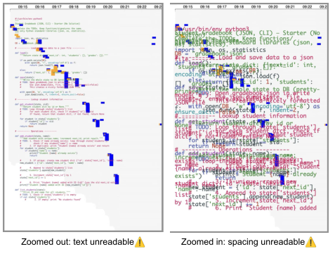
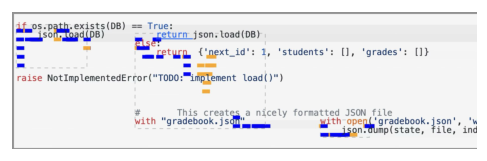
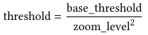
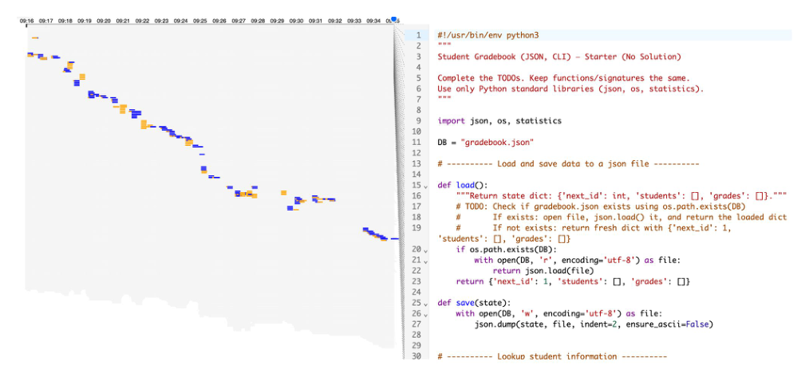
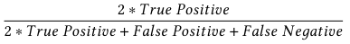
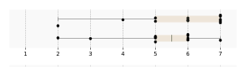
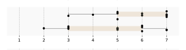
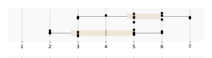
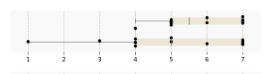
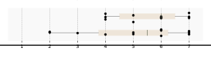

<!-- Source PDF SHA-256: 8d2b3112f19c2128bb88e12dfd4baa697c3fd95d0e567f6a700f0f76dc87aabd -->

# CodeStream: Augmenting Timelines with Code Annotation for Navigating Large Coding Histories

[Source PDF](https://from.so/assets/pdfs/zhang-codestream-chi2026.pdf)

[Ashley Ge Zhang University of Michigan, Ann Arbor Ann Arbor, Michigan, USA gezh@umich.edu](<https://orcid.org/0000-0001-5978-3714>)

[Yan-Ru Jhou EECS University of Michigan Ann Arbor, Michigan, USA yanruj@umich.edu](<https://orcid.org/0009-0000-9987-0492>)

[Yinuo Yang University of Notre Dame Notre Dame, Indiana, USA yinooyang@nd.edu](<https://orcid.org/0009-0003-8184-719X>)

[Shamita Rao School of Information University of Michigan Ann Arbor, Michigan, USA shamita@umich.edu](<https://orcid.org/0009-0001-7761-5615>)

[Maryam Arab School of Information University Of Michigan Ann Arbor, Michigan, USA maryarab@umich.edu](<https://orcid.org/0000-0001-9040-4313>)

[Yan Chen Department of Computer Science Virginia Tech Blacksburg, Virginia, USA ych@vt.edu](<https://orcid.org/0000-0002-1646-6935>)

[Steve Oney School of Information University of Michigan Ann Arbor, Michigan, USA soney@umich.edu](<https://orcid.org/0000-0002-5823-1499>)

![Figure 1. A student's attempts to double every element of L = \[1, 2, 3, 4\] in place. Version 1 doubles only loop variable x, leaving L unchanged. Version 2 builds new\_L and assigns it to L, replacing rather than modifying the original list. Version 3 loops to len(L) minus 1 and misses the last element. The final version loops over range(len(L)) and assigns L\[idx\] = L\[idx\] \* 2. An edit-only timeline below shows colored rectangles; CodeStream adds the relevant code beside each edit, exposing these successive approaches and corrections.](../figures/zhang-codestream-chi2026/figure-001-p001.png)

Figure 1: Overview of CodeStream, a system for navigating large coding histories by augmenting timelines with code annotation. While students may only submit their final code, they may have struggled through many intermediate versions that are not visible to instructors but often reveal important misunderstandings (1). Although a timeline visualization can show when and where insertion and deletion edits occurred, it does not reflect what content was changed, requiring instructors to refer back to historical versions (2). CodeStream augments timeline visualizations with code annotations, allowing instructors to quickly see what changes students made throughout the process (3).

## Abstract

Code edit histories can offer instructors valuable insight into students’ problem-solving processes, revealing unproductive behaviors that final code alone cannot capture. For example, a correct solution may contain large copy-and-pasted segments (suggesting the code originated elsewhere) or unguided trial-and-error (suggesting a lack of clear strategy). Timelines are a common way to visualize code histories, but existing timeline visualizations of code or document histories show only when and where edits occurred, not what changed. Without this context, it is difficult to answer key questions about how students invested effort or to infer their intentions. We present CodeStream, a visualization system that augments timelines with situational code annotations, whose granularity and visibility dynamically adapt to scale and interaction state. A comparison study shows that CodeStream enables context-aware navigation of coding histories, supporting fast and accurate pattern identification, and helping instructors reason about students’ coding behaviors and identify who may need intervention.

## CCS Concepts

- Human-centered computing → Interactive systems and tools; Information visualization; • Applied computing → Education.

## Keywords

Programming Education; Code Visualization; Code History

ACM Reference Format: Ashley Ge Zhang, Yan-Ru Jhou, Yinuo Yang, Shamita Rao, Maryam Arab, Yan Chen, and Steve Oney. 2026. CodeStream: Augmenting Timelines with Code Annotation for Navigating Large Coding Histories. In Proceedings of the 2026 CHI Conference on Human Factors in Computing Systems (CHI ’26), April 13–17, 2026, Barcelona, Spain. ACM, New York, NY, USA, [16](<#page-16>) pages. [https://doi.org/10.1145/3772318.3791873](<https://doi.org/10.1145/3772318.3791873>)

## 1 Introduction

Programming instructors often use coding exercises to assess students’ understanding of key concepts \[[40,](<#page-16>) [42,](<#page-16>) [54](<#page-16>)\]. But just as math instructors ask students to ‘show your work’, assessing understanding of coding concepts requires visibility into the process of arriving at a code solution, not just the final code submission \[[35,](<#page-16>) [59,](<#page-16>) [65](<#page-16>)\]. In addition to evaluating correctness, knowing how students think through the problems is critical for identifying misconceptions and supporting conceptual growth \[[36,](<#page-16>) [53](<#page-16>)\]. Code edit histories can reveal insights about students’ code-writing process, such as how they approached the problem, where they struggled, and how they debugged \[[35,](<#page-16>) [65](<#page-16>)\]. For example, a correct submission may involve a large copy–paste, suggesting limited understanding and over-reliance on external sources. Repeated, unproductive edits on the same concept may indicate that students are using a guess-and-check approach without understanding the underlying concept.

[Creative Commons Attribution logo; this paper is licensed under CC BY 4.0.](<https://creativecommons.org/licenses/by/4.0>)

[This work is licensed under a Creative Commons Attribution 4.0 International License.](<https://creativecommons.org/licenses/by/4.0>) CHI ’26, Barcelona, Spain

© 2026 Copyright held by the owner/author(s). ACM ISBN 979-8-4007-2278-3/26/04 [https://doi.org/10.1145/3772318.3791873](<https://doi.org/10.1145/3772318.3791873>)

Without insight into students’ code-writing processes, instructors may overlook misconceptions, miss opportunities for timely feedback, or fail to recognize students who struggle silently \[[35,](<#page-16>) [65](<#page-16>)\]. While edit histories can provide valuable insights, they are difficult to represent in ways that are easy for instructors to interpret.

Prior work has explored ways to visualize coding history at various levels, ranging from coarse-grained commit messages to fine-grained keystroke logs. While commit messages and unit test results can be helpful \[[13,](<#page-15>) [23,](<#page-15>) [49](<#page-16>)\], they miss the changes that occur between versions. To overcome this limitation, researchers have introduced tools that visualize the entire editing journey, often using timeline-based views to summarize editing activities, replay changes, and highlight key revisions \[[10,](<#page-15>) [22,](<#page-15>) [35,](<#page-16>) [44](<#page-16>)\]. However, prior timeline-based visualizations mainly present high-level information, such as insertions, deletions, code length, and editing activity, but lack direct connection to the actual code content. As a result, instructors must cross-reference timelines with code snapshots to understand the changes, introducing context-switching overhead. This separation makes it difficult to scan large amounts of histories efficiently, or surface key differences, anomalies, and areas of struggle without reading entire codebases.

In this paper, we propose techniques to annotate code timelines to scalably connect change events with code states and edits, by embedding semantic content into history views. We introduce Code- Stream, an instantiation of this technique that adds summaries of code states and edits to timeline views. Rendering these code annotations presents several challenges; while adding a few annotated lines is simple, scaling this to large codebases and frequent, real-time edits is challenging. A key design question is how to balance detail with readability: providing enough semantic content without clutter, rapid fluctuations, or loss of legibility. To achieve this, CodeStream introduces a layout algorithm that adapts to both small and large code samples, and to static or dynamic rendering. Like zooming in and out on digital maps, the algorithm dynamically adjusts the level of summarization based on available space and the stage of problem-solving, grouping edits and selectively displaying details. This approach simplifies navigation to let instructors more easily understand students’ code-writing process.

Although code annotations are the primary focus of the Code- Stream, it also visualizes the time students spend writing each line as a heatmap, serving as a proxy for their cumulative effort. For example, a student may make only a few edits yet spend substantial time reasoning about the code, but their mental effort remains invisible in edit-only timelines. This heatmap visualization, when combined with code annotations, can help instructors assess which parts of the code students may have found challenging to write.

To assess the efficacy of CodeStream in aiding instructors in understanding coding histories, we collected a dataset of 20 student coding histories from two Python programming problems and conducted a within-subject experiment involving 12 participants. Our findings indicate that augmenting timelines with semantic meaning and cumulative effort enabled instructors to (1) quickly identify how students invested effort in writing solutions, and (2) detect patterns and anomalies in coding histories. The study also suggests that CodeStream generalizes well to large codebases in real-time settings. By integrating code annotation, CodeStream enhances navigation and comparison of coding histories while minimizing context switching.

Our research contributes:

- (1) A layout technique and its implementation for visualizing coding histories using timelines augmented with semantic meaning and cumulative effort.

- (2) Evidence from a comparison study showing that CodeStream helps programming instructors better navigate and compare coding histories with reduced context switching overhead.

## 2 Related Work

Our work builds on prior work on code history visualization, understanding students’ coding behavior for learning, visual representations of code, and version control.

### 2.1 Code History Visualization

Visualizing code history has been widely studied in research and commercial tools \[[1,](<#page-15>) [22,](<#page-15>) [32,](<#page-16>) [35,](<#page-16>) [43,](<#page-16>) [44,](<#page-16>) [58,](<#page-16>) [62,](<#page-16>) [63](<#page-16>)\]. A common approach uses timelines where the x-axis represents time and the y- axis represents code lines or editing events \[[32,](<#page-16>) [35,](<#page-16>) [43,](<#page-16>) [44,](<#page-16>) [63](<#page-16>)\]. Timelines have been applied to software development \[[12,](<#page-15>) [28,](<#page-15>) [63](<#page-16>)\], programming education \[[35,](<#page-16>) [60](<#page-16>)\], and large-scale code analysis \[[27,](<#page-15>) [32](<#page-16>)\]. For example, Yoon et al. showed that combining edit timelines with diffs helps developers answer history-related questions \[[63](<#page-16>)\], while Park et al. found that character-level timelines improve peer feedback by making student intentions more interpretable \[[35](<#page-16>)\].

Researchers have also extended timelines into flow views to capture high-level code evolution \[[22,](<#page-15>) [58](<#page-16>)\]. For instance, Chronicler represents each code version as a tree and compares structural changes over time, making refactoring and structural edits easier to interpret than line-based diffs \[[58](<#page-16>)\]. While flow views do not show low-level, fine-grained edits, prior work has found them effective for presenting high-level changes in code \[[62](<#page-16>)\].

Given the complementary strengths of timelines and flow views, researchers have developed visualization tools that allow switching between different levels of code history summarization \[[52,](<#page-16>) [62](<#page-16>)\]. For example, Yoon and Myers integrated multiple abstraction levels of code changes into a timeline using semantic zooming, enabling navigation between fine-grained edits and coarse structural changes. This approach reduces information overload while supporting flexible exploration of code history at different levels of detail \[[62](<#page-16>)\].

Despite these advances, most designs remain separated from code content. Timelines typically show when and where edits occurred, but not what changed \[[35,](<#page-16>) [44](<#page-16>)\]. This forces users to cross-reference timelines with code snapshots, creating context-switching overhead. Prior work attempted to mitigate this by annotating timelines with short labels (e.g., “stack overflow”, “pasted code”) \[[22](<#page-15>)\]. But these provide only coarse behavioral cues and are insufficient for dense, real-time, character-level changes.

CodeStream addresses this gap by integrating code context directly into timeline visualizations through zoomable code annotations, enabling users to see exactly what changed without snapshot cross-references and generalizing across code sizes, languages, and real-time settings.

### 2.2 Understanding Students’ Coding Behavior for Learning

High quality feedback is fundamental to students’ learning outcome in programming education \[[5,](<#page-15>) [11,](<#page-15>) [16,](<#page-15>) [38,](<#page-16>) [39,](<#page-16>) [41](<#page-16>)\], and providing timely, targeted feedback requires instructors to identify students’ misconceptions and learning needs \[[34](<#page-16>)\]. From a constructivist perspective, understanding is built through the problem-solving process \[[36,](<#page-16>) [53](<#page-16>)\], and misconceptions often appear in students’ intermediate steps and failed attempts rather than only in final code \[[2](<#page-15>)\]. Prior work shows that submissions often mask this process, as students may discard unsuccessful explorations and submit different solutions \[[35,](<#page-16>) [59,](<#page-16>) [65](<#page-16>)\]. Therefore, researchers have long leveraged code behavior data to understand how students learn programming. Various interactive systems were designed to help instructors understand coding history easily \[[15,](<#page-15>) [18,](<#page-15>) [31,](<#page-15>) [35,](<#page-16>) [64,](<#page-16>) [65,](<#page-16>) [67](<#page-16>)\].

One direction is summarizing large solution spaces. Tools such as OverCode and CFlow cluster thousands of student solutions by program flow, giving instructors an overview of common strategies and variations \[[15,](<#page-15>) [67](<#page-16>)\]. While effective for grouping solutions and reducing reading load, these systems do not capture how solutions evolve over time. VizProg adds a temporal dimension by visualizing each student’s status as a moving dot on a map, using trajectories to show progress and problem completion \[[65](<#page-16>)\]. However, it emphasizes high-level progress and outcomes rather than detailed code changes in students’ histories.

Prior work shows that understanding students’ coding progress and how their code evolves benefits both teaching and learning \[[4,](<#page-15>) [35,](<#page-16>) [65](<#page-16>)\]. Focusing only on students’ final code is not sufficient for understanding learning and hides their discovering process \[[7,](<#page-15>) [65](<#page-16>)\]. Instructors therefore need easy and timely ways to monitor students’ coding histories to provide high-quality, targeted feedback \[[7,](<#page-15>) [18,](<#page-15>) [55](<#page-16>)\]. Making coding history visible also benefits students by helping them understand their progress, goals, and effective strategies \[[19,](<#page-15>) [35](<#page-16>)\].

In the HCI community, researchers have built plenty of tools to make coding history visible. Many of the tools are designed for real-time monitoring to allow timely feedback. For example, Eliph is a peer assessment system that incorporates timeline visualization of character-level code history \[[35](<#page-16>)\]. They found that by looking at the code history could help the peer evaluator understand the code structure and the author’s intent more clearly, improve feedback quality, and benefit the evaluator’s own learning \[[35](<#page-16>)\]. Similarly, tracking progress enables instructors to provide timely, targeted feedback on misconceptions along students’ evolving understanding \[[65](<#page-16>)\], which supports both instructional adjustment and student self-regulation \[[4](<#page-15>)\]. BlockLens is a visual analytics tool that reveals students’ coding behavior at multiple levels, such as coding progress, behavior within specific questions, common approaches, and mistakes \[[51](<#page-16>)\]. However, BlockLens is designed for block-based programming, which has less variation than text-based programming when visualizing code history \[[51](<#page-16>)\].

Instructors need real-time visibility into students’ coding progress \[[18,](<#page-15>) [65](<#page-16>)\]. Some systems explore real-time monitoring \[[18](<#page-15>)\]. Codeopticon streams live editing activity, allowing a tutor to monitor multiple learners and intervene when signs of struggle appear \[[18](<#page-15>)\]. However, it does not scale to long code files or large codebases, as tutors must read raw code and manually track changes. Eliph presents timeline-based histories to support peer feedback \[[35](<#page-16>)\], but still requires users to cross-reference the full codebase to interpret edits.

Overall, existing systems struggle with generalizability across multiple students and large codebases, and often force trade-offs between detail and readability. Combining summarized timelines with actual code context could reduce this context switching, but introduces challenges such as visual clutter. CodeStream addresses these challenges by visualizing coding histories at multiple levels of abstraction, augmenting timelines with zoomable semantic code annotations to help instructors interpret student intent. Unlike prior work, CodeStream generalizes to large-scale code, adapts to both static and real-time settings, and balances rich detail with readability.

### 2.3 Visual Representations of Code

Visual representations of code simplify program complexity by extracting relevant structure, behavior, and change from code, reducing cognitive load and aiding comprehension through principles such as overview first, zoom and filter, and details on demand \[[3,](<#page-15>) [6,](<#page-15>) [45](<#page-16>)\]. It also supports explanatory goals, echoing notional machines in computing education \[[14,](<#page-15>) [46](<#page-16>)\]. Prior work has widely explored the approach of structural and semantic mappings, including graphs and clusters \[[9,](<#page-15>) [30](<#page-15>)\], large-scale metaphors like code cities \[[57](<#page-16>)\], UML diagrams \[[33](<#page-16>)\], sketches and shape-based encodings \[[8,](<#page-15>) [20,](<#page-15>) [21,](<#page-15>) [61](<#page-16>)\], and task-specific projectional abstractions \[[29](<#page-15>)\]. While effective for navigation and communication, these approaches focus on static code states, often detached from actual code, making it difficult to reason about evolution or student problem-solving \[[6](<#page-15>)\]. CodeStream addresses this gap by extending visual abstraction from static code samples to the dynamic coding process. It integrates annotated timelines of editing activity directly with code, enabling instructors to see not only when and where code changed, but also what and how it changed.

### 2.4 Version Control

Version control systems (VCS) such as Revision Control System (RCS), Concurrent Versions System (CVS), Subversion, and Git have long been central to recording software evolution \[[17,](<#page-15>) [37,](<#page-16>) [47,](<#page-16>) [48,](<#page-16>) [50](<#page-16>)\]. By snapshotting code at intervals, VCS enables developers to navigate versions, recover past states, and trace change histories. Git’s distributed architecture further popularized lightweight branching and merging, supporting parallel histories \[[48](<#page-16>)\]. However, these systems primarily capture coarse-grained commits, overlooking the fine-grained edits that shape code evolution. Previous work has explored lightweight versioning: Variolite for snippet-level branching in data analysis \[[24](<#page-15>)\], Verdant for artifact-level notebook history \[[25,](<#page-15>) [26](<#page-15>)\], and ForkIt for exploratory notebook branching \[[56](<#page-16>)\]. Although these systems reduce friction, they often provide fragmented domain-specific solutions rather than integrated views of code evolution. These approaches remain diff-based and developer-centered, emphasizing what changed at the commit level.

Prior code history visualizations either emphasize high-level abstractions \[[65](<#page-16>)\] or expose low-level edit streams \[[18](<#page-15>)\], leaving a gap between fine-grained edits and readable code context. In programming education, instructors needs real-time access to code histories for timely feedback \[[18,](<#page-15>) [65](<#page-16>)\], yet commit-level views miss keystroke-level attempts and mistakes that reveal students’ intentions. Conversely, character-level edits are dense and repetitive, making them hard to summarize or visualize intuitively, and diff-based approaches depend on careful snapshot selection.

Figure 2: Vertical clutter. When many code lines are mapped onto the timeline, zooming out makes text unreadable (left), while zooming in enlarges spacing and causes severe crowding and overlap (right), illustrating the trade-off between readability and screen space.

CodeStream differs from previous work in that it entails semantic visualizations of fine-grained keystroke-level code edits. Unlike commit-based histories, CodeStream provides dynamic, zoomable views of coding processes with context-aware navigation. This bridges coarse-grained version control with fine-grained traces, supporting identifying coding patterns in teaching programming.

## 3 System Design

The primary contribution of CodeStream is to annotate code timelines to scalably connect change events with code states and edits. Prior timeline-based visualizations of coding history present high-level information such as code length and editing activity, but lack a connection to the actual code content. This separation makes it difficult for instructors to interpret what changes were made and why. CodeStream introduces code annotations to summarize code changes. Our design and layout techniques are described below.

### 3.1 Goals and Challenges of Annotating Timelines with Code

To annotate timelines with code content, the system must (1) scale beyond small code samples to large codebases in programming education and (2) clearly render frequent, real-time edits in a readable way. The core challenge CodeStream addresses is:

How to balance detail with readability, giving enough semantic content without clutter, rapid fluctuations, or loss of legibility?

Figure 3: Horizontal clutter. When many edits occur within a short time span, long code snippets overlap along the timeline, making individual changes difficult to distinguish.

Through iterative design, we identified two key challenges in displaying code annotation on timelines: C1 vertical clutter along the code-size (Y-axis) dimension, and C2 horizontal clutter along the time (X-axis) dimension.

- C1 Vertical Clutter. While code must be displayed at a readable font size, timeline views offer limited vertical space to show all lines. Small code samples (e.g., around 20 lines) can be displayed easily, but as code grows, vertical clutter quickly emerges. As shown with an about 80-line example, raw code becomes unreadable as it expands (Figure [2](<#page-4>)). Balancing font size and spacing is challenging: zooming out makes text too small to read, while zooming in increases spacing and causes clutter. To address this, we combine multi-level summarization (Section [3.4](<#page-8>)), zooming, and preview hovering.

- C2 Horizontal Clutter. Even with only a few lines of code, horizontal clutter can occur as timelines compress, edits are made frequently, and more snippets must be displayed. Long code lines can cause snippets to overlap and become unreadable, as shown in Figure [3,](<#page-5>) where the end of one snippet overlaps with the start of another. To address this, we propose a taxonomy of code annotations and a layout algorithm that prevents overlaps and improves readability.

### 3.2 CodeStream’s Design

Building on the challenges in Section [3.1,](<#page-4>) CodeStream augments timelines with code while mitigating C1 vertical clutter from long programs and C2 horizontal clutter from dense edits over time. The interface integrates two coordinated views, a Timeline View (Figure [4.](<#page-6>)1) and a Code Content View (Figure [4.](<#page-6>)2), with multi-level code annotations that dynamically adapt to available space. We next describe how each component addresses these challenges.

#### 3.2.1 CodeStream’s UI Overview.

The interface of CodeStream contains two coordinated views: a Timeline View (Figure [4.](<#page-6>)1) and a Code Content View (Figure [4.](<#page-6>)2).

The timeline provides an overview of a student’s keystroke-level coding activity over time (Figure [4.](<#page-6>)1). The X-axis represents time, from left to right, showing from when a student starts to when they finish coding (Figure [4.](<#page-6>)a). The Y-axis represents code length, where the top of corresponding to the first line of code, and the bottom to the last (Figure [4.](<#page-6>)b). On the timeline, each row represents a line or block of code, and edits are shown as colored markers positioned along the timeline, of which the x position indicate when the edit happened, and y position indicate to which code line it happened (Figure [4.](<#page-6>)c). Blue markers indicate insertion edits, while orange ones indicate deletion edits. The density and distribution of markers reveal patterns such as bursts of activity, long pauses, or repeated changes to the same region.

The code content view displays the actual program text aligned with the timeline (Figure [4.](<#page-6>)2), enabling instructors to directly inspect how code evolves. The two views coordinate to show code history. Building on this architecture, we next describe how Code- Stream addresses C1 and C2 .

#### 3.2.2 Addressing Vertical Clutter C1 : Multi-Level Code Representation.

By default, the timeline shows the exact code content after each edit within a given period (Figure [5.](<#page-7>)a).

Vertical clutter C1 arises when visualizing longer programs. The timeline is compressed vertically and cannot display all lines. To address this, CodeStream supports multiple levels of code representation that adjust dynamically through zoom controls (Figure [4.](<#page-6>)d). In highly compressed views, the system replaces text with badges indicating the number of modified lines (Figure [4.](<#page-6>)e) and provides high-level control flow summaries (Figure [5.](<#page-7>)b). Hovering over these summaries reveals previews of the actual code changes (Figure [5.](<#page-7>)c). Zooming in restores the full code content for detailed inspection (Figure [5.](<#page-7>)d). When working with longer programs, the timeline may be compressed vertically and the editor limited to a fixed number of visible lines. To preserve orientation in these cases, the system provides a projection between the timeline and code editor, highlighting which portion of the timeline is currently in view (Figure [6.](<#page-8>)c).

#### 3.2.3 Addressing Horizontal Clutter C2 : Temporal Layout and Interaction.

Horizontal clutter occurs when many edits happen in close temporal proximity, causing overlapping snippets or unreadable visuals. CodeStream constrains snippet layout when horizontal space is limited, preventing long lines from overlapping and ensuring snippets remain distinguishable (more details in Section [3.3.2](<#page-7>)). To view history versions, instructors can click change indicators on the timeline to automatically navigate to the corresponding location in the code editor (Figure [6.](<#page-8>)a). They can also scrub through history by dragging a blue dot along the timeline to view snapshots of the code state at any chosen timestamp (Figure [6.](<#page-8>)b).

#### 3.2.4 Integrating C1 and C2 : Code Annotation and Cumulative Effort.

With the designs to address C1 and C2 , CodeStream augments the timeline visualization with code annotations and cumulative effort, enabling instructors to see not only when and where code changes occurred, but also what was changed and whether students struggled (Figure [4](<#page-6>)). In addition, CodeStream overlays a heatmap to represent cumulative effort: darker shading indicates more time spent editing a region, while lighter shading suggests less time (Figure [4.](<#page-6>)f). This combination of annotations, summaries, and effort visualization helps instructors interpret both the content and intensity of students’ coding activity at multiple levels of detail.

#### 3.2.5 Maintaining Global Context: Mini-map Navigation.

Code- Stream provides a mini-map positioned at the bottom-left of the timeline view that serves as a global navigation aid (Figure [6.](<#page-8>)d). This compact timeline representation shows the instructor’s current viewport within the overall coding history, enabling quick orientation and navigation to different time periods. The minimap

Figure 4: CodeStream’s user interface. (1) Timeline View: shows the evolution of edits across time, where each row corresponds to a code line and edits are encoded as blue (add) or orange (delete) (c). Gray shading indicates cumulative effort, where darker shading indicates more time spent editing a region, and lighter shading suggests less time (f). Users can navigate the timeline with controls (d), and track the number of active code lines (e). (2) Code Content View: displays the actual program text aligned with the timeline, allowing instructors to connect edits with specific code states.

maintains the same visual encoding as the main timeline, ensuring consistency in representation. It allows instructors to maintain awareness of their current location while exploring detailed code changes, supporting efficient navigation between different coding phases without losing context.

### 3.3 Code Annotation &amp; Taxonomy

To display code annotations in a readable and intuitive way, we propose a solution that aligns, clusters, and merges code annotations based on different display scenarios. This taxonomy categorizes common situations in code visualization and outlines strategies to reduce clutter in each case. While demonstrated on a specific type of code, the approach generalizes to other coding contexts. It consists of two main components: dynamic structural alignment, and a layout algorithm to address cluttering.

#### 3.3.1 Dynamic structural alignment.

A key challenge we observed in our initial exploration was the loss of original formatting, which makes it difficult to interpret code context. To address this, we group related lines into blocks, align code structures horizontally across edits, and collapse unchanged lines to simplify the display.

Dynamically group related code lines by keystroke edit distance. To reduce clutter and better capture student activity, we group related edits using two metrics: (1) pixel distance on the X-axis (time), and (2) code line distance on the Y-axis (location in code). These metrics reflect different aspects of problem-solving. For example, a pause along the X-axis suggests that a student stopped continuous editing and began a new thought process, while a jump across distant regions of code (Y-axis) indicates a shift in focus. Pixel distance thus captures temporal continuity, while code line distance captures spatial proximity in the program (Figure [8.](<#page-10>)d). In our design, edits within 100 pixels on the X-axis (around 20 seconds apart) and within 3 lines on the Y-axis are grouped into the same block (Figure [8.](<#page-10>)a). Distant edits, such as adding an import at the beginning of the file, are shown as a separate block. These thresholds can be tuned for different contexts and are dynamically adjusted as instructors zoom in or out. When zoomed in, the system lowers thresholds to reveal finer-grained edit histories; when zoomed out, thresholds increase to present a broader overview. Formally, thresholds are updated as:

**Formula:** Threshold equals base threshold divided by zoom level squared.

(1) where base\_threshold is the default grouping distance, and zoom\_level is the current zoom factor. This ensures that zooming in reveals more detail, while zooming out abstracts edits into larger clusters, balancing readability and context.

Align code structures horizontally. Within each group of related code lines, we preserve indentation and horizontally align lines to match how code is normally displayed in editors. This alignment improves readability and allows instructors to quickly recognize the scope of changes and the surrounding context, making it easier to interpret the structure of edit events (Figure [8.](<#page-10>)b).

Default position. We center code snippets within their edit groups to help instructors clearly associate code with the time period when it was edited. Without centering, snippets can appear offset, making changes harder to interpret. Let 1 2 𝑛 𝑒 , 𝑒 , ..., 𝑒 be edits in a group with timestamps 𝑡1, ..., 𝑡𝑛 , sorted from earliest to latest. The leftmost timestamp 𝑡1 is mapped to the timeline using 𝑡 𝑖𝑚𝑒𝑆𝑐𝑎𝑙𝑒𝑟 , which converts timestamps to pixel positions, and we use 𝑡 𝑖𝑚𝑒𝑆𝑐𝑎𝑙𝑒𝑟 (𝑡1) as the default left position of the group. The default width of each group is defined as

Figure 5: Details of CodeStream’s user interface that address vertical clutter. (a) Code annotations embedded directly into the timeline. (b) Context summary view that abstracts dense code regions into labeled structures (e.g., functions, statements). (c) Hover interaction showing original code lines from summary labels. (d) Level-of-detail rendering, where zooming reveals progressively more detailed edits.

- 7 ×𝑎𝑣 𝑒𝑟 𝑎𝑔𝑒 (𝑐𝑜𝑢𝑛𝑡1, ..., 𝑐𝑜𝑢𝑛𝑡 )/2 pixels, where 𝑐𝑜𝑢𝑛𝑡𝑖 is the charac𝑘 ter length of line 𝑙𝑖 , and 7 pixels is the average width of a character in our 12pt monospace font. For example, if the average line length is 20 characters, the default width is about 140 pixels. The y-position of each line is determined by its vertical placement in the layout. This design ensures each code snippet is displayed adjacent to its edit group on the timeline, making it clear which edits the snippet represents.
  
  #### 3.3.2 Layout Algorithm to Address Cluttering.
  
  To address cluttering between text, we designed a layout algorithm that arranges code

annotations along the timeline while minimizing overlaps. Each code snippet is considered a time interval. It proceeds in four steps:

Step 1: Sorting. All time intervals (representing edit groups) are first sorted by their start time from left to right (Figure [7.](<#page-9>)1).

Step 2: Sequential Comparison and Overlap Detection. Starting with the earliest interval, each interval is compared with subsequent intervals whose start time falls before the current interval’s end time. This ensures only potentially overlapping intervals are checked (Figure [7.](<#page-9>)2). For each comparison, the algorithm checks whether the two intervals overlap vertically (y-position, Figure [7.](<#page-9>)2).

Figure 6: Details of CodeStream’s user interface that address horizontal clutter. (a) Timeline view with code annotations aligned when clicking edits. (b) Dragging the timeline scrubber to inspect snapshots of code history. (c) Projection linking the timeline and editor to show which portion is currently in view. (d) Minimap navigation for global positioning and viewport control.

If no overlap is found, nothing changes; if overlap exists, the algorithm proceeds to resolution.

Step 3: Overlap Resolution. If the two intervals overlap horizontally (X-axis) by more than a threshold 𝑥𝑇 (e.g., 0.5), the intervals are merged and collapsed into a single box (Figure [7.](<#page-9>)3a). Only the first (merged) item is retained, and subsequent comparisons skip the absorbed items. Merging continues until no further significant overlap exists. If the overlap is less than the threshold, the boxes are retained, but their widths are shrunk to reduce clutter and preserve distinctness (Figure [7.](<#page-9>)3b).

Step 4: Looping Until Completion. Steps 1 to 3 are repeated iteratively for each time interval until the last interval on the timeline is processed. This ensures that all overlaps are resolved and the algorithm produces a final layout free of conflicts.

Through these steps, the algorithm either merges heavily overlapping boxes into one or shrinks partially overlapping ones, ensuring that the visualization remains readable and avoids excessive clutter while preserving temporal and spatial accuracy.

### 3.4 Level-of-Detail (LOD) and Context Summary View

When designing CodeStream, we aimed to make it generalizable to code of any size. The taxonomy of code annotation described above can be applied to codebases of varying lengths. However, when visualizing large code samples, there could be the challenge of vertical cluttering (Section [3.1](<#page-4>)). To address this issue, CodeStream scales to large code samples by combining multiple levels of detail with a context summary view. It adaptively adjusts code annotations to maximize information even when the timeline is highly compressed. CodeStream uses a hybrid structural-semantic approach to summarize code while preserving essential program context. When a code box becomes too dense, CodeStream automatically switches to a summary mode that preserves indentation and scope but replaces code with structured labels. To adapt to visual density, CodeStream monitors the vertical spacing between the annotations. When spacing falls below an pre-defined 8-pixel threshold, the system shifts from full code to summary mode to avoid text clustering. Through static program analysis, each line is classified into one of five types: function, component, control flow, block beginning, or regular statement/expression. This is performed using a priority-ordered classifier that applies language-specific regular expression patterns, ensuring higher-level constructs are correctly identified even when they contain lower-level patterns. Lines are then displayed as labels (e.g., if (condition) → \[IF\]; function parseInput(input) → \[Function\] parseInput). This gives instructors a clear view of semantic structure, functions, components, and control flow. The approach supports Python, JavaScript, Type- Script and HTML using modular pattern libraries of 20–30 rules per structure type. To avoid losing detail, each summary label is interactive: hovering reveals the original code lines, providing immediate access without requiring zoom. In this way, CodeStream presents both high-level structure and fine-grained edits within the same display space, enabling efficient navigation between overviews and details.

Figure 7: Layout algorithm for resolving overlaps between code snippets. Step 1: Sort all intervals by start time. Step 2: Compare each interval with later ones until a non-overlapping start is found. Step 3a: If two boxes overlap by more than 50%, merge them and retain the first. Step 3b: If the overlap is less than 50%, shrink the box and truncate long content. Step 4: The final layout ensures no overlaps remain, with orange showing overlap and dark blue showing resolution.

During the development process, we iterated with code samples ranging from around 20 lines to 300 lines and found CodeStream capable of visualizing them effectively. Technically, the layout algorithm could also handle larger code files, though it could be further improved by incorporating additional levels of summarization.

### 3.5 Cumulative Effort on Code Lines

To calculate cumulative effort on each line of code, we track two variables: a start\_time and a total\_time. Whenever a user begins editing a line, the algorithm records the start\_time. As the user continues working, the total\_time is updated according to the formula total\_time=current\_time-start\_time, reflecting the duration of active engagement with that line. To ensure that idle periods are not mistakenly counted as effort, the algorithm introduces a pause threshold: if the user leaves a line and returns to it after more than one minute, the start\_time is reset to the new edit. This way, only continuous active editing contributes to total\_time, while long pauses are excluded. By accumulating these intervals, we obtain a measure of cumulative effort for each line, providing an approximation of where students spent the most focused attention during the coding process.

### 3.6 Visualizing Multiple Files

CodeStream also supports multi-file codebases using a tab-based interface similar to browsers or IDEs (e.g., VSCode). Each tab corresponds to a file, and the active file being edited is highlighted to direct instructors’ attention. Instructors can switch between files by clicking tabs, which updates the timeline accordingly. This serves as an initial design for multi-file support, with opportunities for further improvement discussed in Section [5.1.](<#page-14>)

Figure 8: Example of grouping and alignment in CodeStream. (a) Timeline view showing how edits are grouped into clusters (Groups 1–4) based on both time distance (c) and code line distance (d). Edits that occur close in time or within nearby lines of code are clustered together to reflect continuous student activity. (b) Within each group, code annotations are aligned horizontally to preserve indentation and readability, making it easier for instructors to interpret the structure and scope of edits.

### 3.7 Implementation Details

CodeStream’s implementation contains two components:

- (1) A VSCode extension for students that streams keystroke-level coding history from the editor. It is built on top of an existing tool from the University of Michigan[1](<#page-10>) . To use CodeStream, students only need to install the extension on their device. Students can turn off coding history streaming at any time if they wish.

- (2) A web application for instructors, consisting of a React/TypeScript frontend that visualizes coding histories in timelines, and a backend server that manages real-time data processing with [socket.io](<https://socket.io>). The web application presents CodeStream and stores instructor log-in information in a local database, allowing only approved users to access the system and preventing privacy issues.

## 4 User Study

We designed CodeStream as a general tool that visualizes keystroke-level coding histories for both small code snippets and large code files. While CodeStream could be applied in many different scenarios, we aim to evaluate it in an educational setting in this paper. As shown in previous sections, CodeStream could display keystroke-level changes clearly for small code samples. Thus, we conducted a user study to evaluate how CodeStream performs on long code files. Longer code files are more complicated and have more content to fit within a fixed-space timeline. We compared CodeStream with a variation of CodeStream to evaluate how its affordances influence instructors’ experience of viewing students’ coding histories.

> [1https://github.com/educational-technology-collective/vscode-telemetry](<https://1https://github.com/educational-technology-collective/vscode-telemetry>)

### 4.1 Method

#### 4.1.1 Dataset of Student Coding Histories.

We use a dataset of Python programming histories collected in a prior study \[[66](<#page-16>)\]. The dataset contains keystroke-level edit logs from 20 participants solving two programming tasks. Participants were over 18 years old with prior Python experience and came from diverse backgrounds, including undergraduate and graduate students, software developers, data professionals, and researchers. Their experience ranged from less than 3 months to 9 years.

Each participant in the dataset \[[66](<#page-16>)\] completed two 20-minute tasks: (i) implementing a command-line grade-book system and (ii) building a hospital appointment manager. Both tasks required managing JSON-based data, performing list and dictionary operations, and producing formatted outputs. For each task, participants were provided with starter code containing a task description, function TODO items, and an accompanying test file. Within the 20 minutes for each task, participants were not required to complete the entire task. Instead, they were expected to iteratively develop their

Table 1: Participant Demographics of the user study

<table>
  <thead>
    <tr>
      <th id="pdf-table-2347:0-8b586c43-R1C1_PID__AD260215-2322-1183-ADBE-000000019528-b962b771" scope="col">
PID
</th>
      <th id="pdf-table-2347:0-8b586c43-R1C2_Gender__AD260215-2322-1183-ADBE-000000019531-4c109dea" scope="col">
Gender
</th>
      <th id="pdf-table-2347:0-8b586c43-R1C3_Python_E_AD260215-2322-1183-ADBE-000000019534-461a1566" scope="col">
Python Exp. (yrs)
</th>
      <th id="pdf-table-2347:0-8b586c43-R1C4_Role__AD260215-2322-1183-ADBE-000000019537-4ae4f0b4" scope="col">
Role
</th>
    </tr>
  </thead>
  <tbody>
    <tr>
      <th id="pdf-table-2347:0-8b586c43-R2C1_P1__AD260215-2322-1183-ADBE-000000019541-7698c487" scope="row" headers="pdf-table-2347:0-8b586c43-R1C1_PID__AD260215-2322-1183-ADBE-000000019528-b962b771">
P1
</th>
      <td headers="pdf-table-2347:0-8b586c43-R1C2_Gender__AD260215-2322-1183-ADBE-000000019531-4c109dea pdf-table-2347:0-8b586c43-R2C1_P1__AD260215-2322-1183-ADBE-000000019541-7698c487">
Man
</td>
      <td headers="pdf-table-2347:0-8b586c43-R1C3_Python_E_AD260215-2322-1183-ADBE-000000019534-461a1566 pdf-table-2347:0-8b586c43-R2C1_P1__AD260215-2322-1183-ADBE-000000019541-7698c487">
5
</td>
      <td headers="pdf-table-2347:0-8b586c43-R1C4_Role__AD260215-2322-1183-ADBE-000000019537-4ae4f0b4 pdf-table-2347:0-8b586c43-R2C1_P1__AD260215-2322-1183-ADBE-000000019541-7698c487">
AI Engineer
</td>
    </tr>
    <tr>
      <th id="pdf-table-2347:0-8b586c43-R3C1_P2__AD260215-2322-1183-ADBE-000000019554-bf781925" scope="row" headers="pdf-table-2347:0-8b586c43-R1C1_PID__AD260215-2322-1183-ADBE-000000019528-b962b771">
P2
</th>
      <td headers="pdf-table-2347:0-8b586c43-R1C2_Gender__AD260215-2322-1183-ADBE-000000019531-4c109dea pdf-table-2347:0-8b586c43-R3C1_P2__AD260215-2322-1183-ADBE-000000019554-bf781925">
Man
</td>
      <td headers="pdf-table-2347:0-8b586c43-R1C3_Python_E_AD260215-2322-1183-ADBE-000000019534-461a1566 pdf-table-2347:0-8b586c43-R3C1_P2__AD260215-2322-1183-ADBE-000000019554-bf781925">
8
</td>
      <td headers="pdf-table-2347:0-8b586c43-R1C4_Role__AD260215-2322-1183-ADBE-000000019537-4ae4f0b4 pdf-table-2347:0-8b586c43-R3C1_P2__AD260215-2322-1183-ADBE-000000019554-bf781925">
Graduate Student Instructor
</td>
    </tr>
    <tr>
      <th id="pdf-table-2347:0-8b586c43-R4C1_P3__AD260215-2322-1183-ADBE-000000019567-b0119907" scope="row" headers="pdf-table-2347:0-8b586c43-R1C1_PID__AD260215-2322-1183-ADBE-000000019528-b962b771">
P3
</th>
      <td headers="pdf-table-2347:0-8b586c43-R1C2_Gender__AD260215-2322-1183-ADBE-000000019531-4c109dea pdf-table-2347:0-8b586c43-R4C1_P3__AD260215-2322-1183-ADBE-000000019567-b0119907">
Man
</td>
      <td headers="pdf-table-2347:0-8b586c43-R1C3_Python_E_AD260215-2322-1183-ADBE-000000019534-461a1566 pdf-table-2347:0-8b586c43-R4C1_P3__AD260215-2322-1183-ADBE-000000019567-b0119907">
4
</td>
      <td headers="pdf-table-2347:0-8b586c43-R1C4_Role__AD260215-2322-1183-ADBE-000000019537-4ae4f0b4 pdf-table-2347:0-8b586c43-R4C1_P3__AD260215-2322-1183-ADBE-000000019567-b0119907">
Teaching Assistant
</td>
    </tr>
    <tr>
      <th id="pdf-table-2347:0-8b586c43-R5C1_P4__AD260215-2322-1183-ADBE-000000019580-2f7d32c5" scope="row" headers="pdf-table-2347:0-8b586c43-R1C1_PID__AD260215-2322-1183-ADBE-000000019528-b962b771">
P4
</th>
      <td headers="pdf-table-2347:0-8b586c43-R1C2_Gender__AD260215-2322-1183-ADBE-000000019531-4c109dea pdf-table-2347:0-8b586c43-R5C1_P4__AD260215-2322-1183-ADBE-000000019580-2f7d32c5">
Man
</td>
      <td headers="pdf-table-2347:0-8b586c43-R1C3_Python_E_AD260215-2322-1183-ADBE-000000019534-461a1566 pdf-table-2347:0-8b586c43-R5C1_P4__AD260215-2322-1183-ADBE-000000019580-2f7d32c5">
9
</td>
      <td headers="pdf-table-2347:0-8b586c43-R1C4_Role__AD260215-2322-1183-ADBE-000000019537-4ae4f0b4 pdf-table-2347:0-8b586c43-R5C1_P4__AD260215-2322-1183-ADBE-000000019580-2f7d32c5">
Graduate Student Instructor
</td>
    </tr>
    <tr>
      <th id="pdf-table-2347:0-8b586c43-R6C1_P5__AD260215-2322-1183-ADBE-000000019593-ee88b0dd" scope="row" headers="pdf-table-2347:0-8b586c43-R1C1_PID__AD260215-2322-1183-ADBE-000000019528-b962b771">
P5
</th>
      <td headers="pdf-table-2347:0-8b586c43-R1C2_Gender__AD260215-2322-1183-ADBE-000000019531-4c109dea pdf-table-2347:0-8b586c43-R6C1_P5__AD260215-2322-1183-ADBE-000000019593-ee88b0dd">
Man
</td>
      <td headers="pdf-table-2347:0-8b586c43-R1C3_Python_E_AD260215-2322-1183-ADBE-000000019534-461a1566 pdf-table-2347:0-8b586c43-R6C1_P5__AD260215-2322-1183-ADBE-000000019593-ee88b0dd">
2
</td>
      <td headers="pdf-table-2347:0-8b586c43-R1C4_Role__AD260215-2322-1183-ADBE-000000019537-4ae4f0b4 pdf-table-2347:0-8b586c43-R6C1_P5__AD260215-2322-1183-ADBE-000000019593-ee88b0dd">
Teaching Assistant
</td>
    </tr>
    <tr>
      <th id="pdf-table-2347:0-8b586c43-R7C1_P6__AD260215-2322-1183-ADBE-000000019606-48754b67" scope="row" headers="pdf-table-2347:0-8b586c43-R1C1_PID__AD260215-2322-1183-ADBE-000000019528-b962b771">
P6
</th>
      <td headers="pdf-table-2347:0-8b586c43-R1C2_Gender__AD260215-2322-1183-ADBE-000000019531-4c109dea pdf-table-2347:0-8b586c43-R7C1_P6__AD260215-2322-1183-ADBE-000000019606-48754b67">
Woman
</td>
      <td headers="pdf-table-2347:0-8b586c43-R1C3_Python_E_AD260215-2322-1183-ADBE-000000019534-461a1566 pdf-table-2347:0-8b586c43-R7C1_P6__AD260215-2322-1183-ADBE-000000019606-48754b67">
9
</td>
      <td headers="pdf-table-2347:0-8b586c43-R1C4_Role__AD260215-2322-1183-ADBE-000000019537-4ae4f0b4 pdf-table-2347:0-8b586c43-R7C1_P6__AD260215-2322-1183-ADBE-000000019606-48754b67">
Teaching Assistant
</td>
    </tr>
    <tr>
      <th id="pdf-table-2347:0-8b586c43-R8C1_P7__AD260215-2322-1183-ADBE-000000019619-7ffc3481" scope="row" headers="pdf-table-2347:0-8b586c43-R1C1_PID__AD260215-2322-1183-ADBE-000000019528-b962b771">
P7
</th>
      <td headers="pdf-table-2347:0-8b586c43-R1C2_Gender__AD260215-2322-1183-ADBE-000000019531-4c109dea pdf-table-2347:0-8b586c43-R8C1_P7__AD260215-2322-1183-ADBE-000000019619-7ffc3481">
Man
</td>
      <td headers="pdf-table-2347:0-8b586c43-R1C3_Python_E_AD260215-2322-1183-ADBE-000000019534-461a1566 pdf-table-2347:0-8b586c43-R8C1_P7__AD260215-2322-1183-ADBE-000000019619-7ffc3481">
8
</td>
      <td headers="pdf-table-2347:0-8b586c43-R1C4_Role__AD260215-2322-1183-ADBE-000000019537-4ae4f0b4 pdf-table-2347:0-8b586c43-R8C1_P7__AD260215-2322-1183-ADBE-000000019619-7ffc3481">
Graduate Student Instructor
</td>
    </tr>
    <tr>
      <th id="pdf-table-2347:0-8b586c43-R9C1_P8__AD260215-2322-1183-ADBE-000000019632-47b2e16e" scope="row" headers="pdf-table-2347:0-8b586c43-R1C1_PID__AD260215-2322-1183-ADBE-000000019528-b962b771">
P8
</th>
      <td headers="pdf-table-2347:0-8b586c43-R1C2_Gender__AD260215-2322-1183-ADBE-000000019531-4c109dea pdf-table-2347:0-8b586c43-R9C1_P8__AD260215-2322-1183-ADBE-000000019632-47b2e16e">
Man
</td>
      <td headers="pdf-table-2347:0-8b586c43-R1C3_Python_E_AD260215-2322-1183-ADBE-000000019534-461a1566 pdf-table-2347:0-8b586c43-R9C1_P8__AD260215-2322-1183-ADBE-000000019632-47b2e16e">
4
</td>
      <td headers="pdf-table-2347:0-8b586c43-R1C4_Role__AD260215-2322-1183-ADBE-000000019537-4ae4f0b4 pdf-table-2347:0-8b586c43-R9C1_P8__AD260215-2322-1183-ADBE-000000019632-47b2e16e">
Tutor
</td>
    </tr>
    <tr>
      <th id="pdf-table-2347:0-8b586c43-R10C1_P9__AD260215-2322-1183-ADBE-000000019645-20ae9be2" scope="row" headers="pdf-table-2347:0-8b586c43-R1C1_PID__AD260215-2322-1183-ADBE-000000019528-b962b771">
P9
</th>
      <td headers="pdf-table-2347:0-8b586c43-R1C2_Gender__AD260215-2322-1183-ADBE-000000019531-4c109dea pdf-table-2347:0-8b586c43-R10C1_P9__AD260215-2322-1183-ADBE-000000019645-20ae9be2">
Man
</td>
      <td headers="pdf-table-2347:0-8b586c43-R1C3_Python_E_AD260215-2322-1183-ADBE-000000019534-461a1566 pdf-table-2347:0-8b586c43-R10C1_P9__AD260215-2322-1183-ADBE-000000019645-20ae9be2">
10
</td>
      <td headers="pdf-table-2347:0-8b586c43-R1C4_Role__AD260215-2322-1183-ADBE-000000019537-4ae4f0b4 pdf-table-2347:0-8b586c43-R10C1_P9__AD260215-2322-1183-ADBE-000000019645-20ae9be2">
Teaching Assistant
</td>
    </tr>
    <tr>
      <th id="pdf-table-2347:0-8b586c43-R11C1_P10__AD260215-2322-1183-ADBE-000000019658-5b89f5ac" scope="row" headers="pdf-table-2347:0-8b586c43-R1C1_PID__AD260215-2322-1183-ADBE-000000019528-b962b771">
P10
</th>
      <td headers="pdf-table-2347:0-8b586c43-R1C2_Gender__AD260215-2322-1183-ADBE-000000019531-4c109dea pdf-table-2347:0-8b586c43-R11C1_P10__AD260215-2322-1183-ADBE-000000019658-5b89f5ac">
Woman
</td>
      <td headers="pdf-table-2347:0-8b586c43-R1C3_Python_E_AD260215-2322-1183-ADBE-000000019534-461a1566 pdf-table-2347:0-8b586c43-R11C1_P10__AD260215-2322-1183-ADBE-000000019658-5b89f5ac">
9
</td>
      <td headers="pdf-table-2347:0-8b586c43-R1C4_Role__AD260215-2322-1183-ADBE-000000019537-4ae4f0b4 pdf-table-2347:0-8b586c43-R11C1_P10__AD260215-2322-1183-ADBE-000000019658-5b89f5ac">
Graduate Student Instructor
</td>
    </tr>
    <tr>
      <th id="pdf-table-2347:0-8b586c43-R12C1_P11__AD260215-2322-1183-ADBE-000000019671-d9d639c8" scope="row" headers="pdf-table-2347:0-8b586c43-R1C1_PID__AD260215-2322-1183-ADBE-000000019528-b962b771">
P11
</th>
      <td headers="pdf-table-2347:0-8b586c43-R1C2_Gender__AD260215-2322-1183-ADBE-000000019531-4c109dea pdf-table-2347:0-8b586c43-R12C1_P11__AD260215-2322-1183-ADBE-000000019671-d9d639c8">
Woman
</td>
      <td headers="pdf-table-2347:0-8b586c43-R1C3_Python_E_AD260215-2322-1183-ADBE-000000019534-461a1566 pdf-table-2347:0-8b586c43-R12C1_P11__AD260215-2322-1183-ADBE-000000019671-d9d639c8">
5
</td>
      <td headers="pdf-table-2347:0-8b586c43-R1C4_Role__AD260215-2322-1183-ADBE-000000019537-4ae4f0b4 pdf-table-2347:0-8b586c43-R12C1_P11__AD260215-2322-1183-ADBE-000000019671-d9d639c8">
Student
</td>
    </tr>
    <tr>
      <th id="pdf-table-2347:0-8b586c43-R13C1_P12__AD260215-2322-1183-ADBE-000000019684-f7540759" scope="row" headers="pdf-table-2347:0-8b586c43-R1C1_PID__AD260215-2322-1183-ADBE-000000019528-b962b771">
P12
</th>
      <td headers="pdf-table-2347:0-8b586c43-R1C2_Gender__AD260215-2322-1183-ADBE-000000019531-4c109dea pdf-table-2347:0-8b586c43-R13C1_P12__AD260215-2322-1183-ADBE-000000019684-f7540759">
Man
</td>
      <td headers="pdf-table-2347:0-8b586c43-R1C3_Python_E_AD260215-2322-1183-ADBE-000000019534-461a1566 pdf-table-2347:0-8b586c43-R13C1_P12__AD260215-2322-1183-ADBE-000000019684-f7540759">
6
</td>
      <td headers="pdf-table-2347:0-8b586c43-R1C4_Role__AD260215-2322-1183-ADBE-000000019537-4ae4f0b4 pdf-table-2347:0-8b586c43-R13C1_P12__AD260215-2322-1183-ADBE-000000019684-f7540759">
Teaching Assistant
</td>
    </tr>
  </tbody>
</table>

solutions starting from the provided starter code and aim to pass the tests. All participants were allowed to use external resources (including Google and ChatGPT). To obtain a variety of coding patterns, we gave different instructions for using AI tools. Half of the participants were allowed to use AI without restrictions, while the other half were told to use AI only when stuck. Across both tasks, coding sessions ranged from 188–319 lines of code with up to 2,610 edits.

The dataset was collected using the VSCode extension we built (Section [3.7](<#page-10>)), including keystroke-level coding histories and execution results from the test files. The VSCode extension was deployed on GitHub Codespaces for the user study.

#### 4.1.2 Recruitment.

Because CodeStream’s intended end users are programming instructors, we reached out to senior students from the University of Michigan who had experience teaching Python programming courses or were at least proficient in Python. During a screening session, participants indicated their prior experience teaching and using Python. In total, 12 participants were recruited, including nine men and three women, with Python experience ranging from 2 to 10+ years. Most held teaching roles (GSIs, TAs, or tutors), while others included an AI engineer and a student (Table [1](<#page-11>)).

#### 4.1.3 Baseline System.

As there are no widely used visualization tools for keystroke-level code histories to compare with, we designed the baseline system as a restricted version of CodeStream, which is functionally identical to Eliph’s timeline visualization of code histories \[[35](<#page-16>)\]. The baseline systems provided keystroke-level edit indicators, enabled time travel for code histories, but without code annotation on the timeline and the cumulative effort visualizations. Although cumulative-effort visualizations were removed, users could still infer how long students spent writing by looking at the time span of their edits. Figure [9](<#page-12>) is a screenshot of the baseline system. Users were provided with a list of students’ coding histories. For each student, users can see a timeline visualization and a code editor showing the student’s code content. The change

Table 2: Categorization of the quiz questions in the user study and examples of each category.

<table>
  <thead>
    <tr>
      <th id="pdf-table-2519:0-f6ae53a9-R1C1_Categori_AD260215-2322-1183-ADBE-000000019746-b3017fd8" scope="col">
Categories
</th>
      <th id="pdf-table-2519:0-f6ae53a9-R1C2_Example__AD260215-2322-1183-ADBE-000000019749-01662c39" scope="col">
Example
</th>
    </tr>
  </thead>
  <tbody>
    <tr>
      <th id="pdf-table-2519:0-f6ae53a9-R2C1_reuse-an_AD260215-2322-1183-ADBE-000000019753-1aa4f6ba" scope="row" headers="pdf-table-2519:0-f6ae53a9-R1C1_Categori_AD260215-2322-1183-ADBE-000000019746-b3017fd8">
reuse-and-revise pattern
</th>
      <td headers="pdf-table-2519:0-f6ae53a9-R1C2_Example__AD260215-2322-1183-ADBE-000000019749-01662c39 pdf-table-2519:0-f6ae53a9-R2C1_reuse-an_AD260215-2322-1183-ADBE-000000019753-1aa4f6ba">
Which of the following students started by copy-pasting code into each function, and then went back to revise it after getting an initial solution?
</td>
    </tr>
    <tr>
      <th id="pdf-table-2519:0-f6ae53a9-R3C1_code_are_AD260215-2322-1183-ADBE-000000019763-139e4147" scope="row" headers="pdf-table-2519:0-f6ae53a9-R1C1_Categori_AD260215-2322-1183-ADBE-000000019746-b3017fd8">
code areas with high editing effort
</th>
      <td headers="pdf-table-2519:0-f6ae53a9-R1C2_Example__AD260215-2322-1183-ADBE-000000019749-01662c39 pdf-table-2519:0-f6ae53a9-R3C1_code_are_AD260215-2322-1183-ADBE-000000019763-139e4147">
Check P13’s coding history. Select the two functions they spent the most time on.
</td>
    </tr>
    <tr>
      <th id="pdf-table-2519:0-f6ae53a9-R4C1_edit_con_AD260215-2322-1183-ADBE-000000019770-ffcd48a1" scope="row" headers="pdf-table-2519:0-f6ae53a9-R1C1_Categori_AD260215-2322-1183-ADBE-000000019746-b3017fd8">
edit content and change types
</th>
      <td headers="pdf-table-2519:0-f6ae53a9-R1C2_Example__AD260215-2322-1183-ADBE-000000019749-01662c39 pdf-table-2519:0-f6ae53a9-R4C1_edit_con_AD260215-2322-1183-ADBE-000000019770-ffcd48a1">
P4 has edits on two parts of the code at the end (highlighted in red). What are the edits about?
</td>
    </tr>
    <tr>
      <th id="pdf-table-2519:0-f6ae53a9-R5C1_magnitud_AD260215-2322-1183-ADBE-000000019777-0b98516c" scope="row" headers="pdf-table-2519:0-f6ae53a9-R1C1_Categori_AD260215-2322-1183-ADBE-000000019746-b3017fd8">
magnitude of edits
</th>
      <td headers="pdf-table-2519:0-f6ae53a9-R1C2_Example__AD260215-2322-1183-ADBE-000000019749-01662c39 pdf-table-2519:0-f6ae53a9-R5C1_magnitud_AD260215-2322-1183-ADBE-000000019777-0b98516c">
For the following students, check how many lines they edited. Select the student who made the fewest edits.
</td>
    </tr>
  </tbody>
</table>

indicators in the timeline are the same as in CodeStream. Users can click on the change indicators or move the slider on the timeline to view historical versions of students’ code. With this baseline design, we aim to understand how the code annotation on timelines and the cumulative effort visualization influence instructors’ user experience of viewing code histories.

#### 4.1.4 Study Setup.

The study was conducted remotely via Zoom using a within-subjects format where participants used both Code- Stream and the baseline system. We counterbalanced the order of the systems and the tasks. To assess participants’ understanding of students’ coding histories using both systems, we designed quiz questions based on specific editing patterns in our dataset (Section [4.1.1](<#page-10>)) and on what instructors typically look for in programming courses. The questions evaluated whether participants could identify students with particular editing patterns and the associated code changes. Table [2](<#page-11>) shows the quiz categories and an example question for each; each category included 1–2 questions. For example, we asked questions such as “The student has repeated edits on the same line, what are these edits about?” and “Which two functions did the student spend the most time on?” For each condition, we provided 10-20 minutes of training on how to use the system, the programming problems, and how to read the quiz questions. After training, participants had 20 minutes to answer quiz questions about students’ coding histories using the assigned system. After finishing the quiz questions for each system, participants were asked to complete a survey about their experience using the system. At the end of each study, we conducted a reflective survey and interview to compare the two systems. We encouraged participants to ask any questions about the usage of both systems. Each study lasted about 70 minutes.

#### 4.1.5 Data Collection and Metrics.

During the study, we recorded participants’ screens while they completed the tasks, along with their quiz responses, audio think-aloud processes, and answers to the post-study survey and follow-up interviews. Two members of the research team were present at each study session.

Figure 9: User interface of the baseline system

To evaluate participants’ answers to the quiz questions, we calculated the F-score as the accuracy of each multiple-choice question, using the formula:

**Formula:** F-score equals two times true positives divided by the sum of two times true positives, false positives, and false negatives.

For single-choice questions, we use either 0 or 1 as accuracy by matching the answer to the ground truth.

For open-ended questions in the quiz, three authors coded participants’ answers. We also developed a coding scheme to analyze participants’ behaviors in the screen recordings. The screen recordings were coded to analyze the time spent on quiz questions and to understand how participants interacted with both systems to perform the tasks. For survey responses and follow-up interview data, a thematic analysis was conducted to identify recurring themes and insights. A paired t-test was used for statistical analysis. Figure [10](<#page-13>) shows the results of the comparison survey.

### 4.2 Coding Quiz Results

Participants identify coding patterns more accurately using Code- Stream than the baseline with comparable time taken. We first compared participants’ accuracy in answering the quiz questions, which required participants to identify students’ coding patterns, changes they made, and how much of effort students have spent on different parts of the code. Accuracy was significantly higher with CodeStream (𝑀 = 0.84, 𝑆 𝐷 = 0.21) than with the baseline system (𝑀 = 0.68, 𝑆 𝐷 = 0.10, 𝑝 &lt; 0.05). In the participants’ self-report survey and the comparison survey, most participants think CodeStream is more helpful in navigating and exploring coding histories, identifying students who need help, and interpreting their intention of code changes (Figure [10,](<#page-13>) Table [3](<#page-13>)).

We also compared quiz accuracy by category (Table [4](<#page-14>)). Participants achieved significantly higher accuracy with CodeStream than with the baseline when answering questions about code areas with high editing effort, edit content and change types. They also performed better with CodeStream when comparing the magnitudes of edits, although this difference was not statistically significant. Accuracy for identifying reuse-revise patterns was high in both systems.

We measured the time participants spent answering quiz questions to assess whether CodeStream required more time to explore code histories. On average, participants took longer in the Code- Stream condition (𝑀 = 925.17 seconds, 𝑆 𝐷 = 218.10) than in the baseline condition (𝑀 = 853.67, 𝑆 𝐷 = 270.47), though the difference was not statistically significant (𝑝 &gt; 0.05). Two factors may explain the comparable times. First, CodeStream requires additional interactions, such as clicking the buttons to zoom in and out and dragging on the minimap to adjust the viewport, rather than quick actions such as scrolling, panning, or dragging directly on the timeline. These extra operations added to the task time during the study. Second, some participants were less familiar with the code annotations and needed more time to get oriented, whereas the baseline system appeared more straightforward to them.

### 4.3 System Usability and Study Insights

#### 4.3.1 CodeStream takes less context switching to explore coding history.

Most of the participants think that CodeStream takes less effort to understand students’ coding histories. Two participants think that the baseline system takes less effort as they prefer a smoother interaction to navigate the timeline visualization, such as dragging and scrolling rather than clicking the zoom buttons (P1, P7).

![Figure 10. Survey comparison of CodeStream and the baseline. The seven ratings run from 1 (strongly prefer CodeStream) through 4 (neutral) to 7 (strongly prefer baseline). Counts for ratings 1–7 are: identifying students who might need help, 2, 2, 4, 3, 1, 0, 0; interpreting students' intentions behind code changes, 3, 3, 1, 5, 0, 0, 0; navigating and exploring coding histories, 4, 4, 1, 1, 1, 0, 1; less effort to understand coding history, 5, 2, 2, 1, 1, 0, 1. Each question has 12 responses and favors CodeStream overall.](../figures/zhang-codestream-chi2026/figure-010-p013.png)

Figure 10: Results of the comparison survey between CodeStream and the baseline system. Responses are shown on a 7-point Likert scale (1 = strongly prefer CodeStream, 7 = strongly prefer Baseline, 4 = neutral). Across all four measures, participants generally rated CodeStream as more helpful than the baseline.

Table 3: Participants’ self-report across conditions. Reported are mean ratings (𝑀 ) and standard deviations (𝑆 𝐷 ) on a 7-point Likert scale (1 = very little understanding, 7 = very good understanding). Compared to the baseline, participants using Code- Stream reported higher understanding of students’ coding history, problem-solving patterns, edit intentions (𝑝 &lt; 0.05), students needing intervention, and effort investment.

<table>
  <thead>
    <tr>
      <th id="pdf-table-2739:0-f3bf6d73-2741:0-c1819a8f" scope="col">Measures</th>
      <th id="pdf-table-2739:0-f3bf6d73-2742:0-660429ed" scope="col">Condition</th>
      <th id="pdf-table-2739:0-f3bf6d73-2743:0-3ef6b674" scope="col">𝑀</th>
      <th id="pdf-table-2739:0-f3bf6d73-2744:0-3db6b438" scope="col">𝑆𝐷</th>
      <th id="pdf-table-2739:0-f3bf6d73-2745:0-25a0f19e" scope="col">1 (little understanding) to 7 (good understanding)</th>
    </tr>
  </thead>
  <tbody>
    <tr>
      <th id="pdf-table-2739:0-f3bf6d73-2747:0-caec2fb2" scope="row" rowspan="2" headers="pdf-table-2739:0-f3bf6d73-2741:0-c1819a8f">Students’ coding history</th>
      <td headers="pdf-table-2739:0-f3bf6d73-2742:0-660429ed pdf-table-2739:0-f3bf6d73-2747:0-caec2fb2">CodeStream</td>
      <td headers="pdf-table-2739:0-f3bf6d73-2743:0-3ef6b674 pdf-table-2739:0-f3bf6d73-2747:0-caec2fb2">5.75</td>
      <td headers="pdf-table-2739:0-f3bf6d73-2744:0-3db6b438 pdf-table-2739:0-f3bf6d73-2747:0-caec2fb2">1.54</td>
      <td rowspan="2" headers="pdf-table-2739:0-f3bf6d73-2745:0-25a0f19e pdf-table-2739:0-f3bf6d73-2747:0-caec2fb2"></td>
    </tr>
    <tr>
      <td headers="pdf-table-2739:0-f3bf6d73-2742:0-660429ed pdf-table-2739:0-f3bf6d73-2747:0-caec2fb2">Baseline</td>
      <td headers="pdf-table-2739:0-f3bf6d73-2743:0-3ef6b674 pdf-table-2739:0-f3bf6d73-2747:0-caec2fb2">5.17</td>
      <td headers="pdf-table-2739:0-f3bf6d73-2744:0-3db6b438 pdf-table-2739:0-f3bf6d73-2747:0-caec2fb2">1.40</td>
    </tr>
    <tr>
      <th id="pdf-table-2739:0-f3bf6d73-2758:0-e1fe5483" scope="row" rowspan="2" headers="pdf-table-2739:0-f3bf6d73-2741:0-c1819a8f">Problem solving patterns</th>
      <td headers="pdf-table-2739:0-f3bf6d73-2742:0-660429ed pdf-table-2739:0-f3bf6d73-2758:0-e1fe5483">CodeStream</td>
      <td headers="pdf-table-2739:0-f3bf6d73-2743:0-3ef6b674 pdf-table-2739:0-f3bf6d73-2758:0-e1fe5483">5.75</td>
      <td headers="pdf-table-2739:0-f3bf6d73-2744:0-3db6b438 pdf-table-2739:0-f3bf6d73-2758:0-e1fe5483">1.36</td>
      <td rowspan="2" headers="pdf-table-2739:0-f3bf6d73-2745:0-25a0f19e pdf-table-2739:0-f3bf6d73-2758:0-e1fe5483"></td>
    </tr>
    <tr>
      <td headers="pdf-table-2739:0-f3bf6d73-2742:0-660429ed pdf-table-2739:0-f3bf6d73-2758:0-e1fe5483">Baseline</td>
      <td headers="pdf-table-2739:0-f3bf6d73-2743:0-3ef6b674 pdf-table-2739:0-f3bf6d73-2758:0-e1fe5483">4.83</td>
      <td headers="pdf-table-2739:0-f3bf6d73-2744:0-3db6b438 pdf-table-2739:0-f3bf6d73-2758:0-e1fe5483">1.70</td>
    </tr>
    <tr>
      <th id="pdf-table-2739:0-f3bf6d73-2769:0-9abf75b5" scope="row" rowspan="2" headers="pdf-table-2739:0-f3bf6d73-2741:0-c1819a8f">Students’ intention of their edits (𝑝 &lt; 0.05)</th>
      <td headers="pdf-table-2739:0-f3bf6d73-2742:0-660429ed pdf-table-2739:0-f3bf6d73-2769:0-9abf75b5">CodeStream</td>
      <td headers="pdf-table-2739:0-f3bf6d73-2743:0-3ef6b674 pdf-table-2739:0-f3bf6d73-2769:0-9abf75b5">5.17</td>
      <td headers="pdf-table-2739:0-f3bf6d73-2744:0-3db6b438 pdf-table-2739:0-f3bf6d73-2769:0-9abf75b5">1.34</td>
      <td rowspan="2" headers="pdf-table-2739:0-f3bf6d73-2745:0-25a0f19e pdf-table-2739:0-f3bf6d73-2769:0-9abf75b5"></td>
    </tr>
    <tr>
      <td headers="pdf-table-2739:0-f3bf6d73-2742:0-660429ed pdf-table-2739:0-f3bf6d73-2769:0-9abf75b5">Baseline</td>
      <td headers="pdf-table-2739:0-f3bf6d73-2743:0-3ef6b674 pdf-table-2739:0-f3bf6d73-2769:0-9abf75b5">3.92</td>
      <td headers="pdf-table-2739:0-f3bf6d73-2744:0-3db6b438 pdf-table-2739:0-f3bf6d73-2769:0-9abf75b5">1.56</td>
    </tr>
    <tr>
      <th id="pdf-table-2739:0-f3bf6d73-2780:0-1404ca96" scope="row" rowspan="2" headers="pdf-table-2739:0-f3bf6d73-2741:0-c1819a8f">Students that might need intervention</th>
      <td headers="pdf-table-2739:0-f3bf6d73-2742:0-660429ed pdf-table-2739:0-f3bf6d73-2780:0-1404ca96">CodeStream</td>
      <td headers="pdf-table-2739:0-f3bf6d73-2743:0-3ef6b674 pdf-table-2739:0-f3bf6d73-2780:0-1404ca96">5.75</td>
      <td headers="pdf-table-2739:0-f3bf6d73-2744:0-3db6b438 pdf-table-2739:0-f3bf6d73-2780:0-1404ca96">1.06</td>
      <td rowspan="2" headers="pdf-table-2739:0-f3bf6d73-2745:0-25a0f19e pdf-table-2739:0-f3bf6d73-2780:0-1404ca96"></td>
    </tr>
    <tr>
      <td headers="pdf-table-2739:0-f3bf6d73-2742:0-660429ed pdf-table-2739:0-f3bf6d73-2780:0-1404ca96">Baseline</td>
      <td headers="pdf-table-2739:0-f3bf6d73-2743:0-3ef6b674 pdf-table-2739:0-f3bf6d73-2780:0-1404ca96">5.00</td>
      <td headers="pdf-table-2739:0-f3bf6d73-2744:0-3db6b438 pdf-table-2739:0-f3bf6d73-2780:0-1404ca96">1.91</td>
    </tr>
    <tr>
      <th id="pdf-table-2739:0-f3bf6d73-2791:0-905379f7" scope="row" rowspan="2" headers="pdf-table-2739:0-f3bf6d73-2741:0-c1819a8f">How students invest their effort</th>
      <td headers="pdf-table-2739:0-f3bf6d73-2742:0-660429ed pdf-table-2739:0-f3bf6d73-2791:0-905379f7">CodeStream</td>
      <td headers="pdf-table-2739:0-f3bf6d73-2743:0-3ef6b674 pdf-table-2739:0-f3bf6d73-2791:0-905379f7">5.55</td>
      <td headers="pdf-table-2739:0-f3bf6d73-2744:0-3db6b438 pdf-table-2739:0-f3bf6d73-2791:0-905379f7">1.21</td>
      <td rowspan="2" headers="pdf-table-2739:0-f3bf6d73-2745:0-25a0f19e pdf-table-2739:0-f3bf6d73-2791:0-905379f7"></td>
    </tr>
    <tr>
      <td headers="pdf-table-2739:0-f3bf6d73-2742:0-660429ed pdf-table-2739:0-f3bf6d73-2791:0-905379f7">Baseline</td>
      <td headers="pdf-table-2739:0-f3bf6d73-2743:0-3ef6b674 pdf-table-2739:0-f3bf6d73-2791:0-905379f7">5.00</td>
      <td headers="pdf-table-2739:0-f3bf6d73-2744:0-3db6b438 pdf-table-2739:0-f3bf6d73-2791:0-905379f7">1.86</td>
    </tr>
  </tbody>
</table>

To answer questions on what has been changed in the students’ code, the participants showed different interactions in the two systems. In CodeStream, participants use the code annotation on the timeline by zooming in and out to see what has been changed at specific edits. While in the baseline system, participants need to drag the timeline slider to view how the code evolves in the code editor.

In the real-time settings for keystroke-level changes, the changes may not be prominent, making it difficult for users to tell what changed by dragging the slider. For example, small edits such as modifying a print string format were hard for participants to notice. When using the baseline system, participants needed to switch between the visualization and the code editor every time they wanted to see what had changed.

The clustering \[of code edits\] was very helpful, because it increased the readability of the code for instructors, who are always under big time pressures. The indicator of how many lines were changed was also helpful for the same reason. (P6)

I think, \[CodeStream\], because I think we have a mini-map, and we can see how the code is being changed line by line. With \[the baseline\], it was quite tricky to, you know, like, again, scroll down and then see, okay, which line changed. So with, I think with, with the minimap

Table 4: Quiz accuracy by question category for the Baseline and CodeStream conditions. Categories with statistically significant differences are marked with 𝑝 &lt; 0.05.

<table>
  <thead>
    <tr>
      <th id="pdf-table-2823:0-f0e9ba9e-R1C1_Categori_AD260215-2322-1183-ADBE-000000025702-0419bd3c" scope="col">
Categories
</th>
      <th id="pdf-table-2823:0-f0e9ba9e-R1C2_Conditio_AD260215-2322-1183-ADBE-000000025705-5caecdc5" scope="col">
Condition
</th>
      <th id="pdf-table-2823:0-f0e9ba9e-R1C3_M__AD260215-2322-1183-ADBE-000000025708-48f11fcc" scope="col">
M
</th>
      <th id="pdf-table-2823:0-f0e9ba9e-R1C4_SD__AD260215-2322-1183-ADBE-000000025711-33f86a83" scope="col">
SD
</th>
    </tr>
  </thead>
  <tbody>
    <tr>
      <th id="pdf-table-2823:0-f0e9ba9e-AD260215-2322-1183-ADBE-000000025715-bae94f9b" scope="row" rowspan="2" headers="pdf-table-2823:0-f0e9ba9e-R1C1_Categori_AD260215-2322-1183-ADBE-000000025702-0419bd3c">
reuse-and-revise pattern
</th>
      <td headers="pdf-table-2823:0-f0e9ba9e-R1C2_Conditio_AD260215-2322-1183-ADBE-000000025705-5caecdc5 pdf-table-2823:0-f0e9ba9e-AD260215-2322-1183-ADBE-000000025715-bae94f9b">
Baseline
</td>
      <td headers="pdf-table-2823:0-f0e9ba9e-R1C3_M__AD260215-2322-1183-ADBE-000000025708-48f11fcc pdf-table-2823:0-f0e9ba9e-AD260215-2322-1183-ADBE-000000025715-bae94f9b">
0.97
</td>
      <td headers="pdf-table-2823:0-f0e9ba9e-R1C4_SD__AD260215-2322-1183-ADBE-000000025711-33f86a83 pdf-table-2823:0-f0e9ba9e-AD260215-2322-1183-ADBE-000000025715-bae94f9b">
0.10
</td>
    </tr>
    <tr>
      <td headers="pdf-table-2823:0-f0e9ba9e-R1C2_Conditio_AD260215-2322-1183-ADBE-000000025705-5caecdc5 pdf-table-2823:0-f0e9ba9e-AD260215-2322-1183-ADBE-000000025715-bae94f9b">
CodeStream
</td>
      <td headers="pdf-table-2823:0-f0e9ba9e-R1C3_M__AD260215-2322-1183-ADBE-000000025708-48f11fcc pdf-table-2823:0-f0e9ba9e-AD260215-2322-1183-ADBE-000000025715-bae94f9b">
0.94
</td>
      <td headers="pdf-table-2823:0-f0e9ba9e-R1C4_SD__AD260215-2322-1183-ADBE-000000025711-33f86a83 pdf-table-2823:0-f0e9ba9e-AD260215-2322-1183-ADBE-000000025715-bae94f9b">
0.13
</td>
    </tr>
    <tr>
      <th id="pdf-table-2823:0-f0e9ba9e-AD260215-2322-1183-ADBE-000000025738-57947027" scope="row" rowspan="2" headers="pdf-table-2823:0-f0e9ba9e-R1C1_Categori_AD260215-2322-1183-ADBE-000000025702-0419bd3c">
code areas with high editing effort (𝑝 &lt; 0.05)
</th>
      <td headers="pdf-table-2823:0-f0e9ba9e-R1C2_Conditio_AD260215-2322-1183-ADBE-000000025705-5caecdc5 pdf-table-2823:0-f0e9ba9e-AD260215-2322-1183-ADBE-000000025738-57947027">
Baseline
</td>
      <td headers="pdf-table-2823:0-f0e9ba9e-R1C3_M__AD260215-2322-1183-ADBE-000000025708-48f11fcc pdf-table-2823:0-f0e9ba9e-AD260215-2322-1183-ADBE-000000025738-57947027">
0.74
</td>
      <td headers="pdf-table-2823:0-f0e9ba9e-R1C4_SD__AD260215-2322-1183-ADBE-000000025711-33f86a83 pdf-table-2823:0-f0e9ba9e-AD260215-2322-1183-ADBE-000000025738-57947027">
0.33
</td>
    </tr>
    <tr>
      <td headers="pdf-table-2823:0-f0e9ba9e-R1C2_Conditio_AD260215-2322-1183-ADBE-000000025705-5caecdc5 pdf-table-2823:0-f0e9ba9e-AD260215-2322-1183-ADBE-000000025738-57947027">
CodeStream
</td>
      <td headers="pdf-table-2823:0-f0e9ba9e-R1C3_M__AD260215-2322-1183-ADBE-000000025708-48f11fcc pdf-table-2823:0-f0e9ba9e-AD260215-2322-1183-ADBE-000000025738-57947027">
0.92
</td>
      <td headers="pdf-table-2823:0-f0e9ba9e-R1C4_SD__AD260215-2322-1183-ADBE-000000025711-33f86a83 pdf-table-2823:0-f0e9ba9e-AD260215-2322-1183-ADBE-000000025738-57947027">
0.24
</td>
    </tr>
    <tr>
      <th id="pdf-table-2823:0-f0e9ba9e-AD260215-2322-1183-ADBE-000000025772-d7dd30fb" scope="row" rowspan="2" headers="pdf-table-2823:0-f0e9ba9e-R1C1_Categori_AD260215-2322-1183-ADBE-000000025702-0419bd3c">
edit content and change types (𝑝 &lt; 0.05)
</th>
      <td headers="pdf-table-2823:0-f0e9ba9e-R1C2_Conditio_AD260215-2322-1183-ADBE-000000025705-5caecdc5 pdf-table-2823:0-f0e9ba9e-AD260215-2322-1183-ADBE-000000025772-d7dd30fb">
Baseline
</td>
      <td headers="pdf-table-2823:0-f0e9ba9e-R1C3_M__AD260215-2322-1183-ADBE-000000025708-48f11fcc pdf-table-2823:0-f0e9ba9e-AD260215-2322-1183-ADBE-000000025772-d7dd30fb">
0.66
</td>
      <td headers="pdf-table-2823:0-f0e9ba9e-R1C4_SD__AD260215-2322-1183-ADBE-000000025711-33f86a83 pdf-table-2823:0-f0e9ba9e-AD260215-2322-1183-ADBE-000000025772-d7dd30fb">
0.40
</td>
    </tr>
    <tr>
      <td headers="pdf-table-2823:0-f0e9ba9e-R1C2_Conditio_AD260215-2322-1183-ADBE-000000025705-5caecdc5 pdf-table-2823:0-f0e9ba9e-AD260215-2322-1183-ADBE-000000025772-d7dd30fb">
CodeStream
</td>
      <td headers="pdf-table-2823:0-f0e9ba9e-R1C3_M__AD260215-2322-1183-ADBE-000000025708-48f11fcc pdf-table-2823:0-f0e9ba9e-AD260215-2322-1183-ADBE-000000025772-d7dd30fb">
0.89
</td>
      <td headers="pdf-table-2823:0-f0e9ba9e-R1C4_SD__AD260215-2322-1183-ADBE-000000025711-33f86a83 pdf-table-2823:0-f0e9ba9e-AD260215-2322-1183-ADBE-000000025772-d7dd30fb">
0.26
</td>
    </tr>
    <tr>
      <th id="pdf-table-2823:0-f0e9ba9e-AD260215-2322-1183-ADBE-000000025806-c50eb7c2" scope="row" rowspan="2" headers="pdf-table-2823:0-f0e9ba9e-R1C1_Categori_AD260215-2322-1183-ADBE-000000025702-0419bd3c">
magnitude of edits
</th>
      <td headers="pdf-table-2823:0-f0e9ba9e-R1C2_Conditio_AD260215-2322-1183-ADBE-000000025705-5caecdc5 pdf-table-2823:0-f0e9ba9e-AD260215-2322-1183-ADBE-000000025806-c50eb7c2">
Baseline
</td>
      <td headers="pdf-table-2823:0-f0e9ba9e-R1C3_M__AD260215-2322-1183-ADBE-000000025708-48f11fcc pdf-table-2823:0-f0e9ba9e-AD260215-2322-1183-ADBE-000000025806-c50eb7c2">
0.50
</td>
      <td headers="pdf-table-2823:0-f0e9ba9e-R1C4_SD__AD260215-2322-1183-ADBE-000000025711-33f86a83 pdf-table-2823:0-f0e9ba9e-AD260215-2322-1183-ADBE-000000025806-c50eb7c2">
0.51
</td>
    </tr>
    <tr>
      <td headers="pdf-table-2823:0-f0e9ba9e-R1C2_Conditio_AD260215-2322-1183-ADBE-000000025705-5caecdc5 pdf-table-2823:0-f0e9ba9e-AD260215-2322-1183-ADBE-000000025806-c50eb7c2">
CodeStream
</td>
      <td headers="pdf-table-2823:0-f0e9ba9e-R1C3_M__AD260215-2322-1183-ADBE-000000025708-48f11fcc pdf-table-2823:0-f0e9ba9e-AD260215-2322-1183-ADBE-000000025806-c50eb7c2">
0.62
</td>
      <td headers="pdf-table-2823:0-f0e9ba9e-R1C4_SD__AD260215-2322-1183-ADBE-000000025711-33f86a83 pdf-table-2823:0-f0e9ba9e-AD260215-2322-1183-ADBE-000000025806-c50eb7c2">
0.49
</td>
    </tr>
  </tbody>
</table>

... we can, like, maximize, minimize, we can look at a specific window. (P3)

#### 4.3.2 Benefits and improvement needs of the code annotation.

Participants reported several benefits of code annotation on timelines. First, it directly shows what has been changed and does not require participants to switch between the visualization and the code editor frequently.

Second, participants found that code annotations could help them better interpret the students’ intention (Figure [10](<#page-13>)). Participants reported a significantly better understanding of students’ intention of their edits using CodeStream (𝑀 = 5.17, 𝑆 𝐷 = 1.34) than at the baseline (𝑀 = 3.92, 𝑆 𝐷 = 1.56, 𝑝 &lt; 0.05). With the code annotation, they could infer students’ intention by seeing what they try to edit rather than having to locate the changes in the editor (Figure [10](<#page-13>)). However, participants also mentioned that the intention could be more complicated than code changes.

So, by using \[CodeStream\], I can definitely see what the student is trying to edit, or I can see where the students are struggling at. I might not be able to know, like, why they’re doing this, because I don’t have, like, the testing result, or. . . but I can see, like, which line they are trying to do, but I might not be able to tell, like, what’s the problem they encountered. (P9)

Participants suggested having a higher-level summarization of the code annotation for a quick understanding of what students did. Participants also discussed future needs and improvements to the code annotation design, such as integrating students’ AI usage (P1) and providing a code summarization that is easier to understand.

#### 4.3.3 CodeStream helps participants to understand how students invest their effort.

Participants reported that CodeStream (𝑀 = 5.55, 𝑆 𝐷 = 1.21) is more helpful in understanding how students invest their effort than the baseline (𝑀 = 5.00, 𝑆 𝐷 = 1.86). When answering questions on which function the student spent most of their effort, participants could directly tell the answer by the background color in CodeStream, while they needed to guess from the baseline system by comparing how many edits there were on the timeline and how much time they took.

#### 4.3.4 Usability issues.

None of the participants mentioned issues about reading the code annotations on the timeline. When zooming in to see the code annotations on the timeline, participants could clearly see the exact content without cluttering and accurately answer the questions. One major issue with the system is that many participants would like a smoother interaction of zooming on the timeline, such as scrolling and panning, rather than clicking buttons. Participants also expressed the need for a more descriptive summarization of the code in the timeline, rather than a few keywords of the code. For example, it would be helpful if participants could see code changes without zooming in and out.

## 5 Discussion

Our results suggest that integrating code annotations directly into timeline visualizations reduces the context switching required to interpret students’ problem-solving processes. By linking student effort and AI involvement with concrete code content, CodeStream allows instructors to move fluidly between high-level temporal patterns and localized code changes. This supports interpretation across multiple abstraction levels while preserving readability.

Beyond educational contexts, this design pattern also suggests broader opportunities to visualize programmer–AI interaction histories, enabling future systems to surface not just when AI was used, but how users adapted AI-generated content to their own purposes.

### 5.1 Limitations and Future work

Current visual abstractions remain limited in fully capturing students’ intent behind code changes. Our work highlights the value of code annotations and the encoding of students’ problem-solving efforts. Future work could expand on the following aspects:

Granularity of summarization. Future designs could enable smoother zooming and provide more granularity in code summarization. Our current prototype shows code annotations derived from control-flow keywords; this is helpful but too coarse in some views and too fine in others. A multi-granular, adaptive summarization that chooses the right level of detail based on viewport scale, edit density, and user intent (scan vs. diagnose) could help more accurately show code changes. For example, a potential design could be when zoomed out or when edits are sparse, show blocks per function/module with edit-density heatmaps and AI-adoption markers (e.g., AI-sourced lines). This preserves the storyline of the solution without requiring code reading. At intermediate levels, edits can be grouped into semantic regions using the AST/indentation structures, such as loops, conditionals, function headers, and rendered as header snippets (e.g., for i in ..., def parse\_json(...)) plus natural language micro-summaries.

Interpreting student intent with LLMs. In addition to highlighting the differences, integrating LLMs could provide semantic interpretations of what was deleted or added, such as recognizing that a student was refactoring a loop into a list comprehension or fixing an off-by-one error. Instead of showing raw token changes, the system could summarize edits as higher-level actions (e.g., ’renamed variable for clarity’, ’replaced hard-coded constant with function parameter’). This would reduce instructors’ cognitive load by allowing them to focus on why the change happened rather than deciphering text-level differences. Moreover, by analyzing sequences of edits, LLMs could detect patterns of struggle, such as repeated edits of the same error, switching between two approaches, or over-reliance on AI-suggested code.

Customizable effort dimensions. Currently, CodeStream’s background color represents effort (time spent editing), which was useful for identifying where students invested effort. Future designs could allow instructors to customize this dimension for their needs. For example, shading by similarity to AI-generated code, outcomes of test cases, or quiz performance on specific code lines, thus connecting the coding effort to broader measures of code understanding.

Expanding CodeStream’s Scope. CodeStream is designed to accommodate code samples of varying sizes, including both single-and multi-file projects. Its display algorithm supports generalization across scales through multi-level summarization and zoom-based interactions. Although our evaluation focuses on Python code samples of 200–300 lines, we also tested smaller programs during system development and found CodeStream capable of handling them effectively. While the system is technically scalable to larger codebases, future work is needed to evaluate its usability and effectiveness in such settings. For multi-file projects, CodeStream currently uses tab-based navigation to switch between files. Future work could explore more integrated multi-file visualizations, such as aggregating timelines across files, introducing higher-level summarization across modules, and supporting dynamic folding and unfolding to enable concise cross-file navigation.

## 6 Conclusion

In this paper, we introduced CodeStream, a system that augments timeline-based coding visualizations with code annotations and cumulative effort indicators to help instructors better understand students’ coding patterns. Our evaluation demonstrated that Code- Stream improves instructors’ accuracy in interpreting coding histories, without adding significant overhead compared to a baseline system. Future directions include expanding CodeStream to support larger classes at scale, integrating LLMs to summarize students’ intent, and exploring how similar visualizations can generalize to domains outside programming.

## References

- \[1\] 2025. GitLens. [https://www.gitkraken.com/gitlens.](<https://www.gitkraken.com/gitlens>)

- \[2\] Amjad Altadmri and Neil CC Brown. 2015. 37 million compilations: Investigating novice programming mistakes in large-scale student data. In Proceedings of the 46th ACM technical symposium on computer science education. 522–527.

- \[3\] Thomas Ball and Stephen G Eick. 1996. Software Visualization in the Large. IEEE Computer 29, 4 (1996), 33–43.

- \[4\] Paul Black and Dylan Wiliam. 1998. Assessment and classroom learning. Assessment in Education: principles, policy &amp; practice 5, 1 (1998), 7–74.

- \[5\] Miguel A Brito and Filipe De Sá-Soares. 2014. Assessment frequency in introductory computer programming disciplines. Computers in Human Behavior 30 (2014), 623–628.

- \[6\] Pierre Caserta and Olivier Zendra. 2010. Visualization of the static aspects of software: A survey. IEEE transactions on visualization and computer graphics 17, 7 (2010), 913–933.

- \[7\] Caitlin Cassidy, Max Goldman, and Robert C Miller. 2018. Glanceable code history: Visualizing student code for better instructor feedback. In Proceedings of the Fifth Annual ACM Conference on Learning at Scale. 1–4.

- \[8\] Mauro Cherubini, Gina Venolia, Rob DeLine, and Amy J Ko. 2007. Let’s go to the whiteboard: how and why software developers use drawings. In Proceedings of the SIGCHI conference on Human factors in computing systems. 557–566.

- \[9\] Christian Collberg, Stephen Kobourov, Jasvir Nagra, Jacob Pitts, and Kevin Wampler. 2003. A system for graph-based visualization of the evolution of software. In Proceedings of the 2003 ACM symposium on Software visualization. 77–ff.

- \[10\] Stephen G Eick, Joseph L Steffen, Eric E Sumner, et al. 1992. Seesoft-a tool for visualizing line oriented software statistics. IEEE Transactions on Software Engineering 18, 11 (1992), 957–968.

- \[11\] Nejood Eltegani and Laurie Butgereit. 2015. Attributes of students engagement in fundamental programming learning. In 2015 International Conference on Computing, Control, Networking, Electronics and Embedded Systems Engineering (ICCNEEE). IEEE, 101–106.

- \[12\] Barrett Ens, Daniel Rea, Roiy Shpaner, Hadi Hemmati, James E Young, and Pourang Irani. 2014. Chronotwigger: A visual analytics tool for understanding source and test co-evolution. In 2014 Second IEEE Working Conference on Software Visualization. IEEE, 117–126.

- \[13\] Barbara J Ericson and Bradley N Miller. 2020. Runestone: A platform for free, on-line, and interactive ebooks. In Proceedings of the 51st ACM Technical Symposium on Computer Science Education. 1012–1018.

- \[14\] Sally Fincher, Johan Jeuring, Craig S Miller, Peter Donaldson, Benedict Du Boulay, Matthias Hauswirth, Arto Hellas, Felienne Hermans, Colleen Lewis, Andreas Mühling, et al. 2020. Notional machines in computing education: The education of attention. In Proceedings of the working group reports on innovation and technology in computer science education. 21–50.

- \[15\] Elena L Glassman, Jeremy Scott, Rishabh Singh, Philip J Guo, and Robert C Miller. 2015. OverCode: Visualizing variation in student solutions to programming problems at scale. ACM Transactions on Computer-Human Interaction (TOCHI) 22, 2 (2015), 1–35.

- \[16\] Anabela Gomes and Antonio Mendes. 2014. A teacher’s view about introductory programming teaching and learning: Difficulties, strategies and motivations. In 2014 IEEE Frontiers in Education Conference (FIE) Proceedings. IEEE, 1–8.

- \[17\] Dick Grune et al. 1986. Concurrent versions systems, a method for independent cooperation. VU Amsterdam. Subfaculteit Wiskunde en Informatica.

- \[18\] Philip J Guo. 2015. Codeopticon: Real-time, one-to-many human tutoring for computer programming. In Proceedings of the 28th Annual ACM Symposium on User Interface Software &amp; Technology. 599–608.

- \[19\] John Hattie. 2008. Visible learning: A synthesis of over 800 meta-analyses relating to achievement. routledge.

- \[20\] Devamardeep Hayatpur, Brian Hempel, Kathy Chen, William Duan, Philip Guo, and Haijun Xia. 2024. Taking ascii drawings seriously: How programmers diagram code. In Proceedings of the 2024 CHI Conference on Human Factors in Computing Systems. 1–16.

- \[21\] Devamardeep Hayatpur, Daniel Wigdor, and Haijun Xia. 2023. Crosscode: Multilevel visualization of program execution. In Proceedings of the 2023 CHI Conference on Human Factors in Computing Systems. 1–13.

- \[22\] Amber Horvath, Andrew Macvean, and Brad A Myers. 2024. Meta-manager: A tool for collecting and exploring meta information about code. In Proceedings of the 2024 CHI Conference on Human Factors in Computing Systems. 1–17.

- \[23\] Christopher Hundhausen, Adam Carter, Phillip Conrad, Ahsun Tariq, and Olusola Adesope. 2021. Evaluating commit, issue and product quality in team software development projects. In Proceedings of the 52nd ACM Technical Symposium on Computer Science Education. 108–114.

- \[24\] Mary Beth Kery, Amber Horvath, and Brad A Myers. 2017. Variolite: Supporting Exploratory Programming by Data Scientists.. In CHI, Vol. 10. 3025453–3025626.

- \[25\] Mary Beth Kery, Bonnie E John, Patrick O’Flaherty, Amber Horvath, and Brad A Myers. 2019. Towards effective foraging by data scientists to find past analysis choices. In Proceedings of the 2019 CHI Conference on Human Factors in Computing Systems. 1–13.

- \[26\] Mary Beth Kery and Brad A Myers. 2018. Interactions for untangling messy history in a computational notebook. In 2018 IEEE symposium on visual languages and human-centric computing (VL/HCC). IEEE, 147–155.

- \[27\] Youngtaek Kim, Jaeyoung Kim, Hyeon Jeon, Young-Ho Kim, Hyunjoo Song, Bohyoung Kim, and Jinwook Seo. 2020. Githru: Visual analytics for understanding software development history through git metadata analysis. IEEE Transactions on Visualization and Computer Graphics 27, 2 (2020), 656–666.

- \[28\] Adrian Kuhn and Mirko Stocker. 2012. CodeTimeline: Storytelling with versioning data. In 2012 34th International Conference on Software Engineering (ICSE). IEEE, 1333–1336.

- \[29\] Sorin Lerner. 2020. Projection boxes: On-the-fly reconfigurable visualization for live programming. In Proceedings of the 2020 CHI Conference on Human Factors in Computing Systems. 1–7.

- \[30\] Andrian Marcus, Louis Feng, and Jonathan I Maletic. 2003. Comprehension of software analysis data using 3D visualization. In 11th IEEE International Workshop on Program Comprehension, 2003. IEEE, 105–114.

- \[31\] Andy Nguyen, Christopher Piech, Jonathan Huang, and Leonidas Guibas. 2014. Codewebs: scalable homework search for massive open online programming courses. In Proceedings of the 23rd international conference on World wide web. 491–502.
  
  - \[32\] Michael Ogawa and Kwan-Liu Ma. 2010. Software evolution storylines. In Proceedings of the 5th international symposium on Software visualization. 35–42.
  
  - \[33\] Mohd Hafeez Osman and Michel RV Chaudron. 2013. UML Usage in Open Source Software Development: A Field Study.. In EESSMod@ MoDELS. 23–32.
  
  - \[34\] Claudia Ott, Anthony Robins, and Kerry Shephard. 2016. Translating principles of effective feedback for students into the CS1 context. ACM Transactions on Computing Education (TOCE) 16, 1 (2016), 1–27.
  
  - \[35\] Jungkook Park, Yeong Hoon Park, Suin Kim, and Alice Oh. 2017. Eliph: Effective visualization of code history for peer assessment in programming education. In Proceedings of the 2017 ACM Conference on Computer Supported Cooperative Work and Social Computing. 458–467.
  
  - \[36\] John Piaget. 1952. The origins of intelligence in children. International Universities (1952).
  
  - \[37\] C Michael Pilato, Ben Collins-Sussman, and Brian W Fitzpatrick. 2008. Version control with subversion: next generation open source version control. " O’Reilly Media, Inc.".
  
  - \[38\] Leo Porter and Daniel Zingaro. 2014. Importance of early performance in CS1: two conflicting assessment stories. In Proceedings of the 45th ACM technical
  
  - symposium on Computer science education. 295–300. \[39\] Alexander Repenning, Ashok Basawapatna, and Nora Escherle. 2016. Computa-
    
    - tional thinking tools. In 2016 IEEE symposium on visual languages and human-centric computing (VL/HCC). IEEE, 218–222.
  
  - \[40\] Anthony Robins, Janet Rountree, and Nathan Rountree. 2003. Learning and teaching programming: A review and discussion. Computer science education 13, 2 (2003), 137–172.
  
  - \[41\] Álvaro Santos, Anabela Gomes, and António Mendes. 2013. A taxonomy of exercises to support individual learning paths in initial programming learning. In 2013 IEEE Frontiers in Education Conference (FIE). IEEE, 87–93.
  
  - \[42\] Jorg Schulze, Matthias Langrich, and Antje Meyer. 2007. The success of the demidovich-principle in undergraduate C# programming education. In 2007 37th Annual Frontiers In Education Conference-Global Engineering: Knowledge Without Borders, Opportunities Without Passports. IEEE, F4C–7.
  
  - \[43\] Francisco Servant and James A Jones. 2012. History slicing: Assisting code-evolution tasks. In Proceedings of the ACM SIGSOFT 20th International Symposium on the Foundations of Software Engineering. 1–11.
  
  - \[44\] Francisco Servant and James A Jones. 2013. Chronos: Visualizing slices of source-code history. In 2013 First IEEE Working Conference on Software Visualization (VISSOFT). IEEE, 1–4.
  
  - \[45\] Ben Shneiderman. 2003. The eyes have it: A task by data type taxonomy for information visualizations. In The craft of information visualization. Elsevier, 364–371.
  
  - \[46\] Juha Sorva, Ville Karavirta, and Lauri Malmi. 2013. A review of generic program visualization systems for introductory programming education. ACM Transactions on Computing Education (TOCE) 13, 4 (2013), 1–64.
  
  - \[47\] Diomidis Spinellis. 2005. Version control systems. IEEE software 22, 5 (2005), 108–109.
  
  - \[48\] Diomidis Spinellis. 2012. Git. IEEE software 29, 3 (2012), 100–101.
  
  - \[49\] Yingchen Tian, Yuxia Zhang, Klaas-Jan Stol, Lin Jiang, and Hui Liu. 2022. What makes a good commit message?. In Proceedings of the 44th International Conference on Software Engineering. 2389–2401.
  
  - \[50\] Walter F Tichy. 1985. RCS—A system for version control. Software: Practice and Experience 15, 7 (1985), 637–654.
  
  - \[51\] Sean Tsung, Huan Wei, Haotian Li, Yong Wang, Meng Xia, and Huamin Qu. 2022. Blocklens: visual analytics of student coding behaviors in block-based programming environments. In Proceedings of the Ninth ACM Conference on Learning@ Scale. 299–303.
  
  - \[52\] Lucian Voinea, Alex Telea, and Jarke J Van Wijk. 2005. CVSscan: visualization of code evolution. In Proceedings of the 2005 ACM symposium on Software visualization. 47–56.
  
  - \[53\] Lev S Vygotsky. 1978. Mind in society: The development of higher psychological processes. Vol. 86. Harvard university press.
  
  - \[54\] April Yi Wang, Yan Chen, John Joon Young Chung, Christopher Brooks, and Steve Oney. 2021. PuzzleMe: Leveraging Peer Assessment for In-Class Programming Exercises. Proceedings of the ACM on Human-Computer Interaction 5, CSCW2 (2021), 1–24.
  
  - \[55\] Dakuo Wang, Judith S Olson, Jingwen Zhang, Trung Nguyen, and Gary M Olson. 2015. DocuViz: visualizing collaborative writing. In Proceedings of the 33rd Annual ACM conference on human factors in computing systems. 1865–1874.
  
  - \[56\] Nathaniel Weinman, Steven M Drucker, Titus Barik, and Robert DeLine. 2021. Fork it: Supporting stateful alternatives in computational notebooks. In Proceedings of the 2021 CHI Conference on Human Factors in Computing Systems. 1–12.
  
  - \[57\] Richard Wettel and Michele Lanza. 2008. Codecity: 3d visualization of large-scale software. In Companion of the 30th international conference on Software engineering. 921–922.
  
  - \[58\] Moritz Wittenhagen, Christian Cherek, and Jan Borchers. 2016. Chronicler: Interactive exploration of source code history. In Proceedings of the 2016 CHI
    
    - conference on human factors in computing systems. 3522–3532.

- \[59\] Shiyu Xu, Ashley Ge Zhang, and Steve Oney. 2023. How pairing by code similarity influences discussions in peer learning. In Extended Abstracts of the 2023 CHI Conference on Human Factors in Computing Systems. 1–6.

- \[60\] Lisa Yan, Annie Hu, and Chris Piech. 2019. Pensieve: Feedback on coding process for novices. In Proceedings of the 50th acm technical symposium on computer science education. 253–259.

- \[61\] Koji Yatani, Eunyoung Chung, Carlos Jensen, and Khai N Truong. 2009. Understanding how and why open source contributors use diagrams in the development of Ubuntu. In Proceedings of the SIGCHI Conference on Human Factors in Computing Systems. 995–1004.

- \[62\] YoungSeok Yoon and Brad A Myers. 2015. Semantic zooming of code change history. In 2015 IEEE Symposium on Visual Languages and Human-Centric Computing (VL/HCC). IEEE, 95–99.

- \[63\] YoungSeok Yoon, Brad A Myers, and Sebon Koo. 2013. Visualization of fine-grained code change history. In 2013 IEEE symposium on visual languages and human centric computing. IEEE, 119–126.

- \[64\] Ashley Ge Zhang, Yan Chen, and Steve Oney. 2023. RunEx: Augmenting Regular- Expression Code Search with Runtime Values. In 2023 IEEE Symposium on Visual Languages and Human-Centric Computing (VL/HCC). IEEE, 139–147.

- \[65\] Ashley Ge Zhang, Yan Chen, and Steve Oney. 2023. Vizprog: Identifying misunderstandings by visualizing students’ coding progress. In Proceedings of the 2023 CHI Conference on Human Factors in Computing Systems. 1–16.

- \[66\] Ashley Ge Zhang, Yan-Ru Jhou, Yinuo Yang, Shamita Rao, Maryam Arab, Yan Chen, and Steve Oney. 2026. Editrail: Understanding AI Usage by Visualizing Student-AI Interaction in Code. arXiv preprint arXiv:2601.20085 (2026).

- \[67\] Ashley Ge Zhang, Xiaohang Tang, Steve Oney, and Yan Chen. 2024. CFlow: Supporting Semantic Flow Analysis of Students’ Code in Programming Problems at Scale. In Proceedings of the Eleventh ACM Conference on Learning@ Scale. 188–199.
