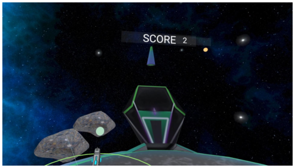
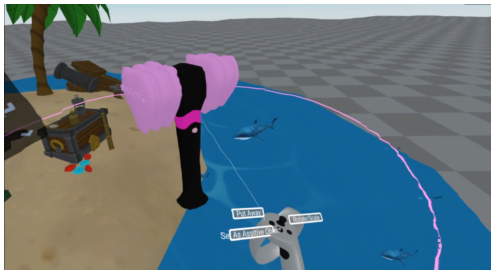
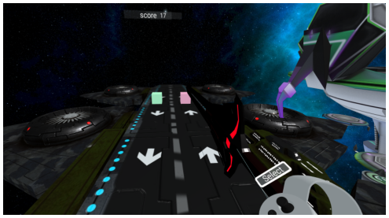

<!-- Source PDF SHA-256: 82166c7853ab231d0e9f5e7aef9dbc061d154fd765ca58827a910e56f38e97fc -->

# FlowMatic: An Immersive Authoring Tool for Creating Interactive Scenes in Virtual Reality

[Source PDF](https://from.so/assets/pdfs/zhang-flowmatic-uist2020.pdf) · [Publisher page](https://doi.org/10.1145/3379337.3415824)

Lei Zhang School of Information University of Michigan Ann Arbor, MI USA raynez@umich.edu

Steve Oney School of Information University of Michigan Ann Arbor, MI USA soney@umich.edu

Figure 1: System preview of FlowMatic. (a) shows the edit mode. (i) is a palette menu attached to the left controller that allows users to browse, search, and import 3D models into the scene. (ii) is a toolbox for the user to add programming primitives such as operators and data sources into the Functional Reactive Programming (FRP) Diagram in (iii). (b) shows the run mode where users can evaluate the application in real time by hiding all the programming primitives.

> © 2020 Copyright held by the owner/author(s). Publication rights licensed to ACM. ISBN 978-1-4503-6708-0/20/04...$15.00

> Permission to make digital or hard copies of all or part of this work for personal or classroom use is granted without fee provided that copies are not made or distributed for profit or commercial advantage and that copies bear this notice and the full citation on the first page. Copyrights for components of this work owned by others than the author(s) must be honored. Abstracting with credit is permitted. To copy otherwise, or republish, to post on servers or to redistribute to lists, requires prior specific permission and/or a fee. Request permissions from permissions@acm.org.

## ABSTRACT

Immersive authoring is a paradigm that makes Virtual Reality (VR) application development easier by allowing programmers to create VR content while immersed in the virtual environment. In this paradigm, programmers manipulate programming primitives through direct manipulation and get immediate feedback on their program’s state and output. However, existing immersive authoring tools have a low ceiling; their programming primitives are intuitive but can only express a limited set of static relationships between elements in a scene. In this paper, we introduce FlowMatic, an immersive authoring tool that raises the ceiling of expressiveness by allowing programmers to specify reactive behaviors— behaviors that react to discrete events such as user actions,

DOI: [https://doi.org/10.1145/3313831.XXXXXXX](<https://doi.org/10.1145/3313831.XXXXXXX>) system timers, or collisions. FlowMatic also introduces primitives for programmatically creating and destroying new objects, for abstracting and re-using functionality, and for importing three-dimensional (3D) models. Importantly, FlowMatic uses novel visual representations to allow these primitives to be represented directly in VR. We also describe the results of a user study that illustrates the usability advantages of Flow- Matic relative to a two-dimensional (2D) authoring tool and we demonstrate its expressiveness through several example applications that would be impossible to implement with existing immersive authoring tools. By combining a visual program representation with expressive programming primitives and a natural User Interface (UI) for authoring programs, FlowMatic shows how programmers can build fully interactive virtual experiences with immersive authoring.

## INTRODUCTION

For decades, the idea of being able to immerse ourselves in computer-generated worlds has captured the popular imagination. With rapid advances and increasing commercialization of Virtual Reality (VR) technologies, this idea is closer than ever to becoming reality. A wide range of VR applications has emerged for entertainment \[[47](<#page-12>)\], education \[[43](<#page-12>)\], collaboration \[[33](<#page-12>)\], productivity \[[48](<#page-12>)\], and social purposes \[[27](<#page-11>)\].

VR applications are uniquely compelling for end users because they enable natural and intuitive interactions in a three-dimensional (3D) space. For novice developers, however, VR applications are uniquely difficult to program because they require advanced knowledge of imperative programming, 3D modeling, geometry, and reactive programming. Even desktop-based Visual Programming Languages (VPLs) built for non-experts, such as Unreal Blueprints \[[45](<#page-12>)\], require that users mentally translate between two-dimensional (2D) and 3D representations and predict how their code will execute in VR.

One possible solution to these challenges is a paradigm called immersive authoring, in which users create, edit, and evaluate 3D content directly while immersed in the VR world. Immersive authoring enables a faster, more intuitive workflow by allowing users to manipulate programming primitives in VR through direct manipulation \[[38](<#page-12>)\]. Immersive authoring also enables a more fluid workflow by offering immediate feedback as the user designs and programs a virtual scene. Several immersive authoring tools allow users to create static 3D models or sketches \[[34](<#page-12>), [3](<#page-11>), [13](<#page-11>), [31](<#page-12>)\], and others allow programmers to declare dynamic relationships between object properties \[[40](<#page-12>), [22](<#page-11>), [12](<#page-11>), [52](<#page-12>)\]. However, existing immersive authoring systems cannot express reactive behaviors, a fundamental requirement for most practical VR applications. Reactive behaviors are behaviors where the application responds to events like user actions, system events, or collisions. Typically, programming reactive behaviors requires writing text-based imperative event-action code, which is difficult to represent effectively in VR.

In order to raise the ceiling of what immersive authoring systems can express, we introduce FlowMatic, which allows novice programmers to define reactive behaviors and prototype interactive VR scenes. Our techniques build on Functional Reactive Programming (FRP), a declarative paradigm that treats discrete events (e.g., user input) as first-class data that can be referenced, managed, and transformed along with “signals”, which represent continuous values (e.g., the user’s position). We also introduce techniques for dynamically creating new objects in the environment, abstracting and re-using functionality, visually representing types, and easily importing 3D models into a scene. We also propose interaction techniques that take advantage of the intuitive and direct interactions that VR affords. The contributions of this paper are:

- Techniques to raise the ceiling of the expressiveness of immersive authoring tools, including the ability to create reactive behaviors and to programmatically create and destroy objects in a scene.

- The first visual representation of FRP primitives and the first immersive authoring system that integrates FRP.

- A set of dynamic operations, intuitive interactions, and visual representations for defining reactive behaviors.

- A qualitative comparative study of the system demonstrating its usability and benefits, and example applications demonstrating its expressiveness.

## RELATED WORK

We draw on prior research into immersive authoring tools, 3D programming environments, and declarative models.

### Immersive Authoring Tools

Immersive authoring tools allow users to build the virtual world while they are situated in VR. We distinguish between immersive modeling tools for creating static 3D scenes and immersive authoring tools for creating dynamic 3D scenes.

#### Immersive Modeling

Commercial desktop modeling software (such as Maya and Blender) has been popular for creating 3D models for years. However, a wealth of spatial information is lost since users are constrained to view and interact through a 2D window. Previous work has thus explored immersive modeling for building 3D models directly in the immersive virtual environment by proposing intuitive interaction techniques that can leverage users’ spatial reasoning skills \[[6](<#page-11>), [25](<#page-11>), [34](<#page-12>), [26](<#page-11>), [16](<#page-11>), [13](<#page-11>), [24](<#page-11>), [31](<#page-12>)\]. One of the earliest attempts to achieve this was 3DM \[[6](<#page-11>)\], a Head-Mounted Display (HMD)-based modeler that allows users to build and view 3D models in the 3D virtual environments. Along this line of research, ISAAC \[[25](<#page-11>)\] introduces more intuitive forms of interactions in 3D and adds constraints to the interactions for accomplishing more precise work. Mine et al. later proposed an approach that combines precise 2D touch surfaces and 3D bimanual spatial inputs to build complex 3D models in VR \[[26](<#page-11>)\]. Lift-Off \[[16](<#page-11>)\] explored generating 3D models from mid-air 2D sketches drawn by users. More recently, commercial applications such as Google Tilt Brush \[[13](<#page-11>)\], Microsoft Maquette \[[24](<#page-11>)\], and Oculus Medium \[[31](<#page-12>)\] have delivered compelling immersive 3D sculpting experiences to consumers. While our system builds on some of the intuitive interactions that these tools use, the biggest difference between the above systems and FlowMatic is that none of the above systems can create interactive scenes, where virtual objects react to users’ actions or system events in the scene.

#### Immersive Authoring

Immersively adding interactivity and functionality to objects in VR can be difficult since it normally requires writing text-based code to define logic, such as triggering reactions in response to system events. Text-based programming languages are difficult to present in VR, because (1) many VR systems have lower resolution displays that are acceptable for graphics but not pages of text and (2) text entry in VR can be challenging. Further, text-based languages usually have a steep learning curve for end users. Therefore, some previous work has explored incorporating VPLs, especially dataflow programming languages, into immersive authoring systems \[[40](<#page-12>), [23](<#page-11>), [21](<#page-11>), [12](<#page-11>), [52](<#page-12>)\].

Steed et al. \[[40](<#page-12>)\] were among the earliest to introduce the concept of using a visual dataflow representation within the virtual immersive environment to define behaviors of objects. In their system, users can draw wires to connect virtual objects and virtual representations of input devices in the immersive environment. The data would then propagate along the wires across different objects in the scene, thus specifying their configurations. Lee et al. took the idea of immersive dataflow programming further by providing different properties of objects and computational primitives in the virtual dataflow representation \[[23](<#page-11>), [21](<#page-11>)\] and coined the term “immersive authoring”. More recently, Ens et al. \[[12](<#page-11>)\] built an immersive authoring system using a visual dataflow representation in VR for specifying behaviors of Internet of Things (IoT) devices. This pattern of embedding dataflow programming languages in the 3D immersive environments was found to be intuitive and easy for both novice programmers and end users \[[52](<#page-12>), [23](<#page-11>)\].

A key limitation of all the aforementioned tools is their lack of expressiveness. By using basic dataflow programming, these immersive authoring tools can only express a limited set of static relationships among pre-defined objects in a scene. More importantly, they cannot define reactive behaviors of objects. Complex VR applications normally come with a rich set of system events (e.g. collisions, user actions, and state changes) and behaviors triggered by those events (e.g. color changed when being selected). The closest related work to ours is \[[52](<#page-12>)\], which presents an immersive data-flow programming interface for novice programmers to author VR scenes. The key limitation of the interface is that it is unable to express discrete events and behaviors triggered by those events. Although LogiX \[[49](<#page-12>)\] allows programmers to define reactive behaviors of objects using visual dataflow programming directly in VR, the system can only edit existing objects in the scene. FlowMatic builds on prior work by integrating concepts from FRP and providing a rich set of programming primitives and intuitive interactions suitable for programmatically creating/destroying objects, defining reactive behaviors, and reducing complexity by abstracting operations.

### 3D Programming Environments

Creating a VR scene basically requires creating virtual objects with their properties, arranging them in the scene, and determining their behaviors in each frame. Game engines based on entity-component architecture such as Unity \[[44](<#page-12>)\] and Unreal \[[46](<#page-12>)\] are currently the most popular tools for programming VR applications. In recent years, the advances of WebVR have also given rise to libraries and frameworks such as Three.js \[[7](<#page-11>)\] and A-FRAME \[[2](<#page-11>)\], which enable developers to build VR scenes as web applications that can be loaded by web browsers. However, all the above tools for programming VR scenes involve arguably complex user interfaces and imperative programming languages such as C# and JavaScript, which require extensive training.

Several 2D declarative authoring tools have proposed to make 3D programming more accessible to novices \[[32](<#page-12>), [17](<#page-11>), [36](<#page-12>), [45](<#page-12>)\]. For example, Alice \[[32](<#page-12>)\] is a 2D block-based programming environment that enables users to rapidly prototype 3D animations. Saquib et al. \[[36](<#page-12>)\] developed a 2D authoring tool that uses a dataflow representation to bind user inputs with graphical effects for Augmented Reality (AR) presentations. Unreal Blueprint \[[45](<#page-12>)\], a mainstream platform for developing 3D applications, also uses event graphs and function calls to assist novices in programming interactive behaviors related to system events. Earlier systems such as VRML97 \[[8](<#page-11>)\] and X3D \[[5](<#page-11>)\] also provide a declarative format for the description of 3D content and utilize event passing mechanisms to define user interaction. However, a common limitation of these tools is that they constrain users to viewing and interacting through 2D displays, even though they are built for developing 3D applications. With the lack of additional spatial information and the disconnection between developing environments (2D displays) and testing environments (3D worlds), users have to mentally translate between 3D objects and their 2D projections and predict how their code will execute in VR. A previous study also found that 3D tracked input devices enable a more intuitive and faster workflow in completing 3D tasks compared to traditional Window Icon Menus Pointer (WIMP) interfaces \[[38](<#page-12>)\]. Our system builds on prior work by creating a 3D authoring tool that enables novices to build VR scenes within VR with immediate feedback and without writing lines of code. Further, we propose intuitive interaction mechanisms for controlling programming primitives, abstracting and re-using behaviors.

### Declarative Programming Models

Although there is an extensive literature on declarative programming models, we only focus on dataflow programming and FRP that are related to our approach.

#### Dataflow Programming

Dataflow programming languages have a long history, beginning with Bert Sutherland’s Ph.D. thesis \[[41](<#page-12>)\]. The dataflow model is represented by a directed graph, consisting of data sources, data sinks and nodes. The nodes are primitive operations such as arithmetic and comparison operations. The direction of each edge represents the direction of the data propagation across different nodes. Researchers have then improved and applied dataflow programming in various domains \[[18](<#page-11>), [28](<#page-11>), [14](<#page-11>), [19](<#page-11>), [40](<#page-12>), [22](<#page-11>), [12](<#page-11>)\]. For example, Show and Tell \[[18](<#page-11>)\] was one of the earliest visual dataflow languages targeted primarily at elementary school children. Lau-Kee et al. \[[19](<#page-11>)\] built a visual programming tool and environment for interactive image processing. Successful commercial software that incorporates visual dataflow programming—such as LabView \[[15](<#page-11>)\] and Max MSP \[[1](<#page-11>)\]—has also been popular in the domains of hardware and music respectively.

Despite being intuitive for end users, basic dataflow programming has several weaknesses of expressiveness such as visual cluttering when scaling to complex dataflow graphs with lots of nodes and edges \[[39](<#page-12>)\], and lack of support for control issues such as state transition and initialization \[[51](<#page-12>)\]. We address the visual cluttering issue in the domain of authoring VR scenes by introducing techniques of abstracting and re-using behaviors. We further adopt the FRP model and make explicit controls for defining reactive behaviors and initializing 3D objects at run time.

#### Functional Reactive Programming

The concept of reactive programming has been proposed for implementing event-driven applications based on synchronous dataflow programming paradigms but with relaxed real-time constraints \[[4](<#page-11>)\]. FRP \[[10](<#page-11>)\] integrates reactive programming into functional programming. The basic primitives in FRP are behaviors, which refer to different states of the system defined by continuous time-varying values, and event streams, which refer to infinite streams of discrete values. Users can define the behaviors by specifying how they should change in response to the incoming events. Event-driven FRP (E-FRP) \[[50](<#page-12>)\] is considered a more efficient variant of FRP that can guarantee real-time execution of FRP programs using two phases: 1) comparing the current state with the prior state of the computation to see whether they are the same, and 2) updating the current state. The FRP approach is suitable for a variety of areas such as interactive 2D animations \[[10](<#page-11>)\], web applications \[[9](<#page-11>)\], and data visualizations \[[37](<#page-12>)\]. To our knowledge, FlowMatic is the first to exploit the expressiveness of FRP in authoring VR scenes and further visualize FRP semantics in the 3D space. FlowMatic also proposes a set of domain-specific operators for programming VR applications.

## SYSTEM DESIGN

We have three primary design goals for FlowMatic:

- To raise the ceiling of the expressiveness of immersive authoring tools.

- To minimize its learning curve by relying on a small number of conceptual primitives that behave consistently.

- To build visualizations and controls that are appropriate for state-of-the-art VR systems.

FlowMatic starts with a standard dataflow model that allows users to define relationships between objects in the scene and the state of the user. The top-level primitive of FlowMatic is called a scene (analogous to a “program”). Every scene can contain any number of elements from the following list:

- Models represent 3D shapes in the scene that are visible to users. Every model contains:

- Attributes, which control how the model is displayed. For example, a model representing a stereo box might have attributes controlling its volume, position, and color. Attributes can reference and be referenced by other elements in the scene.

- Methods, which are discrete actions that a model might take, such as animations. Like attributes, methods can reference or be referenced by other elements in the scene.

- Data sources are ways for data to enter the application. Like models, data sources contain attributes that can be referenced by other elements in the scene. Unlike models, however, data sources are only visible to the programmer— not for users of the applications they create. FlowMatic contains three kinds of data sources:

- Avatars provide information about the state of the user, as first introduced by Steed and Slater \[[40](<#page-12>)\]. For example, avatars allow programmers to reference the position of the user’s headset and controllers in the virtual scene, the buttons the user is pressing, and more.

- Constants represent values that never change but need to be referenced as part of the scene. For example, in the expression “x+5”, 5 is a constant.

- Randomized Generators provide randomized data that can be referenced for non-deterministic programs. This is analogous to how Unix systems can pipe data from /dev/random.

- FRP diagrams represent the logic of the scene—how elements change dynamically and react to user and system events. The FRP diagram contains four kinds of elements:

- Operations, which transform and manipulate the data[1](<#page-4>). Operations can accept any number of arguments and produce any number of outputs.

- Nodes, which are elements that can be referenced in the FRP diagram. Every node is part of an operation, model, or data source.

- Edges between nodes that specify how data flows within the FRP diagram.

- Abstract models, which are models that can programmatically be added and removed from the scene at runtime. Abstract models have the same attributes and methods as normal models but are not instantiated until the abstract model is passed into the create() operation.

Although FlowMatic is an immersive authoring tool, several aspects of immersive authoring are beyond its scope— particularly the ability to define new 3D models and to define rendering functions that specify how to display a given model given its attribute states. However, future iterations of Flow- Matic could incorporate such features by building on prior work, such as TiltBrush \[[13](<#page-11>)\] and Medium \[[31](<#page-12>)\].

FlowMatic consists of three User Interface (UI) components, as Figure [1](<#page-1>) (a) shows. The palette menu (Figure [1](<#page-1>) (i)) allows users to search, select, and import 3D models to the scene. The canvas (Figure [1](<#page-1>) (iii)) shows the FRP diagram that the user creates. The toolbox (Figure [1](<#page-1>) (ii)) allows users to select from a set of data sources and operators used for the diagram. We will delve into the design of each component and use an interactive example to showcase the workflow of FlowMatic.

### Palette Menu

Palette Tool Menus are widely adopted in popular immersive authoring tools such as Google Tilt Brush \[[13](<#page-11>)\] and Microsoft Maquette \[[24](<#page-11>)\]. In FlowMatic, the palette tool menu is always attached to the left controller, as Figure [2](<#page-5>) shows.

#### Import 3D Objects

FlowMatic allows users to import both primitive models (e.g. cubes, spheres) and models from Sketchfab[2](<#page-4>), a popular library of 3D models, as Figure [2](<#page-5>) shows. Users use a raycast shooting from one controller to select different models and then import them to the VR world by pressing a button on the controller. Any animations associated with imported models are represented as methods in FlowMatic, which execute the animation when called. FlowMatic also includes models for displaying text (for example, to display a user’s current score in a game).

#### Stop Mode and Run Mode

Although users enjoy liveness (where they can see the output immediately after they write part of the program), prior work has found that they prefer having a button that allows them to

1The operations that FlowMatic includes are based on those of the RxJS JavaScript library \[[35](<#page-12>)\].

> 2[https://sketchfab.com/](<https://sketchfab.com/>)

Figure 2: The palette menu of FlowMatic. (a)/(i) is the interface that allows users to import primitive models and select their colors using the color palette. (b)/(ii) is the interface that allows users to browse, search for, and import models from online. (iii) is a toggle for displaying the FRP diagram. (iv) allows users to create text elements in the scene.

switch between running and editing the program \[[52](<#page-12>)\]. This is partly because they may accidentally trigger the actions in their application while they are using the controllers to manipulate the programming primitives. As Figure [2](<#page-5>) shows, users can switch between stop mode and run mode, where stop mode shows both 3D models and the programming primitives (e.g. operators, data sources, or attributes), whereas run mode only shows the 3D models.

### Functional Reactive Programming Diagram

In order to represent discrete events, we incorporate concepts from FRP. We choose FRP as a complement to the state-of-the-art immersive authoring tools for several reasons. First, VR applications, like most graphical applications, are typically event-driven \[[11](<#page-11>)\]. Although previous immersive authoring tools cannot express various system events, FRP models event streams as a first-class abstraction. Second, from an end user’s perspective, the benefits of FRP are similar to those in favor of declarative programming over imperative programming—ease of construction, composability, clean semantics, etc. Especially for immersive authoring systems, FRP enables end users to focus on “what” to present instead of “how” to present on the HMD, which they have neither expertise nor interest in. Lastly, FRP fits within the dataflow model but also provides more expressive functionality, such as the abstractions of event streams. In FlowMatic, the user edits the FRP diagram using a canvas, as Figure [1](<#page-1>) (iii) shows. Users can also toggle whether the FRP diagram is shown (developer mode) or not (user mode).

#### Signals &amp; Events

The essence of FRP is the notion of signals for representing continuous time-varying values (e.g. time, position, and rotation) and event streams for representing discrete events (e.g. button presses and collisions). These are the only two first-class and composable abstractions. Although signals are widely supported by the state-of-the-art immersive authoring tools, event streams are not. For example, using current immersive authoring tools, users cannot specify that something should happen when the user presses a button[3](<#page-5>). FlowMatic addresses this by modeling behaviors of objects using FRP’s notion of signals and event streams.

Event streams can be attached to model methods (to specify when to call a particular method) or composed and manipulated into more complex event streams or signals. They can be emitted from the user’s input devices (e.g., controller button presses) or from system events (e.g., collisions, timed intervals, or animations).

Figure 3: The type visualization in FlowMatic. We use shapes to represent first-class abstractions (a). We use colors to represent data types (b). The combination of shape and color represents the abstraction and data type.

#### Type Visualization and Constraints

To minimize the learning curve for adopting the concept of FRP, FlowMatic also enables type visualizations and constraints. Specifically, we represent data types using color and first-class abstractions using shapes, as shown in Figure [3](<#page-5>). In addition, we allow type constraints on the connections so that an edge can only establish when the types of the two ports are compatible, as shown in Figure [4](<#page-6>) (a) &amp; (b). This visual feedback can help users avoid type errors effectively. We also introduce polymorphic ports, as shown in Figure [4](<#page-6>) (c) &amp; (d), where the type of a connector can be polymorphic according to the incoming data types.

### Dynamic Operations: An Interactive Example

While the state-of-the-art immersive authoring tools allow users to define the behaviors of existing objects in the scene, they cannot dynamically operate on 3D objects, which means that users are not able to author scenes that can programmatically create or destroy objects, react to system events, or perform discrete actions. This is difficult in previous immersive authoring tools because they define behaviors using the dataflow model, which specifies continuous relationships and typically needs the objects to exist in the scene—dataflow connections rely on the object being visible.

> 3This is different from expressing a relationship that holds while the user presses a button, a continuous event.

Figure 4: The type constraints in FlowMatic. (a) shows the state before making a connection. (b) shows that when making a connection of type object, all ports of incompatible types will be transparent and unconnectable. (c) &amp; (d) demonstrate polymorphic ports. The snapshot operator takes a snapshot of the input signal whenever the event is fired and outputs event streams of the same type as the input signal.

In order to programmatically create objects in the scene at runtime, FlowMatic includes abstract nodes. Users can create abstract models as placeholders for objects that will be created in the scene at some point in the future. They can draw edges to and from these abstract models to specify dependencies and behaviors (for example, to specify the dynamics of where it should appear in the scene when it shows up). Finally, they can use the create() operator to create any number of instances of these abstract models. Conversely, the destroy() operator removes an existing object from the scene. It can destroy models that were created dynamically or ‘regular’ models that the user manually placed in the scene. We will illustrate this with the example of how Bob uses FlowMatic to progressively program a simple shooting game, which is impossible to build with previous immersive authoring tools. Note that in the example we cover only a subset of all the operators in FlowMatic but we demonstrate how a limited number of operations are sufficient for building such interactive behaviors.

The first feature towards a shooting game is to specify that a bullet should be instantiated at the gun tip whenever the player presses the trigger button on the controller. In order to achieve that, Bob first wants to get the position value of the gun tip every time the player presses the trigger. The first operator being used is called snapshot(). The snapshot() operator takes two inputs—an event and a signal—and produces one output. The functionality of the operator is to always take a “snapshot” of the signal’s current value whenever the event fires. After dynamically getting the position value of the gun tip, Bob uses the create() operator to dynamically instantiate a sphere (that represents a bullet) at that position. The create() operator thus takes several inputs including a class that comes from an abstract model indicating what type of objects to create, an event that defines when to create it, and several parameters for the instantiation such as position and scale. The output of the create() operator is the instantiated object (an individual bullet).

Figure 5: Resulting scene of a simple interactive example.

The second step is to set the bullet’s trajectory so it shoots along the gun direction and then destroy it when it collides with an object. Bob gets the instantiated object from the output of the create() operator and uses a translate() operator to translate the bullet. The translate() operator takes four inputs: an object that specifies which instantiated object to operate on, a from\_position that defines the start position, a to\_position that defines the end position, and a speed that defines the speed of the translation. Bob sets from\_position to the position of the gun tip and to\_position to the position of the destination (an abstract node). The output of the operator is an event that will emit when the translation completes.

As a final step, Bob wants to specify that when the bullet collides with an obstacle, both the bullet and the obstacle should be destroyed. The collide() operator is designed to detect collisions between two objects in the scene. It thus takes two inputs that specify the two objects respectively and produces four outputs—an event that emits when the collision starts, an event that emits when the collision ends, and the ids of the two collided objects. Bob uses the destroy() operator to specify that when a bullet collides with an asteroid, both should be destroyed. Figure [5](<#page-6>) shows the scene resulting from this example.

### Interaction Design

#### Direct Manipulation of Objects

We iterated our design to directly manipulate objects in VR by matching the direct manipulations that people perform physically in real life and preliminary feedback we gathered from user tryouts. Users use a raycast shooting from the right controller to aim and use the trigger button on the controller to select items on the menu, analogous to conventional WIMP interactions. Users also use the raycast to aim at connectors, press the trigger button to start drawing an edge, and release it when aiming at the target connector, analogous to conventional drag-and-drop interactions. Users can directly move an object and place it in the 3D space by holding and releasing the grip button on the controller. Users can remove an object or an edge by aiming at it with the raycast and pressing a button on the controller. They can also rotate and scale the object using the thumbstick on the right controller while holding the object. This is especially useful when creating abstract nodes as placeholders, since users can inspect the positions and scales of the models directly in VR.

Figure 6: In FlowMatic, users can create and re-use new operators as abstractions. By ‘pulling’ an operator closer to the user using the thumbstick (a), they create a new abstraction (b). As they pull additional operators into the abstraction (c), FlowMatic automatically updates its inputs and outputs (d).

#### Abstracting and Re-using Behaviors

FlowMatic enables users to define and re-use customized operators by taking abstractions of basic operators or data sources, as Figure [6](<#page-7>) shows. To initiate an abstraction, users can ‘pull’ an existing operator closer to them using the thumbstick on the controller. The abstraction then contains the target operator. Users can continue to ‘absorb’ additional operators into the abstraction. The abstraction can dynamically update its inputs and outputs based on the operators being abstracted. Users can ‘push’ the abstraction back to the FRP diagram again using the thumbstick once the abstraction is done. Users can also save the abstraction in the toolbox for future use by pressing a button on the controller. These abstractions make complex FRP diagrams easier to read and allow users to build up higher levels of abstraction.

## IMPLEMENTATION

FlowMatic is open source and publicly available for other researchers to build on and evaluate[4](<#page-7>). The front-end of Flow-

> 4[https://github.com/RayneZhang/FlowMatic](<https://github.com/RayneZhang/FlowMatic>)

Matic builds on A-FRAME, which in turn builds on Three.js and WebVR. The back end of FlowMatic uses Node.js and RxJS \[[35](<#page-12>)\] to handle FRP logic.

## EVALUATION

We conducted a user evaluation to evaluate the learnability, efficiency, and usability of FlowMatic. Specifically, we designed our evaluation (1) to see whether participants are able to build VR applications with FlowMatic, and (2) to gain insights into the advantages, disadvantages, and usability of immersive authoring systems.

Because there is no existing immersive authoring tool that allows users to program reactive behaviors, we chose A-FRAME \[[2](<#page-11>)\], a popular JavaScript framework for programming web-based VR content, as a representation of conventional desktop methods for authoring VR. There are two reasons we chose A- FRAME as a comparison. First, A-FRAME uses entity-component architecture and an event-handler mechanism for programming VR applications, which have been a fundamental feature of developing 3D user interfaces including VR applications \[[11](<#page-11>)\]. Second, A-FRAME has been used for several research projects \[[30](<#page-12>), [29](<#page-12>)\], including FlowMatic, and has proven usable and capable of authoring event-driven behaviors.

### Participants

We recruited 8 participants (6 female, 1 male, and 1 non-binary, age 20–26) to evaluate our system. All participants had at least a beginner level of JavaScript (have taken at least one web programming class) and half of them identified themselves as experts (have experience building websites using JavaScript and are very familiar with syntax frequently used in JavaScript). All participants reported having no or very limited experience in programming VR applications before. Participants were paid $25 USD for an approximately 120-minute study.

### Procedure

We used two different study tasks and two systems with which to implement them (A-FRAME or FlowMatic), all counterbalanced to control for learning effects. The study procedure consisted of three sessions: 50 minutes for training and experimenting with the first system, 50 minutes for training and experimenting with the second system, and 15 minutes for retrospective interviews and post-task questionnaires. In each 50-minute session, we spent the first 20 minutes helping the participants go through a tutorial of the system and then gave the participants 30 minutes to implement the task. The tutorial for A-FRAME was a document that introduced the syntax and Application Programming Interfaces (APIs) necessary for programming VR applications. The tutorial for FlowMatic contained basic concepts and operators necessary for the experiment. Participants also did some exercises with each system to write basic features in addition to the tutorials, but none of the features were the same as the actual tasks. The task descriptions were the same regardless of the implementation system. Table [1](<#page-8>) shows the descriptions for each task, which consisted of four steps.

After the training, we gave participants 30 minutes for the task in each condition and did not give them further instructions

Table 1: Two tasks given to the participants in the evaluation

<table>
  <thead>
    <tr>
      <th id="pdf-table-1277:0-03a72b21-table-8-1-0-0-038300e8" scope="col" data-pdf-scope="Both"></th>
      <th id="pdf-table-1277:0-03a72b21-table-8-1-0-1-316aa28b" scope="col" headers="pdf-table-1277:0-03a72b21-table-8-1-0-0-038300e8">Task 1: Stage Animation</th>
      <th id="pdf-table-1277:0-03a72b21-table-8-1-0-2-bab5c5b2" scope="col" headers="pdf-table-1277:0-03a72b21-table-8-1-0-0-038300e8">Task 2: Shooting Game</th>
    </tr>
  </thead>
  <tbody>
    <tr>
      <th id="pdf-table-1277:0-03a72b21-table-8-1-1-0-5d2b5a8d" scope="row" headers="pdf-table-1277:0-03a72b21-table-8-1-0-0-038300e8">Step 1</th>
      <td headers="pdf-table-1277:0-03a72b21-table-8-1-0-1-316aa28b pdf-table-1277:0-03a72b21-table-8-1-1-0-5d2b5a8d">Create three light models in the scene</td>
      <td headers="pdf-table-1277:0-03a72b21-table-8-1-0-2-bab5c5b2 pdf-table-1277:0-03a72b21-table-8-1-1-0-5d2b5a8d">Create a gun model in the scene</td>
    </tr>
    <tr>
      <th id="pdf-table-1277:0-03a72b21-table-8-1-2-0-08d0b2b6" scope="row" headers="pdf-table-1277:0-03a72b21-table-8-1-0-0-038300e8">Step 2</th>
      <td headers="pdf-table-1277:0-03a72b21-table-8-1-0-1-316aa28b pdf-table-1277:0-03a72b21-table-8-1-2-0-08d0b2b6">Place the lights: 1. Each light must be next to each performer on the stage 2. The lights should appear on the stage floor</td>
      <td headers="pdf-table-1277:0-03a72b21-table-8-1-0-2-bab5c5b2 pdf-table-1277:0-03a72b21-table-8-1-2-0-08d0b2b6">To dynamically create a sphere at the gun tip, when the user presses the trigger button on the right controller.</td>
    </tr>
    <tr>
      <th id="pdf-table-1277:0-03a72b21-table-8-1-3-0-5857d0d2" scope="row" headers="pdf-table-1277:0-03a72b21-table-8-1-0-0-038300e8">Step 3</th>
      <td headers="pdf-table-1277:0-03a72b21-table-8-1-0-1-316aa28b pdf-table-1277:0-03a72b21-table-8-1-3-0-5857d0d2">The light in the middle should always shoot at the user, even if the user is moving</td>
      <td headers="pdf-table-1277:0-03a72b21-table-8-1-0-2-bab5c5b2 pdf-table-1277:0-03a72b21-table-8-1-3-0-5857d0d2">The created sphere should translate from the tip position to the destination that is along the gun direction.</td>
    </tr>
    <tr>
      <th id="pdf-table-1277:0-03a72b21-table-8-1-4-0-ea8592fc" scope="row" headers="pdf-table-1277:0-03a72b21-table-8-1-0-0-038300e8">Step 4</th>
      <td headers="pdf-table-1277:0-03a72b21-table-8-1-0-1-316aa28b pdf-table-1277:0-03a72b21-table-8-1-4-0-ea8592fc">The light in the middle should be turned off when the user presses the trigger button on the left controller, and be turned on when the user releases the trigger button on the left controller</td>
      <td headers="pdf-table-1277:0-03a72b21-table-8-1-0-2-bab5c5b2 pdf-table-1277:0-03a72b21-table-8-1-4-0-ea8592fc">The created sphere should disappear after translating to the destination</td>
    </tr>
  </tbody>
</table>

on how to complete the task unless they specifically asked for help or we noticed they had been stuck for more than 1 minute. Participants were allowed to freely use the tutorials for reference. In the A-FRAME condition, the participants were allowed to copy the APIs from the document directly to the Integrated Development Environment (IDE). In both conditions, the participants were allowed to ask for clarifications on specific concepts, APIs, or operators covered in the tutorials. The researchers would then give the clarifications verbally. Questions that were unrelated to the contents of the tutorials, such as what the next step in the task should be, were counted as asking for help.

To make the comparison with A-FRAME fair, we tried to provide the same level of abstractions of APIs. For example, when implementing the feature of translation from one position to another, the participants only needed to specify the entity (which will translate), the from position, and the to position in both systems. We also provided the same resources in terms of digital models. During the tasks, we observed how often participants made errors and what types of errors they made in both conditions.

After completing both tasks, we conducted a one-on-one retrospective interview with each participant to obtain feedback on how the tools compared and the usability issues. Participants next filled out a questionnaire about the systems. The questionnaire used a 5-point Likert scale (1–Strongly Disagree, 5–Strongly Agree), assessing the learnability, usability, and other metrics of FlowMatic.

## RESULTS

All participants were able to implement the given tasks using both systems. We observed that participants made more errors when using A-FRAME and normally spent more time on fixing errors, though we did not quantitatively measure the time spent on error fixing. Some common errors when using A-FRAME were binding event listeners to wrong entities, confusing init() with the tick() function, and forgetting to attach components to entities.

### Retrospective Interviews

During the retrospective interviews, we asked participants about the comparison between the two authoring tools and their preferences. We also asked about the advantages and disadvantages of each tool.

#### No Code Required.

All eight participants mentioned that one of the advantages of FlowMatic is that users can do programming tasks without any experience in coding. Similar feedback also included that FlowMatic would be suitable for teaching people to program.

P8: “\[FlowMatic\] would be a lot easier for artists, beginners to coding, and kids who don’t know actual coding because you have to learn the basics of Javascript to use \[A-FRAME\].”

#### Correspondence between Programs and Objects.

Participants also described FlowMatic as more “direct” and “intuitive”. More specifically, participants thought that it is “always easier to know which object and which event you are operating on” with FlowMatic (P2), while it is “hard to keep track of what you are doing and which variable you are working on” using A-FRAME (P3). This is because FlowMatic allows users to operate directly on the objects in the scene so that they can establish correspondences between the program and the objects more easily. With 2D authoring tools, on the other hand, users have to establish the correspondences between the scripts and the objects, which requires more mental effort.

#### Liveness.

Participants pointed out that the immediate feedback of FlowMatic, its liveness \[[42](<#page-12>)\], helped them to be “more efficient” (P8). While using A-FRAME, they had to “spend time on compiling and running” (P8). Another participant also mentioned that the liveness gave her “more sense of accomplishment” (P6).

#### Context Switching.

Six out of eight participants mentioned that with A-FRAME they had to do “context switch” or “switching back and forth” between the HMD and the IDE. They also preferred FlowMatic for being easier and more convenient, since “everything is in VR” (P6).

P4: “To test what I was doing \[in A-FRAME\], I had to compile, reload the webpage, wear the headset, and head back to the IDE to do bug fixing, which is very time-consuming.”

#### Syntax.

Participants also said that FlowMatic is easier because the syntax for specifying behaviors is more concise and intuitive than in A-FRAME.

P7: “It seems like there is a lot of syntax involved \[in A-FRAME\], such as having to get the position of an object, and having to instantiate things, which I think would be easier to get the trigger \[button\] for those \[in Flow- Matic\].”

Another example of this is that participants made a lot of mistakes related to the syntax of A-FRAME, such as attaching a component, binding an event listener, etc.

#### Debugging.

Debugging was an interesting topic throughout the interviews. It turned out that each system has its own benefits and drawbacks in terms of debugging. Participants who thought debugging was easier in FlowMatic claimed that “it is easier to see how I did wrong since everything is visual (in FlowMatic) and one node is connected to another”(P8), and that bug fixing is harder in A-FRAME due to frequently switching the context, according to P4. Participants who thought debugging was easier in A-FRAME commented that it was easier to utilize simple functions like console.log() to see whether an event had been triggered or not, according to P2. It was also easier because users can go through the code and see where is wrong, while using FlowMatic it is hard for the user to check if she connected a wrong arrow and to know how to change it, according to P5.

### Questionnaire

Figure [7](<#page-9>) shows the aggregated results from the usability questionnaire. Six out of eight participants agreed that FlowMatic is easy to learn (5 Strongly Agree, 1 Agree), while only one participant strongly agreed that A-FRAME is easy to learn. Six participants agreed that FlowMatic is easy to use (3 Strongly Agree, 3 Agree), while five participants agreed that A-FRAME is easy to use (1 Strongly Agree, 4 Agree). All participants agreed that the design of FlowMatic is good (5 Strongly Agree, 3 Agree). Six participants agreed that FlowMatic is helpful in programming VR applications and that it would be easy to become skillful at FlowMatic. Seven out of eight participants thought FlowMatic was fun to play with (6 Strongly Agree, 1 Agree), which corresponds to the interview feedback that it is interesting to use FlowMatic.

Figure 7: Results of the usability questionnaire.

## DISCUSSION

Our results indicate that our immersive authoring system, FlowMatic, is generally easy to learn and use. We observed that participants tended to make more errors when using desktop authoring tools, though we did not quantify them. Even though all participants had programming experience, the errors they made were heavily linked to the programming paradigm of each authoring system, which was outside the scope of their previous experience. More specifically, in the A-FRAME condition, the errors were mostly linked with the entity-component system and the event-handler mechanism, which are the core of current VR application development tools.

Participants were also able to build target reactive behaviors using FlowMatic and all of them believed that FlowMatic was more beneficial for non-programmers and novice programmers. Most of them agreed that FlowMatic was more intuitive and direct and they generally preferred the liveness of Flow- Matic. Participants also thought FlowMatic was interesting and fun to play with. Using desktop authoring methods, users often need to deal with a lot of “chores” that are less related to their authoring intentions, such as dealing with frame-rate-driven architecture and repeatedly switching between developing and testing. Those chores are also less interesting to users. By integrating FRP and fusing developing and testing in the immersive environment, FlowMatic allows users to directly map their intentions into operations and receive immediate feedback in the 3D world.

## EXAMPLE APPLICATIONS

To demonstrate the expressiveness of FlowMatic, we use replicated examples \[[20](<#page-11>)\] and create three example applications. The first application, a blaster game, is one of the most common gaming mechanisms in VR where the user shoots bullets using the controller to try to hit the targets. The VR Whac- A-Mole game asks users to use a hammer to hit the moles that are generated in random positions on the ground. In the last application, we replicated Beat Saber—one of the most popular VR games, where users swing their controllers to slash the blocks moving towards them in a certain rhythm.

### Blaster Game

The tricky parts of creating a blaster game include dynamically creating bullets at the gun tip position at run time, detecting collisions between targets and each bullet, and dynamically destroying objects when they collide. As partly covered in the previous example, we accomplish this by using FRP operators that can dynamically create, translate, and destroy a bullet (represented as a sphere but can be any model from an online library) according to different system events.

Figure 8: A Blaster Game created using FlowMatic, where the player presses the trigger button on the controller to shoot spheres out and earns scores by hitting the target asteroids.

### VR Whac-A-Mole

Whac-A-Mole is a classic arcade game where the user uses a hammer to hit the randomly generated moles and earn scores. Again, this application requires dynamically creating/destroying objects and reacting to system events such as collisions between the hammer and the moles. In addition, this application was previously hard to replicate because it requires the system to generate objects at random positions in the space. We address this by using an aforementioned abstract node to directly specify an area and a random generator as an operator to generate random data of type vector3 as positions within the area.

Figure 9: A VR Whac-A-Mole game where the user holds a hammer and tries to hit the shark models randomly generated on the water’s surface.

### Beat Saber

Beat Saber is a popular rhythm game in VR. The difficult aspect of replicating this game is to arrange the timing of each moving block according to the rhythm. We address this by using an interval operator that can fire events based on a specified interval value. The create operator can then subscribe to the internal clock events and generate blocks accordingly.

## LIMITATIONS &amp; FUTURE WORK

Our current study has several limitations. First, we have only performed a short-term study comparing FlowMatic and A- FRAME for beginners. A long-term study or a study with experts in VR will be needed to see whether the conclusion still holds for people who are familiar with VR programming tools and immersive authoring tools. Second, since all of our participants had an interest in VR and FlowMatic appeared new to them, their feedback may be biased. People who are experts in JavaScript may feel more comfortable using imperative programming languages rather than FRP. Finally, while FlowMatic is expressive for creating different reactive behaviors, there are several components of VR applications that are not supported in FlowMatic yet, such as authoring particle systems and complex algorithms. However, recreating a complex authoring tool such as game engines is beyond the scope of this paper. Instead, we explored the possibility of making programming VR applications easier and proved that FlowMatic is capable of allowing novices to build relatively complex VR scenes.

Figure 10: A basic implementation of Beat Saber, where the blocks are created at certain intervals and the player swings the sword and hits the cubes to earn scores.

Future work will first address several design challenges and usability issues in immersive authoring tools. For example, some participants commented that navigating the virtual world could cause slight motion sickness. A comparative study between immersive authoring systems and 2D VPLs such as Unreal Blueprints might be needed to further investigate the unique benefits brought by the 3D space for displaying the program layout and avoiding visual cluttering. Documentation would be another interesting direction in the future, as two participants said they preferred A-FRAME in the sense that the APIs documentation was detailed and easy to understand. It is also important for future immersive authoring systems to save users from the heavy effort of switching between documentation and implementation.

## CONCLUSION

In this paper, we presented a novel immersive authoring system named FlowMatic that raises the ceiling of the expressiveness of immersive authoring tools. To enable that, we integrated concepts of FRP and modeled reactive behaviors of objects as time-varying signals or event streams. FlowMatic introduces a set of dynamic operations, intuitive interactions, and visual representations for defining reactive behaviors, reducing complexity, and programmatically creating/destroying objects in a scene. We conducted a comparative study with A-FRAME, a desktop authoring method, to evaluate the usability, advantages and disadvantages of our immersive authoring system. Our study results show that participants were able to build the target reactive behaviors using FlowMatic, and that it is intuitive, fun to play with, and helpful for programming VR applications. We also demonstrate the expressiveness of FlowMatic by replicating three relatively complex applications that were impossible to build using prior immersive authoring systems.

## ACKNOWLEDGEMENTS

We thank our study participants and reviewers for their time and effort.

## REFERENCES

- \[1\] Cycling ’74. 2018. Max 8. (2018). [https://cycling74.com/products/max/](<https://cycling74.com/products/max/>)

- \[2\] A-FRAME. 2015. A-FRAME. (2015). [https://aframe.io/](<https://aframe.io/>)

- \[3\] Rahul Arora, Rubaiat Habib Kazi, Danny M Kaufman, Wilmot Li, and Karan Singh. 2019. MagicalHands: Mid-Air Hand Gestures for Animating in VR. In Proceedings of the 32nd Annual ACM Symposium on User Interface Software and Technology. 463–477.

- \[4\] Engineer Bainomugisha, Andoni Lombide Carreton, Tom van Cutsem, Stijn Mostinckx, and Wolfgang de Meuter. 2013. A survey on reactive programming. ACM Computing Surveys (CSUR) 45, 4 (2013), 52.

- \[5\] Don Brutzman and Leonard Daly. 2010. X3D: extensible 3D graphics for Web authors. Elsevier.

- \[6\] Jeff Butterworth. 1992. 3DM: a three-dimensional modeler using a head-mounted display. (1992).

- \[7\] Ricardo Cabello. 2010. three.js. (2010). [https://threejs.org/](<https://threejs.org/>)

- \[8\] Rikk Carey and Gavin Bell. 1997. The annotated VRML 2.0 reference manual. Number BOOK. Addison-Wesley.

- \[9\] Evan Czaplicki and Stephen N Chong. 2013. Asynchronous functional reactive programming for GUIs. In Proceedings of the 34th ACM SIGPLAN Conference on Programming Language Design and Implementation-PLDI’13. ACM Press.

- \[10\] Conal Elliott and Paul Hudak. 1997. Functional reactive animation. In ACM SIGPLAN Notices, Vol. 32. ACM, 263–273.

- \[11\] Carmine Elvezio, Mengu Sukan, and Steven Feiner. 2018. Mercury: A messaging framework for modular ui components. In Proceedings of the 2018 CHI Conference on Human Factors in Computing Systems. ACM, 588.

- \[12\] Barrett Ens, Fraser Anderson, Tovi Grossman, Michelle Annett, Pourang Irani, and George Fitzmaurice. 2017. Ivy: Exploring spatially situated visual programming for authoring and understanding intelligent environments. In Proceedings of the 43rd Graphics Interface Conference. Canadian Human-Computer Communications Society, 156–162.

- \[13\] Google. 2016. Google Tilt Brush. (2016). [https://www.tiltbrush.com/](<https://www.tiltbrush.com/>)

- \[14\] Daniel D Hils. 1991. Datavis: a visual programming language for scientific visualization. In Proceedings of the 19th annual conference on Computer Science. ACM, 439–448.

- \[15\] National Instruments. 2017. LabVIEW. (2017). [http://www.ni.com/labview/](<http://www.ni.com/labview/>)

- \[16\] Bret Jackson and Daniel F Keefe. 2016. Lift-off: Using reference imagery and freehand sketching to create 3d models in vr. IEEE transactions on visualization and computer graphics 22, 4 (2016), 1442–1451.

- \[17\] Annie Kelly, R Benjamin Shapiro, Jonathan de Halleux, and Thomas Ball. 2018. ARcadia: A rapid prototyping platform for real-time tangible interfaces. In Proceedings of the 2018 CHI Conference on Human Factors in Computing Systems. ACM, 409.

- \[18\] Takayuki Dan Kimura, Julie W Choi, and Jane M Mack. 1986. A visual language for keyboardless programming. (1986).

- \[19\] David Lau-Kee, Adam Billyard, Robin Faichney, Yasuo Kozato, Paul Otto, Mark Smith, and Ian Wilkinson. 1991. VPL: an active, declarative visual programming system. In Proceedings 1991 IEEE Workshop on Visual Languages. IEEE, 40–46.

- \[20\] David Ledo, Steven Houben, Jo Vermeulen, Nicolai Marquardt, Lora Oehlberg, and Saul Greenberg. 2018. Evaluation strategies for HCI toolkit research. In Proceedings of the 2018 CHI Conference on Human Factors in Computing Systems. 1–17.

- \[21\] Gun A Lee and Gerard J Kim. 2009. Immersive authoring of Tangible Augmented Reality content: A user study. Journal of Visual Languages &amp; Computing 20, 2 (2009), 61–79.

- \[22\] Gun A Lee, Gerard J Kim, and Mark Billinghurst. 2005. Immersive authoring: What you experience is what you get (wyxiwyg). Commun. ACM 48, 7 (2005), 76–81.

- \[23\] Gun A Lee, Claudia Nelles, Mark Billinghurst, and Gerard Jounghyun Kim. 2004. Immersive authoring of tangible augmented reality applications. In Proceedings of the 3rd IEEE/ACM international Symposium on Mixed and Augmented Reality. IEEE Computer Society, 172–181.

- \[24\] Microsoft. 2018. Microsoft Maquette. (2018). [https://www.maquette.ms/](<https://www.maquette.ms/>)

- \[25\] Mark Mine. 1995. ISAAC: A virtual environment tool for the interactive construction of virtual worlds. UNC Chapel Hill Computer Science Technical Report TR95-020 (1995).

- \[26\] Mark Mine, Arun Yoganandan, and Dane Coffey. 2014. Making VR work: building a real-world immersive modeling application in the virtual world. In Proceedings of the 2nd ACM symposium on Spatial user interaction. ACM, 80–89.

- \[27\] Mozilla. 2018. Mozilla Hubs. (2018). [https://hubs.mozilla.com/](<https://hubs.mozilla.com/>)

- \[28\] Marc A Najork and Eric Golin. 1990. Enhancing Show-and-Tell with a polymorphic type system and higher-order functions. In Proceedings of the 1990 IEEE Workshop on Visual Languages. IEEE, 215–220.

- \[29\] Michael Nebeling and Katy Madier. 2019. 360proto: Making Interactive Virtual Reality &amp; Augmented Reality Prototypes from Paper. In Proceedings of the 2019 CHI Conference on Human Factors in Computing Systems. ACM, 596.

- \[30\] Michael Nebeling, Janet Nebeling, Ao Yu, and Rob Rumble. 2018. Protoar: Rapid physical-digital prototyping of mobile augmented reality applications. In Proceedings of the 2018 CHI Conference on Human Factors in Computing Systems. ACM, 353.

- \[31\] Oculus. 2016. Oculus Medium. (2016). [https://www.oculus.com/medium/](<https://www.oculus.com/medium/>)

- \[32\] Randy Pausch, Tommy Burnette, AC Capeheart, Matthew Conway, Dennis Cosgrove, Rob DeLine, Jim Durbin, Rich Gossweiler, Shuichi Koga, and Jeff White. 1995. Alice: Rapid prototyping system for virtual reality. IEEE Computer Graphics and Applications 15, 3 (1995), 8–11.

- \[33\] Thammathip Piumsomboon, Gun A Lee, Jonathon D Hart, Barrett Ens, Robert W Lindeman, Bruce H Thomas, and Mark Billinghurst. 2018. Mini-me: An adaptive avatar for mixed reality remote collaboration. In Proceedings of the 2018 CHI conference on human factors in computing systems. 1–13.

- \[34\] Kevin Ponto, Ross Tredinnick, Aaron Bartholomew, Carrie Roy, Dan Szafir, Daniel Greenheck, and Joe Kohlmann. 2013. SculptUp: A rapid, immersive 3D modeling environment. In 2013 IEEE Symposium on 3D User Interfaces (3DUI). IEEE, 199–200.

- \[35\] RxJS. 2015. RxJS. (2015). [https://rxjs-dev.firebaseapp.com/](<https://rxjs-dev.firebaseapp.com/>)

- \[36\] Nazmus Saquib, Rubaiat Habib Kazi, Li-Yi Wei, and Wilmot Li. 2019. Interactive Body-Driven Graphics for Augmented Video Performance. In Proceedings of the 2019 CHI Conference on Human Factors in Computing Systems. ACM, 622.

- \[37\] Arvind Satyanarayan, Ryan Russell, Jane Hoffswell, and Jeffrey Heer. 2015. Reactive vega: A streaming dataflow architecture for declarative interactive visualization. IEEE transactions on visualization and computer graphics 22, 1 (2015), 659–668.

- \[38\] Udo Schultheis, Jason Jerald, Fernando Toledo, Arun Yoganandan, and Paul Mlyniec. 2012. Comparison of a two-handed interface to a wand interface and a mouse interface for fundamental 3D tasks. In 2012 IEEE Symposium on 3D User Interfaces (3DUI). IEEE, 117–124.

- \[39\] Tiago Boldt Sousa. 2012. Dataflow programming concept, languages and applications. In Doctoral Symposium on Informatics Engineering, Vol. 130.

- \[40\] Anthony Steed and Mel Slater. 1996. A dataflow representation for defining behaviours within virtual environments. In Proceedings of the IEEE 1996 Virtual Reality Annual International Symposium. IEEE, 163–167.

- \[41\] William Robert Sutherland. 1966. The on-line graphical specification of computer procedures. Ph.D. Dissertation. Massachusetts Institute of Technology.

- \[42\] Steven L Tanimoto. 2013. A perspective on the evolution of live programming. In Proceedings of the 1st International Workshop on Live Programming. IEEE Press, 31–34.

- \[43\] Balasaravanan Thoravi Kumaravel, Fraser Anderson, George Fitzmaurice, Bjoern Hartmann, and Tovi Grossman. 2019. Loki: Facilitating Remote Instruction of Physical Tasks Using Bi-Directional Mixed-Reality Telepresence. In Proceedings of the 32nd Annual ACM Symposium on User Interface Software and Technology. 161–174.

- \[44\] Unity. 2005. Unity. (2005). [https://unity.com/](<https://unity.com/>)

- \[45\] Unreal. 2020a. Unreal Blueprints. (2020). [https://docs.unrealengine.com/Engine/Blueprints/](<https://docs.unrealengine.com/Engine/Blueprints/>)

- \[46\] Unreal. 2020b. Unreal Engine 5. (2020). [https://www.unrealengine.com/](<https://www.unrealengine.com/>)

- \[47\] Valve. 2020. Half-Life: Alyx. (2020). [https://www.half-life.com/en/alyx/](<https://www.half-life.com/en/alyx/>)

- \[48\] The Verge. 2018. Microsoft is bringing the SharePoint work environment to virtual reality headsets. (2018). [https://www.theverge.com/2018/5/21/17376422/](<https://www.theverge.com/2018/5/21/17376422/microsoft-sharepoint-spaces-mixed-reality-virtual-%5Creality-features>) [microsoft-sharepoint-spaces-mixed-reality-virtual-\\](<https://www.theverge.com/2018/5/21/17376422/microsoft-sharepoint-spaces-mixed-reality-virtual-%5Creality-features>) [reality-features](<https://www.theverge.com/2018/5/21/17376422/microsoft-sharepoint-spaces-mixed-reality-virtual-%5Creality-features>)

- \[49\] Neos VR. 2018. LogiX. (2018). [https://neosvr.com/](<https://neosvr.com/>)

- \[50\] Zhanyong Wan, Walid Taha, and Paul Hudak. 2002. Event-driven FRP. In International Symposium on Practical Aspects of Declarative Languages. Springer, 155–172.

- \[51\] Baltasar Trancón y Widemann and Markus Lepper. 2014. Foundations of Total Functional Data-Flow Programming.. In MSFP. 143–167.

- \[52\] Lei Zhang and Steve Oney. 2019. Studying the Benefits and Challenges of Immersive Dataflow Programming. In 2019 IEEE Symposium on Visual Languages and Human-Centric Computing (VL/HCC). IEEE, 39–47.
