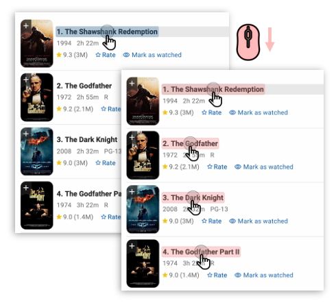
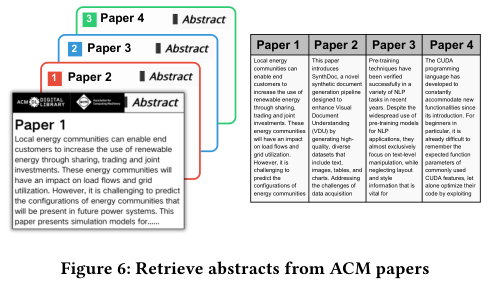
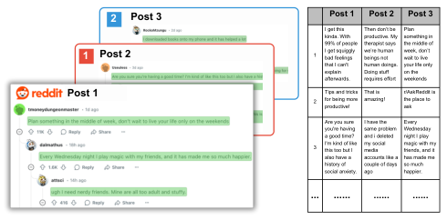

<!-- Source PDF SHA-256: 0d297ded89ae34326adc5984ea341f4b5f2b59571f6836569799137a8d2077fe -->

# Multi-Click: Cross-Tab Web Automation via Action Generalization

[Source PDF](https://from.so/assets/pdfs/zhang-multi-click-uist2025.pdf) · [Publisher page](https://doi.org/10.1145/3746059.3747780)

Jiacheng Zhang School of Information University of Michigan, Ann Arbor Ann Arbor, Michigan, USA jiache@umich.edu

Jiawen Li Electrical Engineering and Computer Science Department University of Michigan, Ann Arbor Ann Arbor, Michigan, USA lijiawen@umich.edu

Maryam Arab School of Information University Of Michigan Ann Arbor, Michigan, USA maryarab@umich.edu

Steve Oney School of Information University of Michigan Ann Arbor, Michigan, USA soney@umich.edu

![Multi-Click is a technique for simultaneously performing the same action (e.g., clicking or typing) across multiple targets. In the illustration above, a user opens many related items on a single page using a simultaneous click ( A○). Each of these items opens in a separate tab. The user then clicks common elements across these tabs (in this case, an ‘Edit’ button B○), which performs the same action simultaneously across each tab. They then select text input elements across these tabs ( C○) and use an interactive data grid/spreadsheet as the values for each input ( D○).](../figures/zhang-multi-click-uist2025/figure-001-p001.png)

Figure 1: Multi-Click is a technique for simultaneously performing the same action (e.g., clicking or typing) across multiple targets. In the illustration above, Multi-Click is activated by double-tapping the Shift key. Then the user opens many related items on a single page using a simultaneous click ( ○A ). Each of these items opens in a separate tab. The A1B1user then clicks common elements across these tabs (in this case, an ‘Edit’ button ○B ), which performs the same action simultaneously across each tab. They then select text input elements across these tabs ( ○C ) and use an interactive data grid/spreadsheet as the values for each input ( ○D ).

© 2025 Copyright held by the owner/author(s). ACM ISBN 979-8-4007-2037-6/25/09 [https://doi.org/10.1145/3746059.3747780](<https://doi.org/10.1145/3746059.3747780>)

## Abstract

Repetitive actions are a common and frustrating part of using the web. Prior work has proposed automating repetitive actions with natural language descriptions, demonstrations, and pseudocode. However, these approaches introduce abstractions that can be difficult to write, evaluate, and fit within web workflows. We describe a new approach, Multi-Click, for simultaneously performing the same action (e.g., clicking or typing) across multiple pages while maintaining the immediacy and understandability of direct manipulation. Users can intuitively select groups of analogous elements within or across windows/tabs (e.g., equivalent elements in different instantiations of a template) and interact with these elements as if each simultaneously had keyboard or cursor focus (e.g., one click propagates to multiple targets). Multi-Click introduces algorithms for identifying analogous elements from structural and visual attributes; techniques for intuitively selecting and visualizing targets;

and uses interactive data grids to manage variation in text entry and retrieval tasks.

## ACM Reference Format:

Jiacheng Zhang, Jiawen Li, Maryam Arab, and Steve Oney. 2025. Multi- Click: Cross-Tab Web Automation via Action Generalization. In The 38th Annual ACM Symposium on User Interface Software and Technology (UIST ’25), September 28–October 01, 2025, Busan, Republic of Korea. ACM, New York, NY, USA, 10 pages. https://doi.org/10.1145/3746059.3747780

## 1 Introduction

Web users often need to perform repetitive actions—tasks that are very similar and must be executed multiple times to achieve a [larger goal \[38\]. For example, tasks such as extracting data across](<#page-9>) multiple product pages, entering similar information into numerous inputs, or updating the same setting across multiple records in administrative interfaces all might require performing the same series of clicks and key presses repeatedly, with minimal variation.

Prior work has proposed using web automation—software that performs actions on behalf of users—to automate repetitive tasks. [Academic \[13,](<#page-9>) [15,](<#page-9>) [19,](<#page-9>) [32,](<#page-9>) [39,](<#page-9>) [66\] and commercial systems \[5](<#page-9>), [9,](<#page-9>) [46,](<#page-9>) [51,](<#page-10>) [52,](<#page-10>) [58\] have](<#page-10>) explored various strategies to improve web automation capabilities. However, interacting with these tools often

> This work is supported by NSF award 2007857.

[This work is licensed under a Creative Commons Attribution 4.0 International License.](<https://creativecommons.org/licenses/by/4.0>)

UIST ’25, Busan, Republic of Korea presents its own challenges. Writing automation scripts manu[ally can be difficult \[31\] and scripts specified by demonstration or](<#page-9>) [natural language can be difficult to predict and control \[36\]. Web](<#page-9>) automation tools also often suffer from high error rates and may not integrate smoothly into standard web user workflows, making mixed-initiative control difficult.

Recognizing these limitations, we propose action generalization as an alternative approach to automation, enabling users to apply a single operation simultaneously to multiple elements in batch. We present Multi-Click, an instantiation of action generalization that lets users select multiple targets for input events (e.g., mouse clicks or keyboard input) within or across web browser tabs and windows. Multi-target operations are typically implemented at the application level; for example, many list interfaces feature “select all” and “delete selected” widgets. However, these application-level implementations are limited to actions that are explicitly provided by the application developers. In contrast, action generalization is an input-level technique that can be applied to any application.

The technique of selecting multiple elements and simultaneously applying input actions has been previously explored in data visu[alization \[27\], text editing \[48](<#page-9>), [50\], and code editing \[1](<#page-9>)\]. However, Multi-Click is the first system to extend this concept to general web browsing. It enables users to intuitively select multiple analogous elements within or across browser tabs and interact with them simultaneously through direct manipulation. Multi-Click also lets users manage variations in data entry and extraction tasks with interactive data tables. Users can write spreadsheet formulae whose outputs are fed to &lt;input/&gt; elements in batches. Conversely, they can import web content from multiple elements into a single table. [Figure 1 illustrates three user interactions with Multi-Click.](<#page-1>)

Multi-Click targets scenarios involving multiple instantiations of the same template within or across browser tabs. For instance, a web forum might contain a list of posts, each featuring a clickable title, a gray publication date, and the author’s name beneath—each adapted from a single ‘post’ template. This approach is less general than traditional web automation tools that handle complex and heterogeneous workflows. However, because targets and actions are clearly represented, users can easily predict the effects of their actions and visually verify the results immediately. As we found in user evaluations, action generalization can be a quicker and more intuitive direct interaction model for many realistic tasks.

## 2 Related Work

Our work on Multi-Click builds on prior work in web automation, multi-selection systems, and web augmentation.

### 2.1 Web Automation

Many web automation tools have been developed to perform ac[tions on behalf of users \[5,](<#page-9>) [9,](<#page-9>) [10,](<#page-9>) [12–](<#page-9>)[15](<#page-9>), [32,](<#page-9>) [39,](<#page-9>) [39,](<#page-9>) [46,](<#page-9>) [51,](<#page-10>) [52,](<#page-10>) [58,](<#page-10>) [66\].](<#page-10>) Similar systems have been created for automating mobile applica[tions \[40,](<#page-9>) [59\]. Some automation tools give users the ability to write](<#page-10>) [scripts that specify which actions to take \[2,](<#page-9>) [3,](<#page-9>) [6,](<#page-9>) [7\] but prior work](<#page-9>) has found that even experienced developers have trouble accurately [writing automation scripts \[31\].](<#page-9>)

#### 2.1.1 Programming by Demonstration (PbD).

To make it easier for end users to write automation code, several systems have proposed Programming by Demonstration (PbD), where users specify their intent by performing actions directly on the page, and the system infers a generalized script from these demonstrations \[23, 54\]. Systems such as CoScripter \[39\], Vegemite \[42\], Rousillon \[13\], and MIWA \[14\] exemplify efforts to allow end users to benefit from automation without programming knowledge.

Like PbD, action generalization (used by Multi-Click) tries to reduce repetitive actions by inferring generalizations based on users’ input. However, there are several key differences—action generalization works before any demonstration has occurred, whereas PbD requires at least one demonstrations before generalization. Moving the generalization step to be before the action takes place is key to giving users more control and immediacy. This, in turn, means that users do not need to understand or trust potentially opaque inferred scripts.

#### 2.1.2 Automation from Natural Language.

Several systems have proposed using scripting constructs that are similar to natural language \[39\], such as “click the ‘submit’ button.” More recently, Large Language Models (LLMs) have made it possible to automate tasks from natural language descriptions \[5, 15, 51, 52, 58, 66\]. OpenAI’s Operator \[5\] (which we use in our evaluation), for example, lets users chat with an AI agent who can perform tasks on their behalf. Users can ‘interrupt’ the agent and perform tasks manually, in a browser embedded on the Operator UI.

Most of these modern agents are capable of performing a wider range of tasks than Multi-Click but this increased generality also comes with costs. Specifically, they often suffer from limited predictability, low transparency, delayed feedback, and high error rates. Users may struggle to anticipate what the agent will do, understand why it made a particular decision, or correct errors efficiently. Additionally, because LLM agents typically operate in a sequential, turn-based interaction model, they can be slower to use for straightforward, repetitive tasks where direct manipulation would suffice. In contrast, action generalization (and Multi-Click) offer a more immediate, controllable, and predictable interaction model where users can directly select and act on multiple elements with high confidence.

#### 2.1.3 User Agency in Automation.

An important unanswered question in web automation (including PbD and NL systems) is how to effectively give users agency in automated workflows. Multi-Click demonstrates a potential approach for designing effective mixed-initiative automation tools—using automation for target selection while letting users direct the target selection strategy and choose which actions to perform on the targets.

### 2.2 Multiple Selection and Simultaneous Editing

Multiple selection refers to the ability to select multiple overlapping or distinct objects and simultaneously apply identical operations or [property changes to all selected items \[50\]. This technique has been](<#page-9>) widely adopted in file management systems, graphical interfaces, [and text editors \[11,](<#page-9>) [24,](<#page-9>) [25,](<#page-9>) [65\], allowing users to efficiently group](<#page-10>) records or objects for unified manipulation. However, these features are typically implemented at the application level, which limits their generality. Action generalization (and Multi-Click) is an input-level technique that can be applied to any application.

Input-level generalization has been explored via simultaneous editing, which enables users to apply identical modifications simul[taneously in selected text regions \[47,](<#page-9>) [48\]. These regions can be se](<#page-9>) lected manually, by example-based inference, by pattern matching, [or through structure recognition via domain-specific parsers \[49\].](<#page-9>) Any edit made in one region is automatically replicated in all other selected regions. The ideas from early work on simultaneous text [editing \[35,](<#page-9>) [48,](<#page-9>) [49\] have](<#page-9>) been incorporated into the most popu[lar modern code editors (e.g., Multi-cursor editing in VSCode \[1\]](<#page-9>) and multiline [editing in Sublime \[4\]). These systems give](<#page-9>) users immediate visual feedback and direct editing, like Multi-Click.

This idea has also been extended beyond text editing to code [refactoring \[60\], graphical editing \[57](<#page-10>)[\], slide presentations \[20\], and](<#page-9>) [list selection \[53\].](<#page-10>)

Though they work at input-level, these implementations are still domain-specific, targeting one UI or application. Multi-Click is the first to extend this idea to general web applications.

### 2.3 Mashups and Web Augmentation

Prior work has also proposed ways to let users augment and customize their web browsers without writing extensive scripts or mod[ifying pages’ source code \[16,](<#page-9>) [17,](<#page-9>) [21,](<#page-9>) [22,](<#page-9>) [41,](<#page-9>) [44,](<#page-9>) [45,](<#page-9>) [56\]. Mashups,](<#page-10>) for example, can unify diverse web content into a single unified [interface \[16,](<#page-9>) [22,](<#page-9>) [28,](<#page-9>) [29,](<#page-9>) [45,](<#page-9>) [62\]. Beyond mashups,](<#page-10>) several other tools can extract and combine information from many websites [into structured overviews \[30,](<#page-9>) [43\] or combine information from](<#page-9>) [multiple pages in other ways \[8,](<#page-9>) [28,](<#page-9>) [33\]. Like these projects, Multi-](<#page-9>) Click can combine information from multiple sources into a unified user interface. However, Multi-Click also allows users to perform actions and interactions, in addition to extracting and combining data.

## 3 Multi-Click

Multi-Click is designed to bring the benefits of batch automation to everyday web interactions without requiring programming, scripting, or detailed configuration. Instead of relying on abstract automation logic, it emphasizes immediacy: users directly select what they want to act on, see the targets in real time, and perform actions through familiar gestures like clicking or typing.

### 3.1 Using Multi-Click

Users’ interactions with Multi-Click can be broken down into three ‘steps’:

- (1) [Progressive Target Generalization:](<#page-3>) Selecting a group of elements to perform an action on.

- (2) [Target Assessment: Assessing whether the selected targets](<#page-3>) are aligned with their goal (and return to Step 1 if not).

- (3) [Action Specification: Choosing what action to take on each](<#page-4>) target element.

We break down our description into these steps, but in practice, users can perform all three steps in rapid succession (potentially in less than a second for experienced users performing straightforward tasks).

[1https://www.imdb.com/chart/top/](<https://www.imdb.com/chart/top/>)

Figure 2: Screenshots from the IMDb website[1](<#page-3>) . After Multi- Click is activated with double-tapping Shift, users can hover over an initial element and scroll the mouse wheel to generalize to equivalent elements.

#### 3.1.1 Step 1: Progressive Target Generalization.

Users activate Multi- Click by double-tapping the Shift key. A circular cursor indicator (shown in Figure 2) appears, signaling that the system is in ‘multi-target’ mode, where they can either:

- Assess [(see section 3.1.2) and modify the set of target ele](<#page-3>) ments by moving and scrolling the mouse.

- Perform an action on the currently selected targets (see sec[tion 3.1.3).](<#page-4>)

- Cancel by pressing Esc.

In ‘multi-target mode’, the element (e.g., link, &lt;button/&gt;, &lt;input/&gt;, or any other kind of element) under their cursor is the “root” target from which other targets are derived. If the user’s mouse moves to another element, the root target changes. Multi-Click then identifies other targets using a ‘generalization strategy’—a set of rules for deciding which elements are analogous to the root target based on the page structure, the element’s role, and appearance. For example, one strategy is to generalize to every element with the same tag and font. We implemented four generalization strategies, described [in Section 3.2. Generalization strategies can also work across tabs](<#page-4>) and windows to find potential target elements on different pages.

Users pick among generalization strategies by scrolling the mouse wheel, each scroll revealing a new combination of elements derived from the root target and generalization strategy. As users scroll, they can see the output of each generalization through immediate visual feedback with highlights, helping them make informed [decisions about the scope of their actions (Figure 2).](<#page-3>)

#### 3.1.2 Step 2: Assessing Targets.

In ‘multi-target mode’, Multi-Click highlights target elements with a translucent overlay on the page

Figure 3: Overview of Multi-Click’s User Interface. The user can activate Multi-Click by double-tapping Shift and scroll to select the input elements to enter values. The generalized elements are highlighted in purple (a). Tab badges are colored and indexed to match their corresponding preview cards (b). The user can see selected elements in other tabs in the preview cards, where the selected elements are highlighted in blue (c). Then the user can enter values in the interactive data table (d) and calculate results for each term simultaneously.

[(Figure 2). To ensure that users can see every target element, ele](<#page-3>) ments that are not visible (i.e., elements in other tabs) are previewed in preview overlay ‘cards’. The preview system features several key components:

- Preview cards: Previews are organized by tab, with each tab’s previews displayed in a separate preview card. Each card consists of a color-coded screenshot to match the cor[responding tab’s badge color (Figure 3b), making it easy for](<#page-4>) users to track which previews belong to which tabs (Fig[ure 3c).](<#page-4>)

- Interactive Layout: By default, preview cards are stacked at the bottom of the user’s active tab. Users can press Up or Down to expand or re-stack preview cards. When users move the cursor closer to the preview cards, they become transparent and do not interfere with mouse events, ensuring that users can still access content in their current tab.

- Real-time Updates: As users perform actions or modify selections, the previews update in real-time to show the current state of target elements across all tabs.

- Element Highlighting: Each preview shows the target elements with the same semi-transparent overlays as the current tab, making it clear which elements will be affected by generalization.

#### 3.1.3 Step 3: Action Specification.

After users have selected a set of target elements, they specify an action (e.g., click, text entry) to perform on each element. The easiest way to do this is by simply performing the action—clicking or typing. Events are propagated immediately to every target, with some differences depending on context:

- Click events: if the effect of the click is to open a new page (e.g., a hyperlink) and there are multiple links in the same tab open, each target opens in a new tab, since there are almost no situations in which users would want to open multiple pages in one tab. Otherwise (e.g., if there is one link per tab), Multi-Click performs the default behavior, replacing the current content. Regardless of context, the system exits ‘multi-target’ mode immediately after the click.

- Keyboard events: when users type into text input fields, an [interactive data table appears (Figure 3d) with a cell for every](<#page-4>) target. Each cell in the data table is colored to match the input it controls. Users can either (1) type into the original input field, whose exact value propagates to every target input, or (2) write values and/or formulae in the data table, whose values are propagated to the relevant target inputs.

We designed these interactions to feel intuitive by aligning them with familiar web browsing behaviors. When only a single target element is selected, users can interact with Multi-Click just as they would with any standard webpage. This consistency ensures that it remains lightweight and non-disruptive in simple cases, while gracefully scaling up to more powerful multi-target interactions when needed without an additional abstraction layer.

### 3.2 Generalization Strategies

We experimented with several generalization strategies that infer related elements based on the structure of the page, including some [proposed in prior work \[31\]. However, a key insight of our design of](<#page-9>) Multi-Click is that simpler generalization strategies that reference the appearance of elements seem to be more effective at finding analogous elements than complex strategies that reference the page structure alone. This is because developers tend to maintain visual consistency across elements with similar roles. While visual appearance can be suggestive, Multi-Click generalizes primarily based on DOM structure and shared CSS specifications (e.g., tag, font, max-width, etc.), a concept we call intra-page consistency. Intra-page consistency is crucial for page usability (consistency and predictability make UIs easier to use) and can simplify implementation (it is easier to design and maintain pages that repeat components).

Multi-Click uses the following algorithms to provide the suggestions within the current window based on the root element.

- (1) Just the root element

- (2) Elements with the same tag and font as the root element

- (3) (If the root element has a class) Elements that share a class with the root element and have the same font

- (4) (If the root element is a text input), either:

- If the root is inside a form, other form inputs of the same type, or

- if the root is not inside a form, any other input of the same type

After generating generalization suggestions of elements for the current window, Multi-Click extracts the set of XPaths for the generalized elements and queries for analogous elements across every open browser tab. Every element is then partitioned into (a) clickable elements (e.g., links, buttons, or anything else that might have event listeners), (b) input elements (e.g., input, textarea, or select), and (c) non-interactive text-only elements. Multi-Click generates visual previews for each target element. To provide context, the system includes any associated label elements that are connected to these target elements. Additionally, parent elements containing text are included to provide surrounding context that helps users understand the element’s purpose and placement within the page. If there are input elements (b), a data table is displayed.

### 3.3 Implementation

[We implemented Multi-Click as an extension for the Mozilla Firefox](<https://mozilla.org/firefox/>) [web browser. Our implementation uses the WebExtension cross-](<https://mozilla.org/firefox/>) browser API so also works with Google Chrome (tested) and Microsoft Edge (not tested). However, unlike Firefox, Chrome does not contain an API for fetching screenshots of non-focused tabs so preview cards are blank in Chrome. Our implementation can be [found at https://anonymous.4open.science/r/multiclick.](<https://anonymous.4open.science/r/multiclick>)

## 4 User Evaluation

We conducted a lab study to evaluate the usability and efficiency of Multi-Click. We recruited 20 participants (denoted P1–P20) from (anonymized) mailing list and Slack workspace. Our participants (8 men, 12 women) were aged 20–28. Six participants reported intermediate, 12 reported advanced, one reported expert, and one reported beginner proficiency with the Internet and Web technologies. Nine participants reported using web automation tools: 3 participants (P2, P9, P20) used Generative AI tools with web search functions (e.g., ChatGPT, Deepseek); 2 participants (P12, P14) mentioned browser password managers; 2 participants (P17, P19) used [web automation in professional settings.16 participants have en](<https://settings.16>) countered situations where they need to perform repetitive actions on the websites such as bulk scraping and repetitive data entry. We compensated each participant with a $20 USD Amazon gift card for the 60-minute study session. The studies were conducted in person, where participants completed three web tasks on the experimenters’ computers. Our study protocol was approved by our Institutional Review Board (IRB).

### 4.1 Study Design

After completing a pre-study survey, each participant read a tutorial on the interface and features of Multi-Click (approximately 10 minutes). Participants then performed three different web tasks using either no automation tools (manual), OpenAI’s Operator [\[5\]](<#page-9>) (a state-of-the-art web automation tool), or the Multi-Click browser extension. We chose Operator as a baseline because (1) it has the highest reported accuracy of tools currently publicly available and

(2) it was one of very few automation tools that we tested that could [perform every study task2.](<#page-5>) We prioritized evaluating Multi-Click with larger numbers of participants and thus had uneven numbers of task completions; as [Table 2 shows, 30 tasks](<#page-6>) were done with Multi-Click, 15 manually, and 15 with Operator[3](<#page-5>). We used an unbalanced trial count to prioritize depth of evaluation for Multi-Click (30 [total tasks) over symmetric baselines, following precedents \[34,](<#page-9>) [61\].](<#page-10>) Operator tasks were also conducted separately due to limited access to the system.

Upon completing these tasks, participants were asked to complete an exit survey and participate in a brief interview to share their experiences.

### 4.2 Tasks

We designed three tasks to be realistic (using popular websites for practical real-world tasks), differentiated (each involving performing a different type of action on these websites), and roughly similar difficulty. Each task involves multiple steps across operating on at least three analogous websites.

[Task 1: Canvas Assignment Editing.](<https://instructure.com/>) Canvas is the most popular Learning Management System (LMS) for schools to track and deploy educational content. We created an example Canvas page with ten assignments and asked participants to modify the point [value on each assignment (similar to Figure 1) and update the sub](<#page-1>) mission type. Participants navigated to the Canvas assignment page, opened Assignments 1–10 in separate tabs, clicked ‘Edit’ on each, set the point value to 100 and checked ‘File upload’ as the submission type. This task is representative of multi-step workflows involving several user actions.

[Task 2: GPA Calculator Input.](<https://www.calculator.net/gpa-calculator.html>) This GPA calculator website allows students to enter grades and computes a Grade Point Average (GPA). We created a spreadsheet with example grades and asked participants to enter GPA data for three terms (five courses each)

2Several automa[tion tools, including Rousillon \[13\] and ScrapeViz \[33](<#page-9>)\] can extract data but not input data so could only perform one task out of three (Task #3–Walmart). [We also tested MIWA \[14\], which can perform input events but in our testing, was not](<#page-9>) able to synthesize scripts with only input actions (and thus could also only complete Task #3–Walmart). 3All 20 participants did three tasks. 15 participants did two tasks with Multi-Click and one task manually (task and condition orders were randomized) and five (separate) participants performed all three tasks with Operator (task order was randomized).

Figure 4: Average Task Completion Time (∗ = 𝑝 &lt; 0.05, Welch’s t-test)

from the provided spreadsheet. This task is representative of input-focused workflows involving entering many input fields.

[Task 3: Walmart Product Scraping.](<https://www.walmart.com>) Walmart is a popular retail website and store. We asked participants to visit seven Walmart product pages for computer monitors and extract these products’ names, prices, and specs (resolution, screen size, and refresh rate). This task is representative of data extraction workflows that import and combine data from many sources.

### 4.3 Results

All participants completed every task successfully with fewer than three attempts in all three modes.

#### 4.3.1 Time and Task Completion.

Figure 4 and Table 1 show the analysis of task completion time for each task in each mode. As shown in Figure 4, Multi-Click can significantly save time compared to the other two modes in the study tasks. The task completion time using Multi-Click is statistically significant compared to the Operator in Task 1 (𝑝 = 0.004, 𝑡 (4.1) = −5.88) and Task 3 (𝑝 = 0.009, 𝑡 (4.3) = −4.49), and is statistically significant compared to the manual mode for Task 2 (𝑝 &lt; 0.001, 𝑡 (8.5) = −7.32) and Task 3 (𝑝 = 0.024, 𝑡 (4.4) = −3.40).

<table>
  <tbody>
    <tr>
      <td></td>
      <th id="pdf-table-1281:0-8953d099-1289:0-ab7a5319" scope="col">Auto</th>
      <th id="pdf-table-1281:0-8953d099-1290:0-75d99437" scope="col">Manual</th>
      <th id="pdf-table-1281:0-8953d099-1291:0-de071307" scope="col">Operator</th>
    </tr>
    <tr>
      <th id="pdf-table-1281:0-8953d099-1293:0-5584beb8" scope="row">Task 1</th>
      <td headers="pdf-table-1281:0-8953d099-1289:0-ab7a5319 pdf-table-1281:0-8953d099-1293:0-5584beb8">1:31 (0:38)</td>
      <td headers="pdf-table-1281:0-8953d099-1290:0-75d99437 pdf-table-1281:0-8953d099-1293:0-5584beb8">2:23 (0:47)</td>
      <td headers="pdf-table-1281:0-8953d099-1291:0-de071307 pdf-table-1281:0-8953d099-1293:0-5584beb8">13:31 (4:40)</td>
    </tr>
    <tr>
      <th id="pdf-table-1281:0-8953d099-1298:0-ceefb5c7" scope="row">Task 2</th>
      <td headers="pdf-table-1281:0-8953d099-1289:0-ab7a5319 pdf-table-1281:0-8953d099-1298:0-ceefb5c7">1:31 (0:29)</td>
      <td headers="pdf-table-1281:0-8953d099-1290:0-75d99437 pdf-table-1281:0-8953d099-1298:0-ceefb5c7">2:59 (0:23)</td>
      <td headers="pdf-table-1281:0-8953d099-1291:0-de071307 pdf-table-1281:0-8953d099-1298:0-ceefb5c7">9:55 (6:07)</td>
    </tr>
    <tr>
      <th id="pdf-table-1281:0-8953d099-1303:0-edd8adb9" scope="row">Task 3</th>
      <td headers="pdf-table-1281:0-8953d099-1289:0-ab7a5319 pdf-table-1281:0-8953d099-1303:0-edd8adb9">0:47 (0:22)</td>
      <td headers="pdf-table-1281:0-8953d099-1290:0-75d99437 pdf-table-1281:0-8953d099-1303:0-edd8adb9">2:59 (1:24)</td>
      <td headers="pdf-table-1281:0-8953d099-1291:0-de071307 pdf-table-1281:0-8953d099-1303:0-edd8adb9">3:36 (1:36)</td>
    </tr>
  </tbody>
</table>

Table 1: Average(SD) Task Completion Time(mm:ss)

#### 4.3.2 Issues Encountered.

All participants were able to complete every task successfully but some users encountered minor issues while performing tasks, as Table 2 shows. With Multi-Click, the most common issue was selecting the wrong root element for generalization (3 occurrences across 30 tasks). Specifically, some participants used the label of a button as the root element rather than the button itself. Participants encountered failures with OpenAI Operator more frequently. There were six instances (across 15 tasks) where Operator failed to perform a step (e.g., the system misinterpreted natural language prompts, executed unintended actions, or failed to parse user-provided data) and participants had to intervene manually before resuming automation. When performing tasks manually, one user was unable to copy and paste text element using mouse selection because of embedded interactive components. In each case, participants were able to address the problem on their own without intervention from the study coordinator.

<table>
  <thead>
    <tr>
      <th id="pdf-table-1331:0-58bd5cc7-1377:0-3c8ceb90" scope="col">Mode</th>
      <th id="pdf-table-1331:0-58bd5cc7-1378:0-8fb3485d" scope="col"># of Tasks</th>
      <th id="pdf-table-1331:0-58bd5cc7-1379:0-69f0bb63" scope="col"># of Issue Occurrences</th>
      <th id="pdf-table-1331:0-58bd5cc7-1380:0-63a85c79" scope="col">Reason</th>
    </tr>
  </thead>
  <tbody>
    <tr>
      <th id="pdf-table-1331:0-58bd5cc7-1382:0-96fd0f5e" scope="row" headers="pdf-table-1331:0-58bd5cc7-1377:0-3c8ceb90">Multi-Click</th>
      <td headers="pdf-table-1331:0-58bd5cc7-1378:0-8fb3485d pdf-table-1331:0-58bd5cc7-1382:0-96fd0f5e">30</td>
      <td headers="pdf-table-1331:0-58bd5cc7-1379:0-69f0bb63 pdf-table-1331:0-58bd5cc7-1382:0-96fd0f5e">3</td>
      <td headers="pdf-table-1331:0-58bd5cc7-1380:0-63a85c79 pdf-table-1331:0-58bd5cc7-1382:0-96fd0f5e">Failure in element generalization.</td>
    </tr>
    <tr>
      <th id="pdf-table-1331:0-58bd5cc7-1387:0-1aeee7ac" scope="row" headers="pdf-table-1331:0-58bd5cc7-1377:0-3c8ceb90">Operator</th>
      <td headers="pdf-table-1331:0-58bd5cc7-1378:0-8fb3485d pdf-table-1331:0-58bd5cc7-1387:0-1aeee7ac">15</td>
      <td headers="pdf-table-1331:0-58bd5cc7-1379:0-69f0bb63 pdf-table-1331:0-58bd5cc7-1387:0-1aeee7ac">6</td>
      <td headers="pdf-table-1331:0-58bd5cc7-1380:0-63a85c79 pdf-table-1331:0-58bd5cc7-1387:0-1aeee7ac">Failure in executing the correct step, reading URLs, or parsing the input data.</td>
    </tr>
    <tr>
      <th id="pdf-table-1331:0-58bd5cc7-1392:0-31dc71b6" scope="row" headers="pdf-table-1331:0-58bd5cc7-1377:0-3c8ceb90">Manual</th>
      <td headers="pdf-table-1331:0-58bd5cc7-1378:0-8fb3485d pdf-table-1331:0-58bd5cc7-1392:0-31dc71b6">15</td>
      <td headers="pdf-table-1331:0-58bd5cc7-1379:0-69f0bb63 pdf-table-1331:0-58bd5cc7-1392:0-31dc71b6">1</td>
      <td headers="pdf-table-1331:0-58bd5cc7-1380:0-63a85c79 pdf-table-1331:0-58bd5cc7-1392:0-31dc71b6">Unable to copy-and-paste.</td>
    </tr>
  </tbody>
</table>

Table 2: Summary of task completion.

#### 4.3.3 Usability and Element Selection.

Participants found Multi- Click generally intuitive and straightforward (P1, P6, P9, P11, P17). The users found that it was easy to use Multi-Click to generalize an element to equivalent elements on pages with an average rating of

6.33 out of 7 (𝑆𝐷 = 0.7). The tool is also simple to pick up and easy to use compared to more complex web automation tools (P1, P17). P14 mentioned that the selection function to look for elements similar structures is useful in helping users click buttons in batches. The highlights of selected elements also help users to understand “what areas they were in” as they moved (P9). The selection algorithm can be “very useful if I need to batch similar operations on a number of webpages” (P1). However, users also mentioned that the selection algorithm triggered by the scroll function should be improved (P15, P17). P15 expressed a desire for more precise control when selecting elements, such as identifying semantically similar elements.

#### 4.3.4 Visual Feedback.

Participants found that previews are helpful in understanding the elements to be manipulated (𝑀 = 6.27, 𝑆𝐷 = 1.06), and it was helpful to observe that previews are updated simultaneously in the automation process (𝑀 = 6.73, 𝑆𝐷 = 0.57). The users particularly appreciated the clear visual previews and animation features, which improved their confidence during interactions (P4, P8-P10, P14, P15). The previews for invisible windows are necessary to help users understand what the Multi-Click is doing on other tabs (P8, P10). P9 highlighted “the preview with animation makes things easy to follow and adds a nice touch of interactivity.” P12 liked “how previews become transparent so that I could see the original web content underlying.”

#### 4.3.5 Efficiency and Spreadsheet Functionality.

Many participants found that Multi-Click was efficient to use (P2, P11, P13–P15, P17). The participants highly valued the interactive data table functionality, rating it 6.27 out of 7 (𝑆𝐷 = 0.57), highlighting its potential to improve efficiency. The interactive input table has spreadsheet-like features so that users can easily copy and paste information from existing data (P13). Multi-Click not only “makes doing repeated tasks on the same website faster” (P15), but also relieves users from clicking multiple times to switch between tabs when they need to multitask (P11).

![Two horizontal stacked-bar panels show NASA-TLX response distributions for Multi-Click and Operator across mental demand, physical demand, hurriedness, perceived success, effort required, and stress/discouragement. Ratings run from 1 in dark red to 7 in dark blue; 1 indicates higher load, hurry, effort or stress and lower success. Multi-Click responses lean toward the favorable higher ratings across all six questions. Operator has more low ratings for hurriedness and more middle ratings for perceived success and effort. The clearest contrast is hurriedness: Operator has responses across ratings 1 through 7, including a large rating-1 segment, while Multi-Click responses are concentrated at 4 through 7.](../figures/zhang-multi-click-uist2025/figure-007-p007.png)

Figure 5: User ratings of NASA-TLX survey for Multi-Click and Operator. 1 means high mental load, high physical load, feelings of being hurried, unsuccessful, high efforts, and high stress.

#### 4.3.6 Subjective User Feedback.

In the exit survey, Multi-Click (𝑀 = 6.1, 𝑆𝐷 = 0.78) and Operator (𝑀 = 5.6, 𝑆𝐷 = 1.0) receive similar overall ratings. The results of the NASA-TLX survey \[26\] for both systems are shown in Figure 5. Participants feel more hurried when using Operator (𝑀 = 2.8, 𝑆𝐷 = 2.2) compared to Multi-Click (𝑀 = 5.8, 𝑆𝐷 = 1.4), primarily due to the fact that Operator can operate on one page at a time (𝑈 = 63.00,𝑧 = 2.18, 𝑝 = 0.024,𝑟 = 0.49). Although participants reported feeling less physical demand when using Multi-Click compared to Operator (Medians: 5.00 vs. 4.00), this difference approached but did not reach statistical significance (𝑈 = 57.00,𝑧 = 1.66, 𝑝 = 0.084,𝑟 = 0.37). Other NASA-TLX metrics including mental demand (𝑝 = 0.188), success (𝑝 = 0.419), effort (𝑝 = 0.671), and discouragement (𝑝 = 0.152) did not show significant differences between the two systems.

## 5 Scope and Example Usage Scenarios

As our evaluation shows, Multi-Click offers an approach to web automation that gives users immediacy and direct control. However, it is not as universally applicable as general-purpose automation tools; Multi-Click is scoped to tasks that involve performing the same (or similar) actions to elements that are structurally and visually similar. Further, for data input tasks, data must be formatted in a one-column list for each tab. Tasks involving unstructured elements or inputs fall outside of the effective scope of Multi-Click.

Still, these criteria align with a broad class of practical tasks. Below, we describe some example usage scenarios with real websites. They are meant to be illustrative rather than exhaustive, highlighting the types of real-world tasks where Multi-Click works and can be effective.

- Extracting abstracts from ACM: [Figure 6 shows that the](<#page-7>) user can use Multi-Click to efficiently access and manage abstracts from ACM articles. With a simple scrolling interaction, users can preview abstracts from multiple ACM paper web pages simultaneously. Furthermore, Multi-Click automatically extracts these abstracts into a structured spreadsheet, allowing convenient future operations such as copying, pasting, and further analysis.

- Batch Inputs on Job Application Portals: Many companies use similar or standardized application systems. Despite being deployed on different websites, their output structured nearly identically in a way that Multi-Click can leverage. Multi-Click enables users to input personalized information in batch to different portals with a single click and scroll. As

[Figure 7 shows, users can select from available input lists](<#page-7>) and employ a spreadsheet interface to efficiently enter data customized for various company application portals.

- Collecting Stock Data: Users can use Multi-Click to efficiently collect and compare data from stock market websites [(Figure 8). By hovering and scrolling, users can easily gather](<#page-8>) and manage stock data across multiple tabs, each displaying information from different market indices. This capability enhances the user’s ability to analyze and compare financial data effectively.

- Collecting Reddit Comments: Multi-Click can be applied to collecting user comments from online forums, such as Reddit, for subsequent textual analysis. Users can leverage Multi- Click to select and aggregate comments across multiple posts [and tabs into a spreadsheet, as illustrated in Figure 9.](<#page-8>)

Figure 9: Collect reddit comments

## 6 Limitations and Future Work

Our implementation of action generalization via Multi-Click has several limitations and promising areas for future research.

### 6.1 Heterogeneous Targets and Interactions

Multi-Click requires that the targets be analogous in structure and appearance. Future work could explore ways to perform analogous actions across heterogeneous pages that use different layouts or structures to represent the same information or inputs. For example, a user might want to enter the same ‘destination’ field across multiple travel websites with different layouts. In these situations, identifying analogous targets requires a semantic understanding of elements’ meanings. To do this automatically, future tools could [leverage developer-specified semantics \[55\]](<#page-10>) or use AI to derive [semantics (e.g., \[63\]).](<#page-10>)

Beyond having different structures, performing analogous high-level actions across pages might require different low-level input sequences. For example, many travel websites use custom date input widgets. Accomplishing the same high-level intent (selecting a departure date) might require different low-level inputs (clicking on different parts of the date selection widgets). Future work could [leverage web automation tools (including Operator \[5\]) in more](<#page-9>) targeted ways to determine the low-level actions to perform.

### 6.2 Beyond the Web to Any UI

The design of Multi-Click could be integrated at the Operating System (OS) level to apply to any user interface. However, the current implementation of Multi-Click relies on several features that are unique to the Web. Specifically, it leverages (i) access to the Document Object Model (DOM—the underlying structure of the webpage) to identify potentially analogous targets; (ii) access to the CSS Object Model (CSSOM—how the browser represents object style specifications) to identify which potential targets are most likely analogous by their appearance; (iii) JavaScript APIs for simulating user events; (iv) browser APIs for displaying target previews and interactive data tables; and (v) browser APIs for referencing web content that is open, even if it is not visible on screen.

Simulating events (iii) and target previews (iv) are relatively straightforward to implement at an OS-level. However, identifying potential targets (i) requires screen parsing—identifying UI struc[tures from visual information \[64\]. Although this is an active area](<#page-10>) of research, current algorithms are too computationally intensive to be appropriate for the kind of near-immediate feedback neces[sary for direct-manipulation interaction \[37,](<#page-9>) [64\]. Algorithms that](<#page-10>) [are faster and more specialized (e.g., \[18\]) could improve computa](<#page-9>) tional flexibility but could limit the types of UI elements that could be targeted. Further, algorithms would need to be developed to identify when elements are ‘similar’ (ii—for example, use the same font size, color, or more) without relying on style specifications. Finally, many OS-level access points do not provide a way to access elements or content that is not immediately visible (v). For example, if a user wanted to edit the same element across multiple slides in a presentation application, the system would need to proactively load or navigate to off-screen content and perform matching analyses or perform actions.

### 6.3 Parameterizable Generalization Strategies

[Future work could also extend and parameterize the four general](<#page-4>) [ization strategies built into Multi-Click. For example, each strategy](<#page-4>) could include a parameter to specify how restrictive match criteria are. Users could then choose between different generalization strategies (for example, by scrolling vertically) and different parameter values for the selected strategy (for example, by scrolling horizontally).

## 7 Conclusion

Multi-Click is a novel approach for generalizing user actions to multiple targets within or between tabs / windows. By combining progressive element selection, real-time cross-tab previews, and a unified input management interface, Multi-Click bridges the gap between lightweight direct manipulation and powerful web automation. Our user study shows that Multi-Click significantly improves task efficiency and usability compared to both manual input and state-of-the-art agent-based automation tools.

## References

\[1\] \[n. d.\]. Basic editing — [code.visualstudio.com](<https://code.visualstudio.com>)[. https://code.visualstudio.com/docs/](<https://code.visualstudio.com/docs/editing/codebasics##_multiple-selections-multicursor>) [editing/codebasics#\_multiple-selections-multicursor.](<https://code.visualstudio.com/docs/editing/codebasics##_multiple-selections-multicursor>) \[Accessed 25-03-2025\].

\[2\] \[n. d.\]. Beautiful soup. [https://www.crummy.com/software/BeautifulSoup/. \[Ac](<https://www.crummy.com/software/BeautifulSoup/>) cessed 29-03-2025\].

\[3\] \[n. d.\]. Cypress. [https://www.cypress.io/,.](<https://www.cypress.io/,>) \[Accessed 30-03-2025\].

\[4\] \[n. d.\]. Multiple selection with the keyboard — www.sublimetext.com. [https:](<https://www.sublimetext.com/docs/multiple_selection_with_the_keyboard.html>) [//www.sublimetext.com/docs/multiple\_selection\_with\_the\_keyboard.html.](<https://www.sublimetext.com/docs/multiple_selection_with_the_keyboard.html>) \[Accessed 01-04-2025\].

\[5\] \[n. d.\]. Operator — [operator.chatgpt.com](<https://operator.chatgpt.com>)[. https://operator.chatgpt.com/.](<https://operator.chatgpt.com/>) \[Accessed 05-04-2025\].

\[6\] \[n. d.\]. Puppeteer. [https://pptr.dev.](<https://pptr.dev>) \[Accessed 29-03-2025\].

\[7\] [\[n. d.\]. Selenium. https://www.selenium.dev.](<https://www.selenium.dev>) \[Accessed 01-03-2025\].

\[8\] Iñigo Aldalur, Alain Perez, and Felix Larrinaga. 2021. Web augmentation as a technique to diminish user interactions in repetitive tasks. IEEE Access 9 (2021), 112686–112704.

\[9\] [Axiom.ai](<https://Axiom.ai>). 2024. No-Code Browser Automation. [https://axiom.ai/.](<https://axiom.ai/>) Accessed: September 2024.

\[10\] Shaon Barman, Sarah E. Chasins, Rastislav Bodík, and Sumit Gulwani. 2016. Ringer: web automation by demonstration. Proceedings of the 2016 ACM SIGPLAN International Conference on Object-Oriented Programming, Systems, Languages, and Applications [(2016). doi:10.1145/2983990.2984020](<https://doi.org/10.1145/2983990.2984020>)

\[11\] Eric A. Bier, Edward W. Ishak, and Ed Chi. 2006. Entity quick click: rapid text copying based on automatic entity extraction. In CHI ’06 Extended Abstracts on Human Factors in Computing Systems (Montréal, Québec, Canada) (CHI EA ’06). Association for Computing Machinery, New York, NY, USA, 562–567. [doi:10.](<https://doi.org/10.1145/1125451.1125570>) [1145/1125451.1125570](<https://doi.org/10.1145/1125451.1125570>)

\[12\] Michael Bolin, Matthew Webber, Philip Rha, Tom Wilson, and Robert C Miller. 2005. Automation and customization of rendered web pages. In Proceedings of the 18th annual ACM symposium on User interface software and technology. 163–172.

\[13\] Sarah E Chasins, Maria Mueller, and Rastislav Bodik. 2018. Rousillon: Scraping distributed hierarchical web data. In Proceedings of the 31st Annual ACM Symposium on User Interface Software and Technology. 963–975.

\[14\] Weihao Chen, Xiaoyu Liu, Jiacheng Zhang, Ian Iong Lam, Zhicheng Huang, Rui Dong, Xinyu Wang, and Tianyi Zhang. 2023. MIWA: Mixed-Initiative Web Automation for Better User Control and Confidence. In Proceedings of the 36th Annual ACM Symposium on User Interface Software and Technology. 1–15.

\[15\] Xiang Deng, Yu Gu, Boyuan Zheng, Shijie Chen, Sam Stevens, Boshi Wang, Huan Sun, and Yu Su. 2024. Mind2web: Towards a generalist agent for the web. Advances in Neural Information Processing Systems 36 (2024).

\[16\] Giuseppe Desolda, Carmelo Ardito, Maria Francesca Costabile, and Maristella Matera. 2017. End-user composition of interactive applications through actionable UI components. Journal of Visual Languages &amp; Computing 42 (2017), 46–59.

\[17\] Oscar Díaz, Josune De Sosa, and Salvador Trujillo. 2013. Activity fragmentation in the web: empowering users to support their own webflows. In Proceedings of the 24th ACM Conference on Hypertext and Social Media. 69–78.

\[18\] Morgan Dixon and James Fogarty. 2010. Prefab: implementing advanced behaviors using pixel-based reverse engineering of interface structure. In Proceedings of the SIGCHI Conference on Human Factors in Computing Systems. 1525–1534.

\[19\] Rui Dong, Zhicheng Huang, Ian Iong Lam, Yan Chen, and Xinyu Wang. 2022. WebRobot: web robotic process automation using interactive programming-bydemonstration. In Proceedings of the 43rd ACM SIGPLAN International Conference on Programming Language Design and Implementation. 152–167.

\[20\] Darren Edge, Sumit Gulwani, Natasa Milic-Frayling, Mohammad Raza, Reza Adhitya Saputra, Chao Wang, and Koji Yatani. 2015. Mixed-initiative approaches to global editing in slideware. In Proceedings of the 33rd Annual ACM Conference on Human Factors in Computing Systems. 3503–3512.

\[21\] Diego Firmenich, Sergio Firmenich, José Matías Rivero, Leandro Antonelli, and Gustavo Rossi. 2018. CrowdMock: an approach for defining and evolving web augmentation requirements. Requirements Engineering 23 (2018), 33–61.

\[22\] Giuseppe Ghiani, Fabio Paternò, Lucio Davide Spano, and Giuliano Pintori. 2016. An environment for end-user development of web mashups. International Journal of Human-Computer Studies 87 (2016), 38–64.

\[23\] Yolanda Gil, Varun Ratnakar, and Christian Frtiz. 2011. Tellme: Learning procedures from tutorial instruction. In Proceedings of the 16th international conference on intelligent user interfaces. 227–236.

\[24\] Tovi Grossman and Ravin Balakrishnan. 2006. The design and evaluation of selection techniques for 3D volumetric displays. In Proceedings of the 19th Annual ACM Symposium on User Interface Software and Technology (Montreux, Switzerland) (UIST ’06). Association for Computing Machinery, New York, NY, USA, 3–12. [doi:10.1145/1166253.1166257](<https://doi.org/10.1145/1166253.1166257>)

\[25\] Han L. Han, Miguel A. Renom, Wendy E. Mackay, and Michel Beaudouin-Lafon. 2020. Textlets: Supporting Constraints and Consistency in Text Documents. In Proceedings of the 2020 CHI Conference on Human Factors in Computing Systems (Honolulu, HI, USA) (CHI ’20). Association for Computing Machinery, New York, NY, USA, 1–13. [doi:10.1145/3313831.3376804](<https://doi.org/10.1145/3313831.3376804>)

\[26\] Sandra G Hart and Lowell E Staveland. 1988. Development of NASA-TLX (Task Load Index): Results of empirical and theoretical research. In Advances in psychology. Vol. 52. Elsevier, 139–183.

\[27\] Jeffrey Heer, Maneesh Agrawala, and Wesley Willett. 2008. Generalized selection via interactive query relaxation. In Proceedings of the SIGCHI Conference on Human Factors in Computing Systems. 959–968.

\[28\] David F Huynh, Robert C Miller, and David R Karger. 2006. Enabling web browsers to augment web sites’ filtering and sorting functionalities. In Proceedings of the 19th annual ACM symposium on User interface software and technology. 125–134.

\[29\] Bo Jiang, Pengxiang Liu, Ye Wang, and Yezhi Chen. 2020. HyOASAM: A hybrid open API selection approach for mashup development. Mathematical Problems in Engineering 2020, 1 (2020), 4984375.

\[30\] Aniket Kittur, Andrew M Peters, Abdigani Diriye, Trupti Telang, and Michael R Bove. 2013. Costs and benefits of structured information foraging. In Proceedings of the SIGCHI Conference on Human Factors in Computing Systems. 2989–2998.

\[31\] Rebecca Krosnick and Steve Oney. 2021. Understanding the challenges and needs of programmers writing web automation scripts. In 2021 IEEE Symposium on Visual Languages and Human-Centric Computing (VL/HCC). IEEE, 1–9.

\[32\] Rebecca Krosnick and Steve Oney. 2022. ParamMacros: Creating UI Automation Leveraging End-User Natural Language Parameterization. In 2022 IEEE Symposium on Visual Languages and Human-Centric Computing (VL/HCC). IEEE, 1–10.

\[33\] Rebecca Krosnick and Steve Oney. 2024. ScrapeViz: Hierarchical Representations for Web Scraping Macros. In 2024 IEEE Symposium on Visual Languages and Human-Centric Computing (VL/HCC). IEEE, 300–305.

\[34\] Chinmay Kulkarni, Julia Cambre, Yasmine Kotturi, Michael S Bernstein, and Scott R Klemmer. 2015. Talkabout: Making distance matter with small groups in massive classes. In Proceedings of the 18th ACM conference on computer supported cooperative work &amp; social computing. 1116–1128.

\[35\] J. Landauer and M. Hirakawa. 1995. Visual AWK: a model for text processing by demonstration. In Proceedings of Symposium on Visual Languages. 267–274. [doi:10.1109/VL.1995.520818](<https://doi.org/10.1109/VL.1995.520818>)

\[36\] Tessa Lau. 2009. Why Programming by Demonstration Systems Fail: Lessons Learned for Usable AI. AI Magazine 30, 4 (2009), 65–67.

\[37\] Kenton Lee, Mandar Joshi, Iulia Raluca Turc, Hexiang Hu, Fangyu Liu, Julian Martin Eisenschlos, Urvashi Khandelwal, Peter Shaw, Ming-Wei Chang, and Kristina Toutanova. 2023. Pix2struct: Screenshot parsing as pretraining for visual language understanding. In International Conference on Machine Learning. PMLR, 18893–18912.

\[38\] Tak Yeon Lee and Benjamin B Bederson. 2016. Give the people what they want: studying end-user needs for enhancing the web. PeerJ Computer Science 2 (2016), e91.

\[39\] Gilly Leshed, Eben M Haber, Tara Matthews, and Tessa Lau. 2008. CoScripter: automating &amp; sharing how-to knowledge in the enterprise. In Proceedings of the SIGCHI Conference on Human Factors in Computing Systems. 1719–1728.

\[40\] Toby Jia-Jun Li, Amos Azaria, and Brad A Myers. 2017. SUGILITE: creating multimodal smartphone automation by demonstration. In Proceedings of the 2017 CHI conference on human factors in computing systems. 6038–6049.

\[41\] Henry Lieberman, Fabio Paternò, Markus Klann, and Volker Wulf. 2006. End-user development: An emerging paradigm. In End user development. Springer, 1–8.

\[42\] James Lin, Jeffrey Wong, Jeffrey Nichols, Allen Cypher, and Tessa A Lau. 2009. End-user programming of mashups with vegemite. In Proceedings of the 14th international conference on Intelligent user interfaces. 97–106.

\[43\] Michael Xieyang Liu, Tongshuang Wu, Tianying Chen, Franklin Mingzhe Li, Aniket Kittur, and Brad A Myers. 2024. Selenite: Scaffolding Online Sensemaking with Comprehensive Overviews Elicited from Large Language Models. In Proceedings of the 2024 CHI Conference on Human Factors in Computing Systems. 1–26.

\[44\] José A Macías and Fabio Paternò. 2008. Customization of Web applications through an intelligent environment exploiting logical interface descriptions. Interacting with Computers 20, 1 (2008), 29–47.

\[45\] Daniele Massa and Lucio Davide Spano. 2016. Facemashup: An end-user development tool for social network data. Future Internet 8, 2 (2016), 10.

\[46\] Microsoft. 2023. Reinventing Search with a New AI-Powered Microsoft Bing and Edge, Your Copilot for the Web. [https://blogs.microsoft.com/blog/2023/02/07/](<https://blogs.microsoft.com/blog/2023/02/07/reinventing-search-with-a-new-ai-powered-microsoft-bing-and-edge-your-copilot-for-the-web/>) [reinventing-search-with-a-new-ai-powered-microsoft-bing-and-edge-your](<https://blogs.microsoft.com/blog/2023/02/07/reinventing-search-with-a-new-ai-powered-microsoft-bing-and-edge-your-copilot-for-the-web/>) [copilot-for-the-web/.](<https://blogs.microsoft.com/blog/2023/02/07/reinventing-search-with-a-new-ai-powered-microsoft-bing-and-edge-your-copilot-for-the-web/>) Accessed: September 2024.

\[47\] Robert C. Miller and Alisa M. Marshall. 2004. Cluster-based find and replace. In Proceedings of the SIGCHI Conference on Human Factors in Computing Systems (Vienna, Austria) (CHI ’04). Association for Computing Machinery, New York, NY, USA, 57–64. [doi:10.1145/985692.985700](<https://doi.org/10.1145/985692.985700>)

\[48\] Robert C. Miller and Brad A. Myers. 2001. Interactive Simultaneous Editing of Multiple Text Regions. In Proceedings of the General Track: 2001 USENIX Annual Technical Conference. USENIX Association, USA, 161–174.

\[49\] Robert C. Miller and Brad A. Myers. 2002. LAPIS: smart editing with text structure. In CHI ’02 Extended Abstracts on Human Factors in Computing Systems (Minneapolis, Minnesota, USA) (CHI EA ’02). Association for Computing Machinery, New York, NY, USA, 496–497. [doi:10.1145/506443.506447](<https://doi.org/10.1145/506443.506447>)

\[50\] Robert C Miller and Brad A Myers. 2002. Multiple selections in smart text editing. In Proceedings of the 7th international conference on Intelligent user interfaces.

103–110.

\[51\] [Ottogrid.ai](<https://Ottogrid.ai>)[. 2024. AI-Powered Automation for Manual Research. https://ottogrid.](<https://ottogrid.ai/>) [ai/.](<https://ottogrid.ai/>) Accessed: September 2024.

\[52\] Rabbit Research Team. 2023. Learning Human Actions on Computer Applications. [https://www.rabbit.tech/research.](<https://www.rabbit.tech/research>) Accessed: September 2024.

\[53\] Alan Ritter and Sumit Basu. 2009. Learning to generalize for complex selection tasks. In Proceedings of the 14th International Conference on Intelligent User Interfaces (Sanibel Island, Florida, USA) (IUI ’09). Association for Computing Machinery, New York, NY, USA, 167–176. [doi:10.1145/1502650.1502676](<https://doi.org/10.1145/1502650.1502676>)

\[54\] Alborz Rezazadeh Sereshkeh, Gary Leung, Krish Perumal, Caleb Phillips, Min-fan Zhang, Afsaneh Fazly, and Iqbal Mohomed. 2020. VASTA: a vision and language-assisted smartphone task automation system. In Proceedings of the 25th international conference on intelligent user interfaces. 22–32.

\[55\] Nigel Shadbolt, Tim Berners-Lee, and Wendy Hall. 2006. The semantic web revisited. IEEE intelligent systems 21, 3 (2006), 96–101.

\[56\] Michael Spahn, Christian Dorner, and Volker Wulf. 2008. End user development: approaches towards a flexible software design. (2008).

\[57\] Sara L. Su, Sylvain Paris, and Frédo Durand. 2009. QuickSelect: history-based selection expansion. In Proceedings of Graphics Interface 2009 (Kelowna, British Columbia, Canada) (GI ’09). Canadian Information Processing Society, CAN, 215–221.

\[58\] [Taxy AI. 2024. Automate Your Browser with GPT-4. https://taxy.ai/.](<https://taxy.ai/>) Accessed: September 2024.

\[59\] Tom Veuskens, Kris Luyten, and Raf Ramakers. 2020. Rataplan: Resilient automation of user interface actions with multi-modal proxies. Proceedings of the ACM on Interactive, Mobile, Wearable and Ubiquitous Technologies 4, 2 (2020), 1–23.

\[60\] Philippe Voinov, Manuel Rigger, and Zhendong Su. 2022. Forest: Structural Code Editing with Multiple Cursors. In Proceedings of the 2022 ACM SIGPLAN International Symposium on New Ideas, New Paradigms, and Reflections on Programming and Software (Auckland, New Zealand) (Onward! 2022). Association for Computing Machinery, New York, NY, USA, 137–152. [doi:10.1145/3563835.3567663](<https://doi.org/10.1145/3563835.3567663>)

\[61\] April Yi Wang, Andrew Head, Ashley Ge Zhang, Steve Oney, and Christopher Brooks. 2023. Colaroid: A literate programming approach for authoring explorable multi-stage tutorials. In Proceedings of the 2023 CHI Conference on Human Factors in Computing Systems. 1–22.

\[62\] Jeffrey Wong and Jason I Hong. 2007. Making mashups with marmite: towards end-user programming for the web. In Proceedings of the SIGCHI conference on Human factors in computing systems. 1435–1444.

\[63\] Jason Wu, Rebecca Krosnick, Eldon Schoop, Amanda Swearngin, Jeffrey P Bigham, and Jeffrey Nichols. 2023. Never-ending learning of user interfaces. In Proceedings of the 36th Annual ACM Symposium on User Interface Software and Technology. 1–13.

\[64\] Jason Wu, Xiaoyi Zhang, Jeff Nichols, and Jeffrey P Bigham. 2021. Screen parsing: Towards reverse engineering of ui models from screenshots. In The 34th Annual ACM Symposium on User Interface Software and Technology. 470–483.

\[65\] Jibin Yin and Xiangshi Ren. 2007. Investigation to Line-Based Techniques for Multi-target Selection. In Human-Computer Interaction – INTERACT 2007, Cécilia Baranauskas, Philippe Palanque, Julio Abascal, and Simone Diniz Junqueira Barbosa (Eds.). Springer Berlin Heidelberg, Berlin, Heidelberg, 507–510.

\[66\] Boyuan Zheng, Boyu Gou, Jihyung Kil, Huan Sun, and Yu Su. 2024. Gpt-4v (ision) is a generalist web agent, if grounded. arXiv preprint arXiv:2401.01614 (2024).
