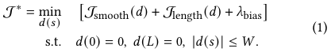

<!-- Source PDF SHA-256: 99e52d8a11ca858f98ec00f3eee19340ccf632463579eaa456f95bc3ee685b8b -->

# Simulating Human Cursor Trajectories for Path-Sensitive GUI Evaluation

[Source PDF](https://from.so/assets/pdfs/zhou-simulating-human-cursor-chiposters2026.pdf) · [Publisher page](https://doi.org/10.1145/3772363.3798829)

[Xiangyu Zhou](<https://orcid.org/0009-0003-6404-1098>) University of Michigan Ann Arbor, Michigan, USA xiangyz@umich.edu

[Steve Oney](<https://orcid.org/0000-0002-5823-1499>) School of Information University of Michigan Ann Arbor, Michigan, USA soney@umich.edu

> © 2026 Copyright held by the owner/author(s). ACM ISBN 979-8-4007-2281-3/26/04

## Abstract

User simulation models support predictive evaluation of interface designs by generating synthetic interaction behavior. While existing models can accurately simulate unconstrained pointing and clicking, many common graphical user interface interactions impose geometric constraints on cursor motion, where the path taken directly affects interaction outcomes. We present a parametrizable generative user simulation model that generates realistic cursor trajectories for such tasks by formulating constrained movement as a receding-horizon optimization problem using Model Predictive Contouring Control. The model balances speed, smoothness, and continuous path and boundary compliance. Evaluation against human data in both abstract tunnel steering tasks and realistic interface scenarios, including cascading menus and lasso selection, shows that the simulated trajectories closely match human behavior and support scalable, trajectory-level analysis of path-sensitive interface designs.

## CCS Concepts

- Human-centered computing → User models; Pointing devices; User interface design.

## Keywords

user simulation; behavior modeling; model predictive control; steering law; human–computer interaction

## ACM Reference Format:

Xiangyu Zhou and Steve Oney. 2026. Simulating Human Cursor Trajectories for Path-Sensitive GUI Evaluation. In Extended Abstracts of the 2026 CHI Conference on Human Factors in Computing Systems (CHI EA ’26), April 13–17, 2026, Barcelona, Spain. ACM, New York, NY, USA, [5](<#page-5>) pages. [https:](<https://doi.org/10.1145/3772363.3798829>) [//doi.org/10.1145/3772363.3798829](<https://doi.org/10.1145/3772363.3798829>)

> [https://doi.org/10.1145/3772363.3798829](<https://doi.org/10.1145/3772363.3798829>)

> [This work is licensed under a Creative Commons Attribution 4.0 International License.](<https://creativecommons.org/licenses/by/4.0>) CHI EA ’26, Barcelona, Spain

## 1 INTRODUCTION

User simulation models let researchers and designers reason about interaction behavior before testing or deploying interfaces \[[16](<#page-5>)\]. By generating realistic interaction traces, these models can predict user performance, support rapid iteration, and detect usability issues early in the design process. Prior work has developed simulation models for unconstrained mouse pointing tasks, where users move a cursor from a source to a target \[[6](<#page-5>), [12](<#page-5>)\] and click \[[5](<#page-5>)\]. These tasks are “unconstrained” in the sense that the cursor is allowed to take any path from the source to the target.

However, several important mouse-based interactions are constrained—the path that the cursor takes affects the outcome of the interaction, meaning successfully performing an action requires following a constrained path. For example, most cascading menus require the cursor to stay within an “interaction corridors” connecting a parent menu to its submenu to prevent menu closure. Also, tasks such as lasso-selecting a cluster of icons or freehand image segmentation require the user to maintain precise spatial bounds to preserve the intended meaning of the action.

Prior work has established robust performance models for such tasks—most notably the Steering Law \[[1](<#page-5>)\] and its extensions \[[4](<#page-5>), [19](<#page-5>), [20](<#page-5>)\]. However, performance models can only predict aggregate completion time; they do not produce user trajectories, giving limited insight into cursor dynamics or failure modes. Simulating constrained movement is non-trivial because it requires balancing traversal speed with boundary compliance. Further, while standard pointing success depends only on reaching the final destination, constrained pointing tasks are defined by the trajectory itself. To reveal usability bottlenecks, a model must capture the nuanced behaviors inherent in human movements that occur during traversal—for instance, strategic corner cutting for efficiency and intermittent corrective maneuvers—which aggregate performance laws fail to represent. We present a parameterizable simulation model for constrained cursor control. Our model generates realistic trajectories that mirror the path and speed profiles found in human data, and can be tuned to simulate particular users’ movement characteristics. Furthermore, our approach is designed for extensibility, enabling the scalable evaluation of diverse, path-sensitive cursor tasks. Specifically, this paper contributes:

- the first user simulation model that can model human cursor movement for “constrained” pointing tasks, which follow geometric constraints on the interface,

- a comparative study that demonstrates the accuracy of the model in successfully predicting human-like velocity profiles and trajectories, and

- a series of use cases demonstrating how the model can be used to evaluate interface design variants, providing a scalable alternative to preliminary human trials in interface design process.

## 2 RELATED WORK

Traditional HCI user modeling relies on performance models like Fitts’ Law \[[7](<#page-5>)\] for point-to-point tasks and the Steering Law \[[1](<#page-5>)\] for constrained paths. While these models are considered the gold standard for evaluating UI efficiency and can be extended to more complex applications, they only predict expected completion time for a given design. They offer limited insight into the interaction process itself, such as the user’s trajectory or specific failure points— areas where simulation-based approaches excel. To bridge this gap, simulation models have integrated biomechanical and cognitive components to predict intent and ergonomics \[[5](<#page-5>), [10](<#page-5>), [11](<#page-5>), [17](<#page-5>)\]. However, these typically focus on unconstrained movement. Similarly, early foundational frameworks, such as GOMS \[[3](<#page-5>)\] that focused on discrete keystroke-level sequences to model procedural interactions, and more recently, LLM-based agents \[[14](<#page-5>), [18](<#page-5>)\] automate high-level usability testing. However, they are generally limited to output discrete event logs (e.g., button clicks). Our work differs by focusing on the low-level, continuous kinematics of cursor movement, simulating how users navigate geometric UI constraints.

Model Predictive Control (MPC) has emerged as a powerful framework for simulating interactive movements due to its ability to handle nonlinear multi-objective optimization and explicit constraints \[[9](<#page-5>), [11](<#page-5>)\] . Originally developed in the field of control and robotics, MPC works by solving an optimization problem over a finite time horizon at each step, executing the first move, and then re-calculating based on new feedback. We leverage Model Predictive Contouring Control (MPCC) \[[13](<#page-5>)\] and refer to its extension works for handling constraints \[[2](<#page-5>)\]. MPCC builds upon MPC principles but adapts the objective function to explicitly handle path geometry, allowing seamless switching between path following and precise positioning. This allows the model to naturally slow down in narrow corridors and speed up in open spaces, providing a more authentic simulation of constrained UI navigation.

## 3 METHOD

To simulate constrained cursor control, we adopt a MPCC framework that models control as a negotiation between speed, smoothness, and path and boundary compliance. The system consists of three core components: (1) optimal reference path generation constructs a reference path for contouring that balances efficiency and smoothness (e.g., capturing the human tendency to “cut corners”), based on a sequence of task-specified critical waypoints, (2) constraint representation defines the interactive boundaries (e.g., menu tunnels) as lateral distance functions relative to the reference path, and (3) receding horizon optimization executes a continuous feedback loop and solves optimization problems at each time step, to predict human-like cursor control.

(1) Optimal Reference Path Generation: We first generate a reference path that represents a foundation for the user’s interaction intent. We capture users’ tendencies to minimize distance and effort by formulating reference path generation as an optimization problem. Starting from a set of waypoints {w\_i}\_{i=1}^M that define the nominal path geometry—such as the centerline in tunnel steering tasks or the selection boundary in lasso operations—we seek a smooth, length-efficient path p\_ref(s) defined as p\_ref(s) = C(s) + d(s)n\_R(s) for s ∈ \[0, L\]. Here, C(s) represents a base curve (e.g., a cubic spline) connecting the waypoints, d(s) is the lateral offset (the decision variable), and n\_R(s) is the unit right-pointing normal vector. The variable s denotes the arclength along the base curve of total length L. The problem is formally defined as:

**Formula:** Equation 1. J star is the minimum over the lateral offset function d of s of J smooth of d plus J length of d plus lambda bias. Subject to d of zero equals zero, d of L equals zero, and the absolute value of d of s is at most W.

The objective function balances two factors: J\_smooth penalizes high-order derivatives of d(s) to ensure curvature continuity; J\_length minimizes the total path length, effectively encouraging “inside-cutting” on curves where the curvature κ &gt; 0 (the local bending factor of the base curve C(s) at discretization knots). The constraints d(0) = d(L) = 0 ensure the path begins and ends at the specified waypoints, and the constant constraint W set the range of reasonable deviations. We discretize this into a convex quadratic program (QP) over K knots (where the number of knots is chosen to balance computational efficiency and path resolution), the solution of which is fitted with a cubic spline to provide a continuous reference for the MPCC controller. The generated reference from above is not strictly collision-free. To ensure practical feasibility, we introduce a bias term λ\_bias that enables the model to balance movement efficiency, smoothness, and conservative adherence to the base curve C(s) according to task constraints.

(2) Constraint Representaiton: To represent the geometric constraints that bound the interaction path, we define a tuple of functions (W\_left(s), W\_right(s)) that represent the safe lateral distance from the reference path at any arclength s. These bounds can be static for fixed-width tunnels, dynamic for varying geometries like funnels, or unconstrained. We compute these bounds by sampling the environment along the reference path’s normal direction n\_R(s) at discrete intervals. For tasks without explicit walls on one side, one of the bounds is set to large constants to effectively disable constraint enforcement.

(3) Receding Horizon Optimization We simulate the constrained cursor control process by solving a receding-horizon optimization problem at each time step. Given reference path p\_ref(s) and corridor constraints (W\_L(s), W\_R(s)), the model minimizes a multi-objective cost function over a prediction horizon N to determine the optimal control sequence. The problem is formally defined as:

![Equation 2. J star minimizes the sum, from k equals zero to N minus one, of smoothness, progress, tracking, and corridor costs. The smoothness cost takes control u sub k; the other costs take next state x sub k plus one. Optimization variables are controls u from zero to N minus one and states x from one to N. Constraints: x sub k plus one equals f of x sub k and u sub k; the initial state x sub zero is given; u sub k belongs to the admissible control set U, and x sub k belongs to the admissible state set X.](../figures/zhou-simulating-human-cursor-chiposters2026/formula-002-p002.png)

**Formula:** Equation 2. J star minimizes the sum, from k equals zero to N minus one, of smoothness, progress, tracking, and corridor costs. The smoothness cost takes control u sub k; the other costs take next state x sub k plus one. Optimization variables are controls u from zero to N minus one and states x from one to N. Constraints: x sub k plus one equals f of x sub k and u sub k; the initial state x sub zero is given; u sub k belongs to the admissible control set U, and x sub k belongs to the admissible state set X.

We define the state vector x\_k = \[p\_k transpose, v\_k transpose, a\_k transpose, s\_k\] transpose and the control input u\_k = \[j\_k transpose, v\_(s,k)\] transpose, where p\_k, v\_k, a\_k ∈ R² represent the cursor’s position, velocity, and acceleration. s\_k denotes a virtual reference position on the reference path, j\_k is the jerk (rate of change of acceleration), and v\_(s,k) is the virtual speed along the reference path. The state dynamics f(x\_k, u\_k) implement a linear kinematic update: position and velocity evolve via integration of acceleration, acceleration evolves via the commanded jerk, and s\_k advances based on the virtual speed v\_(s,k). The constraint sets U and X enforce the physical and safety limits, to prevent extreme control input or cursor state. To replicate human-like speed-accuracy trade-off in constrained cursor control, we define the objective function J as the sum of followings:

Figure 1: Comparison of Trajectories and Speed Profiles for Sine (a-b) and Square (c-d) Tunnel Steering.

i) Tracking. The control objectives are formulated to balance spatial accuracy with traversal speed by evaluating the system’s state within a local Frenet frame relative to the reference path. Following \[13\], the tracking error e\_k is decomposed into a lateral contouring error e\_(c,k) and a longitudinal lag error e\_(l,k). The contouring error e\_(c,k) represents the orthogonal distance between the current cursor position p\_k and the reference point p\_ref(s\_k), effectively penalizing lateral deviations from the intended path. Conversely, the lag error e\_(l,k) represents the tangential deviation along the path direction, penalizing the agent for falling behind or overshooting the reference progress. Using a weighting factor w\_t, the tracking cost is defined as: J\_tracking(x\_k) = w\_t (e\_(c,k)² + e\_(l,k)²).

ii) Progress. The progress along the path is stimulated by a quadratic penalty on the difference between the actual velocity v\_k and a reference velocity v\_des, which is planned and tuned given specific path \[2, 13\]. This cost term weighted with w\_p encourages the controller to make progress, balancing with other objectives like smoothness or tracking accuracy: J\_progress(x\_k) = w\_p (v\_k − v\_des)².

iii) Smoothness. To encourage fluid motion, we penalize high-frequency control efforts by incorporating a jerk-based cost term. This term weighted with w\_j ensures the resulting trajectory minimizes abrupt changes in acceleration, a behavior consistent with the minimum-jerk hypothesis observed in human motor control \[8\]: J\_smooth(u\_k) = w\_j ‖j\_k‖².

iv) Corridor Compliance. Rather than enforcing boundaries as rigid hard constraints—which can induce solver instability—we implement a deadband penalty mechanism. This reflects the event-driven nature of human steering control \[15\]; the deadband defines a zero-cost corridor where the model prioritizes velocity and smoothness within safe bounds of the UI, only triggering corrective behavior when the safety margin is breached. The penalty activates quadratically upon violation: J\_corridor(x\_k) = w\_corr \[max(0, e\_(c,k) − W\_L(s\_k))² + max(0, −e\_(c,k) − W\_R(s\_k))²\].

## 4 Evaluation

We performed an evaluation to validate the fidelity of our model against human motor control benchmarks and to demonstrate its applicability for UI tasks.

We recruited 10 participants via Prolific, screening for desktop users with physical mice to minimize hardware-induced variance.

Participants were instructed to use default OS sensitivity for consistency. In a within-subjects design, participants completed three interaction paradigms: abstract tunnel steering (varying widths for a range of Task Difficulties), adaptive cascading menus, and icon group layouts. The study was delivered via a custom web application. For model fitting, we used one participant’s data to estimate a stable set of control weights. The participant completed three rounds per task condition. For each candidate weight set and task, we generated four simulated trajectories and compared them against all three human trajectories from the corresponding condition.

### 4.1 Experiment 1: Validation via Tunnel Steering

To evaluate the low-level motor fidelity of our simulation, we first compared its output against human performance in abstract tunnel steering tasks. These tasks—specifically a sine wave and a square wave path (Figure 1)—represent fundamental steering challenges found in constrained GUI navigation, such as cascading menu navigation. We fitted our model to one of the participants to obtain reasonable model parameters using similar approach used in \[11\]; the participant completed three rounds per tunnel condition, and for each candidate model weight set we generated four simulated trajectories per task and compared them against all three rounds.

Qualitative analysis of the generated trajectories indicates that the simulation model successfully replicate human-centric navigation strategies. As illustrated in Figure 1, the simulation model (orange) effectively captures the characteristic “rhythmic” acceleration and deceleration patterns observed in human participants (blue).

We quantified steering precision using Root Mean Square Error (RMSE = square root of ((1/n) Σ ‖p\_i − c\_i‖²)) relative to the tunnel centerline, with trajectories spatially resampled to decouple temporal variance from accuracy. The simulation was executed across 10 independent runs (unique random seeds) per tunnel condition and compared against an outlier-cleaned baseline of 10 human participants. Across tunnel widths of 2–4cm, the model achieved an average RMSE = 0.439cm, closely matching the human average of 0.451cm. The resulting average absolute Z-score of \|Z\| = 0.567 (\|Z\| &lt; 1.0) confirms the simulated performance fell within one standard deviation of the human mean and empirically representative of real human behavior. Regarding temporal dynamics, the simulation performed trials with lower variance and faster completion times (M = 4.14s, SD = 0.59s) compared to human participants (M = 6.35s, SD = 2.26s). This gap suggests that, although the model reproduces the average spatial path well, it still abstracts away important variation in how people regulate speed and negotiate turns.

Figure 2: Trajectories for navigating cascading menus (2 example trajectories from human and simulation are highlighted).

Figure 3: Trajectories for lasso-selecting groups of icon (2 example trajectories from human and simulation are highlighted).

#### 4.1.1 Limitations and Opportunities for Future Improvement.

Consistent with the observed temporal mismatch, the model does not yet fully capture the diversity of human steering strategies. As shown in Figure 1(c), the participant decelerated more aggressively before corners and executed sharper, near-90◦ turns rather than cutting corners, producing speed profiles that differ visibly from those of the simulation. Steering strategies also appear to depend on curvature and corner type, which our current fixed-weight controller does not capture. Future work could model such strategy-level variability through conditional control policies or mixture models to improve trajectory and velocity profile realism.

### 4.2 Experiment 2: Model Application in UI Design Optimization

To evaluate the practical utility of our simulation, we applied the model to two common interface design challenges, assessing its ability to predict human performance and inform the selection of optimal UI parameters.

#### 4.2.1 Cascading Menu Navigation.

Navigating cascading menus represents a path-sensitive pointing task where users must traverse a narrow diagonal “safe zone” to reach a submenu without triggering adjacent items. We tested three layout designs with varying item widths to evaluate the simulation’s predictive accuracy regarding menu collapse. Visual analysis in Figure 2 demonstrates that the model replicates the steering constraints and accidental cursor excursion patterns observed in human users. Quantitatively, the simulation’s spatial accuracy mirrored human performance with high precision; we observed a mean trajectory deviation from the base path 𝑅𝑀𝑆𝐸 = 1.96cm for the simulation compared to 𝑅𝑀𝑆𝐸 = 1.80cm for human users. In terms of completion time, the simulation achieved 𝑀 = 1.61s (𝑆𝐷 = 0.21s) compared to human users at 𝑀 = 1.50s (𝑆𝐷 = 0.50s). Notably, the simulation exhibited lower variance in its paths (𝜎 = 0.13cm) compared to the wider range of strategies employed by humans (𝜎 = 0.32cm). Despite this difference in variance, both the human participants and the simulation exhibited a clear inverse relationship between item width and the probability of accidental hovering over adjacent items—a primary cause of navigation failure.

#### 4.2.2 Lasso-Selection

in Icon Grids. We evaluated a lasso selection task requiring users to circumscribe a specific target cluster while avoiding neighboring distractors (Figure 3), the task also discussed in \[[19](<#page-5>)\]. A critical challenge for designers is negotiating the trade-off between maximizing icon size and maintaining sufficient inter-element spacing to prevent selection errors. In this study, we varied icon spacing between 3.4cm and 3.6cm to assess the model’s sensitivity to density. As illustrated in Figure 3, the simulated trajectories (orange) maintain high spatial fidelity to the human ground truth (blue). Quantitatively, we computed 𝑅𝑀𝑆𝐸 by comparing the trajectories to the centerline of the corridor between icons and got average simulation 𝑅𝑀𝑆𝐸 = 2.55cm vs. user 𝑅𝑀𝑆𝐸 = 2.49cm. In terms of completion time, the simulation achieved 𝑀 = 9.40s (𝑆𝐷 = 0.12s) compared to human users at 𝑀 = 9.34s (𝑆𝐷 = 1.90s). Both human and simulated paths transition from conservative maneuvers in dense layouts to smoother, momentum-driven behaviors as spacing increases. This suggests the simulation replicates the transition from high-precision avoidance to relaxed interaction. For designers, the model serves as a proxy for identifying the “comfort threshold”—the point where spatial constraints no longer impose significant motor or cognitive burdens

## 5 Conclusion

This paper presents a parameterizable simulation model for constrained pointing tasks, addressing a critical gap in trajectory-level GUI modeling where the cursor path directly influences interaction outcomes. By formulating movement as a receding-horizon optimization problem via MPCC, the model balances speed, smoothness, and boundary compliance. Unlike traditional performance models like the Steering Law that only predict aggregate completion time, our generative approach produces realistic synthetic trajectories mirroring human cursor dynamics and “corner-cutting” strategies. Empirical evaluation supports the model’s high fidelity; in tunnel steering, simulated trajectories closely track human ground truth, though the sample size limits strong statistical claims. Furthermore, application to ecological scenarios, such as lasso selection and cascading menus, demonstrates the model’s utility as a robust, in-silico alternative to human trials for identifying interface friction and predicting navigation failures.

## References

- \[1\] Johnny Accot and Shumin Zhai. 1997. Beyond Fitts’ law: models for trajectory-based HCI tasks. In Proceedings of the ACM SIGCHI Conference on Human Factors in Computing Systems (Atlanta, Georgia, USA) (CHI ’97). Association for Computing Machinery, New York, NY, USA, 295–302. [doi:10.1145/258549.258760](<https://doi.org/10.1145/258549.258760>)

- \[2\] Bruno Brito, Boaz Floor, Laura Ferranti, and Javier Alonso-Mora. 2019. Model Predictive Contouring Control for Collision Avoidance in Unstructured Dynamic Environments. IEEE Robotics and Automation Letters 4, 4 (2019), 4459–4466. [doi:10.1109/LRA.2019.2929976](<https://doi.org/10.1109/LRA.2019.2929976>)

- \[3\] Stuart K. Card, Allen Newell, and Thomas P. Moran. 1983. The Psychology of Human-Computer Interaction. L. Erlbaum Associates Inc., Hillsdale, NJ, USA. [doi:DOIhttps://doi.org/10.1201/9780203736166](<https://doi.org/DOIhttps://doi.org/10.1201/9780203736166>)

- \[4\] Jennie J.Y. Chen and Sidney S. Fels. 2025. Curves Ahead: Enhancing the Steering Law for Complex Curved Trajectories. In Proceedings of the 2025 CHI Conference on Human Factors in Computing Systems (CHI ’25). Association for Computing Machinery, New York, NY, USA, Article 975, 12 pages. [doi:10.1145/3706598.](<https://doi.org/10.1145/3706598.3713102>) [3713102](<https://doi.org/10.1145/3706598.3713102>)

- \[5\] Seungwon Do, Minsuk Chang, and Byungjoo Lee. 2021. A Simulation Model of Intermittently Controlled Point-and-Click Behaviour. In Proceedings of the 2021 CHI Conference on Human Factors in Computing Systems (Yokohama, Japan) (CHI ’21). Association for Computing Machinery, New York, NY, USA, Article 286, 17 pages. [doi:10.1145/3411764.3445514](<https://doi.org/10.1145/3411764.3445514>)

- \[6\] Florian Fischer, Arthur Fleig, Markus Klar, Lars Gruene, and Joerg Mueller. 2020. An Optimal Control Model of Mouse Pointing Using the LQR. [arXiv:2002.11596](<https://arxiv.org/abs/2002.11596>) \[cs.HC\] [https://arxiv.org/abs/2002.11596](<https://arxiv.org/abs/2002.11596>)

- \[7\] Paul M. Fitts. 1954. The Information Capacity of the Human Motor System in Controlling the Amplitude of Movement. Journal of Experimental Psychology 47, 6 (1954), 381–391. [doi:10.1037/h0055392](<https://doi.org/10.1037/h0055392>)

- \[8\] Tamar Flash and Neville Hogan. 1985. The coordination of arm movements: an experimentally confirmed mathematical model. Journal of Neuroscience 5, 7 (July 1985), 1688–1703. [doi:10.1523/JNEUROSCI.05-07-01688.1985](<https://doi.org/10.1523/JNEUROSCI.05-07-01688.1985>)

- \[9\] Lars Grüne and Jürgen Pannek. 2011. Nonlinear Model Predictive Control: Theory and Algorithms (1st ed.). Springer. [doi:10.1007/978-0-85729-501-9](<https://doi.org/10.1007/978-0-85729-501-9>)

- \[10\] Aleksi Ikkala, Florian Fischer, Markus Klar, Miroslav Bachinski, Arthur Fleig, Andrew Howes, Perttu Hämäläinen, Jörg Müller, Roderick Murray-Smith, and Antti Oulasvirta. 2022. Breathing Life Into Biomechanical User Models. In Proceedings of the 35th Annual ACM Symposium on User Interface Software and Technology (Bend, OR, USA) (UIST ’22). Association for Computing Machinery, New York, NY, USA, Article 90, 14 pages. [doi:10.1145/3526113.3545689](<https://doi.org/10.1145/3526113.3545689>)

- \[11\] Markus Klar, Florian Fischer, Arthur Fleig, Miroslav Bachinski, and Jörg Müller. 2023. Simulating Interaction Movements via Model Predictive Control. ACM Trans. Comput.-Hum. Interact. 30, 3, Article 44 (June 2023), 50 pages. [doi:10.1145/](<https://doi.org/10.1145/3577016>) [3577016](<https://doi.org/10.1145/3577016>)

- \[12\] Markus Klar, Florian Fischer, Arthur Fleig, Miroslav Bachinski, and Jörg Müller. 2022. Simulating Interaction Movements via Model Predictive Control. [arXiv:2204.09115](<https://arxiv.org/abs/2204.09115>) \[cs.HC\] [https://arxiv.org/abs/2204.09115](<https://arxiv.org/abs/2204.09115>)

- \[13\] Denise Lam, Chris Manzie, and Malcolm Good. 2010. Model predictive contouring control. In 49th IEEE Conference on Decision and Control (CDC). IEEE, Atlanta, GA, USA, 6137–6142. [doi:10.1109/CDC.2010.5717042](<https://doi.org/10.1109/CDC.2010.5717042>)

- \[14\] Yuxuan Lu, Bingsheng Yao, Hansu Gu, Jing Huang, Zheshen Jessie Wang, Yang Li, Jiri Gesi, Qi He, Toby Jia-Jun Li, and Dakuo Wang. 2025. UXAgent: An LLM Agent-Based Usability Testing Framework for Web Design. In Proceedings of the

Extended Abstracts of the CHI Conference on Human Factors in Computing Systems (CHI EA ’25). Association for Computing Machinery, New York, NY, USA, Article 545, 12 pages. [doi:10.1145/3706599.3719729](<https://doi.org/10.1145/3706599.3719729>)

- \[15\] Gustav Markkula, Erwin Boer, Richard Romano, and Natasha Merat. 2018. Sustained sensorimotor control as intermittent decisions about prediction errors: computational framework and application to ground vehicle steering. Biological Cybernetics 112, 3 (Feb. 2018), 181–207. [doi:10.1007/s00422-017-0743-9](<https://doi.org/10.1007/s00422-017-0743-9>)

- \[16\] Roderick Murray-Smith, Antti Oulasvirta, Andrew Howes, Jörg Müller, Aleksi Ikkala, Miroslav Bachinski, Arthur Fleig, Florian Fischer, and Markus Klar. 2022. What simulation can do for HCI research. Interactions 29, 6 (Nov. 2022), 48–53. [doi:10.1145/3564038](<https://doi.org/10.1145/3564038>)

- \[17\] Danqing Shi, Yujun Zhu, Jussi P. P. Jokinen, Aditya Acharya, Aini Putkonen, Shumin Zhai, and Antti Oulasvirta. 2024. CRTypist: Simulating Touchscreen Typing Behavior via Computational Rationality. In Proceedings of the 2024 CHI Conference on Human Factors in Computing Systems (Honolulu, HI, USA) (CHI ’24). Association for Computing Machinery, New York, NY, USA, Article 942, 17 pages. [doi:10.1145/3613904.3642918](<https://doi.org/10.1145/3613904.3642918>)

- \[18\] Wei Xiang, Hanfei Zhu, Suqi Lou, Xinli Chen, Zhenghua Pan, Yuping Jin, Shi Chen, and Lingyun Sun. 2024. SimUser: Generating Usability Feedback by Simulating Various Users Interacting with Mobile Applications. In Proceedings of the 2024 CHI Conference on Human Factors in Computing Systems (Honolulu, HI, USA) (CHI ’24). Association for Computing Machinery, New York, NY, USA, Article 9, 17 pages. [doi:10.1145/3613904.3642481](<https://doi.org/10.1145/3613904.3642481>)

- \[19\] Shota Yamanaka and Wolfgang Stuerzlinger. 2019. Modeling Fully and Partially Constrained Lasso Movements in a Grid of Icons. In Proceedings of the 2019 CHI Conference on Human Factors in Computing Systems (Glasgow, Scotland Uk) (CHI ’19). Association for Computing Machinery, New York, NY, USA, 1–12. [doi:10.1145/3290605.3300350](<https://doi.org/10.1145/3290605.3300350>)

- \[20\] Shota Yamanaka, Wolfgang Stuerzlinger, and Homei Miyashita. 2017. Steering Through Sequential Linear Path Segments. In Proceedings of the 2017 CHI Conference on Human Factors in Computing Systems (Denver, Colorado, USA) (CHI ’17). Association for Computing Machinery, New York, NY, USA, 232–243. [doi:10.1145/3025453.3025836](<https://doi.org/10.1145/3025453.3025836>)
